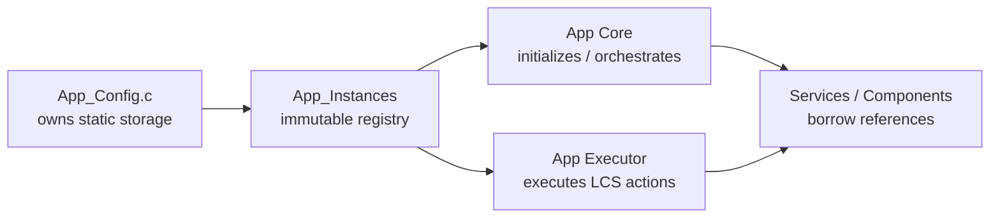
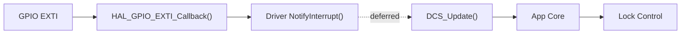

# App Configuration and Runtime Registry

`App/Config` is the **product composition boundary** of the Application Layer.

It centralizes the product-specific bindings, compile-time policy and statically allocated runtime-object graph required by App Core and App Executor, while keeping those details behind the public [`App_Core.h`](../Core/Inc/App_Core.h) interface.

> [!IMPORTANT]
> `App_Config.h` is an **internal application header**. Firmware entry points outside `App/` shall include `App_Core.h`, not `App_Config.h`.

> [!IMPORTANT]
> App Config defines **what objects and bindings exist**. It does not initialize the dependency graph, execute product workflow or decide Lock Control behavior.

---

## Contents

1. [Purpose and Scope](#1-purpose-and-scope)
2. [Directory Structure](#2-directory-structure)
3. [Ownership and Lifetime](#3-ownership-and-lifetime)
4. [Product Configuration](#4-product-configuration)
5. [Hardware Bindings](#5-hardware-bindings)
6. [Keyboard Configuration](#6-keyboard-configuration)
7. [Timeout Configuration](#7-timeout-configuration)
8. [Runtime Registry](#8-runtime-registry)
9. [Interrupt Callback Bridge](#9-interrupt-callback-bridge)
10. [Credential Storage in RAM](#10-credential-storage-in-ram)
11. [Dependency and Visibility Rules](#11-dependency-and-visibility-rules)
12. [Documentation Authority](#12-documentation-authority)

---

## 1. Purpose and Scope

The module has two related responsibilities:

1. define product-specific compile-time bindings and policy in `Inc/App_Config.h`;
2. own the static storage used to compose the application runtime graph in `Src/App_Config.c`.

It owns:

- LCD geometry, PCF8574 address and LCD-backlight PWM policy;
- Matrix Keyboard dimensions, key map, active level and debounce policy;
- buzzer and status-indication hardware bindings;
- Lock Actuator, Door Sensor and Exit Button Platform descriptors and component handles;
- Door Sensor and Exit Button debounce policy;
- application-owned Door Sensor and Exit Button event slots;
- the synchronous DCS Door Sensor status slot;
- application timeout identifiers and durations;
- the synchronous LCS follow-up bound;
- compile-time credential-length compatibility checks;
- instance-based Status Indication Service runtimes;
- transient and retained application credential buffers;
- the immutable `App_RuntimeInstances_t` registry.

It does **not**:

- initialize GPIO, PWM, I2C, components or services;
- execute Matrix Keyboard acquisition;
- process Door Sensor or Exit Button debounce;
- dispatch LCS events;
- execute `LCS_Action_t`;
- authorize lock or unlock operations;
- own DCS lock-interlock policy;
- own the mutable active-timeout lifecycle;
- allocate memory dynamically;
- expose configuration objects through the public App API.

The boundary is:

```text
App Config
    ↓
product bindings + static storage
    ↓
App Core / App Executor
    ↓
initialization + orchestration + action execution
```

---

## 2. Directory Structure

```text
Config/
├── Inc/
│   └── App_Config.h
├── Src/
│   ├── App_Config.c
│   └── App_ConfigHalCallbacks.c
└── README.md
```

| File | Responsibility |
| --- | --- |
| `Inc/App_Config.h` | Internal product bindings, policy constants, timeout types, compile-time assertions and runtime-registry declaration |
| `Src/App_Config.c` | Static runtime-object storage, immutable keyboard policy and registry bindings |
| `Src/App_ConfigHalCallbacks.c` | Strong HAL EXTI bridge for the application-owned Door Sensor and Exit Button inputs |
| `README.md` | Composition, ownership and binding reference |

---

## 3. Ownership and Lifetime

All objects defined by `App_Config.c` have **static storage duration**.

This is required because Platform descriptors, adapters, components and services retain borrowed pointers that must remain valid for the entire firmware lifetime.



`App_Instances` is immutable as a registry:

- registry bindings cannot be replaced after composition;
- referenced handles remain mutable because they contain normal runtime state;
- ownership does not transfer when Core, Executor or a service mutates a referenced object.

No application configuration object is dynamically allocated or freed.

### Ownership rule

```text
storage owner     = App Config
initialization    = App Core
product decisions = Lock Control
side effects      = App Executor / services
```

Door Control itself is singleton-based and therefore does not require a DCS handle inside `App_RuntimeInstances_t`. App Config instead owns the component handles and output slots that are attached to DCS during application initialization.

---

## 4. Product Configuration

### 4.1 Display

| Setting | Current value |
| --- | ---: |
| Visible columns | 16 |
| Rows | 2 (`LCD_2LINE`) |
| Interface | 4-bit (`LCD_4BIT_MODE`) |
| Font | 5x8 (`LCD_5X8_FONT`) |
| PCF8574 7-bit address | `0x20` |
| I2C context | `hi2c1` |
| Backlight PWM context | `htim4` |
| Backlight Platform channel | `PWM_CHANNEL_1` |
| Backlight PWM frequency | 1500 Hz |
| Initial brightness | 50% |

### 4.2 Matrix Keyboard

| Setting | Current value |
| --- | ---: |
| Rows | 4 |
| Columns | 4 |
| Keys | 16 |
| Row interpretation | Active low |
| Scan-adapter active level | Low |
| Debounce | 40 ms |

### 4.3 Sound and indications

| Setting | Current value |
| --- | --- |
| Buzzer PWM context | `htim3` |
| Buzzer Platform channel | `PWM_CHANNEL_1` |
| Lock-status LED active level | High |
| Low-battery LED active level | High |

### 4.4 Door mechanism

| Setting | Current value |
| --- | --- |
| Lock actuator binding | CubeMX `LOCK_ACTUATOR` |
| Locked command | Active low |
| Door Sensor binding | CubeMX `DOOR_SENSOR` |
| Door Sensor active contact | Low |
| Door Sensor debounce | 500 ms |
| Exit Button binding | CubeMX `EXIT_BUTTON` |
| Exit Button pressed level | Low |
| Exit Button debounce | 20 ms |
| Runtime mechanism coordinator | Door Control Service |

The Door Sensor and Exit Button intentionally use different debounce intervals.

The HAL callback path only publishes edge timestamps. Stable-event generation and normal actuator interlocking remain outside ISR context.

### 4.5 Application timing policy

| Setting | Current value |
| --- | ---: |
| Credential-entry inactivity | 5,000 ms |
| Door-position confirmation | 800 ms |
| Access-denied feedback | 1,500 ms |
| Lockout | 10,000 ms |
| Credential-saved feedback | 1,500 ms |
| Maximum synchronous LCS dispatch iterations | 4 |

These values are compile-time product policy rather than runtime settings.

Changing one can require coordinated changes to service behavior, tests and documentation.

---

## 5. Hardware Bindings

`App_Config.h` binds the application to **CubeMX-generated symbols** instead of hard-coding HAL GPIO masks.

The current physical baseline is:

| Product function | Current physical assignment | App binding |
| --- | --- | --- |
| Keyboard row 0 | PB15 | `APP_KEYBOARD_ROW_0_*` |
| Keyboard row 1 | PB14 | `APP_KEYBOARD_ROW_1_*` |
| Keyboard row 2 | PB13 | `APP_KEYBOARD_ROW_2_*` |
| Keyboard row 3 | PB12 | `APP_KEYBOARD_ROW_3_*` |
| Keyboard column 0 | PA6 | `APP_KEYBOARD_COL_0_*` |
| Keyboard column 1 | PA5 | `APP_KEYBOARD_COL_1_*` |
| Keyboard column 2 | PA4 | `APP_KEYBOARD_COL_2_*` |
| Keyboard column 3 | PA3 | `APP_KEYBOARD_COL_3_*` |
| LCD PCF8574 bus | I2C1, PB8/PB9 | `APP_LCD_IO_EXPANDER_I2C_CONTEXT` |
| LCD backlight | TIM4 CH1, PB6 | `APP_LCD_BACKLIGHT_PWM_*` |
| Passive buzzer | TIM3 CH1, PB4 | `APP_BUZZER_PWM_*` |
| Lock-status LED | PB10 | `APP_LOCK_STATUS_LED_*` |
| Low-battery LED | PB11 | `APP_LOW_BATTERY_STATUS_LED_*` |
| Lock actuator | **PA8** | `APP_LOCK_ACTUATOR_*` |
| Door Sensor | PA11 | `APP_DOOR_SENSOR_*` |
| Exit Button | PA0 | `APP_EXIT_BUTTON_*` |

### Binding authority

The table above is a **human-readable snapshot**, not the canonical hardware-definition mechanism.

Use:

- `Electronic-Lock.ioc` for physical MCU pin/peripheral assignment;
- CubeMX-generated symbols such as `LOCK_ACTUATOR_Pin` and `LOCK_ACTUATOR_GPIO_Port` for generated code bindings;
- `App_Config.h` for the application-side adaptation of those symbols into product policy.

For example:

```text
Electronic-Lock.ioc
    ↓
PA8 = LOCK_ACTUATOR
    ↓
CubeMX main.h symbols
    ↓
APP_LOCK_ACTUATOR_GPIO_PORT
APP_LOCK_ACTUATOR_PIN_NUMBER
    ↓
Platform GPIO descriptor initialization
```

GPIO `APP_*_PIN_NUMBER` definitions are **zero-based pin numbers**, derived from CubeMX HAL bit masks using `__builtin_ctz()`.

They are not HAL GPIO bit masks themselves.

### Interrupt-backed inputs

The application-owned EXTI inputs are:

| Input | Mode |
| --- | --- |
| Door Sensor / PA11 | Pull-up, rising/falling EXTI |
| Exit Button / PA0 | Pull-up, rising/falling EXTI |

Keyboard rows are also configured as EXTI-capable inputs by CubeMX, but normal keyboard acquisition currently belongs to the Matrix Keyboard polling/scan path and is not routed through `App_ConfigHalCallbacks.c`.

---

## 6. Keyboard Configuration

`App_KeyboardKeyMap` is immutable and stored in physical row-major order:

```text
1 2 3 A
4 5 6 B
7 8 9 C
* 0 # D
```

The retained `App_KeyboardConfig` binds:

- row count;
- column count;
- key map;
- `MK_KEY_ACTIVE_LOW`;
- 40 ms debounce policy.

The Matrix Keyboard Driver borrows both the configuration and key map after initialization, so both remain application-owned static objects.

`App_KeyboardKeys` contains one retained runtime state object per physical key.

The application shall not directly modify those runtime entries after they are supplied to the driver.

The `APP_CREDENTIAL_ENTRY_DIGIT_*` constants keep physical key codes separate from the numeric values expected by Credential Entry Service.

`APP_CREDENTIAL_ENTRY_DIGIT_INVALID` (`0xFF`) represents a CES command that carries no numeric digit.

---

## 7. Timeout Configuration

App Config owns **timeout identity and duration policy**.

App Core owns the mutable lifecycle of the currently active timeout.

| Identifier | Duration | Elapsed LCS event |
| --- | ---: | --- |
| `APP_TIMEOUT_CREDENTIAL_ENTRY` | 5,000 ms | `LCS_EVENT_ENTRY_TIMEOUT` |
| `APP_DOOR_SENSOR_CONFIRMATION_TIMEOUT` | 800 ms | `LCS_EVENT_DOOR_SENSOR_CONFIRMATION_TIMEOUT` |
| `APP_TIMEOUT_ACCESS_DENIED` | 1,500 ms | `LCS_EVENT_DENIED_ACCESS_TIMEOUT` |
| `APP_TIMEOUT_LOCKOUT` | 10,000 ms | `LCS_EVENT_LOCKOUT_TIMEOUT` |
| `APP_TIMEOUT_CRS_SAVED` | 1,500 ms | `LCS_EVENT_CREDENTIAL_REGISTER_DONE` |

The Door Sensor confirmation interval is **not** an unlock-duration timeout.

The previous fixed authorized-unlock interval has been replaced by the door-aware relock sequence.

### Timeout model

`App_TimeoutDefinition_t` contains immutable policy:

```text
duration
elapsed semantic LCS event
```

`App_TimeoutRuntime_t` contains mutable lifecycle state:

```text
selected timeout id
start timestamp
active flag
```

`APP_TIMEOUT_COUNT` is the number of concrete definitions.

`APP_TIMEOUT_NONE` aliases that value as a runtime sentinel and shall never be used as an array index.

---

## 8. Runtime Registry

`App_RuntimeInstances_t` exposes borrowed references to the stateful objects required by App Core and App Executor.

| Group | Application-owned objects |
| --- | --- |
| Keyboard | key map/config, GPIO arrays, scan adapter, per-key runtime and keyboard handle |
| Display | backlight PWM descriptor, PCF8574 handle and LCD handle |
| Sound | buzzer PWM descriptor and Buzzer handle |
| Lock indication | GPIO descriptor, LED handle and SIS runtime |
| Low-battery indication | GPIO descriptor, LED handle and SIS runtime |
| Lock actuator | GPIO descriptor and Lock Actuator handle |
| Door Sensor | GPIO descriptor, Door Sensor handle, transition-event slot and synchronous DCS status slot |
| Exit Button | GPIO descriptor, Exit Button handle and event slot |
| Credentials | transient candidate and retained installed credential |

### Event slots

`Door_Sensor_Event` and `Exit_Button_Event` are **publication slots**, not queues.

They exist so DCS/component update logic can publish a validated event for immediate application consumption.

`Door_Sensor_Status` serves a different purpose: it is the application-owned destination for the synchronous `DCS_GetSensorStatus()` operation used by the relock handshake.

### Service runtimes

Singleton services are not duplicated in the registry when their APIs do not require caller-owned handles.

Status Indication Service is different: the lock-status and low-battery indication paths each require their own `SIS_Handle_t` because they retain independent pattern, phase and timing state.

### Registry getter

`App_GetRuntimeInstances()` returns the same immutable registry address and performs no initialization.

```text
App_GetRuntimeInstances()
    ↓
App_Instance
    ↓
App_Init() initializes referenced objects
```

The presence of storage does not imply that a referenced driver or service is already initialized.

---

## 9. Interrupt Callback Bridge

`App_ConfigHalCallbacks.c` implements the strong:

```c
void HAL_GPIO_EXTI_Callback(uint16_t GPIO_Pin);
```

for the application-owned Door Sensor and Exit Button inputs.

Its contract is deliberately narrow.



The callback:

- ignores activity until `App_Instance` is bound;
- obtains the common application millisecond timestamp;
- identifies the supported HAL GPIO pin mask;
- calls `ExitButton_NotifyInterrupt()` or `DoorSensor_NotifyInterrupt()`;
- returns immediately.

It does **not**:

- read the GPIO state;
- wait for debounce;
- call DCS;
- call `LCS_Process()`;
- update UI;
- command the actuator.

Notifications that reach the component before its driver is initialized are expected to be rejected safely by the component contract.

---

## 10. Credential Storage in RAM

App Config owns two secret-bearing application buffers.

| Object | Lifetime | Purpose |
| --- | --- | --- |
| `App_RuntimeCandidate` | bounded synchronous transfer | carries a complete CES candidate to AUTH/CRS-related operations |
| `App_RuntimeCredential` | retained during normal runtime | stores the installed credential used by authentication |

The registry exposes pointers to these buffers only because App Core and App Executor are separate application translation units.

They remain internal implementation storage.

The application shall never expose their contents through:

- UI;
- logs;
- diagnostic strings;
- public APIs;
- documentation examples.

App Executor owns the corresponding explicit erasure behavior.

`App_Config.h` also defines compile-time assertions requiring credential length compatibility between:

- CES;
- Authentication Service;
- Credential Register Service;
- Credential Storage Service;
- Display Render Service.

If one participating contract changes independently, compilation shall fail rather than silently truncate or reinterpret credential data.

---

## 11. Dependency and Visibility Rules

- `App_Config.h` is internal to `App/`.
- Reusable Platform, component and service modules shall not include App Config.
- `App_Config.c` owns storage and policy, not product workflow.
- App Core owns initialization, input/event orchestration and active-timeout lifecycle.
- App Executor owns concrete side effects selected by `LCS_Action_t`.
- Lock Control owns product-state decisions.
- Door Control owns physical door-mechanism coordination and normal lock interlocking.
- `App_ConfigHalCallbacks.c` is restricted to HAL-to-driver interrupt handoff.
- New externally callable application behavior requires deliberate review of `App_Core.h`.
- The runtime registry shall not be exposed as a shortcut around Application Layer boundaries.

A useful test for placement is:

```text
Is this a compile-time product binding or retained application object?
    → App Config

Is this initialization or runtime event routing?
    → App Core

Is this execution of an LCS action?
    → App Executor

Is this product-state policy?
    → Lock Control
```

---

## 12. Documentation Authority

This README documents **App Config ownership, composition and bindings**.

It intentionally does not duplicate complete component/service API documentation.

Use the following artifacts as authoritative:

| Information | Source of truth |
| --- | --- |
| Physical MCU pin/peripheral assignment | [`../../Electronic-Lock.ioc`](../../Electronic-Lock.ioc) |
| CubeMX-generated pin/port symbols | generated `main.h` and peripheral headers |
| Product-side compile-time bindings and timing constants | [`Inc/App_Config.h`](Inc/App_Config.h) |
| Static application object storage | [`Src/App_Config.c`](Src/App_Config.c) |
| Runtime registry bindings | [`Src/App_Config.c`](Src/App_Config.c) |
| EXTI handoff behavior | [`Src/App_ConfigHalCallbacks.c`](Src/App_ConfigHalCallbacks.c) |
| Application orchestration | [`../README.md`](../README.md) and App Core source |
| Product FSM | Lock Control Service |
| Door-mechanism policy | Door Control Service |

The hardware tables in this README are maintained for readability only.

When a physical pin assignment changes, `Electronic-Lock.ioc` shall be updated first; App Config shall continue binding through the corresponding CubeMX symbols, and this README shall then be synchronized with the new baseline.

---

This module follows the project's [license terms](../../LICENSE).
