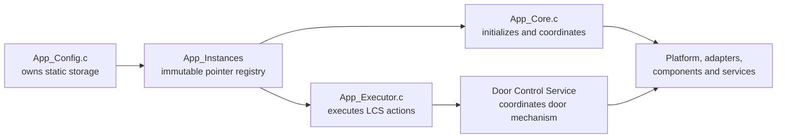

# App Configuration and Runtime Registry

`App/Config` centralizes the electronic lock's product policy, STM32 bindings
and statically allocated application object graph. It separates **what the
product is composed from** from **how App Core initializes and orchestrates it**
and **how App Executor applies Lock Control actions**.

> [!IMPORTANT]
> This is an internal application module. Firmware entry points outside `App/`
> must include [`App_Core.h`](../Core/Inc/App_Core.h), not `App_Config.h`.

---

## Table of Contents

1. [Purpose and Scope](#1-purpose-and-scope)
2. [Directory Structure](#2-directory-structure)
3. [Ownership Model](#3-ownership-model)
4. [Configuration Catalog](#4-configuration-catalog)
5. [Hardware Bindings](#5-hardware-bindings)
6. [Keyboard Configuration](#6-keyboard-configuration)
7. [Timeout Configuration](#7-timeout-configuration)
8. [Runtime Registry](#8-runtime-registry)
9. [Initialization Contract](#9-initialization-contract)
10. [Credential Storage in RAM](#10-credential-storage-in-ram)
11. [Dependency and Visibility Rules](#11-dependency-and-visibility-rules)
12. [Changing the Configuration](#12-changing-the-configuration)
13. [Validation Checklist](#13-validation-checklist)
14. [License](#14-license)

---

## 1. Purpose and Scope

The module has two related responsibilities:

1. Declare product-level constants, internal data types and the runtime-registry
   contract in `Inc/App_Config.h`.
2. Own the retained dependency objects, component runtimes, event/status slots
   and credential storage published through one immutable registry from
   `Src/App_Config.c`.

It owns:

- LCD geometry, PCF8574 address, PWM selection and initial brightness policy;
- matrix-keyboard dimensions, logical key map, active level and debounce policy;
- buzzer and status-indication hardware bindings;
- lock-actuator, door-sensor and exit-button Platform descriptors and component handles;
- door-sensor and exit-button interrupt/debounce policy;
- caller-owned Door Sensor and Exit Button event slots;
- the synchronous Door Control sensor-status output slot;
- application timeout identifiers, durations and dispatch-depth bound;
- compile-time credential-length compatibility checks;
- instance-based Status Indication Service runtimes;
- transient and retained credential buffers;
- the `App_RuntimeInstances_t` registry returned by
  `App_GetRuntimeInstances()`.

It does not:

- initialize GPIO, PWM, I2C-backed components or services;
- execute input processing or debounce logic;
- dispatch Lock Control events;
- execute an `LCS_Action_t`;
- decide whether an actuator request is authorized;
- own Door Control Service policy;
- own the mutable active-timeout lifecycle;
- allocate memory dynamically;
- expose any configuration object through the public App API.

---

## 2. Directory Structure

```text
Config/
├── Inc/
│   └── App_Config.h
├── Src/
│   ├── App_Config.c
│   └── App_ConfigHalCallbacks.c
└── README.md
```

| File | Responsibility |
|---|---|
| `Inc/App_Config.h` | Internal dependency imports, `APP_*` policy definitions, compile-time assertions, timeout data model and runtime-registry declaration |
| `Src/App_Config.c` | Immutable keyboard policy, static runtime-object storage, event/status slots, registry bindings and getter implementation |
| `Src/App_ConfigHalCallbacks.c` | Strong HAL GPIO EXTI bridge that forwards Door Sensor and Exit Button edge timestamps to their application-owned drivers |
| `README.md` | Configuration ownership, hardware bindings, runtime-registry contract and maintenance guidance |

---

## 3. Ownership Model



`App_Instances` is declared as `const App_RuntimeInstances_t`: the registry
bindings themselves cannot be replaced after composition. Most objects referenced
by the registry remain mutable because they hold component or service runtime state.

All retained objects have static storage duration. This is required because
drivers, adapters and services borrow dependency pointers that must remain valid
for the complete firmware lifetime.

`App_Config.c` remains the storage owner even when App Core, App Executor or a
service mutates a referenced runtime object. No ownership transfer occurs.

The Door Control Service itself is singleton-based and therefore does not require
a DCS handle in `App_RuntimeInstances_t`. The registry instead exposes the
component handles and application-owned event/status slots required to attach and
integrate DCS.

---

## 4. Configuration Catalog

### Display

| Setting | Value |
|---|---:|
| Visible columns | 16 |
| Rows | 2 (`LCD_2LINE`) |
| Interface | 4-bit (`LCD_4BIT_MODE`) |
| Font | 5x8 (`LCD_5X8_FONT`) |
| PCF8574 address | `0x20` |
| I2C context | `hi2c1` |
| Backlight PWM context | `htim4` |
| Backlight PWM channel | `PWM_CHANNEL_1` |
| Backlight frequency | 1500 Hz |
| Initial brightness | 50% |

### Keyboard

| Setting | Value |
|---|---:|
| Rows | 4 |
| Columns | 4 |
| Keys | 16 |
| Row interpretation | Active low |
| Scan-adapter active level | Low |
| Debounce | 40 ms |

### Sound and indications

| Setting | Value |
|---|---|
| Buzzer PWM context | `htim3` |
| Buzzer PWM channel | `PWM_CHANNEL_1` |
| Lock-status LED active level | High |
| Low-battery LED active level | High |

### Door mechanism

| Setting | Value |
|---|---|
| Lock actuator GPIO label | `LOCK_ACTUATOR` |
| Lock actuator documented board pin | PB8 |
| Locked command | Active low |
| Door sensor GPIO label | `DOOR_SENSOR` |
| Door sensor documented board pin | PA11 |
| Door sensor active contact | Low |
| Door sensor debounce quiet interval | 500 ms |
| Door sensor input mode | Pull-up, rising/falling EXTI |
| Exit button GPIO label | `EXIT_BUTTON` |
| Exit button documented board pin | PA0 |
| Exit button pressed level | Low |
| Exit button debounce quiet interval | 20 ms |
| Exit button input mode | Pull-up, rising/falling EXTI |
| Runtime mechanism coordinator | Door Control Service |

The application owns the three physical door-mechanism component handles, while
the Door Control Service coordinates their runtime use. The HAL EXTI bridge only
publishes edge timestamps to the Door Sensor and Exit Button Drivers. Debounce,
stable-event generation and normal actuator interlocking are intentionally kept
outside interrupt context.

The Door Sensor and Exit Button use different debounce policies: the Door Sensor
requires 500 ms of quiet time after the newest edge, while the Exit Button
requires 20 ms.

### Application policy

| Setting | Value |
|---|---:|
| Credential-entry timeout | 5,000 ms |
| Door-position confirmation delay | 800 ms |
| Access-denied feedback interval | 1,500 ms |
| Lockout interval | 10,000 ms |
| Credential-register saved feedback | 1,500 ms |
| Maximum synchronous LCS follow-ups | 4 |
| CES no-digit sentinel | `0xFF` |

The compile-time constants are product policy, not runtime settings. Changing
one may require corresponding CubeMX, driver, service, application,
documentation or test updates.

---

## 5. Hardware Bindings

`App_Config.h` intentionally binds application policy to CubeMX-generated
symbols rather than duplicating HAL bit-mask values. The following table reflects
the bindings supported directly by the current App Config source.

| Product function | Current App binding | Configuration symbol |
|---|---|---|
| Keyboard row 0 | CubeMX `KEYBOARD_ROW_0` GPIO | `APP_KEYBOARD_ROW_0_*` |
| Keyboard row 1 | CubeMX `KEYBOARD_ROW_1` GPIO | `APP_KEYBOARD_ROW_1_*` |
| Keyboard row 2 | CubeMX `KEYBOARD_ROW_2` GPIO | `APP_KEYBOARD_ROW_2_*` |
| Keyboard row 3 | CubeMX `KEYBOARD_ROW_3` GPIO | `APP_KEYBOARD_ROW_3_*` |
| Keyboard column 0 | CubeMX `KEYBOARD_COL_0` GPIO | `APP_KEYBOARD_COL_0_*` |
| Keyboard column 1 | CubeMX `KEYBOARD_COL_1` GPIO | `APP_KEYBOARD_COL_1_*` |
| Keyboard column 2 | CubeMX `KEYBOARD_COL_2` GPIO | `APP_KEYBOARD_COL_2_*` |
| Keyboard column 3 | CubeMX `KEYBOARD_COL_3` GPIO | `APP_KEYBOARD_COL_3_*` |
| LCD PCF8574 bus | I2C1 (`hi2c1`) | `APP_LCD_IO_EXPANDER_I2C_CONTEXT` |
| LCD backlight | TIM4, `PWM_CHANNEL_1` | `APP_LCD_BACKLIGHT_PWM_*` |
| Passive buzzer | TIM3, `PWM_CHANNEL_1` | `APP_BUZZER_PWM_*` |
| Lock-status LED | CubeMX `LOCK_STATUS_LED`, active high | `APP_LOCK_STATUS_LED_*` |
| Low-battery LED | CubeMX `LOW_BATTERY_STATUS_LED`, active high | `APP_LOW_BATTERY_STATUS_LED_*` |
| Lock actuator | CubeMX `LOCK_ACTUATOR`; documented as PB8; active-low lock command | `APP_LOCK_ACTUATOR_*` |
| Door sensor | CubeMX `DOOR_SENSOR`; documented as PA11; pull-up, active low, rising/falling EXTI | `APP_DOOR_SENSOR_*` |
| Exit button | CubeMX `EXIT_BUTTON`; documented as PA0; pull-up, active low, rising/falling EXTI | `APP_EXIT_BUTTON_*` |

GPIO pin-number definitions such as `APP_DOOR_SENSOR_PIN_NUMBER` are zero-based
pin indexes derived with `__builtin_ctz()` from the CubeMX HAL pin bit mask.
They are not HAL GPIO bit masks themselves. `PGPIO_Init()` receives the
Platform representation expected by the application.

Physical MCU pin assignments that are not explicitly encoded or documented by
the App Config source should be treated as CubeMX-owned configuration and
verified against `Electronic-Lock.ioc` rather than duplicated speculatively in
this README.

The Door Sensor and Exit Button are the interrupt-backed inputs owned by this
module. Their EXTI callback path shall only publish edge timestamps to the
corresponding driver. Keyboard acquisition remains owned by the Matrix Keyboard
Driver and its scan adapter.

---

## 6. Keyboard Configuration

`App_KeyboardKeyMap` is immutable and stored in physical row-major order:

```text
1 2 3 A
4 5 6 B
7 8 9 C
* 0 # D
```

`App_KeyboardConfig` binds:

- `APP_KEYBOARD_ROW_COUNT`;
- `APP_KEYBOARD_COLUMN_COUNT`;
- `App_KeyboardKeyMap`;
- `MK_KEY_ACTIVE_LOW`;
- `APP_KEYBOARD_DEBOUNCE_MS`.

The Matrix Keyboard Driver borrows both the key map and configuration object
after initialization, so neither may have automatic storage duration.

`App_KeyboardKeys` provides one retained debounce/action runtime per physical
key. Application code shall not directly modify those entries after they are
supplied to the driver.

The numeric `APP_CREDENTIAL_ENTRY_DIGIT_*` definitions keep physical key codes
separate from `CES_Input_t` numeric values.
`APP_CREDENTIAL_ENTRY_DIGIT_INVALID` (`0xFF`) represents a command with no
numeric credential digit.

---

## 7. Timeout Configuration

`App_Config.h` owns the timeout identifier and duration policy. The mutable
timeout lifecycle remains outside App Config and uses `App_TimeoutRuntime_t`.

| Identifier | Duration definition | Current value | Semantic elapsed event |
|---|---|---:|---|
| `APP_TIMEOUT_CREDENTIAL_ENTRY` | `APP_CREDENTIAL_ENTRY_TIMEOUT_MS` | 5,000 ms | `LCS_EVENT_ENTRY_TIMEOUT` |
| `APP_DOOR_SENSOR_CONFIRMATION_TIMEOUT` | `APP_DOOR_SENSOR_CONFIRMATION_TIMEOUT_MS` | 800 ms | `LCS_EVENT_DOOR_SENSOR_CONFIRMATION_TIMEOUT` |
| `APP_TIMEOUT_ACCESS_DENIED` | `APP_ACCESS_DENIED_TIMEOUT_MS` | 1,500 ms | `LCS_EVENT_DENIED_ACCESS_TIMEOUT` |
| `APP_TIMEOUT_LOCKOUT` | `APP_LOCKOUT_TIMEOUT_MS` | 10,000 ms | `LCS_EVENT_LOCKOUT_TIMEOUT` |
| `APP_TIMEOUT_CRS_SAVED` | `APP_CRS_SAVED_TIMEOUT_MS` | 1,500 ms | `LCS_EVENT_CREDENTIAL_REGISTER_DONE` |

The door-position confirmation timeout is **not an unlock-duration timeout**.
The old fixed unlock interval has been replaced by the door-aware relock flow.
After `LCS_EVENT_DOOR_POSITION_CONFIRMED`, the application starts the bounded
800 ms confirmation interval. When it expires,
`LCS_EVENT_DOOR_SENSOR_CONFIRMATION_TIMEOUT` advances LCS to the synchronous
door-condition confirmation stage.

`APP_TIMEOUT_COUNT` represents the number of concrete timeout definitions.
`APP_TIMEOUT_NONE` aliases that value and is a runtime sentinel; it shall never
index a timeout-definition table.

`App_TimeoutDefinition_t` contains immutable duration/event policy.
`App_TimeoutRuntime_t` contains the mutable selected identifier, monotonic start
timestamp and `Active` flag. `Active` is the authoritative validity field.

---

## 8. Runtime Registry

`App_RuntimeInstances_t` groups references by role:

| Registry member group | Concrete storage |
|---|---|
| `Keyboard_*`, `Keyboard` | immutable key policy, row/column GPIO arrays, GPIO scan adapter, 16 per-key runtimes and Matrix Keyboard handle |
| `Lcd_*`, `Lcd` | backlight PWM descriptor, PCF8574 handle and LCD handle |
| `Buzzer_*`, `Buzzer` | buzzer PWM descriptor and Buzzer Driver handle |
| `Lock_Status_*` | lock-status GPIO, LED handle and independent SIS runtime |
| `LowBattery_Status_*` | low-battery GPIO, LED handle and independent SIS runtime |
| `Lock_Actuator_Gpio`, `Lock_Actuator` | actuator Platform GPIO descriptor and Lock Actuator Driver handle |
| `Door_Sensor_Gpio`, `Door_Sensor` | Door Sensor Platform GPIO descriptor and interrupt-oriented driver handle |
| `Door_Sensor_Event` | caller-owned slot receiving the latest debounced Door Sensor transition |
| `Door_Sensor_Status` | caller-owned `DCS_SensorStatus_t` slot used for synchronous Door Control sensor-status queries |
| `Exit_Button_Gpio`, `Exit_Button` | Exit Button Platform GPIO descriptor and interrupt-oriented driver handle |
| `Exit_Button_Event` | caller-owned slot receiving the latest debounced Exit Button event |
| `Runtime_Candidate` | transient complete CES candidate transfer object |
| `Runtime_Credential` | installed credential retained in RAM |

The registry deliberately contains two Status Indication Service handles because
those instances retain independent indication, phase and timestamp state.

Singleton services, including Door Control, are not represented by duplicate
service handles in the registry. They are accessed through their normal public
APIs and are attached to the application-owned component/event context during
initialization.

`Door_Sensor_Event` and `Exit_Button_Event` are one-cycle event publication
slots, not queues. Their corresponding driver update functions overwrite the
slot on each processing cycle.

`Door_Sensor_Status` serves a different purpose: it is the application-owned
destination for an instantaneous `DCS_GetSensorStatus()` query used during the
door-confirmation/relock handshake.

`App_GetRuntimeInstances()` always returns the address of `App_Instances` and
has no initialization side effects. App Core stores that address in
`App_Instance` before building the usable dependency graph.

---

## 9. Initialization Contract

Configuration storage exists for the complete firmware lifetime, but storage
existence does not imply that any driver or service is initialized.

`App_Init()` is responsible for converting the statically allocated object graph
into a usable runtime graph. The current composition requires, at minimum:

1. bind `App_Instance` to the immutable registry;
2. initialize the lock-actuator Platform GPIO descriptor and Lock Actuator Driver;
3. initialize the Door Sensor Platform descriptor and driver with active-low
   interpretation and the 500 ms quiet interval;
4. initialize the Exit Button Platform descriptor and driver with active-low
   interpretation and the 20 ms quiet interval;
5. attach the three door-mechanism component handles to the Door Control Service;
6. attach `Exit_Button_Event` and `Door_Sensor_Event` as DCS event-output slots;
7. initialize the LCD/PCF8574/backlight/render path;
8. initialize keyboard GPIO descriptors, scan adapter and Matrix Keyboard Driver;
9. initialize buzzer PWM, Buzzer Driver and Sound Generator;
10. initialize both GPIO/LED/Status Indication paths;
11. initialize the remaining application services and select the valid startup
    route according to stored credential state.

The Door Sensor and Exit Button GPIOs are configured by CubeMX as interrupt
sources before normal application runtime. Their callback bridge may therefore
observe an edge before the corresponding driver is ready. The driver
`NotifyInterrupt()` contracts shall safely ignore notifications received before
initialization.

The HAL callback must remain a bounded handoff only:

```text
EXTI edge
   ↓
HAL_GPIO_EXTI_Callback()
   ↓
DoorSensor_NotifyInterrupt() / ExitButton_NotifyInterrupt()
   ↓
return from ISR

serialized application context
   ↓
DCS_Update()
   ↓
component debounce + stable event publication
```

No GPIO sampling, debounce waiting, service dispatch, Lock Control processing or
actuator command belongs in the EXTI callback.

Do not call `App_GetRuntimeInstances()` from unrelated modules to bypass this
lifecycle or gain access to internal application handles.

---

## 10. Credential Storage in RAM

Two secret-bearing objects are owned here:

| Object | Lifetime | Purpose | Erasure owner |
|---|---|---|---|
| `App_RuntimeCandidate` | One synchronous transfer | CES candidate copied for authentication, CRS staging or confirmation | App Executor clears the credential digit array after the synchronous consumer completes |
| `App_RuntimeCredential` | Across authentication requests | Credential loaded from CSS or installed after verified save | App Executor controlled-reset path; overwritten after successful replacement |

The registry exposes internal pointers to these buffers only because App Core
and App Executor are separate translation units. This is not permission to
expose, trace or persist them elsewhere.

Credential bytes must never appear in logs, debug messages, UI strings,
documentation examples or crash telemetry.

The `_Static_assert` declarations in `App_Config.h` require compatible lengths
for Credential Entry, Authentication, Credential Register, Credential Storage
and Display Render. If one participating contract changes independently, the
build must fail instead of silently truncating credential data.

---

## 11. Dependency and Visibility Rules

- `App_Config.h` may include the concrete types required to describe the internal
  registry.
- `App_Config.h` must not become a public application API.
- Platform, component and reusable-service modules must not depend on App Config.
- `App_Config.c` defines static storage, immutable policy and registry bindings;
  it must not grow workflow or state-machine decisions.
- `App_ConfigHalCallbacks.c` may publish interrupt activity to the Door Sensor
  and Exit Button Drivers, but it must not debounce inputs, call product
  services, process LCS events or command the actuator.
- App Core owns initialization, periodic orchestration, event translation and
  timeout lifecycle.
- App Executor owns concrete side effects for `LCS_Action_t`.
- Door Control owns physical door-mechanism coordination but not product FSM
  transitions.
- `App_Core_Internal.h` is the supported cross-translation-unit route for
  Core-owned internal application coordination.
- New externally callable behavior requires deliberate review of `App_Core.h`;
  do not expose the runtime registry as a shortcut.

---

## 12. Changing the Configuration

### Change a pin or peripheral

1. Update and regenerate the CubeMX configuration.
2. Update or verify the corresponding `APP_*` binding.
3. Confirm the generated GPIO/peripheral symbol and Platform conversion.
4. Confirm active polarity and interrupt edge configuration where applicable.
5. Update the hardware table in this README.
6. Build and validate on target hardware.

### Add a retained object

1. Declare static storage in `App_Config.c`.
2. Document its owner, borrower and required lifetime.
3. Add a typed pointer to `App_RuntimeInstances_t`.
4. Bind it in `App_Instances`.
5. Initialize or attach it in the correct fail-fast order from App Core.
6. Add cleanup or explicit erasure if the object carries sensitive state.

### Add an interrupt-backed input

1. Configure and label the GPIO/EXTI source in CubeMX.
2. Add the Platform descriptor, component handle and product policy to App Config.
3. Add any caller-owned event/status slot required by the runtime integration.
4. Initialize the Platform descriptor before the component handle.
5. Filter the generated HAL pin mask in `App_ConfigHalCallbacks.c`.
6. Keep the callback bounded to timestamp/sequence notification.
7. Perform GPIO sampling, debounce and product-policy translation in serialized
   application/service context.
8. Document behavior for notifications that arrive before component initialization.

### Add a timeout

1. Add a concrete `App_TimeoutId_t` identifier before `APP_TIMEOUT_COUNT`.
2. Add a nonzero duration definition.
3. Associate the timeout with the correct semantic LCS elapsed event.
4. Start/cancel it from the relevant application action path.
5. Update App documentation and LCS tests together.

### Change credential length

Update all participating service contracts together. Do not remove or weaken a
compile-time assertion merely to make an inconsistent build pass.

---

## 13. Validation Checklist

- [ ] `App_Config.h` contains no placeholder Doxygen text.
- [ ] Every registry member has an explicit role comment.
- [ ] Every static object in `App_Config.c` documents ownership and lifetime where relevant.
- [ ] `App_Instances` binds every member to correctly typed static storage.
- [ ] `Door_Sensor_Event`, `Door_Sensor_Status` and `Exit_Button_Event` have distinct documented roles.
- [ ] Door Sensor debounce is 500 ms and Exit Button debounce is 20 ms unless product policy intentionally changes.
- [ ] Door Sensor and Exit Button active levels match the electrical design.
- [ ] Door Sensor and Exit Button rising/falling EXTI configuration matches CubeMX.
- [ ] `App_ConfigHalCallbacks.c` contains no GPIO sampling, debounce, service dispatch or actuator command.
- [ ] HAL EXTI filtering forwards only supported application-owned interrupt sources.
- [ ] `APP_DOOR_SENSOR_CONFIRMATION_TIMEOUT_MS` maps to `LCS_EVENT_DOOR_SENSOR_CONFIRMATION_TIMEOUT`.
- [ ] Timeout identifiers and duration definitions remain aligned with the current LCS contract.
- [ ] The longest valid synchronous event chain fits `APP_MAX_LCS_DISPATCH_DEPTH`.
- [ ] Lock-status and low-battery LEDs remain consistent with `LED_ACTIVE_HIGH`.
- [ ] LCD backlight and buzzer PWM channel selections match their current `APP_*` definitions.
- [ ] Credential-length assertions compile.
- [ ] No credential value appears in source comments or documentation.
- [ ] App Config remains an internal application composition module rather than a public API.

See the [general App reference](../README.md) for execution, action dispatch,
safety and concurrency rules.

---

## 14. License

This module is part of the:

```text
Electronic Lock Project
```

and follows the project's license terms.
