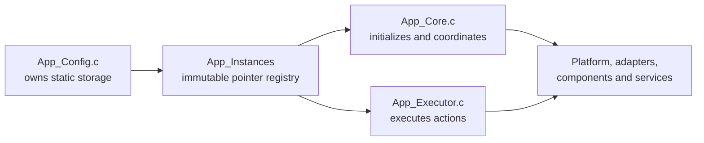

# App Configuration and Runtime Registry

`App/Config` centralizes the electronic lock's product policy, STM32 bindings
and statically allocated application object graph. It separates **what the
product is composed from** from **how App Core initializes and orchestrates it**
and **how App Executor applies Lock Control actions**.

> [!IMPORTANT]
> This is an internal application module. Firmware entry points outside `App/`
> must include [`App_Core.h`](../Core/Inc/App_Core.h), not `App_Config.h`.

---

## Table of Contents

1. [Purpose and Scope](#1-purpose-and-scope)
2. [Directory Structure](#2-directory-structure)
3. [Ownership Model](#3-ownership-model)
4. [Configuration Catalog](#4-configuration-catalog)
5. [Hardware Bindings](#5-hardware-bindings)
6. [Keyboard Configuration](#6-keyboard-configuration)
7. [Timeout Configuration](#7-timeout-configuration)
8. [Runtime Registry](#8-runtime-registry)
9. [Initialization Contract](#9-initialization-contract)
10. [Credential Storage in RAM](#10-credential-storage-in-ram)
11. [Dependency and Visibility Rules](#11-dependency-and-visibility-rules)
12. [Changing the Configuration](#12-changing-the-configuration)
13. [Validation Checklist](#13-validation-checklist)

---

## 1. Purpose and Scope

The module has two related responsibilities:

1. Declare product-level constants and internal data types in
   `Inc/App_Config.h`.
2. Own the retained dependency-object and credential storage published through
   one immutable registry from `Src/App_Config.c`.

It owns:

- LCD geometry, expander address, PWM selection and brightness policy;
- matrix-keyboard dimensions, pins, active level, debounce and logical key map;
- buzzer, status LED, lock actuator, door sensor and exit button bindings;
- exit-button debounce and HAL EXTI handoff configuration;
- application timeout durations and dispatch-depth bound;
- compile-time credential-length compatibility checks;
- Platform descriptors, adapter contexts and component handles;
- instance-based Status Indication Service runtimes;
- transient and retained credential buffers;
- the `App_RuntimeInstances_t` registry returned by
  `App_GetRuntimeInstances()`.

It does not:

- initialize GPIO, PWM, I2C-backed components or services;
- scan the keyboard or dispatch events;
- execute an `LCS_Action_t`;
- own the mutable active-timeout lifecycle;
- allocate memory dynamically;
- expose any configuration object through the public App API.

---

## 2. Directory Structure

```text
Config/
├── Inc/
│   └── App_Config.h
├── Src/
│   ├── App_Config.c
│   └── App_ConfigHalCallbacks.c
└── README.md
```

| File | Responsibility |
|---|---|
| `Inc/App_Config.h` | Internal dependency imports, `APP_*` definitions, compile-time assertions, timeout data model and registry declaration |
| `Src/App_Config.c` | Immutable keyboard policy, static runtime-object storage, registry bindings and getter implementation |
| `Src/App_ConfigHalCallbacks.c` | Strong HAL GPIO EXTI callback that forwards PB10 activity to the application-owned Exit Button Driver instance |
| `README.md` | Configuration ownership, hardware map and maintenance contract |

---

## 3. Ownership Model



The registry is `const App_RuntimeInstances_t`: member bindings cannot be
replaced after compilation. Most pointed-to objects are mutable because they
hold driver or service runtime state.

All objects have static storage duration. This is required because initialized
drivers and services retain borrowed dependency pointers for the complete
firmware lifetime.

`App_Config.c` remains the storage owner even when App Core or App Executor
mutates a referenced handle. No ownership transfer occurs.

---

## 4. Configuration Catalog

### Display

| Setting | Value |
|---|---:|
| Visible columns | 16 |
| Rows | 2 (`LCD_2LINE`) |
| Interface | 4-bit (`LCD_4BIT_MODE`) |
| Font | 5x8 (`LCD_5X8_FONT`) |
| PCF8574 address | `0x20` |
| I2C context | `hi2c1` |
| Backlight PWM | `htim4`, channel 4 |
| Backlight frequency | 1,500 Hz |
| Initial brightness | 50% |

### Keyboard

| Setting | Value |
|---|---:|
| Rows | 4 |
| Columns | 4 |
| Keys | 16 |
| Row active level | Low |
| Scan-adapter active level | Low |
| Debounce | 40 ms |

### Sound and indications

| Setting | Value |
|---|---|
| Buzzer PWM | `htim3`, channel 1 |
| Lock-status LED active level | Low |
| Low-battery LED active level | Low |

### Door mechanism

| Setting | Value |
|---|---|
| Lock-actuator locked command | PB8 LOW |
| Door-sensor active contact | PB0 LOW |
| Exit-button pressed level | PB10 LOW |
| Exit-button debounce | 20 ms |
| Exit-button EXTI | Rising and falling edges |
| Runtime policy owner | Planned Door Control Service |

The current App integration composes and initializes all three drivers. It also
publishes PB10 EXTI timestamps to the Exit Button Driver. Door-state sampling,
debounced exit-event consumption and coordinated actuator policy are not App
Config responsibilities and remain pending in the planned Door Control Service.

### Application policy

| Setting | Value |
|---|---:|
| Maximum synchronous LCS follow-ups | 4 |
| CES no-digit sentinel | `0xFF` |

The compile-time constants are policy, not runtime settings. Changing one may
require a corresponding CubeMX, driver, service, documentation or test change.

---

## 5. Hardware Bindings

The following table must remain consistent with
[`Electronic-Lock.ioc`](../../Electronic-Lock.ioc):

| Product function | Binding | Configuration symbol |
|---|---|---|
| Keyboard row 0 | PA3 | `APP_KEYBOARD_ROW_0_*` |
| Keyboard row 1 | PA2 | `APP_KEYBOARD_ROW_1_*` |
| Keyboard row 2 | PA1 | `APP_KEYBOARD_ROW_2_*` |
| Keyboard row 3 | PA0 | `APP_KEYBOARD_ROW_3_*` |
| Keyboard column 0 | PA7 | `APP_KEYBOARD_COL_0_*` |
| Keyboard column 1 | PA6 | `APP_KEYBOARD_COL_1_*` |
| Keyboard column 2 | PA5 | `APP_KEYBOARD_COL_2_*` |
| Keyboard column 3 | PA4 | `APP_KEYBOARD_COL_3_*` |
| LCD PCF8574 bus | I2C1 on PB6/PB7 | `APP_LCD_IO_EXPANDER_I2C_CONTEXT` |
| LCD backlight | TIM4 channel 4 on PB9 | `APP_LCD_BACKLIGHT_PWM_*` |
| Passive buzzer | TIM3 channel 1 on PB4 | `APP_BUZZER_PWM_*` |
| Lock-status LED | PA15, active low | `APP_LOCK_STATUS_LED_*` |
| Low-battery LED | PA12, active low | `APP_LOW_BATTERY_STATUS_LED_*` |
| Lock actuator | PB8; low requests locked state | `APP_LOCK_ACTUATOR_*` |
| Door sensor | PB0; pull-up input, low active contact | `APP_DOOR_SENSOR_*` |
| Exit button | PB10; pull-up, active low, rising/falling EXTI | `APP_EXIT_BUTTON_*` |

GPIO pin-number definitions are zero-based pin indexes, not HAL bit masks.
`PGPIO_Init()` performs the Platform-specific conversion.

CubeMX currently configures keyboard rows as rising/falling-edge EXTI inputs with
pull-ups and columns as push-pull outputs. App runtime acquisition remains
polling/cooperative through the Matrix Keyboard Driver; no App ISR consumes a
key event. The application HAL callback filters the GPIO pin and publishes only
the PB10 exit-button line to the Exit Button Driver.

---

## 6. Keyboard Configuration

`App_KeyboardKeyMap` is immutable and stored in physical row-major order:

```text
1 2 3 A
4 5 6 B
7 8 9 C
* 0 # D
```

`App_KeyboardConfig` binds:

- `APP_KEYBOARD_ROW_COUNT`;
- `APP_KEYBOARD_COLUMN_COUNT`;
- `App_KeyboardKeyMap`;
- `MK_KEY_ACTIVE_LOW` row interpretation;
- `APP_KEYBOARD_DEBOUNCE_MS`.

The Matrix Keyboard Driver borrows the key map and configuration after
`MK_Init()`. Therefore neither object may have automatic storage duration.

The numeric `APP_CREDENTIAL_ENTRY_DIGIT_*` definitions keep physical key codes
separate from `CES_Input_t` values. `APP_CREDENTIAL_ENTRY_DIGIT_INVALID` is used
for commands without a numeric payload.

---

## 7. Timeout Configuration

`App_Config.h` declares timeout identifiers, durations and their shared data
model. `App_Core.c` supplies the definition table and owns the mutable active
runtime.

| Identifier | Duration definition | Current value | Elapsed event |
|---|---|---:|---|
| `APP_TIMEOUT_CREDENTIAL_ENTRY` | `APP_CREDENTIAL_ENTRY_TIMEOUT_MS` | 5,000 ms | `LCS_EVENT_ENTRY_TIMEOUT` |
| `APP_TIMEOUT_UNLOCK` | `APP_UNLOCK_TIMEOUT_MS` | 3,000 ms | `LCS_EVENT_UNLOCK_TIMEOUT` |
| `APP_TIMEOUT_ACCESS_DENIED` | `APP_ACCESS_DENIED_TIMEOUT_MS` | 1,500 ms | `LCS_EVENT_DENIED_ACCESS_TIMEOUT` |
| `APP_TIMEOUT_LOCKOUT` | `APP_LOCKOUT_TIMEOUT_MS` | 10,000 ms | `LCS_EVENT_LOCKOUT_TIMEOUT` |
| `APP_TIMEOUT_CRS_SAVED` | `APP_CRS_SAVED_TIMEOUT_MS` | 1,500 ms | `LCS_EVENT_CREDENTIAL_REGISTER_DONE` |

`APP_TIMEOUT_COUNT` is both the number of concrete definitions and the value of
the `APP_TIMEOUT_NONE` sentinel. The sentinel must never index the timeout
definition table.

`App_TimeoutDefinition_t` is immutable policy. `App_TimeoutRuntime_t` is mutable
lifecycle state and uses `Active` as its authoritative validity flag.

---

## 8. Runtime Registry

`App_RuntimeInstances_t` groups references by role:

| Registry member group | Concrete storage |
|---|---|
| `Keyboard_*`, `Keyboard` | key policy, eight GPIO descriptors, scan adapter, 16 key runtimes and Matrix Keyboard handle |
| `Lcd_*`, `Lcd` | backlight PWM, PCF8574 handle and LCD handle |
| `Buzzer_*`, `Buzzer` | buzzer PWM and Buzzer Driver handle |
| `Lock_Status_*` | GPIO, LED handle and lock SIS runtime |
| `LowBattery_Status_*` | GPIO, LED handle and low-battery SIS runtime |
| `Lock_Actuator_Gpio`, `Lock_Actuator` | PB8 Platform descriptor and Lock Actuator Driver handle |
| `Door_Sensor_Gpio`, `Door_Sensor` | PB0 Platform descriptor and Door Sensor Driver handle |
| `Exit_Button_Gpio`, `Exit_Button` | PB10 Platform descriptor and Exit Button Driver handle |
| `Runtime_Candidate` | transient complete CES candidate copy |
| `Runtime_Credential` | installed credential retained in RAM |

The registry deliberately contains two Status Indication Service handles:
those instances retain independent semantic indication, phase and timestamp
state. Singleton services with no injected instance are called through their
normal public API and are not duplicated in the registry.

`App_GetRuntimeInstances()` always returns the address of `App_Instances` and
has no side effects. App Core stores that address in `App_Instance` at the start
of `App_Init()`.

---

## 9. Initialization Contract

Configuration storage starts zero-initialized except for immutable policy and
the LCD geometry/interface fields. Storage existence does not imply that an
object is ready.

Only `App_Init()` may establish the usable dependency graph. In order, it:

1. binds `App_Instance`;
2. binds the actuator GPIO descriptor after CubeMX has established the safe-low
   startup level and initializes the Lock Actuator Driver;
3. binds PB0 and initializes the Door Sensor Driver;
4. binds PB10 and initializes the Exit Button Driver with active-low polarity
   and a 20 ms debounce interval;
5. initializes the LCD/PCF8574/backlight/render path;
6. initializes keyboard GPIOs, driver and scan adapter;
7. initializes buzzer PWM, driver and Sound Generator;
8. initializes both GPIO/LED/SIS indication paths;
9. selects the first-registration or normal locked startup route.

CubeMX enables the PB10 EXTI before `App_Init()` runs. The callback bridge may
therefore execute during startup; `ExitButton_NotifyInterrupt()` safely ignores
notifications until the driver is initialized. A button state already present
at startup is not converted into an event unless a subsequent edge is observed
and the future Door Control Service processes it.

Do not call `App_GetRuntimeInstances()` from unrelated project modules to bypass
this lifecycle or gain access to internal handles.

---

## 10. Credential Storage in RAM

Two secret-bearing objects are owned here:

| Object | Lifetime | Purpose | Erasure owner |
|---|---|---|---|
| `App_RuntimeCandidate` | One synchronous transfer | CES candidate copied for authentication, CRS staging or confirmation | App Executor clears the digit array; length metadata is overwritten by the next copy |
| `App_RuntimeCredential` | Across authentication requests | Credential loaded from CSS or installed after verified save | App Executor controlled-reset path; overwritten after successful replacement |

The registry exports internal pointers to these buffers only because Core and
Executor are separate translation units. This is not permission to expose,
trace or persist them elsewhere.

Credential bytes must never appear in logs, debug messages, UI strings,
documentation examples or crash telemetry.

The `_Static_assert` declarations in `App_Config.h` require compatible lengths
for Credential Entry, Authentication, Credential Register, Credential Storage
and Display Render. If one contract changes independently, compilation must fail
instead of silently truncating data.

---

## 11. Dependency and Visibility Rules

- `App_Config.h` may include the concrete types needed to describe the internal
  registry.
- `App_Config.h` must not be included by `main.c`, Platforms, components or
  reusable services.
- `App_Config.c` defines storage and bindings only; it must not grow workflow or
  state-machine decisions.
- `App_ConfigHalCallbacks.c` may publish hardware interrupt activity to a
  driver, but it must not debounce input, call services or command actuators.
- App Core is responsible for initialization and periodic orchestration.
- App Executor is responsible for concrete `LCS_Action_t` side effects.
- `App_Core_Internal.h` is the supported cross-translation-unit route for the
  Core-owned timeout lifecycle.
- New externally callable behavior requires deliberate review of
  `App_Core.h`; do not expose the registry as a shortcut.

---

## 12. Changing the Configuration

### Change a pin or peripheral

1. Update and regenerate the CubeMX configuration.
2. Update the matching `APP_*` binding.
3. Confirm timer channel, GPIO active level and generated handle type.
4. Update the hardware table in this README.
5. Build and validate on the target.

### Add a retained object

1. Declare static storage in `App_Config.c`.
2. Document its owner, borrower and lifetime.
3. Add a typed pointer to `App_RuntimeInstances_t`.
4. Bind it in `App_Instances`.
5. Initialize it in the correct fail-fast order from App Core.
6. Add cleanup or explicit erasure if the object carries sensitive state.

### Add an interrupt-backed input

1. Configure and label the GPIO/EXTI line in CubeMX.
2. Add the Platform descriptor, component handle and board policy to App Config.
3. Initialize the Platform descriptor before the component handle.
4. Filter the generated HAL pin mask in `App_ConfigHalCallbacks.c`.
5. Keep the callback bounded to notification; perform debounce and policy in
   serialized application or service context.
6. Document whether notifications can arrive before component initialization.

### Add a timeout

1. Add a concrete identifier before `APP_TIMEOUT_COUNT`.
2. Add a nonzero duration definition.
3. Add the elapsed event mapping in `App_Core.c`.
4. Start/cancel it from the relevant Executor actions.
5. Update both App READMEs and LCS tests.

### Change credential length

Update the owning service contracts together. Do not disable an assertion to
make an inconsistent build pass.

---

## 13. Validation Checklist

- [ ] `App_Config.h` contains no placeholder Doxygen text.
- [ ] Every registry member has a role comment.
- [ ] Every static object in `App_Config.c` documents ownership and lifetime.
- [ ] `App_ConfigHalCallbacks.c` contains no policy, blocking work or actuator command.
- [ ] `App_Instances` binds every member to correctly sized static storage.
- [ ] Pin and peripheral definitions match `Electronic-Lock.ioc`.
- [ ] Active-level definitions match the electrical design.
- [ ] EXTI edge selection, pull configuration and HAL pin filtering match the `.ioc` file.
- [ ] Timeout durations and elapsed events match LCS behavior.
- [ ] The longest valid synchronous event chain fits the dispatch-depth bound.
- [ ] Credential-length assertions compile.
- [ ] No credential value appears in source comments or documentation.
- [ ] The firmware target compiles `App_Config.c` and includes `App/Config/Inc`.
- [ ] App Core remains the only public application API.

See the [general App reference](../README.md) for execution, action dispatch,
safety and concurrency rules.

## 14. License

This module is part of the:

```text
Electronic Lock Project
```

and follows the project's license terms.
