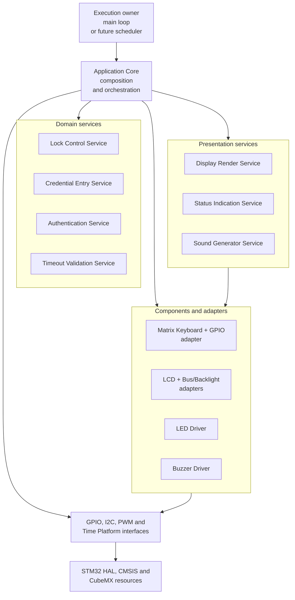
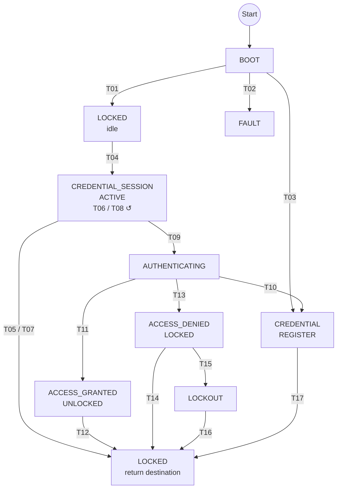
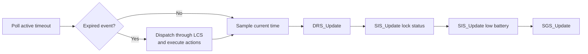
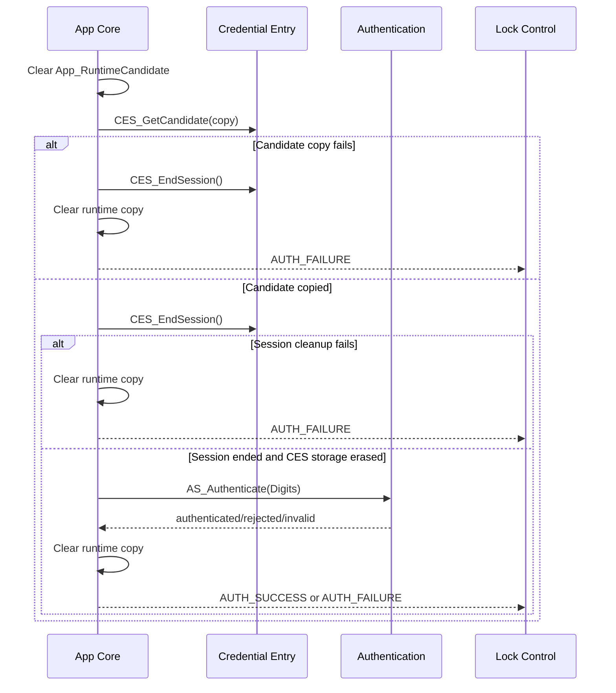

# Application Core

## Table of Contents

1. [Purpose](#1-purpose)
2. [Scope](#2-scope)
3. [Architectural Position](#3-architectural-position)
4. [Design Principles](#4-design-principles)
5. [Public API](#5-public-api)
6. [Current Execution Model](#6-current-execution-model)
7. [Product Configuration Owned by App Core](#7-product-configuration-owned-by-app-core)
8. [Static Object Graph and Ownership](#8-static-object-graph-and-ownership)
9. [Initialization Graph](#9-initialization-graph)
10. [Keyboard Model](#10-keyboard-model)
11. [Credential Entry Outcomes](#11-credential-entry-outcomes)
12. [Lock Control State Machine Integration](#12-lock-control-state-machine-integration)
13. [LCS Event Sources](#13-lcs-event-sources)
14. [LCS Action Execution](#14-lcs-action-execution)
15. [Application Timeout Model](#15-application-timeout-model)
16. [Service Update Cycle](#16-service-update-cycle)
17. [Presentation Policy](#17-presentation-policy)
18. [Authentication and Credential Security](#18-authentication-and-credential-security)
19. [Bounded Synchronous Follow-up Dispatch](#19-bounded-synchronous-follow-up-dispatch)
20. [Failure Policy](#20-failure-policy)
21. [Business Rules and Invariants](#21-business-rules-and-invariants)
22. [Private Function Catalog](#22-private-function-catalog)
23. [Timing and Concurrency Constraints](#23-timing-and-concurrency-constraints)
24. [Known Constraints and Deferred Work](#24-known-constraints-and-deferred-work)
25. [Extension Rules](#25-extension-rules)
26. [Verification Checklist](#26-verification-checklist)
27. [Related Documentation](#27-related-documentation)

---

## 1. Purpose

The Application Core is the composition root and product-orchestration layer of
the electronic lock. It connects the CubeMX-generated hardware resources,
Platform interfaces, component drivers, adapters, domain services and
presentation services into one serialized application flow.

The module is implemented by:

- [`Inc/App_Core.h`](Inc/App_Core.h), which exposes the public lifecycle and
  execution API;
- [`Src/App_Core.c`](Src/App_Core.c), which owns the complete application object
  graph and all orchestration logic.

This document is the detailed behavioral reference for the implemented
Application Core. The public headers remain authoritative for API signatures,
the service READMEs remain authoritative for service-internal behavior, and
[`Electronic-Lock.ioc`](../../Electronic-Lock.ioc) remains authoritative for
CubeMX-managed peripheral and pin configuration.

The timeout values defined in `App_Core.c` are the current product timeout
policy and shall be treated as the correct application values:

| Product interval | Value |
| --- | ---: |
| Credential-entry inactivity | 5,000 ms |
| Authorized unlock | 3,000 ms |
| Access-denied feedback | 1,500 ms |
| Lockout | 10,000 ms |

---

## 2. Scope

### 2.1 Responsibilities

The Application Core is responsible for:

- owning the static-duration Platform, adapter, driver and instance-based
  service objects required by the product;
- binding those objects to CubeMX-generated GPIO, I2C and timer resources;
- initializing the dependency graph in a fail-fast order;
- forcing the lock actuator into its safe electrical state during startup and
  fault handling;
- acquiring debounced matrix-keyboard output;
- translating physical key codes into semantic Credential Entry Service input;
- implementing the wake-key policy;
- routing Credential Entry Service outcomes into presentation updates or Lock
  Control Service events;
- copying, authenticating and explicitly erasing candidate credentials;
- executing every currently integrated semantic action returned by the Lock
  Control Service and tracking new contract actions until their executors are
  implemented;
- owning the application-level timeout lifecycle;
- polling elapsed time and converting timeout expiration into semantic LCS
  events;
- coordinating the display, status indications and sound feedback;
- bounding synchronous follow-up event processing;
- requesting a controlled reset when the application cannot preserve a
  trustworthy operational flow.

### 2.2 Non-responsibilities

The Application Core does not:

- own the authoritative product state machine;
- own the consecutive authentication-failure counter;
- define the valid credential value;
- store a persistent credential;
- implement matrix scanning or debounce algorithms;
- render HD44780 commands directly;
- implement LED or buzzer pattern sequencing;
- perform rollover arithmetic itself;
- own a hardware timer interrupt for application timeouts;
- block until a human-scale timeout or feedback pattern completes;
- provide mechanical confirmation that the lock moved;
- implement battery measurement or power-management policy;
- create an RTOS task, queue, mutex or software timer;
- provide a dedicated Lock Actuator Driver in the current revision.

The Lock Control Service owns product transition policy. The Application Core
executes the action selected by that policy without creating a competing state
machine.

---

## 3. Architectural Position



The arrows describe allowed dependency direction, not autonomous calls between
every box. In particular, LCS does not invoke another service. It returns an
`LCS_Action_t`, and the Application Core coordinates the required modules.

---

## 4. Design Principles

### 4.1 Serialized execution

The current implementation is synchronous and cooperative. `App_ReadInput()`
and `App_Dispatch()` are expected to be called from one serialized execution
context. They are not reentrant and are not designed for simultaneous calls
from an ISR, multiple tasks or multiple cores.

### 4.2 Non-blocking product timing

Credential-entry, unlock, denial and lockout intervals are represented by a
start timestamp, an immutable duration and a semantic elapsed event. The
Application Core never waits for one of these intervals to finish.

Display operations may contain bounded device-protocol delays required by the
LCD implementation. Those low-level delays are distinct from product timing.

### 4.3 Semantic boundaries

Hardware-level facts are normalized before they reach domain services:

```text
GPIO matrix state
    -> MK_Output_t
    -> CES_Input_t
    -> CES_Event_t
    -> LCS_Event_t
    -> LCS_Action_t
    -> coordinated presentation and hardware operations
```

### 4.4 Safe actuator independence

Forcing the actuator safe is a direct Application-to-Platform operation. It
does not depend on the LCD, LED or sound path succeeding. Presentation failure
must not prevent the application from driving the actuator output low.

### 4.5 Static ownership

All retained objects have static storage duration. No application-owned dynamic
allocation is used. Drivers and services borrow pointers to objects whose
lifetime covers the complete firmware execution.

### 4.6 Explicit credential erasure

The Credential Entry Service owns its internal candidate and erases it when the
session is refreshed or ended. The Application Core owns a temporary
authentication copy and erases the complete object through volatile byte writes
after every copy, cleanup or authentication path.

---

## 5. Public API

```c
App_InitStatus_t App_Init(void);
void App_ReadInput(void);
void App_Dispatch(void);
```

### 5.1 `App_Init()`

`App_Init()` constructs the complete application dependency graph.

Preconditions:

- HAL initialization has completed;
- the system clock has been configured;
- CubeMX GPIO, I2C and timer initialization functions have completed;
- the generated peripheral handles are valid.

Successful behavior:

1. Initialize and force-safe the actuator path.
2. Initialize the LCD, bus adapter, backlight and Display Render Service.
3. Initialize the keyboard GPIO objects, Matrix Keyboard Driver and scan
   adapter.
4. Initialize the PWM, Buzzer Driver and Sound Generator Service.
5. Initialize the lock-status LED path.
6. Initialize the low-battery LED path.
7. Dispatch `LCS_EVENT_INIT_OK` directly to LCS.
8. Restore the locked-idle presentation.
9. Return `APP_INIT_SUCCESSFULLY`.

This is the currently implemented startup path. Although LCS now declares
`LCS_EVENT_CREDENTIAL_NOT_REGISTERED`, `App_Init()` does not yet inspect
persistent credential availability or dispatch that event. The LCS inactive
gate also currently rejects it. First-boot registration therefore remains an
explicit integration item rather than implemented startup behavior.

Failure behavior:

1. Stop evaluating the remaining initializer chain.
2. Request the actuator safe state when the actuator object is usable.
3. Dispatch `LCS_EVENT_INIT_FAIL` while LCS remains in boot.
4. Execute `LCS_ACTION_REQUEST_CONTROLLED_RESET`.
5. Cancel timing, erase CES state, force the actuator safe, stop sound, turn the
   LCD backlight off, disable interrupts and request `NVIC_SystemReset()`.

The reset endpoint is not expected to return on the target. The
`APP_INIT_FAILED` result is retained as a defensive API contract.

### 5.2 `App_ReadInput()`

`App_ReadInput()` performs exactly one non-blocking keyboard acquisition and
processes a completed click when one is available. That processing may
synchronously dispatch LCS events, execute actions, authenticate a ready
candidate and issue immediate presentation requests.

It does not:

- poll the application timeout;
- execute the periodic all-service update cycle owned by `App_Dispatch()`;
- wait for a key;
- delay the caller deliberately.

The execution owner should call it continuously at a cadence compatible with
the 40 ms debounce policy.

If keyboard acquisition fails, the function invokes the conservative input
fault policy described in [Section 20.2](#202-keyboard-acquisition-failure).

### 5.3 `App_Dispatch()`

`App_Dispatch()` performs one service-dispatch cycle by calling
`App_UpdateServices()`.

The cycle:

1. polls the single active application timeout;
2. dispatches one elapsed timeout event and all bounded synchronous follow-ups;
3. advances the Display Render Service;
4. advances the lock-status indication;
5. advances the low-battery indication;
6. advances the Sound Generator Service.

It does not acquire keyboard input. The execution owner must call
`App_ReadInput()` separately.

The dispatch cadence defines timeout-observation latency and pattern-update
jitter. If a timeout expires between calls, it is observed during the next
`App_Dispatch()` call.

---

## 6. Current Execution Model

The Application Core does not contain a scheduler. The owner of the execution
loop determines when the two runtime entry points execute.

A suitable cooperative integration is:

```c
#define APP_SERVICE_DISPATCH_PERIOD_MS (20U)

int main(void)
{
    HAL_Init();
    SystemClock_Config();

    MX_GPIO_Init();
    MX_I2C1_Init();
    MX_TIM3_Init();
    MX_TIM2_Init();
    MX_TIM4_Init();

    if(App_Init() != APP_INIT_SUCCESSFULLY)
    {
        Error_Handler();
    }

    uint32_t last_dispatch_ms = Platform_GetMillis();

    for(;;)
    {
        App_ReadInput();

        uint32_t now_ms = Platform_GetMillis();

        if((now_ms - last_dispatch_ms) >= APP_SERVICE_DISPATCH_PERIOD_MS)
        {
            last_dispatch_ms = now_ms;
            App_Dispatch();
        }
    }
}
```

The `20U` value above is an integration example, not an Application Core
constant. Product timeouts remain correct independently of that nominal period,
but their observable reaction can be delayed by the dispatch cadence and any
blocking work performed by the execution owner.

Current integration requirements:

- call `App_Init()` exactly once after CubeMX initialization;
- do not call runtime APIs before successful initialization;
- call `App_ReadInput()` frequently enough for keyboard acquisition and
  debounce;
- call `App_Dispatch()` periodically even when no key is pressed;
- serialize both calls;
- never call either function from an interrupt handler;
- avoid unbounded work in the same execution context.

---

## 7. Product Configuration Owned by App Core

The current revision keeps product and board composition constants private in
`App_Core.c`.

### 7.1 User-interface configuration

| Setting | Value | Meaning |
| --- | ---: | --- |
| LCD columns | 16 | Product LCD width |
| LCD rows | 2 | Selected through `LCD_2LINE` |
| LCD bus mode | 4-bit | Selected through `LCD_4BIT_MODE` |
| LCD font | 5x8 | Selected through `LCD_5X8_FONT` |
| PCF8574 address | `0x20` | I2C expander address passed to its driver |
| Backlight PWM | TIM4 channel 4 | CubeMX resource retained by Platform PWM |
| Backlight frequency | 1,500 Hz | Requested during LCD-path initialization |
| Initial brightness | 50% | Applied after `LCD_Init()` |
| Keyboard geometry | 4x4 | Sixteen physical keys |
| Keyboard active level | Low | Active-low matrix interpretation |
| Keyboard debounce | 40 ms | Required stable interval |

### 7.2 Keyboard pin composition

| Logical position | MCU pin |
| --- | --- |
| Row 0 | PA3 |
| Row 1 | PA2 |
| Row 2 | PA1 |
| Row 3 | PA0 |
| Column 0 | PA7 |
| Column 1 | PA6 |
| Column 2 | PA5 |
| Column 3 | PA4 |

### 7.3 Output composition

| Output | Binding | Electrical policy |
| --- | --- | --- |
| Sound-feedback buzzer | TIM3 channel 1 / PB4 | PWM controlled through Buzzer Driver |
| Lock-status LED | PA15 | Active low |
| Low-battery LED | PA12 | Active low |
| Lock actuator | PB8 | Low is safe/locked; high requests unlock |

### 7.4 Credential configuration

The credential length is fixed by the Credential Entry and Authentication
service contracts. Compile-time assertions require:

```text
CES_CREDENTIAL_LENGTH == AS_CREDENTIAL_LENGTH
CES_CREDENTIAL_LENGTH == DRS_ENTRY_DIGIT_CAPACITY
```

The configured credential value is private to the Authentication Service and
must not be copied into this README, logs, traces or UI output.

---

## 8. Static Object Graph and Ownership

| Object or state | Storage owner | Borrowed by | Runtime role |
| --- | --- | --- | --- |
| Keyboard row GPIO array | App Core | Keyboard GPIO adapter | Four input descriptors |
| Keyboard column GPIO array | App Core | Keyboard GPIO adapter | Four scan-output descriptors |
| Keyboard scan-adapter context | App Core | Adapter interface | Row/column binding and active level |
| Per-key state array | App Core | Matrix Keyboard Driver | Debounce/action state for 16 keys |
| Matrix Keyboard handle | App Core | App input path | Acquisition and debouncing |
| LCD backlight PWM handle | App Core | Backlight adapter | TIM4 channel 4 abstraction |
| PCF8574 handle | App Core | LCD bus adapter | LCD I/O-expander state |
| LCD handle | App Core | Display Render Service | LCD bus, backlight and geometry |
| Buzzer PWM handle | App Core | Buzzer Driver | TIM3 channel 1 abstraction |
| Buzzer handle | App Core | Sound Generator Service | Audible output dependency |
| Lock-status GPIO and LED | App Core | Lock SIS instance | Lock indication path |
| Low-battery GPIO and LED | App Core | Low-battery SIS instance | Battery indication path |
| Two SIS runtime handles | App Core | App dispatch path | Independent LED pattern state |
| Actuator GPIO handle | App Core | App action path | Temporary actuator boundary |
| Runtime candidate copy | App Core | Authentication call only | Short-lived credential copy |
| Active timeout runtime | App Core | App timeout helpers | One mutually exclusive interval |
| CES, AS, DRS, SGS and LCS state | Owning service | App Core through public API | Service-specific state |

The Application Core never transfers ownership of its objects. Initialization
functions inject borrowed pointers whose lifetime is guaranteed by static
storage.

---

## 9. Initialization Graph

### 9.1 Actuator path

```text
PGPIO_Init(PB8)
    -> App_ForceLock()
    -> PB8 low
```

The actuator is initialized first so later UI or input initialization failures
cannot leave an application-controlled unsafe output.

### 9.2 LCD path

```text
PCF8574_Init(I2C1, 0x20)
    -> LCD_PCF8574_BusAdapterInit()
    -> PPWM_Create(TIM4 CH4)
    -> PPWM_Init()
    -> PPWM_SetFrequency(1500 Hz)
    -> LCD_PWM_BacklightAdapterInit()
    -> LCD_Init(16x2, 4-bit, 5x8)
    -> LCD_SetBrightness(50%)
    -> DRS_Init()
```

### 9.3 Keyboard path

```text
PGPIO_Init(4 rows)
    -> PGPIO_Init(4 columns)
    -> MK_Init(4x4 map, active low, 40 ms debounce)
    -> MK_GPIO_ScanAdapterInit()
```

### 9.4 Sound path

```text
PPWM_Create(TIM3 CH1)
    -> Buzzer_Init()
    -> SGS_Init()
```

### 9.5 Status-indication paths

Each LED follows:

```text
PGPIO_Init()
    -> LED_Init(active low)
    -> SIS_Init()
```

The lock-status and low-battery paths use separate LED and SIS instances, so
their pattern state is independent.

### 9.6 LCS activation

LCS begins in its private `BOOT` state through static initialization. App Core
dispatches `LCS_EVENT_INIT_OK` only after every critical initializer succeeds.
The transition activates LCS and commits the secure `LOCKED` state.

The expanded LCS table also declares a `BOOT + CREDENTIAL_NOT_REGISTERED`
route to delegated credential registration. App Core does not yet select that
route, and the current LCS activation gate admits only `INIT_OK` and
`INIT_FAIL`. Startup credential discovery, gate reconciliation and the exact
activation effect of first registration must be implemented together before
this route is operational.

---

## 10. Keyboard Model

### 10.1 Physical key map

The immutable row-major key map is:

| Row | Column 0 | Column 1 | Column 2 | Column 3 |
| ---: | :---: | :---: | :---: | :---: |
| 0 | `1` | `2` | `3` | `A` |
| 1 | `4` | `5` | `6` | `B` |
| 2 | `7` | `8` | `9` | `C` |
| 3 | `*` | `0` | `#` | `D` |

Only `MK_KEY_ACTION_CLICK` is processed by App Core. Other action values are
ignored.

### 10.2 Semantic translation

| Key | CES input kind | Digit field |
| --- | --- | ---: |
| `0` through `9` | `CES_INPUT_KIND_DIGIT` | Normalized value 0 through 9 |
| `#` | `CES_INPUT_KIND_CONFIRM` | Invalid sentinel; ignored by CES |
| `*` | `CES_INPUT_KIND_CLEAR_CANCEL` | Invalid sentinel; ignored by CES |
| `A`, `B`, `C`, `D` or unknown | `CES_INPUT_KIND_NONE` | Invalid sentinel |

### 10.3 Wake-key policy

Every debounced click is first offered to LCS as
`LCS_EVENT_CREDENTIAL_ENTRY_REQUESTED`.

If LCS is `LOCKED`, it returns
`LCS_ACTION_BEGIN_CREDENTIAL_ENTRY_SESSION`. App Core begins CES, starts the
entry timeout, wakes the UI and consumes the physical click. The same click is
never forwarded as a credential digit or command.

Consequences:

- any physical key, including `A` through `D`, `*` or `#`, can wake the UI;
- the wake key has no credential meaning;
- credential input begins with a later click;
- while LCS is in any state that rejects the entry request, the returned action
  is normally `LCS_ACTION_NONE`, and App Core then offers supported keys to CES;
- during lockout, CES is inactive and therefore no credential mutation occurs.

The expanded LCS contract accepts `LCS_EVENT_CREDENTIAL_REGISTER_REQUESTED`
only while `CREDENTIAL_SESSION_ACTIVE`. App Core does not yet map a physical
key or command to that event. When added, the initiating registration command
must not become a credential digit, and execution of
`REFRESH_CREDENTIAL_ENTRY_TO_REGISTER_SESSION` must erase any digits already
entered for unlock.

### 10.4 Acquisition and EXTI boundary

`App_ReadInput()` invokes one complete `MK_Read()` acquisition. Matrix scan,
debounce progression and pending-action selection execute synchronously inside
that call; no call waits for the future completion of a debounce interval.

The current CubeMX configuration assigns falling-edge EXTI lines to the four
row pins, but App Core does not register or consume a keyboard interrupt
callback. The implemented acquisition contract is polling through
`App_ReadInput()`. EXTI must therefore not be treated as a substitute for the
continuous read cadence, and App Core entry points must not be called directly
from those interrupts.

---

## 11. Credential Entry Outcomes

| CES outcome | App Core behavior | Timeout effect | LCS interaction |
| --- | --- | --- | --- |
| `CES_EVENT_NONE` | Ignore | None | None |
| `CES_EVENT_INPUT_ACCEPTED` | Read current length, render masked progress and play keypress | Restart 5 s entry timeout | None |
| `CES_EVENT_INCOMPLETE` | Dispatch incomplete semantic event | Refresh action restarts 5 s timeout | `LCS_EVENT_CANDIDATE_INCOMPLETE` |
| `CES_EVENT_CLEARED` | Render empty candidate and play keypress | Current implementation does not restart timeout | None |
| `CES_EVENT_READY` | Begin authentication flow | Authentication action cancels entry timeout | `LCS_EVENT_CANDIDATE_READY` |
| `CES_EVENT_CANCELLED` | End entry and restore locked idle | End action cancels timeout | `LCS_EVENT_CREDENTIAL_CANCELLED` |

### 11.1 Accepted digits

After a digit is accepted:

1. obtain the authoritative length from CES;
2. replace the active timeout with a fresh 5,000 ms entry timeout;
3. request `DRS_SCREEN_PASSWORD_ENTRY`;
4. set the masked digit count when it fits the display capacity;
5. render immediately;
6. request `SGS_RINGTONE_KEYPRESS`.

No raw digit is supplied to the Display Render Service.

### 11.2 Incomplete confirmation

Confirmation with fewer than six digits produces
`CES_EVENT_INCOMPLETE`. App Core dispatches
`LCS_EVENT_CANDIDATE_INCOMPLETE`.

LCS performs a self-transition in `CREDENTIAL_SESSION_ACTIVE` and returns
`LCS_ACTION_REFRESH_CREDENTIAL_ENTRY_SESSION`. App Core then:

1. calls `CES_RefreshSession()` to erase the candidate while preserving the
   active session;
2. restarts the 5,000 ms timeout;
3. requests the entry-incomplete ringtone;
4. restores the empty password-entry presentation.

`App_SetCredentialEntryPresentation()` also requests the lower-priority
keypress ringtone. The Sound Generator priority policy preserves the already
active incomplete-feedback ringtone.

### 11.3 Clear versus cancel

The `*` key has context-sensitive behavior owned by CES:

- when the candidate is non-empty, CES erases it and reports
  `CES_EVENT_CLEARED`; the session remains active;
- when the candidate is empty, CES ends the session and reports
  `CES_EVENT_CANCELLED`; LCS returns to `LOCKED`.

The current App Core does not restart the entry timeout for
`CES_EVENT_CLEARED`. This is an implemented behavior and must be changed in code
and documentation together if product policy later requires clear activity to
restart the interval.

---

## 12. Lock Control State Machine Integration

LCS owns these private runtime states:

- `BOOT`;
- `LOCKED`;
- `CREDENTIAL_REGISTER`;
- `CREDENTIAL_SESSION_ACTIVE`;
- `AUTHENTICATING`;
- `ACCESS_GRANTED_UNLOCKED`;
- `ACCESS_DENIED_LOCKED`;
- `LOCKOUT`;
- `FAULT`.

It also owns a private `pending_request` value. Normal entry sets the purpose to
unlock; an accepted registration request changes it to credential registration.
The value is preserved through entry and authentication, then used to select
the deterministic destination of `AUTH_SUCCESS`.

> [!IMPORTANT]
> The diagram and table below describe the current LCS contract. The current
> `App_Core.c` still implements only the pre-registration subset: it does not
> yet produce the three registration events or execute the three
> registration-specific actions. Those integration gaps are listed in
> [Section 24](#24-known-constraints-and-deferred-work).

For this state machine, one representation is not sufficient:

- the diagram provides a compact operational map;
- the transition table is the exact implementation reference.

The diagram intentionally uses only transition IDs on its edges. Events,
guards, internal effects and actions are recorded in the table immediately
afterward.

### 12.1 Operational transition map



`LOCKED` is drawn twice only to create a clean convergence rail. Both boxes
represent the same `LCS_STATE_LOCKED` runtime state; the lower box is not an
additional state. `T05` and `T07` share that rail because cancellation and
entry timeout have the same target but different actions. `T06` changes the
pending purpose to registration and `T08` preserves it after incomplete entry;
both are self-transitions represented by the `↺` marker.

### 12.2 Complete transition table

To keep the table readable, identifiers omit their column-specific prefixes.

| Transition | Source | Event | Guard | Pending discriminator | Target | Internal effect | Action |
| --- | --- | --- | --- | --- | --- | --- | --- |
| `T01` | `BOOT` | `INIT_OK` | `ALWAYS` | `NONE` | `LOCKED` | `SET_SERVICE_ACTIVE` | `NONE` |
| `T02` | `BOOT` | `INIT_FAIL` | `ALWAYS` | `NONE` | `FAULT` | `NONE` | `REQUEST_CONTROLLED_RESET` |
| `T03` | `BOOT` | `CREDENTIAL_NOT_REGISTERED` | `ALWAYS` | `NONE` | `CREDENTIAL_REGISTER` | `NONE` | `BEGIN_CREDENTIAL_REGISTER_SESSION` |
| `T04` | `LOCKED` | `CREDENTIAL_ENTRY_REQUESTED` | `ALWAYS` | `NONE` | `CREDENTIAL_SESSION_ACTIVE` | `SET_PENDING_UNLOCK` | `BEGIN_CREDENTIAL_ENTRY_SESSION` |
| `T05` | `CREDENTIAL_SESSION_ACTIVE` | `CREDENTIAL_CANCELLED` | `ALWAYS` | `NONE` | `LOCKED` | `CLEAR_PENDING` | `END_CREDENTIAL_ENTRY_SESSION` |
| `T06` | `CREDENTIAL_SESSION_ACTIVE` | `CREDENTIAL_REGISTER_REQUESTED` | `ALWAYS` | `NONE` | `CREDENTIAL_SESSION_ACTIVE` | `SET_PENDING_REGISTER_SESSION` | `REFRESH_CREDENTIAL_ENTRY_TO_REGISTER_SESSION` |
| `T07` | `CREDENTIAL_SESSION_ACTIVE` | `ENTRY_TIMEOUT` | `ALWAYS` | `NONE` | `LOCKED` | `CLEAR_PENDING` | `RETURN_TO_LOCKED_FROM_ENTRY_TIMEOUT` |
| `T08` | `CREDENTIAL_SESSION_ACTIVE` | `CANDIDATE_INCOMPLETE` | `ALWAYS` | `NONE` | `CREDENTIAL_SESSION_ACTIVE` | `NONE` | `REFRESH_CREDENTIAL_ENTRY_SESSION` |
| `T09` | `CREDENTIAL_SESSION_ACTIVE` | `CANDIDATE_READY` | `ALWAYS` | `NONE` | `AUTHENTICATING` | `NONE` | `REQUEST_AUTHENTICATION` |
| `T10` | `AUTHENTICATING` | `AUTH_SUCCESS` | `ALWAYS` | `CREDENTIAL_REGISTER` | `CREDENTIAL_REGISTER` | `CLEAR_PENDING_AND_RESET_ATTEMPT_COUNT` | `BEGIN_CREDENTIAL_REGISTER_SESSION` |
| `T11` | `AUTHENTICATING` | `AUTH_SUCCESS` | `ALWAYS` | `UNLOCK` | `ACCESS_GRANTED_UNLOCKED` | `CLEAR_PENDING_AND_RESET_ATTEMPT_COUNT` | `GRANT_ACCESS_UNLOCK` |
| `T12` | `ACCESS_GRANTED_UNLOCKED` | `UNLOCK_TIMEOUT` | `ALWAYS` | `NONE` | `LOCKED` | `CLEAR_PENDING` | `RETURN_TO_LOCKED` |
| `T13` | `AUTHENTICATING` | `AUTH_FAILURE` | `ALWAYS` | `NONE` | `ACCESS_DENIED_LOCKED` | `CLEAR_PENDING_AND_INCREMENT_ATTEMPT_COUNT` | `DENY_ACCESS` |
| `T14` | `ACCESS_DENIED_LOCKED` | `DENIED_ACCESS_TIMEOUT` | `UNDER_ATTEMPT_LIMIT` | `NONE` | `LOCKED` | `CLEAR_PENDING` | `RETURN_TO_LOCKED` |
| `T15` | `ACCESS_DENIED_LOCKED` | `DENIED_ACCESS_TIMEOUT` | `ATTEMPT_COUNT_LIMIT` | `NONE` | `LOCKOUT` | `CLEAR_PENDING` | `ENTER_LOCKOUT` |
| `T16` | `LOCKOUT` | `LOCKOUT_TIMEOUT` | `ALWAYS` | `NONE` | `LOCKED` | `RESET_ATTEMPT_COUNT` | `RETURN_TO_LOCKED` |
| `T17` | `CREDENTIAL_REGISTER` | `CREDENTIAL_REGISTER_DONE` | `ALWAYS` | `NONE` | `LOCKED` | `CLEAR_PENDING` | `RETURN_TO_LOCKED_FROM_CREDENTIAL_REGISTER_SESSION` |

### 12.3 Transition semantics

- LCS scans its transition table in declaration order and selects the first
  source/event record whose guard evaluates true.
- The two access-denied timeout records are intentionally adjacent and use
  mutually exclusive guards.
- The two authentication-success records share state, event and guard, but
  their pending discriminators are mutually exclusive.
- `AUTH_SUCCESS` with no pending request produces no transition.
- Authentication failure clears the pending purpose and increments the failure
  count before denial feedback begins.
- The failure counter saturates at three. Consequently,
  `LCS_GUARD_ATTEMPT_COUNT_LIMIT` is equivalent to `failures >= 3`, and the
  third consecutive denial routes to lockout.
- Authentication success clears the pending request and resets the failure
  counter; lockout expiry resets the failure counter.
- Cancellation and entry timeout explicitly clear the pending request.
- Entry timeout and user cancellation reach the same locked state through
  different actions because timeout feedback is distinct from ordinary session
  cancellation.
- LCS applies the internal effect and commits the target state before returning
  the action.
- If no transition matches, LCS preserves its runtime state and returns
  `LCS_ACTION_NONE`.
- App Core executes the returned action as the concrete realization of the
  accepted transition; [Section 14](#14-lcs-action-execution) describes those
  effects.

---

## 13. LCS Event Sources

Rows marked **pending integration** belong to the current LCS public contract
but are not yet emitted by `App_Core.c`.

| LCS event | App Core source | When dispatched |
| --- | --- | --- |
| `LCS_EVENT_INIT_OK` | `App_Init()` | Every critical initializer succeeded |
| `LCS_EVENT_INIT_FAIL` | `App_Init()` | Initializer chain failed |
| `LCS_EVENT_CREDENTIAL_NOT_REGISTERED` | Pending startup credential check | No persistent credential exists; **pending integration** |
| `LCS_EVENT_CREDENTIAL_REGISTER_REQUESTED` | Pending registration command mapping | User requests credential change during active entry; **pending integration** |
| `LCS_EVENT_CREDENTIAL_REGISTER_DONE` | Pending registration-session completion mapping | Delegated registration completed; **pending integration** |
| `LCS_EVENT_CREDENTIAL_ENTRY_REQUESTED` | Keyboard handler | Every accepted click before CES translation |
| `LCS_EVENT_CREDENTIAL_CANCELLED` | CES handler or fail-safe follow-up | Empty `*`, entry setup failure, refresh failure or input fault |
| `LCS_EVENT_CANDIDATE_READY` | CES handler | Complete six-digit candidate confirmed |
| `LCS_EVENT_CANDIDATE_INCOMPLETE` | CES handler | Candidate confirmed below required length |
| `LCS_EVENT_AUTH_SUCCESS` | Authentication helper | Configured credential matched |
| `LCS_EVENT_AUTH_FAILURE` | Authentication helper | Copy, cleanup or comparison failed |
| `LCS_EVENT_ENTRY_TIMEOUT` | Timeout poller | 5 s credential-entry interval elapsed |
| `LCS_EVENT_UNLOCK_TIMEOUT` | Timeout poller or unlock setup fallback | 3 s interval elapsed or unlock could not start safely |
| `LCS_EVENT_DENIED_ACCESS_TIMEOUT` | Timeout poller or denial setup fallback | 1.5 s interval elapsed or denial timing could not start |
| `LCS_EVENT_LOCKOUT_TIMEOUT` | Timeout poller or lockout setup fallback | 10 s interval elapsed or lockout timing could not start |

Sentinel and out-of-range LCS events are ignored by
`App_DispatchLcsEvent()`.

---

## 14. LCS Action Execution

| LCS action | Credential operations | Timeout operations | Actuator | Presentation | Possible follow-up |
| --- | --- | --- | --- | --- | --- |
| `NONE` | None | None | None | None | None |
| `BEGIN_CREDENTIAL_REGISTER_SESSION` | Delegate credential registration | Cancel obsolete entry timing | Preserve locked | Registration-owned presentation | `CREDENTIAL_REGISTER_DONE`; **pending integration** |
| `REFRESH_CREDENTIAL_ENTRY_TO_REGISTER_SESSION` | Erase/restart CES for current-credential authorization | Restart 5 s entry timeout | Preserve locked | Empty authorization-entry view | `CREDENTIAL_CANCELLED` on setup failure; **pending integration** |
| `BEGIN_CREDENTIAL_ENTRY_SESSION` | Begin CES | Start 5 s entry timeout | Preserve locked | Wake LCD, empty entry view, locked indication, keypress | `CREDENTIAL_CANCELLED` on setup failure |
| `REFRESH_CREDENTIAL_ENTRY_SESSION` | Erase candidate, keep CES active | Restart 5 s entry timeout | Preserve locked | Empty entry view and incomplete sound | `CREDENTIAL_CANCELLED` on refresh/timer failure |
| `END_CREDENTIAL_ENTRY_SESSION` | End and erase CES | Cancel active timeout | Force locked | Locked-idle view, backlight off, locked indication | None |
| `REQUEST_AUTHENTICATION` | Copy candidate, end CES, authenticate, erase copy | Cancel entry timeout | Preserve locked | No direct presentation | `AUTH_SUCCESS` or `AUTH_FAILURE` |
| `GRANT_ACCESS_UNLOCK` | CES already ended | Start 3 s unlock timeout before GPIO high | Request unlock | Granted screen, LED indication and ringtone | `UNLOCK_TIMEOUT` if timing or GPIO setup fails |
| `DENY_ACCESS` | Candidate already erased | Start 1.5 s denial timeout | Force locked | Denied screen, LED indication and error ringtone | `DENIED_ACCESS_TIMEOUT` if timing setup fails |
| `ENTER_LOCKOUT` | CES inactive | Start 10 s lockout timeout | Force locked | Lockout screen, LED indication and ringtone | `LOCKOUT_TIMEOUT` if timing setup fails |
| `RETURN_TO_LOCKED_FROM_ENTRY_TIMEOUT` | End and erase CES | Cancel timeout runtime | Force locked | Timeout ringtone, idle render, backlight off, locked indication | None |
| `RETURN_TO_LOCKED_FROM_CREDENTIAL_REGISTER_SESSION` | End delegated registration ownership | Cancel registration-owned timing | Force locked | Locked-idle presentation | None; **pending integration** |
| `RETURN_TO_LOCKED` | End CES defensively | Cancel active timeout | Force locked | Idle render, backlight off, locked indication | None |
| `REQUEST_CONTROLLED_RESET` | End and erase CES | Cancel active timeout | Force locked | Stop sound and turn backlight off | Does not return on target |

The current `App_ExecuteAction()` switch has no cases for the three rows marked
pending integration. Until those cases and event sources are implemented, the
LCS registration routes must not be considered operational at application
level even though they are present in the service FSM.

### 14.1 Safe unlock ordering

The grant action intentionally establishes the 3,000 ms timeout before driving
PB8 high:

```text
start finite timeout
    -> request GPIO high
    -> start success presentation
```

If timeout setup fails, App Core never requests unlock. If the GPIO set fails,
it cancels the timeout, forces the GPIO low and produces
`LCS_EVENT_UNLOCK_TIMEOUT` so the FSM returns to `LOCKED`.

### 14.2 Denial-to-lockout ordering

Lockout does not begin immediately when the third authentication fails. The
sequence is:

1. authentication failure increments the LCS counter to three;
2. App Core executes the 1,500 ms denial presentation;
3. `LCS_EVENT_DENIED_ACCESS_TIMEOUT` is dispatched;
4. the attempt-limit guard selects `LOCKOUT`;
5. App Core starts the 10,000 ms lockout interval and lockout presentation.

Therefore, the lockout interval begins after denial feedback completes.

---

## 15. Application Timeout Model

### 15.1 Authoritative timeout table

```c
static const App_TimeoutDefinition_t App_TimeoutDefinitions[APP_TIMEOUT_COUNT];
```

| Timeout ID | Duration | Elapsed event | Started by | Cancelled or replaced by |
| --- | ---: | --- | --- | --- |
| `APP_TIMEOUT_CREDENTIAL_ENTRY` | 5,000 ms | `LCS_EVENT_ENTRY_TIMEOUT` | Begin session, accepted digit, incomplete refresh | Authentication, cancellation, timeout handling, another timeout |
| `APP_TIMEOUT_UNLOCK` | 3,000 ms | `LCS_EVENT_UNLOCK_TIMEOUT` | Grant action before actuator high | Return-to-locked, reset, replacement |
| `APP_TIMEOUT_ACCESS_DENIED` | 1,500 ms | `LCS_EVENT_DENIED_ACCESS_TIMEOUT` | Deny action | Return-to-locked, enter lockout replacement, reset |
| `APP_TIMEOUT_LOCKOUT` | 10,000 ms | `LCS_EVENT_LOCKOUT_TIMEOUT` | Enter-lockout action | Lockout expiry, reset, replacement |

These values are the current and correct product timeout policy. Older values
in historical documents do not override this table.

### 15.2 Single active timeout

`App_ActiveTimeout` stores:

- the selected timeout ID;
- the monotonic start timestamp;
- an authoritative active flag.

Only one timeout can be active because the timed LCS operating states are
mutually exclusive. Starting a timeout intentionally replaces any previous
runtime.

Adding overlapping product intervals requires a redesign of this runtime model;
it is not sufficient to append another table record.

### 15.3 Starting or restarting

`App_StartTimeout()` validates:

- the ID is below `APP_TIMEOUT_COUNT`;
- the duration is nonzero;
- the elapsed event is a dispatchable LCS event.

It then stores `Platform_GetMillis()` and marks the timeout active. Calling the
function again is the restart mechanism.

### 15.4 Polling

`App_PollTimeout()` is called once per `App_Dispatch()` cycle.

It:

1. returns `LCS_EVENT_NONE` when no valid timeout is active;
2. reads the immutable definition;
3. samples `Platform_GetMillis()`;
4. calls `TVS_HasElapsed()` for rollover-safe validation;
5. returns `LCS_EVENT_NONE` if the interval is still pending;
6. copies the elapsed event;
7. cancels the runtime before returning the event.

Cancelling before return guarantees that the same expiration is emitted only
once, even if the resulting LCS action does not start a replacement interval.

### 15.5 No timeout around updates

There is no watchdog or execution deadline around `App_UpdateServices()`,
`DRS_Update()`, `SIS_Update()` or `SGS_Update()`.

The product timeouts above describe business intervals. They do not limit how
long an update function may execute. Because updates are sequential, a blocking
or excessively slow operation delays later updates and timeout observation.

### 15.6 Timing accuracy

Timeout expiration is detected by polling. Approximate reaction time is:

```text
configured duration
    + time until the next App_Dispatch()
    + execution time ahead of the relevant action
```

The duration comparison remains rollover-safe, but scheduling latency is owned
by the execution loop.

---

## 16. Service Update Cycle

`App_UpdateServices()` uses this strict order:



Important consequences:

- timeout actions are applied before presentation services advance;
- an elapsed event can replace the timeout and presentation state during the
  same dispatch cycle;
- DRS may already have been updated directly by an action; the later call is a
  no-op when requested and rendered state match;
- both LED instances are updated independently;
- SGS receives one shared timestamp captured after timeout dispatch;
- update return values are currently discarded by App Core;
- one service failure does not currently produce a global LCS fault event.

---

## 17. Presentation Policy

### 17.1 Locked idle

`App_SetLockedPresentation()`:

- requests `DRS_SCREEN_IDLE`;
- resets displayed entered digits to zero;
- renders while the LCD path is available;
- turns the backlight off;
- selects `SIS_INDICATION_LOCKED`.

It does not stop the active sound pattern. This permits action-specific sounds,
such as entry-timeout feedback, to continue after the display returns to idle.

### 17.2 Credential entry

`App_SetCredentialEntryPresentation()`:

- requests the keypress ringtone;
- turns the LCD backlight on;
- requests `DRS_SCREEN_PASSWORD_ENTRY`;
- resets the masked entered-digit count;
- renders immediately;
- selects the locked LED baseline.

### 17.3 Semantic presentation matrix

| Product situation | LCD screen | Backlight | Lock LED indication | Ringtone |
| --- | --- | --- | --- | --- |
| Locked idle | `IDLE` | Off | `LOCKED` | Existing accepted pattern may finish |
| Entry opened | `PASSWORD_ENTRY`, zero masks | On | `LOCKED` | `KEYPRESS` |
| Digit accepted | `PASSWORD_ENTRY`, updated masks | On | Unchanged | `KEYPRESS` |
| Candidate cleared | `PASSWORD_ENTRY`, zero masks | On | Unchanged | `KEYPRESS` |
| Candidate incomplete | `PASSWORD_ENTRY`, zero masks | On | `LOCKED` | `ENTRY_INCOMPLETE` |
| Access granted | `ACCESS_GRANTED` | On | `ACCESS_GRANTED` | `ACCESS_GRANTED` |
| Access denied | `ACCESS_DENIED` | On | `ACCESS_DENIED` | `ERROR` |
| Lockout | `LOCKOUT` | On | `LOCKOUT_ENTRY` | `LOCKOUT` |
| Entry timeout | Idle content rendered, then backlight off | Off | `LOCKED` | `ENTRY_TIMEOUT` |
| Controlled reset | No further render required | Off | Safe actuator has priority | Sound stopped |

`DRS_SCREEN_ENTRY_TIMEOUT` and `DRS_SCREEN_ENTRY_INCOMPLETE` exist in the
Display Render Service catalog but are not selected by the current App Core
flows. Current incomplete feedback returns directly to the empty password view,
and timeout feedback uses sound while restoring the idle display.

---

## 18. Authentication and Credential Security

### 18.1 Authentication sequence

The transfer and erasure sequence is shared by both LCS authentication
purposes. LCS, not App Core or AS, decides whether `AUTH_SUCCESS` grants unlock
or begins credential registration from its private pending request.



### 18.2 Erasure guarantees

The Application Core clears `App_RuntimeCandidate`:

- before requesting a CES copy;
- after copy failure;
- after CES session-ending failure;
- immediately after authentication, before reporting the result.

`CES_EndSession()` erases the service-owned candidate. `CES_RefreshSession()`
erases it without ending the session.

### 18.3 Security limitations

The V1 credential is compiled into firmware and compared synchronously. This is
appropriate only for an engineering prototype. The implementation does not
provide:

- encrypted credential storage;
- resistance to firmware extraction;
- constant-time comparison guarantees;
- multiple users or credential rotation;
- audit logging;
- tamper detection.

Raw credential values must never appear in documentation, logs or UI output.

---

## 19. Bounded Synchronous Follow-up Dispatch

Some actions immediately produce another semantic fact. For example:

```text
CANDIDATE_READY
    -> REQUEST_AUTHENTICATION
    -> AUTH_SUCCESS or AUTH_FAILURE
    -> GRANT_ACCESS_UNLOCK, BEGIN_CREDENTIAL_REGISTER_SESSION or DENY_ACCESS
```

`App_DispatchLcsEvent()` serializes these facts without recursively calling
itself. It uses a loop bounded by:

```c
#define APP_MAX_LCS_DISPATCH_DEPTH (4U)
```

For each iteration it:

1. calls `LCS_Process(pending_event)`;
2. receives one semantic action;
3. executes the action;
4. treats the returned follow-up event as the next pending event.

If a valid pending event remains after four iterations, App Core assumes an
untrustworthy action/event cycle. It cancels timing, ends CES, forces the
actuator safe, stops sound, turns off the backlight and requests a controlled
reset.

The helper may run from the `App_ReadInput()` path for credential and
authentication events or from the `App_Dispatch()` path for timeout events.
Both public operations must therefore share the same serialized execution
context.

---

## 20. Failure Policy

### 20.1 Initialization failure

Initialization failure is critical. Normal LCS operation is never activated.
The application requests the safe output and a controlled reset.

### 20.2 Keyboard acquisition failure

When `MK_Read()` fails, App Core:

1. dispatches `LCS_EVENT_CREDENTIAL_CANCELLED`;
2. turns the LCD backlight on;
3. requests the access-denied screen;
4. renders immediately;
5. requests the error ringtone.

If LCS is in `CREDENTIAL_SESSION_ACTIVE`, cancellation ends and erases the
session. If the event is invalid for the current LCS state, LCS ignores it and
the authoritative active timeout remains unchanged.

### 20.3 Authentication-path failure

Candidate-copy or CES cleanup failure is conservatively mapped to
`LCS_EVENT_AUTH_FAILURE`. The attempt counter and denial policy therefore
remain centralized in LCS.

### 20.4 Timeout setup failure

Timeout setup failures are translated into the same event that a normally
elapsed interval would produce:

| Failed setup | Follow-up event | Safety result |
| --- | --- | --- |
| Entry begin/refresh | `CREDENTIAL_CANCELLED` | End entry and return locked |
| Unlock | `UNLOCK_TIMEOUT` | Do not unlock or force lock, then return locked |
| Denial feedback | `DENIED_ACCESS_TIMEOUT` | Advance denial policy immediately |
| Lockout | `LOCKOUT_TIMEOUT` | End lockout path and reset failure count |

### 20.5 Presentation failure

The current action executor discards most DRS, SIS and SGS operation statuses.
Such failures produce degraded feedback but do not block the separate
actuator-safe request. A future fault-policy integration should make these
failures observable without coupling UI availability to actuator safety.

### 20.6 Controlled reset

The controlled reset path:

1. cancels the active application timeout;
2. ends and erases CES;
3. forces the actuator low;
4. stops sound;
5. disables the LCD backlight;
6. disables interrupts;
7. requests `NVIC_SystemReset()`;
8. waits indefinitely only if the reset request has not yet taken effect.

---

## 21. Business Rules and Invariants

1. The actuator safe state is PB8 low.
2. PB8 may be driven high only after a finite 3,000 ms unlock timeout is active.
3. The lock is never considered mechanically confirmed; state describes the
   commanded output.
4. The wake click never becomes credential input.
5. Only normalized digits 0 through 9 enter the candidate.
6. A candidate never exceeds the fixed six-digit service capacity.
7. Raw credential digits are never rendered.
8. `#` confirms; below six digits it refreshes the active session and erases
   the incomplete candidate.
9. `*` clears a non-empty candidate and cancels an empty session.
10. Credential-entry inactivity is 5,000 ms.
11. Accepted digits restart the entry timeout.
12. Incomplete-session refresh restarts the entry timeout.
13. The current clear path does not restart the entry timeout.
14. Authentication success resets the consecutive-failure counter.
15. Authentication failure increments the counter with saturation.
16. Normal credential entry establishes unlock as the pending authentication
    purpose.
17. A registration request replaces that purpose without leaving the active
    entry state and requires candidate refresh.
18. Authentication success selects exactly one destination from the pending
    purpose and clears it.
19. Authentication failure, entry cancellation and entry timeout clear the
    pending purpose.
20. Three consecutive failures cause lockout after the third denial-feedback
    interval completes.
21. Access-denied feedback lasts 1,500 ms.
22. Lockout lasts 10,000 ms.
23. Lockout expiry resets the failure counter.
24. Authorized unlock lasts 3,000 ms.
25. Timeout expiration is emitted only once.
26. Only one application timeout is active at a time.
27. Human-scale product timing never uses a blocking delay.
28. Candidate data is erased on refresh, cancellation, authentication cleanup,
    timeout return and controlled reset paths.
29. LCD, LED or sound failure must not prevent a safe actuator command.
30. LCS is the only owner of authoritative product state, pending
    authentication purpose and failed-attempt
    policy.
31. App Core APIs are serialized and non-reentrant.

---

## 22. Private Function Catalog

| Function | Responsibility |
| --- | --- |
| `App_InitLcd()` | Build PCF8574, LCD bus, PWM backlight, LCD and DRS path |
| `App_InitKeyboard()` | Build GPIO descriptors, Matrix Keyboard Driver and scan adapter |
| `App_InitBuzzer()` | Build PWM, buzzer and SGS path |
| `App_InitLockStatusIndication()` | Build lock-status GPIO, LED and SIS path |
| `App_InitLowBatteryStatusIndication()` | Build low-battery GPIO, LED and SIS path |
| `App_InitLockActuator()` | Bind PB8 and force the safe state |
| `App_ReadKeyboard()` | Perform one `MK_Read()` using the private handle |
| `App_TranslateKeyToDigit()` | Convert a key code to a normalized CES input |
| `App_ProcessCredentialInput()` | Call CES with a semantic input |
| `App_ClearRuntimeCandidate()` | Explicitly erase the application credential copy |
| `App_ProcessAuthentication()` | Transfer, erase, authenticate, erase and map result to LCS |
| `App_StartTimeout()` | Validate and start/replace one application timeout |
| `App_CancelTimeout()` | Restore the inactive timeout sentinel |
| `App_PollTimeout()` | Convert one elapsed interval into one LCS event |
| `App_ForceLock()` | Drive PB8 low through Platform GPIO |
| `App_RequestUnlock()` | Drive PB8 high through Platform GPIO |
| `App_SetLockedPresentation()` | Render idle, clear mask count, turn backlight off and select locked LED |
| `App_SetCredentialEntryPresentation()` | Wake and render empty entry UI with keypress feedback |
| `App_ExecuteAction()` | Realize one LCS action and optionally return a follow-up event |
| `App_DispatchLcsEvent()` | Process a bounded synchronous LCS event/action chain |
| `App_HandleCredentialEvent()` | Map CES outcomes into timing, UI or LCS behavior |
| `App_HandleKeyboardEvent()` | Apply wake policy and route supported active-session input |
| `App_UpdateServices()` | Poll timeout and update DRS, two SIS instances and SGS |
| `App_HandleInputFault()` | Cancel an untrustworthy input sequence and show error feedback |
| `App_RequestControlledReset()` | Disable interrupts and invoke the CMSIS reset endpoint |

---

## 23. Timing and Concurrency Constraints

- `Platform_GetMillis()` must be monotonic modulo unsigned 32-bit rollover.
- `TVS_HasElapsed()` is the only helper used for application timeout
  expiration.
- `App_ReadInput()` cadence must satisfy keyboard acquisition requirements.
- `App_Dispatch()` cadence must be substantially shorter than the shortest
  observable presentation phase and acceptable timeout-response latency.
- Delayed SGS calls may skip expired intermediate phases by design.
- SIS advances at most one service phase per call and may require repeated calls
  to catch up.
- DRS performs synchronous bounded LCD work only when requested state differs
  from rendered state.
- Calls must not overlap.
- The execution owner must not suspend dispatch while the actuator is unlocked.
- The current application timeout is the only software deadline protecting the
  temporary direct actuator GPIO path; a future dedicated actuator driver
  should add an independent redundant maximum-energization deadline.

---

## 24. Known Constraints and Deferred Work

- The generated `main.c` integration must call `App_Init()`, `App_ReadInput()`
  and `App_Dispatch()` according to the public contract.
- The actuator is controlled directly through Platform GPIO; a dedicated Lock
  Actuator Driver is not implemented.
- There is no redundant local actuator deadline below App Core.
- There is only one active application timeout runtime.
- There is no global operational critical-fault event with precedence over all
  LCS states.
- App Core does not yet emit `CREDENTIAL_NOT_REGISTERED`,
  `CREDENTIAL_REGISTER_REQUESTED`, or `CREDENTIAL_REGISTER_DONE`.
- App Core does not yet execute `BEGIN_CREDENTIAL_REGISTER_SESSION`,
  `REFRESH_CREDENTIAL_ENTRY_TO_REGISTER_SESSION`, or
  `RETURN_TO_LOCKED_FROM_CREDENTIAL_REGISTER_SESSION`.
- The LCS first-boot registration record remains unreachable while the
  inactive-service gate rejects `CREDENTIAL_NOT_REGISTERED`.
- Most presentation-service errors are currently ignored by policy.
- The low-battery path is initialized and updated, but App Core does not yet
  measure battery voltage or select a low-battery indication.
- Power Management is not integrated.
- `DRS_SCREEN_ENTRY_TIMEOUT` and `DRS_SCREEN_ENTRY_INCOMPLETE` are not selected
  by current App Core behavior.
- The implementation is cooperative and contains no FreeRTOS integration.
- The fixed credential is an engineering-prototype limitation.
- No mechanical position sensor confirms actuator movement.

---

## 25. Extension Rules

When extending App Core:

1. Add product transition policy to LCS rather than branching on hidden product
   state inside App Core.
2. Add a semantic action when different application coordination is required.
3. Keep hardware details below the component/Platform boundary.
4. Preserve the actuator-safe path independently from presentation.
5. Update the authoritative timeout table and this README together when a
   product duration changes.
6. Redesign the timeout runtime before introducing overlapping intervals.
7. Preserve explicit credential erasure on every new terminal path.
8. Keep follow-up dispatch bounded.
9. Do not introduce blocking waits for product intervals.
10. Document any new execution context and synchronize shared state explicitly.
11. Propagate meaningful failures into a defined application fault policy.
12. Update the root README when public behavior, timing or architecture changes.

---

## 26. Verification Checklist

### 26.1 Initialization

- [ ] Actuator is low before UI initialization begins.
- [ ] All critical initializer stages succeed on connected hardware.
- [ ] A simulated critical initializer failure requests controlled reset.
- [ ] Successful initialization activates LCS and restores locked idle.
- [ ] After first-boot integration is implemented, missing credential storage
  selects registration without requiring authentication.

### 26.2 Input and credential entry

- [ ] Every physical key can wake the locked UI without becoming input.
- [ ] Digits 0 through 9 are mapped correctly after wake.
- [ ] A through D are ignored during an active session.
- [ ] Masked length matches accepted candidate length.
- [ ] A seventh digit cannot overflow the candidate.
- [ ] Non-empty `*` clears without ending the session.
- [ ] Empty `*` cancels and returns to locked idle.
- [ ] Incomplete `#` erases the candidate, preserves the session and restarts
  the timeout.
- [ ] Complete `#` starts authentication.
- [ ] The future registration command is accepted only during active entry and
  erases any candidate entered for unlock.

### 26.3 Correct timeouts

- [ ] Entry timeout expires at 5,000 ms plus dispatch latency.
- [ ] Accepted digits restart the 5,000 ms interval.
- [ ] Incomplete refresh restarts the 5,000 ms interval.
- [ ] Unlock returns safe after 3,000 ms plus dispatch latency.
- [ ] Denial feedback advances after 1,500 ms plus dispatch latency.
- [ ] Lockout lasts 10,000 ms plus dispatch latency.
- [ ] One expiration produces only one LCS event.
- [ ] Timestamp rollover preserves correct expiration behavior.

### 26.4 Authentication and policy

- [ ] Correct credential grants access.
- [ ] Incorrect credential is denied.
- [ ] Candidate-copy or cleanup failure is treated as authentication failure.
- [ ] Runtime candidate bytes are zero after authentication.
- [ ] Success resets the failure counter.
- [ ] Normal entry routes successful authentication only to bounded unlock.
- [ ] Registration request refreshes entry and routes successful
  authentication only to credential registration.
- [ ] Failure, cancellation and timeout clear the pending authentication
  purpose.
- [ ] `AUTH_SUCCESS` without a pending purpose is rejected without mutation.
- [ ] Three consecutive failures enter lockout after third denial feedback.
- [ ] Lockout expiry resets the failure counter.

### 26.5 Actuator and presentation

- [ ] PB8 remains low on every denied, cancelled, timeout and fault path.
- [ ] Timeout is active before PB8 is driven high.
- [ ] Failed unlock request forces PB8 low.
- [ ] Idle, entry, granted, denied and lockout screens are correct.
- [ ] Backlight behavior matches the presentation matrix.
- [ ] LED patterns advance without blocking.
- [ ] All ringtones advance and terminate correctly.
- [ ] Entry-timeout sound is not cancelled by the locked presentation.

### 26.6 Fault behavior

- [ ] Keyboard acquisition failure invalidates an active session.
- [ ] Dispatch-depth exhaustion forces safe reset behavior.
- [ ] LCD, LED or buzzer failure cannot prevent PB8 from being forced low.
- [ ] Reset during unlock returns the hardware output to its startup-safe state.

---

## 27. Related Documentation

- [Project architecture and current product baseline](../../README.md)
- [Platform interfaces](../../Platforms/README.md)
- [Matrix Keyboard Driver](../../Libs/Components/MatrixKeyboard/README.md)
- [LCD Driver and adapters](../../Libs/Components/LCD/README.md)
- [PCF8574 Driver](../../Libs/Components/PCF8574/README.md)
- [LED Driver](../../Libs/Components/Led/README.md)
- [Buzzer Driver](../../Libs/Components/Buzzer/README.md)
- [Credential Entry Service](../../Libs/Services/Credential_Entry/README.md)
- [Authentication Service](../../Libs/Services/Authentication/README.md)
- [Lock Control Service](../../Libs/Services/Lock_Control/README.md)
- [Timeout Validation Service](../../Libs/Services/Timeout_Validation/README.md)
- [Display Render Service](../../Libs/Services/Display_Render/README.md)
- [Status Indication Service](../../Libs/Services/Status_Indication/README.md)
- [Sound Generator Service](../../Libs/Services/Sound_Generator/README.md)
