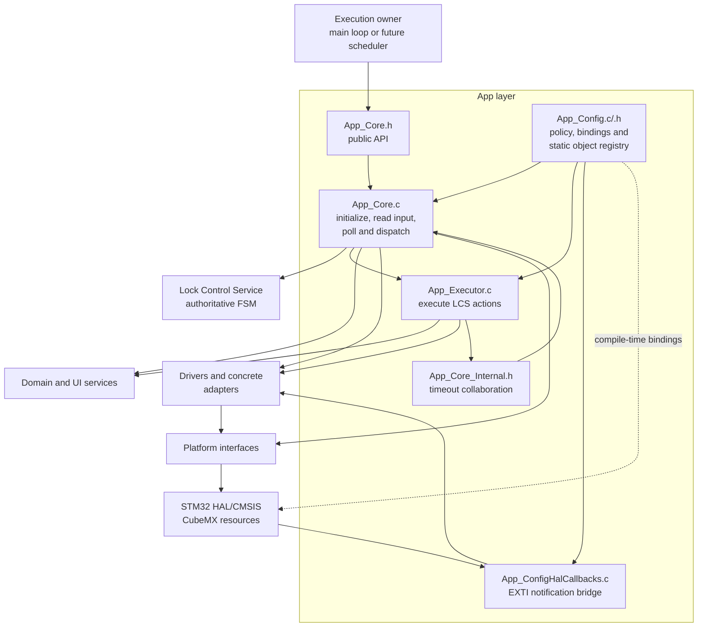
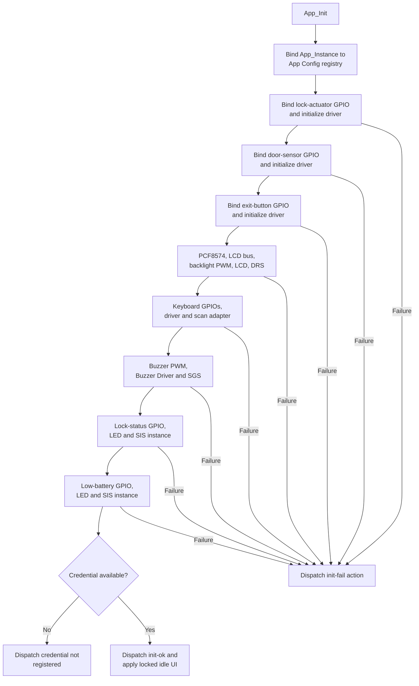

# Application Layer

The `App/` directory is the firmware composition and orchestration layer for the
electronic lock. It binds product configuration and STM32 resources to reusable
Platform interfaces, component drivers and services, then coordinates them
through one serialized, cooperative execution flow.

> [!IMPORTANT]
> [`Core/Inc/App_Core.h`](Core/Inc/App_Core.h) is the only public application
> interface. `App_Config.h`, `App_Core_Internal.h` and `App_Executor.h` are
> internal collaboration boundaries and must not be included by `main.c` or by
> modules outside `App/`.

The application layer does not own the product state machine. The Lock Control
Service (LCS) remains authoritative for state transitions and returns semantic
actions. `App/` initializes the concrete dependency graph, translates physical
input into service input, dispatches semantic events and performs the requested
actions.

---

## Table of Contents

1. [Responsibilities](#1-responsibilities)
2. [Current Directory Organization](#2-current-directory-organization)
3. [Organization Change](#3-organization-change)
4. [Architectural Boundaries](#4-architectural-boundaries)
5. [Public API and Execution Model](#5-public-api-and-execution-model)
6. [Initialization and Object Lifetime](#6-initialization-and-object-lifetime)
7. [Runtime Event Flow](#7-runtime-event-flow)
8. [Keyboard Policy](#8-keyboard-policy)
9. [Timeout Model](#9-timeout-model)
10. [Runtime Object Registry](#10-runtime-object-registry)
11. [Action Execution](#11-action-execution)
12. [Credential Ownership and Security](#12-credential-ownership-and-security)
13. [Safety and Failure Policy](#13-safety-and-failure-policy)
14. [Timing and Concurrency](#14-timing-and-concurrency)
15. [Build Integration](#15-build-integration)
16. [Maintenance Rules](#16-maintenance-rules)
17. [Known Constraints](#17-known-constraints)
18. [Related Documentation](#18-related-documentation)

---

## 1. Responsibilities

The application layer owns:

- the product-level hardware bindings and policy constants;
- the static object graph used by the firmware;
- initialization order and fail-fast dependency validation;
- composition of the lock actuator, door sensor and exit button required by the
  planned Door Control Service;
- publication of exit-button EXTI activity to the Exit Button Driver through a
  minimal HAL callback bridge;
- matrix-keyboard acquisition and translation to Credential Entry Service
  commands;
- application-level timeout lifecycle;
- serialization of LCS events, actions and immediate follow-up events;
- coordination of credential entry, authentication, replacement and storage;
- lock-actuator requests and presentation side effects;
- periodic display, LED-indication and sound-service updates;
- explicit erasure of application-owned credential buffers;
- the controlled-reset endpoint used by action-execution faults.

The application layer does not own:

- the authoritative lock state machine or its attempt counters;
- credential validation rules or the persistent Flash record format;
- keyboard scanning/debounce algorithms;
- LCD protocol commands, LED patterns or buzzer waveform generation;
- STM32 HAL mechanics hidden behind Platform interfaces;
- a scheduler, RTOS task, queue, mutex or software timer;
- mechanical feedback proving that the physical lock moved;
- battery measurement or power-management policy.

---

## 2. Current Directory Organization

```text
App/
├── Config/
│   ├── Inc/
│   │   └── App_Config.h
│   ├── Src/
│   │   ├── App_Config.c
│   │   └── App_ConfigHalCallbacks.c
│   └── README.md
├── Core/
│   ├── Inc/
│   │   ├── App_Core.h
│   │   ├── App_Core_Internal.h
│   │   └── App_Executor.h
│   └── Src/
│       ├── App_Core.c
│       └── App_Executor.c
└── README.md
```

| File | Role | Visibility |
|---|---|---|
| `App/README.md` | Architectural and integration reference for the complete application layer | Project documentation |
| `Config/README.md` | Detailed configuration, binding and object-ownership reference | Project documentation |
| `Config/Inc/App_Config.h` | Board bindings, product constants, timeout types and runtime-registry contract | App internal |
| `Config/Src/App_Config.c` | Static storage for configuration, handles, adapter contexts, services and secret buffers | App internal |
| `Config/Src/App_ConfigHalCallbacks.c` | HAL EXTI bridge that publishes exit-button edges to the application-owned driver instance | App internal / HAL callback |
| `Core/Inc/App_Core.h` | Lifecycle and cooperative runtime entry points | Public |
| `Core/Inc/App_Core_Internal.h` | Timeout operations shared by Core and Executor | App internal |
| `Core/Inc/App_Executor.h` | Semantic LCS action-execution boundary | App internal |
| `Core/Src/App_Core.c` | Initialization, input routing, timeout polling and bounded LCS dispatch | Private implementation |
| `Core/Src/App_Executor.c` | Concrete action side effects, credential transfer, actuator control and reset cleanup | Private implementation |

---

## 3. Organization Change

The application was previously represented by `App/Core` alone. Configuration,
static object storage, initialization, event orchestration and action execution
were all described as responsibilities of `App_Core.c`.

The current organization separates those concerns:

| Before | Current owner | Reason for the split |
|---|---|---|
| Product constants inside `App_Core.c` | `App_Config.h` | Makes board/product policy visible in one internal contract |
| Static handles and service instances inside `App_Core.c` | `App_Config.c` | Gives all retained objects one explicit lifetime owner |
| Direct access to file-local objects | `App_RuntimeInstances_t` registry | Lets sibling App modules share the same objects without exporting them publicly |
| LCS action switch inside `App_Core.c` | `App_Executor.c` | Separates event routing from concrete side effects |
| Timeout helpers used only locally | `App_Core_Internal.h` | Allows the Executor to start and cancel the Core-owned timeout runtime |
| Detailed README under `App/Core` | General `App/README.md` plus `App/Config/README.md` | Documents the complete layer and the configuration module at their actual scopes |

This is a separation of implementation responsibilities, not a new public API.
External code continues to call only `App_Init()`, `App_ReadInput()` and
`App_Dispatch()`.

---

## 4. Architectural Boundaries



Dependency rules:

- Outside callers include only `App_Core.h`.
- `App_Core.c` may include all three internal App headers.
- `App_Executor.c` uses `App_Config.h` for the registry and
  `App_Core_Internal.h` for timeout lifecycle.
- `App_Config.c` owns storage but performs no hardware initialization and no
  business workflow.
- `App_ConfigHalCallbacks.c` implements only the HAL-to-driver interrupt handoff;
  it performs no debounce, service dispatch or actuator command.
- LCS returns actions; it does not call App Executor, other services or hardware
  directly.
- Reusable services and components must not depend on `App/`.
- HAL/CMSIS types are confined to the composition/configuration boundary and
  Platform implementations.

---

## 5. Public API and Execution Model

```c
App_InitStatus_t App_Init(void);
void App_ReadInput(void);
void App_Dispatch(void);
```

### `App_Init()`

Call once after HAL initialization, system-clock configuration and all required
CubeMX `MX_*_Init()` functions. It binds the runtime registry, initializes the
dependency graph and selects the initial Lock Control path.

### `App_ReadInput()`

Performs one non-blocking Matrix Keyboard acquisition. A completed click can
open a credential-entry session, update the masked entry, request registration,
dispatch an LCS event and execute bounded immediate follow-up actions.

This function does not poll application timeouts and does not advance periodic
presentation patterns.

### `App_Dispatch()`

Performs one cooperative service cycle:

1. poll the single active application timeout;
2. dispatch the elapsed event and bounded synchronous follow-ups;
3. update Display Render;
4. update the lock-status indication instance;
5. update the low-battery indication instance;
6. update Sound Generator.

It does not acquire keyboard input.

A suitable integration is:

```c
if(App_Init() != APP_INIT_SUCCESSFULLY)
{
    Error_Handler();
}

for(;;)
{
    App_ReadInput();

    if(application_dispatch_due)
    {
        App_Dispatch();
    }
}
```

`application_dispatch_due` is owned by the execution environment. No fixed
dispatch period is declared by the App public API.

---

## 6. Initialization and Object Lifetime

`App_Init()` first obtains the registry from `App_GetRuntimeInstances()`. It
then initializes the graph in fail-fast order:



All objects referenced by the runtime registry have static storage duration in
`App_Config.c`. App Core separately owns the active-timeout runtime and the
bound registry pointer. Drivers and services borrow their dependencies; nothing
in the App layer is dynamically allocated or freed.

The registry is immutable, but the handles referenced by it are mutable. This
prevents rebinding while still allowing normal driver and service state changes.

---

## 7. Runtime Event Flow

The normal input path is:

```text
GPIO matrix state
    -> MK_Output_t
    -> CES_Input_t
    -> CES_Event_t
    -> LCS_Event_t
    -> LCS_Process()
    -> LCS_Action_t
    -> App_ExecuteAction()
    -> optional immediate LCS_Event_t follow-up
```

`App_DispatchLcsEvent()` serializes the last four steps. It never recursively
calls `LCS_Process()`: an action result is assigned as the next event and handled
by the same bounded loop. The maximum chain length is
`APP_MAX_LCS_DISPATCH_DEPTH` (currently 4).

Immediate follow-ups are used for operations that complete synchronously, such
as authentication, credential-stage comparison and credential persistence.
Human-scale timeouts remain asynchronous and are observed later by
`App_Dispatch()`.

The current door-mechanism boundary is intentionally limited to composition and
interrupt publication. App Core initializes the Lock Actuator, Door Sensor and
Exit Button drivers. `HAL_GPIO_EXTI_Callback()` forwards PB10 edges to
`ExitButton_NotifyInterrupt()`. No App runtime path currently calls
`DoorSensor_GetState()` or `ExitButton_Update()`, and actuator commands remain in
App Executor through the shared Platform GPIO descriptor. Those runtime reads,
debounced event consumption and coordinated lock policy belong to the planned
Door Control Service.

---

## 8. Keyboard Policy

The product uses a 4x4, active-low matrix with 40 ms debounce:

```text
1 2 3 A
4 5 6 B
7 8 9 C
* 0 # D
```

| Physical key | Semantic behavior |
|---|---|
| `0` through `9` | Credential digit |
| `#` | Confirm current candidate |
| `*` | Clear or cancel according to CES state |
| `A` | Credential-replacement request when handled as an application command |
| `B`, `C`, `D` | No CES command in the current mapping |

Every completed click is first offered to LCS as a credential-entry request. If
that click opens a new entry session, it acts only as the wake key and is not
inserted into the candidate. Once a session is active, supported keys are
translated into `CES_Input_t` and routed through CES.

---

## 9. Timeout Model

The application owns one active timeout because the timed LCS states are
mutually exclusive. `App_Core.c` owns the mutable runtime and immutable
definition table; durations are configured in `App_Config.h`.

| Timeout | Duration | Elapsed LCS event |
|---|---:|---|
| Credential-entry inactivity | 5,000 ms | `LCS_EVENT_ENTRY_TIMEOUT` |
| Authorized unlock | 3,000 ms | `LCS_EVENT_UNLOCK_TIMEOUT` |
| Access-denied feedback | 1,500 ms | `LCS_EVENT_DENIED_ACCESS_TIMEOUT` |
| Lockout | 10,000 ms | `LCS_EVENT_LOCKOUT_TIMEOUT` |
| Credential-save feedback | 1,500 ms | `LCS_EVENT_CREDENTIAL_REGISTER_DONE` |

`App_StartTimeout()` validates a configured identifier, captures
`Platform_GetMillis()` and replaces any previous interval. `App_PollTimeout()`
delegates rollover-safe elapsed-time arithmetic to the Timeout Validation
Service. On expiration, it cancels the runtime before returning the event, so
the event is emitted once.

No hardware timer interrupt, blocking wait or RTOS timer is used for these
product intervals. Observation latency is bounded by the caller's
`App_Dispatch()` cadence and any other blocking work in the same context.

---

## 10. Runtime Object Registry

`App_RuntimeInstances_t` is the internal bridge between storage ownership and
behavior. The registry points to:

| Group | Objects owned by `App_Config.c` |
|---|---|
| Keyboard | key map, driver configuration, row/column GPIO arrays, scan-adapter context, per-key state and driver handle |
| Display | LCD-backlight PWM, PCF8574 handle and LCD handle |
| Sound | buzzer PWM and Buzzer Driver handle |
| Lock indication | GPIO, LED Driver and independent SIS runtime |
| Low-battery indication | GPIO, LED Driver and independent SIS runtime |
| Actuator | GPIO descriptor for the current direct actuator boundary |
| Credentials | transient candidate and retained installed-credential buffers |

Singleton services such as LCS, CES, CRS, CSS, DRS and SGS do not need entries
unless their public API requires an injected instance. The two Status
Indication Service paths do require registry entries because each has independent
runtime state.

`App_Instance` is `NULL` before `App_Init()` binds it. Internal functions assume
successful initialization and do not repeatedly null-check the registry.

See [`Config/README.md`](Config/README.md) for the complete hardware and policy
mapping.

---

## 11. Action Execution

`App_Executor.c` implements the complete concrete side of the current
`LCS_Action_t` contract. Its responsibilities include:

- opening, refreshing and ending CES sessions;
- transferring a completed CES candidate to Authentication or CRS;
- loading the installed credential lazily from CSS;
- validating registration confirmation against staged data;
- saving a validated replacement and updating the retained RAM credential;
- starting or cancelling App Core timeouts;
- requesting actuator lock or unlock;
- selecting LCD screens, LED indications and sound patterns;
- returning synchronous success/failure events to App Core;
- executing credential erasure and controlled-reset cleanup.

The division between Core and Executor is semantic:

```text
App Core:     What event happened, and what action did LCS select?
App Executor: What concrete operations implement that selected action?
App Config:   Which objects and product values do those operations use?
```

Do not move state-transition decisions into App Executor. Any new product state,
guard, counter or transition belongs in LCS; the Executor should only implement
the resulting action.

---

## 12. Credential Ownership and Security

Credential data crosses several explicit ownership boundaries:

1. CES owns the candidate while an entry session is active.
2. App Executor copies a complete candidate into the App Config transient
   buffer only for one synchronous consumer.
3. Authentication borrows the transient candidate and installed credential.
4. CRS owns staged replacement data between first entry and confirmation.
5. CSS owns the persistent record and its validation rules.
6. App Config retains the installed credential in RAM after a successful CSS
   load or save so later authentication does not reread Flash.

The transient candidate's digit array is cleared through volatile byte writes
before and after transfer; its non-secret length metadata is overwritten by the
next successful CES copy. Temporary storage buffers are also erased after
persistence.
CRS staging is cleared on every terminal registration path. The retained
installed credential intentionally lives longer, but the controlled-reset path
invalidates and erases it before requesting reset.

Credential bytes must never be logged, traced, displayed, copied into
documentation or exposed through `App_Core.h`.

Compile-time assertions require the credential length contracts of CES, AS,
CRS, CSS and DRS to remain compatible.

---

## 13. Safety and Failure Policy

The current electrical policy treats a reset/low actuator GPIO as locked and a
set/high GPIO as an unlock request.

Core safety rules:

- require CubeMX GPIO initialization to drive PB8 low before `App_Init()` and
  bind the actuator descriptor before other App dependencies;
- establish the finite unlock timeout before setting the actuator output;
- force the actuator safe on normal denial, cancellation, timeout, lockout and
  registration-terminal actions;
- keep actuator control independent of display, LED and sound success;
- cancel timing and erase credential state before the Executor requests a
  controlled reset;
- never call App runtime operations from an ISR or from overlapping contexts.

Initialization is fail-fast. If any required dependency initializer fails,
`App_Init()` reports `LCS_EVENT_INIT_FAIL` and executes the returned action. The
normal fail-safe action routes through App Executor, which cancels timing, ends
credential sessions, clears staging and buffers, requests the safe actuator
state, stops sound, turns off the backlight and requests a system reset.

Keyboard acquisition failure conservatively dispatches credential cancellation
and presents error feedback instead of continuing an untrustworthy entry.

> [!WARNING]
> The current dispatch-depth overflow fallback in `App_Core.c` has its direct
> actuator-safe and reset calls disabled in source. It cancels timing, ends CES,
> stops sound and disables the backlight, but it is not equivalent to the full
> controlled-reset cleanup in App Executor. Treat this as open safety debt until
> the fallback is restored or rerouted through one common fail-safe function.

---

## 14. Timing and Concurrency

The application is synchronous, cooperative and non-reentrant.

- Call `App_ReadInput()` and `App_Dispatch()` from one serialized execution
  context.
- Do not call either function from an interrupt handler.
- Call `App_ReadInput()` frequently enough to support the 40 ms keyboard
  debounce policy.
- Call `App_Dispatch()` periodically even when no key is pressed.
- Continue dispatching while unlock, denial, lockout or save feedback is active.
- Avoid unbounded work in the same execution context.
- Account for bounded device-protocol delays in lower-level display operations.

The source contains no lock, atomic primitive or scheduler protection. Adding an
RTOS does not make the API thread-safe; a single owning task or explicit external
serialization remains required.

---

## 15. Build Integration

The root `CMakeLists.txt` must compile all four implementation units and expose
both App include directories privately to the firmware target:

```cmake
target_sources(${CMAKE_PROJECT_NAME} PRIVATE
    App/Config/Src/App_Config.c
    App/Config/Src/App_ConfigHalCallbacks.c
    App/Core/Src/App_Core.c
    App/Core/Src/App_Executor.c
)

target_include_directories(${CMAKE_PROJECT_NAME} PRIVATE
    App/Config/Inc
    App/Core/Inc
)
```

No App header is intended to become a transitive public dependency of reusable
libraries.

---

## 16. Maintenance Rules

When changing the App layer:

### Product or board binding

1. Change the relevant `APP_*` definition in `App_Config.h`.
2. Update the binding tables in `Config/README.md`.
3. Confirm the CubeMX `.ioc` and generated pin/peripheral setup agree.
4. Rebuild the firmware and validate the affected hardware path.

### New stateful dependency

1. Add static storage in `App_Config.c`.
2. Add a documented pointer to `App_RuntimeInstances_t`.
3. Bind it in `App_Instances`.
4. Initialize it in dependency order from `App_Core.c`.
5. Add its periodic update to `App_UpdateServices()` only if required.
6. Document ownership and lifetime in both App READMEs.

### New LCS action

1. Define the state-machine behavior and tests in LCS.
2. Implement only its concrete side effects in `App_ExecuteAction()`.
3. Return any synchronous outcome as an LCS follow-up event.
4. Confirm the dispatch depth still bounds the longest valid chain.
5. Document safety, timeout and credential-cleanup consequences.

### New timed state

1. Add an `App_TimeoutId_t` value.
2. Add its duration constant to `App_Config.h`.
3. Add one designated definition in `App_TimeoutDefinitions`.
4. Start and cancel it from the relevant Executor actions.
5. Add the duration/event mapping to both App READMEs.

Documentation is incomplete if a file header still contains template text such
as `Describe this module`, `Brief description` or fictitious parameter names.

---

## 17. Known Constraints

- Only one application timeout can be active.
- The Lock Actuator Driver is instantiated and initialized, but App Executor
  still commands its shared Platform GPIO descriptor directly.
- The Door Sensor Driver is instantiated on PB0, but state sampling and
  open/closed policy await the planned Door Control Service.
- The Exit Button Driver is instantiated on PB10 and receives EXTI
  notifications, but `ExitButton_Update()` and request-to-exit policy await the
  planned Door Control Service.
- The explicit safe-state write in `App_InitLockActuator()` is currently
  disabled, so startup depends on CubeMX driving PB8 low before `App_Init()`.
- The actuator path has no mechanical position feedback.
- No battery measurement source currently drives the low-battery indication.
- CSS availability is Boolean, so startup cannot distinguish an erased record
  from every cause of an unavailable/invalid record.
- The installed credential remains in RAM between authentications by design.
- Runtime initialization is not represented by a state checked at every public
  call; callers must obey the lifecycle contract.
- The dispatch-depth overflow path does not currently perform the complete
  fail-safe reset sequence described in Section 13.
- No App-level native integration test currently exercises Core, Config and
  Executor together; existing host tests focus on LCS behavior.

---

## 18. Related Documentation

- [Project overview and system architecture](../README.md)
- [App configuration and runtime registry](Config/README.md)
- [Platform interfaces](../Platforms/README.md)
- [Lock Control Service](../Libs/Services/Lock_Control/README.md)
- [Credential Entry Service](../Libs/Services/Credential_Entry/README.md)
- [Credential Register Service](../Libs/Services/Credential_Register/README.md)
- [Credential Storage Service](../Libs/Services/Credential_Storage/README.md)
- [Authentication Service](../Libs/Services/Authentication/README.md)
- [Lock Actuator Driver](../Libs/Components/LockActuator/README.md)
- [Door Sensor Driver](../Libs/Components/DoorSensor/README.md)
- [Exit Button Driver](../Libs/Components/ExitButton/README.md)
- [Timeout Validation Service](../Libs/Services/Timeout_Validation/README.md)
- [Display Render Service](../Libs/Services/Display_Render/README.md)
- [Status Indication Service](../Libs/Services/Status_Indication/README.md)
- [Sound Generator Service](../Libs/Services/Sound_Generator/README.md)
- [Matrix Keyboard component](../Libs/Components/MatrixKeyboard/README.md)
- [LCD component](../Libs/Components/LCD/README.md)
- [Native host tests](../Tests/README.md)
- [CubeMX configuration](../Electronic-Lock.ioc)

The public headers are authoritative for function signatures. The CubeMX
configuration is authoritative for generated peripheral and pin setup. The two
App READMEs define application ownership, collaboration and maintenance policy.

## 19. License

This module is part of the:

```text
Electronic Lock Project
```

and follows the project's license terms.
