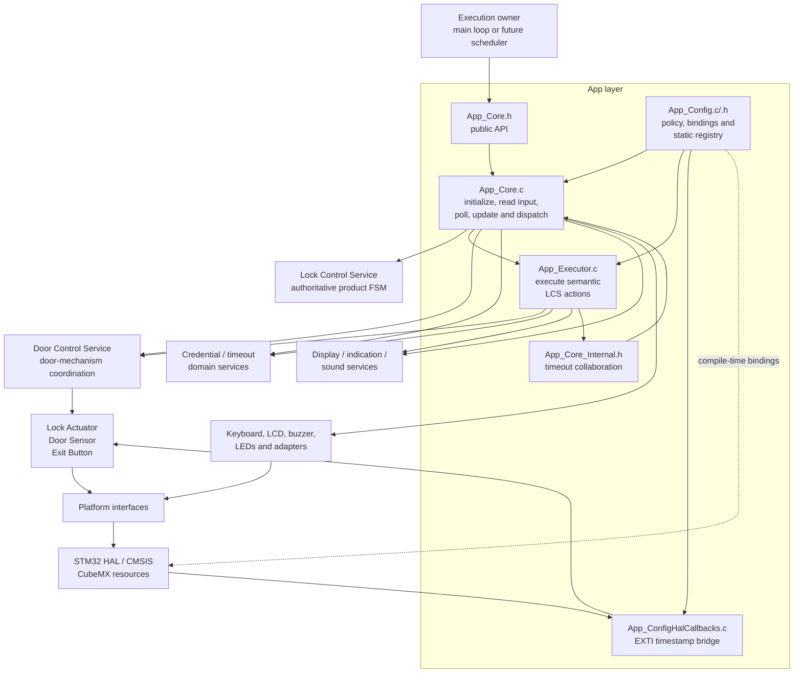
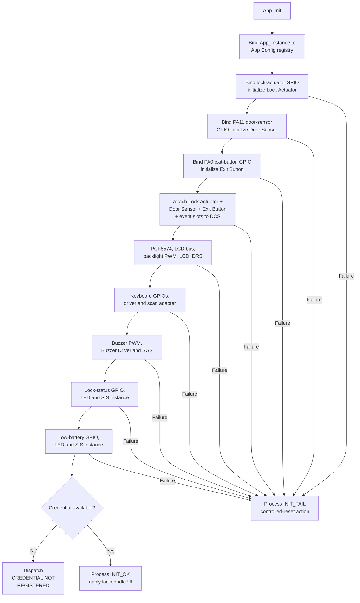
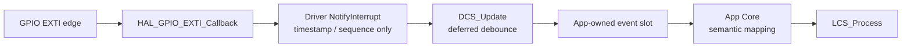
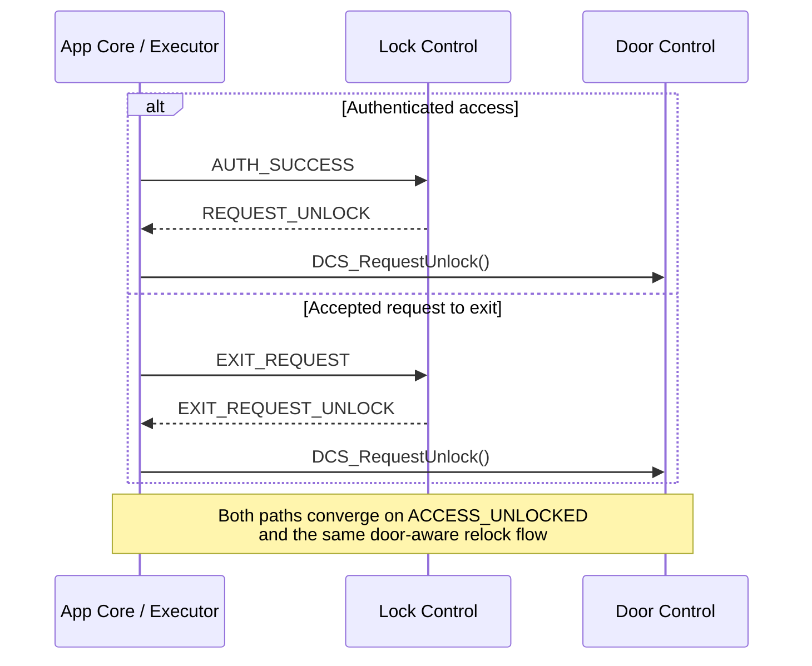
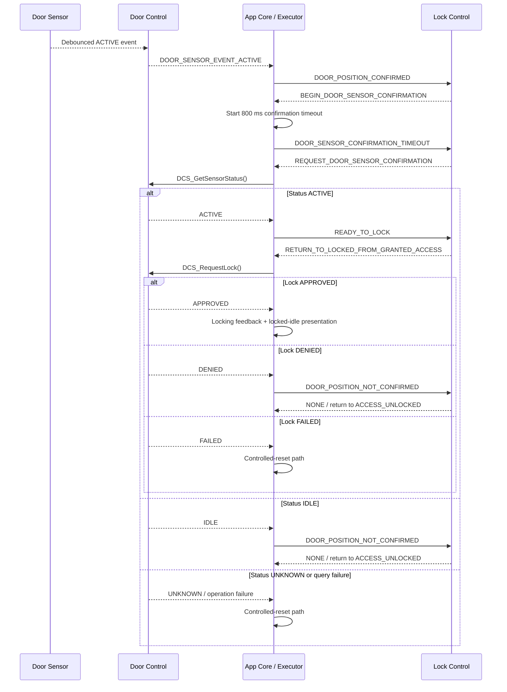

# Application Layer

The `App/` directory is the firmware composition and orchestration layer for the
electronic lock. It binds product configuration and STM32 resources to reusable
Platform interfaces, component drivers and services, then coordinates them
through one serialized, cooperative execution flow.

> [!IMPORTANT]
> [`Core/Inc/App_Core.h`](Core/Inc/App_Core.h) is the only public application
> interface. `App_Config.h`, `App_Core_Internal.h` and `App_Executor.h` are
> internal collaboration boundaries and must not be included by `main.c` or by
> reusable modules outside `App/`.

The application layer does not own the authoritative product state machine.
The Lock Control Service (LCS) owns state transitions, guards, counters and
semantic action selection. `App/` owns composition and execution: it initializes
the concrete dependency graph, translates physical or service outcomes into
semantic LCS events, executes returned actions and routes bounded synchronous
follow-up events.

The Door Control Service (DCS) is now an active part of this application
architecture. App Config owns the Lock Actuator, Door Sensor and Exit Button
component storage; App Core initializes and attaches those components to DCS;
the HAL callback bridge publishes input-edge timestamps; DCS performs deferred
input processing; App Core maps validated door-mechanism events into LCS events;
and App Executor performs lock, unlock and synchronous door-status operations
through DCS.

---

## Table of Contents

1. [Responsibilities](#1-responsibilities)
2. [Current Directory Organization](#2-current-directory-organization)
3. [Organization Change](#3-organization-change)
4. [Architectural Boundaries](#4-architectural-boundaries)
5. [Public API and Execution Model](#5-public-api-and-execution-model)
6. [Initialization and Object Lifetime](#6-initialization-and-object-lifetime)
7. [Runtime Event Flow](#7-runtime-event-flow)
8. [Keyboard Policy](#8-keyboard-policy)
9. [Timeout Model](#9-timeout-model)
10. [Door Control and Relock Flow](#10-door-control-and-relock-flow)
11. [Runtime Object Registry](#11-runtime-object-registry)
12. [Action Execution](#12-action-execution)
13. [Credential Ownership and Security](#13-credential-ownership-and-security)
14. [Safety and Failure Policy](#14-safety-and-failure-policy)
15. [Timing and Concurrency](#15-timing-and-concurrency)
16. [Build Integration](#16-build-integration)
17. [Maintenance Rules](#17-maintenance-rules)
18. [Known Constraints](#18-known-constraints)
19. [Related Documentation](#19-related-documentation)
20. [License](#20-license)

---

## 1. Responsibilities

The application layer owns:

- product-level hardware bindings and compile-time policy constants;
- the statically allocated object graph used by the firmware;
- initialization order and fail-fast dependency validation;
- composition of the Lock Actuator, Door Sensor and Exit Button components into
  the Door Control Service;
- the minimal HAL EXTI bridge that publishes Door Sensor and Exit Button edge
  timestamps to their respective drivers;
- periodic Door Control processing in serialized application context;
- translation of debounced Exit Button and Door Sensor events into semantic LCS
  events;
- matrix-keyboard acquisition and translation to Credential Entry Service
  commands;
- application-level timeout lifecycle;
- serialization of LCS events, actions and immediate follow-up events;
- coordination of credential entry, authentication, mandatory first-boot enrollment, replacement and storage;
- execution of the first-boot registration completion reset selected by LCS;
- execution of normal lock, force-lock and unlock requests through DCS;
- synchronous door-status confirmation and negative-confirmation recovery during the post-unlock relock flow;
- display, LED-indication and sound side effects;
- periodic display, Door Control, indication and sound-service updates;
- explicit erasure of application-owned credential buffers;
- the controlled-reset endpoint used by critical faults and deliberate first-boot enrollment completion.

The application layer does not own:

- the authoritative lock state machine, state representation, guards or attempt
  counters;
- the Door Control Service's normal lock interlock;
- raw Door Sensor or Exit Button debounce algorithms;
- credential validation rules or the persistent Flash record format;
- matrix-keyboard scan/debounce algorithms;
- LCD protocol commands, LED pattern execution or buzzer waveform generation;
- STM32 HAL mechanics hidden behind Platform interfaces;
- a scheduler, RTOS task, queue, mutex or software timer;
- mechanical feedback proving that the physical lock moved;
- battery measurement or power-management policy.

The architectural rule remains:

```text
physical/service fact
        ↓
App translation
        ↓
semantic LCS event
        ↓
LCS decision
        ↓
semantic LCS action
        ↓
App execution
        ↓
optional synchronous follow-up event
```

---

## 2. Current Directory Organization

```text
App/
├── Config/
│   ├── Inc/
│   │   └── App_Config.h
│   ├── Src/
│   │   ├── App_Config.c
│   │   └── App_ConfigHalCallbacks.c
│   └── README.md
├── Core/
│   ├── Inc/
│   │   ├── App_Core.h
│   │   ├── App_Core_Internal.h
│   │   └── App_Executor.h
│   └── Src/
│       ├── App_Core.c
│       └── App_Executor.c
└── README.md
```

| File | Role | Visibility |
|---|---|---|
| `App/README.md` | Architectural and integration reference for the complete application layer | Project documentation |
| `Config/README.md` | Detailed product configuration, board binding and runtime-object ownership reference | Project documentation |
| `Config/Inc/App_Config.h` | Internal dependency imports, board/product constants, timeout types and runtime-registry contract | App internal |
| `Config/Src/App_Config.c` | Static storage for Platform descriptors, adapters, components, indication runtimes, event/status slots and secret buffers | App internal |
| `Config/Src/App_ConfigHalCallbacks.c` | HAL EXTI bridge that forwards Door Sensor and Exit Button edge timestamps to their drivers | App internal / HAL callback |
| `Core/Inc/App_Core.h` | Lifecycle and cooperative runtime entry points | Public |
| `Core/Inc/App_Core_Internal.h` | Timeout operations shared by Core and Executor | App internal |
| `Core/Inc/App_Executor.h` | Semantic LCS action-execution boundary | App internal |
| `Core/Src/App_Core.c` | Dependency initialization, keyboard routing, timeout polling, DCS event consumption and bounded LCS dispatch | Private implementation |
| `Core/Src/App_Executor.c` | Concrete action side effects, credential transfer, DCS actuator/status operations and reset cleanup | Private implementation |

---

## 3. Organization Change

The application was previously represented primarily by `App/Core`.
Configuration, static object storage, initialization, event orchestration and
action execution were described as responsibilities of one large application
module.

The current organization separates those concerns:

| Former concern | Current owner | Reason |
|---|---|---|
| Product constants inside Core | `App_Config.h` | Keeps board/product policy in one internal composition contract |
| Static handles and service instances inside Core | `App_Config.c` | Gives retained objects one explicit storage owner |
| File-local object sharing | `App_RuntimeInstances_t` registry | Shares the same objects among App translation units without making them public |
| LCS action switch inside Core | `App_Executor.c` | Separates event routing from concrete side effects |
| Core-only timeout helpers | `App_Core_Internal.h` | Allows Executor actions to start/cancel the Core-owned timeout runtime |
| Direct door-mechanism access | Door Control Service integration | Centralizes actuator and door-input coordination behind one domain boundary |
| Single Core README | General `App/README.md` plus `Config/README.md` | Documents layer architecture separately from concrete composition policy |

This is an implementation split, not a new public API. External code still
uses only:

```c
App_Init();
App_ReadInput();
App_Dispatch();
```

---

## 4. Architectural Boundaries

### 4.1 Current dependency view



The important door-mechanism boundary is now explicit:

```text
HAL EXTI
   ↓
App_ConfigHalCallbacks
   ↓
Door Sensor / Exit Button NotifyInterrupt
   ↓
DCS_Update
   ↓
application-owned event slots
   ↓
App Core semantic mapping
   ↓
LCS

LCS action
   ↓
App Executor
   ↓
DCS lock / unlock / status API
   ↓
door-mechanism component
```

### 4.2 Dependency rules

- Outside callers include only `App_Core.h`.
- `App_Core.c` may include all App-internal collaboration headers.
- `App_Executor.c` borrows the runtime registry and uses
  `App_Core_Internal.h` only for Core-owned timeout lifecycle operations.
- `App_Config.c` owns storage and immutable policy but performs no hardware
  initialization and no product workflow.
- `App_ConfigHalCallbacks.c` implements only HAL-to-driver interrupt handoff.
  It shall not sample GPIO state, debounce, dispatch LCS events, call DCS or
  command the actuator.
- DCS coordinates the Lock Actuator, Door Sensor and Exit Button but does not
  call `LCS_Process()`.
- App Core remains the semantic event-routing boundary.
- LCS returns actions; it does not call App Executor, DCS, other services or
  hardware directly.
- Reusable services and components must not depend on `App/`.
- HAL/CMSIS types remain confined to composition/configuration and Platform
  implementation boundaries.

---

## 5. Public API and Execution Model

```c
App_InitStatus_t App_Init(void);
void App_ReadInput(void);
void App_Dispatch(void);
```

### 5.1 `App_Init()`

Call once after HAL initialization, system-clock configuration and the required
CubeMX `MX_*_Init()` functions.

`App_Init()`:

1. binds the application runtime registry;
2. initializes the physical door-mechanism components;
3. attaches those components and their event outputs to DCS;
4. initializes display, keyboard, sound and indication dependencies;
5. validates startup credential availability;
6. selects mandatory first-boot enrollment or the normal locked startup route.

When no usable credential is available, App Core dispatches
`LCS_EVENT_CREDENTIAL_NOT_REGISTERED`. LCS activates directly in
`CREDENTIAL_REGISTER_FIRST_ENTRY` and marks the flow as mandatory first-boot
enrollment. When a credential is already provisioned, App Core dispatches
`LCS_EVENT_INIT_OK` and normal locked operation begins.

Initialization is fail-fast. A failed dependency sends `LCS_EVENT_INIT_FAIL`
through the Lock Control fault path.

### 5.2 `App_ReadInput()`

Performs one non-blocking Matrix Keyboard acquisition.

A completed click can:

- request a new credential-entry session;
- act only as the wake/session-request key;
- append or clear credential input through CES;
- request credential registration;
- dispatch a semantic LCS event;
- execute bounded immediate LCS follow-up work.

`App_ReadInput()` does **not**:

- poll application timeouts;
- call `DCS_Update()`;
- consume Door Sensor or Exit Button events;
- advance periodic presentation patterns.

### 5.3 `App_Dispatch()`

Performs one cooperative runtime/service cycle. The current implementation order
is:

1. poll the single active application timeout;
2. dispatch an elapsed timeout event and any bounded synchronous follow-ups;
3. call `DCS_Update()` so Door Sensor and Exit Button debounce state advances;
4. call `DRS_Update()`;
5. update the lock-status SIS instance;
6. update the low-battery SIS instance;
7. update Sound Generator;
8. consume a debounced `EXIT_BUTTON_EVENT_PRESS`, when present, as
   `LCS_EVENT_EXIT_REQUEST`;
9. consume a debounced `DOOR_SENSOR_EVENT_ACTIVE`, when present, as
   `LCS_EVENT_DOOR_POSITION_CONFIRMED`.

Exit-button release and Door Sensor idle events currently have no App-to-LCS
mapping.

`App_Dispatch()` does not acquire the matrix keyboard.

A suitable cooperative integration remains:

```c
if(App_Init() != APP_INIT_SUCCESSFULLY)
{
    Error_Handler();
}

for(;;)
{
    App_ReadInput();

    if(application_dispatch_due)
    {
        App_Dispatch();
    }
}
```

`application_dispatch_due` belongs to the execution environment. The App public
API does not declare a fixed loop or scheduler period.

---

## 6. Initialization and Object Lifetime

### 6.1 Initialization order

`App_Init()` first obtains the immutable registry through
`App_GetRuntimeInstances()`, then builds the dependency graph in fail-fast order:



The DCS attachment step is required because DCS is a singleton with borrowed
component and event-output pointers. The attached objects remain owned by
App Config for the complete firmware lifetime.

### 6.2 Static lifetime

All registry-backed component, adapter, event/status and credential objects have
static storage duration in `App_Config.c`.

App Core separately owns:

- the bound `App_Instance` registry pointer;
- the single mutable `App_ActiveTimeout` runtime.

`App_Instances` is immutable as a registry: consumers cannot replace a member
binding after composition. The handles referenced by that registry remain
mutable because they contain normal runtime state.

No App-layer object is dynamically allocated or freed.

### 6.3 First-boot enrollment policy

The application does not decide whether a registration cancellation may leave
the enrollment flow. That policy belongs to LCS.

During mandatory first-boot enrollment:

- cancellation is translated normally from CES, but LCS refreshes the active
  registration-entry phase instead of returning to `LOCKED`;
- the first two confirmation mismatches return to confirmation entry;
- the third confirmation mismatch returns to first entry and restarts the
  registration attempt;
- successful persistence still uses the normal bounded credential-save feedback;
- when that feedback expires, `LCS_EVENT_CREDENTIAL_REGISTER_DONE` selects
  `LCS_ACTION_RETURN_FROM_CREDENTIAL_REGISTER_SESSION_FIRST_BOOT`;
- App Executor handles that action by entering the common controlled-reset
  endpoint so the next startup reloads the newly persisted credential through
  the normal boot path.

`LCS_EVENT_ENTRY_TIMEOUT` currently has no first-boot registration transition.
App Core still emits the timeout event and cancels the elapsed timeout runtime,
but LCS ignores the event and preserves the mandatory enrollment state. A
dedicated first-boot timeout refresh/feedback policy remains an explicit future
integration decision.

### 6.4 Interrupt startup behavior

CubeMX configures the Door Sensor and Exit Button as EXTI-backed inputs before
normal App runtime begins. The callback bridge can therefore observe an edge
before the corresponding driver is initialized.

The input-driver notification contracts are expected to ignore notifications
until their driver runtime is ready. The callback bridge also ignores activity
before `App_Instance` is bound.

---

## 7. Runtime Event Flow

The application has three important event paths: keyboard acquisition,
interrupt-backed door inputs and synchronous action follow-ups.

### 7.1 Keyboard path

```text
matrix GPIO state
    ↓
Matrix Keyboard Driver
    ↓
MK_Output_t
    ↓
App keyboard policy
    ↓
CES_Input_t
    ↓
Credential Entry Service
    ↓
CES_Event_t
    ↓
App semantic mapping
    ↓
LCS_Event_t
    ↓
LCS_Process()
    ↓
LCS_Action_t
    ↓
App_ExecuteAction()
    ↓
optional synchronous LCS_Event_t
```

### 7.2 Door Sensor and Exit Button path



The callback bridge does not emit a product event. It only transfers edge timing
to the corresponding component driver.

`DCS_Update()` later evaluates pending Door Sensor and Exit Button edges in
serialized application context. The attached event slots are one-cycle outputs
and are overwritten on the next update.

Current asynchronous mappings are:

| DCS/component event | App mapping |
|---|---|
| `EXIT_BUTTON_EVENT_PRESS` | `LCS_EVENT_EXIT_REQUEST` |
| `EXIT_BUTTON_EVENT_RELEASE` | No LCS event |
| `DOOR_SENSOR_EVENT_ACTIVE` | `LCS_EVENT_DOOR_POSITION_CONFIRMED` |
| `DOOR_SENSOR_EVENT_IDLE` | No LCS event |

`LCS_EVENT_DOOR_POSITION_NOT_CONFIRMED` is deliberately **not** mapped from
`DOOR_SENSOR_EVENT_IDLE`. It is a synchronous relock-validation outcome produced
by App Executor when either:

1. the confirmation-time `DCS_GetSensorStatus()` reports `IDLE`; or
2. the final `DCS_RequestLock()` is denied because the door condition changed
   after semantic readiness had already been established.

This distinction prevents an unrelated asynchronous door-open transition from
being interpreted as a relock-handshake failure while the product is in an
unrelated locked state.

Because LCS ignores events that are invalid for its current state, App Core does
not need private LCS-state access before dispatching ordinary asynchronous
component facts.

### 7.3 Bounded synchronous action/event chains

`App_DispatchLcsEvent()` serially executes:

```text
pending LCS event
    ↓
LCS_Process()
    ↓
semantic action
    ↓
App_ExecuteAction()
    ↓
optional immediate event
    └───────────────┐
                    ↓
               next iteration
```

The implementation is iterative, not recursive.

`APP_MAX_LCS_DISPATCH_DEPTH` is currently `4U`. The longest currently known valid
synchronous chains require three event/action steps; the fourth iteration is
bounded headroom. The limit prevents an accidental action/event cycle from
monopolizing the cooperative execution context.

Representative three-step credential-registration chain:

```text
CANDIDATE_READY
    ↓
REQUEST_CREDENTIAL_REGISTER_STAGES_VALIDATION
    ↓
STAGING_VALIDATION_SUCCESS
    ↓
REQUEST_CREDENTIAL_REGISTER_STORAGE
    ↓
CREDENTIAL_REGISTER_STORAGE_SUCCESS
    ↓
END_CREDENTIAL_REGISTER_SAVING_SESSION
    ↓
NONE
```

Representative three-step relock-recovery chain:

```text
DOOR_SENSOR_CONFIRMATION_TIMEOUT
    ↓
REQUEST_DOOR_SENSOR_CONFIRMATION
    ↓
READY_TO_LOCK
    ↓
RETURN_TO_LOCKED_FROM_GRANTED_ACCESS
    ↓
DOOR_POSITION_NOT_CONFIRMED
    ↓
NONE
```

The second chain occurs only when synchronous confirmation first succeeds but
the final `DCS_RequestLock()` immediately rechecks the Door Sensor and denies the
physical lock request. LCS then reconciles its logical state back to
`ACCESS_UNLOCKED` within the same bounded dispatch chain.

If a valid non-`NONE` follow-up remains after the configured bound,
`App_DispatchLcsEvent()` routes execution through
`LCS_ACTION_REQUEST_CONTROLLED_RESET`.

---

## 8. Keyboard Policy

The product uses a 4x4 active-low matrix with 40 ms debounce:

```text
1 2 3 A
4 5 6 B
7 8 9 C
* 0 # D
```

Current application mapping:

| Physical key | Semantic behavior |
|---|---|
| `0` through `9` | Credential digit |
| `#` | Confirm current candidate |
| `*` | Clear/cancel according to CES state |
| `C` | Credential-registration request while a credential-entry session is already active |
| `A`, `B`, `D` | No CES/application command in the current mapping |

Every accepted click is first offered directly to LCS as
`LCS_EVENT_CREDENTIAL_ENTRY_REQUESTED`.

If LCS opens a new credential-entry session, that physical click is consumed as
a **wake/session-request key only** and is not inserted into the credential
candidate.

When a session is already active, `C` is intercepted by App Core and dispatched
as `LCS_EVENT_CREDENTIAL_REGISTER_REQUESTED`. It is not passed to CES.

All remaining supported credential keys are translated into `CES_Input_t` and
processed by CES.

---

## 9. Timeout Model

The application owns one active timeout because the currently timed LCS phases
are mutually exclusive.

`App_Config.h` defines the timeout identifiers and duration policy.
`App_Core.c` owns:

- `App_TimeoutDefinitions`;
- `App_ActiveTimeout`;
- `App_StartTimeout()`;
- `App_CancelTimeout()`;
- `App_PollTimeout()`.

Current timeout mapping:

| Timeout | Duration | Elapsed LCS event |
|---|---:|---|
| Credential-entry inactivity | 5,000 ms | `LCS_EVENT_ENTRY_TIMEOUT` |
| Door-position confirmation delay | 800 ms | `LCS_EVENT_DOOR_SENSOR_CONFIRMATION_TIMEOUT` |
| Access-denied feedback | 1,500 ms | `LCS_EVENT_DENIED_ACCESS_TIMEOUT` |
| Lockout | 10,000 ms | `LCS_EVENT_LOCKOUT_TIMEOUT` |
| Credential-save feedback | 1,500 ms | `LCS_EVENT_CREDENTIAL_REGISTER_DONE` |

Credential-entry inactivity is shared by normal entry and registration entry at
the App timeout layer, but the resulting LCS policy is state/guard dependent.
Normal registration entry timeout can return to `LOCKED`. During mandatory
first-boot enrollment, `LCS_EVENT_ENTRY_TIMEOUT` currently has no authorized
first-boot transition; LCS ignores the event, the enrollment state is preserved,
and App Core has already consumed/cancelled the elapsed timeout runtime.

There is **no fixed authorized-unlock timeout** in the current design.

The former unlock-duration model has been replaced by a door-aware relock
sequence:

1. physical access is unlocked;
2. Door Sensor closure produces `LCS_EVENT_DOOR_POSITION_CONFIRMED`;
3. LCS requests the bounded 800 ms confirmation interval;
4. timeout expiration produces `LCS_EVENT_DOOR_SENSOR_CONFIRMATION_TIMEOUT`;
5. App Executor performs a synchronous DCS status query;
6. only an active/permissive status produces `LCS_EVENT_READY_TO_LOCK`.

`App_StartTimeout()` validates the identifier and definition, captures
`Platform_GetMillis()` and replaces any previous active interval.

`App_PollTimeout()` delegates rollover-safe elapsed-time arithmetic to Timeout
Validation Service. On expiration, the runtime is cancelled before the semantic
event is returned, preventing repeated emission of the same timeout event.

No hardware timer interrupt, blocking wait or RTOS software timer is required
for these product intervals. Observation latency is therefore bounded by the
`App_Dispatch()` cadence and by other work serialized in the same context.

---

## 10. Door Control and Relock Flow

### 10.1 Runtime ownership

App Config owns:

- the Lock Actuator Platform GPIO descriptor;
- the Lock Actuator Driver handle;
- the Door Sensor Platform GPIO descriptor;
- the Door Sensor Driver handle;
- the Door Sensor event slot;
- the DCS synchronous Door Sensor status slot;
- the Exit Button Platform GPIO descriptor;
- the Exit Button Driver handle;
- the Exit Button event slot.

DCS borrows those component and event objects after
`App_InitDoorControlService()` attaches them.

App Core owns:

- periodic `DCS_Update()`;
- translation of validated component events into asynchronous LCS events;
- bounded dispatch of synchronous Executor follow-up events.

App Executor owns:

- calling `DCS_RequestUnlock()`;
- preserving the complete `DCS_RequestLockStatus_t` result returned by
  `DCS_RequestLock()`;
- calling `DCS_ForceLock()` on the currently selected local force-lock path;
- calling `DCS_GetSensorStatus()` for synchronous relock confirmation;
- mapping synchronous door-control outcomes into semantic LCS follow-up events.

LCS remains unaware of GPIOs, DCS handles and component-driver types.

### 10.2 Authenticated and request-to-exit unlock

Both accepted entry modes converge on the same LCS post-unlock phase:



The request-to-exit path performs no credential authentication. LCS decides
whether `EXIT_REQUEST` is valid for the current product state.

If `DCS_RequestUnlock()` fails, the current Executor calls `DCS_ForceLock()` as
a local fallback. No dedicated semantic unlock-execution failure event is
currently returned to LCS.

### 10.3 Door-aware relock and negative confirmation



The current relock contract intentionally distinguishes three conditions:

| Door-control outcome | App/LCS behavior |
|---|---|
| Confirmation status `ACTIVE` | Return `LCS_EVENT_READY_TO_LOCK` |
| Confirmation status `IDLE` | Return `LCS_EVENT_DOOR_POSITION_NOT_CONFIRMED` and recover from `READY_TO_LOCK` to `ACCESS_UNLOCKED` |
| Confirmation status `UNKNOWN` or `DCS_GetSensorStatus()` failure | Enter controlled-reset cleanup |
| Final `DCS_RequestLock()` `APPROVED` | Complete locking feedback and locked-idle presentation |
| Final `DCS_RequestLock()` `DENIED` | Return `LCS_EVENT_DOOR_POSITION_NOT_CONFIRMED`; LCS reconciles `LOCKED` back to `ACCESS_UNLOCKED` |
| Final `DCS_RequestLock()` `FAILED` | Enter controlled-reset cleanup |

There are intentionally **two current-condition checks** before normal relock:

1. `DCS_GetSensorStatus()` determines whether the App may report
   `LCS_EVENT_READY_TO_LOCK`.
2. `DCS_RequestLock()` samples the Door Sensor again immediately before issuing
   the physical lock command.

The second check closes the race between semantic readiness and physical actuator
execution. If the door condition changes in that interval, DCS denies the lock
and the synchronous `LCS_EVENT_DOOR_POSITION_NOT_CONFIRMED` immediately
reconciles the FSM back to `ACCESS_UNLOCKED`.

### 10.4 Recovery state semantics

The negative-confirmation event is accepted in two LCS states:

```text
READY_TO_LOCK
    + DOOR_POSITION_NOT_CONFIRMED
    → ACCESS_UNLOCKED

LOCKED
    + DOOR_POSITION_NOT_CONFIRMED
    → ACCESS_UNLOCKED
```

These transitions serve different points in the same handshake:

- the `READY_TO_LOCK` transition handles an `IDLE` result from the synchronous
  confirmation query;
- the `LOCKED` transition handles a final `DCS_RequestLock()` denial after LCS
  had already accepted `READY_TO_LOCK`.

Both transitions return `LCS_ACTION_NONE` because the actuator remains unlocked;
the required external behavior is simply to resume waiting for a new validated
door-close condition.

The event shall not be generated merely because the asynchronous Door Sensor
publishes `DOOR_SENSOR_EVENT_IDLE`.

### 10.5 Normal lock versus force lock

`DCS_RequestLock()` is the normal path. It permits physical locking only when
the instantaneous normalized Door Sensor state is the configured permissive
`ACTIVE` state and preserves three distinct outcomes:

```text
APPROVED
DENIED
FAILED
```

App Executor therefore retains `DCS_RequestLockStatus_t` rather than collapsing
the result to Boolean when the exact reason matters.

`DCS_ForceLock()` bypasses the Door Sensor interlock. It exists for explicit
force-lock/fail-safe policy and shall not replace the normal relock request.

`DCS_RequestUnlock()` performs actuator execution only. Authentication and
request-to-exit authorization are product decisions already made by LCS before
the Executor reaches that call.

---

## 11. Runtime Object Registry

`App_RuntimeInstances_t` is the internal bridge between storage ownership and
behavior.

The registry currently exposes:

| Group | Objects owned by `App_Config.c` |
|---|---|
| Keyboard | immutable key map/configuration, row/column GPIO arrays, scan-adapter context, per-key runtimes and Matrix Keyboard handle |
| Display | LCD-backlight PWM descriptor, PCF8574 handle and LCD handle |
| Sound | buzzer PWM descriptor and Buzzer Driver handle |
| Lock indication | GPIO descriptor, LED Driver and independent SIS runtime |
| Low-battery indication | GPIO descriptor, LED Driver and independent SIS runtime |
| Lock actuator | actuator GPIO descriptor and Lock Actuator Driver handle |
| Door Sensor | sensor GPIO descriptor, Door Sensor Driver handle, one-cycle event slot and synchronous `DCS_SensorStatus_t` slot |
| Exit Button | button GPIO descriptor, Exit Button Driver handle and one-cycle event slot |
| Credentials | transient CES candidate and retained installed-credential buffer |

The Door Sensor has two application-owned outputs because they represent
different contracts:

- `Door_Sensor_Event` is asynchronous/debounced transition output produced by
  `DCS_Update()`;
- `Door_Sensor_Status` is the destination of a synchronous
  `DCS_GetSensorStatus()` query.

`Exit_Button_Event` is also a one-cycle output. DCS overwrites event slots on
each update, including writing the corresponding `NONE` sentinel when no new
validated transition is available.

Singleton services such as LCS, CES, CRS, CSS, DRS, SGS and DCS do not require
runtime-handle entries unless their public API explicitly requires an injected
instance.

The two Status Indication Service paths do require registry entries because each
retains independent pattern/phase/timing state.

`App_Instance` is `NULL` until `App_Init()` binds it. Internal runtime functions
assume the initialization contract has been obeyed and do not repeatedly
null-check the registry.

See [`Config/README.md`](Config/README.md) for the detailed product binding and
ownership map.

---

## 12. Action Execution

`App_Executor.c` implements the concrete side of the `LCS_Action_t` contract.

It is responsible for:

- opening, refreshing and ending CES sessions;
- transferring completed CES candidates;
- loading the installed credential lazily from CSS;
- invoking Authentication Service;
- staging and validating credential replacement through CRS;
- persisting a validated replacement or first-boot credential through CSS;
- updating the retained runtime credential after successful persistence;
- routing completed first-boot enrollment through the controlled-reset endpoint;
- starting and cancelling App Core timeouts;
- performing normal lock/unlock requests through DCS;
- preserving the three-way `DCS_RequestLockStatus_t` result where relock
  recovery depends on the distinction between denial and actuator failure;
- performing synchronous DCS sensor-status confirmation;
- mapping `IDLE` confirmation or final lock denial into
  `LCS_EVENT_DOOR_POSITION_NOT_CONFIRMED`;
- selecting display screens, LED indications and sound patterns;
- returning immediate semantic success/failure/recovery events;
- erasing secret-bearing temporary storage;
- running the controlled-reset cleanup endpoint.

The Core/Executor/Config split remains:

```text
App Core:
    What fact occurred?
    What LCS event represents it?
    What action did LCS select?
    Is there another bounded follow-up event?

App Executor:
    What concrete operations implement that selected action?
    Does synchronous execution produce a semantic result event?

App Config:
    Which retained objects and product-policy values do those operations use?
```

### 12.1 Synchronous follow-up producers

Representative Executor actions that can produce immediate LCS events include:

| Action | Immediate follow-up behavior |
|---|---|
| Begin/refresh CES actions | Can return `LCS_EVENT_CREDENTIAL_CANCELLED` if session/timing setup fails |
| `LCS_ACTION_REQUEST_AUTHENTICATION` | Returns `LCS_EVENT_AUTH_SUCCESS` or `LCS_EVENT_AUTH_FAILURE` |
| `LCS_ACTION_REQUEST_CREDENTIAL_REGISTER_STAGES_VALIDATION` | Returns staging validation success/failure |
| `LCS_ACTION_REQUEST_CREDENTIAL_REGISTER_STORAGE` | Returns storage success/failure |
| `LCS_ACTION_DENY_ACCESS` | Can return denial-timeout event immediately if timeout activation fails |
| `LCS_ACTION_ENTER_LOCKOUT` | Can return lockout-timeout event immediately if timeout activation fails |
| `LCS_ACTION_REQUEST_DOOR_SENSOR_CONFIRMATION` | `ACTIVE` returns `LCS_EVENT_READY_TO_LOCK`; `IDLE` returns `LCS_EVENT_DOOR_POSITION_NOT_CONFIRMED`; query failure or `UNKNOWN` enters controlled reset |
| `LCS_ACTION_RETURN_TO_LOCKED_FROM_GRANTED_ACCESS` | Final lock `DENIED` returns `LCS_EVENT_DOOR_POSITION_NOT_CONFIRMED`; `FAILED` enters controlled reset; `APPROVED` completes normally |
| `LCS_ACTION_RETURN_FROM_CREDENTIAL_REGISTER_SESSION_FIRST_BOOT` | Produces no follow-up event; App Executor enters the controlled-reset endpoint immediately |

These results are returned to App Core rather than recursively dispatched by the
Executor. The first-boot completion action is terminal for the current runtime:
it deliberately requests reset instead of producing another LCS event.

### 12.2 Door-mechanism actions

| LCS action | Executor behavior |
|---|---|
| `LCS_ACTION_REQUEST_UNLOCK` | Calls DCS unlock; force-locks locally if unlock execution fails; then presents authenticated-access feedback |
| `LCS_ACTION_EXIT_REQUEST_UNLOCK` | Calls DCS unlock; force-locks locally if unlock execution fails; then emits unlocking feedback |
| `LCS_ACTION_BEGIN_DOOR_SENSOR_CONFIRMATION` | Starts the 800 ms door-confirmation timeout |
| `LCS_ACTION_REQUEST_DOOR_SENSOR_CONFIRMATION` | Queries instantaneous DCS sensor status and returns `READY_TO_LOCK` or `DOOR_POSITION_NOT_CONFIRMED` according to `ACTIVE`/`IDLE`; abnormal results enter controlled reset |
| `LCS_ACTION_RETURN_TO_LOCKED_FROM_GRANTED_ACCESS` | Requests normal DCS relock; `APPROVED` emits locking feedback and restores locked-idle presentation, `DENIED` returns `DOOR_POSITION_NOT_CONFIRMED`, and `FAILED` enters controlled reset |
| `LCS_ACTION_REQUEST_CONTROLLED_RESET` | Enters the common cleanup/reset path |

### 12.3 Credential-registration completion

Normal credential replacement and mandatory first-boot enrollment share the
same registration, persistence and success-feedback execution until
`LCS_EVENT_CREDENTIAL_REGISTER_DONE`.

At that point LCS selects one of two semantic completion actions:

| LCS action | Executor behavior |
|---|---|
| `LCS_ACTION_RETURN_TO_LOCKED_FROM_CREDENTIAL_REGISTER_SESSION` | Cancels registration timing/feedback state and restores normal locked-idle presentation for an already provisioned product |
| `LCS_ACTION_RETURN_FROM_CREDENTIAL_REGISTER_SESSION_FIRST_BOOT` | Calls `App_RequestControlledReset()` so the newly persisted credential is rediscovered by the normal startup path |

The Executor does not inspect an LCS first-boot flag or duplicate that policy.
It simply executes the action selected by LCS.

### 12.4 Lock-request result preservation

`App_RequestLock()` returns `DCS_RequestLockStatus_t` directly:

```text
DCS_LOCK_REQUEST_APPROVED
DCS_LOCK_REQUEST_DENIED
DCS_LOCK_REQUEST_FAILED
```

This is intentional. A Boolean wrapper would erase the semantic distinction
needed by the post-unlock recovery path:

```text
DENIED
    → physical door condition changed
    → recover to ACCESS_UNLOCKED

FAILED
    → actuator/dependency execution failure
    → controlled reset
```

Other terminal actions that currently ignore the returned status are documented
as a remaining integration constraint rather than changing this helper back to a
Boolean result.

Do not move product transitions, state checks, guards or counters into App
Executor. Those decisions belong to LCS.

---

## 13. Credential Ownership and Security

Credential data crosses explicit ownership boundaries:

1. CES owns the candidate while an entry session is active.
2. App Executor copies a complete candidate into the App Config transient
   candidate only for a synchronous consumer.
3. Authentication borrows the transient candidate and installed credential.
4. CRS owns staged replacement data between first entry and confirmation.
5. CSS owns the persistent record and its validation rules.
6. App Config retains the installed credential in RAM after successful CSS load
   or save so later authentications do not reread Flash.

`App_ClearRuntime_Candidate()` explicitly erases the application transient
candidate bytes through volatile writes before or after sensitive transfers.

CES internal candidate storage is erased through the CES session lifecycle.

The temporary stack buffer used for credential persistence is explicitly erased
before the storage action returns.

CRS staging is cleared on registration terminal paths and after validated
credential extraction.

The retained installed credential intentionally has a longer lifetime. The
controlled-reset path invalidates its runtime-valid flag and overwrites the
retained bytes before requesting system reset.

Credential bytes must never be:

- logged;
- traced;
- included in diagnostic strings;
- rendered on the display;
- copied into documentation examples;
- exposed through `App_Core.h`.

Compile-time assertions require the credential-length contracts of CES,
Authentication, CRS, CSS and DRS to remain compatible.

---

## 14. Safety and Failure Policy

### 14.1 Startup electrical baseline

The current product configuration interprets the Lock Actuator's active-low
command as the locked request.

CubeMX establishes the configured safe output level before `App_Init()` binds
the Platform descriptor, providing an electrical locked baseline during early
startup.

During application initialization, the Lock Actuator is then explicitly
commanded to the locked state after successful driver initialization. Failure
to establish this initial locked state causes application initialization to
fail.

### 14.2 Runtime actuator policy

Runtime actuator access is no longer a direct GPIO operation from App Executor.

Normal lock/relock:

```text
App Executor
    ↓
DCS_RequestLock()
    ↓
instantaneous Door Sensor check
    ↓
ACTIVE?
  yes → LockActuator_Lock()
  no  → deny without actuator command
```

Force lock:

```text
App Executor
    ↓
DCS_ForceLock()
    ↓
LockActuator_Lock()
```

Unlock:

```text
LCS already authorized access
    ↓
App Executor
    ↓
DCS_RequestUnlock()
    ↓
LockActuator_Unlock()
```

### 14.3 Door-aware relock defense and reconciliation

The normal post-unlock path uses both delayed semantic confirmation and a final
physical interlock:

1. a debounced Door Sensor `ACTIVE` event produces
   `LCS_EVENT_DOOR_POSITION_CONFIRMED`;
2. LCS requests the 800 ms confirmation interval;
3. timeout expiration requests a synchronous `DCS_GetSensorStatus()` check;
4. `ACTIVE` produces `LCS_EVENT_READY_TO_LOCK`;
5. `IDLE` produces `LCS_EVENT_DOOR_POSITION_NOT_CONFIRMED` and returns LCS to
   `ACCESS_UNLOCKED`;
6. after `READY_TO_LOCK`, `DCS_RequestLock()` rechecks the Door Sensor immediately
   before the actuator command;
7. final `DENIED` also produces `LCS_EVENT_DOOR_POSITION_NOT_CONFIRMED`, allowing
   the logical `LOCKED` transition to be synchronously reconciled back to
   `ACCESS_UNLOCKED`;
8. query abnormalities, `UNKNOWN` confirmation and final
   `DCS_LOCK_REQUEST_FAILED` enter controlled-reset cleanup.

The final recheck must not be removed merely because the earlier synchronous
status query succeeded. The door contact can change between semantic readiness
and actuator execution.

### 14.4 Initialization and action faults

Initialization remains fail-fast. When a required initializer fails,
`App_Init()` processes `LCS_EVENT_INIT_FAIL`; the returned
`LCS_ACTION_REQUEST_CONTROLLED_RESET` enters the common Executor cleanup path.

The controlled-reset cleanup currently:

- invalidates the retained-credential-valid flag;
- cancels the application timeout;
- ends CES;
- clears CRS staging;
- erases the transient candidate;
- erases the retained runtime credential;
- calls `App_ForceLock()`;
- stops Sound Generator;
- disables the LCD backlight;
- disables interrupts and requests system reset.

The dispatch-depth overflow path also routes through
`LCS_ACTION_REQUEST_CONTROLLED_RESET`, so it converges on this same cleanup
endpoint.

Successful mandatory first-boot enrollment deliberately reuses this cleanup
endpoint through
`LCS_ACTION_RETURN_FROM_CREDENTIAL_REGISTER_SESSION_FIRST_BOOT`. In that case
the reset is not a fault response: it is a lifecycle boundary that causes the
newly persisted credential to be consumed by the ordinary startup path on the
next boot.

> [!WARNING]
> The reset cleanup currently uses normal `DCS_RequestLock()` through
> `App_RequestLock()` rather than `DCS_ForceLock()`. Therefore a non-permissive
> Door Sensor state can deny the final lock request before reset. This remains an
> explicit safety-policy decision/debt and shall not be described as an
> unconditional force-lock operation.

### 14.5 Input failure

A Matrix Keyboard acquisition failure conservatively dispatches credential
cancellation and requests error presentation rather than continuing an
untrustworthy credential-input sequence.

### 14.6 Relock outcome classes

The current relock path distinguishes physical-policy denial from execution
failure:

```text
DCS_REQUEST_LOCK_APPROVED
    → normal locked presentation

DCS_REQUEST_LOCK_DENIED
    → DOOR_POSITION_NOT_CONFIRMED
    → ACCESS_UNLOCKED

DCS_REQUEST_LOCK_FAILED
    → controlled reset
```

This distinction closes the previous logical/physical mismatch where LCS could
remain `LOCKED` after the final DCS interlock rejected the physical lock command.

An unlock execution failure is handled differently: the Executor requests
`DCS_ForceLock()` locally but currently emits no dedicated LCS fault/recovery
event. That remaining limitation is listed in Section 18.

---

## 15. Timing and Concurrency

The current application is synchronous, cooperative and non-reentrant.

Call `App_ReadInput()` and `App_Dispatch()` from one serialized execution
context.

Do not call either public runtime function from an interrupt handler.

### 15.1 Cadence requirements

The execution owner shall call:

- `App_ReadInput()` frequently enough for acceptable Matrix Keyboard behavior
  around its 40 ms debounce policy;
- `App_Dispatch()` periodically so application timeouts are observed with
  acceptable latency;
- `App_Dispatch()` frequently enough that DCS can complete deferred input
  processing after the Door Sensor's 500 ms quiet interval and the Exit Button's
  20 ms quiet interval;
- `App_Dispatch()` continuously while display, indication or sound patterns are
  active.

The debounce intervals do not require blocking waits. EXTI callbacks publish
edge timestamps and DCS/component update functions later determine whether the
configured quiet interval has elapsed.

### 15.2 Serialization

The current design assumes one execution owner.

No App-layer mutex, lock or scheduler primitive protects:

- `App_Instance`;
- `App_ActiveTimeout`;
- LCS singleton state;
- DCS singleton attachment/runtime context;
- CES/CRS singleton state;
- presentation service state;
- shared event slots.

Adding an RTOS does not automatically make these APIs thread-safe. A future
RTOS design should normally assign App orchestration to one owning task or add
explicit serialization at the boundary.

### 15.3 ISR constraints

The EXTI path must remain bounded to notification:

```text
HAL interrupt
    ↓
timestamp/sequence publication
    ↓
return
```

No deliberate delay, debounce waiting, LCS dispatch, credential operation,
display update or actuator command belongs in ISR context.

---

## 16. Build Integration

The root firmware build must compile all App implementation units and expose
both App include directories privately:

```cmake
target_sources(${CMAKE_PROJECT_NAME} PRIVATE
    App/Config/Src/App_Config.c
    App/Config/Src/App_ConfigHalCallbacks.c
    App/Core/Src/App_Core.c
    App/Core/Src/App_Executor.c
)

target_include_directories(${CMAKE_PROJECT_NAME} PRIVATE
    App/Config/Inc
    App/Core/Inc
)
```

The firmware dependency graph must also provide the reusable modules referenced
by App, including:

- Lock Control Service;
- Door Control Service;
- Credential Entry Service;
- Credential Register Service;
- Credential Storage Service;
- Authentication Service;
- Timeout Validation Service;
- Display Render Service;
- Status Indication Service;
- Sound Generator Service;
- the component drivers and concrete adapters used by App Config.

No App-internal header is intended to become a transitive public dependency of
those reusable modules.

---

## 17. Maintenance Rules

When changing the App layer, update code, configuration, documentation and tests
as one coherent contract.

### 17.1 Product or board binding

1. Change or verify the relevant `APP_*` definition in `App_Config.h`.
2. Update the binding tables in `Config/README.md`.
3. Confirm the CubeMX `.ioc` and generated pin/peripheral setup agree.
4. For EXTI-backed inputs, verify pull configuration, edge selection and HAL pin
   filtering.
5. Rebuild firmware and validate the affected target path.

### 17.2 New stateful dependency

1. Add static storage in `App_Config.c`.
2. Document owner, borrower and lifetime.
3. Add a typed pointer to `App_RuntimeInstances_t`.
4. Bind it in `App_Instances`.
5. Initialize or attach it in dependency order from `App_Core.c`.
6. Add periodic update work only if the dependency requires it.
7. Update both App READMEs.

### 17.3 New interrupt-backed input

1. Configure and label the GPIO/EXTI source in CubeMX.
2. Add the Platform descriptor, component runtime and product policy to App
   Config.
3. Add any required event/status output storage.
4. Filter the HAL pin mask in `App_ConfigHalCallbacks.c`.
5. Keep the callback limited to edge metadata notification.
6. Perform debounce and semantic translation later in serialized application or
   service context.
7. Define what happens to both active and inactive logical transitions.
8. Add target verification for pre-init edges and contact bounce.

### 17.4 New LCS action

1. Define the state-machine behavior and host tests in LCS.
2. Implement only concrete side effects in `App_ExecuteAction()`.
3. Return synchronous outcomes as semantic LCS follow-up events.
4. Re-evaluate the longest valid synchronous dispatch chain.
5. Confirm `APP_MAX_LCS_DISPATCH_DEPTH` still bounds that chain.
6. Define how action-execution failure is reflected back to product state when
   the operation is safety-relevant.
7. Document timeout, actuator and credential-cleanup consequences.

### 17.5 New timed state

1. Add an `App_TimeoutId_t` value.
2. Add its nonzero duration constant to `App_Config.h`.
3. Add one designated definition to `App_TimeoutDefinitions`.
4. Map it to the correct semantic LCS elapsed event.
5. Start/cancel it from the appropriate Executor action.
6. Update both App READMEs and LCS tests.

### 17.6 Change the door-aware relock policy

Review all of these together:

- `DOOR_SENSOR_EVENT_ACTIVE` mapping in App Core;
- `LCS_EVENT_DOOR_POSITION_CONFIRMED`;
- `LCS_ACTION_BEGIN_DOOR_SENSOR_CONFIRMATION`;
- `APP_DOOR_SENSOR_CONFIRMATION_TIMEOUT_MS`;
- `LCS_EVENT_DOOR_SENSOR_CONFIRMATION_TIMEOUT`;
- `LCS_ACTION_REQUEST_DOOR_SENSOR_CONFIRMATION`;
- `DCS_GetSensorStatus()`;
- `LCS_EVENT_READY_TO_LOCK`;
- `LCS_ACTION_RETURN_TO_LOCKED_FROM_GRANTED_ACCESS`;
- the final `DCS_RequestLock()` sensor interlock;
- negative/retry/failure policy;
- LCS native tests;
- DCS and App documentation.

Do not remove the final sensor recheck merely to shorten the sequence.

### 17.7 Documentation hygiene

Documentation is incomplete if a file header or prototype still contains
template/stale text such as:

```text
Brief description
Describe this module
planned Door Control Service
direct actuator GPIO
finite unlock timeout
```

Documentation shall describe the current implementation, not a previous
architecture.

---

## 18. Known Constraints

The following constraints describe the current source as implemented.

- Only one application timeout can be active.
- `APP_MAX_LCS_DISPATCH_DEPTH` is fixed at four steps; the longest currently
  known valid synchronous chains require three.
- Door Sensor and Exit Button events use one-cycle caller-owned slots rather than
  queues. If App Core does not consume a slot in the same update cycle, the next
  DCS update can overwrite it.
- Only `EXIT_BUTTON_EVENT_PRESS` is mapped asynchronously to LCS. Release is
  ignored.
- Only `DOOR_SENSOR_EVENT_ACTIVE` is mapped asynchronously to LCS.
  `DOOR_SENSOR_EVENT_IDLE` is intentionally not converted directly into
  `LCS_EVENT_DOOR_POSITION_NOT_CONFIRMED`.
- `LCS_EVENT_DOOR_POSITION_NOT_CONFIRMED` is currently a synchronous
  relock-validation outcome. It is produced from an `IDLE` confirmation status
  or from a final `DCS_RequestLock()` denial.
- `DCS_SENSOR_STATUS_UNKNOWN` during synchronous confirmation is treated as an
  abnormal condition and enters controlled-reset cleanup rather than normal
  door-position recovery.
- A failed `DCS_RequestUnlock()` causes a local `DCS_ForceLock()` fallback, but
  no dedicated unlock-execution failure event reconciles the LCS state.
- The controlled-reset cleanup currently calls the normal sensor-interlocked
  `App_RequestLock()` rather than `App_ForceLock()`. If the Door Sensor state does
  not permit normal locking, reset proceeds without an unconditional force-lock
  command.
- Several non-access terminal actions call `App_RequestLock()` and intentionally
  ignore the returned `DCS_RequestLockStatus_t`; a denied/failed request on those
  paths is not currently promoted to a semantic LCS event.
- Lock Actuator command success is an electrical/software acknowledgement only;
  the application has no independent mechanical bolt-position feedback.
- Startup still relies on CubeMX establishing the configured actuator output
  before `App_Init()` because `App_InitLockActuator()` does not issue an explicit
  lock command after driver initialization.
- DCS component-update return statuses are not currently promoted to a semantic
  App/LCS fault.
- No battery measurement source currently drives the low-battery indication.
- CSS credential availability is Boolean, so startup cannot distinguish every
  possible unavailable or invalid-storage cause.
- Mandatory first-boot cancellation is specialized and cannot escape to
  `LOCKED`, but first-boot `LCS_EVENT_ENTRY_TIMEOUT` currently has no dedicated
  guarded transition. The elapsed timeout is consumed by App Core, LCS ignores
  the event, and enrollment remains active without an automatic timeout refresh.
- The installed credential remains in RAM between authentications by design.
- Runtime initialization state is not checked at every public call; callers must
  obey the lifecycle contract.
- No App-level native integration test currently exercises Config, Core,
  Executor and DCS together; current native coverage remains primarily at
  service/component level.

---

## 19. Related Documentation

- [Project overview and system architecture](../README.md)
- [App configuration and runtime registry](Config/README.md)
- [Platform interfaces](../Platforms/README.md)
- [Lock Control Service](../Libs/Services/Lock_Control/README.md)
- [Door Control Service](../Libs/Services/Door_Control/README.md)
- [Credential Entry Service](../Libs/Services/Credential_Entry/README.md)
- [Credential Register Service](../Libs/Services/Credential_Register/README.md)
- [Credential Storage Service](../Libs/Services/Credential_Storage/README.md)
- [Authentication Service](../Libs/Services/Authentication/README.md)
- [Timeout Validation Service](../Libs/Services/Timeout_Validation/README.md)
- [Display Render Service](../Libs/Services/Display_Render/README.md)
- [Status Indication Service](../Libs/Services/Status_Indication/README.md)
- [Sound Generator Service](../Libs/Services/Sound_Generator/README.md)
- [Lock Actuator Driver](../Libs/Components/LockActuator/README.md)
- [Door Sensor Driver](../Libs/Components/DoorSensor/README.md)
- [Exit Button Driver](../Libs/Components/ExitButton/README.md)
- [Matrix Keyboard component](../Libs/Components/MatrixKeyboard/README.md)
- [LCD component](../Libs/Components/LCD/README.md)
- [Native host tests](../Tests/README.md)
- [CubeMX configuration](../Electronic-Lock.ioc)

The public headers are authoritative for function signatures. CubeMX is
authoritative for generated peripheral and pin setup. The two App READMEs define
application ownership, collaboration and maintenance policy.

---

## 20. License

This module is part of the:

```text
Electronic Lock Project
```

and follows the project's license terms.
