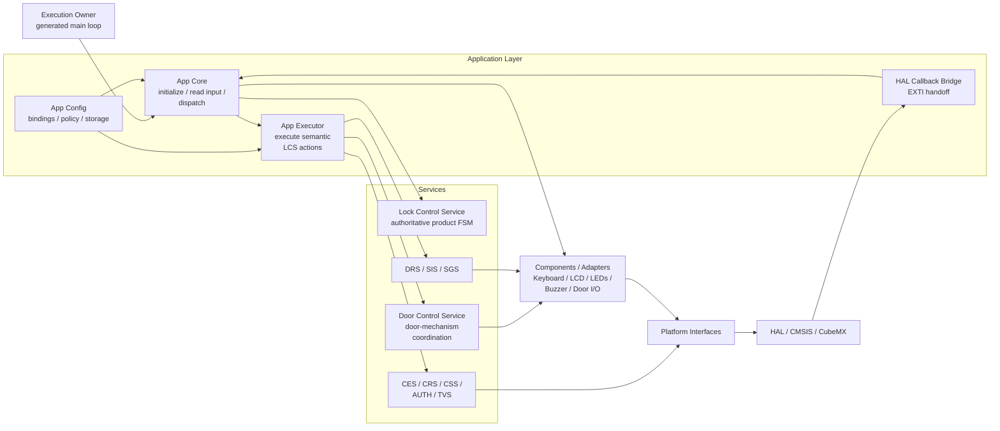
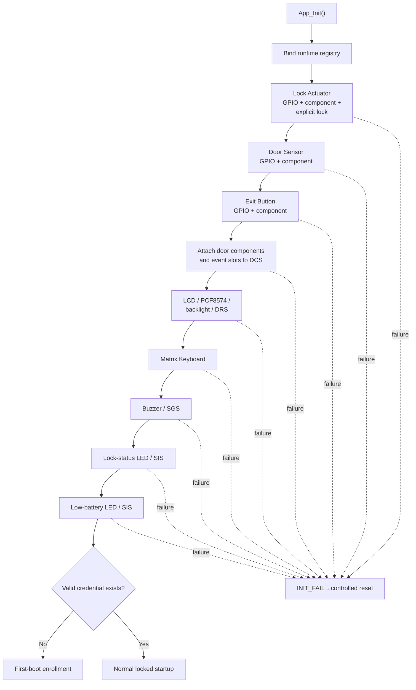
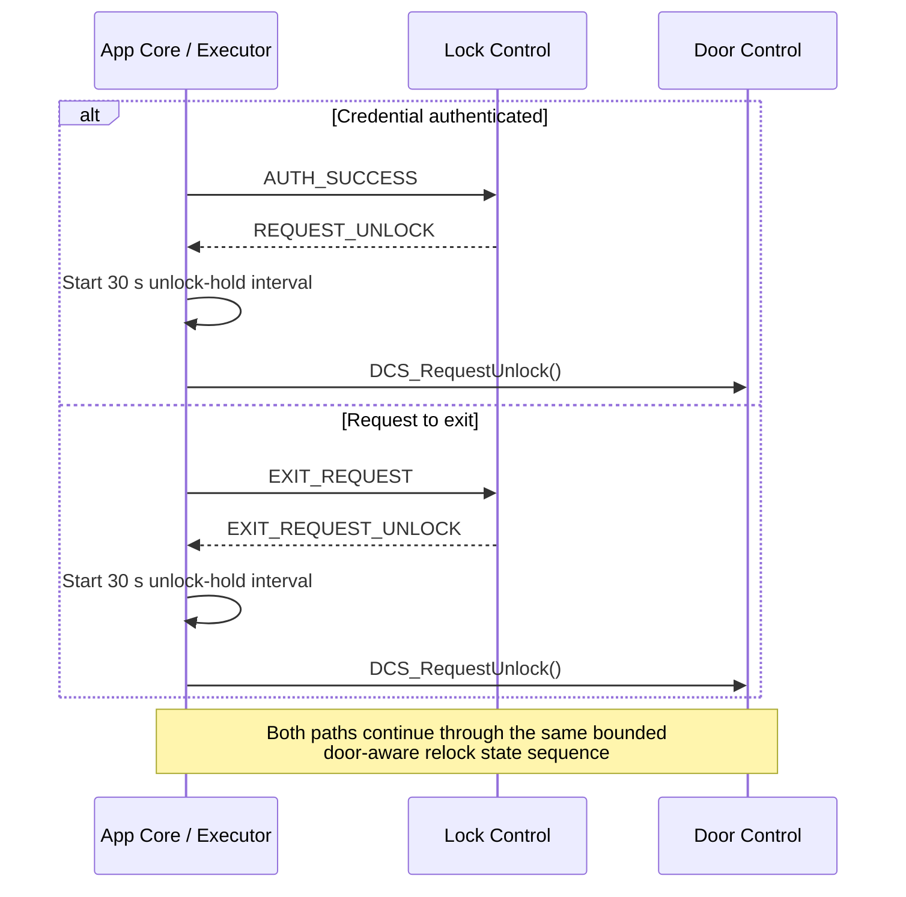
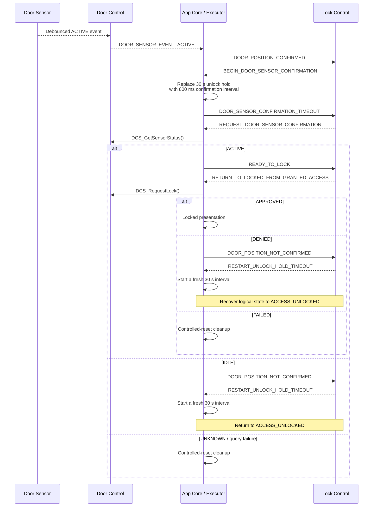
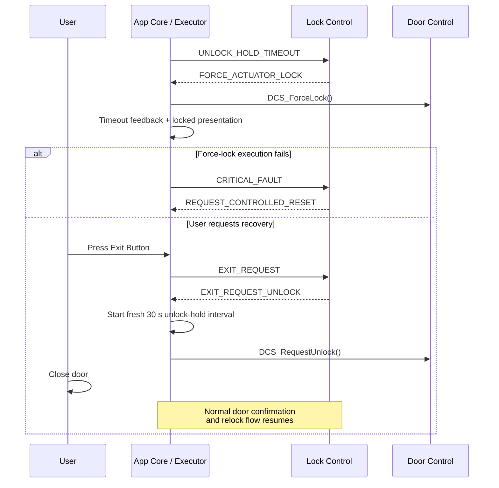

# Application Layer

The `App/` directory is the **composition and orchestration layer** of the electronic-lock firmware.

It binds the product-specific STM32 configuration to reusable Platform interfaces, components and services, owns the application runtime object graph, translates physical or service outcomes into semantic Lock Control events, and executes the semantic actions selected by the authoritative product state machine.

> [!IMPORTANT]
> [`Core/Inc/App_Core.h`](Core/Inc/App_Core.h) is the only public application interface. `App_Config.h`, `App_Core_Internal.h` and `App_Executor.h` are internal collaboration boundaries and shall not be included by `main.c` or by reusable modules outside `App/`.

> [!IMPORTANT]
> The Application Layer does **not** own the authoritative product state machine. The Lock Control Service (LCS) owns product state, transitions, guards, counters and semantic action selection. `App/` owns composition, translation and execution.

---

## Contents

1. [Responsibilities](#1-responsibilities)
2. [Directory Organization](#2-directory-organization)
3. [Architectural Boundaries](#3-architectural-boundaries)
4. [Public API and Execution Model](#4-public-api-and-execution-model)
5. [Initialization and Object Lifetime](#5-initialization-and-object-lifetime)
6. [Runtime Event Orchestration](#6-runtime-event-orchestration)
7. [Keyboard Policy](#7-keyboard-policy)
8. [Timeout Model](#8-timeout-model)
9. [Credential Flows](#9-credential-flows)
10. [Door Control and Relock Flow](#10-door-control-and-relock-flow)
11. [Action Execution](#11-action-execution)
12. [Credential Ownership and Security](#12-credential-ownership-and-security)
13. [Safety and Failure Policy](#13-safety-and-failure-policy)
14. [Timing and Concurrency](#14-timing-and-concurrency)
15. [Known Constraints](#15-known-constraints)
16. [Documentation Authority](#16-documentation-authority)

---

## 1. Responsibilities

The Application Layer owns:

- product-level board bindings and compile-time application policy;
- statically allocated runtime-object storage and object composition;
- initialization order and fail-fast dependency validation;
- attachment of the Lock Actuator, Door Sensor and Exit Button to Door Control Service;
- the HAL EXTI handoff bridge for application-owned door inputs;
- Matrix Keyboard acquisition and translation into credential-entry commands;
- translation of component/service outcomes into semantic LCS events;
- serialized dispatch of LCS events and execution of returned semantic actions;
- bounded synchronous action/event follow-up chains;
- application-level timeout lifecycle;
- coordination of authentication, credential registration and credential persistence;
- execution of normal lock, force-lock and unlock requests through DCS;
- synchronous door-position confirmation during relock;
- semantic display, LED and sound coordination;
- explicit erasure of application-owned transient credential buffers;
- the common controlled-reset cleanup endpoint.

The Application Layer does **not** own:

- the authoritative product FSM;
- LCS state representation, transition guards, pending intent or attempt counters;
- the Door Control Service's normal lock interlock;
- Door Sensor or Exit Button debounce algorithms;
- credential-format validation or the persistent Flash record format;
- Matrix Keyboard scan/debounce algorithms;
- LCD protocol behavior, LED pattern execution or buzzer waveform generation;
- STM32 HAL mechanics that are hidden behind Platform interfaces;
- mechanical feedback proving that the lock bolt actually moved;
- battery measurement or low-power product policy;
- an RTOS scheduler, queue, mutex or software timer.

The central orchestration rule is:

```text
physical/service fact
        ↓
App translation
        ↓
semantic LCS event
        ↓
LCS decision
        ↓
semantic LCS action
        ↓
App Executor
        ↓
concrete service/component operation
        ↓
optional synchronous follow-up event
```

This boundary keeps **product decision** separate from **operation execution**.

---

## 2. Directory Organization

```text
App/
├── Config/
│   ├── Inc/
│   │   └── App_Config.h
│   ├── Src/
│   │   ├── App_Config.c
│   │   └── App_ConfigHalCallbacks.c
│   └── README.md
├── Core/
│   ├── Inc/
│   │   ├── App_Core.h
│   │   ├── App_Core_Internal.h
│   │   └── App_Executor.h
│   └── Src/
│       ├── App_Core.c
│       └── App_Executor.c
└── README.md
```

| File | Responsibility | Visibility |
| --- | --- | --- |
| `Core/Inc/App_Core.h` | Application lifecycle and cooperative runtime entry points | Public |
| `Core/Src/App_Core.c` | Initialization, input routing, timeout polling, DCS event consumption and bounded LCS dispatch | Private |
| `Core/Inc/App_Executor.h` | Semantic LCS action-execution contract | App internal |
| `Core/Src/App_Executor.c` | Concrete service, actuator, credential and presentation side effects | Private |
| `Core/Inc/App_Core_Internal.h` | Core-owned timeout operations shared with Executor | App internal |
| `Config/Inc/App_Config.h` | Product bindings, policy constants, timeout types and runtime-registry contract | App internal |
| `Config/Src/App_Config.c` | Static storage for application-owned runtime objects | Private |
| `Config/Src/App_ConfigHalCallbacks.c` | HAL EXTI-to-driver handoff for application-owned interrupt inputs | App internal / HAL callback |
| `Config/README.md` | Detailed application composition and board-binding reference | Documentation |

The current split is intentionally small. It separates:

```text
App Config      → What objects and product bindings exist?
App Core        → What fact occurred and what semantic event represents it?
Lock Control    → What shall the product do?
App Executor    → What concrete operations implement that action?
```

---

## 3. Architectural Boundaries

### 3.1 Dependency view



The important property is the **dependency direction**, not the number of files.

### 3.2 Dependency rules

- External callers include only `App_Core.h`.
- `App_Core.c` may use App-internal collaboration interfaces.
- `App_Executor.c` executes LCS actions but shall not make product-state decisions.
- `App_Config.c` owns storage and compile-time bindings but performs no product workflow.
- `App_ConfigHalCallbacks.c` performs HAL-to-driver interrupt handoff only.
- DCS coordinates the physical door mechanism but does not call `LCS_Process()`.
- LCS returns semantic actions and does not call App, DCS, presentation services or hardware.
- App Core is the product event-routing boundary.
- Reusable services and components shall not depend on `App/`.
- STM32 HAL/CMSIS types shall not cross reusable module boundaries unnecessarily.

### 3.3 Door-input boundary

The interrupt-backed door inputs follow this path:

```text
GPIO EXTI
   ↓
HAL_GPIO_EXTI_Callback()
   ↓
DoorSensor_NotifyInterrupt()
or ExitButton_NotifyInterrupt()
   ↓
timestamp / edge metadata retained by driver
   ↓
DCS_Update()
   ↓
deferred debounce
   ↓
application-owned event slot
   ↓
App Core mapping
   ↓
semantic LCS event
```

The callback bridge does not debounce, query the product FSM or command the actuator.

---

## 4. Public API and Execution Model

The complete public Application API is:

```c
App_InitStatus_t App_Init(void);
void             App_ReadInput(void);
void             App_Dispatch(void);
```

### 4.1 `App_Init()`

`App_Init()` shall be called once after HAL, clock and required CubeMX peripheral initialization.

It:

1. binds the application runtime registry;
2. initializes the Lock Actuator Platform descriptor and component;
3. explicitly requests the configured locked actuator state;
4. initializes the Door Sensor and Exit Button component paths;
5. attaches the three door-mechanism components and event context to DCS;
6. initializes LCD/display, keyboard, buzzer/sound and status-indication paths;
7. checks persistent credential availability;
8. dispatches either mandatory first-boot enrollment or normal locked startup.

Initialization is fail-fast. A required dependency failure is reported to LCS through `LCS_EVENT_INIT_FAIL`; the resulting controlled-reset action enters the common fail-safe cleanup endpoint.

When no valid credential exists:

```text
CSS_HasCredential() == false
        ↓
LCS_EVENT_CREDENTIAL_NOT_REGISTERED
        ↓
mandatory first-boot registration
```

When a valid credential already exists:

```text
CSS_HasCredential() == true
        ↓
LCS_EVENT_INIT_OK
        ↓
normal LOCKED operation
```

### 4.2 `App_ReadInput()`

`App_ReadInput()` performs one non-blocking Matrix Keyboard acquisition step.

A completed key click can:

- request the beginning of a credential-entry session;
- be consumed only as the wake/session-opening key;
- append, confirm or clear credential input through CES;
- request credential replacement;
- produce a semantic LCS event and corresponding action.

It does not:

- poll application timeouts;
- call `DCS_Update()`;
- consume Door Sensor or Exit Button events;
- advance periodic presentation-service state.

### 4.3 `App_Dispatch()`

`App_Dispatch()` performs one cooperative application-service cycle.

The current runtime advances:

1. the active product timeout;
2. Door Control deferred input processing;
3. display rendering state;
4. lock-status indication state;
5. low-battery indication state;
6. sound-generation state;
7. debounced request-to-exit events;
8. debounced Door Sensor events.

The Matrix Keyboard is intentionally acquired through `App_ReadInput()`, not `App_Dispatch()`.

### 4.4 Cooperative execution

A normal generated main-loop integration is:

```c
if(App_Init() != APP_INIT_SUCCESSFULLY)
{
    Error_Handler();
}

while(1)
{
    App_ReadInput();
    App_Dispatch();
}
```

The App API does not define a fixed scheduler period. The execution owner is responsible for calling the runtime functions frequently enough to satisfy keyboard, timeout, door-input and presentation latency requirements.

---

## 5. Initialization and Object Lifetime

### 5.1 Composition order

The application dependency graph is built in fail-fast order:



### 5.2 Static ownership

Application-owned component, adapter, event-slot and credential objects have static storage duration in `App_Config.c`.

`App_RuntimeInstances_t` is an internal registry of borrowed references to that storage. It allows `App_Core.c` and `App_Executor.c` to operate on the same object graph without exporting those objects through the public application API.

The registry is immutable after composition: callers may mutate the runtime state contained by the referenced objects, but shall not replace registry bindings.

No application object is dynamically allocated or freed.

### 5.3 Principal ownership model

| Resource | Owner | Main borrower |
| --- | --- | --- |
| Product constants / hardware bindings | App Config | App Core / Executor |
| Platform descriptors | App Config | components / adapters |
| Component handles | App Config | App Core / services |
| Door Sensor / Exit Button event slots | App Config | DCS → App Core |
| Synchronous door-status slot | App Config | DCS → App Executor |
| Runtime credential buffer | App Config | App Executor / AUTH |
| Active timeout runtime | App Core | App Core / Executor |
| Product state and counters | LCS | App only through event/action contract |

See [`Config/README.md`](Config/README.md) for the detailed object registry and product binding map.

---

## 6. Runtime Event Orchestration

The application handles three main categories of product facts:

1. keyboard input;
2. deferred interrupt-backed door input;
3. synchronous results produced while executing LCS actions.

### 6.1 Keyboard path

```text
matrix GPIO state
    ↓
Matrix Keyboard
    ↓
MK_Output_t
    ↓
App keyboard policy
    ↓
CES_Input_t
    ↓
Credential Entry Service
    ↓
CES_Event_t
    ↓
App semantic mapping
    ↓
LCS_Event_t
    ↓
LCS_Process()
    ↓
LCS_Action_t
    ↓
App_ExecuteAction()
```

### 6.2 Door Sensor and Exit Button path

Current asynchronous mappings are:

| Physical/service event | App mapping |
| --- | --- |
| `EXIT_BUTTON_EVENT_PRESS` | `LCS_EVENT_EXIT_REQUEST` |
| `EXIT_BUTTON_EVENT_RELEASE` | No LCS event |
| `DOOR_SENSOR_EVENT_ACTIVE` | `LCS_EVENT_DOOR_POSITION_CONFIRMED` |
| `DOOR_SENSOR_EVENT_IDLE` | No direct LCS event |

`LCS_EVENT_DOOR_POSITION_NOT_CONFIRMED` is intentionally **not** generated from an asynchronous `DOOR_SENSOR_EVENT_IDLE`.

That event represents a synchronous relock-validation failure and is produced when:

- `DCS_GetSensorStatus()` reports the non-permissive `IDLE` state during confirmation; or
- the final `DCS_RequestLock()` is denied because the Door Sensor condition changed after semantic readiness was established.

This prevents an unrelated asynchronous door transition from being interpreted as failure of a relock handshake that may not currently be active.

### 6.3 Bounded synchronous follow-up chain

Some LCS actions produce an immediate semantic result. Examples include:

- authentication;
- registration staging validation;
- credential persistence;
- unlock execution;
- synchronous Door Sensor confirmation;
- final relock execution.

App Core processes those results iteratively:

```text
event
  ↓
LCS_Process()
  ↓
action
  ↓
App_ExecuteAction()
  ↓
follow-up event?
  ├─ no  → return
  └─ yes → next bounded iteration
```

The chain is intentionally iterative rather than recursive.

`APP_MAX_LCS_DISPATCH_DEPTH` is currently `4U`.

If a valid non-`NONE` follow-up event remains after the bound is exhausted, App Core routes execution through `LCS_ACTION_REQUEST_CONTROLLED_RESET`, converging on the same Executor-owned fail-safe cleanup used by other critical faults.

---

## 7. Keyboard Policy

The current keyboard layout is:

```text
1 2 3 A
4 5 6 B
7 8 9 C
* 0 # D
```

Application mapping:

| Key | Current semantic meaning |
| --- | --- |
| `0`..`9` | Credential digit |
| `#` | Confirm current candidate |
| `*` | Clear/cancel according to CES state |
| `C` | Request credential registration while entry is already active |
| `A`, `B`, `D` | No application credential command |

Every accepted click is first offered to LCS as `LCS_EVENT_CREDENTIAL_ENTRY_REQUESTED`.

If LCS returns `LCS_ACTION_BEGIN_CREDENTIAL_ENTRY_SESSION`, that click is consumed as a **wake/session-opening key** and is not inserted into the credential candidate.

When a credential-entry session is already active, `C` is intercepted by App Core and converted to `LCS_EVENT_CREDENTIAL_REGISTER_REQUESTED`.

All other supported credential keys are translated to `CES_Input_t` and passed to Credential Entry Service.

The keyboard scan/debounce algorithm belongs to the Matrix Keyboard component. App Config currently provides a 40 ms debounce policy.

---

## 8. Timeout Model

The application owns a **single active product timeout** because currently timed LCS phases are mutually exclusive.

`App_Config.h` owns timeout identifiers and duration policy. `App_Core.c` owns the mutable timeout runtime and lifecycle operations.

Current mapping:

| App timeout | Duration | Elapsed LCS event |
| --- | ---: | --- |
| Credential-entry inactivity | 5,000 ms | `LCS_EVENT_ENTRY_TIMEOUT` |
| Unlock hold awaiting door position | 30,000 ms | `LCS_EVENT_UNLOCK_HOLD_TIMEOUT` |
| Door-position confirmation | 800 ms | `LCS_EVENT_DOOR_SENSOR_CONFIRMATION_TIMEOUT` |
| Access-denied feedback | 1,500 ms | `LCS_EVENT_DENIED_ACCESS_TIMEOUT` |
| Lockout | 10,000 ms | `LCS_EVENT_LOCKOUT_TIMEOUT` |
| Credential-saved feedback | 1,500 ms | `LCS_EVENT_CREDENTIAL_REGISTER_DONE` |

The timeout runtime stores:

```text
selected timeout id
start timestamp
active flag
```

Expiration is evaluated using `Platform_GetMillis()` and Timeout Validation Service rollover-safe elapsed-time arithmetic.

The timeout is cancelled **before** its semantic event is returned, preventing repeated emission of the same expiration.

Both authenticated access and request-to-exit start a 30-second unlock-hold interval before App Executor requests physical unlock.
The interval bounds how long `ACCESS_UNLOCKED` may wait for the required door-position event.

Door-aware relock uses two distinct timeout phases:

```text
unlock
  ↓
30 s unlock-hold interval
  ├─ expires first → UNLOCK_HOLD_TIMEOUT
  │                    ↓
  │                 force actuator lock
  │                    ↓
  │                 wait for a new exit request
  │
  └─ door-position event
             ↓
      replace active timeout with
      800 ms confirmation interval
             ↓
      synchronous door-state check
             ↓
      final lock interlock
```

Only one interval is active at a time. Starting the 800-millisecond confirmation interval replaces the 30-second unlock-hold interval.
If either synchronous relock decision later reports `DOOR_POSITION_NOT_CONFIRMED`, the dedicated restart action opens a fresh 30-second
unlock-hold interval after LCS returns to `ACCESS_UNLOCKED`.

The timeout-expiration path is:

```text
App_PollTimeout()
  ↓
cancel active timeout
  ↓
return elapsed semantic LCS event
  ↓
LCS_Process()
  ↓
semantic recovery action
```

### First-boot timeout behavior

Mandatory first-boot registration has specialized cancellation policy, but `LCS_EVENT_ENTRY_TIMEOUT` currently has no corresponding first-boot registration transition.

Therefore:

1. App Core observes the elapsed credential-entry timeout;
2. the active timeout runtime is consumed/cancelled;
3. the timeout event is dispatched;
4. LCS ignores it in the mandatory first-boot registration state;
5. the enrollment state remains active.

No automatic first-boot timeout refresh or dedicated feedback action is currently selected.

---

## 9. Credential Flows

### 9.1 Normal authentication

Normal credential entry follows:

```text
wake key
  ↓
CES session
  ↓
6-digit candidate
  ↓
candidate ready
  ↓
App Executor transfers candidate
  ↓
AUTH
  ↓
AUTH_SUCCESS / AUTH_FAILURE
  ↓
LCS decides next state
```

The installed credential is loaded lazily from CSS when authentication first requires it, then retained in the application-owned runtime credential buffer.

### 9.2 Runtime credential replacement

Credential replacement requires authorization by the currently installed credential.

```text
active credential-entry session
  ↓
'C'
  ↓
CREDENTIAL_REGISTER_REQUESTED
  ↓
authenticate installed credential
  ↓
AUTH_SUCCESS with register intent
  ↓
new credential first entry
  ↓
confirmation entry
  ↓
CRS validation
  ↓
CSS persistence
```

LCS owns the registration retry policy. The application only executes the semantic actions selected by LCS.

### 9.3 Mandatory first-boot enrollment

When CSS reports no valid credential during startup, LCS enters the registration first-entry route directly.

Important policy differences are owned by LCS:

- cancellation does not escape mandatory enrollment;
- cancellation refreshes the relevant first-boot registration entry phase;
- the first two confirmation mismatches retry confirmation;
- the third mismatch resets mismatch history and restarts from first entry;
- successful persistence enters bounded saved-feedback;
- completion selects `LCS_ACTION_RETURN_FROM_CREDENTIAL_REGISTER_SESSION_FIRST_BOOT`;
- App Executor completes that action through the common controlled-reset endpoint.

The reset is intentional: the next startup discovers and loads the newly persisted credential through the same normal boot path used by an already provisioned product.

---

## 10. Door Control and Relock Flow

### 10.1 Boundary

DCS owns coordination of:

- Lock Actuator;
- Door Sensor;
- Exit Button;
- normal lock interlock;
- force-lock execution;
- synchronous current Door Sensor status;
- deferred processing of the interrupt-backed door inputs.

App Core owns:

- periodic `DCS_Update()`;
- translation of debounced DCS/component events to semantic LCS events;
- dispatch of resulting LCS actions.

App Executor owns:

- `DCS_RequestUnlock()`;
- `DCS_RequestLock()`;
- `DCS_ForceLock()`;
- `DCS_GetSensorStatus()`;
- semantic mapping of synchronous DCS results.

LCS remains unaware of DCS handles, GPIOs and component-driver types.

### 10.2 Authenticated entry and request to exit

Both authorized entry modes converge on `ACCESS_UNLOCKED`:



Request-to-exit authorization is a product policy decision made by LCS. DCS only executes the already-authorized unlock request.

### 10.3 Unlock execution failure

Unlock execution has an explicit semantic recovery path.

```text
DCS_RequestUnlock()
        ↓
      failed
        ↓
DCS_ForceLock()
   ├─ succeeds
   │     ↓
   │  UNLOCK_REQUEST_FAILED
   │     ↓
   │  LCS reconciles ACCESS_UNLOCKED → LOCKED
   │
   └─ fails
         ↓
      CRITICAL_FAULT
         ↓
      LCS FAULT
         ↓
      controlled reset
```

Both credential-authenticated unlock and request-to-exit unlock use this policy. Each action first starts the unlock-hold timeout and
then requests physical unlock. A timeout-definition failure is reported as `UNLOCK_REQUEST_FAILED` without issuing the unlock command.

This distinction is important:

- an unlock command that fails but is followed by successful safe-lock recovery is a **recoverable semantic failure**;
- failure to restore the configured safe actuator state is a **critical fault**.

### 10.4 Door-aware relock



There are intentionally two current-condition checks before normal relock:

1. `DCS_GetSensorStatus()` authorizes the semantic `READY_TO_LOCK` decision.
2. `DCS_RequestLock()` samples the Door Sensor again immediately before commanding the actuator.

The second check closes the race between logical readiness and physical lock execution.

### 10.5 Door-held-open recovery

If no required door-position event arrives within 30 seconds, App Core consumes the active timeout and dispatches
`LCS_EVENT_UNLOCK_HOLD_TIMEOUT`. LCS enters `DOOR_HELD_OPEN` and selects `LCS_ACTION_FORCE_ACTUATOR_LOCK`:



The forced command removes the sustained unlock request even though the current door position does not permit normal interlocked
locking. Recovery deliberately requires a new validated Exit Button event; a door-position event alone is not accepted from
`DOOR_HELD_OPEN`.

### 10.6 Normal lock versus force lock

Normal lock:

```text
App Executor
    ↓
DCS_RequestLock()
    ↓
current Door Sensor state
    ↓
lock permitted?
   ├─ yes → LockActuator_Lock()
   └─ no  → DENIED without lock command
```

Force lock:

```text
App Executor
    ↓
DCS_ForceLock()
    ↓
LockActuator_Lock()
```

`DCS_ForceLock()` intentionally bypasses the normal Door Sensor interlock and is reserved for explicit state-machine recovery or the
common fail-safe cleanup path. The door-held-open timeout is one such explicit policy boundary.

It shall not replace normal door-aware relock.

---

## 11. Action Execution

`App_Executor.c` implements the concrete side of the `LCS_Action_t` contract.

Its responsibilities include:

- opening, refreshing and ending CES sessions;
- transferring completed CES candidates;
- loading the installed credential from CSS;
- invoking Authentication Service;
- staging and validating credential replacement through CRS;
- persisting validated credentials through CSS;
- updating the runtime credential after successful persistence;
- starting and cancelling App-owned timeouts;
- executing DCS lock/unlock/status operations;
- producing synchronous semantic follow-up events;
- selecting display, indication and sound behavior;
- erasing transient credential material;
- executing the controlled-reset cleanup endpoint.

The Executor does **not** inspect private LCS state or reproduce state-machine policy.

### 11.1 Representative synchronous results

| LCS action | App Executor result |
| --- | --- |
| `LCS_ACTION_REQUEST_AUTHENTICATION` | `LCS_EVENT_AUTH_SUCCESS` or `LCS_EVENT_AUTH_FAILURE` |
| `LCS_ACTION_REQUEST_CREDENTIAL_REGISTER_STAGES_VALIDATION` | staging validation success/failure |
| `LCS_ACTION_REQUEST_CREDENTIAL_REGISTER_STORAGE` | storage success/failure |
| `LCS_ACTION_REQUEST_UNLOCK` | normal completion, `UNLOCK_REQUEST_FAILED`, or `CRITICAL_FAULT` |
| `LCS_ACTION_EXIT_REQUEST_UNLOCK` | normal completion, `UNLOCK_REQUEST_FAILED`, or `CRITICAL_FAULT` |
| `LCS_ACTION_FORCE_ACTUATOR_LOCK` | normal completion or `CRITICAL_FAULT` |
| `LCS_ACTION_RESTART_UNLOCK_HOLD_TIMEOUT` | normal completion or `CRITICAL_FAULT` |
| `LCS_ACTION_REQUEST_DOOR_SENSOR_CONFIRMATION` | `READY_TO_LOCK`, `DOOR_POSITION_NOT_CONFIRMED`, or controlled reset |
| `LCS_ACTION_RETURN_TO_LOCKED_FROM_GRANTED_ACCESS` | normal completion, `DOOR_POSITION_NOT_CONFIRMED`, or controlled reset |
| `LCS_ACTION_RETURN_FROM_CREDENTIAL_REGISTER_SESSION_FIRST_BOOT` | controlled reset; no follow-up event |

Immediate semantic results are returned to App Core and are dispatched only after the current `LCS_Process()` call has completed.

### 11.2 Relock result preservation

`DCS_RequestLock()` returns a three-way result:

```text
DCS_LOCK_REQUEST_APPROVED
DCS_LOCK_REQUEST_DENIED
DCS_LOCK_REQUEST_FAILED
```

The distinction is intentionally preserved because:

```text
DENIED
    → current physical door condition does not permit locking
    → recover to ACCESS_UNLOCKED
    → restart 30 s unlock-hold interval

FAILED
    → actuator/dependency execution failure
    → controlled reset
```

A Boolean wrapper would lose the information required by that recovery policy.

---

## 12. Credential Ownership and Security

Credential data crosses explicit ownership boundaries.

### 12.1 Ownership

1. **CES** owns the candidate during an active entry session.
2. **App Executor** uses the application transient candidate buffer only for bounded synchronous transfer.
3. **AUTH** borrows the candidate and installed credential for comparison.
4. **CRS** owns temporary first-entry staging during registration.
5. **CSS** owns the persistent record format and Flash transaction policy.
6. **App Config** owns the retained runtime credential buffer used after a valid CSS load/save.

### 12.2 Erasure policy

The application explicitly clears:

- its transient candidate buffer;
- temporary registration persistence buffers;
- CRS staging on terminal paths;
- the retained runtime credential before controlled reset.

CES remains responsible for erasing its own internal candidate storage through its session lifecycle.

Compile-time assertions require the credential-length contracts of CES, AUTH, CRS, CSS and DRS to remain compatible.

### 12.3 Application security rules

Credential bytes shall not be:

- logged;
- traced;
- rendered;
- placed in diagnostic strings;
- exported through `App_Core.h`;
- copied into documentation examples.

The longer-lived runtime credential buffer is intentional. It avoids rereading Flash for every authentication, but it also means the installed credential remains present in RAM during normal operation.

---

## 13. Safety and Failure Policy

### 13.1 Startup locked request

The product interprets the Lock Actuator's active-low output as the configured locked request.

The startup defense is layered:

```text
CubeMX GPIO initialization
    ↓
configured locked electrical level
    ↓
App_InitLockActuator()
    ↓
Platform GPIO descriptor
    ↓
Lock Actuator component initialization
    ↓
explicit LockActuator_Lock()
```

Failure to establish the application-level locked request causes initialization failure.

The firmware confirms only the **electrical/software command**, not mechanical bolt engagement.

### 13.2 Unlock recovery

If the already-authorized unlock command fails:

```text
unlock failure
    ↓
force safe lock
    ├─ success → UNLOCK_REQUEST_FAILED → LCS returns to LOCKED
    └─ failure → CRITICAL_FAULT → FAULT → controlled reset
```

This gives LCS an explicit semantic representation of both recoverable unlock-execution failure and critical safe-state recovery failure.

The unlock-hold timeout has its own explicit actuator recovery:

```text
UNLOCK_HOLD_TIMEOUT
    ↓
DOOR_HELD_OPEN + force actuator lock
    ├─ success → wait for a new Exit Button request
    └─ failure → CRITICAL_FAULT → FAULT → controlled reset
```

### 13.3 Relock failure classes

The normal relock path preserves the difference between policy denial and execution failure:

```text
DCS_LOCK_REQUEST_APPROVED
    → locked presentation

DCS_LOCK_REQUEST_DENIED
    → DOOR_POSITION_NOT_CONFIRMED
    → ACCESS_UNLOCKED
    → restart 30 s unlock-hold interval

DCS_LOCK_REQUEST_FAILED
    → controlled reset
```

### 13.4 Controlled-reset endpoint

Critical application paths converge on one Executor-owned cleanup endpoint.

It:

- invalidates the runtime-credential-valid state;
- cancels the active application timeout;
- ends CES;
- clears CRS staging;
- erases the application transient candidate;
- erases the retained runtime credential;
- requests `App_ForceLock()`;
- stops Sound Generator;
- disables the LCD backlight;
- disables interrupts;
- requests system reset.

The force-lock operation is intentionally independent of the normal Door Sensor interlock.

The current implementation requests reset even if the final force-lock attempt itself cannot be confirmed successful; there is no mechanical lock-position feedback or alternate actuator recovery mechanism.

### 13.5 Dispatch-bound overflow

A synchronous event/action chain that exceeds `APP_MAX_LCS_DISPATCH_DEPTH` is treated as abnormal application behavior.

App Core converges that path on `LCS_ACTION_REQUEST_CONTROLLED_RESET`, so the same Executor cleanup endpoint is used rather than allowing an unbounded cooperative loop.

### 13.6 Presentation failures

Display, LED and sound failures are generally treated as degraded feedback unless they prevent a dependency from initializing.

Presentation behavior shall never be used as evidence that the lock actuator reached a safe mechanical state.

---

## 14. Timing and Concurrency

The current application model is:

- synchronous;
- cooperative;
- serialized;
- non-reentrant.

`App_ReadInput()` and `App_Dispatch()` shall be called from one execution owner.

Neither function shall be called from an ISR.

### 14.1 Runtime cadence

The execution owner must call:

- `App_ReadInput()` frequently enough to support Matrix Keyboard scanning and its 40 ms debounce policy;
- `App_Dispatch()` frequently enough to observe product timeouts with acceptable latency;
- `App_Dispatch()` frequently enough to allow Door Sensor and Exit Button deferred debounce to complete;
- `App_Dispatch()` while presentation patterns or unlocked/relock behavior are active.

Configured physical-input debounce values are:

- Door Sensor: 500 ms quiet interval;
- Exit Button: 20 ms quiet interval.

These intervals do not cause blocking waits. EXTI records edge timing and later DCS/component updates determine when the quiet interval has elapsed.

### 14.2 Serialization contract

There is currently no App-layer mutex protecting:

- `App_Instance`;
- the active timeout runtime;
- LCS singleton state;
- DCS singleton state;
- CES/CRS singleton state;
- presentation-service state;
- application event slots.

Adding an RTOS would not make these APIs automatically thread-safe.

A future RTOS design should normally preserve one task as the owner of application orchestration or introduce an explicit serialization boundary.

### 14.3 ISR contract

The application interrupt path shall remain limited to notification:

```text
HAL EXTI
   ↓
timestamp / edge handoff
   ↓
return
```

No deliberate delay, debounce wait, LCS dispatch, credential operation, presentation update or actuator command belongs in ISR context.

### 14.4 Blocking scope

Product-level human-scale timing is timestamp-driven and cooperative.

Some lower-level peripheral operations remain synchronous and bounded. In particular, LCD communication/command execution is not an asynchronous transaction engine and can occupy the serialized application context for its bounded transfer and command-delay duration.

---

## 15. Known Constraints

The following constraints describe the current Application Layer as implemented.

- **Only one application timeout can be active.** The model relies on mutually exclusive timed product phases.
- **`APP_MAX_LCS_DISPATCH_DEPTH` is fixed at four iterations.** It protects cooperative execution from accidental synchronous action/event cycles.
- **Door Sensor and Exit Button events use caller-owned event slots rather than queues.** They are intended for immediate consumption during the serialized update cycle.
- **Only Exit Button press is mapped to LCS.** Release currently has no product-level semantic mapping.
- **Only Door Sensor `ACTIVE` is mapped asynchronously to LCS.** `IDLE` is intentionally not treated as `DOOR_POSITION_NOT_CONFIRMED`.
- **Recoverable unlock failure leaves the already-started unlock-hold timeout active until it expires or another timeout replaces it.**
  Its eventual event has no transition from `LOCKED` and is therefore ignored by LCS.
- **First-boot entry timeout policy is incomplete.** The elapsed timeout is consumed, but LCS has no dedicated first-boot timeout transition, so mandatory enrollment remains active without automatic timeout refresh/feedback.
- **Several non-access terminal actions request normal locking and ignore the exact `DCS_RequestLockStatus_t`.** Those paths do not currently promote a denied/failed normal lock request to a dedicated semantic LCS event.
- **Periodic DCS update failure is not currently promoted into product fault policy by App Core.**
- **Presentation update failures are not generally escalated to LCS.**
- **No independent mechanical lock-position feedback exists.** Successful actuator API execution confirms only the requested electrical/software operation.
- **No battery measurement source currently drives the low-battery indication path.**
- **Credential availability at startup is Boolean.** `CSS_HasCredential()` does not distinguish every unavailable, malformed or unreadable storage condition to App Core.
- **The installed credential remains in RAM between authentications by design.**
- **Runtime entry points rely on the initialization lifecycle contract.** They do not perform complete repeated initialization-state validation on every call.
- **The Application Layer has no dedicated native integration suite yet.** Current native verification is concentrated on the hardware-independent LCS behavior.
- **Worst-case cooperative timing is not yet characterized.** Maximum dispatch latency, input-response latency and timeout-observation error still require target measurement.
- **The Application Layer is non-reentrant.** Any future multi-context ownership requires explicit serialization.

These are implementation constraints, not hidden product guarantees. Broader product limitations are summarized in the project root [`README.md`](../README.md).

---

## 16. Documentation Authority

This README describes **Application Layer architecture, ownership and integration behavior**.

It intentionally does not duplicate complete service APIs, FSM transition tables or board configuration details.

Use the following artifacts as the source of truth for their respective contracts:

| Topic | Authoritative artifact |
| --- | --- |
| Public application API | [`Core/Inc/App_Core.h`](Core/Inc/App_Core.h) |
| Product bindings and App compile-time policy | [`Config/Inc/App_Config.h`](Config/Inc/App_Config.h) |
| Runtime object storage/composition | [`Config/Src/App_Config.c`](Config/Src/App_Config.c) and [`Config/README.md`](Config/README.md) |
| App orchestration behavior | [`Core/Src/App_Core.c`](Core/Src/App_Core.c) |
| LCS action execution and application fault cleanup | [`Core/Src/App_Executor.c`](Core/Src/App_Executor.c) |
| Product FSM | [`../Libs/Services/Lock_Control/README.md`](../Libs/Services/Lock_Control/README.md) and production LCS source |
| Door-mechanism policy | [`../Libs/Services/Door_Control/README.md`](../Libs/Services/Door_Control/README.md) |
| Credential entry | [`../Libs/Services/Credential_Entry/README.md`](../Libs/Services/Credential_Entry/README.md) |
| Credential registration | [`../Libs/Services/Credential_Register/README.md`](../Libs/Services/Credential_Register/README.md) |
| Persistent credential storage | [`../Libs/Services/Credential_Storage/README.md`](../Libs/Services/Credential_Storage/README.md) |
| Platform abstraction | [`../Platforms/README.md`](../Platforms/README.md) |
| Native verification | [`../Tests/README.md`](../Tests/README.md) |
| CubeMX pin/peripheral setup | [`../Electronic-Lock.ioc`](../Electronic-Lock.ioc) |
| Project-level overview | [`../README.md`](../README.md) |

Public module headers remain authoritative for exact function signatures, public types, parameters and return-value contracts.

This README should explain **why the App layer exists and how its boundaries collaborate**, rather than reproducing every lower-level API.

---

This module follows the project's [license terms](../LICENSE).
