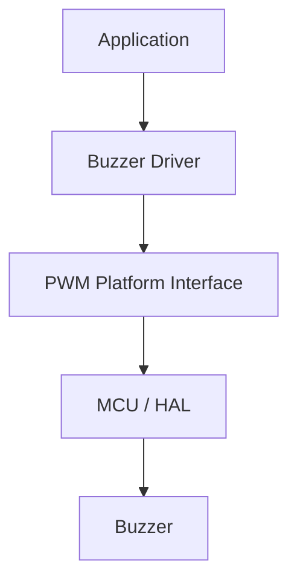
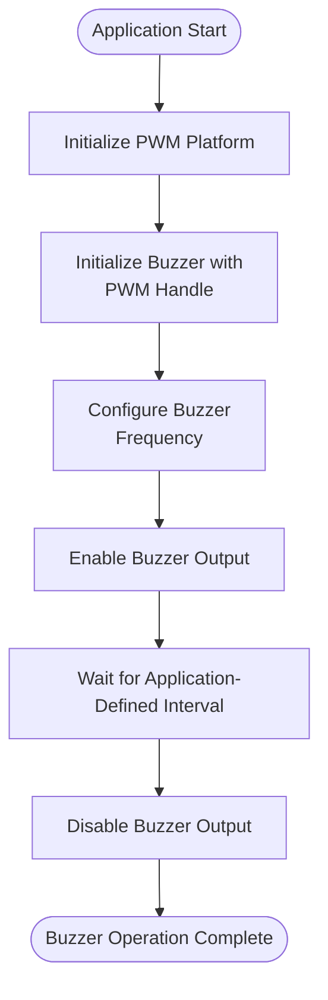
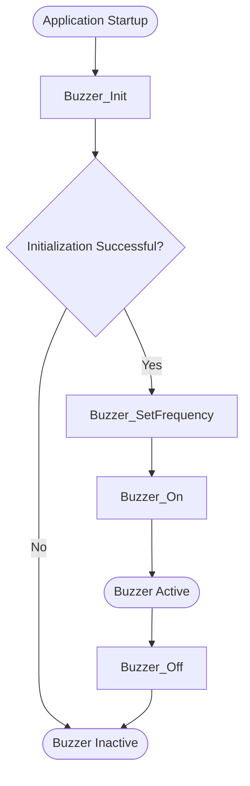
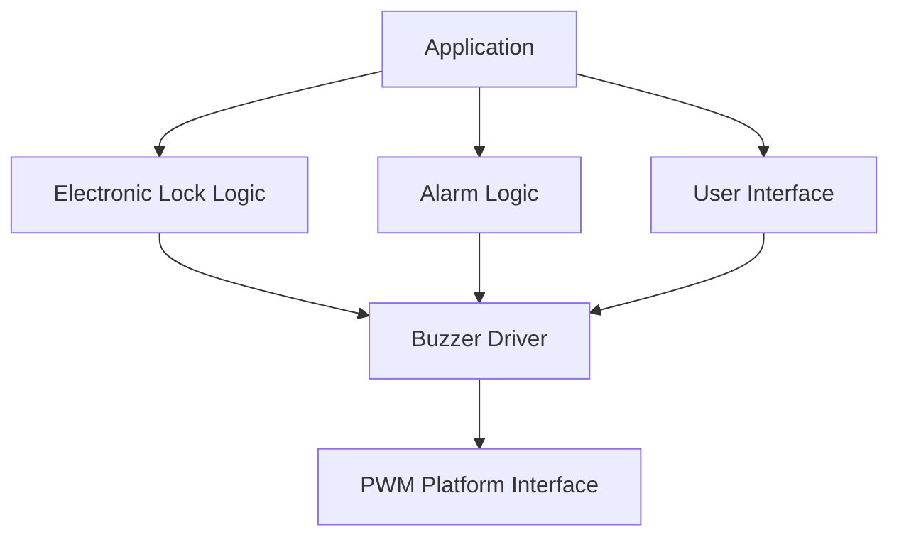

<h1 align="left">Buzzer Driver</h1>

<p align="left">
  <big>
    Hardware-independent driver for controlling a PWM-driven buzzer,<br>
    designed for portable embedded systems.
  </big>
</p>

---
## Table of Contents

* [1. Overview](#1-overview)
* [2. Features](#2-features)
* [3. Architecture](#3-architecture)
* [4. Directory Structure](#4-directory-structure)
* [5. Device Overview](#5-device-overview)
* [6. Driver Responsibilities](#6-driver-responsibilities)
* [7. Dependencies](#7-dependencies)
* [8. Data Structures](#8-data-structures)

  * [8.1 Buzzer Handle](#81-buzzer-handle)
  * [8.2 Operation Status](#82-operation-status)
* [9. API Reference](#9-api-reference)

  * [9.1 Buzzer_Init](#91-buzzer_init)
  * [9.2 Buzzer_SetFrequency](#92-buzzer_setfrequency)
  * [9.3 Buzzer_On](#93-buzzer_on)
  * [9.4 Buzzer_Off](#94-buzzer_off)
* [10. Operation Flow](#10-operation-flow)

  * [10.1 Initialization Flow](#101-initialization-flow)
  * [10.2 Operation Sequence](#102-operation-sequence)
* [11. Usage Example](#11-usage-example)
* [12. Design Decisions](#12-design-decisions)

  * [12.1 Hardware Abstraction](#121-hardware-abstraction)
  * [12.2 Handle-Based Architecture](#122-handle-based-architecture)
  * [12.3 Private Driver Data](#123-private-driver-data)
  * [12.4 Separation of Buzzer and PWM Responsibilities](#124-separation-of-buzzer-and-pwm-responsibilities)
* [13. Error Handling](#13-error-handling)
* [14. Usage Constraints](#14-usage-constraints)
* [15. Applications](#15-applications)
* [16. Limitations](#16-limitations)
* [17. License](#17-license)

---
## 1. Overview
- The driver provides an abstraction layer for configuring the buzzer operating frequency and controlling the PWM output state through the PWM Platform Interface.
- The driver abstracts the underlying PWM hardware implementation, allowing the buzzer functionality to be reused across different microcontrollers and hardware platforms.

---

## 2. Features

- Buzzer device initialization.
- Buzzer operating frequency configuration.
- Buzzer output enable.
- Buzzer output disable.
- PWM hardware abstraction.
- Handle-based device management.
- Operation status reporting.
- Separation between buzzer functionality and platform-specific PWM implementation.

---

## 3. Architecture

The driver follows a layered architecture where the buzzer functionality is isolated from the MCU-specific PWM implementation.

The driver does not access MCU timer registers directly. All PWM operations are performed through the PWM Platform Interface.



This architecture allows:

- Replacing the underlying PWM implementation without modifying the driver.
- Reusing the driver across different microcontrollers.
- Keeping hardware-specific timer configuration outside the component driver.
- Simplifying testing through an abstract PWM interface.
- Separating application-level buzzer behavior from hardware control.

---

## 4. Directory Structure

```text
Buzzer/
|
├── Inc/
│   └── Buzzer_Driver.h
|
└── Src/
    └── Buzzer_Driver.c
```

---

## 5. Device Overview

The buzzer is controlled through a PWM signal generated by the underlying platform.

The PWM frequency determines the fundamental frequency of the buzzer output, while the PWM output state determines whether the buzzer is active.

The driver does not directly configure the MCU timer peripheral. Instead, these operations are delegated to the PWM Platform Interface.

---

## 6. Driver Responsibilities

The driver is responsible for:

- Managing buzzer device instances.
- Storing the PWM platform context.
- Maintaining the buzzer initialization state.
- Configuring the buzzer operating frequency.
- Enabling the buzzer PWM output.
- Disabling the buzzer PWM output.
- Reporting the result of each operation.

The driver is **not responsible** for:

- Configuring MCU timer peripherals directly.
- Accessing PWM registers directly.
- Implementing the PWM platform.
- Managing application-level timing.
- Generating melodies.
- Implementing alarm or notification patterns.

Application-specific behaviors such as melodies, alarms, and notification sequences should be implemented at a higher abstraction layer.

---

## 7. Dependencies

The driver depends on:

```text
PWM_Platform_Interface.h
```

The driver communicates with the underlying PWM implementation exclusively through the  PWM Platform Interface.

The driver does not need to know the implementation details of the underlying PWM hardware, such as:

- Timer peripheral used.
- Timer channel used.
- PWM register configuration.
- GPIO configuration.
- Timer clock configuration.

These responsibilities belong to the PWM platform layer.

---

## 8. Data Structures

### 8.1 Buzzer Handle

The driver uses `Buzzer_Handle_t` to represent a buzzer device instance.

```c
typedef struct
{
    PWM_Handle_t* _context;
    bool          _initialized;

} Buzzer_Handle_t;
```

The handle stores the PWM platform context required by the driver and the internal initialization state of the buzzer.

|Member | Description |
|-------|-------------|
|`_context`    | PWM platform context.|
|`initialized` | Internal initialization state of the buzzer.|

The members of `Buzzer_Handle_t` are considered private data and shall not be accessed or modified directly by the application.

The application shall interact with the buzzer through the public driver API.


### 8.2 Operation Status

The driver uses `Buzzer_OpStatus_t` to report the result of each operation.

```c
typedef enum
{
    BUZZER_OPERATION_OK,
    BUZZER_OPERATION_FAIL

} Buzzer_OpStatus_t;
```

| Status | Description |
|---|---|
| `BUZZER_OPERATION_OK` | Operation completed successfully. |
| `BUZZER_OPERATION_FAIL` | Operation could not be completed. |

---

## 9. API Reference

### 9.1 Buzzer_Init

- Initializes a buzzer device instance and associates it with a PWM platform context.

#### Function Signature

```c
Buzzer_OpStatus_t Buzzer_Init(
    Buzzer_Handle_t* Device,
    PWM_Handle_t*    Context
);
```
#### Parameters

| Parameter | Description |
|---|---|
| `Device` | Pointer to the buzzer device handle. |
| `Context` | Pointer to the PWM platform handle used by the buzzer. |

#### Return

| Return Value | Description |
|---|---|
| `BUZZER_OPERATION_OK` | Buzzer initialized successfully. |
| `BUZZER_OPERATION_FAIL` | Buzzer initialization failed. |

**Note:**
- The PWM context must be valid and properly initialized before calling this function.

### 9.2 Buzzer_SetFrequency

- Configures the frequency of the PWM signal used to drive the buzzer.

#### Function Signature
```c
Buzzer_OpStatus_t Buzzer_SetFrequency(
    Buzzer_Handle_t* Device,
    uint32_t         Frequency
);
```
#### Parameters

| Parameter | Description |
|---|---|
| `Device` | Pointer to the initialized buzzer device handle. |
| `Frequency` | Desired buzzer operating frequency in Hertz. |

#### Return

| Return Value | Description |
|---|---|
| `BUZZER_OPERATION_OK` | Frequency configured successfully. |
| `BUZZER_OPERATION_FAIL` | Frequency configuration failed. |

**Note:**
- The supported frequency range and frequency resolution depend on the underlying PWM platform and hardware configuration.

### 9.3 Buzzer_On

Enables the PWM output associated with the buzzer.

#### Function Signature
```c
Buzzer_OpStatus_t Buzzer_On(
    Buzzer_Handle_t* Device
);
```
#### Parameters

| Parameter | Description |
|---|---|
| `Device` | Pointer to the initialized buzzer device handle. |

#### Return

| Return Value | Description |
|---|---|
| `BUZZER_OPERATION_OK` | Buzzer output enabled successfully. |
| `BUZZER_OPERATION_FAIL` | Buzzer output could not be enabled. |

**Note:**
- The buzzer output uses the frequency previously configured through `Buzzer_SetFrequency()`.
### 9.4 Buzzer_Off

- Disables the PWM output associated with the buzzer.

#### Function Signature
```c
Buzzer_OpStatus_t Buzzer_Off(
    Buzzer_Handle_t* Device
);
```

#### Parameters

| Parameter | Description |
|---|---|
| `Device` | Pointer to the initialized buzzer device handle. |


#### Return

| Return Value | Description |
|---|---|
| `BUZZER_OPERATION_OK` | Buzzer output disabled successfully. |
| `BUZZER_OPERATION_FAIL` | Buzzer output could not be disabled. |

**Note:**
- Disabling the buzzer does not modify the previously configured frequency. 
- The configured frequency remains available for subsequent `Buzzer_On()` operations.

---

## 10. Operation Flow

### 10.1 Initialization Flow
The typical sequence is:


**Note:**
- The buzzer must be initialized before other driver operations are performed.

### 10.2 Operation Sequence
The typical buzzer operation sequence is:



**Note:**
- The duration for which the buzzer remains active is controlled by the application layer and is not managed by the driver.

---

## 11. Usage Example

The following example demonstrates a basic buzzer operation using a `440 Hz` tone.

```c
#include "tim.h"
#include "Buzzer_Driver.h"

static PWM_Handle_t    PwmHandle;
static Buzzer_Handle_t BuzzerHandle;

void BuzzerExample(void)
{
     /*
     * PWM instance previously created.
     */
    PPWM_Create(&PwmHandle, &htim4, PWM_CHANNEL_4);

    if (Buzzer_Init(
            &BuzzerHandle,
            &PwmHandle
        ) != BUZZER_OPERATION_OK)
    {
        return;
    }

    if (Buzzer_SetFrequency(
            &BuzzerHandle,
            440U
        ) != BUZZER_OPERATION_OK)
    {
        return;
    }

    if (Buzzer_On(
            &BuzzerHandle
        ) != BUZZER_OPERATION_OK)
    {
        return;
    }

    /*
     * Buzzer remains active while the PWM output is enabled.
     */

    Buzzer_Off(&BuzzerHandle);
}
```

The example uses `440 Hz`, corresponding to the musical note A4.

The timing between `Buzzer_On()` and `Buzzer_Off()` should be determined by the application requirements.

---

## 12. Design Decisions

### 12.1 Hardware Abstraction

The driver does not directly access MCU timer registers or vendor-specific PWM implementation details.

Instead, all PWM operations are performed through the PWM Platform Interface.

```text
Buzzer Driver
      |
      v
PWM Platform Interface
      |
      v
PWM Platform Implementation
      |
      v
MCU Timer / PWM Peripheral
```

This provides:

- Portability between microcontrollers.
- Easier migration between hardware platforms.
- Separation between component logic and hardware implementation.
- Easier testing through an abstract PWM interface.

### 12.2 Handle-Based Architecture

The driver uses `Buzzer_Handle_t` to represent each buzzer device instance instead of relying on global driver state.

This allows:

- Multiple buzzer instances.
- Independent device contexts.
- Explicit ownership of driver state.
- Improved modularity.

Example:

```c
Buzzer_Handle_t MainBuzzer;
Buzzer_Handle_t AlarmBuzzer;
```

Each handle can reference a different PWM platform instance.

### 12.3 Private Driver Data

The buzzer handle stores internal driver state:

```c
typedef struct
{
    PWM_Handle_t* _context;
    bool          _initialized;

} Buzzer_Handle_t;
```

The `_context` and `_initialized` members are private driver data.

The application shall not modify these members directly.

All state management shall be performed through the public buzzer API.

### 12.4 Separation of Buzzer and PWM Responsibilities

The driver represents the buzzer component, while the PWM platform represents the hardware abstraction required to generate the PWM signal.

```text
Buzzer Driver
     |
     | Buzzer control
     v
PWM Platform Interface
     |
     | Hardware abstraction
     v
MCU PWM Peripheral
```

This separation prevents the driver from becoming coupled to a specific timer peripheral.

---

## 13. Error Handling

All public buzzer operations return a `Buzzer_OpStatus_t` value.

The application should verify the returned status whenever the success of an operation is relevant to system behavior.

Example:

```c
if (Buzzer_SetFrequency(
        &BuzzerHandle,
        1000U
    ) != BUZZER_OPERATION_OK)
{
    /*
     * Handle buzzer configuration failure.
     */
}
```

Operation failures may originate from the driver itself or from the underlying PWM platform interface.

The driver shall propagate the failure status when the requested PWM operation cannot be completed successfully.

---

## 14. Usage Constraints

The following constraints apply when using the driver:

- The `PWM_Handle_t` passed to `Buzzer_Init()` must be valid and properly initialized.
- The `Buzzer_Handle_t` must be initialized before calling other buzzer operations.
- The PWM context referenced by the buzzer handle must remain valid while the buzzer is in use.
- The requested frequency must be supported by the underlying PWM platform.
- The buzzer output shall be controlled through `Buzzer_On()` and `Buzzer_Off()`.
- The internal members of `Buzzer_Handle_t` shall not be accessed or modified directly by the application.
- Application-specific timing, melodies, alarm patterns, and notification sequences shall be implemented outside the driver.

---

## 15. Applications

The `Buzzer_Driver.h` can be used as a building block for higher-level application functionality such as:

- Audible notifications.
- User interface feedback.
- Alarm indications.
- Error indications.
- Access confirmation.
- Electronic lock feedback.

Application-level logic should control the driver according to the required system behavior.

For example:



The driver remains responsible only for controlling the buzzer itself, while higher-level modules determine when and why the buzzer should be activated.

---

## 16. Limitations

Current implementation limitations:

- Buzzer timing is controlled by the application layer.
- Melody generation is not implemented by the driver.
- Alarm and notification patterns are not implemented by the driver.
- Frequency generation depends on the capabilities of the underlying PWM platform.
- The driver does not directly manage the MCU timer peripheral.
- The driver does not provide a dedicated asynchronous buzzer pattern scheduler.

---

## 17. License

This module is part of the 
```text
Electronic Lock Project 
```
and follows the project's license terms.
