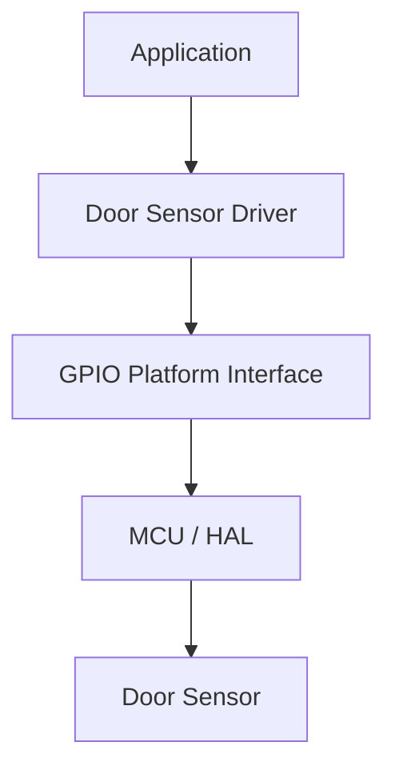
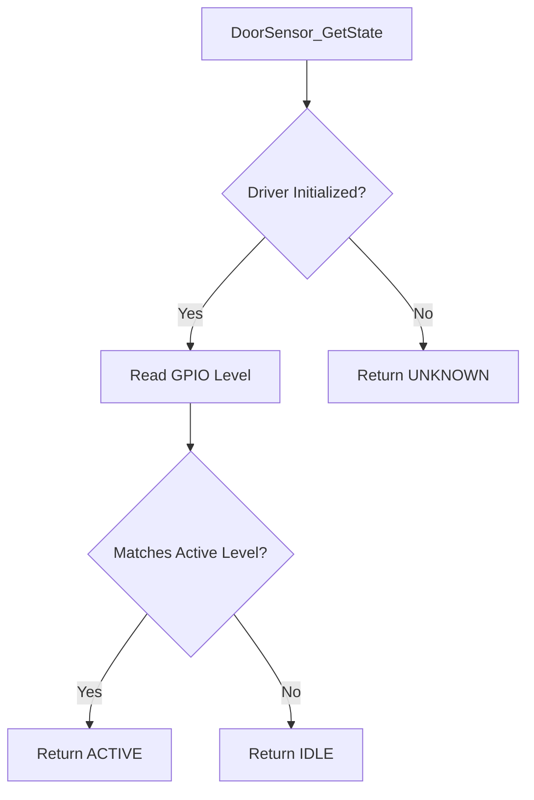

<h1 align="left">Door Sensor Driver</h1>

<p align="left">
  <big>
    Hardware-independent driver for reading a digital door sensor,<br>
    designed for portable embedded systems.
  </big>
</p>

---

## Table of Contents

* [1. Overview](#1-overview)
* [2. Features](#2-features)
* [3. Architecture](#3-architecture)
* [4. Directory Structure](#4-directory-structure)
* [5. Device Overview](#5-device-overview)
* [6. Driver Responsibilities](#6-driver-responsibilities)
* [7. Dependencies](#7-dependencies)
* [8. Data Structures](#8-data-structures)

  * [8.1 Door Sensor Handle](#81-door-sensor-handle)
  * [8.2 Operation Status](#82-operation-status)
  * [8.3 Active Level](#83-active-level)
  * [8.4 Sensor State](#84-sensor-state)
* [9. API Reference](#9-api-reference)

  * [9.1 DoorSensor_Init](#91-doorsensor_init)
  * [9.2 DoorSensor_GetState](#92-doorsensor_getstate)
* [10. Operation Flow](#10-operation-flow)

  * [10.1 Initialization Flow](#101-initialization-flow)
  * [10.2 State Reading Flow](#102-state-reading-flow)
* [11. Usage Example](#11-usage-example)
* [12. Design Decisions](#12-design-decisions)

  * [12.1 Hardware Abstraction](#121-hardware-abstraction)
  * [12.2 Polarity Normalization](#122-polarity-normalization)
  * [12.3 Handle-Based Architecture](#123-handle-based-architecture)
  * [12.4 Separation of Driver and Application Policy](#124-separation-of-driver-and-application-policy)
* [13. Error Handling](#13-error-handling)
* [14. Usage Constraints](#14-usage-constraints)
* [15. Applications](#15-applications)
* [16. Limitations](#16-limitations)
* [17. License](#17-license)

---

## 1. Overview

- The driver provides an abstraction layer for reading a digital door sensor through the GPIO Platform Interface.
- The driver converts the electrical GPIO level into a normalized `ACTIVE` or `IDLE` sensor state.
- The active electrical level is configurable, allowing the same API to support active-high and active-low sensor circuits.
- The physical meaning of the active state is defined by the hardware integration and application layer.

---

## 2. Features

- Door sensor instance initialization.
- Digital sensor state reading.
- Configurable active-high or active-low operation.
- GPIO hardware abstraction.
- Handle-based device management.
- Explicit initialization status reporting.
- No dynamic memory allocation.
- Separation between electrical polarity and application-level door state policy.

---

## 3. Architecture

The driver follows a layered architecture where door sensor behavior is isolated from the MCU-specific GPIO implementation.

The driver does not access MCU GPIO registers directly. All input reads are performed through the GPIO Platform Interface.



This architecture allows:

- Replacing the underlying GPIO implementation without modifying the driver.
- Reusing the driver across different microcontrollers.
- Keeping MCU pin access outside the component driver.
- Testing polarity mapping through an abstract GPIO interface.
- Keeping door-open and door-closed policy at a higher abstraction layer.

---

## 4. Directory Structure

```text
DoorSensor/
|
├── Inc/
│   └── DoorSensor_Driver.h
|
├── Src/
│   └── DoorSensor_Driver.c
|
└── README.md
```

---

## 5. Device Overview

The door sensor is represented by a digital GPIO input.

Depending on the sensor circuit, the asserted condition may produce either a HIGH or LOW electrical level. The driver normalizes this difference through `DoorSensor_ActiveLevel_t`.

| Configured Active Level | GPIO LOW | GPIO HIGH |
|---|---|---|
| `DOOR_SENSOR_ACTIVE_LEVEL_LOW` | `DOOR_SENSOR_STATE_ACTIVE` | `DOOR_SENSOR_STATE_IDLE` |
| `DOOR_SENSOR_ACTIVE_LEVEL_HIGH` | `DOOR_SENSOR_STATE_IDLE` | `DOOR_SENSOR_STATE_ACTIVE` |

`DOOR_SENSOR_STATE_ACTIVE` means only that the GPIO matches the configured active level. It does not inherently mean that the door is open or closed.

For example:

- One installation may define `ACTIVE` as door closed.
- Another installation may define `ACTIVE` as door open.
- A normally closed and a normally open contact may require different active-level configurations.

The hardware integration and application policy shall define the physical meaning of the logical sensor state.

---

## 6. Driver Responsibilities

The driver is responsible for:

- Managing door sensor device instances.
- Storing the GPIO Platform handle.
- Storing the configured active level.
- Maintaining the driver initialization state.
- Reading the current GPIO level.
- Converting the electrical level into `ACTIVE` or `IDLE`.
- Reporting whether initialization succeeds.

The driver is **not responsible** for:

- Configuring the MCU GPIO peripheral.
- Initializing the GPIO Platform handle.
- Selecting pull-up or pull-down resistors.
- Debouncing or filtering the sensor signal.
- Generating edge events or callbacks.
- Determining whether `ACTIVE` means door open or door closed.
- Applying lock, alarm or access-control policy.
- Detecting broken wires or electrical sensor faults.

---

## 7. Dependencies

The driver depends on:

```text
GPIO_Platform_Interface.h
```

The driver communicates with the GPIO hardware exclusively through the GPIO Platform Interface.

The driver does not need to know:

- The MCU GPIO port implementation.
- The vendor HAL type used for the port.
- The physical GPIO pin configuration.
- The configured pull-up or pull-down mode.
- Whether the application polls the sensor periodically or on demand.

The `GPIO_Handle_t` passed to `DoorSensor_Init()` is owned by the caller. It must remain valid while the door sensor driver instance is in use.

---

## 8. Data Structures

### 8.1 Door Sensor Handle

The driver uses `DoorSensor_Handle_t` to represent a door sensor device instance.

```c
typedef struct
{
    GPIO_Handle_t*           _gpio;
    DoorSensor_ActiveLevel_t _active_level;
    bool                     _initialized;

} DoorSensor_Handle_t;
```

The handle stores the GPIO Platform context, the configured electrical active level and the internal initialization state of the sensor.

| Member | Description |
|---|---|
| `_gpio` | Pointer to the GPIO Platform handle used to read the sensor input. |
| `_active_level` | Electrical GPIO level interpreted as the active sensor state. |
| `_initialized` | Internal initialization state of the door sensor driver. |

The members of `DoorSensor_Handle_t` are considered private data and shall not be accessed or modified directly by the application.

The application shall interact with the door sensor through the public driver API.

### 8.2 Operation Status

The driver uses `DoorSensor_OpStatus_t` to report the result of initialization.

```c
typedef enum
{
    DOOR_SENSOR_OPERATION_OK,
    DOOR_SENSOR_OPERATION_FAIL

} DoorSensor_OpStatus_t;
```

| Status | Description |
|---|---|
| `DOOR_SENSOR_OPERATION_OK` | Operation completed successfully. |
| `DOOR_SENSOR_OPERATION_FAIL` | Operation could not be completed. |

### 8.3 Active Level

The driver uses `DoorSensor_ActiveLevel_t` to define which electrical GPIO level represents an active sensor.

```c
typedef enum
{
    DOOR_SENSOR_ACTIVE_LEVEL_HIGH,
    DOOR_SENSOR_ACTIVE_LEVEL_LOW

} DoorSensor_ActiveLevel_t;
```

| Active Level | Description |
|---|---|
| `DOOR_SENSOR_ACTIVE_LEVEL_HIGH` | GPIO HIGH is interpreted as `DOOR_SENSOR_STATE_ACTIVE`. |
| `DOOR_SENSOR_ACTIVE_LEVEL_LOW` | GPIO LOW is interpreted as `DOOR_SENSOR_STATE_ACTIVE`. |

### 8.4 Sensor State

The driver uses `DoorSensor_State_t` to report the normalized logical state of the sensor.

```c
typedef enum
{
    DOOR_SENSOR_STATE_ACTIVE,
    DOOR_SENSOR_STATE_IDLE,
    DOOR_SENSOR_STATE_UNKNOWN

} DoorSensor_State_t;
```

| State | Description |
|---|---|
| `DOOR_SENSOR_STATE_ACTIVE` | The GPIO level matches the configured active level. |
| `DOOR_SENSOR_STATE_IDLE` | The GPIO level is the inverse of the configured active level. |
| `DOOR_SENSOR_STATE_UNKNOWN` | The driver handle is invalid or has not been initialized. |

The application is responsible for assigning physical meaning, such as door open or door closed, to these logical values.

---

## 9. API Reference

### 9.1 DoorSensor_Init

- Initializes a door sensor device instance and associates it with a GPIO Platform context and active level.

#### Function Signature

```c
DoorSensor_OpStatus_t DoorSensor_Init(
    DoorSensor_Handle_t*     Device,
    GPIO_Handle_t*           Context,
    DoorSensor_ActiveLevel_t Level
);
```

#### Parameters

| Parameter | Description |
|---|---|
| `Device` | Pointer to the door sensor device handle. |
| `Context` | Pointer to the GPIO Platform handle used to read the sensor. |
| `Level` | Electrical GPIO level that represents the active sensor state. |

#### Return

| Return Value | Description |
|---|---|
| `DOOR_SENSOR_OPERATION_OK` | Door sensor initialized successfully. |
| `DOOR_SENSOR_OPERATION_FAIL` | A pointer is `NULL` or `Level` is invalid. |

**Notes:**

- The GPIO Platform handle must be valid and initialized before the first call to `DoorSensor_GetState()`.
- This function stores the GPIO handle but does not call `PGPIO_Init()`.
- This function does not configure the MCU pin, read the sensor or apply debounce.

### 9.2 DoorSensor_GetState

- Reads the current electrical level and returns the normalized sensor state.

#### Function Signature

```c
DoorSensor_State_t DoorSensor_GetState(
    DoorSensor_Handle_t* Device
);
```

#### Parameters

| Parameter | Description |
|---|---|
| `Device` | Pointer to an initialized door sensor device handle. |

#### Return

| Return Value | Description |
|---|---|
| `DOOR_SENSOR_STATE_ACTIVE` | The GPIO level matches the configured active level. |
| `DOOR_SENSOR_STATE_IDLE` | The GPIO level is the inverse of the configured active level. |
| `DOOR_SENSOR_STATE_UNKNOWN` | `Device` is `NULL` or the driver is not initialized. |

**Notes:**

- `Device` and its GPIO Platform context must be valid and initialized.
- The function performs a new GPIO read on every call.
- The function does not debounce, filter or cache the sensor state.
- In the current implementation, an initialized read of `GPIO_LEVEL_UNKNOWN` is
  treated as a nonmatching level and therefore reported as `IDLE`. Consumers
  requiring explicit electrical-read failure detection shall retain that as a
  known limitation until the read contract is hardened.

---

## 10. Operation Flow

### 10.1 Initialization Flow

The typical initialization sequence is:


### 10.2 State Reading Flow



The polling frequency and any state-stability interval are controlled by the application.

---

## 11. Usage Example

The following example demonstrates an active-low door contact.

```c
#include "DoorSensor_Driver.h"

static GPIO_Handle_t       DoorSensorGpio;
static DoorSensor_Handle_t DoorSensor;

bool DoorSensorExample_Init(void* GPIO_Port, uint16_t GPIO_Pin)
{
    if(PGPIO_Init(
            &DoorSensorGpio,
            GPIO_Port,
            GPIO_Pin
        )!= GPIO_OPERATION_OK)
    {
        return false;
    }

    return DoorSensor_Init(
               &DoorSensor,
               &DoorSensorGpio,
               DOOR_SENSOR_ACTIVE_LEVEL_LOW
           )== DOOR_SENSOR_OPERATION_OK;
}

void DoorSensorExample_Update(void)
{
    DoorSensor_State_t state = DoorSensor_GetState(&DoorSensor);

    if(state == DOOR_SENSOR_STATE_ACTIVE)
    {
        /* Apply the product-specific meaning of an active contact. */
    }
}
```

The GPIO port, pin, input mode and pull configuration depend on the target board and sensor circuit.

---

## 12. Design Decisions

### 12.1 Hardware Abstraction

The driver uses the GPIO Platform Interface instead of accessing MCU-specific registers or HAL functions.

```text
Door Sensor Driver
        |
        v
GPIO Platform Interface
        |
        v
MCU GPIO Peripheral
```

This improves portability and keeps hardware-specific code outside the component.

### 12.2 Polarity Normalization

The active electrical level is stored in the driver handle. Application code receives the same logical states regardless of whether the sensor is active-high or active-low.

This prevents electrical polarity checks from being duplicated throughout the application.

### 12.3 Handle-Based Architecture

Each door sensor instance has an independent `DoorSensor_Handle_t`.

```c
DoorSensor_Handle_t MainDoorSensor;
DoorSensor_Handle_t ServiceDoorSensor;
```

Each handle may reference a different GPIO and use a different active level.

### 12.4 Separation of Driver and Application Policy

The driver reports `ACTIVE`, `IDLE` or `UNKNOWN`. It does not decide whether the door is open, whether an alarm should sound or whether the actuator may be unlocked.

Those decisions belong to the application and service layers. In this project,
the planned Door Control Service will own that interpretation and coordinate it
with the Exit Button and Lock Actuator drivers.

---

## 13. Error Handling

`DoorSensor_Init()` returns a `DoorSensor_OpStatus_t` value. The application shall verify this status before using the driver.

```c
if(DoorSensor_Init(
        &DoorSensor,
        &DoorSensorGpio,
        DOOR_SENSOR_ACTIVE_LEVEL_LOW
    )!= DOOR_SENSOR_OPERATION_OK)
{
    /* Handle door sensor initialization failure. */
}
```

`DoorSensor_GetState()` returns `DOOR_SENSOR_STATE_UNKNOWN` for a `NULL` or
uninitialized driver handle. The GPIO Platform context must nevertheless be
initialized and remain valid because the current GPIO read path does not expose
a separate operation status.

---

## 14. Usage Constraints

The following constraints apply when using the driver:

- The `GPIO_Handle_t` must identify a pin configured as a digital input.
- The GPIO Platform handle must be initialized before state reads.
- The GPIO Platform handle must remain valid while the door sensor is in use.
- The `DoorSensor_Handle_t` must be initialized before calling `DoorSensor_GetState()`.
- The selected active level must match the sensor circuit.
- Internal handle members shall not be accessed or modified directly.
- Debounce, filtering and transition timing shall be implemented outside the driver.
- Application code shall define whether `ACTIVE` represents door open, door closed or another condition.

---

## 15. Applications

The Door Sensor Driver can be used as a building block for:

- Electronic lock door-position monitoring.
- Door-open alarms.
- Access-control interlocks.
- Cabinet and enclosure monitoring.
- Reed-switch or limit-switch inputs.
- User-interface status indication.

Higher-level modules determine how the normalized state affects product behavior.

---

## 16. Limitations

Current implementation limitations:

- No signal debounce or temporal filtering.
- No interrupt or callback support.
- `GPIO_LEVEL_UNKNOWN` is not distinguished from an initialized inactive read.
- No disconnected-wire or short-circuit detection.
- No event history or transition timestamp.
- No direct distinction between door open and door closed.
- State reading depends on the behavior of the GPIO Platform Interface.
- No internal synchronization for concurrent callers.
- The STM32F103 App binds and initializes the driver on PB0 as an active-low,
  pull-up input. Periodic state reads and product door policy await the planned
  Door Control Service.

---

## 17. License

This module is part of the:

```text
Electronic Lock Project
```

and follows the project's license terms.
