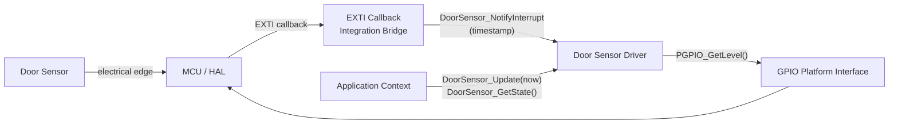
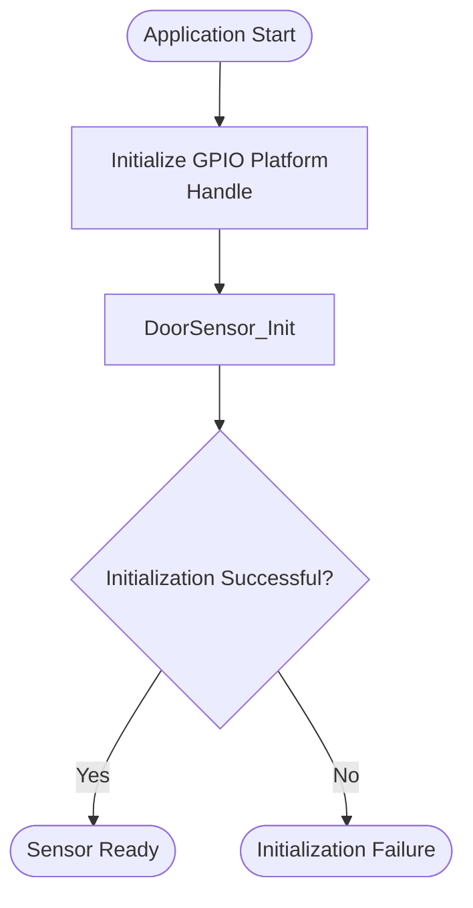
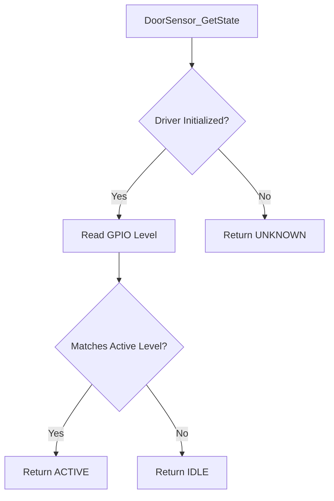
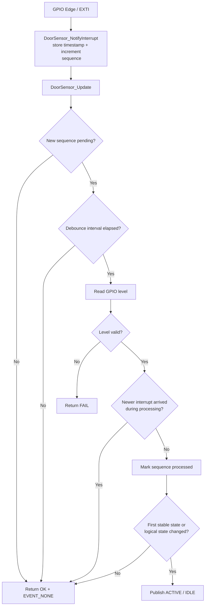

<h1 align="left">Door Sensor Driver</h1>

<p align="left">
  <big>
    Interrupt-oriented driver for a digital door sensor,<br>
    with non-blocking debounce and polarity normalization.
  </big>
</p>

---

## Table of Contents

* [1. Overview](#1-overview)
* [2. Features](#2-features)
* [3. Architecture](#3-architecture)
* [4. Directory Structure](#4-directory-structure)
* [5. Device Overview](#5-device-overview)
* [6. Driver Responsibilities](#6-driver-responsibilities)
* [7. Dependencies](#7-dependencies)
* [8. Data Structures](#8-data-structures)

  * [8.1 Door Sensor Handle](#81-door-sensor-handle)
  * [8.2 Operation Status](#82-operation-status)
  * [8.3 Active Level](#83-active-level)
  * [8.4 Sensor State](#84-sensor-state)
  * [8.5 Sensor Event](#85-sensor-event)
* [9. API Reference](#9-api-reference)

  * [9.1 DoorSensor_Init](#91-doorsensor_init)
  * [9.2 DoorSensor_GetState](#92-doorsensor_getstate)
  * [9.3 DoorSensor_NotifyInterrupt](#93-doorsensor_notifyinterrupt)
  * [9.4 DoorSensor_Update](#94-doorsensor_update)
* [10. Operation Flow](#10-operation-flow)

  * [10.1 Initialization Flow](#101-initialization-flow)
  * [10.2 State Reading Flow](#102-state-reading-flow)
  * [10.3 Interrupt and Debounce Flow](#103-interrupt-and-debounce-flow)
* [11. Usage Example](#11-usage-example)
* [12. Design Decisions](#12-design-decisions)

  * [12.1 Hardware Abstraction](#121-hardware-abstraction)
  * [12.2 Polarity Normalization](#122-polarity-normalization)
  * [12.3 Handle-Based Architecture](#123-handle-based-architecture)
  * [12.4 Separation of Driver and Application Policy](#124-separation-of-driver-and-application-policy)
  * [12.5 Interrupt Handoff and Debounce](#125-interrupt-handoff-and-debounce)
* [13. Error Handling](#13-error-handling)
* [14. Usage Constraints](#14-usage-constraints)
* [15. Applications](#15-applications)
* [16. Limitations](#16-limitations)
* [17. License](#17-license)

---

## 1. Overview

- The driver converts GPIO interrupt notifications into debounced door-sensor transition events.
- The driver converts the electrical GPIO level into a normalized `ACTIVE` or `IDLE` sensor state.
- The active electrical level is configurable, allowing the same API to support active-high and active-low sensor circuits.
- Interrupt notification is separated from application-context GPIO sampling and debounce processing.
- The physical meaning of the active state is defined by the hardware integration and application layer.

---

## 2. Features

- Door sensor instance initialization.
- Rising/falling edge notification from interrupt context.
- Non-blocking, timestamp-based debounce.
- One-shot `ACTIVE` and `IDLE` transition events.
- Immediate normalized state reading for safety checks.
- Configurable active-high or active-low operation.
- GPIO hardware abstraction.
- Handle-based device management.
- Explicit initialization status reporting.
- No dynamic memory allocation.
- Separation between electrical polarity and application-level door state policy.

---

## 3. Architecture

The driver follows a layered architecture where door sensor behavior is isolated from the MCU-specific GPIO implementation.

The driver does not access MCU GPIO registers directly. All input reads are performed through the GPIO Platform Interface.



This architecture allows:

- Replacing the underlying GPIO implementation without modifying the driver.
- Reusing the driver across different microcontrollers.
- Keeping MCU pin access outside the component driver.
- Testing polarity mapping through an abstract GPIO interface.
- Keeping interrupt-facing work short and deferring GPIO sampling and debounce validation to application context.
- Keeping door-open and door-closed policy at a higher abstraction layer.

---

## 4. Directory Structure

```text
DoorSensor/
|
├── Inc/
│   └── DoorSensor_Driver.h
|
├── Src/
│   └── DoorSensor_Driver.c
|
└── README.md
```

---

## 5. Device Overview

The door sensor is represented by a digital GPIO input.

Depending on the sensor circuit, the asserted condition may produce either a HIGH or LOW electrical level. The driver normalizes this difference through `DoorSensor_ActiveLevel_t`.

| Configured Active Level | GPIO LOW | GPIO HIGH |
|---|---|---|
| `DOOR_SENSOR_ACTIVE_LEVEL_LOW` | `DOOR_SENSOR_STATE_ACTIVE` | `DOOR_SENSOR_STATE_IDLE` |
| `DOOR_SENSOR_ACTIVE_LEVEL_HIGH` | `DOOR_SENSOR_STATE_IDLE` | `DOOR_SENSOR_STATE_ACTIVE` |

`DOOR_SENSOR_STATE_ACTIVE` means only that the GPIO matches the configured active level. It does not inherently mean that the door is open or closed.

For example:

- One installation may define `ACTIVE` as door closed.
- Another installation may define `ACTIVE` as door open.
- A normally closed and a normally open contact may require different active-level configurations.

The hardware integration and application policy shall define the physical meaning of the logical sensor state.

---

## 6. Driver Responsibilities

The driver is responsible for:

- Managing door sensor device instances.
- Storing the GPIO Platform handle.
- Storing the configured active level.
- Maintaining the driver initialization state.
- Recording interrupt sequence and timestamp information.
- Validating transitions after a configurable debounce interval.
- Reading the current GPIO level.
- Converting the electrical level into `ACTIVE` or `IDLE`.
- Publishing debounced `ACTIVE` and `IDLE` events.
- Reporting whether initialization succeeds.

The driver is **not responsible** for:

- Configuring the MCU GPIO peripheral.
- Initializing the GPIO Platform handle.
- Selecting pull-up or pull-down resistors.
- Configuring or invoking the MCU interrupt handler.
- Determining whether `ACTIVE` means door open or door closed.
- Applying lock, alarm or access-control policy.
- Detecting broken wires or electrical sensor faults.

---

## 7. Dependencies

The driver depends on:

```text
GPIO_Platform_Interface.h
```

The driver communicates with the GPIO hardware exclusively through the GPIO Platform Interface.

The driver does not need to know:

- The MCU GPIO port implementation.
- The vendor HAL type used for the port.
- The physical GPIO pin configuration.
- The configured pull-up or pull-down mode.
- The concrete source of the millisecond timestamps supplied by the application.

The `GPIO_Handle_t` passed to `DoorSensor_Init()` is owned by the caller. It must remain valid while the door sensor driver instance is in use.

---

## 8. Data Structures

### 8.1 Door Sensor Handle

The driver uses `DoorSensor_Handle_t` to represent a door sensor device instance.

```c
typedef struct
{
    GPIO_Handle_t*           _gpio;
    DoorSensor_ActiveLevel_t _active_level;
    bool                     _is_active;
    bool                     _state_is_known;
    uint32_t                 _debounce_time_ms;
    volatile uint32_t        _interrupt_sequence;
    volatile uint32_t        _interrupt_time_ms;
    uint32_t                 _processed_sequence;
    bool                     _initialized;

} DoorSensor_Handle_t;
```

The handle stores the GPIO Platform context, polarity, last validated state, debounce configuration and interrupt handoff data.

| Member | Description |
|---|---|
| `_gpio` | Pointer to the GPIO Platform handle used to read the sensor input. |
| `_active_level` | Electrical GPIO level interpreted as the active sensor state. |
| `_is_active` | Most recently validated normalized state. |
| `_state_is_known` | Whether at least one stable post-interrupt state was validated. |
| `_debounce_time_ms` | Required quiet interval after the latest edge. |
| `_interrupt_sequence` | ISR-to-application publication sequence. |
| `_interrupt_time_ms` | Timestamp of the latest notified edge. |
| `_processed_sequence` | Latest sequence consumed by `DoorSensor_Update()`. |
| `_initialized` | Internal initialization state of the door sensor driver. |

The members of `DoorSensor_Handle_t` are considered private data and shall not be accessed or modified directly by the application.

The application shall interact with the door sensor through the public driver API.

### 8.2 Operation Status

The driver uses `DoorSensor_OpStatus_t` to report operations that can fail, including initialization and deferred interrupt processing.

```c
typedef enum
{
    DOOR_SENSOR_OPERATION_OK,
    DOOR_SENSOR_OPERATION_FAIL

} DoorSensor_OpStatus_t;
```

| Status | Description |
|---|---|
| `DOOR_SENSOR_OPERATION_OK` | Operation completed successfully. |
| `DOOR_SENSOR_OPERATION_FAIL` | Operation could not be completed. |

### 8.3 Active Level

The driver uses `DoorSensor_ActiveLevel_t` to define which electrical GPIO level represents an active sensor.

```c
typedef enum
{
    DOOR_SENSOR_ACTIVE_LEVEL_HIGH,
    DOOR_SENSOR_ACTIVE_LEVEL_LOW

} DoorSensor_ActiveLevel_t;
```

| Active Level | Description |
|---|---|
| `DOOR_SENSOR_ACTIVE_LEVEL_HIGH` | GPIO HIGH is interpreted as `DOOR_SENSOR_STATE_ACTIVE`. |
| `DOOR_SENSOR_ACTIVE_LEVEL_LOW` | GPIO LOW is interpreted as `DOOR_SENSOR_STATE_ACTIVE`. |

### 8.4 Sensor State

The driver uses `DoorSensor_State_t` to report the normalized logical state of the sensor.

```c
typedef enum
{
    DOOR_SENSOR_STATE_ACTIVE,
    DOOR_SENSOR_STATE_IDLE,
    DOOR_SENSOR_STATE_UNKNOWN

} DoorSensor_State_t;
```

| State | Description |
|---|---|
| `DOOR_SENSOR_STATE_ACTIVE` | The GPIO level matches the configured active level. |
| `DOOR_SENSOR_STATE_IDLE` | The GPIO level is the inverse of the configured active level. |
| `DOOR_SENSOR_STATE_UNKNOWN` | The driver is unavailable or the current GPIO level cannot be normalized as a valid HIGH/LOW input. |

The application is responsible for assigning physical meaning, such as door open or door closed, to these logical values.

### 8.5 Sensor Event

`DoorSensor_Event_t` reports a debounced transition exactly once:

```c
typedef enum
{
    DOOR_SENSOR_EVENT_NONE,
    DOOR_SENSOR_EVENT_ACTIVE,
    DOOR_SENSOR_EVENT_IDLE

} DoorSensor_Event_t;
```

`NONE` means that no new stable state change was completed by the current update call. `ACTIVE` and `IDLE` describe electrical-policy
states; the service layer assigns their physical door meaning.

After initialization, `_state_is_known` is false. Therefore, the first interrupt that survives debounce establishes the first validated
logical state and publishes the corresponding `ACTIVE` or `IDLE` event even though no previous validated state exists. Later updates
suppress duplicate events when the debounced logical state is unchanged.

---

## 9. API Reference

### 9.1 DoorSensor_Init

- Initializes a door sensor device instance and associates it with a GPIO Platform context and active level.

#### Function Signature

```c
DoorSensor_OpStatus_t DoorSensor_Init(
    DoorSensor_Handle_t*     Device,
    GPIO_Handle_t*           Context,
    DoorSensor_ActiveLevel_t Level,
    uint32_t                 DebounceTimeMs
);
```

#### Parameters

| Parameter | Description |
|---|---|
| `Device` | Pointer to the door sensor device handle. |
| `Context` | Pointer to the GPIO Platform handle used to read the sensor. |
| `Level` | Electrical GPIO level that represents the active sensor state. |
| `DebounceTimeMs` | Required stability interval after the latest interrupt edge. |

#### Return

| Return Value | Description |
|---|---|
| `DOOR_SENSOR_OPERATION_OK` | Door sensor initialized successfully. |
| `DOOR_SENSOR_OPERATION_FAIL` | A pointer is `NULL`, `Level` is invalid or the debounce interval is zero. |

**Notes:**

- The GPIO Platform handle must be valid and initialized before the first call to `DoorSensor_GetState()`.
- This function stores the GPIO handle but does not call `PGPIO_Init()`.
- This function does not configure the MCU pin or read the sensor.
- Runtime and interrupt sequencing are reset without generating an event.

### 9.2 DoorSensor_GetState

- Reads the current electrical level and returns the normalized sensor state.

#### Function Signature

```c
DoorSensor_State_t DoorSensor_GetState(
    DoorSensor_Handle_t* Device
);
```

#### Parameters

| Parameter | Description |
|---|---|
| `Device` | Pointer to an initialized door sensor device handle. |

#### Return

| Return Value | Description |
|---|---|
| `DOOR_SENSOR_STATE_ACTIVE` | The GPIO level matches the configured active level. |
| `DOOR_SENSOR_STATE_IDLE` | The GPIO level is the inverse of the configured active level. |
| `DOOR_SENSOR_STATE_UNKNOWN` | The driver is unavailable or `PGPIO_GetLevel()` returns a level other than valid HIGH/LOW. |

**Notes:**

- `Device` and its GPIO Platform context must be valid and initialized.
- The function performs a new GPIO read on every call.
- This immediate read bypasses event debounce and does not mutate the validated event state.
- `GPIO_LEVEL_UNKNOWN` is reported as `DOOR_SENSOR_STATE_UNKNOWN`.

### 9.3 DoorSensor_NotifyInterrupt

Records the timestamp and publication sequence of a GPIO edge. The function is intentionally interrupt-facing: it performs no GPIO read,
polarity conversion, debounce wait or event generation.

```c
void DoorSensor_NotifyInterrupt(
    DoorSensor_Handle_t* Device,
    uint32_t             TimestampMs
);
```

Behavior:

- Notifications received before initialization are ignored.
- The newest edge timestamp is stored first.
- The interrupt sequence is incremented after the timestamp, acting as the publication marker observed by `DoorSensor_Update()`.
- A later edge replaces the previous debounce reference point.
- `TimestampMs` shall use the same unsigned 32-bit millisecond time base supplied later to `DoorSensor_Update()`.

The function is intended to be called by the target's EXTI callback bridge. GPIO sampling and event publication remain deferred to
application context.

### 9.4 DoorSensor_Update

Validates the newest pending interrupt after the configured quiet interval and reports one stable transition event.

```c
DoorSensor_OpStatus_t DoorSensor_Update(
    DoorSensor_Handle_t* Device,
    uint32_t             CurrentTimeMs,
    DoorSensor_Event_t*  Event
);
```

Every call initializes `Event` to `DOOR_SENSOR_EVENT_NONE`.

Processing follows these rules:

- A `NULL` event pointer or uninitialized driver returns `DOOR_SENSOR_OPERATION_FAIL`.
- When no interrupt sequence is pending, the call returns `DOOR_SENSOR_OPERATION_OK` with `NONE`.
- The newest edge is not sampled until the configured debounce interval has elapsed.
- GPIO sampling occurs only in application context through `PGPIO_GetLevel()`.
- Invalid GPIO levels fail normalization and return `DOOR_SENSOR_OPERATION_FAIL`.
- The interrupt sequence is checked before and after sampling. If a newer edge arrives while processing, the sample is discarded and
  debounce restarts from the newer notification.
- Once a sequence is accepted, it becomes the processed sequence.
- The first accepted stable state publishes an event; later identical stable states are suppressed.
- A genuine normalized state change publishes exactly one `ACTIVE` or `IDLE` event.

---

## 10. Operation Flow

### 10.1 Initialization Flow

The typical initialization sequence is:



### 10.2 State Reading Flow



Normal transition handling follows `EXTI edge → DoorSensor_NotifyInterrupt() → debounce interval → DoorSensor_Update()`. An immediate
`DoorSensor_GetState()` read remains available when current level, rather than an edge event, is required.

### 10.3 Interrupt and Debounce Flow



The debounce interval is measured from the latest interrupt notification, not from the application's previous update call. Repeated
bounce edges therefore keep moving the validation deadline forward until the input remains quiet for the configured interval.

Unsigned subtraction is used for the elapsed-time check, so normal 32-bit millisecond-counter rollover is handled as long as timestamps
come from the same monotonic time base.

---

## 11. Usage Example

The following example demonstrates an active-low door contact.

```c
#include "DoorSensor_Driver.h"

static GPIO_Handle_t       DoorSensorGpio;
static DoorSensor_Handle_t DoorSensor;
static DoorSensor_Event_t  DoorSensorEvent;

bool DoorSensorExample_Init(void* GPIO_Port, uint16_t GPIO_Pin)
{
    if(PGPIO_Init(
            &DoorSensorGpio,
            GPIO_Port,
            GPIO_Pin
        )!= GPIO_OPERATION_OK)
    {
        return false;
    }

    return DoorSensor_Init(
               &DoorSensor,
               &DoorSensorGpio,
               DOOR_SENSOR_ACTIVE_LEVEL_LOW,
               20U
           )== DOOR_SENSOR_OPERATION_OK;
}

void HAL_GPIO_EXTI_Callback(uint16_t GPIO_Pin)
{
    if(GPIO_Pin == DOOR_SENSOR_Pin)
    {
        DoorSensor_NotifyInterrupt(&DoorSensor, Platform_GetMillis());
    }
}

void DoorSensorExample_Update(uint32_t CurrentTimeMs)
{
    if(DoorSensor_Update(&DoorSensor, CurrentTimeMs, &DoorSensorEvent) == DOOR_SENSOR_OPERATION_OK &&
       DoorSensorEvent == DOOR_SENSOR_EVENT_ACTIVE)
    {
        /* Apply the product-specific meaning of a stable active transition. */
    }
}
```

The GPIO port, pin, input mode and pull configuration depend on the target board and sensor circuit.

---

## 12. Design Decisions

### 12.1 Hardware Abstraction

The driver uses the GPIO Platform Interface instead of accessing MCU-specific registers or HAL functions.

```text
Door Sensor Driver
        |
        v
GPIO Platform Interface
        |
        v
MCU GPIO Peripheral
```

This improves portability and keeps hardware-specific code outside the component.

### 12.2 Polarity Normalization

The active electrical level is stored in the driver handle. Application code receives the same logical states regardless of whether the sensor is active-high or active-low.

This prevents electrical polarity checks from being duplicated throughout the application.

### 12.3 Handle-Based Architecture

Each door sensor instance has an independent `DoorSensor_Handle_t`.

```c
DoorSensor_Handle_t MainDoorSensor;
DoorSensor_Handle_t ServiceDoorSensor;
```

Each handle may reference a different GPIO and use a different active level.

### 12.4 Separation of Driver and Application Policy

The driver reports `ACTIVE`, `IDLE` or `UNKNOWN`. It does not decide whether the door is open, whether an alarm should sound or whether the actuator may be unlocked.

Those decisions belong to the application and service layers. In this project,
the Door Control Service owns that interpretation and coordinates it
with the Exit Button and Lock Actuator drivers.

### 12.5 Interrupt Handoff and Debounce

The driver deliberately separates interrupt capture from stable-state validation.

`DoorSensor_NotifyInterrupt()` is the producer-side handoff. It records only the latest edge timestamp and advances a sequence counter.
`DoorSensor_Update()` is the consumer-side processor. It waits for the quiet interval, samples the GPIO, verifies that no newer edge
arrived during processing and only then publishes a stable logical event.

This design keeps the EXTI path short, avoids delays and GPIO-policy work in interrupt context, and prevents an edge that arrives during
application-side processing from validating stale input data.

The driver does not queue every electrical edge. Bounce edges are intentionally collapsed into the newest debounce candidate because the
public contract reports stable logical transitions rather than raw contact activity.

---

## 13. Error Handling

`DoorSensor_Init()` returns `DOOR_SENSOR_OPERATION_FAIL` when:

- `Device` is `NULL`.
- `Context` is `NULL`.
- `DebounceTimeMs` is zero.
- `Level` is not `DOOR_SENSOR_ACTIVE_LEVEL_LOW` or `DOOR_SENSOR_ACTIVE_LEVEL_HIGH`.

`DoorSensor_GetState()` returns `DOOR_SENSOR_STATE_UNKNOWN` when:

- The driver instance is unavailable or uninitialized.
- The GPIO Platform read does not produce a valid `GPIO_LEVEL_LOW` or `GPIO_LEVEL_HIGH`.

`DoorSensor_NotifyInterrupt()` has no return status. Notifications received for an unavailable or uninitialized instance are ignored.

`DoorSensor_Update()` returns `DOOR_SENSOR_OPERATION_FAIL` when:

- `Event` is `NULL`.
- The driver instance is unavailable or uninitialized.
- The sampled GPIO level cannot be normalized as valid LOW/HIGH input.

A pending edge that has not yet satisfied the debounce interval is not an error. Likewise, detecting a newer interrupt during processing
returns `DOOR_SENSOR_OPERATION_OK` with `DOOR_SENSOR_EVENT_NONE`; the newer edge becomes the candidate for the next validation attempt.

The driver does not convert GPIO failures into a physical door-open or door-closed assumption. Higher layers shall treat
`DOOR_SENSOR_STATE_UNKNOWN` or `DOOR_SENSOR_OPERATION_FAIL` according to product safety policy.

---

## 14. Usage Constraints

The following constraints apply when using the driver:

- The `GPIO_Handle_t` must identify a pin configured as a digital input.
- The target GPIO shall generate interrupts on both transitions required by the product.
- The GPIO Platform handle must be initialized before state reads.
- The GPIO Platform handle must remain valid while the door sensor is in use.
- The `DoorSensor_Handle_t` must be initialized before notification, update or state-read calls.
- The selected active level must match the sensor circuit.
- Internal handle members shall not be accessed or modified directly.
- `DoorSensor_Update()` shall run periodically at a cadence compatible with the configured debounce interval.
- `TimestampMs` and `CurrentTimeMs` shall come from the same monotonically increasing unsigned 32-bit millisecond time base.
- The intended concurrency model is one interrupt-side notifier and one serialized application-side consumer; the driver provides no
  general-purpose locking for concurrent application callers.
- Initialization shall not race with interrupt notification or update processing.
- Application code shall define whether `ACTIVE` represents door open, door closed or another condition.

---

## 15. Applications

The Door Sensor Driver can be used as a building block for:

- Electronic lock door-position monitoring.
- Door-open alarms.
- Access-control interlocks.
- Cabinet and enclosure monitoring.
- Reed-switch or limit-switch inputs.
- User-interface status indication.

Higher-level modules determine how the normalized state affects product behavior.

---

## 16. Limitations

Current implementation limitations:

- No disconnected-wire or short-circuit detection.
- No retained event history or public transition timestamp.
- No internal event queue; raw bounce edges are collapsed into the newest debounce candidate and each update publishes at most one stable event.
- No direct distinction between door open and door closed.
- State reading depends on the behavior of the GPIO Platform Interface.
- No internal synchronization for concurrent callers.
- The STM32F103 App binds the driver to PA11 as an active-low, pull-up, rising-and-falling EXTI input.

---

## 17. License

This module is part of the:

```text
Electronic Lock Project
```

and follows the project's license terms.
