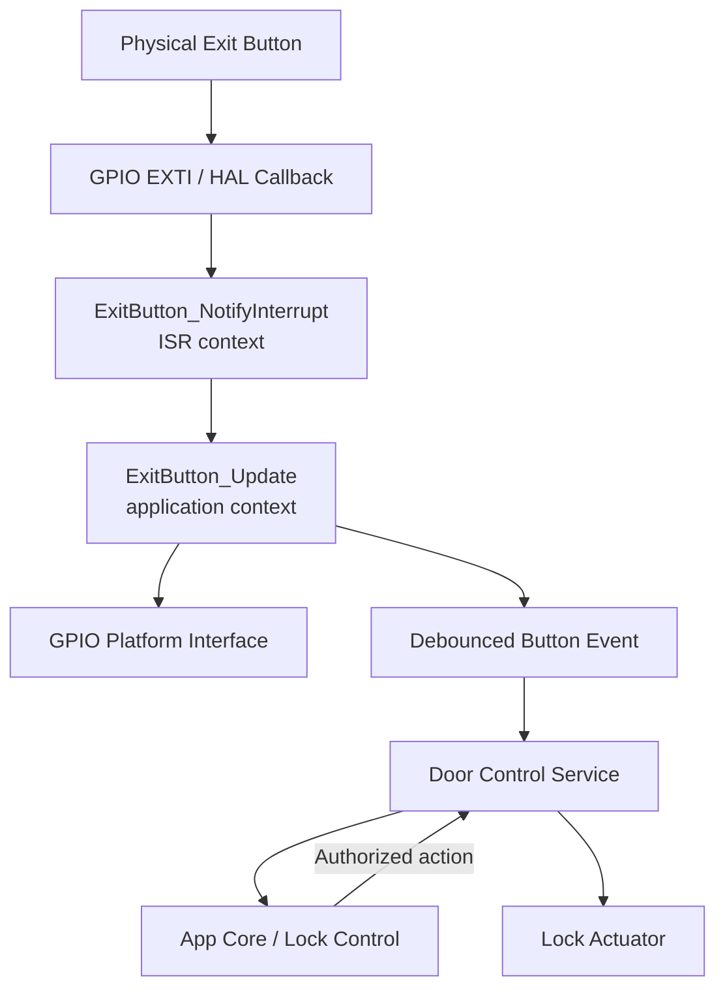
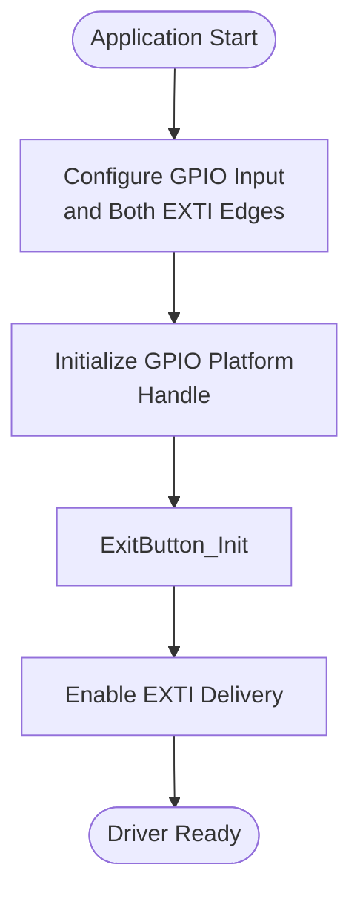
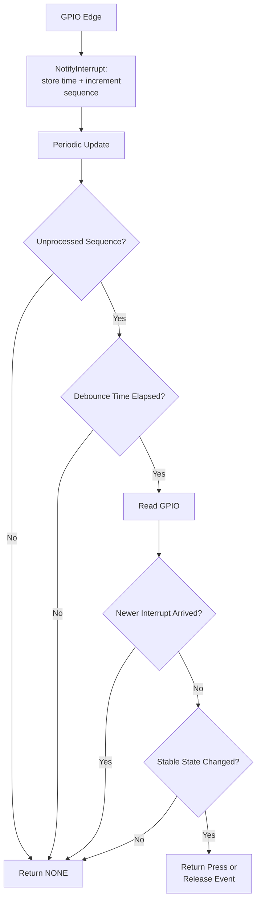

<h1 align="left">Exit Button Driver</h1>

<p align="left">
  <big>
    Interrupt-oriented driver for a debounced request-to-exit button,<br>
    designed for portable embedded systems.
  </big>
</p>

---

## Table of Contents

* [1. Overview](#1-overview)
* [2. Features](#2-features)
* [3. Architecture](#3-architecture)
* [4. Directory Structure](#4-directory-structure)
* [5. Device Overview](#5-device-overview)
* [6. Driver Responsibilities](#6-driver-responsibilities)
* [7. Dependencies](#7-dependencies)
* [8. Data Structures](#8-data-structures)

  * [8.1 Exit Button Handle](#81-exit-button-handle)
  * [8.2 Operation Status](#82-operation-status)
  * [8.3 Active Level](#83-active-level)
  * [8.4 Button Event](#84-button-event)
* [9. API Reference](#9-api-reference)

  * [9.1 ExitButton_Init](#91-exitbutton_init)
  * [9.2 ExitButton_NotifyInterrupt](#92-exitbutton_notifyinterrupt)
  * [9.3 ExitButton_Update](#93-exitbutton_update)
* [10. Operation Flow](#10-operation-flow)

  * [10.1 Initialization Flow](#101-initialization-flow)
  * [10.2 Interrupt and Debounce Flow](#102-interrupt-and-debounce-flow)
* [11. Usage Example](#11-usage-example)
* [12. Design Decisions](#12-design-decisions)

  * [12.1 Minimal Interrupt Processing](#121-minimal-interrupt-processing)
  * [12.2 Non-Blocking Debounce](#122-non-blocking-debounce)
  * [12.3 Interrupt Sequence Handoff](#123-interrupt-sequence-handoff)
  * [12.4 Polarity Normalization](#124-polarity-normalization)
  * [12.5 Separation from Unlock Policy](#125-separation-from-unlock-policy)
* [13. Error Handling](#13-error-handling)
* [14. Usage Constraints](#14-usage-constraints)
* [15. Applications](#15-applications)
* [16. Limitations](#16-limitations)
* [17. License](#17-license)

---

## 1. Overview

- The driver converts GPIO interrupt activity into debounced exit-button press and release events.
- The interrupt-facing API records only a timestamp and sequence number.
- GPIO reading and debounce validation occur later in application context.
- The driver supports active-high and active-low button circuits.
- Debounce processing is timestamp-based and contains no blocking delay.

The component reports user input only. It does not directly unlock the actuator or decide whether a request-to-exit operation is authorized.

---

## 2. Features

- Interrupt-oriented input acquisition.
- Minimal ISR execution path.
- Non-blocking software debounce.
- Configurable debounce interval in milliseconds.
- Active-high and active-low button support.
- Debounced press and release events.
- Private stable-state tracking for transition detection.
- Rollover-safe elapsed-time calculation.
- GPIO hardware abstraction.
- No dynamic memory allocation.
- No callback execution from interrupt context.

---

## 3. Architecture

The driver separates interrupt acquisition from button processing.



The EXTI callback does not read the GPIO or wait for contact bounce to finish. It publishes interrupt activity to the driver. A serialized application loop or service calls `ExitButton_Update()` periodically to validate the stable input level and produce an event.

This architecture keeps human-scale timing and application behavior outside the ISR.

In the current STM32F103 integration, App Config binds the active-low button to
PA0 with a pull-up and rising/falling EXTI, configures a 20 ms debounce interval
and forwards HAL notifications through `App_ConfigHalCallbacks.c`. The Door
Control Service owns periodic updates and the caller-owned event slot; App Core
maps a validated press into the request-to-exit event consumed by LCS.

---

## 4. Directory Structure

```text
ExitButton/
|
├── Inc/
│   └── ExitButton_Driver.h
|
├── Src/
│   └── ExitButton_Driver.c
|
└── README.md
```

---

## 5. Device Overview

The exit button is a digital input used to request unlocking from the secure side of the door. It is also commonly called a request-to-exit or REX button.

The input circuit may be active-high or active-low:

| Configured Active Level | GPIO LOW | GPIO HIGH |
|---|---|---|
| `EXIT_BUTTON_ACTIVE_LEVEL_LOW` | Pressed | Released |
| `EXIT_BUTTON_ACTIVE_LEVEL_HIGH` | Released | Pressed |

A mechanical push button can produce several fast electrical transitions when pressed or released. This contact bounce must not create multiple unlock requests.

The driver handles bounce by waiting until no newer interrupt has arrived for the configured debounce interval. It then reads the GPIO once and accepts the resulting stable state.

For complete press and release tracking, the GPIO EXTI line shall be configured for both rising and falling edges.

---

## 6. Driver Responsibilities

The driver is responsible for:

- Managing exit button instances.
- Storing the GPIO Platform handle.
- Storing the configured active level and debounce interval.
- Recording interrupt timestamps and sequence numbers.
- Restarting the debounce interval when another edge arrives.
- Reading the GPIO after the input has remained quiet for the debounce interval.
- Converting the electrical level into a logical button state.
- Generating one event for each validated state transition.
- Maintaining the most recently validated stable state as private runtime data.

The driver is **not responsible** for:

- Configuring the MCU GPIO or EXTI peripheral.
- Initializing the GPIO Platform handle.
- Calling the STM32 HAL interrupt handler.
- Blocking inside an ISR.
- Directly controlling the lock actuator.
- Selecting the authorized access and door-aware relock sequence.
- Applying authorization or alarm policy.
- Detecting damaged wires or electrical tampering.
- Retaining events in a queue.

---

## 7. Dependencies

The driver depends on:

```text
GPIO_Platform_Interface.h
```

The driver does not call the Time Platform Interface directly. The interrupt timestamp and current update time are supplied by the caller. This keeps timing deterministic and allows the same monotonic clock to be used by the ISR integration and main loop.

The caller is responsible for:

- Creating and initializing the `GPIO_Handle_t`.
- Configuring the physical pin as an interrupt-capable digital input.
- Enabling both rising and falling EXTI edges.
- Supplying timestamps from the same monotonic millisecond time base.
- Calling `ExitButton_Update()` periodically.
- Processing returned events immediately.

The GPIO Platform handle is retained by pointer and must remain valid while the driver is in use.

---

## 8. Data Structures

### 8.1 Exit Button Handle

The driver uses `ExitButton_Handle_t` to represent an exit button device instance.

```c
typedef struct
{
    GPIO_Handle_t*           _gpio;
    ExitButton_ActiveLevel_t _active_level;
    bool                     _is_pressed;
    bool                     _state_is_known;
    uint32_t                 _debounce_time_ms;
    volatile uint32_t        _interrupt_sequence;
    volatile uint32_t        _interrupt_time_ms;
    uint32_t                 _processed_sequence;
    bool                     _initialized;

} ExitButton_Handle_t;
```

The handle stores the GPIO dependency, input configuration, stable state and the runtime information shared between interrupt and application contexts.

| Member | Description |
|---|---|
| `_gpio` | Pointer to the GPIO Platform handle used to read the button. |
| `_active_level` | Electrical GPIO level interpreted as a pressed button. |
| `_is_pressed` | Most recently validated logical pressed state. |
| `_state_is_known` | Indicates whether an initial stable state has been established. |
| `_debounce_time_ms` | Required quiet interval after the most recent edge. |
| `_interrupt_sequence` | Volatile sequence incremented by every interrupt notification. |
| `_interrupt_time_ms` | Volatile timestamp of the most recent interrupt notification. |
| `_processed_sequence` | Most recent interrupt sequence processed by `ExitButton_Update()`. |
| `_initialized` | Internal driver initialization state. |

The members of `ExitButton_Handle_t` are private driver data and shall not be accessed or modified directly by the application.

### 8.2 Operation Status

The driver uses `ExitButton_OpStatus_t` to report the result of application-context operations.

```c
typedef enum
{
    EXIT_BUTTON_OPERATION_OK,
    EXIT_BUTTON_OPERATION_FAIL

} ExitButton_OpStatus_t;
```

| Status | Description |
|---|---|
| `EXIT_BUTTON_OPERATION_OK` | Operation completed successfully. |
| `EXIT_BUTTON_OPERATION_FAIL` | Operation could not be completed. |

### 8.3 Active Level

The driver uses `ExitButton_ActiveLevel_t` to define which GPIO level represents a pressed button.

```c
typedef enum
{
    EXIT_BUTTON_ACTIVE_LEVEL_HIGH,
    EXIT_BUTTON_ACTIVE_LEVEL_LOW

} ExitButton_ActiveLevel_t;
```

| Active Level | Description |
|---|---|
| `EXIT_BUTTON_ACTIVE_LEVEL_HIGH` | GPIO HIGH represents the pressed state. |
| `EXIT_BUTTON_ACTIVE_LEVEL_LOW` | GPIO LOW represents the pressed state. |

### 8.4 Button Event

The driver uses `ExitButton_Event_t` to report the result of one update cycle.

```c
typedef enum
{
    EXIT_BUTTON_EVENT_NONE,
    EXIT_BUTTON_EVENT_PRESS,
    EXIT_BUTTON_EVENT_RELEASE

} ExitButton_Event_t;
```

| Event | Description |
|---|---|
| `EXIT_BUTTON_EVENT_NONE` | No debounced transition was completed during the update. |
| `EXIT_BUTTON_EVENT_PRESS` | A stable transition to the pressed state was validated. |
| `EXIT_BUTTON_EVENT_RELEASE` | A stable transition to the released state was validated. |

Events are immediate outputs from `ExitButton_Update()` and are not retained in an internal queue. The `ExitButton_Event_t` instance belongs to the application runtime and is passed to the driver through the `Event` output parameter.

---

## 9. API Reference

### 9.1 ExitButton_Init

- Initializes an exit button instance with its GPIO, active level and debounce interval.

#### Function Signature

```c
ExitButton_OpStatus_t ExitButton_Init(
    ExitButton_Handle_t*     Device,
    GPIO_Handle_t*           Context,
    ExitButton_ActiveLevel_t Level,
    uint32_t                 DebounceTimeMs
);
```

#### Parameters

| Parameter | Description |
|---|---|
| `Device` | Pointer to the exit button device handle. |
| `Context` | Pointer to the initialized GPIO Platform input handle. |
| `Level` | Electrical GPIO level representing a pressed button. |
| `DebounceTimeMs` | Required quiet interval after the most recent edge, in milliseconds. |

#### Return

| Return Value | Description |
|---|---|
| `EXIT_BUTTON_OPERATION_OK` | Exit button initialized successfully. |
| `EXIT_BUTTON_OPERATION_FAIL` | A pointer or active level is invalid, or debounce time is zero. |

**Notes:**

- This function does not call `PGPIO_Init()`.
- This function does not configure or enable EXTI.
- The private stable state is initially unknown.
- No press or release event is generated during initialization.
- Prefer initializing the driver before enabling EXTI delivery. If CubeMX enables
  EXTI earlier, notifications received before initialization are ignored and do
  not create a pending event.

### 9.2 ExitButton_NotifyInterrupt

- Records an interrupt edge for later debounce processing.

#### Function Signature

```c
void ExitButton_NotifyInterrupt(
    ExitButton_Handle_t* Device,
    uint32_t             TimestampMs
);
```

#### Parameters

| Parameter | Description |
|---|---|
| `Device` | Pointer to the initialized exit button device handle. |
| `TimestampMs` | Monotonic millisecond timestamp associated with the edge. |

#### Return

This function does not return a value.

**Notes:**

- This is the only public function intended for interrupt context.
- It performs no GPIO read, delay or application callback.
- Each call restarts the debounce interval from `TimestampMs`.
- Invalid or uninitialized handles are ignored because ISR error reporting is intentionally avoided.

### 9.3 ExitButton_Update

- Processes pending interrupt activity and returns a debounced transition event.

#### Function Signature

```c
ExitButton_OpStatus_t ExitButton_Update(
    ExitButton_Handle_t* Device,
    uint32_t             CurrentTimeMs,
    ExitButton_Event_t*  Event
);
```

#### Parameters

| Parameter | Description |
|---|---|
| `Device` | Pointer to the initialized exit button device handle. |
| `CurrentTimeMs` | Current value of the monotonic millisecond time base. |
| `Event` | Pointer receiving the event generated by this update. |

#### Return

| Return Value | Description |
|---|---|
| `EXIT_BUTTON_OPERATION_OK` | Update completed normally, including when no event is available. |
| `EXIT_BUTTON_OPERATION_FAIL` | A pointer, driver state or GPIO reading is invalid. |

**Notes:**

- `Event` is set to `EXIT_BUTTON_EVENT_NONE` when no transition is validated.
- The function contains no blocking delay.
- Call it periodically from the main loop or a serialized application task.
- Process a non-`NONE` event in the same update cycle because events are not queued.
- `CurrentTimeMs` and the interrupt timestamp must use the same time base.

---

## 10. Operation Flow

### 10.1 Initialization Flow



### 10.2 Interrupt and Debounce Flow



Every bounce edge updates the timestamp. The GPIO is accepted only after the configured quiet interval.

---

## 11. Usage Example

The following example shows the intended STM32 integration pattern. Pin names are illustrative and shall be replaced by the CubeMX-generated symbols selected for the board.

```c
#include "ExitButton_Driver.h"
#include "Time_Platform_Interface.h"
#include "main.h"

#define EXIT_BUTTON_DEBOUNCE_MS 40U

static GPIO_Handle_t       ExitButtonGpio;
static ExitButton_Handle_t ExitButton;

bool ExitButtonExample_Init(void)
{
    if(PGPIO_Init(
            &ExitButtonGpio,
            EXIT_BUTTON_GPIO_Port,
            EXIT_BUTTON_GPIO_PIN_NUMBER
        )!= GPIO_OPERATION_OK)
    {
        return false;
    }

    return ExitButton_Init(
               &ExitButton,
               &ExitButtonGpio,
               EXIT_BUTTON_ACTIVE_LEVEL_LOW,
               EXIT_BUTTON_DEBOUNCE_MS
           )== EXIT_BUTTON_OPERATION_OK;
}

void HAL_GPIO_EXTI_Callback(uint16_t GPIO_Pin)
{
    if(GPIO_Pin == EXIT_BUTTON_Pin)
    {
        ExitButton_NotifyInterrupt(
            &ExitButton,
            Platform_GetMillis()
        );
    }
}

void ExitButtonExample_Update(void)
{
    ExitButton_Event_t event;

    if(ExitButton_Update(
            &ExitButton,
            Platform_GetMillis(),
            &event
        )!= EXIT_BUTTON_OPERATION_OK)
    {
        /* Handle the input-path failure according to product policy. */
        return;
    }

    if(event == EXIT_BUTTON_EVENT_PRESS)
    {
        /* Send a semantic request-to-exit event to App Core. */
    }
}
```

`EXIT_BUTTON_GPIO_PIN_NUMBER` represents the zero-based pin number expected by `PGPIO_Init()`. `EXIT_BUTTON_Pin` represents the HAL bit mask supplied to `HAL_GPIO_EXTI_Callback()`.

The consuming Door Control Service retains `event` in the application-owned
runtime slot. App Core converts `EXIT_BUTTON_EVENT_PRESS` into
`LCS_EVENT_EXIT_REQUEST`; the resulting App Executor action requests unlock
through DCS. Relocking then follows the same door-position confirmation path as
authenticated access and has no standalone finite unlock deadline.

The example uses a generic 40 ms interval. The current product configuration
uses `APP_EXIT_BUTTON_DEBOUNCE_TIME_MS` with a value of 20 ms.

---

## 12. Design Decisions

### 12.1 Minimal Interrupt Processing

`ExitButton_NotifyInterrupt()` performs only two state writes:

1. Stores the most recent edge timestamp.
2. Increments the interrupt sequence.

GPIO reads, debounce decisions and application actions are excluded from interrupt context.

### 12.2 Non-Blocking Debounce

The driver does not call a delay function. It evaluates:

```c
(uint32_t)(CurrentTimeMs - InterruptTimeMs) >= DebounceTimeMs
```

Unsigned subtraction keeps normal short intervals valid when the millisecond counter wraps from its maximum value to zero.

### 12.3 Interrupt Sequence Handoff

A sequence counter distinguishes new interrupt activity from already processed activity. `ExitButton_Update()` snapshots and rechecks the counter around timestamp acquisition and GPIO sampling.

If another interrupt arrives while an update is in progress, the sampled state is discarded and the newer edge receives a complete debounce interval.

This avoids clearing a shared Boolean flag and accidentally losing a concurrent edge.

### 12.4 Polarity Normalization

The driver maps the configured active electrical level to its private pressed state. Application code therefore remains independent from pull-up, pull-down and switch-wiring polarity.

### 12.5 Separation from Unlock Policy

The driver produces input events only. It does not call `LockActuator_Unlock()`.

The higher-level Door Control Service and application policy are responsible for:

- Accepting or rejecting the request-to-exit event.
- Coordinating the door-position-aware relock sequence through App Core and LCS.
- Commanding the actuator in the required safe order.
- Providing display, LED or sound feedback.
- Returning the actuator to the locked command on every terminal path.

---

## 13. Error Handling

`ExitButton_Init()` and `ExitButton_Update()` return `ExitButton_OpStatus_t`.

The application shall check the result of initialization and every update when loss of the exit input affects product behavior.

```c
ExitButton_Event_t event;

if(ExitButton_Update(
        &ExitButton,
        Platform_GetMillis(),
        &event
    )!= EXIT_BUTTON_OPERATION_OK)
{
    /* Apply the product-defined input fault policy. */
}
```

`ExitButton_NotifyInterrupt()` returns `void` to keep the ISR boundary minimal. A notification supplied before initialization is ignored.

If `PGPIO_GetLevel()` returns `GPIO_LEVEL_UNKNOWN`, the update fails and does not consume the pending interrupt sequence. A later update can retry the read.

---

## 14. Usage Constraints

The following constraints apply when using the driver:

- The GPIO must be configured as a digital input before use.
- Both rising and falling EXTI edges shall be enabled for complete press and release tracking.
- The GPIO Platform handle shall be initialized before driver use.
- Notifications delivered before initialization are ignored; the integration
  shall account for any button state already present during startup.
- The GPIO handle shall remain valid for the complete driver lifetime.
- `DebounceTimeMs` shall be greater than zero.
- Interrupt and update timestamps shall come from the same monotonic millisecond clock.
- `ExitButton_Update()` shall be called periodically from serialized application context.
- The update cadence determines how soon an event is observed after the debounce interval.
- Returned events shall be processed immediately because no event queue is provided.
- The internal members of `ExitButton_Handle_t` shall not be accessed directly.
- Only `ExitButton_NotifyInterrupt()` is intended for interrupt context.
- The application shall not unlock directly from the ISR.

---

## 15. Applications

The Exit Button Driver can be used as a building block for:

- Request-to-exit buttons.
- Interior electronic-lock release buttons.
- Access-control egress requests.
- Cabinet release controls.
- Interrupt-driven user buttons requiring debounce.
- Higher-level timed-unlock workflows.

The driver remains responsible only for acquiring and debouncing the physical button. Higher-level modules determine the resulting product action.

---

## 16. Limitations

Current implementation limitations:

- No internal event queue.
- No long-press, double-click or hold-repeat detection.
- No interrupt enable, disable or EXTI acknowledgment functions.
- No polling-only fallback when release-edge interrupts are unavailable.
- No detection of stuck, disconnected or shorted wiring.
- No event timestamp is returned to the application.
- No internal synchronization for multiple application-context callers.
- The sequence handoff assumes atomic aligned 32-bit access on the target platform.
- The STM32F103 App binds and initializes the component on PA0 and publishes
  EXTI notifications. `DCS_Update()` performs periodic processing, and App Core
  maps each validated press into the current request-to-exit policy.

---

## 17. License

This module is part of the:

```text
Electronic Lock Project
```

and follows the project's license terms.
