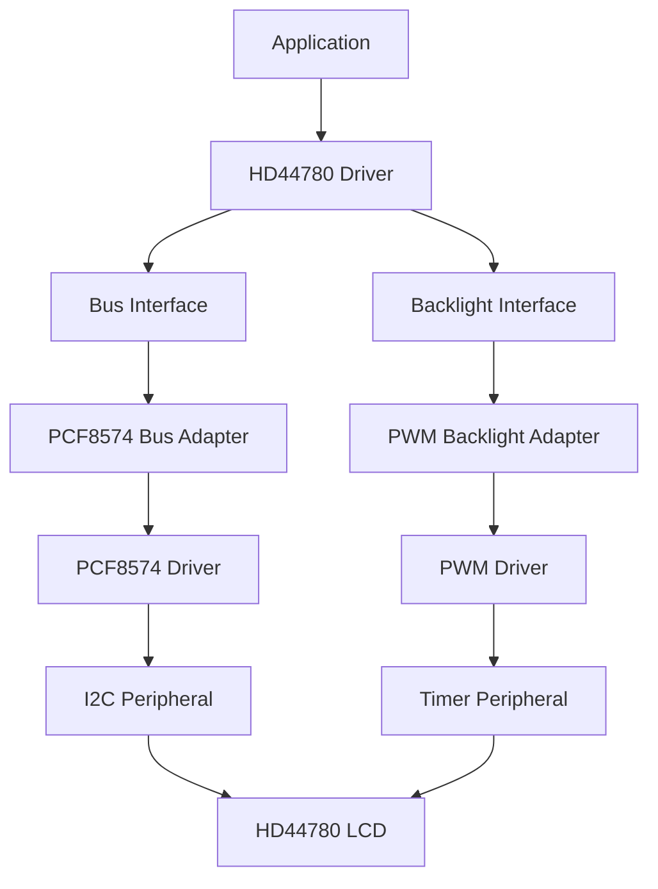
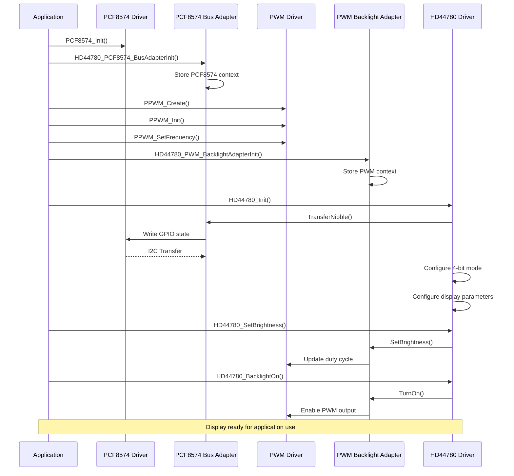
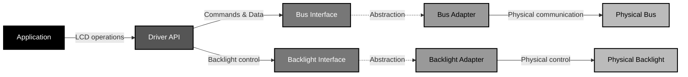

# Hardware-Independent Driver for HD44780 Compatible Character LCD Modules Designed for Embedded Systems.

---
## Overview

- The driver implements the HD44780 controller communication protocol, abstracting bus communication and backlight control through configurable interfaces. This allows reuse with different hardware implementations such as direct GPIO, I2C expanders, PWM-controlled backlights, and other peripherals.

---

## Features

- Complete HD44780 controller initialization.
- 4-bit communication mode support.
- Command and data transmission.
- Display control:
  - Display ON/OFF.
  - Cursor visibility.
  - Cursor blinking.
- Cursor direction configuration:
  - Increment mode.
  - Decrement mode.
- Automatic display shift configuration.
- Cursor positioning using row and column coordinates.
- Character writing.
- String writing.
- Line-specific text printing.
- Line clearing.
- Custom character creation using CGRAM.
- Backlight control:
  - Enable/disable.
  - Brightness adjustment.
- Hardware-independent architecture:
  - Bus Interface abstraction.
  - Backlight Interface abstraction.
- Provided adapters:
  - PCF8574 I2C bus adapter.
  - PWM timer backlight adapter.

---

## Architecture

The driver follows a layered architecture where hardware dependencies are isolated through abstraction interfaces.

The HD44780 driver never accesses hardware peripherals directly. All communication with the LCD controller is performed through the Bus Interface, while backlight control is performed through the Backlight Interface.

This design allows the driver to be reused across different microcontrollers and hardware configurations.



---
### Bus Interface

The communication between the HD44780 driver and the physical bus is abstracted through:

```c
HD44780_BusInterfaceTypeDef
```

Definition:

```c
typedef struct
{
    HD44780_BusOpStatusTypeDef (*TransferNibble)(
        void* Context,
        uint8_t Nibble,
        HD44780_RegisterSelectTypeDef Rs
    );

    void* Context;

} HD44780_BusInterfaceTypeDef;
```

The driver communicates only through the `TransferNibble()` callback.

The concrete adapter is responsible for:

- Mapping data bits.
- Controlling RS signal.
- Generating EN pulse.
- Handling the physical communication method.

The driver sends data as nibbles because the HD44780 operates internally with 4-bit transfers when configured in 4-bit mode.

---

### PCF8574 Bus Adapter

The PCF8574 adapter implements the Bus Interface using an I2C GPIO expander.

Responsibilities:

- Convert HD44780 signals into PCF8574 bit operations.
- Generate the enable pulse.
- Control RS.
- Send high and low nibbles.
- Handle I2C communication through the PCF8574 driver.

Initialization:

```c
HD44780_PCF8574_BusAdapterInit(
    HD44780_BusInterfaceTypeDef* Bus,
    PCF8574_HandleTypeDef* PCF8574_Instance
);
```

The adapter stores the PCF8574 instance as context and exposes the required bus operations to the HD44780 driver.

---
### Backlight Interface

Backlight control is abstracted through the:

```c
HD44780_BacklightInterfaceTypeDef
```

interface.

Definition:

```c
typedef struct
{
    HD44780_BacklightOpStatusTypeDef (*TurnOn)(void* Context);

    HD44780_BacklightOpStatusTypeDef (*TurnOff)(void* Context);

    HD44780_BacklightOpStatusTypeDef (*SetBrightness)(
        void* Context,
        uint16_t Level
    );

    uint16_t (*GetBrightness)(void* Context);

    void* Context;

} HD44780_BacklightInterfaceTypeDef;
```

The HD44780 driver does not know how the backlight is physically controlled.

The concrete adapter is responsible for implementing:

- Backlight activation.
- Backlight deactivation.
- Brightness control.
- Hardware-specific conversion.

Possible implementations:

- GPIO controlled backlight.
- PWM controlled backlight.

---

### PWM Backlight Adapter

The provided PWM adapter controls the LCD backlight intensity using a PWM peripheral.

The adapter converts a brightness level into a PWM duty cycle.

Initialization:

```c
HD44780_BacklightOpStatusTypeDef HD44780_PWM_BacklightAdapterInit(
    HD44780_BacklightInterfaceTypeDef* Backlight,
    void* Context
);
```

The context must point to a PWM instance:

```c
PWM_HandleTypeDef
```

Example:

```c
PWM_HandleTypeDef LCD_BacklightAdapter;

HD44780_PWM_BacklightAdapterInit(
    &LCD._backlight,
    &LCD_BacklightAdapter
);
```

The adapter is independent from the timer implementation. Any PWM driver implementing the required interface can be used.

---

## Directory Structure

Example project organization:

```text
HD44780/
|
├── Inc/
│   ├── HD44780_Driver.h
│   ├── HD44780_BusInterface.h
│   ├── HD44780_BacklightInterface.h
│   ├── HD44780_PCF8574_BusAdapter.h
│   └── HD44780_PWM_BacklightAdapter.h
|
└── Src/
    ├── HD44780_Driver.c
    ├── HD44780_PCF8574_BusAdapter.c
    └── HD44780_PWM_BacklightAdapter.c
```

---

## Driver Responsibilities

The HD44780 driver is responsible for:

- Implementing the HD44780 communication protocol.
- Managing the LCD initialization sequence.
- Sending commands and data.
- Managing internal display configuration state.
- Controlling cursor position.
- Writing characters and strings.
- Managing CGRAM custom characters.
- Controlling the backlight through an abstract interface.

The driver is **not responsible** for:

- Direct GPIO access.
- Direct I2C communication.
- Timer configuration.
- Interrupt handling.
- Character buffering.
- Display queue management.
- Low-level peripheral initialization.

---

## Dependencies

Required dependencies:

```text
Time Platform Interface
```

Provides timing functions required by the HD44780 specification:

```c
Platform_DelayUs()
Platform_DelayMs()
```

Optional dependencies:

```text
PCF8574 Driver
PWM Platform Interface
```

These are required only when using the provided adapters.

---

## Data Structures

---

### HD44780 Handle

The driver uses `HD44780_HandleTypeDef` to represent an HD44780 LCD device instance.

```c
typedef struct
{
    HD44780_BusInterfaceTypeDef       _bus;
    HD44780_BacklightInterfaceTypeDef _backlight;
    HD44780_LineNumberTypeDef         _rows;
    uint8_t                           _cols;
    HD44780_InterfaceModeTypeDef      _interface_mode;
    HD44780_CharacterFontTypeDef      _font_dot_size;
    bool                              _initialized;

} HD44780_HandleTypeDef;
```

| Member            | Description                                                    |
| ----------------- | -------------------------------------------------------------- |
| `_bus`            | Bus interface used to communicate with the HD44780 controller. |
| `_backlight`      | Backlight control interface associated with the LCD module.    |
| `_rows`           | Configured number of display lines.                            |
| `_cols`           | Configured number of display columns.                          |
| `_interface_mode` | Selected HD44780 data interface mode.                          |
| `_font_dot_size`  | Selected character font configuration.                         |
| `_initialized`    | Internal initialization state of the driver instance.          |

The members of `HD44780_HandleTypeDef` are considered private driver data and shall not be accessed or modified directly by the application after initialization.

The application shall interact with the LCD exclusively through the public driver API.

---

### Operation Status

The driver uses `HD44780_OpStatusTypeDef` to report the result of driver operations.

```c
typedef enum
{
    HD44780_OPERATION_OK,
    HD44780_OPERATION_FAIL

} HD44780_OpStatusTypeDef;
```

| Status                   | Description                       |
| ------------------------ | --------------------------------- |
| `HD44780_OPERATION_OK`   | Operation completed successfully. |
| `HD44780_OPERATION_FAIL` | Operation could not be completed. |

---

### Interface Mode

The `HD44780_InterfaceModeTypeDef` enumeration defines the controller data interface mode.

```c
typedef enum
{
    HD44780_8BIT_MODE,
    HD44780_4BIT_MODE

} HD44780_InterfaceModeTypeDef;
```

| Mode                | Description                            |
| ------------------- | -------------------------------------- |
| `HD44780_4BIT_MODE` | Four-bit parallel communication mode.  |
| `HD44780_8BIT_MODE` | Eight-bit parallel communication mode. |

Only `HD44780_4BIT_MODE` is currently implemented by the driver.

---

### Character Font

The `HD44780_CharacterFontTypeDef` enumeration defines the character font configuration.

```c
typedef enum
{
    HD44780_5X10_FONT,
    HD44780_5X8_FONT

} HD44780_CharacterFontTypeDef;
```

| Font                | Description                                              |
| ------------------- | -------------------------------------------------------- |
| `HD44780_5X8_FONT`  | 5×8 character font. Supports up to 8 custom characters.  |
| `HD44780_5X10_FONT` | 5×10 character font. Supports up to 4 custom characters. |

The 5×10 font is supported only with single-line display configuration.

---

### Display Line Configuration

The `HD44780_LineNumberTypeDef` enumeration defines the number of display lines.

```c
typedef enum
{
    HD44780_2LINE = 0x01,
    HD44780_1LINE = 0x00

} HD44780_LineNumberTypeDef;
```

| Configuration   | Description                        |
| --------------- | ---------------------------------- |
| `HD44780_1LINE` | Single-line display configuration. |
| `HD44780_2LINE` | Two-line display configuration.    |

---

### Bus Interface

The HD44780 driver communicates with the physical display through `HD44780_BusInterfaceTypeDef`.

```c
typedef struct
{
    HD44780_BusOpStatusTypeDef (*TransferNibble)(
        void* Context,
        uint8_t Nibble,
        HD44780_RegisterSelectTypeDef Rs
    );

    void* Context;

} HD44780_BusInterfaceTypeDef;
```

| Member           | Description                                                      |
| ---------------- | ---------------------------------------------------------------- |
| `TransferNibble` | Callback used to transfer a 4-bit value to the HD44780 data bus. |
| `Context`        | Adapter-specific context passed to the callback.                 |

The interface isolates the driver from the physical communication implementation.

The concrete adapter is responsible for:

* Mapping the HD44780 data signals.
* Controlling the RS signal.
* Generating the enable pulse.
* Implementing the underlying communication mechanism.

The current project provides a PCF8574-based I2C bus adapter.

---

### Backlight Interface

The HD44780 driver controls the LCD backlight through `HD44780_BacklightInterfaceTypeDef`.

```c
typedef struct
{
    HD44780_BacklightOpStatusTypeDef (*TurnOn)(void* Context);

    HD44780_BacklightOpStatusTypeDef (*TurnOff)(void* Context);

    HD44780_BacklightOpStatusTypeDef (*SetBrightness)(
        void* Context,
        uint16_t Level
    );

    uint16_t (*GetBrightness)(void* Context);

    void* Context;

} HD44780_BacklightInterfaceTypeDef;
```

| Member          | Description                                             |
| --------------- | ------------------------------------------------------- |
| `TurnOn`        | Enables the LCD backlight.                              |
| `TurnOff`       | Disables the LCD backlight.                             |
| `SetBrightness` | Sets the requested brightness level.                    |
| `GetBrightness` | Returns the brightness level maintained by the adapter. |
| `Context`       | Adapter-specific context passed to the callbacks.       |

The brightness level is expressed as a percentage from `0` to `100`. The actual implementation may provide continuous control, such as PWM, or binary control, such as GPIO.

---

## API Reference

---

### HD44780_Init

- Initializes an HD44780 LCD controller according to the configuration stored in the device handle.

---
#### Function Signature
```c
HD44780_OpStatusTypeDef HD44780_Init(
    HD44780_HandleTypeDef* Device
);
```
---
#### Parameters
| Parameter | Description                             |
| --------- | --------------------------------------- |
| `Device`  | Pointer to the HD44780 device instance. |

---
#### Return
| Return Value             | Description                                                         |
| ------------------------ | ------------------------------------------------------------------- |
| `HD44780_OPERATION_OK`   | LCD successfully initialized.                                       |
| `HD44780_OPERATION_FAIL` | Initialization failed or the selected configuration is unsupported. |

The initialization sequence configures the controller for the selected interface mode, number of display lines and character font.

**Note:**
- Repeated initialization of an already initialized device returns successfully without repeating the initialization sequence.

---

### HD44780_Clear

- Clears the complete display.

---
#### Function Signature
```c
HD44780_OpStatusTypeDef HD44780_Clear(
    HD44780_HandleTypeDef* Device
);
```

---
#### Parameters
| Parameter | Description                                         |
| --------- | --------------------------------------------------- |
| `Device`  | Pointer to the initialized HD44780 device instance. |

---
#### Return
| Return Value             | Description                   |
| ------------------------ | ----------------------------- |
| `HD44780_OPERATION_OK`   | Display successfully cleared. |
| `HD44780_OPERATION_FAIL` | Operation failed.             |

---

### HD44780_Home

- Returns the display cursor to the home position.

---
#### Function Signature
```c
HD44780_OpStatusTypeDef HD44780_Home(
    HD44780_HandleTypeDef* Device
);
```
---
#### Parameters
| Parameter | Description                                         |
| --------- | --------------------------------------------------- |
| `Device`  | Pointer to the initialized HD44780 device instance. |

---
#### Return
| Return Value             | Description                            |
| ------------------------ | -------------------------------------- |
| `HD44780_OPERATION_OK`   | Home operation completed successfully. |
| `HD44780_OPERATION_FAIL` | Operation failed.                      |

---

### Display Control

- The following functions control the display visibility, cursor and cursor blinking:

---
#### Function Signatures
```c
HD44780_OpStatusTypeDef HD44780_DisplayOn(
    HD44780_HandleTypeDef* Device
);

HD44780_OpStatusTypeDef HD44780_DisplayOff(
    HD44780_HandleTypeDef* Device
);

HD44780_OpStatusTypeDef HD44780_CursorOn(
    HD44780_HandleTypeDef* Device
);

HD44780_OpStatusTypeDef HD44780_CursorOff(
    HD44780_HandleTypeDef* Device
);

HD44780_OpStatusTypeDef HD44780_BlinkOn(
    HD44780_HandleTypeDef* Device
);

HD44780_OpStatusTypeDef HD44780_BlinkOff(
    HD44780_HandleTypeDef* Device
);
```

| Function               | Description                  |
| ---------------------- | ---------------------------- |
| `HD44780_DisplayOn()`  | Enables the display output.  |
| `HD44780_DisplayOff()` | Disables the display output. |
| `HD44780_CursorOn()`   | Enables cursor visibility.   |
| `HD44780_CursorOff()`  | Disables cursor visibility.  |
| `HD44780_BlinkOn()`    | Enables cursor blinking.     |
| `HD44780_BlinkOff()`   | Disables cursor blinking.    |

Each function returns `HD44780_OPERATION_OK` when the requested command is successfully transmitted and `HD44780_OPERATION_FAIL` otherwise.

---

### Cursor and Display Shift Control
- The following functions control the display shift and cursor increment/decrement:
---
#### Function Signatures
```c
HD44780_OpStatusTypeDef HD44780_IncrementCursor(
    HD44780_HandleTypeDef* Device
);

HD44780_OpStatusTypeDef HD44780_DecrementCursor(
    HD44780_HandleTypeDef* Device
);

HD44780_OpStatusTypeDef HD44780_EnableShift(
    HD44780_HandleTypeDef* Device
);

HD44780_OpStatusTypeDef HD44780_DisableShift(
    HD44780_HandleTypeDef* Device
);
```

| Function                    | Description                                                                |
| --------------------------- | -------------------------------------------------------------------------- |
| `HD44780_IncrementCursor()` | Configures the cursor address to increment after data transfers.           |
| `HD44780_DecrementCursor()` | Configures the cursor address to decrement after data transfers.           |
| `HD44780_EnableShift()`     | Enables automatic display shifting according to the configured entry mode. |
| `HD44780_DisableShift()`    | Disables automatic display shifting.                                       |

Each function returns `HD44780_OPERATION_OK` when the requested command is successfully transmitted and `HD44780_OPERATION_FAIL` otherwise.

---

### HD44780_SetCursor

- Positions the cursor at a specified row and column.

---
#### Function Signature
```c
HD44780_OpStatusTypeDef HD44780_SetCursor(
    HD44780_HandleTypeDef* Device,
    uint8_t Row,
    uint8_t Col
);
```
---
#### Parameters
| Parameter | Description                                         |
| --------- | --------------------------------------------------- |
| `Device`  | Pointer to the initialized HD44780 device instance. |
| `Row`     | Zero-based display row.                             |
| `Col`     | Zero-based display column.                          |

---
#### Return
| Return Value             | Description                            |
| ------------------------ | -------------------------------------- |
| `HD44780_OPERATION_OK`   | Set cursor operation completed successfully. |
| `HD44780_OPERATION_FAIL` | Operation failed.                      |

**Note:**
- Values outside the configured display dimensions are clamped to the nearest valid position.

---

### HD44780_WriteChar

- Writes a single character at the current cursor position.

---
#### Function Signature
```c
HD44780_OpStatusTypeDef HD44780_WriteChar(
    HD44780_HandleTypeDef* Device,
    uint8_t Char
);
```

---
#### Parameters
| Parameter | Description                                         |
| --------- | --------------------------------------------------- |
| `Device`  | Pointer to the initialized HD44780 device instance. |
| `Char`    | Character code to transmit.                         |

---
#### Return
| Return Value             | Description                            |
| ------------------------ | -------------------------------------- |
| `HD44780_OPERATION_OK`   | Write char operation completed successfully. |
| `HD44780_OPERATION_FAIL` | Operation failed.                      |

**Note:**
- The cursor movement after the write is determined by the current Entry Mode configuration.

---

### HD44780_WriteString

- Writes a null-terminated string beginning at the current cursor position.

---
#### Function Signature
```c
HD44780_OpStatusTypeDef HD44780_WriteString(
    HD44780_HandleTypeDef* Device,
    const char* String
);
```

---
#### Parameters
| Parameter | Description                                         |
| --------- | --------------------------------------------------- |
| `Device`  | Pointer to the initialized HD44780 device instance. |
| `String`  | Pointer to a null-terminated string.                |

---
#### Return
| Return Value             | Description                            |
| ------------------------ | -------------------------------------- |
| `HD44780_OPERATION_OK`   | Write string operation completed successfully. |
| `HD44780_OPERATION_FAIL` | Operation failed.                      |

**Note:**
- The function does not reposition the cursor and does not limit the number of characters based on display width. Characters are transmitted until the null terminator is reached.

---

### HD44780_PrintLine

- Writes text starting at the beginning of a specified display row.

---
#### Function Signature
```c
HD44780_OpStatusTypeDef HD44780_PrintLine(
    HD44780_HandleTypeDef* Device,
    uint8_t Row,
    const char* Text
);
```

---
#### Parameters
| Parameter | Description                                         |
| --------- | --------------------------------------------------- |
| `Device`  | Pointer to the initialized HD44780 device instance. |
| `Row`     | Zero-based display row.                             |
| `Text`    | Pointer to a null-terminated string.                |

---
#### Return
| Return Value             | Description                            |
| ------------------------ | -------------------------------------- |
| `HD44780_OPERATION_OK`   | Print line operation completed successfully. |
| `HD44780_OPERATION_FAIL` | Operation failed.                      |

**Note:**
- If the requested row exceeds the configured display size, it is clamped to the last valid row.
- If the supplied text exceeds the configured display width, only the characters that fit on the selected row are written.

---

### HD44780_ClearLine

- Clears a complete display row by writing space characters across all configured columns.

---
#### Function Signature
```c
HD44780_OpStatusTypeDef HD44780_ClearLine(
    HD44780_HandleTypeDef* Device,
    uint8_t Row
);
```

---
#### Parameters
| Parameter | Description                                         |
| --------- | --------------------------------------------------- |
| `Device`  | Pointer to the initialized HD44780 device instance. |
| `Row`     | Zero-based display row.                             |

---
#### Return
| Return Value             | Description                            |
| ------------------------ | -------------------------------------- |
| `HD44780_OPERATION_OK`   | Clear line operation completed successfully. |
| `HD44780_OPERATION_FAIL` | Operation failed.                      |

**Note:**
- The cursor is restored to the beginning of the selected row after the operation.

---

### HD44780_CreateChar

- Creates or updates a custom character in CGRAM.

---
#### Function Signature
```c
HD44780_OpStatusTypeDef HD44780_CreateChar(
    HD44780_HandleTypeDef* Device,
    uint8_t Position,
    const uint8_t* PatternBitMap
);
```

---
#### Parameters
| Parameter       | Description                                         |
| --------------- | --------------------------------------------------- |
| `Device`        | Pointer to the initialized HD44780 device instance. |
| `Position`      | CGRAM character position.                           |
| `PatternBitMap` | Pointer to the custom character bitmap.             |

---
#### Return
| Return Value             | Description                            |
| ------------------------ | -------------------------------------- |
| `HD44780_OPERATION_OK`   | Create char operation completed successfully. |
| `HD44780_OPERATION_FAIL` | Operation failed.                      |

Valid character positions depend on the selected font:

| Font                | Valid Positions | Bitmap Size |
| ------------------- | --------------: | ----------: |
| `HD44780_5X8_FONT`  |         `0`–`7` |     8 bytes |
| `HD44780_5X10_FONT` |         `0`–`3` |     4 bytes |

The driver tracks programmed CGRAM positions and restores the cursor to row `0`, column `0` after programming the character.

---

### HD44780_WriteCustomChar

- Writes a previously created custom character to the display.

---
#### Function Signature
```c
HD44780_OpStatusTypeDef HD44780_WriteCustomChar(
    HD44780_HandleTypeDef* Device,
    uint8_t CharPosition
);
```

---
#### Parameters
| Parameter      | Description                                         |
| -------------- | --------------------------------------------------- |
| `Device`       | Pointer to the initialized HD44780 device instance. |
| `CharPosition` | Previously programmed CGRAM character position.     |

---
#### Return
| Return Value             | Description                            |
| ------------------------ | -------------------------------------- |
| `HD44780_OPERATION_OK`   | Write custom char operation completed successfully. |
| `HD44780_OPERATION_FAIL` | Operation failed.                      |

**Note:**
- The operation fails if the requested CGRAM position has not previously been programmed using `HD44780_CreateChar()`.

---

### HD44780_BacklightOn

- Enables the LCD backlight through the configured backlight interface.

---
#### Function Signature
```c
HD44780_OpStatusTypeDef HD44780_BacklightOn(
    HD44780_HandleTypeDef* Device
);
```
---
#### Parameters
| Parameter      | Description                                         |
| -------------- | --------------------------------------------------- |
| `Device`       | Pointer to the initialized HD44780 device instance. |

---
#### Return
| Return Value             | Description                            |
| ------------------------ | -------------------------------------- |
| `HD44780_OPERATION_OK`   | Backlight on operation completed successfully. |
| `HD44780_OPERATION_FAIL` | Operation failed.                      |

If the configured brightness is `0`, the driver requests a brightness of `100` before enabling the backlight.

---

### HD44780_BacklightOff

- Disables the LCD backlight.

---
#### Function Signature
```c
HD44780_OpStatusTypeDef HD44780_BacklightOff(
    HD44780_HandleTypeDef* Device
);
```

---
#### Parameters
| Parameter      | Description                                         |
| -------------- | --------------------------------------------------- |
| `Device`       | Pointer to the initialized HD44780 device instance. |

---
#### Return
| Return Value             | Description                            |
| ------------------------ | -------------------------------------- |
| `HD44780_OPERATION_OK`   | Backlight off operation completed successfully. |
| `HD44780_OPERATION_FAIL` | Operation failed.                      |

**Note:**
- Turning the backlight off does not modify display contents, DDRAM data, cursor position or HD44780 controller state.

---

### HD44780_SetBrightness

- Sets the LCD backlight brightness level.

---
#### Function Signature
```c
HD44780_OpStatusTypeDef HD44780_SetBrightness(
    HD44780_HandleTypeDef* Device,
    uint16_t BrightPercent
);
```

---
#### Parameters
| Parameter       | Description                                         |
| --------------- | --------------------------------------------------- |
| `Device`        | Pointer to the initialized HD44780 device instance. |
| `BrightPercent` | Requested brightness percentage from `0` to `100`.  |

---
#### Return
| Return Value             | Description                            |
| ------------------------ | -------------------------------------- |
| `HD44780_OPERATION_OK`   | Set brightness operation completed successfully. |
| `HD44780_OPERATION_FAIL` | Operation failed.                      |

**Note:**
- The actual brightness control behavior depends on the configured backlight adapter.

---

## Operation Flow
---

### Initialization Flow

The typical initialization sequence is shown below.



---

## Usage Example

The following example demonstrates the initialization of the LCD driver using:

- PCF8574 as the bus communication interface.
- PWM as the backlight controller.

Required includes:

```c
#include "main.h"

#include "i2c.h"
#include "tim.h"
#include "gpio.h"

#include "HD44780_Driver.h"
#include "HD44780_PCF8574_BusAdapter.h"
#include "HD44780_PWM_BacklightAdapter.h"
```

---

### Driver Objects

```c
PCF8574_HandleTypeDef LCD_BusAdapter;

const int16_t LCD_BusAdapter_I2C_Address = 0x20;

PWM_HandleTypeDef LCD_BacklightAdapter;

HD44780_HandleTypeDef LCD =
{
    ._cols           = 16,
    ._rows           = HD44780_2LINE,
    ._interface_mode = HD44780_4BIT_MODE,
    ._font_dot_size  = HD44780_5X8_FONT,
    ._initialized    = false,
};
```

---

### Initialization

```c
int main(void)
{
    HAL_Init();

    SystemClock_Config();

    MX_GPIO_Init();
    MX_I2C1_Init();
    MX_TIM4_Init();


    /*
     * Initialize PCF8574 bus expander
     */
    PCF8574_Init(
        &LCD_BusAdapter,
        LCD_BusAdapter_I2C_Address,
        &hi2c1
    );


    /*
     * Connect PCF8574 adapter to HD44780 bus interface
     */
    HD44780_PCF8574_BusAdapterInit(
        &LCD._bus,
        &LCD_BusAdapter
    );


    /*
     * Configure PWM backlight
     */
    PPWM_Create(
        &LCD_BacklightAdapter,
        &htim4,
        PWM_CHANNEL_4
    );

    PPWM_Init(
        &LCD_BacklightAdapter
    );

    PPWM_SetFrequency(
        &LCD_BacklightAdapter,
        1500
    );


    /*
     * Connect PWM adapter to HD44780 backlight interface
     */
    HD44780_PWM_BacklightAdapterInit(
        &LCD._backlight,
        &LCD_BacklightAdapter
    );


    /*
     * Initialize LCD controller
     */
    HD44780_Init(
        &LCD
    );


    HD44780_SetBrightness(
        &LCD,
        40
    );


    HD44780_BacklightOn(
        &LCD
    );
    //LCD initialized and ready for application use
}
```

---

### Write Text

```c
HD44780_SetCursor(
    &LCD,
    0,
    0
);

HD44780_WriteString(
    &LCD,
    "Hello World!"
);
```

---

### Write Character

```c
HD44780_SetCursor(
    &LCD,
    0,
    5
);

HD44780_WriteChar(
    &LCD,
    'A'
);
```

---

### Clear Display

```c
HD44780_Clear(
    &LCD
);
```

---

### Print Text on Specific Line

```c
HD44780_PrintLine(
    &LCD,
    1,
    "Line 2"
);
```

---

### Clear Specific Line

```c
HD44780_ClearLine(
    &LCD,
    0
);
```

---

### Backlight Control

```c
HD44780_BacklightOn(
    &LCD
);


HD44780_SetBrightness(
    &LCD,
    80
);


HD44780_BacklightOff(
    &LCD
);
```

---
### Custom Characters

The HD44780 controller provides 64 bytes of CGRAM memory that can be used to store custom characters.

The driver provides support for:

- Creating custom characters.
- Tracking programmed CGRAM positions.
- Writing custom characters to the display.

Example:

```c
const uint8_t lock_symbol_bitmap[8] =
{
    0b00100,
    0b01110,
    0b10001,
    0b11111,
    0b11011,
    0b11111,
    0b11111,
    0b00000
};


HD44780_CreateChar(
    &LCD,
    0,
    lock_symbol_bitmap
);


HD44780_SetCursor(
    &LCD,
    0,
    10
);


HD44780_WriteCustomChar(
    &LCD,
    0
);
```

The driver verifies whether the requested CGRAM position has already been programmed before writing the character.

This prevents displaying undefined custom characters.

---

## Design Decisions

---
### Separation Between Driver and Hardware

The HD44780 driver does not access hardware peripherals directly.

The driver communicates only through:

- `HD44780_BusInterfaceTypeDef`
- `HD44780_BacklightInterfaceTypeDef`

This allows:

- Changing the communication bus without modifying the driver.
- Replacing PCF8574 with direct GPIO.
- Replacing PWM backlight with GPIO control.
- Creating hardware mocks for unit testing.

This design follows the **Dependency Inversion Principle**, where the high-level driver depends on abstractions instead of concrete hardware implementations.

---

### Nibble-Based Bus Interface

When operating in 4-bit mode, the HD44780 requires each byte to be transferred as:

1. High nibble.
2. Low nibble.

The driver handles the transfer order and protocol timing.

The adapter is responsible for:

- Physical bit mapping.
- RS control.
- Enable pulse generation.
- Bus synchronization.

Example:

```text
Byte: 0x41 ('A')

Binary:
0100 0001


Transfer sequence:

1st nibble:
0100

2nd nibble:
0001
```

The driver therefore remains independent from the physical transport layer.

---

### Internal State Management

The driver maintains internal configuration flags to keep track of LCD state.

Examples:

- Display enabled/disabled.
- Cursor enabled/disabled.
- Cursor blinking.
- Entry mode configuration.
- Display shift configuration.

This allows the driver to reconstruct configuration commands without resetting unrelated settings.

Example:

Instead of blindly sending:

```text
Display OFF
```

the driver can preserve:

```text
Cursor enabled
Blink enabled
Shift disabled
```

and only modify the required bit.

---

### Custom Character Tracking

The driver tracks which CGRAM positions have been initialized.

Benefits:

- Prevents writing invalid custom characters.
- Avoids unexpected display behavior.
- Simplifies application usage.

The application only needs to create the character once before using it.

---

### Delay-Based Synchronization

The HD44780 provides a busy flag that can be read to determine when the controller is ready for a new command.

This implementation uses fixed delays instead.

Advantages:

- Simpler hardware requirements.
- Compatible with write-only interfaces.
- Works correctly with PCF8574 adapters.

Trade-off:

- Slightly slower than busy flag polling.
- Additional waiting time after commands.

A future implementation could add busy-flag support if required.

---

### Timing Abstraction

The driver does not directly depend on MCU-specific delay functions.

Timing is provided through the platform layer:

```c
Platform_DelayUs()

Platform_DelayMs()
```

This allows portability between:

- Different STM32 families.
- Different microcontrollers.
- Different operating environments.

---

## Error Handling

The HD44780 driver uses a binary operation status model through `HD44780_OpStatusTypeDef`.

```c
typedef enum
{
    HD44780_OPERATION_OK,
    HD44780_OPERATION_FAIL

} HD44780_OpStatusTypeDef;
```

The application shall verify the returned status of driver operations whenever the result is relevant to subsequent execution.

### Operation Failure Conditions

`HD44780_OPERATION_FAIL` may be returned when:

* The device handle is `NULL`.
* The device has not been initialized.
* A required string or bitmap pointer is `NULL`.
* An unsupported interface mode is selected.
* A bus transfer fails.
* A backlight adapter operation fails.
* An invalid CGRAM position is requested.
* A custom character is requested before it has been programmed.

For example, `HD44780_CreateChar()` explicitly validates the device, initialization state, bitmap pointer and CGRAM position before programming the character.

### Bus Errors

Communication errors originating from the bus adapter are propagated to the HD44780 driver as `HD44780_OPERATION_FAIL`.

The bus interface itself provides:

```c
HD44780_BusOpStatusTypeDef
```

with:

```text
HD44780_BUS_OPERATION_OK
HD44780_BUS_OPERATION_FAIL
```

The concrete adapter is responsible for translating hardware communication failures into this status.

### Backlight Errors

Backlight adapter failures are also propagated to the main driver API as:

```text
HD44780_OPERATION_FAIL
```

The application does not need to handle the adapter-specific status directly when using the public HD44780 API.

### Error Information

The current API does not expose detailed error codes or failure reasons.

Therefore, `HD44780_OPERATION_FAIL` indicates that the requested operation was not completed, but does not identify the exact underlying cause.

---

## Usage Constraints

The following constraints shall be considered when integrating the HD44780 driver.

### Initialization

The LCD controller must be successfully initialized using:

```c
HD44780_Init()
```

before performing normal display operations.

The driver maintains an internal initialization state and rejects operations performed on an uninitialized device.

---

### Interface Mode

The current implementation supports only:

```c
HD44780_4BIT_MODE
```

Although `HD44780_8BIT_MODE` exists in the public enumeration, the current driver implementation explicitly rejects 8-bit mode.

---

### Timing Dependency

The driver relies on fixed delays rather than reading the HD44780 Busy Flag.

The required timing abstraction is provided through:

```c
Platform_DelayUs()
Platform_DelayMs()
```

This makes the driver suitable for write-only interfaces such as the provided PCF8574 adapter, but introduces additional waiting time compared with Busy Flag polling.

---

### Display Geometry

The configured number of rows and columns must match the physical LCD module.

Cursor and line operations use the configured display geometry.

Row and column parameters passed to the cursor-related APIs are clamped when they exceed the configured dimensions.

---

### String Handling

`HD44780_WriteString()` requires a null-terminated string.

The function does not automatically limit the amount of data written according to the display width. The application is therefore responsible for ensuring that the transmitted string is appropriate for the desired display behavior.

`HD44780_PrintLine()` provides explicit row and display-width handling and is preferable when writing bounded text to a specific display line.

---

### Custom Characters

Custom character bitmap size depends on the configured font:

```text
5x8  → 8 bytes
5x10 → 4 bytes
```

The application must provide a bitmap buffer with the appropriate size.

A custom character must be created using:

```c
HD44780_CreateChar()
```

before it can be displayed using:

```c
HD44780_WriteCustomChar()
```

The driver internally tracks programmed CGRAM positions and rejects attempts to write undefined custom characters.

---

### Backlight Availability

Backlight functions require a valid `HD44780_BacklightInterfaceTypeDef` implementation.

The HD44780 controller itself does not provide native backlight control. Backlight behavior is therefore determined by the external adapter implementation.

---

### Multi-Instance Usage

The current implementation is primarily intended for single-display applications.

Although each LCD is represented through an `HD44780_HandleTypeDef`, some runtime state variables are maintained at module scope. Consequently, simultaneous use of multiple LCD instances may result in shared-state conflicts.

Complete multi-instance support requires moving all runtime state into the device handle.

---

### Blocking Behavior

Display operations are synchronous and use fixed execution delays to satisfy the HD44780 timing requirements.

Consequently, operations such as display clearing, initialization and long string transmission may block the caller while communication and timing requirements are being executed.

Applications requiring strict real-time responsiveness should account for these execution times when scheduling LCD operations.

---

## Applications

The HD44780 driver is intended for embedded systems that require a character-based human-machine interface while maintaining separation between application logic and hardware-specific communication.

Typical applications include:

* Embedded system status displays.
* Configuration and parameter interfaces.
* User-interface panels.
* Diagnostic and service interfaces.
* Electronic locks and access-control systems.
* Industrial control panels.
* Small appliance interfaces.
* Embedded instrumentation.
* Prototype and development-system displays.

The driver is particularly suitable for applications where the LCD communication hardware may change without requiring modifications to the application-level display logic.

For example, the same application interface can be maintained while replacing:

```text
PCF8574 + I2C
```

with another bus implementation such as:

```text
Direct GPIO
SPI shift register
Other I/O expander
```

Likewise, the backlight implementation can be changed independently between GPIO, PWM or another hardware mechanism through `HD44780_BacklightInterfaceTypeDef`.




Within the current project, the driver is used as part of the Electronic Lock system to provide a character-based user interface.

---

## Limitations

---
### Interface Mode

Only 4-bit communication mode is currently supported.

8-bit mode is not implemented.

---

### Busy Flag

The driver does not read the HD44780 busy flag.

Synchronization is performed using fixed delays.

---

### Display Shift API

Entry mode shift configuration is supported, but advanced display shifting operations are not currently exposed through dedicated APIs.

---

### Multi-Instance Support

The current implementation was designed primarily for single-display applications.

Although the driver uses:

```c
HD44780_HandleTypeDef
```

to represent an instance, some internal state variables are still maintained at module level.

Using multiple LCD instances simultaneously may cause conflicts.

Future improvement:

Move all runtime state variables into:

```c
HD44780_HandleTypeDef
```

to achieve complete multi-instance support.

---

### Available Adapters

Currently provided adapters:

- PCF8574 I2C bus adapter.
- PWM timer backlight adapter.

Additional adapters can be created by implementing the corresponding interfaces:

```c
HD44780_BusInterfaceTypeDef

HD44780_BacklightInterfaceTypeDef
```

Examples:

- Direct GPIO bus.
- SPI shift register.
- GPIO-controlled backlight.
- DAC-controlled brightness.

---

## Future Improvements

Possible improvements:

- Add 8-bit interface support.
- Add busy flag polling.
- Add complete multi-instance support.
- Add display shift API.
- Add display geometry abstraction for different LCD models.
- Add support for additional communication adapters.

---

## License

This module is part of the:

```text
Electronic Lock Project
```

and follows the project's license terms.
