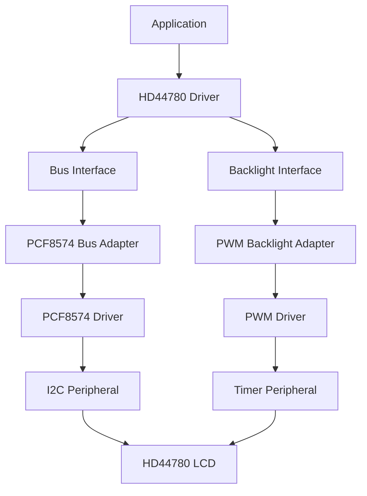
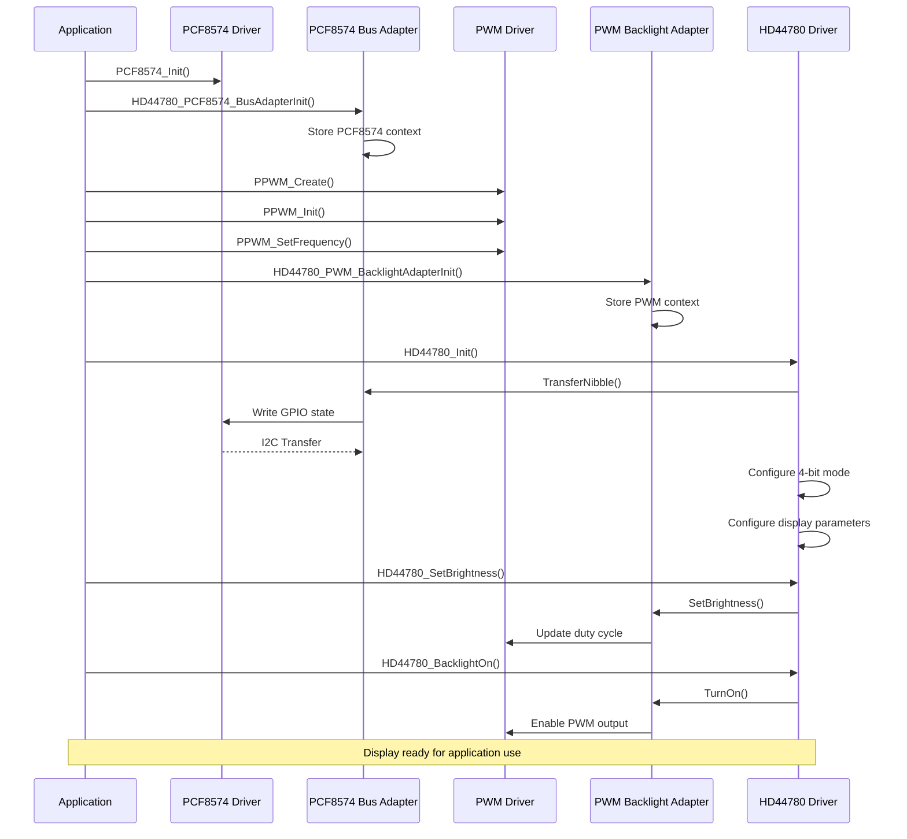

# HD44780 LCD Driver

A generic, hardware-independent driver for HD44780 compatible character LCD modules designed for embedded systems.

The driver implements the HD44780 controller communication protocol, abstracting bus communication and backlight control through configurable interfaces. This allows reuse with different hardware implementations such as direct GPIO, I2C expanders, PWM-controlled backlights, and other peripherals.

---

# Features

- Complete HD44780 controller initialization.
- 4-bit communication mode support.
- Command and data transmission.
- Display control:
  - Display ON/OFF.
  - Cursor visibility.
  - Cursor blinking.
- Cursor direction configuration:
  - Increment mode.
  - Decrement mode.
- Automatic display shift configuration.
- Cursor positioning using row and column coordinates.
- Character writing.
- String writing.
- Line-specific text printing.
- Line clearing.
- Custom character creation using CGRAM.
- Backlight control:
  - Enable/disable.
  - Brightness adjustment.
- Hardware-independent architecture:
  - Bus Interface abstraction.
  - Backlight Interface abstraction.
- Provided adapters:
  - PCF8574 I2C bus adapter.
  - PWM timer backlight adapter.

---

# Architecture

The driver follows a layered architecture where hardware dependencies are isolated through abstraction interfaces.

The HD44780 driver never accesses hardware peripherals directly. All communication with the LCD controller is performed through the Bus Interface, while backlight control is performed through the Backlight Interface.

This design allows the driver to be reused across different microcontrollers and hardware configurations.



---

# Directory Structure

Example project organization:

```text
HD44780/
|
├── Inc/
│   ├── HD44780_Driver.h
│   ├── HD44780_BusInterface.h
│   ├── HD44780_BacklightInterface.h
│   ├── HD44780_PCF8574_BusAdapter.h
│   └── HD44780_PWM_BacklightAdapter.h
|
└── Src/
    ├── HD44780_Driver.c
    ├── HD44780_PCF8574_BusAdapter.c
    └── HD44780_PWM_BacklightAdapter.c
```

---

# Driver Responsibilities

The HD44780 driver is responsible for:

- Implementing the HD44780 communication protocol.
- Managing the LCD initialization sequence.
- Sending commands and data.
- Managing internal display configuration state.
- Controlling cursor position.
- Writing characters and strings.
- Managing CGRAM custom characters.
- Controlling the backlight through an abstract interface.

The driver is **not responsible** for:

- Direct GPIO access.
- Direct I2C communication.
- Timer configuration.
- Interrupt handling.
- Character buffering.
- Display queue management.
- Low-level peripheral initialization.

---

# Dependencies

Required dependencies:

```text
Time Platform Interface
```

Provides timing functions required by the HD44780 specification:

```c
Platform_DelayUs()
Platform_DelayMs()
```

Optional dependencies:

```text
PCF8574 Driver
PWM Platform Interface
```

These are required only when using the provided adapters.

---

# Bus Interface

The communication between the HD44780 driver and the physical bus is abstracted through:

```c
HD44780_BusInterfaceTypeDef
```

Definition:

```c
typedef struct
{
    HD44780_BusOpStatusTypeDef (*TransferNibble)(
        void* Context,
        uint8_t Nibble,
        HD44780_RegisterSelectTypeDef Rs
    );

    void* Context;

} HD44780_BusInterfaceTypeDef;
```

The driver communicates only through the `TransferNibble()` callback.

The concrete adapter is responsible for:

- Mapping data bits.
- Controlling RS signal.
- Generating EN pulse.
- Handling the physical communication method.

The driver sends data as nibbles because the HD44780 operates internally with 4-bit transfers when configured in 4-bit mode.

---

# PCF8574 Bus Adapter

The PCF8574 adapter implements the Bus Interface using an I2C GPIO expander.

Responsibilities:

- Convert HD44780 signals into PCF8574 bit operations.
- Generate the enable pulse.
- Control RS.
- Send high and low nibbles.
- Handle I2C communication through the PCF8574 driver.

Initialization:

```c
HD44780_PCF8574_BusAdapterInit(
    HD44780_BusInterfaceTypeDef* Bus,
    PCF8574_HandleTypeDef* PCF8574_Instance
);
```

The adapter stores the PCF8574 instance as context and exposes the required bus operations to the HD44780 driver.

# Backlight Interface

Backlight control is abstracted through the:

```c
HD44780_BacklightInterfaceTypeDef
```

interface.

Definition:

```c
typedef struct
{
    HD44780_BacklightOpStatusTypeDef (*TurnOn)(void* Context);

    HD44780_BacklightOpStatusTypeDef (*TurnOff)(void* Context);

    HD44780_BacklightOpStatusTypeDef (*SetBrightness)(
        void* Context,
        uint16_t Level
    );

    uint16_t (*GetBrightness)(void* Context);

    void* Context;

} HD44780_BacklightInterfaceTypeDef;
```

The HD44780 driver does not know how the backlight is physically controlled.

The concrete adapter is responsible for implementing:

- Backlight activation.
- Backlight deactivation.
- Brightness control.
- Hardware-specific conversion.

Possible implementations:

- GPIO controlled backlight.
- PWM controlled backlight.

---

# PWM Backlight Adapter

The provided PWM adapter controls the LCD backlight intensity using a PWM peripheral.

The adapter converts a brightness level into a PWM duty cycle.

Initialization:

```c
HD44780_BacklightOpStatusTypeDef HD44780_PWM_BacklightAdapterInit(
    HD44780_BacklightInterfaceTypeDef* Backlight,
    void* Context
);
```

The context must point to a PWM instance:

```c
PWM_HandleTypeDef
```

Example:

```c
PWM_HandleTypeDef LCD_BacklightAdapter;

HD44780_PWM_BacklightAdapterInit(
    &LCD._backlight,
    &LCD_BacklightAdapter
);
```

The adapter is independent from the timer implementation. Any PWM driver implementing the required interface can be used.

---

# Initialization Flow

The typical initialization sequence is shown below.



---

# Usage Example

The following example demonstrates the initialization of the LCD driver using:

- PCF8574 as the bus communication interface.
- PWM as the backlight controller.

Required includes:

```c
#include "main.h"

#include "i2c.h"
#include "tim.h"
#include "gpio.h"

#include "HD44780_Driver.h"
#include "HD44780_PCF8574_BusAdapter.h"
#include "HD44780_PWM_BacklightAdapter.h"
```

---

## Driver Objects

```c
PCF8574_HandleTypeDef LCD_BusAdapter;

const int16_t LCD_BusAdapter_I2C_Address = 0x20;

PWM_HandleTypeDef LCD_BacklightAdapter;

HD44780_HandleTypeDef LCD =
{
    ._cols           = 16,
    ._rows           = HD44780_2LINE,
    ._interface_mode = HD44780_4BIT_MODE,
    ._font_dot_size  = HD44780_5X8_FONT,
    ._initialized    = false,
};
```

---

## Initialization

```c
int main(void)
{
    HAL_Init();

    SystemClock_Config();

    MX_GPIO_Init();
    MX_I2C1_Init();
    MX_TIM4_Init();


    /*
     * Initialize PCF8574 bus expander
     */
    PCF8574_Init(
        &LCD_BusAdapter,
        LCD_BusAdapter_I2C_Address,
        &hi2c1
    );


    /*
     * Connect PCF8574 adapter to HD44780 bus interface
     */
    HD44780_PCF8574_BusAdapterInit(
        &LCD._bus,
        &LCD_BusAdapter
    );


    /*
     * Configure PWM backlight
     */
    PPWM_Create(
        &LCD_BacklightAdapter,
        &htim4,
        PWM_CHANNEL_4
    );

    PPWM_Init(
        &LCD_BacklightAdapter
    );

    PPWM_SetFrequency(
        &LCD_BacklightAdapter,
        1500
    );


    /*
     * Connect PWM adapter to HD44780 backlight interface
     */
    HD44780_PWM_BacklightAdapterInit(
        &LCD._backlight,
        &LCD_BacklightAdapter
    );


    /*
     * Initialize LCD controller
     */
    HD44780_Init(
        &LCD
    );


    HD44780_SetBrightness(
        &LCD,
        40
    );


    HD44780_BacklightOn(
        &LCD
    );
    //LCD initialized and ready for application use
}
```

---

# Basic Operations

## Write Text

```c
HD44780_SetCursor(
    &LCD,
    0,
    0
);

HD44780_WriteString(
    &LCD,
    "Hello World!"
);
```

---

## Write Character

```c
HD44780_SetCursor(
    &LCD,
    0,
    5
);

HD44780_WriteChar(
    &LCD,
    'A'
);
```

---

## Clear Display

```c
HD44780_Clear(
    &LCD
);
```

---

## Print Text on Specific Line

```c
HD44780_PrintLine(
    &LCD,
    1,
    "Line 2"
);
```

---

## Clear Specific Line

```c
HD44780_ClearLine(
    &LCD,
    0
);
```

---

## Backlight Control

```c
HD44780_BacklightOn(
    &LCD
);


HD44780_SetBrightness(
    &LCD,
    80
);


HD44780_BacklightOff(
    &LCD
);
```
# Custom Characters

The HD44780 controller provides 64 bytes of CGRAM memory that can be used to store custom characters.

The driver provides support for:

- Creating custom characters.
- Tracking programmed CGRAM positions.
- Writing custom characters to the display.

Example:

```c
const uint8_t lock_symbol_bitmap[8] =
{
    0b00100,
    0b01110,
    0b10001,
    0b11111,
    0b11011,
    0b11111,
    0b11111,
    0b00000
};


HD44780_CreateChar(
    &LCD,
    0,
    lock_symbol_bitmap
);


HD44780_SetCursor(
    &LCD,
    0,
    10
);


HD44780_WriteCustomChar(
    &LCD,
    0
);
```

The driver verifies whether the requested CGRAM position has already been programmed before writing the character.

This prevents displaying undefined custom characters.

---

# Design Decisions

## 1. Separation Between Driver and Hardware

The HD44780 driver does not access hardware peripherals directly.

The driver communicates only through:

- `HD44780_BusInterfaceTypeDef`
- `HD44780_BacklightInterfaceTypeDef`

This allows:

- Changing the communication bus without modifying the driver.
- Replacing PCF8574 with direct GPIO.
- Replacing PWM backlight with GPIO control.
- Creating hardware mocks for unit testing.

This design follows the **Dependency Inversion Principle**, where the high-level driver depends on abstractions instead of concrete hardware implementations.

---

## 2. Nibble-Based Bus Interface

When operating in 4-bit mode, the HD44780 requires each byte to be transferred as:

1. High nibble.
2. Low nibble.

The driver handles the transfer order and protocol timing.

The adapter is responsible for:

- Physical bit mapping.
- RS control.
- Enable pulse generation.
- Bus synchronization.

Example:

```text
Byte: 0x41 ('A')

Binary:
0100 0001


Transfer sequence:

1st nibble:
0100

2nd nibble:
0001
```

The driver therefore remains independent from the physical transport layer.

---

## 3. Internal State Management

The driver maintains internal configuration flags to keep track of LCD state.

Examples:

- Display enabled/disabled.
- Cursor enabled/disabled.
- Cursor blinking.
- Entry mode configuration.
- Display shift configuration.

This allows the driver to reconstruct configuration commands without resetting unrelated settings.

Example:

Instead of blindly sending:

```text
Display OFF
```

the driver can preserve:

```text
Cursor enabled
Blink enabled
Shift disabled
```

and only modify the required bit.

---

## 4. Custom Character Tracking

The driver tracks which CGRAM positions have been initialized.

Benefits:

- Prevents writing invalid custom characters.
- Avoids unexpected display behavior.
- Simplifies application usage.

The application only needs to create the character once before using it.

---

## 5. Delay-Based Synchronization

The HD44780 provides a busy flag that can be read to determine when the controller is ready for a new command.

This implementation uses fixed delays instead.

Advantages:

- Simpler hardware requirements.
- Compatible with write-only interfaces.
- Works correctly with PCF8574 adapters.

Trade-off:

- Slightly slower than busy flag polling.
- Additional waiting time after commands.

A future implementation could add busy-flag support if required.

---

## 6. Timing Abstraction

The driver does not directly depend on MCU-specific delay functions.

Timing is provided through the platform layer:

```c
Platform_DelayUs()

Platform_DelayMs()
```

This allows portability between:

- Different STM32 families.
- Different microcontrollers.
- Different operating environments.

---

# Current Limitations

## Interface Mode

Only 4-bit communication mode is currently supported.

8-bit mode is not implemented.

---

## Busy Flag

The driver does not read the HD44780 busy flag.

Synchronization is performed using fixed delays.

---

## Display Shift API

Entry mode shift configuration is supported, but advanced display shifting operations are not currently exposed through dedicated APIs.

---

## Multi-Instance Support

The current implementation was designed primarily for single-display applications.

Although the driver uses:

```c
HD44780_HandleTypeDef
```

to represent an instance, some internal state variables are still maintained at module level.

Using multiple LCD instances simultaneously may cause conflicts.

Future improvement:

Move all runtime state variables into:

```c
HD44780_HandleTypeDef
```

to achieve complete multi-instance support.

---

## Available Adapters

Currently provided adapters:

- PCF8574 I2C bus adapter.
- PWM timer backlight adapter.

Additional adapters can be created by implementing the corresponding interfaces:

```c
HD44780_BusInterfaceTypeDef

HD44780_BacklightInterfaceTypeDef
```

Examples:

- Direct GPIO bus.
- SPI shift register.
- GPIO-controlled backlight.
- DAC-controlled brightness.

---

# Future Improvements

Possible improvements:

- Add 8-bit interface support.
- Add busy flag polling.
- Add complete multi-instance support.
- Add display shift API.
- Add display geometry abstraction for different LCD models.
- Add support for additional communication adapters.

---

# License

This module is part of the:

```text
Electronic Lock Project
```

and follows the project's license terms.