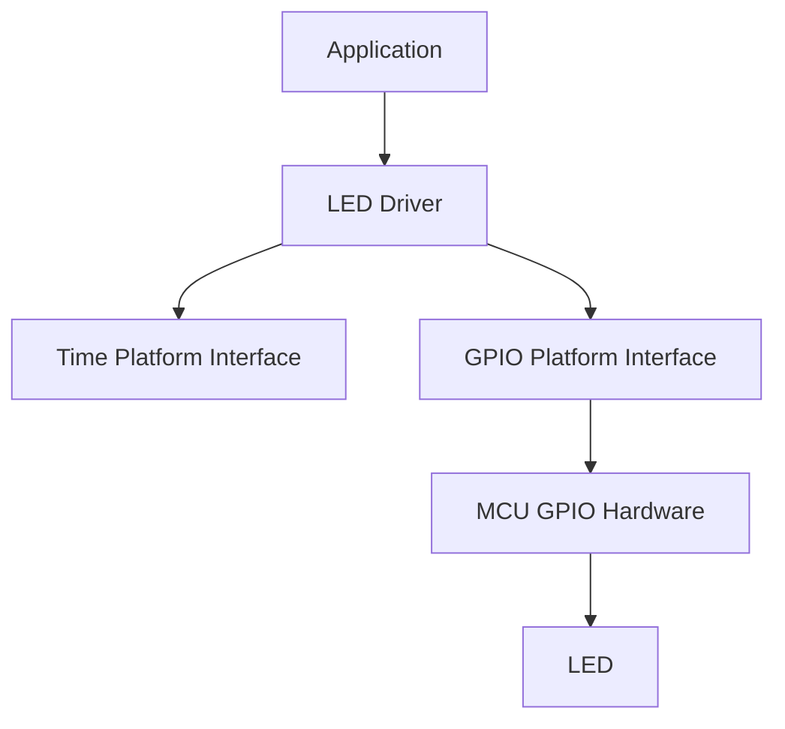
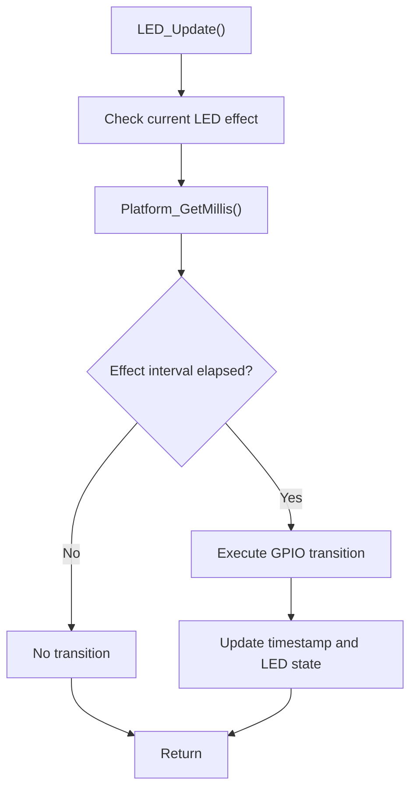
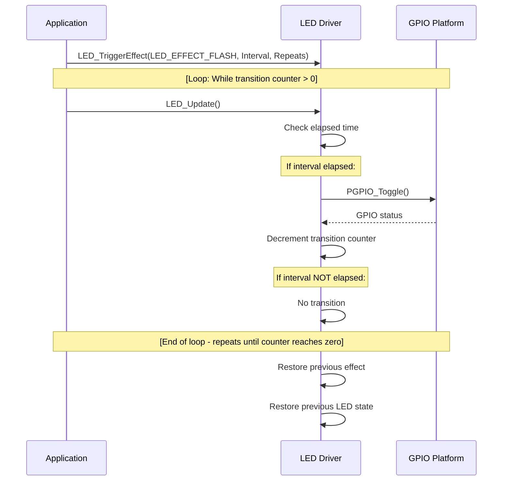
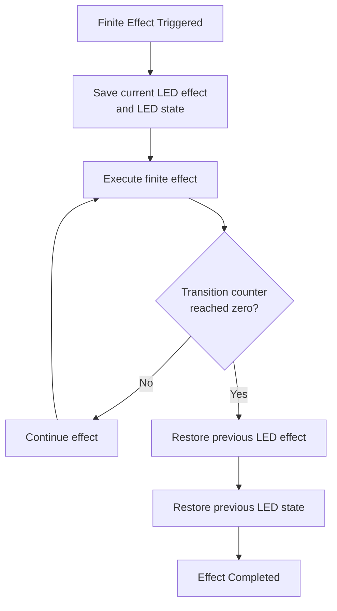
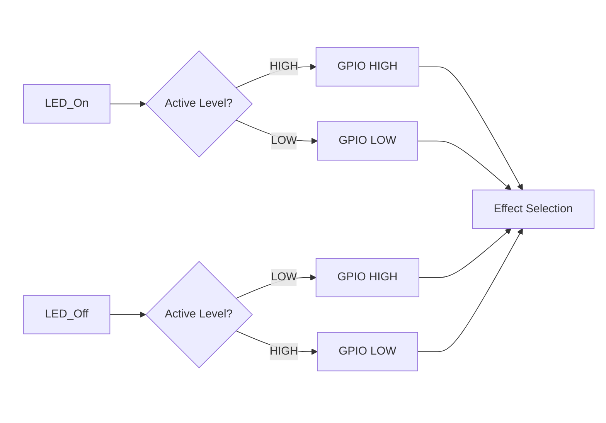
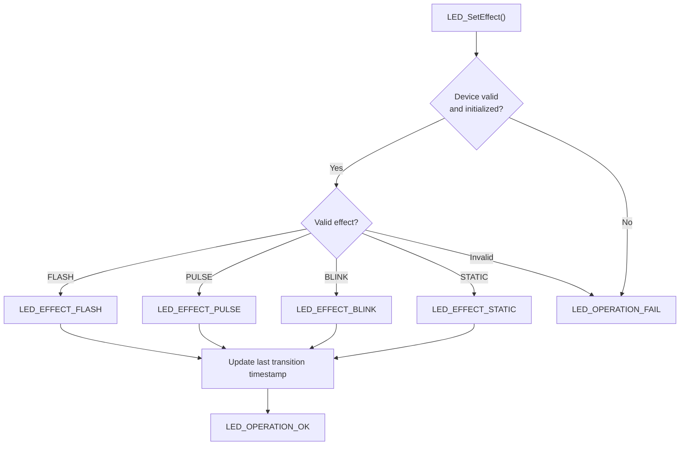
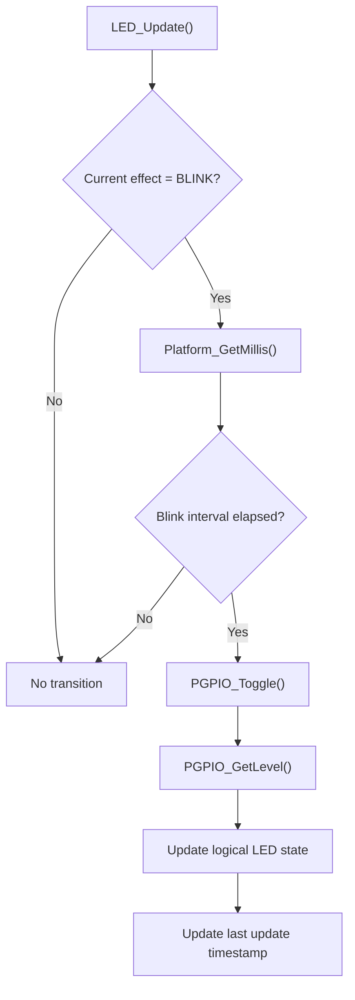
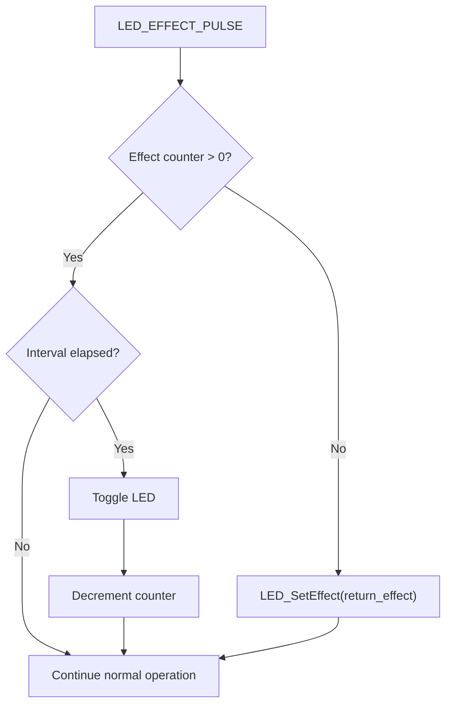
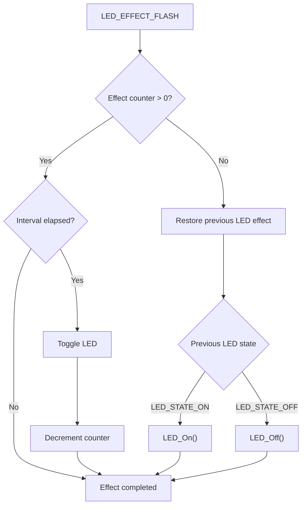
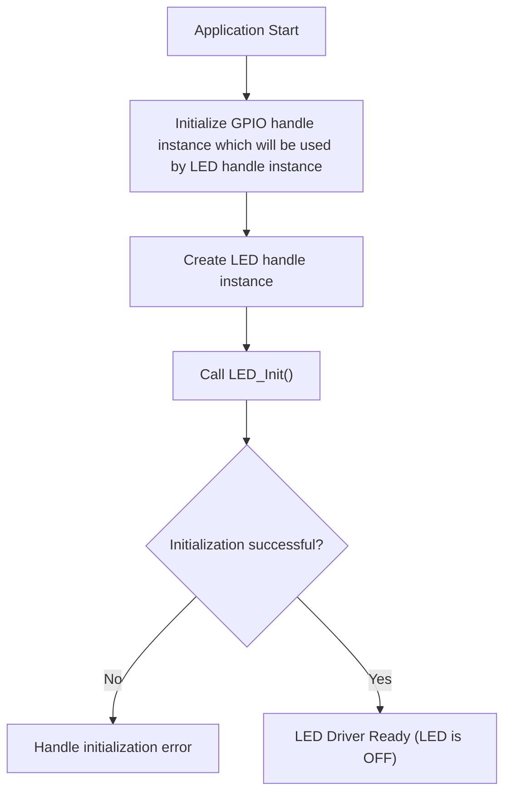

## LED Driver
The LED Driver provides a hardware‑independent interface for controlling LEDs through a platform GPIO interface.

The driver abstracts the electrical characteristics of the LED, including active‑high and active‑low configurations, while providing a logical interface for direct LED control and non‑blocking timed effects.

The driver supports both static LED control and programmable effects, allowing the application to control the LED state without directly interacting with GPIO hardware operations.

The LED effects are executed through periodic calls to LED_Update(), making the driver suitable for cooperative main‑loop architectures and periodic task execution in embedded systems.

---

## Features
The driver provides the following operating modes:

- Static — Maintains the LED in its current commanded state without timed transitions.
- Blink — Continuously toggles the LED at a configurable interval.
- Pulse — Executes a finite LED transition sequence using a single repetition.
- Flash — Executes a finite LED transition sequence with a configurable number of repetitions and restores the previous LED state when completed.

## Key Characteristics
- Hardware‑independent LED control.
- Support for active‑high and active‑low LEDs.
- Non‑blocking timed effects.
- Millisecond‑based timing through the platform time interface.
- Explicit logical LED state management.
- Effect state management and restoration.
- GPIO access abstracted through the platform GPIO interface.
- Suitable for execution from a main loop or periodic task.
- No blocking delays are introduced by the driver.

## Design Objective
The primary objective of the LED Driver is to separate LED control logic from the underlying GPIO implementation.

The application interacts with the LED through logical operations such as:

```text
LED_On()
LED_Off()
LED_BlinkOn()
LED_BlinkOff()
LED_TriggerEffect()
LED_Update()
```
while the driver delegates the physical GPIO operations to the platform interface.

This separation allows the LED control logic to remain independent of the target MCU, GPIO peripheral, and hardware abstraction layer used by the application.

---

## Architecture
The LED Driver follows a layered architecture in which the LED control logic is separated from the underlying hardware implementation.

The driver is responsible for LED state management, effect execution, and timing control, while physical GPIO access is delegated to the GPIO platform interface.

This separation prevents hardware‑specific dependencies from being introduced into the LED Driver implementation.

Architecture Diagram


The LED Driver therefore depends on platform interfaces rather than MCU‑specific implementations.

This architectural separation allows the LED Driver to remain portable across different embedded platforms.

## Layer Responsibilities
### Application Layer
The application controls the LED through the public LED Driver API.

The application does not need to know the GPIO electrical level required to activate the LED or how the timed effects are implemented.

### LED Driver Layer
The LED Driver contains the application‑independent logic required to control the LED.

Its responsibilities include:

- Maintaining the logical LED state.
- Handling active‑high and active‑low configurations.
- Selecting the active LED effect.
- Managing effect timing.
- Managing finite effect counters.
- Preserving the previous LED state when required.
- Preserving the previous LED effect when required.
- Executing non‑blocking LED transitions.
- Translating logical LED operations into GPIO platform operations.
- The driver does not directly access MCU GPIO registers or MCU‑specific HAL functions.

### Time Platform Interface
The Time Platform Interface provides the millisecond time base used by the LED Driver.

The driver obtains the current timestamp through:

```text
Platform_GetMillis()
```
The time platform is responsible for providing the time reference, while the LED Driver is responsible for determining whether an effect interval has elapsed.

### GPIO Platform Interface
The GPIO Platform Interface provides the hardware‑independent operations required by the LED Driver.

The LED Driver uses operations such as:

```text
PGPIO_Set()
PGPIO_Reset()
PGPIO_Toggle()
PGPIO_GetLevel()
```
The platform interface isolates the LED Driver from the underlying GPIO implementation.

Depending on the platform, this layer may use:

- HAL APIs.
- LL APIs.
- Direct register access.
- Another MCU‑specific GPIO implementation.

The LED Driver remains unchanged when the underlying GPIO implementation changes.

### Hardware Layer
The hardware layer contains the physical GPIO peripheral and the LED connected to it.

The LED may use either an active‑high or active‑low electrical configuration.

For an active‑high configuration:

```text
GPIO HIGH -> LED ON
GPIO LOW  -> LED OFF
```
For an active‑low configuration:

```text
GPIO LOW  -> LED ON
GPIO HIGH -> LED OFF
```
This electrical difference is handled by the LED Driver through the configured `LED_ActiveLevelTypeDef`.

--- 

# Directory Structure

Example project organization:

```text
Led/
|
├── Inc/
│   └── LED_Driver.h
|
└── Src/
    └── LED_Driver.c
```

---

## Effect Execution Model
Timed effects are implemented as non‑blocking operations.

The application periodically calls `LED_Update()`. The driver obtains the current timestamp and determines whether the configured effect interval has elapsed.

This execution model ensures that LED effects do not block the application while waiting for timing intervals to expire.

---

## Supported Features
The LED Driver provides a set of features designed to support both direct LED control and non‑blocking timed effects.

### Static Control
The driver provides direct control of the LED logical state through:

```text
LED_On()
LED_Off()
```
The physical GPIO level required to represent each logical state is determined automatically from the configured `LED_ActiveLevelTypeDef`.

This allows the same driver implementation to support both active‑high and active‑low LED circuits.

### Continuous Blink Effect
The blink effect continuously toggles the LED using a configurable time interval.

It is enabled through:

```text
LED_BlinkOn()
```
and disabled through:
```text
LED_BlinkOff()
```
The interval represents the time between consecutive LED state transitions.

For example, configuring a 1000 ms interval produces:

```text
        1000 ms          1000 ms
   ON ------------ OFF ------------ ON
   ```
The blink effect is non‑blocking and requires periodic execution of:

```text
LED_Update();
```

### Finite Pulse Effect
The pulse effect generates a finite sequence of LED state transitions.

The pulse effect always executes a single complete cycle regardless of the `Repeats` parameter supplied to `LED_TriggerEffect()`.

Internally, one complete cycle consists of two state transitions:

```text
        Transition 1       Transition 2
             |                  |
             v                  v

        +---------+        +---------+
        |  LED    |        |  LED    |
        |  ON     | -----> |  OFF    |
        +---------+        +---------+

              <--- Interval --->
```
After the configured transitions are completed, the driver restores the previously active LED effect.

### Finite Flash Effect
The flash effect generates a finite sequence of LED state transitions using the configured number of repetitions.

Each repetition consists of two transitions.

Therefore, the internal transition count is calculated as:

```text
Transition Count = Repeats × 2
```
For example, with three repetitions:

```text
Repeats = 3

Transition Count = 3 × 2
                 = 6
```
The effect execution can be represented as:


The flash effect also restores the LED logical state that was active when the effect was triggered.

### Effect Restoration
Finite effects temporarily replace the currently active LED behavior.

Before a finite effect starts, the driver stores:

```text
Previous LED Effect
Previous LED State
```
These values are stored in the LED effect context.

After the finite effect completes, the driver restores the previous behavior.

The restoration model is:


This allows finite effects to behave as temporary overrides without permanently changing the LED behavior that was active before the effect was triggered.

### Active‑Level Abstraction
The driver supports both common LED electrical configurations:

```text
LED_ACTIVE_HIGH

Logical ON  -> GPIO HIGH
Logical OFF -> GPIO LOW
```
and:

```text
LED_ACTIVE_LOW

Logical ON  -> GPIO LOW
Logical OFF -> GPIO HIGH
```
The application therefore operates exclusively with logical states:

```text
LED_STATE_ON
LED_STATE_OFF
```
without needing to handle the electrical polarity of the LED GPIO directly.

### Non‑Blocking Operation
All timed LED effects are implemented without blocking delays.

The driver uses:

```text
Platform_GetMillis()
```
to determine whether the configured interval has elapsed.

The application remains responsible for periodically calling:

```text
LED_Update();
```
This allows the CPU to execute other application logic between LED transitions.

```text
Application
     |
     +----> LED_Update()
     |
     +----> Other Application Tasks
     |
     +----> Communication
     |
     +----> Input Processing
     |
     +----> LED_Update()
     |
     +----> Other Application Tasks
     |
     +----> ...
```
---

## Driver Operation
The LED Driver operates through a combination of direct state control and timed effect execution.

The driver maintains the current logical LED state independently from the electrical GPIO level. The configured active level determines how the logical state is translated into the physical GPIO output.

### LED State Control
The logical LED state is represented by:

```text
LED_STATE_ON
LED_STATE_OFF
```
When `LED_On()` is called, the driver translates the logical ON state into the appropriate GPIO level according to the configured active level.

When `LED_Off()` is called, the driver performs the inverse operation.

### Effect Selection
The driver maintains the currently active effect through `LED_EffectTypeDef`.

The available effects are:

```text
LED_EFFECT_STATIC
LED_EFFECT_BLINK
LED_EFFECT_PULSE
LED_EFFECT_FLASH
```
The internal `LED_SetEffect()` function is responsible for selecting the active effect and resetting the timing reference used by `LED_Update()`.


### Blink Operation
The blink effect remains active until explicitly disabled through `LED_BlinkOff()` or replaced by another effect.

When `LED_Update()` is executed, the driver checks whether the configured blink interval has elapsed.

If the interval has elapsed, the GPIO output is toggled and the logical LED state is updated.


### Finite Effect Operation
Both pulse and flash effects use a transition counter to determine when the finite sequence has completed.

Each complete repetition corresponds to two LED state transitions.

```text
Transition Counter = Repeats × 2
```
The pulse effect overrides the supplied repetition count and always executes a single repetition.
```text
LED_EFFECT_PULSE

Repeats = 1
Transitions = 2
```
The flash effect uses the configured repetition count.

```text
LED_EFFECT_FLASH

Repeats = N
Transitions = N × 2
```

### Pulse Effect Completion
When the pulse transition counter reaches zero, the driver restores the previously active effect.

The LED state itself is not explicitly restored by the pulse completion logic.


### Flash Effect Completion
The flash effect stores both the previous LED effect and the previous LED state before execution.

When the transition counter reaches zero, both values are restored.


---

## Periodic Update Requirement
Timed effects are progressed only when `LED_Update()` is executed.

Therefore, enabling an effect does not cause the driver to create its own execution context or timer.

The application must provide the periodic execution:

```c
while (1)
{
    LED_Update(&Led);

    /* Other application processing */
}
```

---

## Configuration and Enumerations
The LED Driver uses enumerations to represent the logical LED state, electrical active level, operating effect, and operation status.

These enumerations provide a strongly typed interface between the application and the driver.

### LED Operation Status
```c
typedef enum
{
    LED_OPERATION_OK   = 0U,
    LED_OPERATION_FAIL
} LED_OpStatusTypeDef;
```
### LED State
```c
typedef enum
{
    LED_STATE_OFF = 0U,
    LED_STATE_ON
} LED_StateTypeDef;
```
The logical state is independent from the physical GPIO level.

For example, with an active‑low LED:

```text
LED_STATE_ON  -> GPIO LOW
LED_STATE_OFF -> GPIO HIGH
```
### LED Active Level
```c
typedef enum
{
    LED_ACTIVE_LOW  = 0U,
    LED_ACTIVE_HIGH = 1U
} LED_ActiveLevelTypeDef;
```
### LED Effect
```c
typedef enum
{
    LED_EFFECT_STATIC,
    LED_EFFECT_BLINK,
    LED_EFFECT_PULSE,
    LED_EFFECT_FLASH
} LED_EffectTypeDef;
```

### Effect	Description
| Effect | Description |
| :--- | :--- |
| `LED_EFFECT_STATIC` | Maintains the current commanded LED state. |
| `LED_EFFECT_BLINK` | Continuously toggles the LED at the configured interval. |
| `LED_EFFECT_PULSE` | Executes one finite ON/OFF cycle. |
| `LED_EFFECT_FLASH` | Executes a configurable number of ON/OFF repetitions. |

## LED Driver Handle
The driver state is stored in a LED_HandleTypeDef structure.

The handle contains:
- Pointer to the GPIO handle.
- Current logical LED state.
- Active electrical level.
- Effect context (current effect, return effect, return state).
- Timing information (last update timestamp, intervals).
- Finite effect counters (repeat count, transition counter).
- Flags (_effect_is_active, _initialized).

**Note**
- All members of LED_HandleTypeDef are internal driver state. They must not be accessed or modified directly by the application. The driver API shall be used exclusively.

---

## Public API
### LED_Init
```c
LED_OpStatusTypeDef LED_Init(
    LED_HandleTypeDef*     Device,
    GPIO_HandleTypeDef*    Gpio,
    LED_ActiveLevelTypeDef ActiveLevel
);
```
#### Description
- Initializes an LED driver instance.
- Associates the driver with a GPIO handle.
- Configures the active electrical level.
- Sets the initial logical state to LED_STATE_OFF and drives the GPIO to its inactive level.
- Resets all effect timers and counters.
- Marks the driver as initialized.

#### Parameters

- Device &nbsp;&nbsp;&nbsp;&nbsp;&nbsp;&nbsp;&nbsp;&nbsp;- Pointer to the LED driver handle.
- Gpio &nbsp;&nbsp;&nbsp;&nbsp;&nbsp;&nbsp;&nbsp;&nbsp;&nbsp;&nbsp;&nbsp;- Pointer to the GPIO platform handle.
- ActiveLevel - Electrical level that turns the LED on.

#### Returns

- LED_OPERATION_OK   &nbsp;&nbsp;– Initialization successful.
- LED_OPERATION_FAIL – Invalid parameters or GPIO handle failure.

### LED_On
```c
LED_OpStatusTypeDef LED_On(LED_HandleTypeDef* Device);
```
#### Description
- Turns the LED on.
- Drives the GPIO to the active level according to ActiveLevel.
- Updates the logical state to LED_STATE_ON.
- Restores the effect that was active before a previous LED_Off() call (if any).

#### Parameters

- Device - Pointer to the LED driver handle.

#### Returns

- LED_OPERATION_OK &nbsp;&nbsp;– Operation successful.
- LED_OPERATION_FAIL – Device not initialized or GPIO operation failed.

### LED_Off
```c
LED_OpStatusTypeDef LED_Off(LED_HandleTypeDef* Device);
```
#### Description
- Turns the LED off.
- Drives the GPIO to the inactive level.
- Updates the logical state to LED_STATE_OFF.
- Saves the current effect so it can be restored by a later LED_On().

#### Parameters

- Device - Pointer to the LED driver handle.

#### Returns

- LED_OPERATION_OK &nbsp;&nbsp;– Operation successful.
- LED_OPERATION_FAIL – Device not initialized or GPIO operation failed.

### LED_BlinkOn
```c
LED_OpStatusTypeDef LED_BlinkOn(
    LED_HandleTypeDef* Device,
    uint32_t           BlinkTimeMs
);
```
#### Description
- Enables the continuous blink effect.
- Sets the blink interval.
- Activates LED_EFFECT_BLINK.
- Resets the effect timing reference.

#### Parameters

- Device &nbsp;&nbsp;&nbsp;&nbsp;&nbsp;&nbsp;&nbsp;&nbsp;&nbsp;&nbsp;- Pointer to the LED driver handle.

- BlinkTimeMs - Time between consecutive LED transitions, in milliseconds.

#### Returns

- LED_OPERATION_OK &nbsp;&nbsp;– Blink enabled.

- LED_OPERATION_FAIL – Device not initialized.

**Note**
- BlinkTimeMs should be greater than zero to produce a visible blink.

### LED_BlinkOff
```c
LED_OpStatusTypeDef LED_BlinkOff(LED_HandleTypeDef* Device);
```
#### Description
- Disables the blink effect.
- Clears the blink interval.
- Sets the active effect to LED_EFFECT_STATIC.
- The LED remains in its current state.

#### Parameters

- Device - Pointer to the LED driver handle.

#### Returns

- LED_OPERATION_OK &nbsp;&nbsp;– Blink disabled.
- LED_OPERATION_FAIL – Device not initialized.

### LED_TriggerEffect
```c
LED_OpStatusTypeDef LED_TriggerEffect(
    LED_HandleTypeDef*  Device,
    LED_EffectTypeDef   Effect,
    uint32_t            Interval,
    uint16_t            Repeats
);
```
#### Description
- Triggers a finite LED effect.
- Stores the current effect and LED state for later restoration.
- Configures the interval and repetition count.
- Activates the requested effect (LED_EFFECT_PULSE or LED_EFFECT_FLASH).
- Effect‑specific behaviour:
  - LED_EFFECT_PULSE – Always executes exactly one repetition (Repeats is ignored).
  - LED_EFFECT_FLASH – Executes Repeats complete cycles (each cycle = 2 transitions).

#### Parameters

- Device &nbsp;&nbsp;&nbsp;- Pointer to the LED driver handle.

- Effect &nbsp;&nbsp;&nbsp;&nbsp;&nbsp;- LED_EFFECT_PULSE or LED_EFFECT_FLASH.

- Interval &nbsp;&nbsp;- Time between consecutive transitions, in milliseconds.

- Repeats - Number of complete cycles (only for FLASH; ignored for PULSE).

#### Returns

- LED_OPERATION_OK &nbsp;&nbsp;– Effect triggered.

- LED_OPERATION_FAIL – Device not initialized or invalid effect.

### LED_Update
```c
LED_OpStatusTypeDef LED_Update(LED_HandleTypeDef* Device);
```
#### Description
- Advances the currently active timed LED effect.
- For LED_EFFECT_BLINK – toggles the LED when the blink interval has elapsed.
- For LED_EFFECT_PULSE – toggles the LED for one complete cycle, then restores the previous effect.
- For LED_EFFECT_FLASH – toggles the LED for the requested number of cycles, then restores the previous effect and LED state.
- For LED_EFFECT_STATIC – does nothing.

#### Parameters

- Device – Pointer to the LED driver handle.

#### Returns

- LED_OPERATION_OK &nbsp;&nbsp;– Update processed.

- LED_OPERATION_FAIL – Device not initialized or GPIO operation failed.

**Important**
- `LED_Update()` must be called periodically from the application’s main loop or a periodic task for timed effects to work correctly.

---

## Initialization Flow

---
## Usage Examples
### Static Control
```c
LED_HandleTypeDef Led;

LED_On(&Led);

/* LED remains continuously ON */

LED_Off(&Led);

/* LED remains continuously OFF */
```
### Blink Effect
```c
LED_HandleTypeDef Led;

LED_BlinkOn(&Led, 500U);

while (1)
{
    LED_Update(&Led);

    /* Other application processing */
}
```
To stop blinking:

```c
LED_BlinkOff(&Led);
```
### Pulse Effect
The pulse effect executes exactly one complete ON/OFF cycle.

```c
LED_HandleTypeDef Led;

LED_TriggerEffect(
    &Led,
    LED_EFFECT_PULSE,
    250U,
    1U
);
```
The effective sequence is:

```text
Current LED State
       |
       v
   Transition
       |
     250 ms
       |
       v
   Transition
       |
       v
Effect Complete
```
### Flash Effect
The flash effect supports a configurable number of repetitions.

```c
LED_HandleTypeDef Led;

LED_TriggerEffect(
    &Led,
    LED_EFFECT_FLASH,
    200U,
    3U
);
```
The resulting transition count is:

```text
Repeats = 3

Transition Count = 3 × 2 
                 = 6
```
The driver restores the LED state and effect that were active before the flash effect was triggered.

### Complete Application Example
```c
#include "LED_Driver.h"

static GPIO_HandleTypeDef Led_Gpio;

static LED_HandleTypeDef Led;

static void Application_Init(void)
{
    if (LED_Init(&Led, &Led_Gpio, LED_ACTIVE_LOW) != LED_OPERATION_OK)
    {
        Error_Handler();
    }
}

static void Application_Process(void)
{
    /*
     * Example application event.
     *
     * In the Electronic Lock application this could
     * represent an access granted event, authentication
     * result, alarm condition, or another system event.
     */
    if (Application_EventDetected())
    {
        LED_TriggerEffect(
            &Led,
            LED_EFFECT_FLASH,
            150U,
            3U
        );
    }
}

int main(void)
{
    HAL_Init();
    SystemClock_Config();

    MX_GPIO_Init();

    PGPIO_Init(&Led_Gpio, GPIOA, 15);

    Application_Init();

    while (1)
    {
        LED_Update(&Led);

        Application_Process();

        /*
         * Other application processing:
         *
         * - Keyboard processing
         * - Lock state machine
         * - Communication
         * - User interface
         * - Other periodic services
         */
    }
}
```
---

## Non‑Blocking Design
The LED Driver deliberately avoids blocking delay‑based implementations.

Avoid:

```text
HAL_Delay(500);
```

inside the LED effect implementation.

Instead, the driver uses timestamp comparison:

```text
LED_Update()
      |
      v
Read current timestamp
      |
      v
Compare elapsed time
      |
      +---- Not elapsed ----> Return
      |
      +---- Elapsed --------> Toggle LED
                                |
                                v
                         Update timestamp
                                |
                                v
                              Return
```
---

## Error Handling
LED Driver API functions return LED_OpStatusTypeDef.

The application should verify the return value for operations that can fail.

Example:

```c
if (LED_BlinkOn(&Led, 500U) != LED_OPERATION_OK)
{
    Error_Handler();
}
```

The appropriate error handling strategy depends on the role of the LED in the system.

---

## Design Constraints
The LED Driver intentionally does not provide:

- Its own RTOS task.
- Its own hardware timer.
- Blocking delays.
- MCU‑specific GPIO access.
- MCU‑specific time‑base implementation.
- Dynamic memory allocation.
- The driver relies on the application or platform layer to provide:
- GPIO access.
- Time base.
- Periodic execution.
- This keeps the driver deterministic, portable, and suitable for resource‑constrained embedded systems.

# License

This module is part of the:

```text
Electronic Lock Project
```

and follows the project's license terms.


