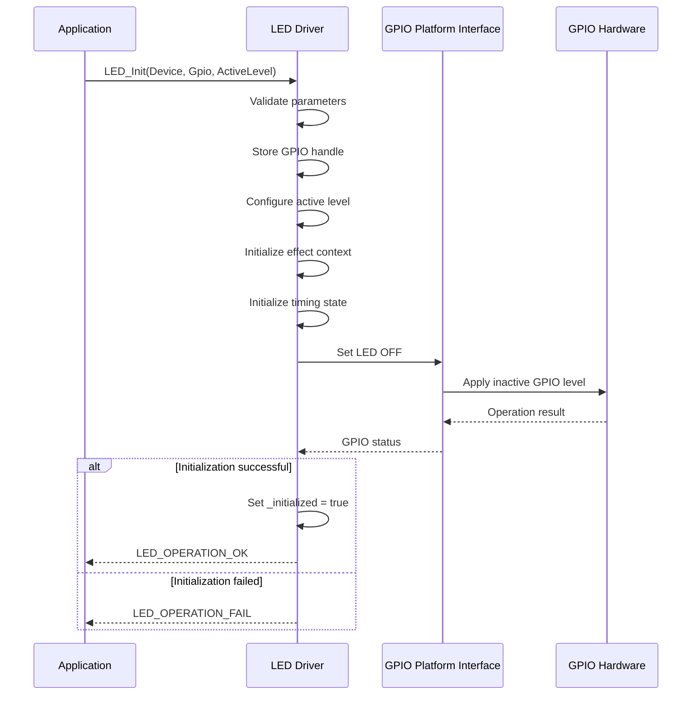
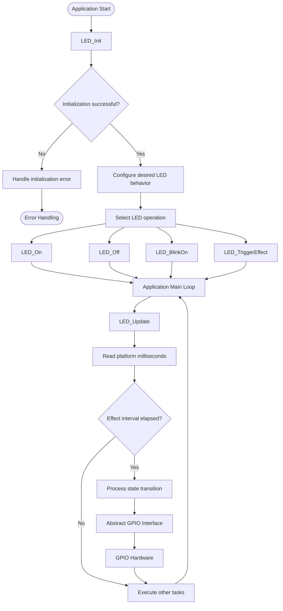
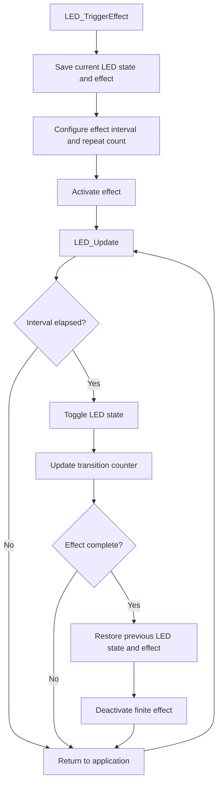
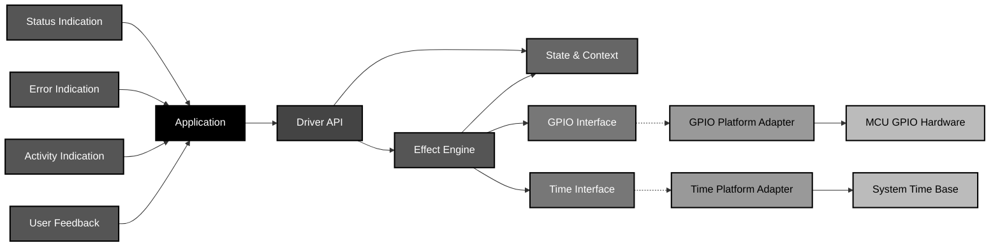

<h1 align="left">LED Driver</h1>

<p align="left">
  <big>
    Hardware-independent driver for controlling LEDs through a platform GPIO interface,<br>
    designed for portable embedded systems.
  </big>
</p>

---
## Table of Contents

* [1. Overview](#1-overview)
* [2. Features](#2-features)
* [3. Architecture](#3-architecture)

  * [3.1 Architectural Principles](#31-architectural-principles)
* [4. Directory Structure](#4-directory-structure)
* [5. Driver Responsibilities](#5-driver-responsibilities)
* [6. Dependencies](#6-dependencies)
* [7. Data Structures](#7-data-structures)

  * [7.1 LED Operation Status](#71-led-operation-status)
  * [7.2 LED Active Level](#72-led-active-level)
  * [7.3 LED Effect Type](#73-led-effect-type)
  * [7.4 LED State](#74-led-state)
  * [7.5 LED Effect Context](#75-led-effect-context)
  * [7.6 LED Driver Handle](#76-led-driver-handle)
* [8. API Reference](#8-api-reference)

  * [8.1 LED_Init](#81-led_init)
  * [8.2 LED_On](#82-led_on)
  * [8.3 LED_Off](#83-led_off)
  * [8.4 LED_BlinkOn](#84-led_blinkon)
  * [8.5 LED_BlinkOff](#85-led_blinkoff)
  * [8.6 LED_TriggerEffect](#86-led_triggereffect)
  * [8.7 LED_Update](#87-led_update)
  * [8.8 Effect Execution Model](#88-effect-execution-model)
  * [8.9 State Transitions](#89-state-transitions)
  * [8.10 State Descriptions](#810-state-descriptions)
  * [8.11 Effect Restoration Summary](#811-effect-restoration-summary)
  * [8.12 Quick Reference: API to State Mapping](#812-quick-reference-api-to-state-mapping)
  * [8.13 Non-Blocking Operation](#813-non-blocking-operation)
* [9. Operation Flow](#9-operation-flow)

  * [9.1 Initialization Flow](#91-initialization-flow)
  * [9.2 Application Runtime Flow](#92-application-runtime-flow)
  * [9.3 Finite Effect Flow](#93-finite-effect-flow)
* [10. Usage Example](#10-usage-example)
* [11. Design Decisions](#11-design-decisions)

  * [11.1 Hardware Abstraction Through Platform Interfaces](#111-hardware-abstraction-through-platform-interfaces)
  * [11.2 Logical LED State Abstraction](#112-logical-led-state-abstraction)
  * [11.3 Non-Blocking Effect Execution](#113-non-blocking-effect-execution)
  * [11.4 Application-Owned Scheduling](#114-application-owned-scheduling)
  * [11.5 Effect State Encapsulation](#115-effect-state-encapsulation)
  * [11.6 Temporary Effect Restoration](#116-temporary-effect-restoration)
  * [11.7 Millisecond-Based Timing](#117-millisecond-based-timing)
  * [11.8 Explicit Operation Status](#118-explicit-operation-status)
  * [11.9 Driver-Owned Runtime State](#119-driver-owned-runtime-state)
  * [11.10 Separation of Control and Execution](#1110-separation-of-control-and-execution)
* [12. Error Handling](#12-error-handling)

  * [12.1 General Failure Conditions](#121-general-failure-conditions)
  * [12.2 GPIO Errors](#122-gpio-errors)
  * [12.3 Effect Configuration Errors](#123-effect-configuration-errors)
  * [12.4 Error Information](#124-error-information)
* [13. Usage Constraints](#13-usage-constraints)

  * [13.1 Driver Initialization](#131-driver-initialization)
  * [13.2 Periodic LED_Update Execution](#132-periodic-led_update-execution)
  * [13.3 Timing Resolution](#133-timing-resolution)
  * [13.4 Blocking Behavior](#134-blocking-behavior)
  * [13.5 Effect Scheduling](#135-effect-scheduling)
  * [13.6 Direct LED Control During Effects](#136-direct-led-control-during-effects)
  * [13.7 Handle Ownership](#137-handle-ownership)
  * [13.8 Single-Instance State](#138-single-instance-state)
* [14. Applications](#14-applications)
* [15. Limitations](#15-limitations)
* [16. Future Improvements](#16-future-improvements)
* [17. License](#17-license)

---
## 1. Overview

- The driver abstracts the electrical characteristics of the LED, including active-high and active-low configurations, while providing a logical interface for direct LED control and non-blocking timed effects.

- The driver supports both static LED control and programmable effects, allowing LED behavior to be executed without blocking the application.

- Timed effects are processed through `LED_Update()`, which uses the platform millisecond time base to determine when LED state transitions shall occur.

- The driver is designed to isolate application-level LED control from the underlying GPIO implementation.

---

## 2. Features

* Hardware-independent LED control through a GPIO platform interface.
* Support for active-high and active-low LED configurations.
* Logical `ON` and `OFF` control independent of electrical polarity.
* Continuous non-blocking blink effect.
* Finite pulse effect.
* Finite flash effect.
* Effect restoration mechanism.
* Non-blocking effect execution.
* Millisecond-based timing.
* Explicit operation status reporting.
* Support for periodic execution through a main loop or RTOS task.
* Separation between application logic and GPIO hardware implementation.

---

## 3. Architecture

The LED Driver follows a layered architecture in which the application interacts only with the public LED API.

The driver does not directly depend on MCU-specific GPIO registers or HAL implementations. Instead, GPIO operations are provided through the platform GPIO abstraction.

```mermaid
flowchart LR
    APP[Application]

    API[Driver API]
    EFFECT[Effect Engine]
    STATE[LED State & Effect Context]
    GPIO_IF[GPIO Interface]
    TIME_IF[Time Interface]

    GPIO_ADAPTER[GPIO Platform Adapter]
    TIME_ADAPTER[Time Platform Adapter]

    GPIO_HW[Physical GPIO Hardware]
    TIME_HW[System Time Base]

    APP -->|"Logical LED operations"| API

    API -->|"Controls"| EFFECT
    API -->|"Direct state control"| STATE

    EFFECT -->|"Reads/Writes"| STATE
    EFFECT -->|"GPIO operations"| GPIO_IF
    EFFECT -->|"Timing operations"| TIME_IF

    GPIO_IF -.->|"Hardware abstraction"| GPIO_ADAPTER
    TIME_IF -.->|"Hardware abstraction"| TIME_ADAPTER

    GPIO_ADAPTER -->|"Physical control"| GPIO_HW
    TIME_ADAPTER -->|"Time reference"| TIME_HW

    style APP fill:#000,stroke:#000,stroke-width:2px,color:#fff
    style API fill:#555,stroke:#000,stroke-width:2px,color:#fff
    style EFFECT fill:#666,stroke:#000,stroke-width:2px,color:#fff
    style STATE fill:#777,stroke:#000,stroke-width:2px,color:#fff
    style GPIO_IF fill:#888,stroke:#000,stroke-width:2px,color:#fff
    style TIME_IF fill:#888,stroke:#000,stroke-width:2px,color:#fff
    style GPIO_ADAPTER fill:#999,stroke:#000,stroke-width:2px,color:#000
    style TIME_ADAPTER fill:#999,stroke:#000,stroke-width:2px,color:#000
    style GPIO_HW fill:#bbb,stroke:#000,stroke-width:2px,color:#000
    style TIME_HW fill:#bbb,stroke:#000,stroke-width:2px,color:#000
```


### 3.1 Architectural Principles

The architecture separates three main responsibilities:

| Layer               | Responsibility                                                                  |
| ------------------- | ------------------------------------------------------------------------------- |
| Application         | Requests LED behavior and periodically services the driver.                     |
| LED Driver          | Implements logical LED control, polarity abstraction and effect state machines. |
| Platform Interfaces | Provide hardware-specific GPIO and timing operations.                           |

This separation allows the underlying GPIO implementation to be replaced without modifying the LED driver or application-level LED control logic.

---

## 4. Directory Structure

A typical project integration follows the structure below:

```text
LED/
├── Inc/
│   └── Led_Driver.h
│
└── Src/
    └── Led_Driver.c
```

The exact directory organization may vary according to the project structure.

The LED Driver itself depends only on the platform interfaces and does not directly include MCU-specific GPIO or timer implementations.

---

## 5. Driver Responsibilities

The LED Driver is responsible for:

* Maintaining the logical LED state.
* Translating logical `ON` and `OFF` states into the configured electrical GPIO level.
* Managing active-high and active-low configurations.
* Managing the currently active LED effect.
* Maintaining effect timing information.
* Executing non-blocking LED effects.
* Restoring previous LED behavior after finite effects.
* Propagating GPIO operation failures to the application.
* Using the platform time abstraction for effect scheduling.

The driver is not responsible for:

* Configuring MCU clocks.
* Configuring GPIO hardware modes.
* Managing MCU-specific GPIO registers.
* Implementing the system time base.
* Scheduling `LED_Update()` execution.
* Deciding when an LED effect should be requested by the application.

---

## 6. Dependencies

The LED Driver depends on two platform abstractions:

```text
GPIO_Platform_Interface.h
Time_Platform_Interface.h
```

The GPIO interface provides the physical LED control operations used by the driver.

The LED Driver currently uses:

```c
PGPIO_Set()
PGPIO_Reset()
PGPIO_Toggle()
PGPIO_GetLevel()
```

These operations allow the driver to remain independent from the underlying MCU GPIO implementation.

GPIO initialization and configuration must be completed before the LED driver is initialized.

The LED Driver uses the platform millisecond time base through:

```c
Platform_GetMillis()
```

This time base is used to determine when timed LED state transitions shall occur.

The driver does not use blocking delays to execute LED effects.

---

## 7. Data Structures

### 7.1 LED Operation Status

`LED_OpStatusTypeDef` defines the result of a public LED driver operation.

```c
typedef enum
{
    LED_OPERATION_OK,
    LED_OPERATION_FAIL

} LED_OpStatusTypeDef;
```

| Status               | Description                       |
| -------------------- | --------------------------------- |
| `LED_OPERATION_OK`   | Operation completed successfully. |
| `LED_OPERATION_FAIL` | Operation could not be completed. |

### 7.2 LED Active Level

`LED_ActiveLevelTypeDef` defines the electrical GPIO level required to turn the LED on.

```c
typedef enum
{
    LED_ACTIVE_LOW  = 0U,
    LED_ACTIVE_HIGH = 1U

} LED_ActiveLevelTypeDef;
```

| Configuration     | LED ON    | LED OFF   |
| ----------------- | --------- | --------- |
| `LED_ACTIVE_LOW`  | GPIO LOW  | GPIO HIGH |
| `LED_ACTIVE_HIGH` | GPIO HIGH | GPIO LOW  |

This abstraction allows the application to use the same logical API regardless of the electrical polarity of the connected LED.

### 7.3 LED Effect Type

`LED_EffectTypeDef` defines the effects supported by the driver.

```c
typedef enum
{
    LED_EFFECT_STATIC,
    LED_EFFECT_BLINK,
    LED_EFFECT_PULSE,
    LED_EFFECT_FLASH

} LED_EffectTypeDef;
```

| Effect              | Description                                                                                 |
| ------------------- | ------------------------------------------------------------------------------------------- |
| `LED_EFFECT_STATIC` | No timed LED transitions are performed.                                                     |
| `LED_EFFECT_BLINK`  | Continuously toggles the LED at the configured interval.                                    |
| `LED_EFFECT_PULSE`  | Executes a finite sequence of LED state transitions.                                        |
| `LED_EFFECT_FLASH`  | Executes a finite sequence of transitions and restores the previous LED behavior and state. |

### 7.4 LED State

`LED_StateTypeDef` represents the logical state of the LED.

```c
typedef enum
{
    LED_STATE_ON,
    LED_STATE_OFF

} LED_StateTypeDef;
```

The logical state is independent of the physical GPIO level.

For example, when configured as active-low:

```text
Logical ON  -> GPIO LOW
Logical OFF -> GPIO HIGH
```

### 7.5 LED Effect Context

`LED_EffectContextTypeDef` stores internal information required to manage active and temporary effects.

```c
typedef struct
{
    LED_StateTypeDef  _return_led_state;
    LED_EffectTypeDef _current_effect;
    LED_EffectTypeDef _return_effect;

} LED_EffectContextTypeDef;
```

| Member              | Description                                           |
| ------------------- | ----------------------------------------------------- |
| `_return_led_state` | LED logical state to restore after a flash effect.    |
| `_current_effect`   | Currently active LED effect.                          |
| `_return_effect`    | Effect to restore after a temporary effect completes. |

This structure is private driver state and shall not be accessed or modified directly by the application.

### 7.6 LED Driver Handle

`LED_HandleTypeDef` represents one LED driver instance and contains its configuration and runtime state.

```c
typedef struct
{
    GPIO_HandleTypeDef      *_gpio;
    LED_StateTypeDef         _current_state;
    LED_ActiveLevelTypeDef   _active_level;
    LED_EffectContextTypeDef _effect_context;
    uint16_t                 _effect_repeat;
    uint16_t                 _effect_counter;
    uint32_t                 _last_update_time_ms;
    uint32_t                 _blink_time_interval_ms;
    uint32_t                 _effect_time_interval_ms;
    bool                     _effect_is_active;
    bool                     _initialized;

} LED_HandleTypeDef;
```

| Member                     | Description                                                      |
| -------------------------- | ---------------------------------------------------------------- |
| `_gpio`                    | Pointer to the platform GPIO handle associated with the LED.     |
| `_current_state`           | Current logical LED state.                                       |
| `_active_level`            | Electrical GPIO level that activates the LED.                    |
| `_effect_context`          | Internal effect management context.                              |
| `_effect_repeat`           | Number of complete effect cycles configured for a finite effect. |
| `_effect_counter`          | Remaining LED state transitions for the current finite effect.   |
| `_last_update_time_ms`     | Timestamp of the last effect update.                             |
| `_blink_time_interval_ms`  | Interval between consecutive blink transitions.                  |
| `_effect_time_interval_ms` | Interval between consecutive finite-effect transitions.          |
| `_effect_is_active`        | Indicates whether a flash effect is currently active.            |
| `_initialized`             | Indicates whether the LED driver instance has been initialized.  |

All members of `LED_HandleTypeDef` are internal driver state and shall not be modified directly by the application.

---

## 8. API Reference

### 8.1 LED_Init

- Initializes an LED driver instance.

#### Function Signature
```c
LED_OpStatusTypeDef LED_Init(
    LED_HandleTypeDef* Device,
    GPIO_HandleTypeDef* Gpio,
    LED_ActiveLevelTypeDef ActiveLevel
);
```
#### Parameters

| Parameter     | Description                                     |
| ------------- | ----------------------------------------------- |
| `Device`      | Pointer to the LED driver handle.               |
| `Gpio`        | Pointer to the configured GPIO platform handle. |
| `ActiveLevel` | Electrical GPIO level that activates the LED.   |

#### Return
| Return Value         | Description                                  |
| -------------------- | -------------------------------------------- |
| `LED_OPERATION_OK`   | Driver successfully initialized.             |
| `LED_OPERATION_FAIL` | Invalid parameter or initialization failure. |

**Note:**
- The GPIO platform interface shall be configured for output operation before calling `LED_Init()`.
- The driver initializes its internal effect state and establishes the LED output in the OFF state.

### 8.2 LED_On

- Turns the LED on.

#### Function Signature
```c
LED_OpStatusTypeDef LED_On(
    LED_HandleTypeDef* Device
);
```
#### Parameters
| Parameter | Description                                   |
| --------- | --------------------------------------------- |
| `Device`  | Pointer to the initialized LED driver handle. |

#### Return
| Return Value         | Description                                  |
| -------------------- | -------------------------------------------- |
| `LED_OPERATION_OK`   | Driver operation ok.                         |
| `LED_OPERATION_FAIL` | Invalid parameter or not handle not initialized. |

The physical GPIO level is determined by the active-level configuration.

For an active-high LED:

```text
LED_ON -> GPIO HIGH
```

For an active-low LED:

```text
LED_ON -> GPIO LOW
```

**Note:**
- Calling `LED_On()` does not necessarily cancel a previously configured timed effect. A subsequent `LED_Update()` may modify the LED state if an effect remains active.

### 8.3 LED_Off

- Turns the LED off.

#### Function Signature
```c
LED_OpStatusTypeDef LED_Off(
    LED_HandleTypeDef* Device
);
```
#### Parameters
| Parameter | Description                                   |
| --------- | --------------------------------------------- |
| `Device`  | Pointer to the initialized LED driver handle. |

#### Return
| Return Value         | Description                                  |
| -------------------- | -------------------------------------------- |
| `LED_OPERATION_OK`   | Driver operation ok.                         |
| `LED_OPERATION_FAIL` | Invalid parameter or not handle not initialized. |

The physical GPIO level is automatically selected according to the configured active level.

**Note:**
- Calling `LED_Off()` does not necessarily cancel a previously configured timed effect.

### 8.4 LED_BlinkOn

- Enables continuous LED blinking.

#### Function Signature
```c
LED_OpStatusTypeDef LED_BlinkOn(
    LED_HandleTypeDef* Device,
    uint32_t BlinkTimeMs
);
```
#### Parameters
| Parameter     | Description                                                              |
| ------------- | ------------------------------------------------------------------------ |
| `Device`      | Pointer to the initialized LED driver handle.                            |
| `BlinkTimeMs` | Time interval between consecutive LED state transitions in milliseconds. |

#### Return
| Return Value         | Description                                  |
| -------------------- | -------------------------------------------- |
| `LED_OPERATION_OK`   | Driver operation ok.                         |
| `LED_OPERATION_FAIL` | Invalid parameter or not handle not initialized. |

The function configures the blink effect but does not block the caller.

**Note:**
- The actual LED transitions are performed by `LED_Update()`.

### 8.5 LED_BlinkOff

- Disables the continuous blink effect.

#### Function Signature
```c
LED_OpStatusTypeDef LED_BlinkOff(
    LED_HandleTypeDef* Device
);
```
#### Return
| Return Value         | Description                                  |
| -------------------- | -------------------------------------------- |
| `LED_OPERATION_OK`   | Driver operation ok.                         |
| `LED_OPERATION_FAIL` | Invalid parameter or not handle not initialized. |

The function changes the current effect to `LED_EFFECT_STATIC`.

**Note:**
- The current physical LED state is not modified by `LED_BlinkOff()`.

### 8.6 LED_TriggerEffect

- Triggers a finite LED effect.

#### Function Signature
```c
LED_OpStatusTypeDef LED_TriggerEffect(
    LED_HandleTypeDef* Device,
    LED_EffectTypeDef Effect,
    uint32_t Interval,
    uint16_t Repeats
);
```
#### Parameters
| Parameter  | Description                                                          |
| ---------- | -------------------------------------------------------------------- |
| `Device`   | Pointer to the initialized LED driver handle.                        |
| `Effect`   | LED effect to activate.                                              |
| `Interval` | Time interval between consecutive state transitions in milliseconds. |
| `Repeats`  | Number of complete effect cycles.                                    |

#### Return
| Return Value         | Description                                  |
| -------------------- | -------------------------------------------- |
| `LED_OPERATION_OK`   | Driver operation ok.                         |
| `LED_OPERATION_FAIL` | Invalid parameter or not handle not initialized. |

Each complete finite effect cycle consists of two LED state transitions.

Therefore:

```text
Effect transitions = Repeats × 2
```

The `LED_EFFECT_PULSE` effect is internally forced to one repetition regardless of the `Repeats` parameter.

Before triggering a finite effect, the driver stores:

* The current LED state.
* The currently active effect.

These values are used to restore the previous LED behavior when the temporary effect completes.

### 8.7 LED_Update

- Processes the currently active LED effect.

#### Function Signature
```c
LED_OpStatusTypeDef LED_Update(
    LED_HandleTypeDef* Device
);
```
#### Return
| Return Value         | Description                                  |
| -------------------- | -------------------------------------------- |
| `LED_OPERATION_OK`   | Driver operation ok.                         |
| `LED_OPERATION_FAIL` | Invalid parameter or not handle not initialized. |

`LED_Update()` is the execution engine for timed effects.

It shall be called periodically by the application while a timed effect is active.

Typical execution contexts include:

```text
Main loop
Periodic task
RTOS task
Timer-driven scheduler
```
**Note:**
- The function does not use blocking delays.
- The driver compares the current platform time with the last effect update timestamp and performs the required LED transition when the configured interval has elapsed.

### 8.8 Effect Execution Model

The LED Driver uses a time-driven effect model.

### 8.9 State Transitions

| From State | To State | Triggering Action | Description |
| :--- | :--- | :--- | :--- |
| **OFF** | ON | `LED_On()` | Turns LED ON and restores previous effect. |
| **ON** | OFF | `LED_Off()` | Turns LED OFF and saves current effect. |
| **ON** | STATIC | `LED_BlinkOff()` | Disables blink, LED remains in current state. |
| **ON** | BLINK | `LED_BlinkOn()` | Enables continuous blink effect. |
| **ON** | PULSE | `LED_TriggerEffect(PULSE)` | Triggers one complete ON/OFF cycle. |
| **ON** | FLASH | `LED_TriggerEffect(FLASH)` | Triggers configurable repetitions. |
| **STATIC** | BLINK | `LED_BlinkOn()` | Enables continuous blink effect. |
| **STATIC** | PULSE | `LED_TriggerEffect(PULSE)` | Triggers one complete ON/OFF cycle. |
| **STATIC** | FLASH | `LED_TriggerEffect(FLASH)` | Triggers configurable repetitions. |
| **BLINK** | STATIC | `LED_BlinkOff()` | Disables blink, returns to static mode. |
| **BLINK** | PULSE | `LED_TriggerEffect(PULSE)` | Triggers one complete ON/OFF cycle. |
| **BLINK** | FLASH | `LED_TriggerEffect(FLASH)` | Triggers configurable repetitions. |
| **PULSE** | STATIC | Effect Complete | Restores previous effect. |
| **PULSE** | BLINK | Effect Complete | Restores previous blink effect. |
| **FLASH** | STATIC | Effect Complete | Restores previous state and effect. |
| **FLASH** | BLINK | Effect Complete | Restores previous blink effect and state. |

### 8.10 State Descriptions

| State | Description |
| :--- | :--- |
| **OFF** | LED is physically OFF. Effect state is saved for later restoration. |
| **ON** | LED is physically ON. May be in static or effect mode. |
| **STATIC** | LED maintains current commanded state (ON or OFF). No timed transitions. |
| **BLINK** | Continuously toggles LED at configured interval. Runs indefinitely until stopped. |
| **PULSE** | Executes one complete ON/OFF cycle. Finite effect with automatic restoration. |
| **FLASH** | Executes configurable number of ON/OFF cycles. Finite effect with restoration. |

### 8.11 Effect Restoration Summary

| Finite Effect | Transitions | Restoration Behavior |
| :--- | :--- | :--- |
| **PULSE** | 2 transitions (ON→OFF) | Restores previous effect only. |
| **FLASH** | 2 × Repeats transitions | Restores previous effect AND previous LED state. |

### 8.12 Quick Reference: API to State Mapping

| API Function | Effect | Duration | Restoration |
| :--- | :--- | :--- | :--- |
| `LED_On()` | - | Indefinite | Restores previous effect |
| `LED_Off()` | - | Indefinite | Saves current effect |
| `LED_BlinkOn()` | BLINK | Indefinite | None |
| `LED_BlinkOff()` | STATIC | Indefinite | None |
| `LED_TriggerEffect(PULSE)` | PULSE | 1 cycle | Restores previous effect |
| `LED_TriggerEffect(FLASH)` | FLASH | N cycles | Restores previous effect + state |

The actual effect progression is driven by repeated calls to `LED_Update()` rather than by blocking delays.

### 8.13 Non-Blocking Operation

Timed effects are configured by the application and executed asynchronously from the application's perspective.

For example:

```c
LED_BlinkOn(&StatusLed, 500U);

while (1)
{
    LED_Update(&StatusLed);

    Application_Process();
}
```

The application remains free to perform other work between calls to `LED_Update()`.

The driver does not internally wait for the configured interval.

Instead, it evaluates:

```text
Current Time - Last Update Time >= Effect Interval
```

and performs a transition only when the interval has elapsed.

---

## 9. Operation Flow

### 9.1 Initialization Flow

The LED Driver must be initialized before any LED operation is performed.

The initialization flow establishes the GPIO association, active electrical level and internal runtime state of the LED instance.



After successful initialization, the LED instance is ready to receive logical control commands and timed effects.

### 9.2 Application Runtime Flow

The application interacts with the LED Driver through logical operations while `LED_Update()` is periodically executed to process timed effects.



The important characteristic of this flow is that `LED_Update()` does not wait for the configured interval.

Instead, the driver periodically evaluates the elapsed time and performs a state transition only when the required interval has elapsed.

This allows the application to continue executing other tasks between LED updates.

### 9.3 Finite Effect Flow

Finite effects such as `LED_EFFECT_PULSE` and `LED_EFFECT_FLASH` maintain internal effect state and transition counters until the configured number of cycles has been completed.



This mechanism allows a temporary effect to execute without permanently replacing the LED behavior that was active before the effect was triggered.

---

## 10. Usage Example

A typical application can initialize an LED and execute a non-blocking blink effect as follows:

```c
LED_HandleTypeDef StatusLed;

LED_Init(
    &StatusLed,
    &StatusLedGpio,
    LED_ACTIVE_LOW
);

LED_BlinkOn(
    &StatusLed,
    500U
);

while (1)
{
    LED_Update(&StatusLed);

    Application_Process();
}
```
The application requests a 500 ms blink interval, while the LED Driver handles the GPIO transitions internally through the platform abstraction.

---
## 11. Design Decisions

### 11.1 Hardware Abstraction Through Platform Interfaces

The LED Driver does not directly access MCU-specific GPIO registers or hardware abstraction layers.

GPIO operations are performed through the platform GPIO interface.

This decision isolates the LED logic from the underlying microcontroller implementation and allows the GPIO adapter to be replaced without modifying the driver.

### 11.2 Logical LED State Abstraction

The driver exposes logical `LED_STATE_ON` and `LED_STATE_OFF` states instead of exposing physical GPIO levels.

The configured `LED_ActiveLevelTypeDef` determines how these logical states are translated into electrical GPIO levels.

This allows active-high and active-low LEDs to use the same application-level API.

### 11.3 Non-Blocking Effect Execution

LED effects are implemented using timestamp-based scheduling instead of blocking delays.

The driver compares the current platform time against the timestamp of the previous update.

```text
Current Time - Last Update Time >= Effect Interval
```

This allows LED effects to execute concurrently with other application tasks.

### 11.4 Application-Owned Scheduling

The driver does not create its own execution context.

The application is responsible for periodically calling `LED_Update()`.

This keeps the driver independent of the execution environment and allows it to be integrated into:

* Super-loop architectures.
* Periodic RTOS tasks.
* Cooperative schedulers.
* Timer-driven application frameworks.

### 11.5 Effect State Encapsulation

Effect state is maintained internally through `LED_EffectContextTypeDef` and the private members of `LED_HandleTypeDef`.

The application does not manipulate effect counters, timestamps or restoration state directly.

This prevents application code from creating inconsistent internal effect states.

### 11.6 Temporary Effect Restoration

Finite effects preserve the LED state and effect that were active before the temporary effect was triggered.

When the finite effect completes, the driver restores the previous behavior.

This allows temporary indications such as flashes or pulses to be introduced without requiring the application to manually reconstruct the previous LED configuration.

### 11.7 Millisecond-Based Timing

The driver uses the platform millisecond time base for effect scheduling.

This provides a simple and portable timing abstraction while avoiding direct dependencies on MCU timers.

The timing source can therefore be replaced independently from the LED driver implementation.

### 11.8 Explicit Operation Status

Public API functions return `LED_OpStatusTypeDef`.

This allows the application to detect failures originating from parameter validation, initialization state or the underlying GPIO platform interface.

The driver intentionally keeps the public status model simple:

```text
LED_OPERATION_OK
LED_OPERATION_FAIL
```

Detailed hardware-specific errors remain encapsulated within the platform layer.

### 11.9 Driver-Owned Runtime State

The `LED_HandleTypeDef` contains the runtime state associated with an LED instance.

This includes:

* Current logical state.
* Active electrical polarity.
* Current effect.
* Previous effect.
* Effect counters.
* Effect timing.
* Initialization state.

Keeping this information in the device handle allows the driver to maintain independent state for each LED instance.

### 11.10 Separation of Control and Execution

The public API separates **requesting an LED behavior** from **executing timed behavior**.

Functions such as:

```text
LED_BlinkOn()
LED_TriggerEffect()
```

configure the desired behavior.

`LED_Update()` executes the configured timed behavior.

This separation prevents effect configuration functions from becoming blocking operations and keeps the driver's execution model deterministic.

---
## 12. Error Handling

The LED Driver uses `LED_OpStatusTypeDef` for operation status reporting.

### 12.1 General Failure Conditions

`LED_OPERATION_FAIL` may be returned when:

* `Device` is `NULL`.
* The driver has not been initialized.
* The GPIO handle is invalid during initialization.
* The active-level configuration is invalid.
* The GPIO platform operation fails.
* An unsupported effect value is requested.

The driver validates the initialization state before executing public operations.

### 12.2 GPIO Errors

The LED Driver propagates failures returned by the GPIO platform interface.

For example, if a GPIO operation fails during `LED_On()`:

```text
LED_On()
    |
    v
PGPIO_Set()/PGPIO_Reset()
    |
    v
GPIO_OPERATION_FAIL
    |
    v
LED_OPERATION_FAIL
```

This prevents the application from assuming that the requested LED state was successfully applied.

### 12.3 Effect Configuration Errors

`LED_TriggerEffect()` returns `LED_OPERATION_FAIL` if:

* The device is invalid.
* The driver is not initialized.
* The requested effect cannot be selected.

The effect configuration itself is maintained internally by the driver.

### 12.4 Error Information

The current driver provides a binary operation status:

```text
LED_OPERATION_OK
LED_OPERATION_FAIL
```

No extended error code or failure-reason enumeration is currently exposed.

Consequently, the application can determine whether an operation succeeded but cannot determine the exact underlying failure reason through the public API.

---

## 13. Usage Constraints

### 13.1 Driver Initialization

`LED_Init()` shall be called before any other LED operation.

The supplied GPIO interface must already be configured as an output.

```text
GPIO Configuration
       |
       v
LED_Init()
       |
       v
LED Operations
```

### 13.2 Periodic LED_Update Execution

`LED_Update()` must be called periodically while a timed effect is active.

Failure to call `LED_Update()` prevents the driver from processing elapsed effect intervals.

The driver does not create its own task, timer interrupt or scheduler.

The application owns the execution context of `LED_Update()`.

### 13.3 Timing Resolution

LED effects use the platform millisecond time base.

Therefore, effect timing resolution is limited by:

```c
Platform_GetMillis()
```

and by the frequency at which the application calls `LED_Update()`.

For example, configuring a 100 ms effect interval does not guarantee a transition exactly at 100 ms if `LED_Update()` is executed less frequently.

### 13.4 Blocking Behavior

The LED Driver does not use blocking delays to implement LED effects.

Timed transitions are evaluated using timestamps and executed only when the configured interval has elapsed.

This allows the driver to be used in cooperative main loops and periodic RTOS tasks.

### 13.5 Effect Scheduling

Only one effect is represented as the current active effect in each `LED_HandleTypeDef`.

Triggering a new finite effect replaces the currently active effect context and stores the previous behavior for restoration.

Applications should therefore treat effect triggering as a replacement of the current effect rather than as a queue of independent LED effects.

### 13.6 Direct LED Control During Effects

`LED_On()` and `LED_Off()` directly modify the LED state but do not necessarily terminate an active timed effect.

If an effect remains active, a subsequent call to `LED_Update()` may change the LED state again.

Applications that require permanent static control should explicitly disable the active effect before applying the desired static state.

For example:

```c
LED_BlinkOff(&StatusLed);
LED_Off(&StatusLed);
```

### 13.7 Handle Ownership

The `LED_HandleTypeDef` must remain valid for the entire lifetime of the LED driver instance.

The application shall not modify the internal handle members directly.

### 13.8 Single-Instance State

The driver maintains runtime state inside `LED_HandleTypeDef`, allowing the logical state and effect context to be associated with a specific LED instance.

Each physical LED should therefore have its own handle:

```text
LED_HandleTypeDef StatusLed;
LED_HandleTypeDef ErrorLed;
LED_HandleTypeDef ActivityLed;
```

---

## 14. Applications

The LED Driver is suitable for embedded applications where LEDs are used as status indicators, diagnostic indicators or simple human-machine interface elements.

Typical applications include:

* System status indication.
* Error and fault indication.
* Communication activity indication.
* Initialization and boot status.
* User interaction feedback.
* Warning indicators.
* Automotive ECU status indication.
* Electronic lock status indication.
* Industrial control systems.
* Embedded diagnostic interfaces.

The hardware-independent architecture allows the same application-level LED logic to remain unchanged when the underlying GPIO implementation changes.



The important architectural property is that the application depends on the **logical LED API**, not on the MCU GPIO implementation.

The GPIO platform adapter can therefore be replaced without changing the LED effect engine or application logic.

---

## 15. Limitations

The current implementation has the following limitations:

* Only one active effect is maintained per LED instance.
* Effects are time-driven and depend on periodic calls to `LED_Update()`.
* Timing resolution is limited to the platform millisecond time base.
* No effect queue is provided.
* No effect priority mechanism is provided.
* No callback/event notification mechanism is provided when an effect completes.
* Error reporting is limited to `LED_OPERATION_OK` and `LED_OPERATION_FAIL`.
* The application is responsible for scheduling `LED_Update()`.
* The current public API does not provide a direct getter for the logical LED state.
* The current public API does not provide a direct getter for the active effect.
* The current implementation does not provide configurable effect waveforms beyond static, blink, pulse and flash.

---

## 16. Future Improvements

Potential future extensions include:

* Additional programmable LED effects.
* Effect sequencing and queues.
* Effect completion callbacks.
* Effect priority handling.
* Runtime effect cancellation.
* Configurable transition patterns.
* State and effect getter APIs.
* More detailed error reporting.
* Optional RTOS-aware scheduling.
* Independent timing sources for multiple effects.
* Improved multi-instance and effect-management capabilities.

These extensions can be introduced without changing the underlying GPIO abstraction.

---
## 17. License

This module is part of the:

```text
Electronic Lock Project
```

and follows the project's license terms.
