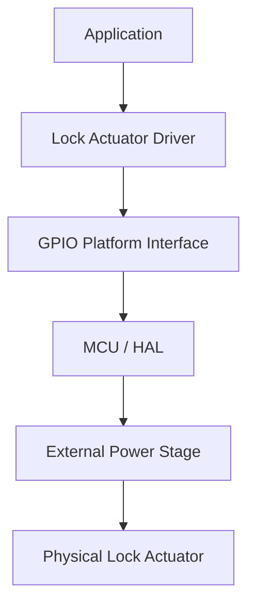
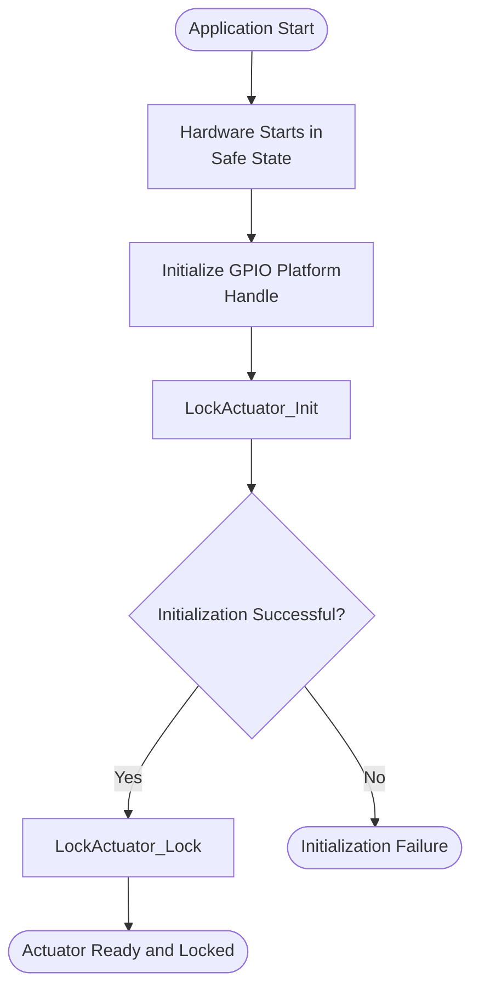
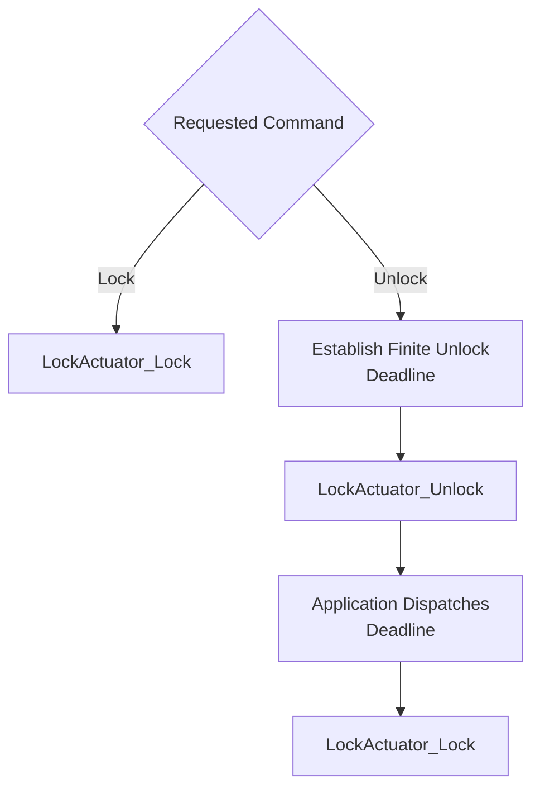

<h1 align="left">Lock Actuator Driver</h1>

<p align="left">
  <big>
    Hardware-independent driver for controlling a digital lock actuator,<br>
    designed for portable embedded systems.
  </big>
</p>

---

## Table of Contents

* [1. Overview](#1-overview)
* [2. Features](#2-features)
* [3. Architecture](#3-architecture)
* [4. Directory Structure](#4-directory-structure)
* [5. Device Overview](#5-device-overview)
* [6. Driver Responsibilities](#6-driver-responsibilities)
* [7. Dependencies](#7-dependencies)
* [8. Data Structures](#8-data-structures)

  * [8.1 Lock Actuator Handle](#81-lock-actuator-handle)
  * [8.2 Operation Status](#82-operation-status)
  * [8.3 Active Level](#83-active-level)
  * [8.4 Actuator State](#84-actuator-state)
* [9. API Reference](#9-api-reference)

  * [9.1 LockActuator_Init](#91-lockactuator_init)
  * [9.2 LockActuator_Lock](#92-lockactuator_lock)
  * [9.3 LockActuator_Unlock](#93-lockactuator_unlock)
  * [9.4 LockActuator_GetState](#94-lockactuator_getstate)
* [10. Operation Flow](#10-operation-flow)

  * [10.1 Initialization Flow](#101-initialization-flow)
  * [10.2 Command Flow](#102-command-flow)
* [11. Usage Example](#11-usage-example)
* [12. Design Decisions](#12-design-decisions)

  * [12.1 Hardware Abstraction](#121-hardware-abstraction)
  * [12.2 Polarity Normalization](#122-polarity-normalization)
  * [12.3 Handle-Based Architecture](#123-handle-based-architecture)
  * [12.4 Separation of Command and Mechanical Feedback](#124-separation-of-command-and-mechanical-feedback)
* [13. Error Handling](#13-error-handling)
* [14. Usage Constraints](#14-usage-constraints)
* [15. Applications](#15-applications)
* [16. Limitations](#16-limitations)
* [17. License](#17-license)

---

## 1. Overview

- The driver provides an abstraction layer for commanding a digital lock actuator through the GPIO Platform Interface.
- The driver exposes logical lock and unlock operations independently from the electrical GPIO polarity.
- The electrical level representing the locked command is selected during initialization.
- The driver can read the GPIO level and report the corresponding logical command state.

The reported state represents the electrical command at the GPIO. It does not confirm that the physical lock mechanism reached the requested position.

---

## 2. Features

- Lock actuator instance initialization.
- Logical lock command.
- Logical unlock command.
- Configurable active-high or active-low locked command.
- GPIO command-state reading.
- GPIO hardware abstraction.
- Handle-based device management.
- Operation status reporting.
- No dynamic memory allocation.
- Separation between logical actuator control and hardware-specific GPIO access.

---

## 3. Architecture

The driver follows a layered architecture where lock actuator behavior is isolated from the MCU-specific GPIO implementation.

The driver does not access MCU GPIO registers directly. All GPIO operations are performed through the GPIO Platform Interface.



This architecture allows:

- Replacing the underlying GPIO implementation without modifying the driver.
- Reusing the driver across different microcontrollers.
- Supporting different electrical command polarities.
- Keeping external power-stage details outside the component driver.
- Keeping application safety timing outside the low-level actuator interface.

---

## 4. Directory Structure

```text
LockActuator/
|
├── Inc/
│   └── LockActuator_Driver.h
|
├── Src/
│   └── LockActuator_Driver.c
|
└── README.md
```

---

## 5. Device Overview

The lock actuator is controlled through a digital GPIO connected to an external control or power stage.

The `Level` parameter supplied to `LockActuator_Init()` defines the electrical level representing the **locked command**.

| Configured Active Level | `LockActuator_Lock()` | `LockActuator_Unlock()` |
|---|---|---|
| `LOCK_ACTUATOR_ACTIVE_LEVEL_LOW` | Drives GPIO LOW | Drives GPIO HIGH |
| `LOCK_ACTUATOR_ACTIVE_LEVEL_HIGH` | Drives GPIO HIGH | Drives GPIO LOW |

`LockActuator_GetState()` uses the same polarity mapping:

| GPIO Readback | Logical State |
|---|---|
| Matches the configured locked level | `LOCK_ACTUATOR_STATE_LOCKED` |
| Matches the inverse level | `LOCK_ACTUATOR_STATE_UNLOCKED` |

The state returned by the driver is command readback only. It does not confirm:

- Solenoid or motor current.
- Relay contact position.
- Bolt position.
- Door position.
- Successful mechanical locking or unlocking.

The external circuit shall provide the required power handling and electrical protection.

---

## 6. Driver Responsibilities

The driver is responsible for:

- Managing lock actuator device instances.
- Storing the GPIO Platform handle.
- Storing the configured locked-command active level.
- Maintaining the driver initialization state.
- Driving the GPIO to the locked-command level.
- Driving the GPIO to the unlocked-command level.
- Reading and normalizing the GPIO command state.
- Propagating GPIO write failures.

The driver is **not responsible** for:

- Configuring the MCU GPIO peripheral.
- Initializing the GPIO Platform handle.
- Driving an inductive load directly.
- Configuring or protecting the external power stage.
- Limiting the unlock duration.
- Scheduling automatic relocking.
- Confirming mechanical bolt or door position.
- Detecting jams, overcurrent or actuator travel failure.
- Applying access-control policy.

---

## 7. Dependencies

The driver depends on:

```text
GPIO_Platform_Interface.h
```

The driver communicates with the GPIO hardware exclusively through the GPIO Platform Interface.

The driver does not need to know:

- The MCU GPIO port implementation.
- The vendor HAL type used for the port.
- The external transistor, MOSFET, relay or motor driver.
- The actuator voltage or current requirements.
- The mechanism used to enforce the application unlock timeout.

The `GPIO_Handle_t` passed to `LockActuator_Init()` is owned by the caller. It must remain valid while the lock actuator driver instance is in use.

---

## 8. Data Structures

### 8.1 Lock Actuator Handle

The driver uses `LockActuator_Handle_t` to represent a lock actuator device instance.

```c
typedef struct
{
    GPIO_Handle_t*             _gpio;
    LockActuator_ActiveLevel_t _active_level;
    bool                       _initialized;

} LockActuator_Handle_t;
```

The handle stores the GPIO Platform context, the configured electrical level for the locked command and the internal initialization state of the actuator.

| Member | Description |
|---|---|
| `_gpio` | Pointer to the GPIO Platform handle used to control the actuator. |
| `_active_level` | Electrical GPIO level representing the locked command. |
| `_initialized` | Internal initialization state of the lock actuator driver. |

The members of `LockActuator_Handle_t` are considered private data and shall not be accessed or modified directly by the application.

The application shall interact with the lock actuator through the public driver API.

### 8.2 Operation Status

The driver uses `LockActuator_OpStatus_t` to report the result of initialization and GPIO write operations.

```c
typedef enum
{
    LOCK_ACTUATOR_OPERATION_OK,
    LOCK_ACTUATOR_OPERATION_FAIL

} LockActuator_OpStatus_t;
```

| Status | Description |
|---|---|
| `LOCK_ACTUATOR_OPERATION_OK` | Operation completed successfully. |
| `LOCK_ACTUATOR_OPERATION_FAIL` | Operation could not be completed. |

### 8.3 Active Level

The driver uses `LockActuator_ActiveLevel_t` to define which electrical GPIO level represents the locked command.

```c
typedef enum
{
    LOCK_ACTUATOR_ACTIVE_LEVEL_HIGH,
    LOCK_ACTUATOR_ACTIVE_LEVEL_LOW

} LockActuator_ActiveLevel_t;
```

| Active Level | Description |
|---|---|
| `LOCK_ACTUATOR_ACTIVE_LEVEL_HIGH` | GPIO HIGH represents the locked command. |
| `LOCK_ACTUATOR_ACTIVE_LEVEL_LOW` | GPIO LOW represents the locked command. |

The unlocked command always uses the inverse electrical level.

### 8.4 Actuator State

The driver uses `LockActuator_State_t` to report the logical command represented by the GPIO readback.

```c
typedef enum
{
    LOCK_ACTUATOR_STATE_LOCKED,
    LOCK_ACTUATOR_STATE_UNLOCKED,
    LOCK_ACTUATOR_STATE_UNKNOWN

} LockActuator_State_t;
```

| State | Description |
|---|---|
| `LOCK_ACTUATOR_STATE_LOCKED` | GPIO readback matches the configured locked level. |
| `LOCK_ACTUATOR_STATE_UNLOCKED` | GPIO readback matches the inverse level. |
| `LOCK_ACTUATOR_STATE_UNKNOWN` | Reserved for a command state that cannot be determined. |

These values describe the electrical command and do not confirm mechanical lock position.

---

## 9. API Reference

### 9.1 LockActuator_Init

- Initializes a lock actuator device instance and associates it with a GPIO Platform context and locked-command level.

#### Function Signature

```c
LockActuator_OpStatus_t LockActuator_Init(
    LockActuator_Handle_t*     Device,
    GPIO_Handle_t*             Context,
    LockActuator_ActiveLevel_t Level
);
```

#### Parameters

| Parameter | Description |
|---|---|
| `Device` | Pointer to the lock actuator device handle. |
| `Context` | Pointer to the GPIO Platform handle used to control the actuator. |
| `Level` | Electrical GPIO level representing the locked command. |

#### Return

| Return Value | Description |
|---|---|
| `LOCK_ACTUATOR_OPERATION_OK` | Lock actuator initialized successfully. |
| `LOCK_ACTUATOR_OPERATION_FAIL` | A pointer is `NULL` or `Level` is invalid. |

**Notes:**

- The GPIO Platform handle must be valid and initialized before actuator operations.
- This function stores the GPIO handle but does not call `PGPIO_Init()`.
- This function does not change the GPIO output level.
- Call `LockActuator_Lock()` explicitly when initialization must assert the locked command.

### 9.2 LockActuator_Lock

- Drives the GPIO to the configured locked-command level.

#### Function Signature

```c
LockActuator_OpStatus_t LockActuator_Lock(
    LockActuator_Handle_t* Device
);
```

#### Parameters

| Parameter | Description |
|---|---|
| `Device` | Pointer to an initialized lock actuator device handle. |

#### Return

| Return Value | Description |
|---|---|
| `LOCK_ACTUATOR_OPERATION_OK` | Locked command written successfully. |
| `LOCK_ACTUATOR_OPERATION_FAIL` | Driver validation or the GPIO write failed. |

**Note:**

- Successful GPIO writing does not confirm that the physical lock is mechanically locked.

### 9.3 LockActuator_Unlock

- Drives the GPIO to the inverse of the configured locked-command level.

#### Function Signature

```c
LockActuator_OpStatus_t LockActuator_Unlock(
    LockActuator_Handle_t* Device
);
```

#### Parameters

| Parameter | Description |
|---|---|
| `Device` | Pointer to an initialized lock actuator device handle. |

#### Return

| Return Value | Description |
|---|---|
| `LOCK_ACTUATOR_OPERATION_OK` | Unlocked command written successfully. |
| `LOCK_ACTUATOR_OPERATION_FAIL` | Driver validation or the GPIO write failed. |

**Notes:**

- The function does not establish or enforce an unlock timeout.
- The application shall guarantee a bounded unlock interval and safe relock path.
- Successful GPIO writing does not confirm mechanical unlocking.

### 9.4 LockActuator_GetState

- Reads the GPIO and returns the corresponding logical command state.

#### Function Signature

```c
LockActuator_State_t LockActuator_GetState(
    LockActuator_Handle_t* Device
);
```

#### Parameters

| Parameter | Description |
|---|---|
| `Device` | Pointer to an initialized lock actuator device handle. |

#### Return

| Return Value | Description |
|---|---|
| `LOCK_ACTUATOR_STATE_LOCKED` | GPIO readback matches the configured locked level. |
| `LOCK_ACTUATOR_STATE_UNLOCKED` | GPIO readback matches the inverse level. |

**Notes:**

- `Device` and its GPIO Platform context must be valid and initialized.
- `LOCK_ACTUATOR_STATE_UNKNOWN` is reserved but is not produced by the current implementation.
- GPIO readback is not independent mechanical feedback.

---

## 10. Operation Flow

### 10.1 Initialization Flow

The typical initialization sequence is:



The physical output shall already have a safe reset state before firmware initialization.

### 10.2 Command Flow



The deadline is owned and enforced by the application, not by this driver.

---

## 11. Usage Example

The following example demonstrates an active-low locked command.

```c
#include "LockActuator_Driver.h"

static GPIO_Handle_t        LockActuatorGpio;
static LockActuator_Handle_t LockActuator;

bool LockActuatorExample_Init(void* GPIO_Port, uint16_t GPIO_Pin)
{
    if(PGPIO_Init(
            &LockActuatorGpio,
            GPIO_Port,
            GPIO_Pin
        )!= GPIO_OPERATION_OK)
    {
        return false;
    }

    if(LockActuator_Init(
            &LockActuator,
            &LockActuatorGpio,
            LOCK_ACTUATOR_ACTIVE_LEVEL_LOW
        )!= LOCK_ACTUATOR_OPERATION_OK)
    {
        return false;
    }

    return LockActuator_Lock(
               &LockActuator
           )== LOCK_ACTUATOR_OPERATION_OK;
}

bool LockActuatorExample_Unlock(void)
{
    /* Establish a finite application deadline before this request. */
    return LockActuator_Unlock(
               &LockActuator
           )== LOCK_ACTUATOR_OPERATION_OK;
}

void LockActuatorExample_OnUnlockTimeout(void)
{
    (void)LockActuator_Lock(&LockActuator);
}
```

The GPIO port, pin and output configuration depend on the target board and external actuator circuit.

For this project, PB8 LOW is the current safe locked request. App Core binds PB8
to a Platform GPIO descriptor and initializes this component with
`LOCK_ACTUATOR_ACTIVE_LEVEL_LOW`. Driver initialization does not write the GPIO;
the startup safe level is established by CubeMX before `App_Init()`.

App Executor currently commands the same Platform descriptor directly. The
planned Door Control Service will become the runtime owner of lock/unlock
commands and use this driver without changing the board binding.

---

## 12. Design Decisions

### 12.1 Hardware Abstraction

The driver uses the GPIO Platform Interface instead of accessing MCU-specific registers or HAL functions.

```text
Lock Actuator Driver
         |
         v
GPIO Platform Interface
         |
         v
MCU GPIO Peripheral
```

This improves portability and keeps hardware-specific code outside the component.

### 12.2 Polarity Normalization

The locked-command electrical level is stored in the driver handle. Application code uses the same `LockActuator_Lock()` and `LockActuator_Unlock()` functions for either electrical polarity.

This prevents hardware polarity checks from being duplicated throughout the application.

### 12.3 Handle-Based Architecture

Each actuator instance has an independent `LockActuator_Handle_t`.

```c
LockActuator_Handle_t MainDoorActuator;
LockActuator_Handle_t ServiceDoorActuator;
```

Each handle may reference a different GPIO and use a different locked-command polarity.

### 12.4 Separation of Command and Mechanical Feedback

The driver reads the electrical GPIO command. It does not claim to report physical bolt position.

An integration requiring confirmed lock position shall use an independent feedback sensor and application policy.

The Door Sensor Driver can report a door contact state, but a door contact is not automatically equivalent to bolt-position feedback.

---

## 13. Error Handling

Initialization, lock and unlock functions return `LockActuator_OpStatus_t`. The application shall verify the returned status whenever actuator safety depends on the command.

```c
if(LockActuator_Lock(
        &LockActuator
    )!= LOCK_ACTUATOR_OPERATION_OK)
{
    /* Enter the product-defined safe fault path. */
}
```

Operation failures may originate from invalid driver state or from the GPIO Platform Interface.

`LockActuator_GetState()` returns a state rather than an operation status. A
valid initialized driver and GPIO Platform context are therefore required
preconditions. `LOCK_ACTUATOR_STATE_UNKNOWN` is reserved in the public type,
but the current implementation does not yet return it; this limitation shall be
resolved before a higher-level service relies on state readback for fault
handling.

---

## 14. Usage Constraints

The following constraints apply when using the driver:

- The `GPIO_Handle_t` must identify a pin configured as a digital output.
- The GPIO Platform handle must be initialized before actuator operations.
- The GPIO Platform handle must remain valid while the actuator is in use.
- The `LockActuator_Handle_t` must be initialized before lock, unlock or state reads.
- The selected active level must match the external actuator control circuit.
- Internal handle members shall not be accessed or modified directly.
- The output shall start in a hardware-defined safe state.
- The application shall establish a finite deadline before requesting unlock.
- The application shall request lock on timeout, denial, cancellation, reset and fault paths.
- Calls shall be serialized because the driver provides no internal synchronization.

> [!WARNING]
> A microcontroller GPIO shall not directly power an inductive actuator. Use a correctly rated external driver, suitable transient suppression and a power design whose reset state is safe.

---

## 15. Applications

The Lock Actuator Driver can be used as a building block for:

- Electronic door locks.
- Access-control systems.
- Cabinet and enclosure locks.
- GPIO-controlled relay interfaces.
- Solenoid control interfaces.
- Higher-level timed-unlock services.

Application-level logic determines when unlock is authorized and how long the unlocked command remains active.

---

## 16. Limitations

Current implementation limitations:

- No internal unlock timer or automatic relock.
- No redundant hardware or software energization deadline.
- No mechanical bolt-position feedback.
- No door-position feedback.
- No actuator current or power-stage diagnostics.
- No jam, overcurrent or travel-time detection.
- No internal synchronization for concurrent callers.
- `LOCK_ACTUATOR_STATE_UNKNOWN` is reserved but is not returned by the current implementation.
- App Core initializes the component on PB8, but App Executor still commands the
  shared Platform GPIO directly. Runtime command ownership awaits the planned
  Door Control Service.

---

## 17. License

This module is part of the:

```text
Electronic Lock Project
```

and follows the project's license terms.
