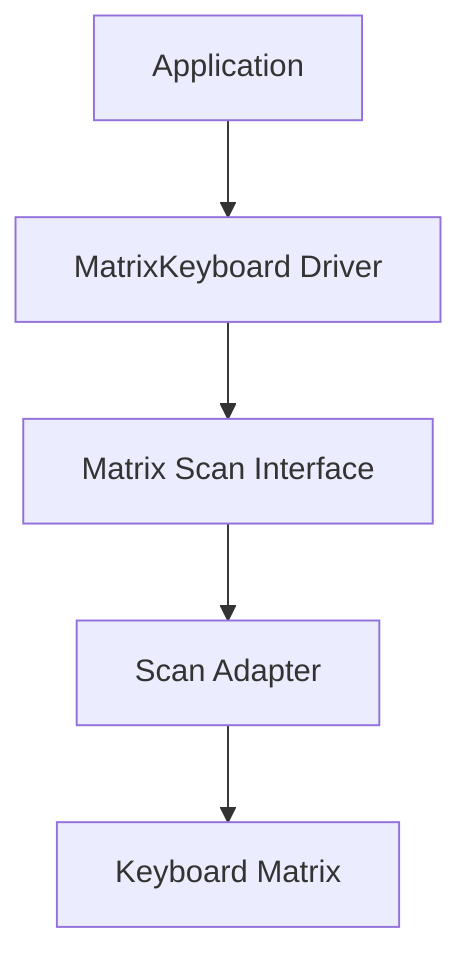
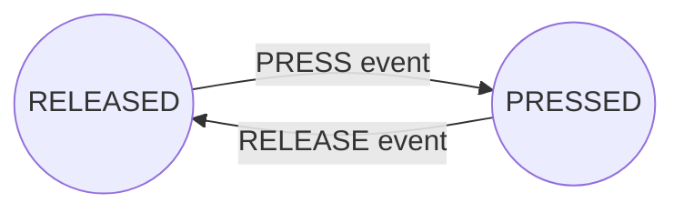
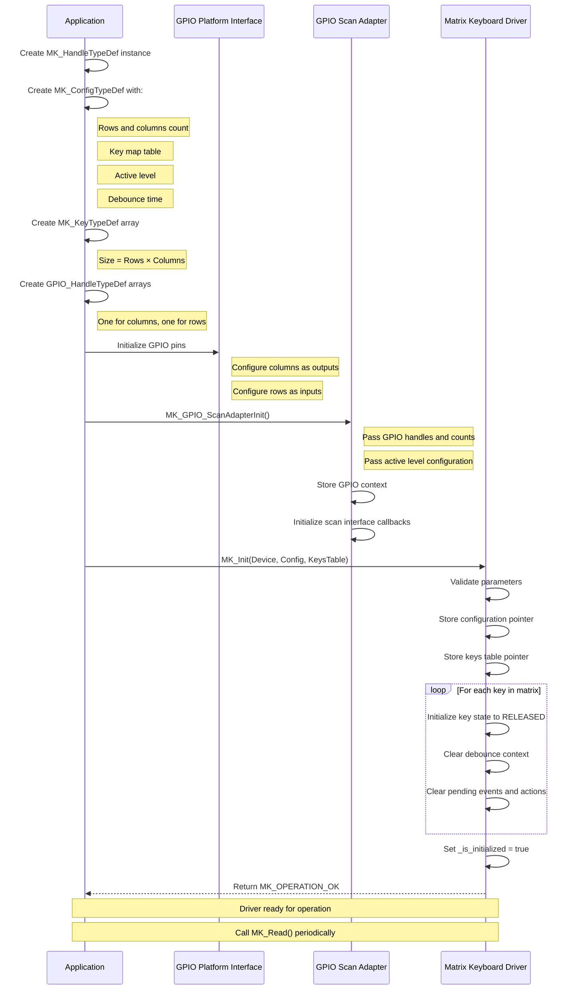
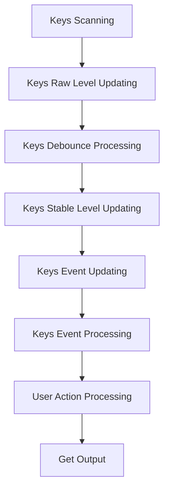
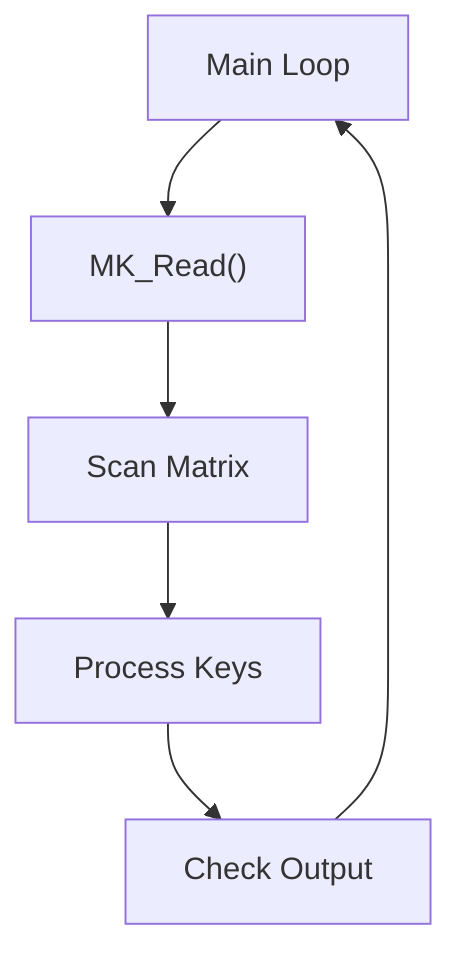
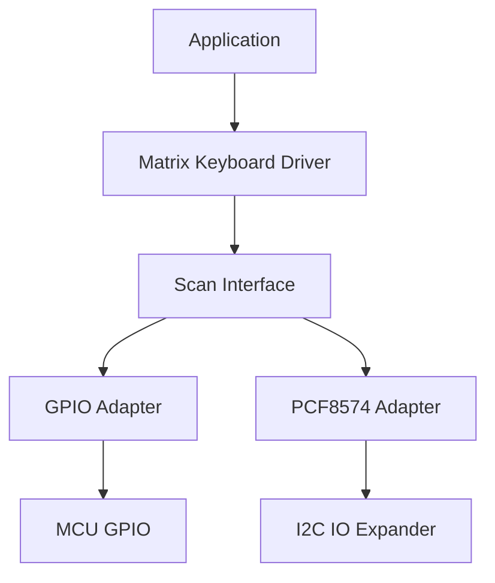

<h1 align="left">Matrix Keyboard Driver</h1>

<p align="left">
  <big>
    Hardware-independent driver for scanning and processing matrix keyboards,<br>
    designed for portable embedded systems.
  </big>
</p>

---
## Table of Contents

* [1. Overview](#1-overview)
* [2. Features](#2-features)
* [3. Architecture](#3-architecture)

  * [3.1 Scan Interface](#31-scan-interface)
  * [3.2 Key State Machine](#32-key-state-machine)
  * [3.3 Key Processing Model](#33-key-processing-model)
* [4. Directory Structure](#4-directory-structure)
* [5. Device Overview](#5-device-overview)
* [6. Driver Responsibilities](#6-driver-responsibilities)
* [7. Dependencies](#7-dependencies)
* [8. Data Structures](#8-data-structures)

  * [8.1 Matrix Keyboard Handle](#81-matrix-keyboard-handle)
  * [8.2 Keyboard Configuration](#82-keyboard-configuration)
  * [8.3 Keyboard Output](#83-keyboard-output)
  * [8.4 Operation Status](#84-operation-status)
  * [8.5 Additional Enumerations](#85-additional-enumerations)
* [9. API Reference](#9-api-reference)

  * [9.1 MK_Init](#91-mk_init)
  * [9.2 MK_Read](#92-mk_read)
* [10. Operation Flow](#10-operation-flow)

  * [10.1 Initialization Flow](#101-initialization-flow)
  * [10.2 Processing Pipeline](#102-processing-pipeline)
  * [10.3 Execution Model](#103-execution-model)
* [11. Usage Example](#11-usage-example)
* [12. Design Decisions](#12-design-decisions)

  * [12.1 Hardware Independence](#121-hardware-independence)
  * [12.2 Single Responsibility](#122-single-responsibility)
  * [12.3 Extensibility](#123-extensibility)
  * [12.4 Output](#124-output)
* [13. Error Handling](#13-error-handling)

  * [13.1 Return Codes](#131-return-codes)
  * [13.2 Recommended Strategy](#132-recommended-strategy)
  * [13.3 Error Propagation](#133-error-propagation)
* [14. Usage Constraints](#14-usage-constraints)

  * [14.1 Initialization Requirements](#141-initialization-requirements)
  * [14.2 Scan Adapter Requirements](#142-scan-adapter-requirements)
  * [14.3 Execution Model](#143-execution-model)
  * [14.4 Pointer Validity](#144-pointer-validity)
  * [14.5 Hardware Constraints](#145-hardware-constraints)
  * [14.6 Key Mapping](#146-key-mapping)
  * [14.7 Application Responsibilities](#147-application-responsibilities)
* [15. Applications](#15-applications)
* [16. Limitations](#16-limitations)
* [17. License](#17-license)

---
## 1. Overview
- The driver implements a complete keyboard processing pipeline responsible for scanning the matrix, filtering switch bounce, detecting stable key transitions, processing per-key state machines and generating user actions.

- Hardware-specific access is fully abstracted through a configurable scan interface, allowing the same driver to be reused with different GPIO implementations, I/O expanders or custom hardware interfaces.

---

## 2. Features

Current version provides:

- Generic matrix keyboard driver.
- Hardware-independent architecture.
- Configurable scan interface.
- GPIO scan adapter.
- Matrix column scanning.
- Row state acquisition.
- Active level abstraction.
- Per-key debounce filtering.
- Stable key state detection.
- PRESS and RELEASE event generation.
- Per-key state machine.
- CLICK action generation.
- Configurable key mapping.

---

## 3. Architecture

The driver is organized into independent layers. Hardware-specific details are isolated from the keyboard processing logic through the scan interface.



The driver never accesses GPIO peripherals directly.

All hardware interaction is performed through the scan interface, making the driver portable across different microcontrollers and hardware implementations.

### 3.1 Scan Interface

The Matrix Keyboard Driver communicates with the physical keyboard through the scan interface.

The scan adapter is responsible for:

- Selecting the active column.
- Reading all row inputs.
- Converting electrical levels into logical key states.

The driver receives a normalized row mask:

```text
Bit = 1 → Active key detected

Bit = 0 → Inactive key
```

This abstraction allows the driver to support different electrical configurations:

- Active LOW matrices.
- Active HIGH matrices.
- GPIO based implementations.
- External I/O expanders.

### 3.2 Key State Machine

After debounce validation, each key is processed by a finite state machine (FSM).

The FSM operates only with validated key transition events:

- `PRESS` event
- `RELEASE` event



The debounce layer is handled before the state machine processing. Therefore, the FSM receives only validated key transitions and is responsible for generating logical user actions.

Each key instance maintains its own FSM state, allowing independent processing of every key in the matrix.

### 3.3 Key Processing Model

Each physical key maintains its own internal state.

The driver associates:

```text
Physical Key

      |

      v

Key Instance

      |

      v

State Machine

      |

      v

User Action
```

This allows independent processing of every key in the matrix.

Each key can transition independently according to its own input condition.

Version 1.0 implements the following processing stages:

| Stage | Responsibility |
|---|---|
| Scan | Acquires physical keyboard state |
| Debounce | Filters unstable mechanical transitions |
| Event Generation | Detects PRESS and RELEASE events |
| Event Processing | Converts events into user actions |
| Output | Returns generated actions |

---

## 4. Directory Structure

```text
MatrixKeyboard/
|
├── Inc/
│   └── MatrixKeyboard_Driver.h
│   └── MatrixKeyboard_GPIO_ScanAdapter.h
│   └── MatrixKeyboard_ScanInterface.h
|
└── Src/
     └── MatrixKeyboard_Driver.c
     └── MatrixKeyboard_GPIO_ScanAdapter.c
```

---

## 5. Device Overview
The matrix keyboard consists of a grid of switches arranged in rows and columns. A key press is detected by sequentially driving each column to its active level while reading the state of all rows. When a key is pressed, the corresponding row reflects the active level, indicating the closure at the intersection of that row and column.

The column scanning sequence determines which column is currently being evaluated, while the row states indicate which keys (if any) are pressed within that column.

---

## 6. Driver Responsibilities

The driver is responsible for:

- Executing matrix scanning through the scan interface.
- Tracking individual key states.
- Filtering mechanical switch bounce.
- Detecting valid key transitions.
- Managing per-key state machines.
- Generating user-level actions.

The driver is **not** responsible for:

- Configure the MCU GPIO peripherals.
- Handle the electrical signaling polarity.
- Pull-up or pull-down configuration.
- Hardware timing generation.
- Interrupt management.
- Hardware-specific communication.

---

## 7. Dependencies

The driver depends on:

```text
MatrixKeyboard_ScanInterface.h
MatrixKeyboard_GPIO_ScanAdapter.h
```

The driver communicates with the keyboard matrix hardware exclusively through the Matrix Scan Interface.

The GPIO Scan Adapter implements this interface and is responsible for translating physical GPIO operations into normalized logical key states.

The driver does not need to know the implementation details of the underlying hardware, such as:

- GPIO pin configuration.
- Column drive polarity (active HIGH or active LOW).
- Row read polarity.
- Pull-up or pull-down resistor configuration.
- Matrix scanning timing.
- Electrical signal debouncing (mechanical switch bounce is handled by the driver itself).

The GPIO Scan Adapter itself depends on:

```text
GPIO_Platform_Interface.h
```
- The adapter uses the GPIO Platform Interface to:
- Set column pins to the active level.
- Set column pins to the inactive level.
- Read row pin states.
- Convert electrical levels into logical key states.

The driver therefore does not directly depend on the GPIO Platform Interface. Instead, the dependency is introduced through the scan adapter that implements the physical scanning operations.

```text
Matrix Keyboard Driver
         |
         v
Matrix Scan Interface
         |
         v
GPIO Scan Adapter
         |
         v
GPIO Platform Interface
```

This layered architecture allows:

- Replacing the GPIO Scan Adapter with an alternative implementation (e.g., I2C-based scanner) without modifying the driver.
- Testing the driver logic independently from the GPIO hardware.
- Using the same driver across different MCUs and hardware configurations.

**Note:** 
- The driver does not directly configure MCU GPIO peripherals, manage I2C communication, or handle any hardware-specific scanning sequences. All physical access is abstracted through the scan interface and its concrete adapter implementation.

---

## 8. Data Structures

### 8.1 Matrix Keyboard Handle
The driver uses `MK_HandleTypeDef` to represent a matrix keyboard device instance.

```c
typedef struct
{
    const MK_ConfigTypeDef* _config;
    MK_KeyTypeDef*          _keys;
    MK_ScanInterfaceTypeDef _scan_interface;
    bool                    _is_initialized;

} MK_HandleTypeDef;
```
| Member              | Description |
|---------------------|-------------|
| `_config`      | Pointer to the driver configuration. |
| `_keys`      | Pointer to the runtime key table (one entry per physical key). |
| `_key_map`          | Pointer to the application-provided key mapping table. |
| `_scan_interface` | The hardware scan interface implementation. |
| `_is_initialized` | The internal initialization state of the keyboard. |

The members of `MK_HandleTypeDef` are considered private data and shall not be accessed or modified directly by the application.

**Note:** 
- The application shall interact with the keyboard through the public driver API.

### 8.2 Keyboard Configuration
The driver uses `MK_ConfigTypeDef` to store all static configuration parameters required to initialize a keyboard instance.

```c
typedef struct
{
    MK_RowsQtyTypeDef        _rows_number;
    MK_ColsQtyTypeDef        _cols_number;
    const MK_KeyCodeTypeDef* _key_map;
    MK_KeyActiveLevelTypeDef _row_active_level;
    uint32_t                 _debounce_time_ms;

} MK_ConfigTypeDef;
```
| Member              | Description |
|---------------------|-------------|
| `_rows_number`      | Total number of rows in the keyboard matrix. |
| `_cols_number`      | Total number of columns in the keyboard matrix. |
| `_key_map`          | Pointer to the application-provided key mapping table. |
| `_row_active_level` | Electrical active level corresponding to a pressed key (active LOW or active HIGH). |
| `_debounce_time_ms` | Debounce interval in milliseconds. |

The application must provide this configuration during initialization. The driver treats the configuration as read-only after a successful initialization.

### 8.3 Keyboard Output
The driver uses `MK_OutputTypeDef` to report the result of a scan operation.

```c
typedef struct
{
    MK_KeyCodeTypeDef   OutputKey;
    MK_KeyActionTypeDef OutputAction;

} MK_OutputTypeDef;
```
| Member              | Description |
|---------------------|-------------|
| `OutputKey`      | Logical identifier of the key associated with the generated action. |
| `OutputAction`      | High-level action generated for the corresponding key. |

When a valid user action is detected, both fields are populated. If no new action is available, OutputAction is set to `MK_KEY_ACTION_NONE` and the value of `OutputKey` is unspecified.

-------
#### Key Code Type

```c
typedef uint8_t MK_KeyCodeTypeDef;
```

Represents the logical identifier of a physical key. The application provides a key mapping table during initialization, which maps each physical key position to a logical code (e.g., ASCII character 'A', function code, or application-specific identifier).

#### Key Action Type

```c
typedef enum
{
    MK_KEY_ACTION_NONE,   
    MK_KEY_ACTION_CLICK  

} MK_KeyActionTypeDef;
```

| Action	| Description |
|---------------------|-------------|
| `MK_KEY_ACTION_NONE`	|No user action detected during this scan cycle.|
| `MK_KEY_ACTION_CLICK`|	A complete press-and-release sequence was detected.|

### 8.4 Operation Status
The driver uses `MK_OpStatusTypeDef` to report the result of each operation.

```c
typedef enum
{
    MK_OPERATION_OK,
    MK_OPERATION_FAIL

} MK_OpStatusTypeDef;
```

| Status             | Description |
|---------------------|-------------|
| `MK_OPERATION_OK`      | Operation completed successfully. |
| `MK_OPERATION_FAIL`      | Operation could not be completed. |

### 8.5 Additional Enumerations
The driver provides additional enumerations to represent various aspects of keyboard processing:

| Enumeration         | Description |
|---------------------|-------------|
| `MK_KeyLevelTypeDef`     | Debounced logical level of a key (PRESSED/RELEASED). |
| `MK_KeyActiveLevelTypeDef`     | Electrical active level used by the keyboard hardware (LOW/HIGH). |
| `MK_KeyStateTypeDef` | Stable logical state of a key (UNKNOWN/RELEASED/PRESSED). |
| `MK_KeyStateEventTypeDef` | State transition event (PRESS/RELEASE/NONE/UNKNOWN). |

**Note:** 
- Structures such as `MK_KeyTypeDef` and `MK_DebounceContextTypeDef` contain private driver runtime data. 
- Their contents are intended exclusively for internal use by the Matrix Keyboard driver and shall never be accessed or modified directly by the application.
- The driver API shall be used exclusively for all interactions with the keyboard.

---

## 9. API Reference

### 9.1 MK_Init

- Initializes a matrix keyboard driver instance.
- Associates the driver instance with the supplied configuration and key storage, initializes the internal state of every key and prepares the driver for operation.
- All keys are initialized to the released state, debounce contexts are reset and any pending events or output actions are cleared to ensure a known initial condition.
- If the driver instance has already been initialized, this function returns successfully without reinitializing it.

#### Function Signature
```c
MK_OpStatusTypeDef MK_Init(
    MK_HandleTypeDef*       Device,
    const MK_ConfigTypeDef* Config,
    MK_KeyTypeDef*          KeysTable
);
```
#### Parameters
|Parameter	|Description|
|-----------|-----------|
|`Device`	    |Pointer to the matrix keyboard instance.|
|`Config`	    |Pointer to the driver configuration.|
|`KeysTable`	|Pointer to the key map table managed by the driver.|

#### Return
|Return Value|	Description|
|-----------|-----------|
|`MK_OPERATION_OK`	|Driver successfully initialized.|
|`MK_OPERATION_FAIL`	|Invalid parameters or initialization failed.|

The configuration and key table must remain valid for the entire lifetime of the driver instance.

### 9.2 MK_Read
- Reads and processes the matrix keyboard.
- Executes a complete keyboard acquisition cycle by scanning the matrix, processing the sampled key states and retrieving the next pending user action, if available.
- At the beginning of each call, the output action is initialized to `MK_KEY_ACTION_NONE`. If a pending key action is available, the corresponding key identifier and action type are written to the output structure.
- Once a pending action is reported through the output structure, it is consumed internally and will not be returned again by subsequent calls.
- If multiple key actions are pending, only the first pending action found according to the configured key scan order is returned. Remaining pending actions are preserved for subsequent calls.

#### Function Signature
```c
MK_OpStatusTypeDef MK_Read(
    MK_HandleTypeDef* Device,
    MK_OutputTypeDef* Output
);
```
#### Parameters
|Parameter	|Description|
|-----------|-----------|
|`Device`	    |Pointer to the matrix keyboard instance.|
|`Output`	    |Pointer to the structure that receives the key identifier and action detected during the current read operation.|

#### Return
|Return Value|	Description|
|-----------|-----------|
|`MK_OPERATION_OK`	|Driver successfully initialized.|
|`MK_OPERATION_FAIL`	|Invalid parameters or initialization failed.|

The Output structure is provided by the caller and represents the result of the current MK_Read() call. The caller is not responsible for clearing the internal pending action.

If no key action is pending, `Output->OutputAction`is set to `MK_KEY_ACTION_NONE` and `Output->OutputKey` is set to zero.

**Note:**
- This function should be called periodically to ensure proper keyboard scanning and event processing.

---

## 10. Operation Flow

### 10.1 Initialization Flow


### 10.2 Processing Pipeline

The keyboard driver executes a fixed processing pipeline every time ``MK_Read()``is called.



### 10.3 Execution Model

The driver is designed for a polling-based execution model.

Typical application flow:



The application is responsible for periodically calling `MK_Read()`.

The driver does not create tasks, interrupts or background processing.

---

## 11. Usage Example

```c
#include "MatrixKeyboard_Driver.h"
#include "MatrixKeyboard_GPIO_ScanAdapter.h"

MK_HandleTypeDef Keyboard;

MK_KeyTypeDef Keys[16];

const MK_KeyCodeTypeDef KeyMap[16] =
{
    '1', '2', '3', 'A',
    '4', '5', '6', 'B',
    '7', '8', '9', 'C',
    '*', '0', '#', 'D'
};

const MK_ConfigTypeDef Config =
{
    ._cols_number      = 4,
    ._rows_number      = 4,
    ._row_active_level = MK_KEY_ACTIVE_LOW,
    ._key_map          = KeyMap,
    ._debounce_time_ms = 20
};

static GPIO_HandleTypeDef Columns[4];

static GPIO_HandleTypeDef Rows[4];

static MK_GPIO_ScanAdapterContextTypeDef ScanContext;

int main(void)
{

    /*
     * Configure GPIO objects
     */
    PGPIO_Init(&Rows[0], GPIOA, 0);
    PGPIO_Init(&Rows[1], GPIOA, 1);
    PGPIO_Init(&Rows[2], GPIOA, 2);
    PGPIO_Init(&Rows[3], GPIOA, 3);
    PGPIO_Init(&Cols[0], GPIOA, 4);
    PGPIO_Init(&Cols[1], GPIOA, 5);
    PGPIO_Init(&Cols[2], GPIOA, 6);
    PGPIO_Init(&Cols[3], GPIOA, 7);

    /*
     * Configure GPIO scan adapter context
     */
    ScanContext.Columns = Columns;

    ScanContext.ColumnCount = 4;

    ScanContext.Rows = Rows;

    ScanContext.RowCount = 4;

    ScanContext.ActiveLevel = GPIO_LEVEL_LOW;

    /*
     * Initialize keyboard driver
     */

    MK_Init(
        &Keyboard,
        &Config,
        Keys
    );

    /*
     * Initialize scan adapter
     */

    MK_GPIO_ScanAdapterInit(
        &Keyboard._scan_interface,
        &ScanContext
    );

    while(1)
    {

        MK_OutputTypeDef Output;

        MK_Read(
            &Keyboard,
            &Output
        );

        /*
         * Process generated action
         */

    }
}
```

---

## 12. Design Decisions

### 12.1 Hardware Independence

All hardware-specific operations are isolated through the scan interface.

The keyboard processing logic does not depend on:

- MCU family.
- GPIO peripheral implementation.
- Electrical signal polarity.
- Hardware communication method.

The driver only processes logical keyboard states.

Example:

```text
Keyboard Matrix

        |

        v

Scan Adapter

        |

        v

Normalized Key State

        |

        v

Matrix Keyboard Driver
```

This allows the same driver core to be reused with:

- Direct GPIO scanning.
- I/O expanders.
- Custom scanning circuits.

### 12.2 Single Responsibility

Each processing stage performs one well-defined task.

```text
Matrix Scan

    ↓

Debounce

    ↓

Event Detection

    ↓

Event Processing

    ↓

User Action
```

This separation improves:

- Maintainability.
- Debugging.
- Unit testing.
- Feature expansion.

Each module has a clear responsibility:

| Module | Responsibility |
|---|---|
| Scan Interface | Hardware access abstraction |
| Scanner | Matrix acquisition |
| Debounce | Input stabilization |
| Event Detection | Transition detection |
| Event Processing | User interaction logic |
| Output Layer | Application communication |

### 12.3 Extensibility

The architecture allows new features to be added without modifying the existing scanning engine.

Possible future extensions:

- Long press detection.
- Double click detection.
- Event queue.
- Additional scan adapters.
- Interrupt-driven scanning.

The core driver remains unchanged because hardware and processing stages are isolated.

### 12.4 Output

Whenever a valid user action is detected, `MK_Read()` fills the output structure.

Example:

```text
User presses key '5'

        ↓

Output Key:

'5'

Output Action:

MK_KEY_ACTION_CLICK
```

Each generated action is returned only once.

---
## 13. Error Handling

All public Matrix Keyboard operations return a `MK_OpStatusTypeDef` value.

The application should verify the returned status whenever the success of an operation is relevant to system behavior.

### 13.1 Return Codes

All API functions return one of the following status codes:

|Status|	Description|
|------|----------- |
|`MK_OPERATION_OK`	|Operation completed successfully.|
|`MK_OPERATION_FAIL	`|Operation could not be completed.|

Failure Scenarios:

|Function	|Failure Scenario	|Description|
|-----------|-------------------|-----------|
|`MK_Init`	|Invalid parameters	|Device, Config or KeysTable pointer is NULL.|
|`MK_Init`	|Initialization failure	|Driver instance could not be properly initialized.|
|`MK_Read`	|Invalid parameters	|Device or Output pointer is NULL, or driver not initialized.|
|`MK_Read`	|Scan failure	|Hardware scan operation failed (e.g., GPIO read/write error).|
|`MK_Read`	|Processing failure	|Debounce, event generation or state machine processing failed.|

### 13.2 Recommended Strategy

For initialization errors:

The application should treat initialization failures as critical errors.

System startup should be halted or the error should be reported through the appropriate error handling mechanism.

For operational failures:
- The application should verify the return value of `MK_Read()`.
- If a failure occurs, the application may retry the operation on the next cycle or report the error to a higher-level error management system.

Example:

```c
MK_OpStatusTypeDef status;

status = MK_Init(&Keyboard, &Config, Keys);

if (status != MK_OPERATION_OK)
{
    /*
     * Handle initialization failure.
     * This is typically a critical error.
     */
    Error_Handler();
}

while (1)
{
    MK_OutputTypeDef Output;

    status = MK_Read(&Keyboard, &Output);

    if (status != MK_OPERATION_OK)
    {
        /*
         * Handle read failure.
         * This may be a transient error.
         * Retry on next cycle or report error.
         */
        continue;
    }

    if (Output.OutputAction != MK_KEY_ACTION_NONE)
    {
        /*
         * Process the generated key action.
         */
        ProcessKeyAction(Output.OutputKey, Output.OutputAction);
    }
}
```

### 13.3 Error Propagation

Operation failures may originate from:

- The Matrix Keyboard driver itself (invalid parameters, uninitialized instance).
- The underlying scan adapter (hardware access failures).
- The GPIO Platform Interface (GPIO read/write failures).
- The driver shall propagate the failure status when the requested operation cannot be completed successfully. The specific cause of the failure is not exposed through the API, but the application can implement additional diagnostics at the platform or adapter level if required.

---

## 14. Usage Constraints

The following constraints apply when using the Matrix Keyboard driver.

### 14.1 Initialization Requirements

- The `MK_HandleTypeDef` must be initialized by calling `MK_Init()` before any other driver operation.
- The `MK_ConfigTypeDef` structure must remain valid for the entire lifetime of the driver instance.
- The key mapping table (KeysTable) must remain valid for the entire lifetime of the driver instance.
- The KeysTable must have exactly Rows × Columns entries.

### 14.2 Scan Adapter Requirements

- The scan interface must be properly initialized before calling `MK_Read()`.
- The scan adapter implementation must be compatible with the configured matrix dimensions.
- The scan adapter must correctly normalize electrical levels according to the specified active level configuration.
- The GPIO descriptors provided to the scan adapter must remain valid for the entire lifetime of the driver.

### 14.3 Execution Model

- `MK_Read()` must be called periodically from the application's main loop or a periodic task.
- The driver does not create its own execution context, interrupts, or background processing.
- The debounce interval is configured during initialization and cannot be changed at runtime.
- All timing is based on the platform time interface (`Platform_GetMillis`).

### 14.4 Pointer Validity

- The Device pointer passed to `MK_Init()` and MK_Read() must not be NULL.
- The Config pointer passed to `MK_Init()` must not be NULL.
- The KeysTable pointer passed to `MK_Init()` must not be NULL.
- The Output pointer passed to `MK_Read()` must not be NULL.
- The driver does not perform dynamic memory allocation.

### 14.5 Hardware Constraints

 - The supported matrix dimensions depend on the capabilities of the underlying scan adapter.

- The scan adapter's `ReadRows()` callback must return a bitmask where each bit corresponds to a row state, following the convention:
```text
Bit = 1 → Key is physically pressed.

Bit = 0 → Key is physically released.
```

- The `SelectColumn()` callback must properly drive the specified column to its active level.

- All GPIO pins must be configured appropriately (output for columns, input for rows).

### 14.6 Key Mapping

- The `_key_map` array must contain one entry for each physical key position.

- The mapping order follows the row-major convention: Row 0, Column 0, Row 0, Column 1, ..., Row N-1, Column M-1.

- The driver does not validate the key map contents. Invalid key codes may result in undefined application behavior.

### 14.7 Application Responsibilities

- The application is responsible for controlling the timing between `MK_Read()` calls.
- The application is responsible for processing the generated key actions.
- The application is responsible for handling any hardware initialization not performed by the driver.
- The application must not access or modify internal driver state (members prefixed with _).

**Important Notes:**

- The driver maintains the state of each key independently, allowing independent processing of every key in the matrix.
- Once a pending action is reported through the output structure, it is consumed internally and will not be returned again.
- If multiple key actions are pending, only the first pending action is returned per call. Remaining actions are preserved for subsequent calls.

---

## 15. Applications

The expected integration architecture is:



The application interacts only with the Matrix Keyboard Driver.

The underlying hardware implementation can be replaced without modifying application logic.

---

## 16. Limitations

Version 1 currently supports:

- CLICK action.
- Polling-based execution.
- Single action output per `MK_Read()` call.
- Configurable key mapping.
- GPIO scan adapter.

Not implemented:

- Long press detection.
- Double click detection.
- Auto repeat.
- Multiple simultaneous key events.
- Event FIFO.
- Interrupt-based scanning.
- DMA-based scanning.
- Additional hardware adapters.

---

## 17. License

This module is part of the:

```text
Electronic Lock Project
```

and follows the project's license terms.
