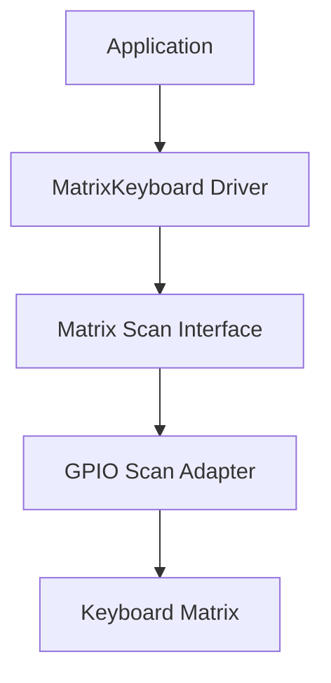
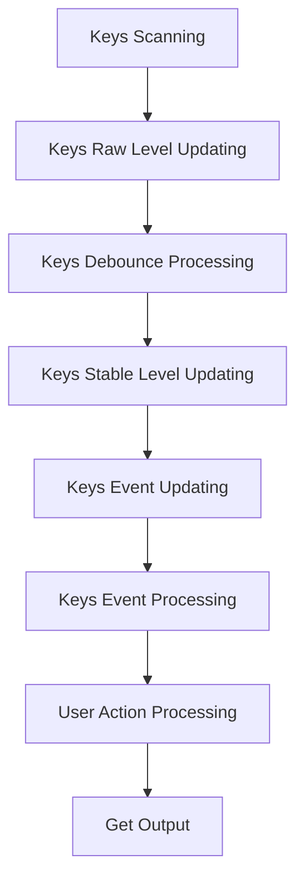
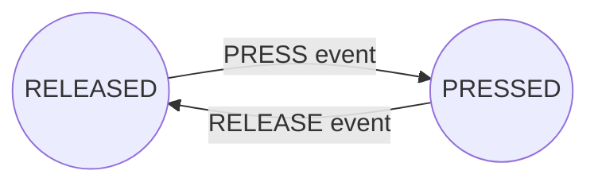
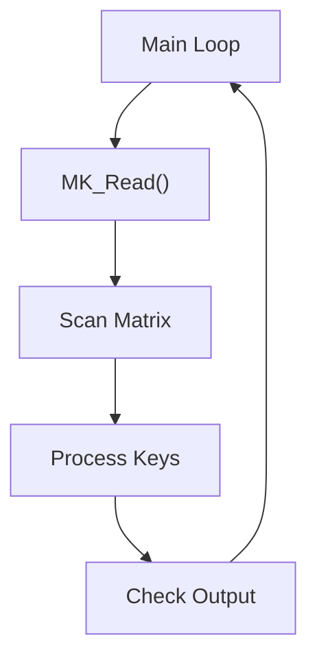
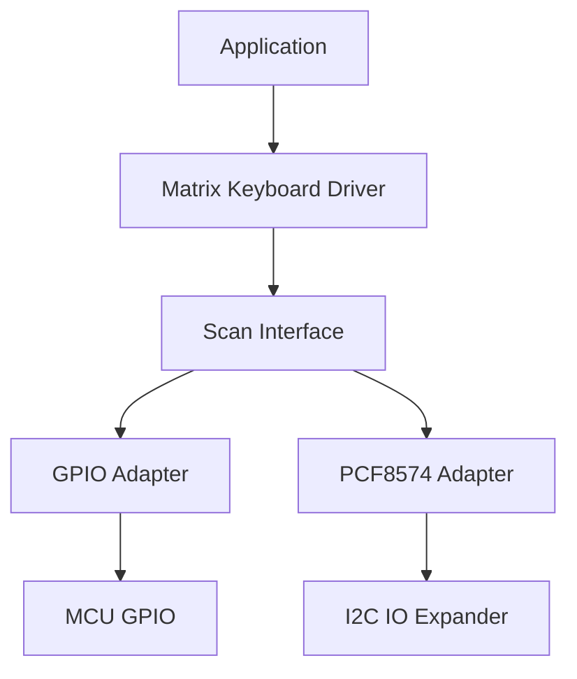

# Matrix Keyboard Driver

A generic, hardware-independent matrix keyboard driver for embedded systems.

The driver implements a complete keyboard processing pipeline responsible for scanning the matrix, filtering switch bounce, detecting stable key transitions, processing per-key state machines and generating user actions.

Hardware-specific access is fully abstracted through a configurable scan interface, allowing the same driver to be reused with different GPIO implementations, I/O expanders or custom hardware interfaces.

---

# Features

Current version provides:

- Generic matrix keyboard driver.
- Hardware-independent architecture.
- Configurable scan interface.
- GPIO scan adapter.
- Matrix column scanning.
- Row state acquisition.
- Active level abstraction.
- Per-key debounce filtering.
- Stable key state detection.
- PRESS and RELEASE event generation.
- Per-key state machine.
- CLICK action generation.
- Configurable key mapping.

---

# Architecture

The driver is organized into independent layers. Hardware-specific details are isolated from the keyboard processing logic through the scan interface.



The driver never accesses GPIO peripherals directly.

All hardware interaction is performed through the scan interface, making the driver portable across different microcontrollers and hardware implementations.

---

# Processing Pipeline

The keyboard driver executes a fixed processing pipeline every time ``MK_Read()``is called.



---

# Driver Responsibilities

The driver is responsible for:

- Executing matrix scanning through the scan interface.
- Tracking individual key states.
- Filtering mechanical switch bounce.
- Detecting valid key transitions.
- Managing per-key state machines.
- Generating user-level actions.

The driver is **not** responsible for:

- GPIO configuration.
- Electrical signal inversion.
- Pull-up or pull-down configuration.
- Hardware timing generation.
- Interrupt management.
- Hardware-specific communication.

---

# Scan Interface

The Matrix Keyboard Driver communicates with the physical keyboard through the scan interface.

The scan adapter is responsible for:

- Selecting the active column.
- Reading all row inputs.
- Converting electrical levels into logical key states.

The driver receives a normalized row mask:

```text
Bit = 1 → Active key detected

Bit = 0 → Inactive key
```

This abstraction allows the driver to support different electrical configurations:

- Active LOW matrices.
- Active HIGH matrices.
- GPIO based implementations.
- External I/O expanders.

---

# Driver Architecture

Version 1.0 implements the following processing stages:

| Stage | Responsibility |
|---|---|
| Scan | Acquires physical keyboard state |
| Debounce | Filters unstable mechanical transitions |
| Event Generation | Detects PRESS and RELEASE events |
| Event Processing | Converts events into user actions |
| Output | Returns generated actions |

---

# Key State Machine

After debounce validation, each key is processed by a finite state machine (FSM).

The FSM operates only with validated key transition events:

- `PRESS` event
- `RELEASE` event



The debounce layer is handled before the state machine processing. Therefore, the FSM receives only validated key transitions and is responsible for generating logical user actions.

Each key instance maintains its own FSM state, allowing independent processing of every key in the matrix.

# Key Processing Model

Each physical key maintains its own internal state.

The driver associates:

```text
Physical Key

      |

      v

Key Instance

      |

      v

State Machine

      |

      v

User Action
```

This allows independent processing of every key in the matrix.

Each key can transition independently according to its own input condition.

---

# Usage Example

```c
#include "MatrixKeyboard_Driver.h"
#include "MatrixKeyboard_GPIO_ScanAdapter.h"
#include "GPIO_Platform_Interface" // For example purpose, it could be any gpio API

MK_HandleTypeDef Keyboard;

MK_KeyTypeDef Keys[16];

const MK_KeyCodeTypeDef KeyMap[16] =
{
    '1', '2', '3', 'A',
    '4', '5', '6', 'B',
    '7', '8', '9', 'C',
    '*', '0', '#', 'D'
};

const MK_ConfigTypeDef Config =
{
    ._cols_number      = 4,
    ._rows_number      = 4,
    ._row_active_level = MK_KEY_ACTIVE_LOW,
    ._key_map          = KeyMap,
    ._debounce_time_ms = 20
};

static GPIO_HandleTypeDef Columns[4];

static GPIO_HandleTypeDef Rows[4];

static MK_GPIO_ScanAdapterContextTypeDef ScanContext;

int main(void)
{

    /*
     * Configure GPIO objects
     */

    ScanContext.Columns = Columns;

    ScanContext.ColumnCount = 4;

    ScanContext.Rows = Rows;

    ScanContext.RowCount = 4;

    ScanContext.ActiveLevel = GPIO_LEVEL_LOW;

    /*
     * Initialize keyboard driver
     */

    MK_Init(
        &Keyboard,
        &Config,
        Keys
    );

    /*
     * Initialize scan adapter
     */

    MK_GPIO_ScanAdapterInit(
        &Keyboard._scan_interface,
        &ScanContext
    );

    while(1)
    {

        MK_OutputTypeDef Output;

        MK_Read(
            &Keyboard,
            &Output
        );

        /*
         * Process generated action
         */

    }
}
```

---

# Output

Whenever a valid user action is detected, `MK_Read()` fills the output structure.

Example:

```text
User presses key '5'

        ↓

Output Key:

'5'


Output Action:

MK_KEY_ACTION_CLICK
```

Each generated action is returned only once.

---

# Execution Model

The driver is designed for a polling-based execution model.

Typical application flow:



The application is responsible for periodically calling `MK_Read()`.

The driver does not create tasks, interrupts or background processing.

# Current Limitations

Version 1 currently supports:

- CLICK action.
- Polling-based execution.
- Single action output per `MK_Read()` call.
- Configurable key mapping.
- GPIO scan adapter.

Not implemented:

- Long press detection.
- Double click detection.
- Auto repeat.
- Multiple simultaneous key events.
- Event FIFO.
- Interrupt-based scanning.
- DMA-based scanning.
- Additional hardware adapters.

---

# Design Philosophy

The driver was designed around three main principles.

---

# Hardware Independence

All hardware-specific operations are isolated through the scan interface.

The keyboard processing logic does not depend on:

- MCU family.
- GPIO peripheral implementation.
- Electrical signal polarity.
- Hardware communication method.

The driver only processes logical keyboard states.

Example:

```text
Keyboard Matrix

        |

        v

Scan Adapter

        |

        v

Normalized Key State

        |

        v

Matrix Keyboard Driver
```

This allows the same driver core to be reused with:

- Direct GPIO scanning.
- I/O expanders.
- Custom scanning circuits.

---

# Single Responsibility

Each processing stage performs one well-defined task.

```text
Matrix Scan

    ↓

Debounce

    ↓

Event Detection

    ↓

State Machine

    ↓

User Action
```

This separation improves:

- Maintainability.
- Debugging.
- Unit testing.
- Feature expansion.

Each module has a clear responsibility:

| Module | Responsibility |
|---|---|
| Scan Interface | Hardware access abstraction |
| Scanner | Matrix acquisition |
| Debounce | Input stabilization |
| Event Processing | Transition detection |
| State Machine | User interaction logic |
| Output Layer | Application communication |

---

# Extensibility

The architecture allows new features to be added without modifying the existing scanning engine.

Possible future extensions:

- Long press detection.
- Double click detection.
- Event queue.
- Additional scan adapters.
- Interrupt-driven scanning.

The core driver remains unchanged because hardware and processing stages are isolated.

---

# Integration Example

The expected integration architecture is:



The application interacts only with the Matrix Keyboard Driver.

The underlying hardware implementation can be replaced without modifying application logic.

---

# License

This module is part of the:

```text
Electronic Lock Project
```

and follows the project's license terms.