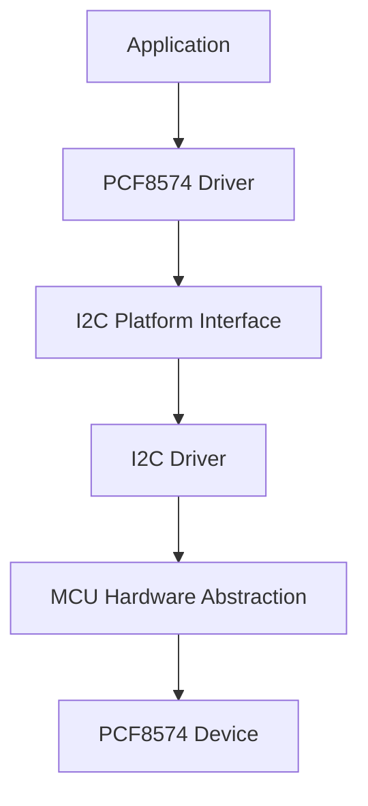
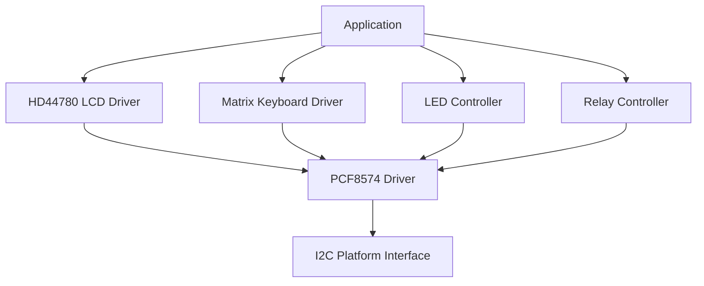

# PCF8574 I/O Expander Driver

A generic, hardware-independent driver for the PCF8574 8-bit I/O expander designed for embedded systems.

The driver provides an abstraction layer for controlling the PCF8574 device through an I2C interface, allowing applications to read and write the complete 8-bit quasi-bidirectional I/O port.

The driver abstracts the underlying I2C communication through the platform interface, allowing reuse across different microcontrollers and hardware platforms.

---

# Features

- PCF8574 device initialization and deinitialization.
- Full 8-bit port write operation.
- Full 8-bit port read operation.
- Individual bit manipulation:
  - Set bit.
  - Clear bit.
  - Toggle bit.
  - Read bit.
- Internal port shadow management.
- Hardware-independent I2C communication.
- Support for multiple PCF8574 instances.
- Abstracted platform communication layer.
- Simple API for GPIO expander applications.

---

# Architecture

The driver follows a layered architecture where the PCF8574 communication is isolated from the MCU-specific I2C peripheral implementation.

The PCF8574 driver does not access hardware registers directly. All communication is performed through the I2C Platform Interface.



This architecture allows:

- Replacing the MCU I2C peripheral without modifying the driver.
- Reusing the driver across different platforms.
- Easier unit testing through mocked I2C interfaces.

---

# Directory Structure

Example project organization:

```text
PCF8574/
|
├── Inc/
│   └── PCF8574_Driver.h
|
└── Src/
    └── PCF8574_Driver.c
```

---

# Device Overview

The PCF8574 is an 8-bit I/O expander that communicates through the I2C bus.

Each pin is a quasi-bidirectional I/O.

Unlike a standard GPIO peripheral:

- Writing `0` drives the pin LOW.
- Writing `1` releases the pin HIGH through the internal pull-up mechanism.

This allows each pin to operate as:

- Output.
- Input.

depending on the external circuit and application requirements.

---

# Driver Responsibilities

The PCF8574 driver is responsible for:

- Managing PCF8574 device instances.
- Configuring the I2C context.
- Storing the device address.
- Maintaining the software port shadow.
- Performing read and write transactions.
- Providing bit-level manipulation functions.

The driver is **not responsible** for:

- Configuring MCU I2C peripherals.
- Handling interrupts.
- Managing application GPIO logic.
- Implementing device-specific protocols.

---

# Dependencies

Required dependency:

```text
I2C Platform Interface
```

The driver communicates with the physical I2C peripheral only through:

```c
PI2C_WriteBlocking()

PI2C_ReadBlocking()
```

This abstraction allows the driver to run on different platforms.

# Data Structures

## PCF8574 Handle

The driver uses a handle structure to represent a PCF8574 device instance.

```c
typedef struct
{
    void*   _i2c_context;
    uint8_t _device_address;
    uint8_t _port_shadow;
    bool    _initialized;

} PCF8574_HandleTypeDef;
```

## Members Description

| Member | Description |
|---|---|
| `_i2c_context` | Platform-specific I2C communication context. |
| `_device_address` | 7-bit I2C address of the PCF8574 device. |
| `_port_shadow` | Software copy of the last successfully written port state. |
| `_initialized` | Internal driver initialization state. |

Members marked as internal driver data should not be modified directly by the application.

---

# Operation Status

The driver uses the following status type:

```c
typedef enum
{
    PCF8574_OPERATION_OK,
    PCF8574_OPERATION_FAIL

} PCF8574_StatusTypeDef;
```

Return values indicate whether the requested operation was successfully completed.

---

# API Reference

## Initialization

### PCF8574_Init()

Initializes a PCF8574 device instance.

Prototype:

```c
PCF8574_StatusTypeDef PCF8574_Init(
    PCF8574_HandleTypeDef* Device,
    uint8_t Address,
    void* I2C_Context
);
```

Parameters:

| Parameter | Description |
|-|-|
| `Device` | Pointer to PCF8574 device handle. |
| `Address` | I2C device address. |
| `I2C_Context` | Platform-specific I2C context. |

Behavior:

- Stores the I2C context.
- Stores the device address.
- Initializes the internal port shadow.
- Clears the device output port.

Example:

```c
PCF8574_HandleTypeDef IO_Expander;

PCF8574_Init(
    &IO_Expander,
    0x20,
    &hi2c1
);
```

---

## Deinitialization

### PCF8574_Deinit()

Deinitializes a PCF8574 instance.

Prototype:

```c
PCF8574_StatusTypeDef PCF8574_Deinit(
    PCF8574_HandleTypeDef* Device
);
```

Behavior:

- Clears the output port.
- Invalidates the device context.
- Resets initialization state.

---

# Port Access Functions

## Write Entire Port

### PCF8574_WritePort()

Writes an 8-bit value to the complete I/O port.

Prototype:

```c
PCF8574_StatusTypeDef PCF8574_WritePort(
    PCF8574_HandleTypeDef* Device,
    uint8_t Mask
);
```

Example:

```c
PCF8574_WritePort(
    &IO_Expander,
    0xAA
);
```

The internal port shadow is updated only after a successful I2C transmission.

---

## Read Entire Port

### PCF8574_ReadPort()

Reads the current state of all eight I/O pins.

Prototype:

```c
PCF8574_StatusTypeDef PCF8574_ReadPort(
    PCF8574_HandleTypeDef* Device,
    uint8_t* Buffer
);
```

Example:

```c
uint8_t port_state;

PCF8574_ReadPort(
    &IO_Expander,
    &port_state
);
```

---

# Bit Manipulation Functions

The driver provides helper functions for individual pin control.

## Set Bit

Sets a specific I/O pin HIGH.

```c
PCF8574_WriteBit(
    &IO_Expander,
    3
);
```

Internally:

```text
New Port State =
Current Shadow OR Bit Mask
```

---

## Clear Bit

Sets a specific I/O pin LOW.

```c
PCF8574_ClearBit(
    &IO_Expander,
    3
);
```

Internally:

```text
New Port State =
Current Shadow AND (~Bit Mask)
```

---

## Read Bit

Reads the state of a single pin.

```c
uint8_t state;

PCF8574_ReadBit(
    &IO_Expander,
    3,
    &state
);
```

---

## Toggle Bit

Inverts the current state of a pin.

```c
PCF8574_ToggleBit(
    &IO_Expander,
    3
);
```

Behavior:

```text
LOW  -> HIGH

HIGH -> LOW
```

---

# Port Shadow Mechanism

The PCF8574 driver maintains an internal software copy of the last written port state:

```c
uint8_t _port_shadow;
```

This is required because the PCF8574 does not provide individual bit write operations.

For example:

Current state:

```text
P7 P6 P5 P4 P3 P2 P1 P0

1  0  1  0  0  1  0  1
```

To change only P3:

```text
Read current shadow

Modify P3

Write complete byte again
```

Without the shadow register, modifying one pin would require reading the complete port state before every operation.

Advantages:

- Faster bit operations.
- Avoids unnecessary I2C reads.
- Preserves unrelated pin states.

# Initialization Flow

The typical initialization sequence of the PCF8574 driver is shown below.


After initialization, the device is ready to perform read and write operations.

---

# Usage Example

The following example shows how to initialize and control a PCF8574 device.

```c
#include "PCF8574_Driver.h"
#include "I2C_Platform_Interface.h"

PCF8574_HandleTypeDef IO_Expander;

const int16_t I2C_Address = 0x20;


int main(void)
{
    HAL_Init();

    SystemClock_Config();

    MX_I2C1_Init();


    /*
     * Initialize PCF8574
     *
     * Device address: 0x20
     */
    PCF8574_Init(
        &IO_Expander,
        I2C_Address,
        &hi2c1
    );


    /*
     * Set P0 HIGH
     */
    PCF8574_WriteBit(
        &IO_Expander,
        0
    );


    /*
     * Clear P0 LOW
     */
    PCF8574_ClearBit(
        &IO_Expander,
        0
    );


    /*
     * Toggle P1
     */
    PCF8574_ToggleBit(
        &IO_Expander,
        1
    );
}
```

---

# Design Decisions

## 1. Hardware Independent I2C Communication

The driver does not directly depend on any MCU vendor library.

Instead, all communication is performed through:

```text
PCF8574 Driver
        |
        v
I2C Platform Interface
        |
        v
MCU I2C Peripheral
```

Benefits:

- Portability between microcontrollers.
- Easier migration between platforms.
- Simplified unit testing.

---

## 2. Handle-Based Driver Architecture

The driver uses a handle structure:

```c
PCF8574_HandleTypeDef
```

instead of global variables.

Advantages:

- Supports multiple PCF8574 devices.
- Avoids hidden driver state.
- Improves modularity.

Example:

```c
PCF8574_HandleTypeDef LCD_IO;

PCF8574_HandleTypeDef KEYPAD_IO;
```

Both devices can coexist using independent instances.

---

## 3. Software Port Shadow

The PCF8574 hardware does not support individual bit write commands.

Every write operation transfers the complete 8-bit port value.

The driver solves this limitation using:

```c
uint8_t _port_shadow;
```

Example:

Changing only P4:

```text
Current shadow:

1010 0011


Modify P4:


1011 0011


Send complete byte through I2C
```

This prevents unintended changes on other pins.

---

## 4. Driver Initialization Protection

All public operations verify the device initialization state before accessing the hardware.

This prevents invalid access before:

```c
PCF8574_Init()
```

has been executed.

---

## 5. Abstraction Over Device Usage

The PCF8574 driver only provides low-level I/O expansion.

It does not know how the pins are used.

Possible applications:

- Character LCD interfaces.
- Matrix keyboards.
- Relay control.
- LED expanders.
- Sensor interfaces.
- User interface peripherals.

---

# Limitations

Current implementation limitations:

- Only blocking I2C communication is supported.
- No interrupt-based operation.
- No DMA support.
- No automatic I2C bus recovery.
- No hardware fault diagnostics.
- No configurable communication timeout through API.
- Bit position validation is not internally enforced.

---

# Applications

The PCF8574 driver can be used as a building block for higher-level drivers:



The PCF8574 driver acts as a reusable hardware abstraction layer between application-level modules and the physical I/O expander device.

---

# License

This module is part of the:

```text
Electronic Lock Project
```

and follows the project's license terms.