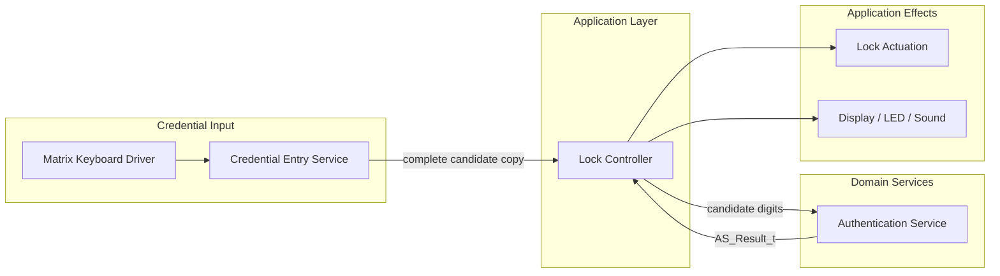
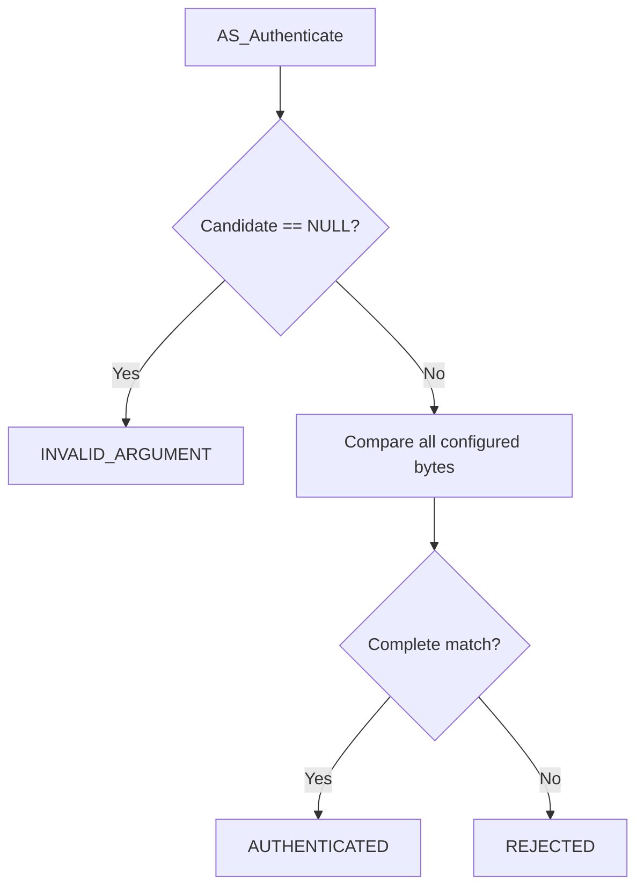
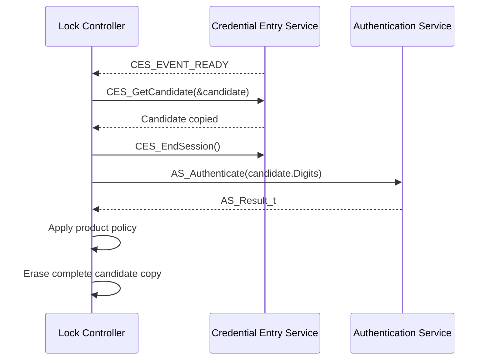

<h1 align="left">Authentication Service</h1>

<p align="left">
  <big>
    Stateless and hardware-independent domain service for validating<br>
    fixed-length candidate credentials in embedded electronic-lock systems.
  </big>
</p>

> [!IMPORTANT]
> The Authentication Service only compares a complete caller-provided candidate with the credential configured in the firmware. It does not collect digits, access the Credential Entry Service, own candidate storage, count failed attempts, apply lockout policy, control the lock actuator, or produce user-interface effects.

---

## Table of Contents

* [1. Overview](#1-overview)
* [2. Features](#2-features)
* [3. Architecture](#3-architecture)

  * [3.1 Layer Placement](#31-layer-placement)
  * [3.2 Application Integration](#32-application-integration)
* [4. Directory Structure](#4-directory-structure)
* [5. Service Responsibilities](#5-service-responsibilities)

  * [5.1 Responsibilities](#51-responsibilities)
  * [5.2 Explicit Non-Responsibilities](#52-explicit-non-responsibilities)
* [6. Dependencies](#6-dependencies)
* [7. Public Data Model](#7-public-data-model)

  * [7.1 Credential Length](#71-credential-length)
  * [7.2 Authentication Result](#72-authentication-result)
* [8. Authentication Model](#8-authentication-model)

  * [8.1 Candidate Representation](#81-candidate-representation)
  * [8.2 Configured Credential](#82-configured-credential)
  * [8.3 Comparison Semantics](#83-comparison-semantics)
  * [8.4 Ownership and Lifetime](#84-ownership-and-lifetime)
* [9. API Reference](#9-api-reference)

  * [9.1 AS_Authenticate](#91-as_authenticate)
* [10. Operation Flow](#10-operation-flow)

  * [10.1 Authentication Flow](#101-authentication-flow)
  * [10.2 Credential Entry Integration](#102-credential-entry-integration)
* [11. Usage Example](#11-usage-example)
* [12. Design Decisions](#12-design-decisions)

  * [12.1 Stateless Service](#121-stateless-service)
  * [12.2 No Public Handle or Singleton Instance](#122-no-public-handle-or-singleton-instance)
  * [12.3 CES-Independent Boundary](#123-ces-independent-boundary)
  * [12.4 Fixed-Length Contract](#124-fixed-length-contract)
  * [12.5 Synchronous Processing](#125-synchronous-processing)
  * [12.6 Private Configured Credential](#126-private-configured-credential)
* [13. Error Handling](#13-error-handling)
* [14. Timing and Concurrency](#14-timing-and-concurrency)
* [15. Security Considerations](#15-security-considerations)
* [16. Usage Constraints](#16-usage-constraints)
* [17. Testing and Acceptance Criteria](#17-testing-and-acceptance-criteria)
* [18. Limitations and Future Improvements](#18-limitations-and-future-improvements)
* [19. License](#19-license)

---

## 1. Overview

The Authentication Service is a domain-level component responsible for validating one complete candidate credential.

The service receives a caller-owned array containing exactly six normalized decimal digits and compares those digits with a private credential configured in the firmware. It returns an `AS_Result_t` value that distinguishes successful authentication, credential rejection, and an invalid argument.

The service owns no mutable runtime state. It does not require initialization, a public handle, a service instance, or a lifecycle API. Each authentication request is completed synchronously from the supplied candidate and the private configured credential.

The service is independent from the Credential Entry Service. It does not include CES headers or receive `CES_Candidate_t`. The Lock Controller retrieves a complete candidate from CES, passes the candidate digit buffer to `AS_Authenticate()`, handles the returned result, and erases the caller-owned candidate copy.

The acronym `AS` means **Authentication Service** and is used as the prefix for every public symbol exposed by this module.

---

## 2. Features

- Fixed-length authentication credentials containing exactly six digits.
- Explicit authenticated, rejected, and invalid-argument results.
- Candidate input through caller-owned storage.
- No retained candidate pointer or internal candidate copy.
- Independence from Credential Entry Service types and state.
- Synchronous and deterministic processing.
- Stateless and reentrant implementation.
- No public handle or service instance.
- No initialization or lifecycle API.
- No dynamic memory allocation.
- No direct hardware access.
- No RTOS dependency.
- No blocking operations.

---

## 3. Architecture

### 3.1 Layer Placement

The Authentication Service belongs to the hardware-independent domain-services layer.

It is invoked by the Lock Controller after the Credential Entry Service reports that a complete candidate is ready:



The diagram describes responsibility boundaries rather than direct dependencies. In particular, the Authentication Service does not call CES and does not control application effects.

### 3.2 Application Integration

The Lock Controller is the integration boundary between credential entry and authentication.

The expected application sequence is:

1. CES reports `CES_EVENT_READY`.
2. The Lock Controller obtains a complete candidate copy with `CES_GetCandidate()`.
3. The Lock Controller ends the CES session so that CES erases its internal candidate.
4. The Lock Controller passes `Candidate.Digits` to `AS_Authenticate()`.
5. The Lock Controller interprets the returned `AS_Result_t` according to product policy.
6. The Lock Controller erases the complete caller-owned candidate copy.

Authentication success or rejection does not directly unlock the device. The Lock Controller remains responsible for deciding the corresponding state transition and side effects.

---

## 4. Directory Structure

```text
Authentication/
├── Inc/
│   └── Authentication_Service.h
├── Src/
│   └── Authentication_Service.c
└── README.md
```

### Public Interface

`Inc/Authentication_Service.h` contains:

- The fixed credential-length macro.
- The public authentication-result type.
- The `AS_Authenticate()` function prototype and contract.

### Private Implementation

`Src/Authentication_Service.c` contains:

- The private digit representation.
- The credential configured in the firmware.
- Argument validation.
- Fixed-length credential comparison.

---

## 5. Service Responsibilities

### 5.1 Responsibilities

The Authentication Service is responsible for:

- Accepting one complete fixed-length candidate credential.
- Rejecting a null candidate pointer.
- Comparing exactly `AS_CREDENTIAL_LENGTH` candidate bytes.
- Reporting whether the candidate matches the configured credential.
- Keeping the configured credential private to the implementation file.
- Completing authentication without retaining caller-owned candidate data.

### 5.2 Explicit Non-Responsibilities

The Authentication Service is not responsible for:

- Reading a physical keyboard.
- Interpreting physical key codes.
- Collecting or editing candidate digits.
- Starting, ending, or clearing credential-entry sessions.
- Calling `CES_GetCandidate()` or any other CES operation.
- Receiving or exposing `CES_Candidate_t`.
- Validating a candidate length supplied at runtime.
- Verifying that each candidate byte is in the decimal range from `0U` through `9U`.
- Erasing caller-owned candidate storage.
- Counting successful or rejected attempts.
- Applying retry, lockout, alarm, or timeout policy.
- Persisting or changing the configured credential.
- Controlling the lock actuator.
- Producing display, LED, or sound effects.
- Performing Lock Controller state transitions.

---

## 6. Dependencies

The public interface depends only on the standard fixed-width integer header:

```c
#include "stdint.h"
```

The implementation additionally uses:

```c
#include "stddef.h"
#include "string.h"
```

`stddef.h` provides `NULL`, and `string.h` provides `memcmp()`.

The service does not depend on:

- STM32 HAL or LL headers.
- Platform interfaces.
- Matrix Keyboard Driver headers.
- Credential Entry Service headers.
- Lock Controller headers.
- FreeRTOS headers or primitives.
- Dynamic memory allocation.

---

## 7. Public Data Model

### 7.1 Credential Length

```c
#define AS_CREDENTIAL_LENGTH (6U)
```

`AS_CREDENTIAL_LENGTH` defines the exact number of candidate bytes read by `AS_Authenticate()` and the number of digits stored in the configured credential.

The value is part of the public API contract. A caller shall provide storage containing at least this many readable bytes.

The macro describes credential length, not a string length. The candidate contains numeric values and has no null terminator.

### 7.2 Authentication Result

```c
typedef enum
{
    AS_RESULT_AUTHENTICATED,
    AS_RESULT_REJECTED,
    AS_RESULT_INVALID_ARGUMENT

}AS_Result_t;
```

`AS_Result_t` reports the complete outcome of one synchronous authentication request:

| Result | Meaning |
|---|---|
| `AS_RESULT_AUTHENTICATED` | Every candidate digit matches the configured credential. |
| `AS_RESULT_REJECTED` | At least one candidate digit differs from the configured credential. |
| `AS_RESULT_INVALID_ARGUMENT` | The supplied candidate pointer is `NULL`. |

`AS_RESULT_REJECTED` is a valid domain outcome. It does not indicate an API failure or internal service malfunction.

---

## 8. Authentication Model

### 8.1 Candidate Representation

A candidate is represented as exactly `AS_CREDENTIAL_LENGTH` consecutive `uint8_t` values:

```text
Index:      0    1    2    3    4    5
Candidate: [d0] [d1] [d2] [d3] [d4] [d5]
```

Each value is expected to be a normalized decimal digit in the inclusive range from `0U` through `9U`. The values are not ASCII characters. For example, decimal digit three is represented as `3U`, not `'3'` or `0x33U`.

Digit-range validation belongs to the component constructing the candidate. The current Authentication Service compares bytes exactly and does not reject nondecimal values separately.

### 8.2 Configured Credential

The configured credential is a private, immutable array in `Authentication_Service.c`:

```c
static const AS_CandidateDigit_t
AS_ConfiguredPin[AS_CREDENTIAL_LENGTH] = { /* configured digits */ };
```

Because the symbol is `static`, it has internal linkage and cannot be referenced directly from another translation unit. Because the array is `const`, the service does not modify it during normal execution.

The current V1 configuration is compiled into the firmware. No public API is provided for reading, replacing, or persisting the credential.

### 8.3 Comparison Semantics

After validating the candidate pointer, the service compares exactly `sizeof(AS_ConfiguredPin)` bytes with `memcmp()`.

Authentication succeeds only when every compared byte is equal and appears at the same index. A difference at any position produces `AS_RESULT_REJECTED`.

The configured array size is used deliberately. Inside a C function, an array parameter is adjusted to a pointer, so `sizeof(Candidate)` would return the pointer size rather than the credential length.

### 8.4 Ownership and Lifetime

Candidate storage always belongs to the caller.

During `AS_Authenticate()` the service:

- Borrows the candidate pointer.
- Reads exactly `AS_CREDENTIAL_LENGTH` bytes.
- Does not modify the bytes.
- Does not retain the pointer.
- Does not create an internal candidate copy.
- Returns before the caller may reuse or erase the storage.

The caller shall ensure that the buffer remains readable for the complete function call and shall erase sensitive candidate data immediately after processing the result.

---

## 9. API Reference

### 9.1 AS_Authenticate

#### Function Signature

```c
AS_Result_t AS_Authenticate(
    const uint8_t Candidate[AS_CREDENTIAL_LENGTH]
);
```

#### Parameters

`Candidate` points to an array containing exactly `AS_CREDENTIAL_LENGTH` normalized credential digits in their original order.

Although the declaration uses array notation to document the required size, C adjusts the parameter to a pointer. The function cannot determine the actual capacity of the caller's storage.

#### Preconditions

- `Candidate` is `NULL`, or it points to at least `AS_CREDENTIAL_LENGTH` readable bytes.
- Candidate bytes use the expected normalized representation.
- Candidate storage remains valid until the function returns.

Passing a non-null pointer to a shorter or otherwise invalid object violates the API contract and causes undefined behavior.

#### Return

- `AS_RESULT_AUTHENTICATED` when all candidate bytes match.
- `AS_RESULT_REJECTED` when at least one candidate byte differs.
- `AS_RESULT_INVALID_ARGUMENT` when `Candidate` is `NULL`.

#### Side Effects

The operation has no externally visible side effects. It does not modify the candidate, configured credential, application state, hardware, or persistent storage.

---

## 10. Operation Flow

### 10.1 Authentication Flow



Every branch returns synchronously to the caller.

### 10.2 Credential Entry Integration



CES and AS never call each other. The Lock Controller owns orchestration and the temporary boundary between their public data models.

---

## 11. Usage Example

The following example shows the intended synchronous integration after CES reports `CES_EVENT_READY`:

```c
#include "Authentication_Service.h"
#include "Credential_Entry_Service.h"
#include "string.h"

CES_Candidate_t candidate = {0};

if (CES_GetCandidate(&candidate) == CES_OPERATION_OK)
{
    AS_Result_t result;

    (void)CES_EndSession();

    result = AS_Authenticate(candidate.Digits);

    switch (result)
    {
        case AS_RESULT_AUTHENTICATED:
            /* Request the authenticated application transition. */
            break;

        case AS_RESULT_REJECTED:
            /* Apply rejected-attempt policy in the Lock Controller. */
            break;

        case AS_RESULT_INVALID_ARGUMENT:
        default:
            /* Handle an integration or API-contract failure. */
            break;
    }

    (void)memset(&candidate, 0, sizeof(candidate));
}
```

The example uses `memset()` to communicate the required cleanup step. A production security review should determine whether the selected compiler and C library guarantee that this erasure is not optimized away. Where available, a project-approved explicit-zeroization routine is preferable.

---

## 12. Design Decisions

### 12.1 Stateless Service

The candidate is supplied directly to `AS_Authenticate()` and is not retained after the call. The configured credential is immutable.

Consequently, the service has no mutable runtime state and no dependency on call order. A separate access-candidate operation would introduce unnecessary state, pointer-lifetime concerns, and the possibility of authenticating stale data.

### 12.2 No Public Handle or Singleton Instance

Only one authentication service exists conceptually in the product, but the implementation does not require a singleton object.

A singleton instance is useful when a service owns mutable state that must exist exactly once. AS has no such state, so a module-level function provides the simpler contract. There is no handle to initialize, retain, validate, or synchronize.

### 12.3 CES-Independent Boundary

`AS_Authenticate()` accepts a standard fixed-width integer buffer rather than `CES_Candidate_t`.

This boundary prevents AS from depending on CES layout, lifecycle, naming, or headers. The same authentication operation could receive an equivalent candidate from another trusted input path without changing AS.

Using a typed byte pointer is intentional. A `void *` parameter would hide the representation without providing meaningful type safety or ownership semantics.

### 12.4 Fixed-Length Contract

Credential length is fixed by `AS_CREDENTIAL_LENGTH`, so the API does not require a separate runtime length parameter.

This keeps the operation small and prevents partial candidates from being interpreted as complete credentials. The tradeoff is that callers must honor the required buffer capacity because C array-parameter syntax does not enforce it.

### 12.5 Synchronous Processing

Authentication completes during the function call. The service creates no worker task, queue, callback, event group, or asynchronous request object.

Synchronous processing keeps candidate lifetime explicit and allows the caller to erase the temporary credential immediately after the result is available.

### 12.6 Private Configured Credential

The configured credential has internal linkage in the implementation file. It is not part of the public API and cannot be accessed through the service header.

This is encapsulation, not secure storage. The credential remains present in the firmware image and may be recoverable by inspecting or extracting that image.

---

## 13. Error Handling

The public operation distinguishes invalid input from credential rejection:

- A `NULL` pointer returns `AS_RESULT_INVALID_ARGUMENT` without attempting comparison.
- A valid buffer with any mismatching byte returns `AS_RESULT_REJECTED`.
- A complete matching buffer returns `AS_RESULT_AUTHENTICATED`.

The service does not expose which digit differed or how many digits matched. The application should present a generic rejection response rather than leaking comparison detail.

The service cannot detect:

- A non-null pointer to insufficient storage.
- A dangling or otherwise unreadable pointer.
- A candidate represented with ASCII digits instead of normalized values.
- Candidate values outside the decimal range.

These conditions are violations of the caller contract rather than recoverable AS results.

---

## 14. Timing and Concurrency

`AS_Authenticate()` executes synchronously and has a fixed upper bound determined by `AS_CREDENTIAL_LENGTH`.

The implementation:

- Does not block.
- Does not wait for hardware or another task.
- Does not allocate memory.
- Does not access mutable shared service state.
- Does not invoke callbacks.

Because all shared service data is immutable, concurrent calls do not create a data race within AS. Each caller remains independently responsible for ensuring that its candidate buffer is not modified or erased by another execution context during authentication.

`memcmp()` may stop at the first mismatching byte. Therefore, execution time can vary with the position of the first difference. See the security considerations for the implications of this behavior.

---

## 15. Security Considerations

Credentials are sensitive data even when represented as short numeric arrays.

Integration code shall:

- Never log or display the candidate or configured credential.
- Keep candidate copies short-lived.
- Erase the entire caller-owned candidate object after authentication.
- Avoid retaining candidate pointers beyond the synchronous call.
- Restrict debug access in production configurations where supported.
- Apply failed-attempt and lockout policy in the Lock Controller.
- Present generic rejection feedback that does not reveal matching positions.

Current V1 security limitations include:

- The configured credential is stored in plaintext in the firmware image.
- No cryptographic hash, keyed verification, or secure element is used.
- No protected persistent credential store is provided.
- No runtime credential-provisioning or credential-change mechanism exists.
- Standard `memcmp()` is not guaranteed to execute in constant time.
- Ordinary `memset()` cleanup may be removed by an optimizing compiler when the erased object is no longer used.

For a higher-security product, consider protected credential storage, a project-approved constant-time comparison routine, explicit zeroization, secure provisioning, debug-port protection, and a system-level retry and lockout policy.

---

## 16. Usage Constraints

Callers shall observe the following constraints:

- Supply exactly `AS_CREDENTIAL_LENGTH` readable candidate bytes.
- Supply normalized numeric values rather than ASCII characters.
- Keep the candidate buffer valid and unchanged until the call returns.
- Treat `AS_RESULT_REJECTED` as a normal authentication outcome.
- Treat `AS_RESULT_INVALID_ARGUMENT` as an integration or programming error.
- Apply product-level authentication policy outside AS.
- Erase caller-owned candidate storage after every completed attempt.
- Never rely on AS to validate buffer capacity or digit range.
- Never attempt to access `AS_ConfiguredPin` from another module.

---

## 17. Testing and Acceptance Criteria

The service should be validated with unit tests covering at least the following cases.

### Argument Validation

- A `NULL` candidate returns `AS_RESULT_INVALID_ARGUMENT`.
- A null request does not access candidate memory.

### Successful Authentication

- A candidate equal to the configured credential returns `AS_RESULT_AUTHENTICATED`.
- Repeated valid requests produce the same result without initialization.

### Credential Rejection

- A mismatch at the first digit returns `AS_RESULT_REJECTED`.
- A mismatch at every intermediate digit returns `AS_RESULT_REJECTED`.
- A mismatch at the final digit returns `AS_RESULT_REJECTED`.
- A candidate with every digit different returns `AS_RESULT_REJECTED`.
- A candidate containing ASCII digit values does not accidentally authenticate.

### Ownership and State

- Authentication does not modify the candidate array.
- One authentication result does not affect a subsequent request.
- Independent candidate buffers may be authenticated sequentially.
- Concurrent calls using independent stable buffers do not modify shared data.

### Build Validation

- The service compiles without CES include paths.
- The public header compiles as both C and C++.
- The implementation compiles with warnings treated as errors.
- No dynamic-allocation, hardware, or RTOS symbol is referenced.

---

## 18. Limitations and Future Improvements

Current V1 limitations include:

- Credentials contain exactly six bytes.
- The expected representation is numeric decimal values.
- Candidate length is not supplied at runtime and cannot be validated.
- Candidate digit range is not validated by AS.
- The configured credential is fixed at build time.
- The configured credential is stored directly in the firmware image.
- No runtime provisioning or credential-change API is provided.
- No nonvolatile or secure credential storage is integrated.
- No cryptographic credential verification is implemented.
- Comparison through `memcmp()` is not guaranteed to be constant-time.
- Candidate cleanup remains a caller responsibility.
- Failed-attempt counting and lockout policy are external.
- Authentication-result auditing is external.

Possible future improvements depend on product security requirements and may include:

- A protected credential-storage interface.
- Secure credential provisioning and replacement.
- Constant-time credential comparison.
- A guaranteed explicit-zeroization utility.
- Authentication against a derived or keyed credential representation.
- Support for multiple credential identities without coupling AS to CES.

These improvements should preserve the current separation between candidate collection, credential validation, and application policy.

---

## 19. License

This module is part of the:

```text
Electronic Lock Project
```

and follows the project's license terms.
