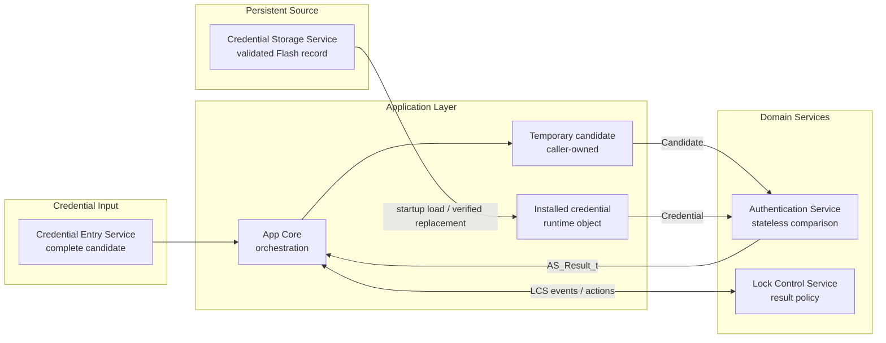
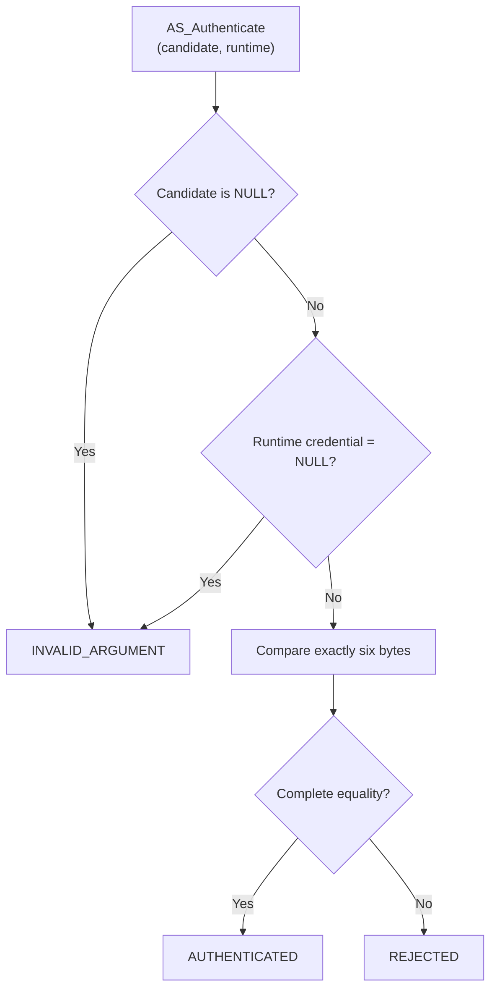
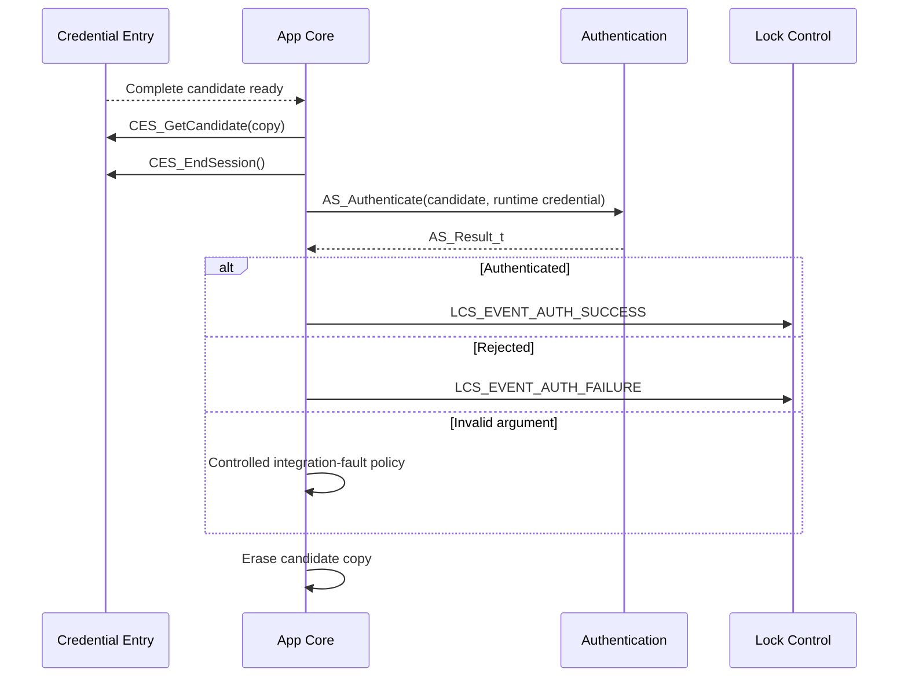
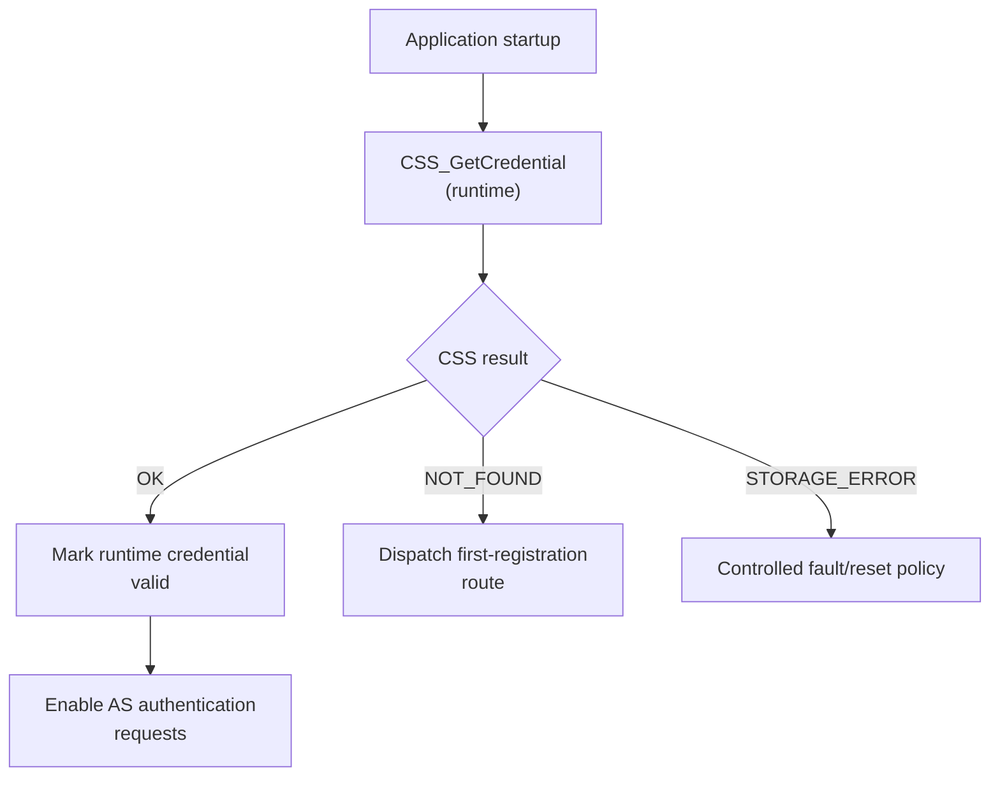

<h1 align="left">Authentication Service</h1>

<p align="left">
  <big>
    Stateless and hardware-independent comparison of one candidate credential<br>
    with the installed credential supplied from application runtime storage.
  </big>
</p>

> [!IMPORTANT]
> The Authentication Service owns no credential. `AS_Authenticate()` borrows both the candidate and the installed runtime credential from the caller, compares them synchronously and retains neither pointer. Persistent loading, runtime ownership, credential replacement, attempt counting and lockout policy remain outside AS.

> [!NOTE]
> Removing the former private firmware PIN keeps AS stateless while allowing credentials registered through CRS and persisted through CSS to become the authentication reference without rebuilding the firmware.

---

## Table of Contents

* [1. Overview](#1-overview)
* [2. Features](#2-features)
* [3. Architecture](#3-architecture)

  * [3.1 Layer Placement](#31-layer-placement)
  * [3.2 Application Integration](#32-application-integration)
  * [3.3 Runtime Credential Lifecycle](#33-runtime-credential-lifecycle)
* [4. Directory Structure](#4-directory-structure)
* [5. Service Responsibilities](#5-service-responsibilities)

  * [5.1 Responsibilities](#51-responsibilities)
  * [5.2 Explicit Non-Responsibilities](#52-explicit-non-responsibilities)
* [6. Dependencies](#6-dependencies)
* [7. Public Data Model](#7-public-data-model)

  * [7.1 Credential Length](#71-credential-length)
  * [7.2 Authentication Result](#72-authentication-result)
* [8. Authentication Model](#8-authentication-model)

  * [8.1 Candidate Representation](#81-candidate-representation)
  * [8.2 Runtime Credential Representation](#82-runtime-credential-representation)
  * [8.3 Comparison Semantics](#83-comparison-semantics)
  * [8.4 Ownership and Lifetime](#84-ownership-and-lifetime)
* [9. API Reference](#9-api-reference)

  * [9.1 AS_Authenticate](#91-as_authenticate)
* [10. Operation Flows](#10-operation-flows)

  * [10.1 Normal Authentication](#101-normal-authentication)
  * [10.2 Startup Runtime Loading](#102-startup-runtime-loading)
  * [10.3 Credential Replacement](#103-credential-replacement)
* [11. Usage Example](#11-usage-example)
* [12. Design Decisions](#12-design-decisions)

  * [12.1 Stateless Two-Buffer Contract](#121-stateless-two-buffer-contract)
  * [12.2 No Private Credential](#122-no-private-credential)
  * [12.3 No Public Handle or Singleton](#123-no-public-handle-or-singleton)
  * [12.4 Service-Independent Buffer Boundary](#124-service-independent-buffer-boundary)
  * [12.5 Fixed-Length Contract](#125-fixed-length-contract)
  * [12.6 Synchronous Processing](#126-synchronous-processing)
* [13. Error Handling](#13-error-handling)
* [14. Timing and Concurrency](#14-timing-and-concurrency)
* [15. Security Considerations](#15-security-considerations)
* [16. Usage Constraints](#16-usage-constraints)
* [17. Testing and Acceptance Criteria](#17-testing-and-acceptance-criteria)
* [18. Limitations and Future Improvements](#18-limitations-and-future-improvements)
* [19. License](#19-license)

---

## 1. Overview

The Authentication Service is a domain-level component responsible for comparing one complete candidate credential with the currently installed credential supplied by the application.

The public operation receives two caller-owned arrays containing exactly six normalized decimal digits:

1. `Candidate`: the credential just entered by the user.
2. `Credential`: the installed credential retained in application runtime storage.

The service compares both arrays and returns an `AS_Result_t` that distinguishes successful authentication, credential rejection and invalid API input. It does not know whether successful authentication will authorize bounded unlock or entry into credential registration; that pending-purpose decision remains in the [Lock Control Service](../Lock_Control/README.md).

AS owns no mutable state and no reference credential. It does not require initialization, a public handle, a singleton instance or a credential-configuration function. Every request is completely determined by the two buffers supplied to `AS_Authenticate()`.

The installed runtime credential is normally populated by the application from the [Credential Storage Service](../Credential_Storage/README.md) during startup and replaced only after a newly registered credential has been persisted successfully.

The acronym `AS` means **Authentication Service** and prefixes every public symbol exposed by the module.

---

## 2. Features

* Comparison of one candidate with one caller-supplied runtime credential.
* Fixed credential length of exactly six bytes.
* Normalized numeric representation rather than ASCII strings.
* Explicit authenticated, rejected and invalid-argument results.
* Candidate storage owned entirely by the caller.
* Runtime credential storage owned entirely by the caller.
* No retained pointers or internal credential copies.
* No credential compiled into the Authentication module.
* Immediate use of a newly installed runtime credential without firmware rebuild.
* Stateless and reentrant implementation.
* Synchronous and deterministic behavior.
* No initialization or lifecycle API.
* No public handle or service instance.
* No dynamic allocation.
* No direct hardware access.
* No Flash, CES, CRS, CSS, LCS or RTOS dependency.
* No blocking operation.

---

## 3. Architecture

### 3.1 Layer Placement

AS belongs to the hardware-independent Services layer. App Core owns the temporary candidate and installed runtime credential passed through the public comparison boundary:



The arrows describe application orchestration rather than direct service-to-service calls. AS does not invoke CES, CSS or LCS and does not access App Core state by itself.

### 3.2 Application Integration

The expected normal authentication sequence is:

1. CES reports a complete candidate.
2. App Core obtains a bounded caller-owned copy with `CES_GetCandidate()`.
3. App Core ends the CES session so CES erases its internal candidate.
4. App Core verifies that the installed runtime credential is available.
5. App Core calls `AS_Authenticate(Candidate.Digits, RuntimeCredential)`.
6. App Core maps the result into `LCS_EVENT_AUTH_SUCCESS` or `LCS_EVENT_AUTH_FAILURE`.
7. App Core erases the complete candidate copy.

The runtime credential remains available for later requests. It is not a temporary authentication candidate and shall not be erased after every comparison.

### 3.3 Runtime Credential Lifecycle

The installed runtime credential belongs to App Core or to a future dedicated runtime-credential owner. Its lifecycle is separate from AS:

```text
startup
  -> CSS_GetCredential(runtime)
  -> repeated AS_Authenticate(candidate, runtime)
  -> successful credential replacement
  -> CSS_SaveCredential(new credential)
  -> update runtime only after CSS success
```

Recommended ownership rules:

| Condition | Runtime credential handling |
|---|---|
| CSS returns a valid credential during startup | Mark runtime object valid and use it as the AS reference. |
| CSS reports no installed credential | Keep runtime object invalid and enter first-registration flow. |
| CSS startup read fails | Keep runtime object invalid and enter controlled fault policy. |
| Authentication completes | Preserve runtime credential; erase only the candidate. |
| New credential is persisted successfully | Replace the runtime credential with the verified new value. |
| Persistent replacement fails | Do not publish the proposed credential as the installed runtime reference. |
| Controlled reset or terminal fault | Erase runtime storage when the platform execution path permits it. |

---

## 4. Directory Structure

```text
Libs/Services/Authentication/
├── Inc/
│   └── Authentication_Service.h
├── Src/
│   └── Authentication_Service.c
└── README.md
```

### Public Interface

`Inc/Authentication_Service.h` contains:

* The fixed credential-length macro.
* The authentication-result enumeration.
* The two-buffer `AS_Authenticate()` function prototype.

### Private Implementation

`Src/Authentication_Service.c` contains:

* Validation of both borrowed pointers.
* A bounded six-element comparison loop.
* Immediate authenticated or rejected result selection.

It contains no configured credential constant or mutable service data.

---

## 5. Service Responsibilities

### 5.1 Responsibilities

The Authentication Service is responsible for:

* Accepting one complete fixed-length candidate.
* Accepting one complete fixed-length installed runtime credential.
* Rejecting a `NULL` pointer argument.
* Comparing exactly `AS_CREDENTIAL_LENGTH` bytes from each buffer.
* Reporting complete equality as authenticated.
* Reporting any byte difference as rejected.
* Completing comparison without modifying either caller-owned buffer.
* Completing comparison without retaining either pointer.

### 5.2 Explicit Non-Responsibilities

The Authentication Service is not responsible for:

* Reading a physical keyboard.
* Collecting or editing candidate digits.
* Beginning, refreshing or ending CES sessions.
* Calling `CES_GetCandidate()`.
* Receiving or exposing `CES_Candidate_t`.
* Loading a credential from CSS or Flash.
* Owning or maintaining the runtime credential object.
* Staging or confirming a proposed new credential.
* Persisting or replacing the installed credential.
* Determining whether a runtime credential is currently available.
* Validating buffer capacity at runtime.
* Validating that each supplied byte is between `0U` and `9U`.
* Erasing caller-owned candidate or runtime storage.
* Counting successful or rejected attempts.
* Applying lockout, timeout, alarm or retry policy.
* Selecting LCS transitions.
* Unlocking the actuator.
* Producing display, LED or sound effects.

---

## 6. Dependencies

The public interface depends only on:

```c
#include <stdint.h>
```

The implementation additionally uses:

```c
#include <stddef.h>
```

`stddef.h` provides `NULL`. Credential comparison is implemented with a bounded element loop and requires no standard string or
memory-comparison function.

AS does not include or link against:

* STM32 HAL or LL interfaces.
* Platform Flash interfaces.
* Credential Entry Service types.
* Credential Register Service types.
* Credential Storage Service types.
* Lock Control Service types.
* App Core state.
* FreeRTOS facilities.
* Dynamic-memory functions.

---

## 7. Public Data Model

### 7.1 Credential Length

```c
#define AS_CREDENTIAL_LENGTH (6U)
```

`AS_CREDENTIAL_LENGTH` is the exact number of bytes read from both `Candidate` and `Credential` by `AS_Authenticate()`.

Both arrays contain numeric decimal digits and have no string terminator. The normalized representation of digit three is `3U`, not ASCII `'3'` or `0x33U`.

The caller shall provide at least `AS_CREDENTIAL_LENGTH` readable bytes for each non-NULL pointer. C array-parameter syntax documents the required capacity but does not enforce or recover the actual object size.

CES, CRS, CSS and AS currently expose independent V1 length constants. App Core shall ensure these contracts remain compatible when moving credential copies between service boundaries.

### 7.2 Authentication Result

```c
typedef enum
{
    AS_RESULT_AUTHENTICATED,
    AS_RESULT_REJECTED,
    AS_RESULT_INVALID_ARGUMENT

}AS_Result_t;
```

| Result | Meaning |
|---|---|
| `AS_RESULT_AUTHENTICATED` | Every candidate byte equals the runtime credential byte at the same index. |
| `AS_RESULT_REJECTED` | At least one candidate byte differs from the runtime credential. |
| `AS_RESULT_INVALID_ARGUMENT` | Candidate or runtime credential pointer is `NULL`. |

`AS_RESULT_REJECTED` is an ordinary domain result. `AS_RESULT_INVALID_ARGUMENT` indicates an application integration or programming error and shall not consume normal authentication policy as though the user entered a wrong credential.

---

## 8. Authentication Model

### 8.1 Candidate Representation

The candidate is one caller-owned fixed-length array:

```text
Index:      0    1    2    3    4    5
Candidate: [c0] [c1] [c2] [c3] [c4] [c5]
```

It normally originates from a completed CES session. AS does not know that origin and can accept an equivalent trusted buffer from another application input path.

### 8.2 Runtime Credential Representation

The installed reference is supplied in a second caller-owned array:

```text
Index:       0    1    2    3    4    5
Credential: [r0] [r1] [r2] [r3] [r4] [r5]
```

AS neither creates nor persists this object. During normal startup, App Core obtains it from `CSS_GetCredential()`. After successful registration, App Core updates it only after `CSS_SaveCredential()` reports verified success.

This runtime object replaces the former private `AS_ConfiguredPin` constant. Authentication behavior can therefore follow the credential installed by the user rather than one value fixed in the firmware image.

### 8.3 Comparison Semantics

Authentication compares exactly `AS_CREDENTIAL_LENGTH` bytes:

```text
authenticated <=> Candidate[i] == Credential[i]
                  for every i in [0, AS_CREDENTIAL_LENGTH)
```

Any difference returns `AS_RESULT_REJECTED`. AS does not report the first mismatching index, matching prefix length or number of differences.

The comparison length shall be expressed with `AS_CREDENTIAL_LENGTH` or an equivalent full-array byte count known outside the adjusted parameters. Inside a function, both array parameters are adjusted to pointers; `sizeof(Candidate)` and `sizeof(Credential)` therefore produce pointer size, not credential length.

AS compares byte values exactly and does not separately reject nondecimal digits. Decimal-range validation remains a precondition guaranteed by the trusted buffer producers.

### 8.4 Ownership and Lifetime

Both buffers remain caller-owned:

| Property | Candidate | Runtime credential |
|---|---|---|
| Owner | App Core temporary authentication context | App Core or future runtime-credential owner |
| Typical source | `CES_GetCandidate()` | `CSS_GetCredential()` or verified registration output |
| Expected lifetime | One authentication request | Repeated requests during active runtime |
| Modified by AS | No | No |
| Pointer retained by AS | No | No |
| Cleanup | Immediately after authentication result is consumed | Replacement, controlled fault/reset or runtime termination policy |

Both objects shall remain readable and unchanged until the synchronous call returns.

---

## 9. API Reference

### 9.1 AS_Authenticate

#### Function Signature

```c
AS_Result_t AS_Authenticate(
    const uint8_t Candidate[AS_CREDENTIAL_LENGTH],
    const uint8_t Credential[AS_CREDENTIAL_LENGTH]);
```

#### Parameters

`Candidate` points to the complete caller-owned credential entered for the current request.

`Credential` points to the complete caller-owned installed credential currently valid in runtime storage.

Each non-NULL pointer shall provide at least `AS_CREDENTIAL_LENGTH` readable bytes in normalized digit order.

#### Preconditions

* Candidate and runtime credential storage remain readable and unchanged until the function returns.
* Both non-NULL buffers contain at least `AS_CREDENTIAL_LENGTH` bytes.
* Both buffers use the same normalized representation.
* App Core has established that the runtime credential is valid before calling AS.

Passing a non-NULL pointer to insufficient, expired or unreadable storage violates the API contract and causes undefined behavior.

#### Return

* `AS_RESULT_AUTHENTICATED` when all six bytes are equal.
* `AS_RESULT_REJECTED` when at least one byte differs.
* `AS_RESULT_INVALID_ARGUMENT` when either pointer is `NULL`.

#### Side Effects

The operation has no externally visible side effect. It does not modify either array, retain pointers, change application state, access Flash or invoke LCS.

#### Caller Obligations

* Treat rejection as a normal authentication result.
* Treat invalid argument as an integration fault.
* Map valid results into the appropriate LCS event.
* Erase the candidate after result processing.
* Preserve the installed runtime credential for future requests.

---

## 10. Operation Flows

### 10.1 Normal Authentication



Every branch returns synchronously. The application handles product policy after the call.

The App Core integration sequence is:



### 10.2 Startup Runtime Loading

AS is not called until App Core has completed the startup credential decision:



Reading Flash before every authentication is not required. The application retains the installed reference in RAM and passes it to stateless AS whenever a complete candidate is ready.

### 10.3 Credential Replacement

After CRS confirms a proposed credential:

1. App Core obtains the validated copy from CRS.
2. App Core calls `CSS_SaveCredential()`.
3. CSS writes and verifies the persistent record.
4. Only after `CSS_OPERATION_OK` does App Core replace the installed runtime credential.
5. Subsequent `AS_Authenticate()` calls receive the new runtime reference.
6. All transient registration and caller-owned temporary buffers are cleared.

AS requires no notification or reinitialization because it owns no credential state.

---

## 11. Usage Example

The following example shows the two-buffer contract after CES reports a complete candidate:

```c
#include "Authentication_Service.h"
#include "Credential_Entry_Service.h"

static uint8_t App_RuntimeCredential[AS_CREDENTIAL_LENGTH];
static bool App_RuntimeCredentialValid;

static void App_AuthenticateReadyCandidate(void)
{
    CES_Candidate_t candidate = {0};

    if(!App_RuntimeCredentialValid)
    {
        App_EnterControlledFaultPolicy();
        return;
    }

    if(CES_GetCandidate(&candidate) != CES_OPERATION_OK)
    {
        App_EnterControlledFaultPolicy();
        return;
    }

    (void)CES_EndSession();

    AS_Result_t result = AS_Authenticate(candidate.Digits,
                                         App_RuntimeCredential);

    App_ClearSensitiveObject(&candidate, sizeof(candidate));

    if(result == AS_RESULT_AUTHENTICATED)
    {
        App_DispatchLcsEvent(LCS_EVENT_AUTH_SUCCESS);
    }
    else if(result == AS_RESULT_REJECTED)
    {
        App_DispatchLcsEvent(LCS_EVENT_AUTH_FAILURE);
    }
    else
    {
        App_EnterControlledFaultPolicy();
    }
}
```

`App_ClearSensitiveObject()`, `App_DispatchLcsEvent()` and `App_EnterControlledFaultPolicy()` are application placeholders, not AS functions. Production code shall use the project-approved cleanup mechanism and ensure the runtime credential object was populated successfully by CSS.

---

## 12. Design Decisions

### 12.1 Stateless Two-Buffer Contract

Supplying both values makes the authentication result a pure function of current input:

```text
result = compare(candidate, installed runtime credential)
```

No prior AS configuration call, hidden module state or call ordering is required.

### 12.2 No Private Credential

The previous design stored `AS_ConfiguredPin` as a private firmware constant. That prevented a newly registered credential from becoming authoritative without changing or rebuilding firmware.

The new API removes that constant. App Core supplies the reference currently loaded from persistent storage, so AS remains stateless while supporting runtime credential replacement.

### 12.3 No Public Handle or Singleton

AS owns no mutable fields and therefore needs neither a public instance nor a private singleton. There is no handle to initialize, configure, validate, synchronize or reset.

### 12.4 Service-Independent Buffer Boundary

`AS_Authenticate()` accepts two `uint8_t` arrays rather than CES, CRS, CSS or App Core structures. This keeps authentication independent from how the candidate was collected and how the installed reference was loaded.

The application owns translations and verifies that all participating fixed-length contracts agree.

### 12.5 Fixed-Length Contract

Credential length is fixed by `AS_CREDENTIAL_LENGTH`; no runtime length argument exists. This keeps the API small and prevents a partial caller-declared length from becoming an authentication input.

The caller must nevertheless supply two full buffers because array notation does not communicate actual object capacity at runtime.

### 12.6 Synchronous Processing

Comparison completes during the function call. AS creates no task, queue, callback, event group or asynchronous request. Both borrowed buffer lifetimes therefore remain explicit and bounded.

---

## 13. Error Handling

The API distinguishes integration failure from ordinary credential rejection:

| Condition | Result | Application meaning |
|---|---|---|
| Candidate is `NULL` | `AS_RESULT_INVALID_ARGUMENT` | Candidate integration failure. |
| Runtime credential is `NULL` | `AS_RESULT_INVALID_ARGUMENT` | Runtime credential is unavailable or incorrectly supplied. |
| Both pointers are valid and any byte differs | `AS_RESULT_REJECTED` | Normal rejected authentication attempt. |
| Both pointers are valid and all bytes match | `AS_RESULT_AUTHENTICATED` | Normal successful authentication. |

AS does not expose which index differed or how many bytes matched. App Core shall present generic denial feedback and let LCS apply the consecutive-failure policy.

AS cannot detect:

* A non-NULL pointer to fewer than six readable bytes.
* A dangling, unaligned for its declared type or otherwise invalid pointer.
* An incorrectly marked runtime object containing stale data.
* ASCII values or other nondecimal bytes in either buffer.

These are caller-contract violations or upstream integration errors.

---

## 14. Timing and Concurrency

`AS_Authenticate()` is synchronous and bounded by `AS_CREDENTIAL_LENGTH`.

The implementation:

* Performs no blocking operation.
* Waits for no hardware or task.
* Allocates no memory.
* Accesses no mutable module state.
* Invokes no callback.
* Retains no pointer.

Concurrent calls do not race on AS-owned data because no such mutable data exists. Each caller remains responsible for ensuring that its candidate and runtime credential buffers remain stable for the complete call.

The comparison loop returns at the first different byte, so execution time may vary with the mismatch position.

---

## 15. Security Considerations

Both arguments are sensitive even though AS only borrows them.

Integration code shall:

* Never log or display either credential buffer.
* Keep candidate copies short-lived.
* Erase the complete candidate after every authentication attempt.
* Keep the runtime object private to its application owner.
* Replace runtime data only after CSS verifies persistent success.
* Erase invalid or obsolete runtime data before publishing replacement.
* Restrict production debug access according to the threat model.
* Apply attempt counting and lockout in LCS.
* Present rejection feedback that does not reveal comparison position.

Security properties improved by the new contract:

* AS no longer embeds a fixed plaintext PIN in its own firmware module.
* Runtime replacement requires no AS setter or retained mutable credential.
* Authentication uses the credential selected by the application's verified storage path.

Remaining limitations:

* The runtime credential exists as plaintext numeric data in SRAM.
* The CSS persistent representation is not encrypted.
* The early-return comparison loop is not constant time.
* AS does not validate decimal range.
* AS cannot erase caller-owned buffers.
* Ordinary cleanup may be optimized away without a project-approved explicit-zeroization primitive.

---

## 16. Usage Constraints

Callers shall:

* Supply exactly `AS_CREDENTIAL_LENGTH` readable bytes for both arguments.
* Supply normalized numeric values rather than ASCII characters.
* Verify that the runtime credential is valid before authentication.
* Keep both buffers unchanged until the call returns.
* Treat rejection as a normal domain result.
* Treat invalid argument as an integration fault.
* Apply product policy outside AS.
* Erase the candidate after result processing.
* Preserve the runtime credential for later requests.
* Never use `sizeof()` on an adjusted array parameter to determine comparison length.
* Never rely on AS to load, own, replace or persist the reference credential.

---

## 17. Testing and Acceptance Criteria

A native AS test suite should cover at least:

### Argument Validation

* `NULL` candidate returns `AS_RESULT_INVALID_ARGUMENT`.
* `NULL` runtime credential returns `AS_RESULT_INVALID_ARGUMENT`.
* Both pointers `NULL` return `AS_RESULT_INVALID_ARGUMENT` without comparison.

### Successful Authentication

* Two equal six-byte buffers return `AS_RESULT_AUTHENTICATED`.
* Credentials containing boundary digits `0U` and `9U` compare correctly.
* Repeated equal calls produce the same result without initialization.

### Credential Rejection

* Mismatch at the first byte returns `AS_RESULT_REJECTED`.
* Mismatch at each intermediate byte returns `AS_RESULT_REJECTED`.
* Mismatch at the sixth byte returns `AS_RESULT_REJECTED`.
* Every byte different returns `AS_RESULT_REJECTED`.
* Equal prefixes cannot authenticate when any later byte differs.

### Ownership and Statelessness

* Authentication modifies neither input buffer.
* One result does not affect a later request.
* Changing the caller-owned runtime credential immediately changes later results.
* Independent callers with stable buffers share no AS mutable state.

### Comparison Length

* All six bytes participate in comparison on 32-bit and 64-bit hosts.
* The implementation does not use `sizeof(Candidate)` or `sizeof(Credential)` on adjusted parameters.

### Build Validation

* The public header compiles as C and C++.
* The implementation builds with warnings treated as errors.
* No CES, CRS, CSS, LCS, HAL or RTOS include path is required.
* No private configured credential symbol remains in the AS object.

The service is accepted when the two-buffer API, implementation, tests and this README agree on null handling, full six-byte comparison and caller ownership.

---

## 18. Limitations and Future Improvements

Current limitations include:

* Credentials contain exactly six bytes.
* Length is not supplied at runtime and actual capacity cannot be checked.
* Decimal digit range is not validated by AS.
* Runtime credential validity is maintained by the caller.
* Runtime and candidate buffers are plaintext in RAM.
* The current early-return comparison is not constant time.
* Candidate and runtime cleanup remain caller responsibilities.
* Failed-attempt counting, lockout and auditing are external.
* AS supports one reference per call but has no identity or multi-user model.

Possible future improvements include:

* A shared credential-domain type used by CES, CRS, CSS, AS and App Core.
* Compile-time credential-length compatibility assertions.
* A project-approved constant-time comparison routine.
* A guaranteed non-elidable zeroization utility.
* Authentication against a derived or keyed representation.
* Protected runtime-storage strategies aligned with the hardware threat model.
* Native host tests for all argument, mismatch-position and length cases.

Future changes shall preserve the central boundary: AS compares caller-supplied values and shall not absorb persistent storage, credential-entry lifecycle or Lock Control policy.

---

## 19. License

This module is part of the:

```text
Electronic Lock Project
```

and follows the project's license terms.
