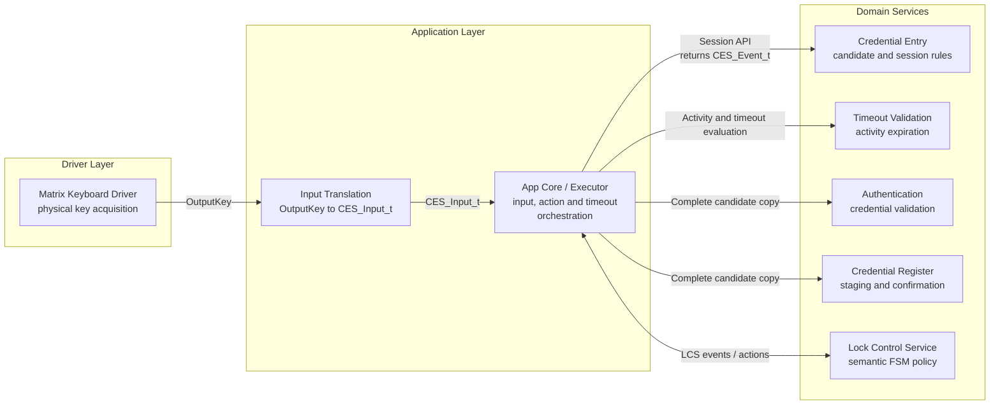
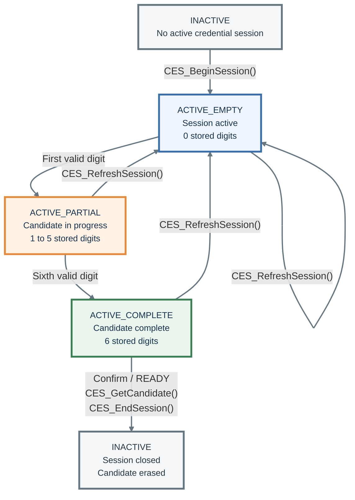
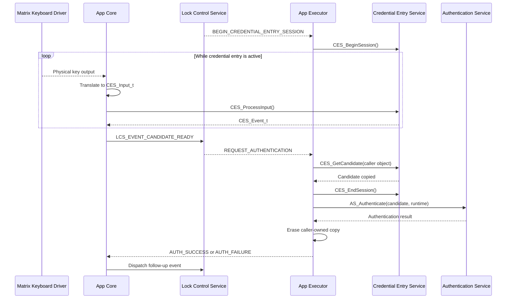

<h1 align="left">Credential Entry Service</h1>

<p align="left">
  <big>
    Synchronous and hardware-independent domain service for managing<br>
    fixed-length credential-entry sessions in embedded electronic-lock systems.
  </big>
</p>

> [!IMPORTANT]
> The Credential Entry Service manages only the construction and lifecycle of a candidate credential. When requested, it copies a complete candidate into caller-provided storage for authentication, registration staging or confirmation validation. It does not read the physical keyboard, validate credentials, manage inactivity timeouts, control the lock actuator, or produce display, LED, or buzzer effects.

---

## Table of Contents

* [1. Overview](#1-overview)
* [2. Features](#2-features)
* [3. Architecture](#3-architecture)

  * [3.1 Layer Placement](#31-layer-placement)
  * [3.2 Application Integration](#32-application-integration)
* [4. Directory Structure](#4-directory-structure)
* [5. Service Responsibilities](#5-service-responsibilities)

  * [5.1 Responsibilities](#51-responsibilities)
  * [5.2 Explicit Non-Responsibilities](#52-explicit-non-responsibilities)
* [6. Dependencies](#6-dependencies)
* [7. Public Data Model](#7-public-data-model)

  * [7.1 Credential Length](#71-credential-length)
  * [7.2 Digit and Length Types](#72-digit-and-length-types)
  * [7.3 Operation Status](#73-operation-status)
  * [7.4 Input Kind](#74-input-kind)
  * [7.5 Input Command](#75-input-command)
  * [7.6 Domain Events](#76-domain-events)
  * [7.7 Candidate Copy Object](#77-candidate-copy-object)
* [8. Session Model](#8-session-model)

  * [8.1 Session States](#81-session-states)
  * [8.2 Session Invariants](#82-session-invariants)
* [9. Input Processing Rules](#9-input-processing-rules)

  * [9.1 Digit Input](#91-digit-input)
  * [9.2 Confirm Input](#92-confirm-input)
  * [9.3 Clear or Cancel Input](#93-clear-or-cancel-input)
  * [9.4 Ignored Input](#94-ignored-input)
  * [9.5 Application Activity Policy](#95-application-activity-policy)
* [10. API Reference](#10-api-reference)

  * [10.1 CES_BeginSession](#101-ces_beginsession)
  * [10.2 CES_ProcessInput](#102-ces_processinput)
  * [10.3 CES_GetCurrentLength](#103-ces_getcurrentlength)
  * [10.4 CES_GetCandidate](#104-ces_getcandidate)
  * [10.5 CES_RefreshSession](#105-ces_refreshsession)
  * [10.6 CES_EndSession](#106-ces_endsession)
* [11. Operation Flow](#11-operation-flow)

  * [11.1 Credential-Entry Flow](#111-credential-entry-flow)
  * [11.2 Timeout Integration](#112-timeout-integration)
* [12. Usage Example](#12-usage-example)
* [13. Design Decisions](#13-design-decisions)

  * [13.1 Synchronous Processing](#131-synchronous-processing)
  * [13.2 Singleton Service](#132-singleton-service)
  * [13.3 Semantic Input Boundary](#133-semantic-input-boundary)
  * [13.4 Domain Events](#134-domain-events)
  * [13.5 Separation of Time and Authentication](#135-separation-of-time-and-authentication)
  * [13.6 Static Storage](#136-static-storage)
* [14. Error Handling](#14-error-handling)
* [15. Concurrency Model](#15-concurrency-model)
* [16. Security Considerations](#16-security-considerations)
* [17. Validation Checklist](#17-validation-checklist)
* [18. Limitations](#18-limitations)
* [19. License](#19-license)

---

## 1. Overview

The Credential Entry Service is a domain-level component responsible for managing one candidate credential-entry session.

The service receives semantic commands from the application layer, accepts normalized decimal digits, stores them in a fixed-size internal buffer, and reports the outcome of each command through `CES_Event_t`.

The service is independent from the Matrix Keyboard Driver. It does not receive physical keyboard codes and does not know which physical key represents a digit, confirmation, clearing, or cancellation. The application translates the keyboard output into `CES_Input_t` before invoking the service.

The service is also independent from authentication, timeout, user-interface and actuator-control policies. The Lock Control Service decides semantic product transitions, App Core maps input and timeout outcomes, and App Executor invokes the required lifecycle and authentication operations.

The acronym `CES` means **Credential Entry Service** and is used as the prefix for every public symbol exposed by this module.

---

## 2. Features

- Fixed-length candidate credential with exactly six decimal digits.
- Explicit credential-entry session lifecycle.
- In-place session refresh that erases the candidate without ending the session.
- Semantic input commands independent from physical keyboard codes.
- Validation of normalized decimal digits from `0U` through `9U`.
- Candidate-length tracking.
- Explicit confirmation of complete candidates.
- Detection of incomplete confirmation attempts.
- Combined clear-or-cancel behavior.
- Domain events for application orchestration.
- Copy-out retrieval of a complete candidate into caller-owned storage.
- Singleton service state.
- Synchronous and deterministic processing.
- Static internal storage.
- No dynamic memory allocation.
- No direct hardware access.
- No RTOS dependency.
- No blocking operations.

---

## 3. Architecture

### 3.1 Layer Placement

The Credential Entry Service belongs to the hardware-independent domain-services layer.

It sits above physical input acquisition and below the application orchestration boundary:



The dependency direction preserves the following boundaries:

- The Matrix Keyboard Driver reports physical input without knowing the credential-entry policy.
- The application translates physical key codes into semantic CES commands.
- LCS decides the semantic phase; App Executor begins, refreshes or ends CES in response to the selected action.
- The Credential Entry Service owns only the candidate and session-local rules.
- App Core owns the active inactivity timeout and delegates elapsed arithmetic to the Timeout Validation Service.
- App Executor passes only a complete copied candidate to Authentication or Credential Register processing.

### 3.2 Application Integration

The application is responsible for orchestrating the service in the following order:

1. Read the keyboard through the Matrix Keyboard Driver.
2. Translate the physical key output into `CES_Input_t`.
3. Pass the semantic command to `CES_ProcessInput()`.
4. Handle local rendering/timing outcomes in App Core or translate the event into an LCS semantic event.
5. Restart credential-entry timing after an accepted digit or through an LCS-selected refresh action.
6. Render masked credential-entry feedback when required.
7. Provide a caller-owned `CES_Candidate_t` object and request a candidate copy only after `CES_EVENT_READY`.
8. Immediately end the CES session after a successful candidate copy.
9. Pass the copied candidate to Authentication, CRS staging or CRS confirmation validation according to the LCS-selected action.
10. Erase the caller-owned candidate copy after its synchronous consumer finishes.

The Credential Entry Service never calls the Matrix Keyboard Driver, Timeout Validation Service, Authentication Service, App Core, App Executor or Lock Control Service directly.

---

## 4. Directory Structure

```text
Services/
|
└── Credential_Entry/
    |
    ├── Inc/
    │   └── Credential_Entry_Service.h
    |
    ├── Src/
    │   └── Credential_Entry_Service.c
    |
    └── README.md
```

The public header contains the semantic input model, events, candidate copy object, operation status, and API declarations.

The source file owns the singleton runtime state and all private candidate-processing rules.

---

## 5. Service Responsibilities

### 5.1 Responsibilities

The Credential Entry Service is responsible for:

- Starting one credential-entry session.
- Ending the active credential-entry session.
- Clearing residual candidate data when a session begins or ends.
- Receiving semantic credential-entry commands.
- Validating normalized decimal digit values.
- Appending valid digits while capacity remains available.
- Tracking the number of accepted candidate digits.
- Detecting whether the candidate contains exactly six digits.
- Reporting incomplete confirmation attempts.
- Clearing a non-empty candidate.
- Cancelling an empty credential-entry session.
- Preserving state when an input cannot be accepted.
- Copying a complete candidate into caller-provided storage for immediate authentication or registration processing.

### 5.2 Explicit Non-Responsibilities

The Credential Entry Service is **not responsible** for:

- Reading the Matrix Keyboard Driver.
- Interpreting physical keyboard scan codes.
- Mapping physical keys to product actions.
- Performing keyboard debounce or edge detection.
- Measuring elapsed time.
- Maintaining an activity timestamp.
- Detecting inactivity timeout.
- Validating the candidate against the configured credential.
- Counting failed authentication attempts.
- Applying lockout policy.
- Controlling the lock actuator.
- Rendering candidate digits or masking characters.
- Controlling the LCD, LEDs, or buzzer.
- Dispatching global application events.
- Performing application event dispatch or Lock Control state transitions.
- Creating tasks, queues, timers, or other RTOS objects.

---

## 6. Dependencies

The public interface depends only on the fixed-width integer types provided by:

```c
#include "stdint.h"
```

The private implementation also uses standard C facilities for:

- Boolean state.
- Array indexing and size representation.
- Candidate-buffer clearing.

The service has no dependency on:

- STM32 HAL or LL.
- CMSIS.
- FreeRTOS.
- Matrix Keyboard Driver types.
- Platform GPIO, I2C, PWM, or time interfaces.
- Display, LED, buzzer, actuator, timeout, or authentication services.

---

## 7. Public Data Model

### 7.1 Credential Length

The V1 credential model requires exactly six decimal digits:

```c
#define CES_CREDENTIAL_LENGTH (6U)
```

The macro defines:

- The capacity of the internal candidate buffer.
- The maximum value of `CES_Length_t` during an active session.
- The exact length required for confirmation to produce `CES_EVENT_READY`.

An additional digit received after the candidate reaches this length does not modify the candidate and produces `CES_EVENT_NONE`.

### 7.2 Digit and Length Types

`CES_Digit_t` represents one normalized decimal digit:

```c
typedef uint8_t CES_Digit_t;
```

Valid values are in the inclusive range from `0U` through `9U`.

The value is numeric. It is not an ASCII character and is not a Matrix Keyboard Driver key code.

`CES_Length_t` represents the number of valid digits currently stored:

```c
typedef uint8_t CES_Length_t;
```

During an active session its valid range is from `0U` through `CES_CREDENTIAL_LENGTH`. `CES_GetCurrentLength()` uses `0xFFU` as the separate inactive-session sentinel.

### 7.3 Operation Status

`CES_OpStatus_t` reports whether a lifecycle or query operation satisfied its API preconditions:

```c
typedef enum
{
    CES_OPERATION_OK,
    CES_OPERATION_FAIL

} CES_OpStatus_t;
```

| Status | Description |
|---|---|
| `CES_OPERATION_OK` | The requested API operation completed successfully. |
| `CES_OPERATION_FAIL` | The operation could not be completed because its preconditions were not satisfied. |

`CES_OpStatus_t` is distinct from `CES_Event_t`:

- `CES_OpStatus_t` reports API-level execution success or failure.
- `CES_Event_t` reports the domain outcome of a processed semantic command.

### 7.4 Input Kind

`CES_InputKind_t` defines the semantic commands accepted by the service:

```c
typedef enum
{
    CES_INPUT_KIND_NONE,
    CES_INPUT_KIND_DIGIT,
    CES_INPUT_KIND_CONFIRM,
    CES_INPUT_KIND_CLEAR_CANCEL

} CES_InputKind_t;
```

| Input Kind | Description |
|---|---|
| `CES_INPUT_KIND_NONE` | No semantic credential-entry command is available. |
| `CES_INPUT_KIND_DIGIT` | Requests the insertion of one normalized decimal digit. |
| `CES_INPUT_KIND_CONFIRM` | Requests confirmation of the current candidate. |
| `CES_INPUT_KIND_CLEAR_CANCEL` | Clears a non-empty candidate or cancels an empty session. |

These values represent product intent after application-layer translation. They do not expose physical keyboard layout or driver-specific key codes.

### 7.5 Input Command

`CES_Input_t` associates a semantic command kind with its optional decimal digit:

```c
typedef struct
{
    CES_InputKind_t Kind;
    CES_Digit_t     Digit;

} CES_Input_t;
```

| Member | Description |
|---|---|
| `Kind` | Semantic category of the application command. |
| `Digit` | Normalized decimal value used only when `Kind` is `CES_INPUT_KIND_DIGIT`. |

When `Kind` is not `CES_INPUT_KIND_DIGIT`, the `Digit` member is ignored.

The application should filter unsupported physical keys before constructing this object. The service still preserves its state when an invalid digit or unsupported input kind is received.

### 7.6 Domain Events

`CES_Event_t` reports the observable outcome of `CES_ProcessInput()`:

```c
typedef enum
{
    CES_EVENT_NONE,
    CES_EVENT_INPUT_ACCEPTED,
    CES_EVENT_INCOMPLETE,
    CES_EVENT_READY,
    CES_EVENT_CLEARED,
    CES_EVENT_CANCELLED

} CES_Event_t;
```

| Event | Candidate Effect | Session Effect | Meaning |
|---|---|---|---|
| `CES_EVENT_NONE` | No change | No change | The input caused no observable CES state change. |
| `CES_EVENT_INPUT_ACCEPTED` | One digit appended | Remains active | A valid digit was accepted while capacity was available. |
| `CES_EVENT_INCOMPLETE` | No change | Remains active | Confirmation was requested before six digits were entered. |
| `CES_EVENT_READY` | No change | Remains active | A complete six-digit candidate was confirmed. |
| `CES_EVENT_CLEARED` | Candidate erased | Remains active | Clear-or-cancel was requested while the candidate was non-empty. |
| `CES_EVENT_CANCELLED` | Candidate erased | Becomes inactive | Clear-or-cancel was requested while the candidate was empty. |

`CES_EVENT_READY` does not authenticate, stage or validate the credential and does not automatically end the session. App Core translates it to `LCS_EVENT_CANDIDATE_READY`; the LCS-selected action then lets App Executor obtain the candidate and perform the phase-appropriate downstream operation.

### 7.7 Candidate Copy Object

`CES_Candidate_t` is a caller-owned object that stores a fixed-size copy of a complete candidate credential:

```c
typedef struct
{
    CES_Digit_t  Digits[CES_CREDENTIAL_LENGTH];
    CES_Length_t Length;

}CES_Candidate_t;
```

| Member   | Description                                                                            |
| :------- | :------------------------------------------------------------------------------------- |
| `Digits` | Fixed-size array containing the copied candidate digits in their original entry order. |
| `Length` | Number of valid candidate digits stored in `Digits` after a successful copy.           |

`CES_Candidate_t` is neither a descriptor nor a view of the CES internal buffer. The credential storage is embedded directly in the caller-owned object, and its capacity is defined at compile time by `CES_CREDENTIAL_LENGTH`.

Before calling `CES_GetCandidate()`, the application shall:

* Provide a valid `CES_Candidate_t` object.
* Call the function only after `CES_ProcessInput()` returns `CES_EVENT_READY`.
* Keep the object available until its synchronous authentication or registration consumer and credential erasure are complete.

The caller does not need to allocate a separate digit buffer, assign a destination pointer or provide a capacity value.

On success, the service:

* Copies the complete internal candidate into `Candidate->Digits` in its original entry order.
* Sets `Candidate->Length` to `CES_CREDENTIAL_LENGTH`.
* Leaves the internal candidate unchanged.
* Leaves the credential-entry session active.
* Retains ownership of its internal candidate storage.
* Does not allocate memory or transfer internal-buffer ownership.

After a successful copy for authentication, App Executor calls `CES_EndSession()` before comparing the caller-owned copy. Registration actions instead use `CES_RefreshSession()` or a later terminal cleanup according to their phase.

The copied credential remains valid independently from later CES operations because it is stored directly in the caller-owned `CES_Candidate_t` object. Consequently, `CES_EndSession()` erases only the internal CES candidate.

The caller is responsible for erasing the complete `CES_Candidate_t` object immediately after its synchronous downstream consumer is finished. Candidate digits shall not be logged, displayed or retained in long-lived application storage.

---

## 8. Session Model

### 8.1 Session States

The service owns one internal session with two externally observable lifecycle conditions:

| Session Condition | Candidate Length | Accepted Operations |
|---|---:|---|
| Inactive | `0U` | `CES_BeginSession()` |
| Active and empty | `0U` | Digit, confirm, clear-or-cancel, `CES_GetCurrentLength()`, `CES_RefreshSession()`, `CES_EndSession()` |
| Active and partial | `1U` to `5U` | Digit, confirm, clear-or-cancel, `CES_GetCurrentLength()`, `CES_RefreshSession()`, `CES_EndSession()` |
| Active and complete | `6U` | Confirm, clear-or-cancel, `CES_GetCurrentLength()`, `CES_GetCandidate()`, `CES_RefreshSession()`, `CES_EndSession()` |

The session lifecycle is represented below:



### 8.2 Session Invariants

The following invariants apply throughout service operation:

- Only one session can be active at a time.
- Starting a session while one is already active fails.
- Ending a session while none is active fails.
- A successful session start establishes an empty candidate.
- A successful session end clears the candidate.
- A successful session refresh clears the candidate while preserving the active session.
- Candidate length never exceeds `CES_CREDENTIAL_LENGTH`.
- Every stored candidate element is a decimal digit from `0U` through `9U`.
- Candidate fullness is determined by length, never by digit values.
- A value of `0U` is a valid candidate digit and shall not be treated as an empty-buffer marker.
- Processing input while the session is inactive does not modify state.
- `CES_EVENT_READY` is possible only after confirmation of a six-digit candidate.
- Copying a candidate does not modify the internal candidate, its length, or the session state.

---

## 9. Input Processing Rules

### 9.1 Digit Input

When `Kind` is `CES_INPUT_KIND_DIGIT`, the service evaluates both digit validity and candidate capacity.

| Condition | Result | State Change |
|---|---|---|
| Digit is between `0U` and `9U`, and length is below six | `CES_EVENT_INPUT_ACCEPTED` | Digit is appended and length increments by one. |
| Digit is outside the decimal range | `CES_EVENT_NONE` | Candidate and session remain unchanged. |
| Candidate already contains six digits | `CES_EVENT_NONE` | Candidate and session remain unchanged. |
| Session is inactive | `CES_EVENT_NONE` | Candidate and session remain unchanged. |

The sixth accepted digit fills the candidate but does not automatically produce `CES_EVENT_READY`. The user must explicitly request confirmation.

### 9.2 Confirm Input

When `Kind` is `CES_INPUT_KIND_CONFIRM`, the current candidate length determines the result:

| Candidate Length | Result | State Change |
|---:|---|---|
| `0U` through `5U` | `CES_EVENT_INCOMPLETE` | Candidate remains unchanged and the session remains active. |
| `6U` | `CES_EVENT_READY` | Candidate remains available and the session remains active. |

Explicit confirmation allows the user to clear a complete candidate before authentication or registration processing if necessary.

### 9.3 Clear or Cancel Input

`CES_INPUT_KIND_CLEAR_CANCEL` has context-dependent behavior:

| Candidate Condition | Result | Candidate Effect | Session Effect |
|---|---|---|---|
| Non-empty | `CES_EVENT_CLEARED` | All digits are erased | Remains active |
| Empty | `CES_EVENT_CANCELLED` | Remains empty | Session ends |

This rule provides a compact V1 interaction model:

- The first clear-or-cancel command removes an existing candidate.
- A clear-or-cancel command received while already empty leaves credential entry.

### 9.4 Ignored Input

The service produces `CES_EVENT_NONE` when no credential-entry state change occurs, including:

- `CES_INPUT_KIND_NONE`.
- An unsupported input kind.
- An invalid decimal digit.
- A digit received after the candidate becomes full.
- Any input received while the session is inactive.

Ignored input does not change the candidate, candidate length, or session state.

### 9.5 Application Activity Policy

The service does not own an activity timestamp. The application interprets the returned event and decides whether the Timeout Validation Service must be notified.

The V1 application policy is:

| CES Event | Render Credential Feedback | Refresh Activity Timestamp | Application Action |
|---|---|---|---|
| `CES_EVENT_NONE` | No | No | Ignore the input. |
| `CES_EVENT_INPUT_ACCEPTED` | Yes | Yes | Render one additional masking character. |
| `CES_EVENT_INCOMPLETE` | Yes | Yes, through the selected refresh action | LCS selects a phase-specific refresh; App Executor calls `CES_RefreshSession()` and restarts the entry timeout. |
| `CES_EVENT_CLEARED` | Yes | No | Render an empty candidate field without restarting the current timeout. |
| `CES_EVENT_READY` | Transition-dependent | Not required | Dispatch candidate-ready; LCS selects authentication, staging or confirmation validation for the active phase. |
| `CES_EVENT_CANCELLED` | Transition-dependent | Not required | Dispatch cancellation; LCS selects normal cleanup or mandatory first-boot refresh for the active phase. |

Physical keyboard outputs that do not map to any supported semantic command should be discarded by the application before calling `CES_ProcessInput()`.

---

## 10. API Reference

### 10.1 CES_BeginSession

Starts a new credential-entry session.

#### Function Signature

```c
CES_OpStatus_t CES_BeginSession(void);
```

#### Return

| Return Value | Description |
|---|---|
| `CES_OPERATION_OK` | A new empty session was started successfully. |
| `CES_OPERATION_FAIL` | Another session is already active. |

On success, all residual candidate data is erased before the session becomes active.

### 10.2 CES_ProcessInput

Processes one semantic credential-entry command and returns its domain outcome.

#### Function Signature

```c
CES_Event_t CES_ProcessInput(
    const CES_Input_t* Input
);
```

#### Parameters

| Parameter | Description |
|---|---|
| `Input` | Pointer to the semantic command supplied by the application. |

#### Return

| Return Value | Description |
|---|---|
| `CES_EVENT_NONE` | The command produced no observable state change. |
| `CES_EVENT_INPUT_ACCEPTED` | A valid digit was appended. |
| `CES_EVENT_INCOMPLETE` | Confirmation was requested with fewer than six digits. |
| `CES_EVENT_READY` | A six-digit candidate was confirmed. |
| `CES_EVENT_CLEARED` | A non-empty candidate was erased. |
| `CES_EVENT_CANCELLED` | An empty session was cancelled and ended. |

`Input` must point to a valid `CES_Input_t` object for the complete duration of the call. The service does not retain the caller's pointer after returning.

### 10.3 CES_GetCurrentLength

Returns the number of valid digits currently stored in the candidate.

#### Function Signature

```c
CES_Length_t CES_GetCurrentLength(void);
```

#### Return

| Return Value | Description |
|---|---|
| `0xFFU` | No session is active. |
| `0U` through `6U` | Number of accepted candidate digits in the active session. |

The function does not expose the candidate values.

### 10.4 CES_GetCandidate

Copies a complete candidate into a caller-owned `CES_Candidate_t` object for immediate authentication or registration processing.

#### Function Signature

```c
CES_OpStatus_t CES_GetCandidate(
    CES_Candidate_t* Candidate
);
```

#### Parameters

| Parameter   | Description                                                                         |
| :---------- | :---------------------------------------------------------------------------------- |
| `Candidate` | Pointer to the caller-owned object that receives the complete candidate credential. |

#### Return

| Return Value         | Description                                                                          |
| :------------------- | :----------------------------------------------------------------------------------- |
| `CES_OPERATION_OK`   | The complete candidate was copied successfully.                                      |
| `CES_OPERATION_FAIL` | `Candidate` is `NULL`, no session is active or the internal candidate is incomplete. |

Before calling the function:

* `Candidate` shall point to a valid `CES_Candidate_t` object.
* The function shall be called only after `CES_ProcessInput()` returns `CES_EVENT_READY`.

The caller does not need to allocate a separate digit buffer or provide its capacity. `CES_Candidate_t::Digits` is a fixed-size array with capacity for exactly `CES_CREDENTIAL_LENGTH` digits.

On success:

* The internal candidate is copied into `Candidate->Digits` in its original entry order.
* `Candidate->Length` is set to `CES_CREDENTIAL_LENGTH`.
* The internal candidate remains unchanged.
* The credential-entry session remains active.
* Ownership of `Candidate` and its credential storage remains with the caller.

The function does not authenticate the candidate and does not end the credential-entry session. Sequencing confirmation before candidate retrieval remains an application/LCS responsibility, while CES verifies that an active complete candidate is available.

After a successful authentication copy, App Executor immediately calls `CES_EndSession()` before passing the caller-owned candidate to the Authentication Service. Registration actions may instead refresh or retain the session until their phase result is processed. None of those operations modifies the copied candidate.

The caller is responsible for erasing the complete `CES_Candidate_t` object immediately after its synchronous downstream consumer is finished.

### 10.5 CES_RefreshSession

Erases the current candidate while keeping the active credential-entry session available for a fresh attempt.

#### Function Signature

```c
CES_OpStatus_t CES_RefreshSession(void);
```

#### Return

| Return Value | Description |
|---|---|
| `CES_OPERATION_OK` | The candidate was erased and the session remains active. |
| `CES_OPERATION_FAIL` | No session is active. |

The function does not start a new session, restart the application-owned timeout or update presentation by itself. App Executor uses it for incomplete entry, registration-phase refresh and confirmation-mismatch flows, then separately restarts the credential-entry timeout and applies the screen/sound policy selected by the LCS action.

### 10.6 CES_EndSession

Ends the active credential-entry session and erases candidate data.

#### Function Signature

```c
CES_OpStatus_t CES_EndSession(void);
```

#### Return

| Return Value | Description |
|---|---|
| `CES_OPERATION_OK` | The active session was ended and cleared. |
| `CES_OPERATION_FAIL` | No session is active. |

App Executor calls this function whenever the application leaves credential entry. In the normal authentication flow, it is called immediately after `CES_GetCandidate()` completes successfully and before the copied credential is passed to the Authentication Service. It is also called during inactivity-timeout handling, registration cleanup, fault handling or any other product-level transition that leaves credential entry.

---

## 11. Operation Flow

### 11.1 Credential-Entry Flow



App Core handles `INPUT_ACCEPTED` and `CLEARED` locally for timing/presentation and maps phase-changing CES outcomes into semantic LCS events. LCS decides the transition; App Executor performs the selected lifecycle, authentication, staging or confirmation action. The sequence above shows the normal authentication branch; registration branches use the same candidate-copy contract with CRS.

### 11.2 Timeout Integration

The Credential Entry Service does not measure time and does not evaluate timeout conditions.

The timeout flow is:

1. App Executor starts the application-owned credential-entry timeout when an LCS action begins or refreshes an entry phase.
2. App Core restarts the same timeout after `CES_EVENT_INPUT_ACCEPTED`; a local clear does not currently restart it.
3. `App_Dispatch()` evaluates the active interval through the Timeout Validation Service.
4. When expiration is reported, App Core cancels the runtime and dispatches `LCS_EVENT_ENTRY_TIMEOUT`.
5. LCS performs the state-specific timeout transition and returns a cleanup action.
6. App Executor calls `CES_EndSession()` to erase the candidate when that transition leaves the active entry phase.

The Timeout Validation Service does not directly modify CES state. LCS remains the authoritative product FSM while App Core and App Executor own timing and concrete session operations.

---

## 12. Usage Example

The following example illustrates the intended integration boundary. Keyboard translation and application state transitions remain outside the service:

```c
CES_Input_t input =
{
    .Kind  = CES_INPUT_KIND_DIGIT,
    .Digit = 5U
};

if (CES_BeginSession() != CES_OPERATION_OK)
{
    return;
}

CES_Event_t event = CES_ProcessInput(&input);

if (event == CES_EVENT_INPUT_ACCEPTED)
{
    /*
     * App Core renders one additional mask character and restarts
     * the application-owned credential-entry timeout.
     */
}
```

When confirmation produces `CES_EVENT_READY`, the caller provides destination storage and requests a candidate copy for one immediate synchronous consumer:

```c
CES_Candidate_t candidate = {0};

if (event == CES_EVENT_READY)
{
    if (CES_GetCandidate(&candidate) == CES_OPERATION_OK)
    {
        CES_EndSession();

        /*
         * Pass candidate.Digits and candidate.Length to Authentication or
         * Credential Register processing without logging or displaying them.
         */

        /*
         * Erase the complete candidate object after its consumer because
         * CES_EndSession() clears only the service-owned internal candidate.
         */
    }
}
```

The application owns `candidate` and its embedded fixed-size `Digits` array throughout this flow. `CES_GetCandidate()` neither allocates storage nor transfers ownership of its internal buffer.

This example intentionally omits Matrix Keyboard Driver access, timeout implementation, authentication logic and LCS event/action dispatch because they belong outside CES.

---

## 13. Design Decisions

### 13.1 Synchronous Processing

Every CES operation executes synchronously and returns immediately.

The service does not:

- Wait for keyboard input.
- Block for user interaction.
- Delay for feedback duration.
- Start background processing.
- Create an internal event queue.

This keeps execution bounded and allows the serialized application owner to control when service logic runs.

### 13.2 Singleton Service

The module owns one static internal runtime instance and exposes an API without a public handle.

This model is appropriate for V1 because the product supports only one credential-entry session and one candidate at a time.

Consequences of this decision include:

- Only one session can exist.
- Instance ownership is implicit at module scope.
- The API remains small.
- Multiple independent credential-entry contexts are not supported.
- Calls must be serialized by the application architecture.

### 13.3 Semantic Input Boundary

CES accepts semantic commands instead of Matrix Keyboard Driver output types.

```text
Physical key code
       |
       v
Application translation
       |
       v
CES_Input_t
       |
       v
Credential Entry Service
```

This prevents domain rules from depending on:

- Keyboard dimensions.
- Physical key positions.
- Hexadecimal driver codes.
- Debounce implementation.
- A specific input device.

The same CES contract could later receive commands translated from another trusted input source without changing the service logic.

### 13.4 Domain Events

The service returns `CES_Event_t` instead of dispatching LCS events directly.

CES events describe local domain outcomes. App Core either handles them locally or translates them to LCS; the resulting application flow may cause:

- A product-state transition.
- Display rendering.
- Status indication.
- Sound feedback.
- Activity-timestamp refresh.
- Authentication processing.

This preserves LCS as the owner of the high-level state machine without coupling CES to LCS types.

### 13.5 Separation of Time and Authentication

Time validation and credential authentication are deliberately separate services.

CES therefore has no knowledge of:

- Current system time.
- Session-start timestamp.
- Last-activity timestamp.
- Inactivity duration.
- Configured reference credential.
- Authentication result.
- Failed-attempt count.
- Lockout duration.

This separation keeps credential entry deterministic and hardware-independent.

### 13.6 Static Storage

The candidate is stored in a fixed-size internal array.

This provides:

- Deterministic memory use.
- No heap dependency.
- A fixed upper bound on candidate size.
- Straightforward candidate erasure.
- No internal-buffer ownership transfer.

Candidate fullness must be derived from the tracked length. Candidate digit values cannot act as empty-slot sentinels because `0U` is a valid decimal digit.

When a downstream operation is requested, `CES_GetCandidate()` copies the internal candidate into a separate application-owned object. This lets App Executor end or refresh the CES session without invalidating authentication or registration input, but it also creates a second sensitive copy that the caller must erase explicitly.

---

## 14. Error Handling

The service distinguishes API misuse from normal domain outcomes.

`CES_OpStatus_t` reports lifecycle and candidate-access failures:

- Beginning a session while one is already active returns `CES_OPERATION_FAIL`.
- Refreshing a session while none is active returns `CES_OPERATION_FAIL`.
- Ending a session while none is active returns `CES_OPERATION_FAIL`.
- Requesting a candidate without an active complete candidate returns `CES_OPERATION_FAIL`.

Pointer and caller-owned object validity are API preconditions:

- `CES_ProcessInput()` requires a valid `Input` pointer.
- `CES_GetCandidate()` requires a valid `Candidate` pointer.
- A valid `CES_Candidate_t` always embeds writable capacity for exactly six digits.

The service cannot validate the lifetime or writability of a non-NULL object supplied through C pointer semantics. The application must satisfy those preconditions before invoking the API.

`CES_Event_t` reports input-processing outcomes:

- Unsupported commands return `CES_EVENT_NONE`.
- Invalid decimal digits return `CES_EVENT_NONE`.
- Digits submitted after capacity is reached return `CES_EVENT_NONE`.
- Input submitted while the session is inactive returns `CES_EVENT_NONE`.

`CES_EVENT_NONE` is intentionally non-diagnostic. It communicates that no observable credential-entry state change occurred. The application shall not render feedback or refresh activity timing for this event.

---

## 15. Concurrency Model

The service is not internally thread-safe.

All public functions shall be called from the serialized application context used by `App_ReadInput()`, App Core dispatch and App Executor. The current firmware main loop uses no FreeRTOS task boundary.

The following are not supported without external serialization:

- Concurrent calls from multiple tasks.
- Calls from both task and interrupt context.
- Direct CES access from independent services.
- Candidate copy-out while another context modifies or ends the session.

App Core shall translate expiration into `LCS_EVENT_ENTRY_TIMEOUT`; the Timeout Validation Service shall not call `CES_EndSession()` directly from another execution context.

---

## 16. Security Considerations

The candidate credential is sensitive transient data.

The application and all consuming services shall follow these rules:

- Never log raw candidate digits.
- Never print candidate digits through debug telemetry.
- Never render raw candidate digits on the display.
- Render masking characters only when showing entry progress.
- Do not copy the candidate into long-lived application state.
- Erase the caller-provided candidate object immediately after authentication or registration processing.
- End the session after success, failure, cancellation, timeout, fault, or any transition leaving credential entry.
- Ensure the internal candidate is cleared when a session begins, is explicitly cleared, or ends.
- Remember that ending the CES session does not erase caller-owned candidate copies.
- Authenticate access candidates only through the Authentication Service and validate registration confirmation only through CRS.

The service manages transient candidate entry only. It does not provide cryptographic credential storage, tamper resistance, secure-element integration, or side-channel protection.

---

## 17. Validation Checklist

The minimum behavioral validation for the service includes:

- A session begins successfully from the inactive state.
- A second begin request fails while a session is active.
- Refreshing an inactive session fails.
- Refreshing an active empty, partial or complete session succeeds, erases all digits and preserves the active session.
- `CES_GetCurrentLength()` returns `0U` for an active empty or refreshed session and `0xFFU` only while inactive.
- Every decimal digit from `0U` through `9U` is accepted.
- Credentials containing one or more `0U` digits can still become complete.
- A value greater than `9U` is ignored without state modification.
- Accepted digits increment length exactly once.
- Candidate length never exceeds six.
- A seventh digit is ignored.
- Confirmation with zero through five digits produces `CES_EVENT_INCOMPLETE`.
- Confirmation with six digits produces `CES_EVENT_READY`.
- Confirmation does not modify the candidate.
- Clear-or-cancel with a non-empty candidate produces `CES_EVENT_CLEARED`.
- Clearing resets length to zero while keeping the session active.
- Clear-or-cancel with an empty candidate produces `CES_EVENT_CANCELLED`.
- Cancellation ends the session.
- Input received while the session is inactive produces `CES_EVENT_NONE`.
- Ending an active session clears candidate data.
- Ending an inactive session fails.
- Candidate copy-out fails while the internal candidate is incomplete or the session is inactive.
- Candidate copy-out succeeds after a complete confirmed entry.
- The caller-provided destination receives all six digits in their original entry order.
- `Candidate->Length` is set to `CES_CREDENTIAL_LENGTH` after a successful copy.
- Candidate copy-out does not modify the internal candidate or session state.
- Ending the CES session clears internal storage without modifying the caller-owned copy.
- The caller-owned copy is erased after authentication or registration processing.
- `CES_EVENT_NONE` does not cause rendering or activity-timestamp refresh in application integration.

These cases may be validated through debugger-driven tests, a host-side harness, or focused unit tests according to the project phase.

---

## 18. Limitations

Current V1 limitations include:

- Exactly one CES instance is supported.
- Exactly one credential-entry session can be active.
- Credentials contain exactly six decimal digits.
- Only numeric digits are supported.
- Confirmation is explicit and is not automatically triggered by the sixth digit.
- Clear-or-cancel erases the entire non-empty candidate; individual backspace is not supported.
- `CES_EVENT_NONE` does not distinguish between individual ignored-input reasons.
- The service is not internally thread-safe.
- Candidate copy-out is intended for one immediate synchronous authentication or registration consumer.
- The caller must provide a valid writable `CES_Candidate_t` object before candidate retrieval.
- Object lifetime and writability cannot be validated beyond the non-NULL pointer check.
- Copy-out temporarily creates a second sensitive credential representation that the caller must erase.
- Timeout validation is external.
- Authentication policy is external.
- User-interface behavior is external.
- No persistent credential storage is provided.

---

## 19. License

This module is part of the:

```text
Electronic Lock Project
```

and follows the project's license terms.
