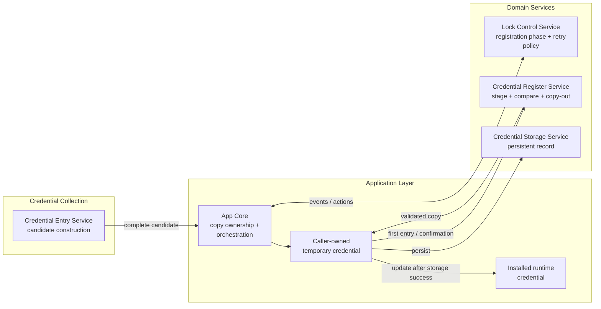
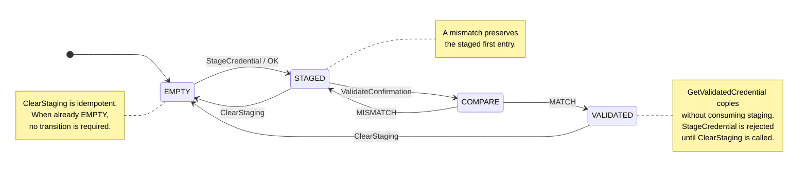
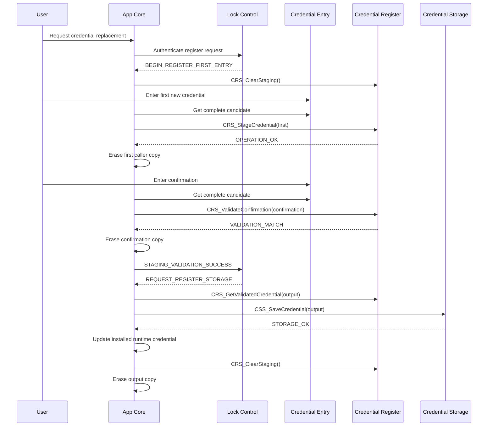
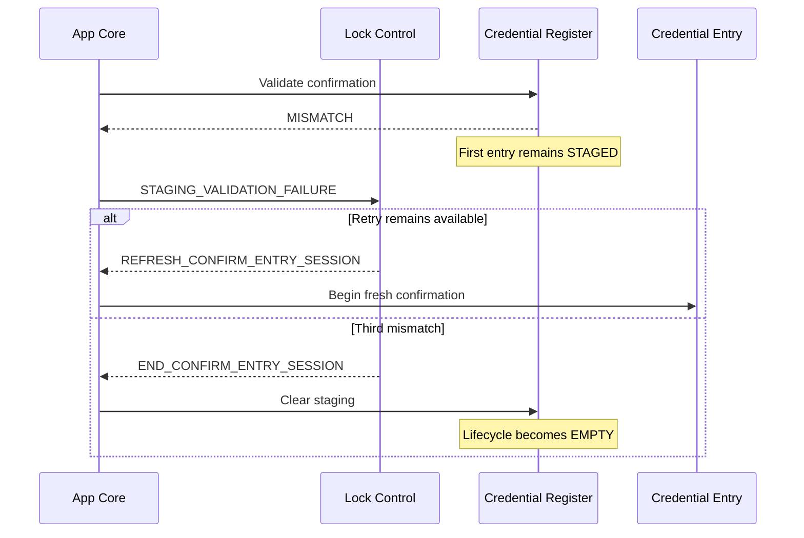

<h1 align="left">Credential Register Service</h1>

<p align="left">
  <big>
    Synchronous transient-staging service for confirming one proposed<br>
    six-digit credential before persistent storage.
  </big>
</p>

> [!IMPORTANT]
> The Credential Register Service owns only the transient copy of the first proposed credential and the comparison with its confirmation. It does not own the product registration FSM, confirmation retry count, persistent Flash record, installed runtime credential, credential-entry session or user-interface policy.

> [!NOTE]
> `EMPTY`, `STAGED` and `VALIDATED` describe the validity of the private staging buffer; they are not a second product-level state machine. The [Lock Control Service](../Lock_Control/README.md) remains the authoritative owner of registration phases and terminal routing.

---

## Table of Contents

* [1. Overview](#1-overview)
* [2. Features](#2-features)
* [3. Architecture](#3-architecture)

  * [3.1 Layer Placement](#31-layer-placement)
  * [3.2 Application Composition Boundary](#32-application-composition-boundary)
  * [3.3 Credential Data Ownership](#33-credential-data-ownership)
* [4. Directory Structure](#4-directory-structure)
* [5. Service Responsibilities](#5-service-responsibilities)

  * [5.1 Responsibilities](#51-responsibilities)
  * [5.2 Explicit Non-Responsibilities](#52-explicit-non-responsibilities)
* [6. Dependencies](#6-dependencies)

  * [6.1 Compile-Time Dependencies](#61-compile-time-dependencies)
  * [6.2 Logical Collaborators](#62-logical-collaborators)
* [7. Public Data Model](#7-public-data-model)

  * [7.1 Credential Length and Representation](#71-credential-length-and-representation)
  * [7.2 Operation Status](#72-operation-status)
  * [7.3 Confirmation Validation Result](#73-confirmation-validation-result)
* [8. Private Runtime Model](#8-private-runtime-model)

  * [8.1 Lifecycle States](#81-lifecycle-states)
  * [8.2 Runtime Handle](#82-runtime-handle)
  * [8.3 Lifecycle Transitions](#83-lifecycle-transitions)
  * [8.4 Runtime Invariants](#84-runtime-invariants)
* [9. Processing Rules](#9-processing-rules)

  * [9.1 First-Entry Staging](#91-first-entry-staging)
  * [9.2 Confirmation Validation](#92-confirmation-validation)
  * [9.3 Validated-Credential Retrieval](#93-validated-credential-retrieval)
  * [9.4 Staging Cleanup](#94-staging-cleanup)
* [10. API Reference](#10-api-reference)

  * [10.1 CRS_StageCredential](#101-crs_stagecredential)
  * [10.2 CRS_ValidateConfirmation](#102-crs_validateconfirmation)
  * [10.3 CRS_GetValidatedCredential](#103-crs_getvalidatedcredential)
  * [10.4 CRS_ClearStaging](#104-crs_clearstaging)
* [11. Lock Control Integration](#11-lock-control-integration)

  * [11.1 Action-to-Operation Mapping](#111-action-to-operation-mapping)
  * [11.2 Result-to-Event Mapping](#112-result-to-event-mapping)
  * [11.3 Integration-Fault Policy](#113-integration-fault-policy)
* [12. Operation Flows](#12-operation-flows)

  * [12.1 Authorized Credential Replacement](#121-authorized-credential-replacement)
  * [12.2 First-Boot Registration](#122-first-boot-registration)
  * [12.3 Confirmation Mismatch and Retry](#123-confirmation-mismatch-and-retry)
  * [12.4 Cancellation Timeout and Abort](#124-cancellation-timeout-and-abort)
  * [12.5 Persistent-Storage Completion](#125-persistent-storage-completion)
* [13. Usage Example](#13-usage-example)
* [14. Design Decisions](#14-design-decisions)

  * [14.1 Narrow Staging Responsibility](#141-narrow-staging-responsibility)
  * [14.2 Private Singleton](#142-private-singleton)
  * [14.3 Strict Stage-Only-When-Empty Rule](#143-strict-stage-only-when-empty-rule)
  * [14.4 Retain First Entry After Mismatch](#144-retain-first-entry-after-mismatch)
  * [14.5 Copy-Out After Validation](#145-copy-out-after-validation)
  * [14.6 Idempotent Cleanup](#146-idempotent-cleanup)
  * [14.7 Separate Operation and Validation Results](#147-separate-operation-and-validation-results)
* [15. Error Handling](#15-error-handling)
* [16. Timing and Concurrency](#16-timing-and-concurrency)
* [17. Security Considerations](#17-security-considerations)
* [18. Testing and Acceptance Criteria](#18-testing-and-acceptance-criteria)

  * [18.1 Required Host Tests](#181-required-host-tests)
  * [18.2 Integration Tests](#182-integration-tests)
  * [18.3 Definition of Done](#183-definition-of-done)
* [19. Limitations and Future Improvements](#19-limitations-and-future-improvements)
* [20. License](#20-license)

---

## 1. Overview

The Credential Register Service is a small hardware-independent domain service that temporarily retains the first entry of a proposed new credential and compares it with a later confirmation entry.

The service solves one bounded problem:

```text
first entry -> transient staging -> confirmation comparison -> validated copy
```

It does not decide when registration begins, how many confirmation mismatches are allowed or what happens after a terminal result. Those decisions remain in the Lock Control Service. It also does not write the validated credential to Flash; persistent storage remains exclusively owned by the [Credential Storage Service](../Credential_Storage/README.md).

The CRS public API is synchronous. Callers provide fixed six-byte buffers, receive an immediate status or comparison result and retain ownership of every supplied buffer. The service copies the first entry into one private static buffer and never retains a caller pointer.

The acronym `CRS` means **Credential Register Service** and prefixes every public symbol exposed by the module.

---

## 2. Features

* Staging of exactly one proposed six-digit credential.
* Normalized decimal digit representation from `0U` through `9U`.
* Full first-entry validation before private-state mutation.
* Confirmation validation before equality comparison.
* Explicit match and mismatch results.
* Preservation of the first entry across confirmation mismatches.
* Validated-only copy-out retrieval.
* Strict rejection of a second staging operation while data is already active.
* Idempotent cleanup from every private lifecycle state.
* Explicit private `EMPTY`, `STAGED` and `VALIDATED` lifecycle.
* Caller-owned input and output buffers.
* No retained caller pointers.
* Synchronous and deterministic execution.
* Fixed iteration bounds.
* Static storage only.
* No dynamic allocation.
* No hardware or STM32 HAL dependency.
* No direct CES, CSS, LCS, App Core or RTOS dependency.
* No blocking operation, task, queue, timer, mutex or semaphore.

---

## 3. Architecture

### 3.1 Layer Placement

CRS belongs to the hardware-independent Services layer. App Core is the composition boundary between the credential-entry source, transient staging, persistent storage and product FSM:



No arrow implies a direct CRS call to another service. App Core invokes each public interface and maps the synchronous result into the next application operation or LCS event.

### 3.2 Application Composition Boundary

The application performs four kinds of coordination around CRS:

1. Obtain a complete candidate copy from CES and end the corresponding CES session.
2. Pass the first candidate to `CRS_StageCredential()` or the confirmation candidate to `CRS_ValidateConfirmation()`.
3. Translate a normal match or mismatch into the corresponding LCS event.
4. Retrieve a validated copy, pass it to CSS, update runtime storage after persistent success and clear every transient copy.

CRS does not include public headers from CES, CSS or LCS. This prevents transient data management from depending on candidate-session representation, Flash-record status or product-state identifiers.

### 3.3 Credential Data Ownership

The registration path may temporarily contain several independent six-byte copies. Ownership shall remain explicit:

| Data | Owner | Lifetime | Required cleanup |
|---|---|---|---|
| CES internal candidate | Credential Entry Service | Active entry session | `CES_EndSession()` or CES session cleanup |
| App temporary candidate | App Core | One synchronous staging, comparison or persistence operation | Explicit application zeroization after final consumer |
| First-entry staging | Credential Register Service | From successful staging until terminal `CRS_ClearStaging()` | `CRS_ClearStaging()` on every terminal path |
| Persistent credential record | Credential Storage Service | Across resets until replacement | CSS persistent policy |
| Installed runtime credential | App Core or future runtime owner | Active powered runtime | Replace only after CSS success; erase on reset/fault policy |

CRS copies data; it never transfers ownership. Clearing CRS staging does not clear CES storage, App Core buffers, persistent Flash or the installed runtime credential.

---

## 4. Directory Structure

```text
Libs/Services/Credential_Register/
├── Inc/
│   └── Credential_Register_Service.h
├── Src/
│   └── Credential_Register_Service.c
└── README.md
```

| File | Responsibility |
|---|---|
| `Inc/Credential_Register_Service.h` | Public credential length, result types and synchronous staging API. |
| `Src/Credential_Register_Service.c` | Private lifecycle, singleton buffer, validation, comparison, copy-out and cleanup. |
| `README.md` | Architecture, behavioral contract, integration rules, security guidance and acceptance criteria. |

---

## 5. Service Responsibilities

### 5.1 Responsibilities

CRS is responsible for:

* Validating that caller-provided credential elements are normalized decimal digits.
* Copying one complete first entry into private transient storage.
* Rejecting staging while another staged or validated credential remains active.
* Comparing one complete confirmation against the staged first entry.
* Preserving the first entry when confirmation differs.
* Publishing a validated lifecycle after complete equality.
* Preventing retrieval before validation succeeds.
* Copying the validated credential into caller-owned storage.
* Erasing its complete private staging buffer on request.
* Restoring its lifecycle to `EMPTY` after cleanup.
* Preserving its private lifecycle when an API precondition fails.

### 5.2 Explicit Non-Responsibilities

CRS is not responsible for:

* Reading Matrix Keyboard Driver output.
* Collecting, editing or displaying credential digits.
* Beginning, refreshing or ending CES sessions.
* Authenticating the currently installed credential.
* Authorizing entry into credential registration.
* Counting confirmation mismatches.
* Enforcing the three-mismatch registration policy.
* Owning first-entry, confirmation, validation, persistence or feedback product states.
* Selecting or processing LCS events and actions.
* Saving, loading, validating or erasing persistent Flash records.
* Owning the installed runtime credential.
* Updating Authentication Service configuration.
* Measuring inactivity, feedback or operation timeouts.
* Producing display, status LED, sound or actuator effects.
* Logging credential content.

---

## 6. Dependencies

### 6.1 Compile-Time Dependencies

The public interface requires only:

```c
#include <stdint.h>
```

The implementation additionally uses:

```c
#include <stdbool.h>
#include <stddef.h>
```

The service does not include:

* STM32 HAL or LL headers.
* CMSIS peripheral definitions.
* RTOS headers.
* CES, CSS, AS, LCS or App Core headers.
* Heap or standard I/O facilities.

### 6.2 Logical Collaborators

CRS has no direct service-to-service call dependency. At the application level it participates in flows coordinated with:

* [Credential Entry Service](../Credential_Entry/README.md) for candidate collection.
* [Lock Control Service](../Lock_Control/README.md) for product phase and retry policy.
* [Credential Storage Service](../Credential_Storage/README.md) for persistent saving.
* [Application Layer](../../../App/README.md) for result translation, buffer ownership and action execution.

---

## 7. Public Data Model

### 7.1 Credential Length and Representation

```c
#define CRS_CREDENTIAL_LENGTH (6U)
```

Every credential passed to CRS is exactly six bytes. Each byte stores one numeric decimal digit:

```text
valid:   {1U, 2U, 3U, 4U, 5U, 6U}
invalid: {'1', '2', '3', '4', '5', '6'}
invalid: {1U, 2U, 3U, 4U, 5U, 10U}
```

ASCII character codes are not accepted as normalized digits. For example, ASCII `'1'` has value 49 and therefore falls outside the valid range.

CES, AS, CRS and CSS currently declare their own fixed-length constants. App Core shall ensure their V1 credential-length contracts remain equal when transferring a buffer between service boundaries.

### 7.2 Operation Status

`CRS_OpStatus_t` reports the result of staging, validated retrieval and cleanup:

| Value | Meaning |
|---|---|
| `CRS_OPERATION_OK` | The requested operation completed and its documented postcondition holds. |
| `CRS_OPERATION_INVALID_ARGUMENT` | A required pointer is `NULL` or a staged candidate contains a non-decimal value. |
| `CRS_OPERATION_INVALID_STATE` | The current private lifecycle does not permit staging or validated retrieval. |

An invalid-state result indicates an application sequencing error, not an ordinary user confirmation mismatch.

### 7.3 Confirmation Validation Result

`CRS_ValidationResult_t` separates comparison outcomes from API misuse:

| Value | Meaning | Private-state effect |
|---|---|---|
| `CRS_VALIDATION_MATCH` | Confirmation equals the staged first entry. | `STAGED → VALIDATED` |
| `CRS_VALIDATION_MISMATCH` | At least one valid digit differs. | Remains `STAGED` |
| `CRS_VALIDATION_NOT_STAGED` | Comparison was requested outside `STAGED`. | No mutation |
| `CRS_VALIDATION_INVALID_ARGUMENT` | Pointer is `NULL` or a confirmation digit is invalid. | No mutation |

Only `MATCH` and `MISMATCH` are normal domain results that App Core maps into LCS staging-validation events.

---

## 8. Private Runtime Model

### 8.1 Lifecycle States

The private `CRS_State_t` contains three values:

| State | Buffer meaning | Permitted primary operation |
|---|---|---|
| `CRS_STATE_EMPTY` | No usable staged credential exists. | `CRS_StageCredential()` |
| `CRS_STATE_STAGED` | A valid first entry awaits confirmation. | `CRS_ValidateConfirmation()` |
| `CRS_STATE_VALIDATED` | Confirmation matched; copy-out is permitted. | `CRS_GetValidatedCredential()` |

`CRS_ClearStaging()` is permitted from every state.

### 8.2 Runtime Handle

The private singleton is equivalent to:

```c
typedef struct
{
    uint8_t     Credential[CRS_CREDENTIAL_LENGTH];
    CRS_State_t State;

}CRS_Handle_t;
```

It is statically initialized with an all-zero buffer and `CRS_STATE_EMPTY`. No application-visible handle, state query or initialization call exists.

### 8.3 Lifecycle Transitions



The detailed operation table is:

| Source | Operation or result | Target | Buffer effect | Public result |
|---|---|---|---|---|
| `EMPTY` | Stage valid candidate | `STAGED` | Copy all six digits | `CRS_OPERATION_OK` |
| `EMPTY` | Stage invalid candidate | `EMPTY` | No mutation | `CRS_OPERATION_INVALID_ARGUMENT` |
| `STAGED` or `VALIDATED` | Stage any non-NULL candidate | Unchanged | No mutation | `CRS_OPERATION_INVALID_STATE` |
| `STAGED` | Validate matching confirmation | `VALIDATED` | Preserve first entry | `CRS_VALIDATION_MATCH` |
| `STAGED` | Validate different confirmation | `STAGED` | Preserve first entry | `CRS_VALIDATION_MISMATCH` |
| `STAGED` | Validate malformed confirmation | `STAGED` | No mutation | `CRS_VALIDATION_INVALID_ARGUMENT` |
| `EMPTY` or `VALIDATED` | Validate non-NULL confirmation | Unchanged | No mutation | `CRS_VALIDATION_NOT_STAGED` |
| `VALIDATED` | Get to valid destination | `VALIDATED` | Copy out; preserve private data | `CRS_OPERATION_OK` |
| `EMPTY` or `STAGED` | Get to valid destination | Unchanged | Destination unchanged | `CRS_OPERATION_INVALID_STATE` |
| Any | Clear | `EMPTY` | Write `0U` to every private digit | `CRS_OPERATION_OK` |

Pointer validation occurs before lifecycle validation. A `NULL` pointer therefore reports invalid argument regardless of current lifecycle.

### 8.4 Runtime Invariants

The implementation maintains these invariants:

1. `EMPTY` is the initial lifecycle.
2. `EMPTY` is restored only by static initialization or explicit cleanup.
3. `STAGED` and `VALIDATED` always contain six normalized decimal digits.
4. Input validation completes before first-entry staging mutates private data.
5. Confirmation validation completes before equality comparison.
6. Mismatch never destroys or replaces the first entry.
7. Only complete equality changes `STAGED` to `VALIDATED`.
8. Copy-out is forbidden unless the lifecycle is `VALIDATED`.
9. Copy-out does not implicitly clear or consume private staging.
10. Cleanup is idempotent and leaves the private buffer filled with `0U`.
11. No public API returns a pointer into private storage.

---

## 9. Processing Rules

### 9.1 First-Entry Staging

`CRS_StageCredential()` processes input in this order:

1. Reject `Candidate == NULL`.
2. Require `CRS_STATE_EMPTY`.
3. Validate all six digits.
4. Copy all six digits into private storage.
5. Publish `CRS_STATE_STAGED`.

The separate validation and copy passes give the operation commit-like behavior: invalid input cannot partially replace private staging.

### 9.2 Confirmation Validation

`CRS_ValidateConfirmation()` processes input in this order:

1. Reject `Confirmation == NULL`.
2. Require `CRS_STATE_STAGED`.
3. Validate all six confirmation digits.
4. Compare each digit with the private first entry.
5. Return `MISMATCH` at the first difference while preserving `STAGED`.
6. Publish `VALIDATED` only after complete equality.

CRS never increments a mismatch counter. The same staged first entry may be compared repeatedly until LCS policy authorizes persistence or terminates registration.

### 9.3 Validated-Credential Retrieval

`CRS_GetValidatedCredential()`:

1. Rejects a `NULL` destination.
2. Requires `CRS_STATE_VALIDATED`.
3. Copies all six digits into caller-owned storage.
4. Preserves `CRS_STATE_VALIDATED` and the private buffer.

The explicit retained state allows App Core to finish synchronous CSS coordination before selecting terminal cleanup. The caller shall not retain the output longer than required.

### 9.4 Staging Cleanup

`CRS_ClearStaging()`:

1. Writes `0U` to every element in the private credential buffer.
2. Publishes `CRS_STATE_EMPTY`.
3. Returns `CRS_OPERATION_OK`.

There is no state precondition. Repeated cleanup is valid and has the same final result, which simplifies fault and terminal-path handling.

---

## 10. API Reference

### 10.1 CRS_StageCredential

```c
CRS_OpStatus_t CRS_StageCredential(
    const uint8_t Candidate[CRS_CREDENTIAL_LENGTH]);
```

Stages the first proposed credential.

#### Parameter

`Candidate` points to six caller-owned normalized decimal digits. The pointer is read only during the call and is not retained.

#### Returns

| Result | Condition |
|---|---|
| `CRS_OPERATION_OK` | CRS was empty and all digits were valid. |
| `CRS_OPERATION_INVALID_ARGUMENT` | Pointer is `NULL` or at least one digit exceeds `9U`. |
| `CRS_OPERATION_INVALID_STATE` | A staged or validated credential is already active. |

#### Side Effects

On success, copies all six digits and changes `EMPTY` to `STAGED`. Every failure preserves private lifecycle and usable data.

#### Caller Obligations

* Ensure registration phase permits staging.
* Clear stale CRS state before starting a new registration session.
* Erase the caller-owned first-entry copy after staging returns.
* Treat invalid state as an integration error rather than a user mismatch.

### 10.2 CRS_ValidateConfirmation

```c
CRS_ValidationResult_t CRS_ValidateConfirmation(
    const uint8_t Confirmation[CRS_CREDENTIAL_LENGTH]);
```

Compares a valid confirmation with the staged first entry.

#### Parameter

`Confirmation` points to six caller-owned normalized decimal digits. The pointer is not retained.

#### Returns

| Result | Condition |
|---|---|
| `CRS_VALIDATION_MATCH` | All six confirmation digits equal the staged credential. |
| `CRS_VALIDATION_MISMATCH` | All digits are valid and at least one differs. |
| `CRS_VALIDATION_NOT_STAGED` | CRS is `EMPTY` or already `VALIDATED`. |
| `CRS_VALIDATION_INVALID_ARGUMENT` | Pointer is `NULL` or at least one digit exceeds `9U`. |

#### Side Effects

Only a match changes private lifecycle, from `STAGED` to `VALIDATED`. Mismatch and error results preserve the staged first entry.

#### Caller Obligations

* Call only after successful first-entry staging.
* Map only match and mismatch to normal LCS validation events.
* Erase the caller-owned confirmation copy after the result is consumed.
* Keep mismatch counting exclusively in LCS.

### 10.3 CRS_GetValidatedCredential

```c
CRS_OpStatus_t CRS_GetValidatedCredential(
    uint8_t Credential[CRS_CREDENTIAL_LENGTH]);
```

Copies a matched credential into caller-owned storage for persistent saving and runtime update.

#### Parameter

`Credential` points to a writable six-byte destination.

#### Returns

| Result | Condition |
|---|---|
| `CRS_OPERATION_OK` | CRS is `VALIDATED` and the complete copy was written. |
| `CRS_OPERATION_INVALID_ARGUMENT` | Destination is `NULL`. |
| `CRS_OPERATION_INVALID_STATE` | CRS is `EMPTY` or `STAGED`. |

#### Side Effects

Does not change private lifecycle or clear staging. On invalid state, the destination remains unchanged.

#### Caller Obligations

* Call only after `CRS_VALIDATION_MATCH` has been accepted by LCS.
* Pass the copy synchronously to `CSS_SaveCredential()`.
* Update the installed runtime credential only after CSS reports verified success.
* Erase the caller-owned destination after final use.
* Call `CRS_ClearStaging()` on both success and failure terminal paths.

### 10.4 CRS_ClearStaging

```c
CRS_OpStatus_t CRS_ClearStaging(void);
```

Erases all CRS-owned credential data and restores the empty lifecycle.

#### Returns

Always returns `CRS_OPERATION_OK` after applying the empty-state postcondition.

#### Side Effects

Writes `0U` to every private credential byte and sets the private lifecycle to `EMPTY`.

#### Caller Obligations

Call on every registration terminal path, including:

* First-entry cancellation or timeout.
* Confirmation cancellation or timeout.
* Third confirmation mismatch.
* Successful persistent storage.
* Persistent-storage failure.
* Controlled-reset or application-fault cleanup.

Because the operation is idempotent, App Core may invoke it defensively even when no first entry has yet been staged.

---

## 11. Lock Control Integration

### 11.1 Action-to-Operation Mapping

LCS returns semantic actions; App Core interprets them and coordinates CRS:

| LCS action | CRS-related application work |
|---|---|
| `LCS_ACTION_BEGIN_CREDENTIAL_REGISTER_FIRST_ENTRY_SESSION` | Defensively clear stale staging, then begin first-entry collection through CES. |
| `LCS_ACTION_REFRESH_CREDENTIAL_REGISTER_FIRST_ENTRY_SESSION` | CRS remains empty; refresh only CES first-entry collection. |
| `LCS_ACTION_REFRESH_CREDENTIAL_REGISTER_FIRST_TO_CONFIRM_ENTRY_SESSION` | Obtain the complete first candidate, call `CRS_StageCredential()`, erase caller copy and begin confirmation entry. |
| `LCS_ACTION_REFRESH_CREDENTIAL_REGISTER_CONFIRM_ENTRY_SESSION` | Retain CRS staging and restart only CES confirmation entry. |
| `LCS_ACTION_REQUEST_CREDENTIAL_REGISTER_STAGES_VALIDATION` | Obtain confirmation, call `CRS_ValidateConfirmation()` and map its normal result to LCS. |
| `LCS_ACTION_REQUEST_CREDENTIAL_REGISTER_STORAGE` | Call `CRS_GetValidatedCredential()`, then `CSS_SaveCredential()`. |
| `LCS_ACTION_END_CREDENTIAL_REGISTER_FIRST_ENTRY_SESSION` | End CES and call `CRS_ClearStaging()` defensively. |
| `LCS_ACTION_END_CREDENTIAL_REGISTER_CONFIRM_ENTRY_SESSION` | End CES and call `CRS_ClearStaging()`. |
| `LCS_ACTION_END_CREDENTIAL_REGISTER_SAVING_SESSION` | Ensure CRS and caller-owned temporary storage are cleared, then start success feedback. |
| `LCS_ACTION_REQUEST_CONTROLLED_RESET` | Clear CRS and all application-owned sensitive buffers before reset policy execution. |

CRS never executes these actions itself and never calls `LCS_Process()`.

### 11.2 Result-to-Event Mapping

Only ordinary comparison results become validation events:

| CRS result | App Core dispatch |
|---|---|
| `CRS_VALIDATION_MATCH` | `LCS_EVENT_STAGING_VALIDATION_SUCCESS` |
| `CRS_VALIDATION_MISMATCH` | `LCS_EVENT_STAGING_VALIDATION_FAILURE` |

`CRS_VALIDATION_NOT_STAGED`, `CRS_VALIDATION_INVALID_ARGUMENT`, `CRS_OPERATION_INVALID_ARGUMENT` and `CRS_OPERATION_INVALID_STATE` describe API misuse or orchestration failure. They shall not be converted into a normal user mismatch because doing so would consume retry policy for an integration defect.

### 11.3 Integration-Fault Policy

An impossible CRS status under the current LCS action sequence indicates that App Core and service lifecycle have diverged. The application shall:

1. Preserve the physical lock in its safe state.
2. End any active CES session.
3. Clear CRS staging and caller-owned sensitive buffers.
4. Avoid calling CSS with unvalidated data.
5. Enter the application-defined controlled fault/reset policy.

The current LCS public event model has normal match/mismatch and persistent-storage outcomes but no dedicated CRS integration-error event. App Core shall therefore handle CRS API faults explicitly rather than misclassifying them as validation failure.

---

## 12. Operation Flows

### 12.1 Authorized Credential Replacement

When a credential already exists, LCS first authenticates the installed credential before allowing replacement:



The diagram abbreviates some LCS action names to keep the sequence readable. The exact public identifiers are listed in the action mapping above.

### 12.2 First-Boot Registration

When CSS reports that no valid credential is installed, App Core dispatches `LCS_EVENT_CREDENTIAL_NOT_REGISTERED` during boot. LCS enters first-entry registration directly because no installed secret exists to authenticate.

CRS behavior after first-entry collection is identical to authorized replacement:

```text
clear staging
-> stage first entry
-> validate confirmation
-> retrieve validated credential
-> CSS save
-> clear staging
```

First boot changes only the LCS route into registration; it does not change CRS validation or ownership rules.

### 12.3 Confirmation Mismatch and Retry



CRS does not know whether a mismatch is the first, second or third. It returns the same `CRS_VALIDATION_MISMATCH` and retains staging every time. LCS applies its independent counter and selects retry or abortion.

### 12.4 Cancellation Timeout and Abort

Cleanup depends on the active product phase but is always safe:

| Product terminal condition | CRS state normally present | Required application action |
|---|---|---|
| Cancel or timeout during first entry | `EMPTY` | Call `CRS_ClearStaging()` defensively. |
| Cancel or timeout during confirmation | `STAGED` | Call `CRS_ClearStaging()`. |
| Third mismatch | `STAGED` | Call `CRS_ClearStaging()`. |
| Application integration failure | Any | Clear CRS and every caller buffer before fault policy. |
| Controlled reset | Any | Clear CRS before reset when execution remains possible. |

Idempotence lets terminal handlers enforce one cleanup rule without first querying private CRS state.

### 12.5 Persistent-Storage Completion

After validation match:

1. App Core obtains a validated copy from CRS.
2. App Core calls `CSS_SaveCredential()` with that copy.
3. CSS validates, writes and verifies its persistent record.
4. On success, App Core updates the installed runtime credential.
5. On either success or failure, App Core clears CRS and its temporary copy.
6. App Core maps the CSS result to `LCS_EVENT_CREDENTIAL_REGISTER_STORAGE_SUCCESS` or `LCS_EVENT_CREDENTIAL_REGISTER_STORAGE_FAILURE`.

The installed runtime credential shall not be replaced before CSS reports successful persistent verification. A storage failure follows the safe controlled-reset path defined by LCS and App Core.

---

## 13. Usage Example

The following example illustrates the intended synchronous composition. Error-policy helpers are placeholders for App Core behavior and are not CRS functions:

```c
#include "Credential_Register_Service.h"
#include "Credential_Storage_Service.h"
#include "Lock_Control_Service.h"

static uint8_t App_TemporaryCredential[CRS_CREDENTIAL_LENGTH];
static uint8_t App_RuntimeCredential[CRS_CREDENTIAL_LENGTH];

static void App_ProcessFirstEntry(const uint8_t First[CRS_CREDENTIAL_LENGTH])
{
    if(CRS_StageCredential(First) != CRS_OPERATION_OK)
    {
        (void)CRS_ClearStaging();
        App_EnterControlledFaultPolicy();
    }
}

static void App_ProcessConfirmation(const uint8_t Confirmation[CRS_CREDENTIAL_LENGTH])
{
    CRS_ValidationResult_t result = CRS_ValidateConfirmation(Confirmation);

    if(result == CRS_VALIDATION_MATCH)
    {
        App_DispatchLcsEvent(LCS_EVENT_STAGING_VALIDATION_SUCCESS);
    }
    else if(result == CRS_VALIDATION_MISMATCH)
    {
        App_DispatchLcsEvent(LCS_EVENT_STAGING_VALIDATION_FAILURE);
    }
    else
    {
        (void)CRS_ClearStaging();
        App_EnterControlledFaultPolicy();
    }
}

static void App_PersistValidatedCredential(void)
{
    if(CRS_GetValidatedCredential(App_TemporaryCredential) != CRS_OPERATION_OK)
    {
        (void)CRS_ClearStaging();
        App_ClearCredentialBuffer(App_TemporaryCredential,
                                  CRS_CREDENTIAL_LENGTH);
        App_EnterControlledFaultPolicy();
        return;
    }

    CSS_OpStatus_t storage = CSS_SaveCredential(App_TemporaryCredential);
    LCS_Event_t storage_event;

    if(storage == CSS_OPERATION_OK)
    {
        App_CopyRuntimeCredential(App_RuntimeCredential,
                                  App_TemporaryCredential,
                                  CRS_CREDENTIAL_LENGTH);
        storage_event = LCS_EVENT_CREDENTIAL_REGISTER_STORAGE_SUCCESS;
    }
    else
    {
        storage_event = LCS_EVENT_CREDENTIAL_REGISTER_STORAGE_FAILURE;
    }

    (void)CRS_ClearStaging();
    App_ClearCredentialBuffer(App_TemporaryCredential,
                              CRS_CREDENTIAL_LENGTH);
    App_DispatchLcsEvent(storage_event);
}
```

The example omits CES session handling, display feedback and timeout coordination to emphasize CRS ownership. Production App Core shall also ensure all credential-length contracts agree and shall clear its temporary buffer on every early return.

---

## 14. Design Decisions

### 14.1 Narrow Staging Responsibility

CRS stages and compares only. Persistent saving remains in CSS and retry policy remains in LCS. This prevents a small RAM-data service from accumulating Flash, timeout, UI and product-state dependencies.

### 14.2 Private Singleton

Only one credential-registration flow can be active in the product. A private static singleton avoids heap allocation and prevents callers from manufacturing lifecycle values or directly reading staged digits.

The tradeoff is that public operations require serialized access and cannot support two concurrent registration sessions.

### 14.3 Strict Stage-Only-When-Empty Rule

`CRS_StageCredential()` returns invalid state when `STAGED` or `VALIDATED`. Silent replacement could hide a missing terminal cleanup or incorrect LCS action sequence. Requiring `EMPTY` makes integration defects observable.

### 14.4 Retain First Entry After Mismatch

A mismatch restarts only confirmation collection. Retaining the first entry avoids asking the user to re-enter it and matches LCS policy, where the first two mismatches return to confirmation and the third aborts the complete session.

CRS does not store the mismatch count, so retries cannot interfere with authentication-failure policy.

### 14.5 Copy-Out After Validation

CRS never exposes a pointer to private storage. `CRS_GetValidatedCredential()` copies into caller-owned memory only after a match. This preserves encapsulation and lets App Core pass a stable buffer to synchronous CSS without coupling CSS to CRS internals.

### 14.6 Idempotent Cleanup

Cleanup has the same result from every lifecycle state. App Core can therefore apply it on generic cancellation, timeout, fault and reset paths without querying CRS state or branching on registration phase.

### 14.7 Separate Operation and Validation Results

`CRS_OpStatus_t` represents API success, invalid arguments and invalid sequencing. `CRS_ValidationResult_t` represents confirmation match and mismatch plus comparison-specific failures.

This distinction prevents an application error such as `NOT_STAGED` from being mistaken for a user-entered mismatch and consuming a retry.

---

## 15. Error Handling

CRS reports errors synchronously and does not log, assert, reset the MCU or call another module.

| Condition | Public result | Private-state guarantee | Application response |
|---|---|---|---|
| Stage pointer is `NULL` | `CRS_OPERATION_INVALID_ARGUMENT` | Unchanged | Enter integration-fault policy. |
| Stage contains digit above `9U` | `CRS_OPERATION_INVALID_ARGUMENT` | No partial staging | Reject integration input and fault safely. |
| Stage requested while non-empty | `CRS_OPERATION_INVALID_STATE` | Existing data preserved | Diagnose missing cleanup or wrong action order. |
| Confirmation pointer is `NULL` | `CRS_VALIDATION_INVALID_ARGUMENT` | Unchanged | Do not dispatch mismatch; fault safely. |
| Confirmation requested outside `STAGED` | `CRS_VALIDATION_NOT_STAGED` | Unchanged | Diagnose wrong action order. |
| Confirmation digit above `9U` | `CRS_VALIDATION_INVALID_ARGUMENT` | Staging preserved | Do not consume mismatch retry. |
| Valid confirmation differs | `CRS_VALIDATION_MISMATCH` | Remains `STAGED` | Dispatch normal validation-failure event to LCS. |
| Get destination is `NULL` | `CRS_OPERATION_INVALID_ARGUMENT` | Remains `VALIDATED` | Prevent CSS call and fault safely. |
| Get requested before match | `CRS_OPERATION_INVALID_STATE` | Unchanged | Prevent CSS call and fault safely. |
| Clear requested in any state | `CRS_OPERATION_OK` | Buffer zeroed; state `EMPTY` | Continue terminal cleanup. |

Invalid argument and invalid state are programming or integration errors because normal CES output already contains valid normalized digits and LCS actions impose the expected call sequence.

---

## 16. Timing and Concurrency

All operations are synchronous and bounded by `CRS_CREDENTIAL_LENGTH`:

| API | Maximum credential-element work | Blocking or external call |
|---|---:|---|
| `CRS_StageCredential()` | Six validations plus six copies | None |
| `CRS_ValidateConfirmation()` | Six validations plus up to six comparisons | None |
| `CRS_GetValidatedCredential()` | Six copies | None |
| `CRS_ClearStaging()` | Six zero writes | None |

With the fixed V1 length, operation time is effectively constant and small, except that comparison may return after the first mismatch.

CRS owns mutable singleton state and provides no lock, critical section or atomic protocol. Therefore:

* Public calls shall be serialized by App Core.
* Two tasks shall not call CRS concurrently.
* An ISR shall not call CRS while task-context use is possible.
* The caller shall not invoke CRS recursively through an action callback.
* External synchronization, if ever required, belongs to the application layer.

---

## 17. Security Considerations

Credential registration creates sensitive copies in RAM. The current design reduces unnecessary exposure by keeping buffers fixed, bounded and private, but it does not provide cryptographic protection.

Required practices:

* Never log candidate, confirmation, staged, validated or runtime digits.
* Never use credential digits as display or diagnostic payloads.
* End CES sessions after obtaining caller-owned copies.
* Clear App Core temporary buffers after every synchronous consumer.
* Call `CRS_ClearStaging()` on every terminal and fault path.
* Update the installed runtime credential only after CSS reports verified persistent success.
* Keep debug access and Flash readout protection aligned with the product threat model.

Current security limitations:

* The staged credential is plain numeric data in SRAM.
* Equality comparison stops at the first mismatch and is not constant time.
* Cleanup uses ordinary C stores and does not currently provide a formally non-elidable secure-zeroization primitive.
* CRS does not encrypt, hash or authenticate credentials.
* CRS cannot erase caller-owned copies.
* A debugger or memory-disclosure capability may expose staging while registration is active.

For the current local embedded interaction, comparison timing is unlikely to be a useful remote oracle, but future interfaces shall reassess that assumption. A future project-owned secure-clear primitive may replace ordinary zero writes if compiler/LTO guarantees require it.

---

## 18. Testing and Acceptance Criteria

### 18.1 Required Host Tests

A dedicated CRS native test suite should compile the production source and validate at least these isolated cases:

| Test | Objective |
|---|---|
| Initial lifecycle | Validate and get fail before staging; clear succeeds. |
| Valid staging | Six digits from `0U` through `9U` stage successfully. |
| NULL staging | `NULL` returns invalid argument and lifecycle remains empty. |
| Invalid first digit | A value above `9U` is rejected. |
| Atomic stage validation | Invalid later digit does not partially publish staging. |
| Duplicate staging | A second stage call returns invalid state and preserves the first credential. |
| Confirmation match | Equal confirmation produces match and enables copy-out. |
| Confirmation mismatch | Difference produces mismatch and preserves staged data. |
| Mismatch retry | A later matching confirmation succeeds without restaging. |
| NULL confirmation | Returns invalid argument without changing staging. |
| Invalid confirmation digit | Returns invalid argument rather than mismatch. |
| Validate without staging | Returns not staged from initial empty state. |
| Validate after match | Returns not staged while already validated. |
| Get before match | Returns invalid state and leaves destination unchanged. |
| NULL get destination | Returns invalid argument and preserves validated state. |
| Validated copy integrity | Copy-out contains all six staged digits in order. |
| Repeated get | Repeated copy-out remains valid until explicit cleanup. |
| Clear while empty | Succeeds and remains empty. |
| Clear while staged | Erases staging and permits a new first entry. |
| Clear while validated | Erases validated staging and blocks further get. |
| Complete second session | A new stage/validate/get cycle succeeds after cleanup. |

Because CRS has no public reset hook, host tests may follow the LCS suite pattern and execute isolated scenarios in separate processes, or each scenario may end with idempotent cleanup when its initial-state assumptions remain explicit.

The native test infrastructure and execution conventions are documented in the project [Host Tests README](../../../Tests/README.md).

### 18.2 Integration Tests

App Core integration tests should additionally verify:

* First-entry CES candidate is staged before the confirmation CES session begins.
* Every caller-owned CES copy is erased after CRS consumes it.
* Match maps to `LCS_EVENT_STAGING_VALIDATION_SUCCESS`.
* Mismatch maps to `LCS_EVENT_STAGING_VALIDATION_FAILURE`.
* Invalid CRS statuses do not consume an LCS mismatch retry.
* First and second mismatches retain staging.
* Third mismatch invokes terminal CRS cleanup.
* Cancellation and timeout clear CRS in first and confirmation phases.
* CSS is never called before CRS reaches `VALIDATED`.
* Runtime credential changes only after CSS success.
* CSS failure clears all transient buffers and follows controlled-reset policy.
* Success feedback begins only after persistent verification and transient cleanup.

### 18.3 Definition of Done

CRS is accepted when:

* Public and private documentation describe the same lifecycle and ownership model.
* Production source compiles as C11 with strict warnings enabled.
* Every public API enforces its documented argument and state preconditions.
* Invalid first-entry input cannot partially mutate private staging.
* Invalid confirmation input cannot be reported as an ordinary mismatch.
* Mismatch preserves the first entry and does not change lifecycle.
* Retrieval is impossible before match.
* Cleanup succeeds from every lifecycle state.
* All required host scenarios pass.
* App Core integration clears every sensitive copy on every terminal path.

---

## 19. Limitations and Future Improvements

Current limitations include:

* One private singleton; concurrent registration sessions are unsupported.
* Fixed six-digit V1 credential length.
* Separate length macros exist in CES, AS, CRS and CSS instead of one shared credential-domain type.
* No public lifecycle query or diagnostic snapshot.
* No dedicated host test target currently exists for CRS.
* App Core CRS result/action integration remains to be completed.
* Ordinary zero writes are not a formally guaranteed secure-zeroization primitive.
* Confirmation comparison is not constant time.
* No cryptographic transformation or in-RAM confidentiality protection.
* Caller-owned sensitive buffers remain entirely dependent on application cleanup.
* Invalid-state statuses identify a sequencing fault but contain no richer diagnostic context.

Potential future improvements:

* Add the required CRS scenarios to the native host test project.
* Introduce one shared credential-domain representation used across CES, AS, CRS, CSS and App Core.
* Add a project-owned non-elidable secure-clear primitive.
* Use full-length accumulated comparison if the threat model requires constant-time equality.
* Add App Core integration tests for action/result mapping and sensitive-buffer cleanup.
* Add compile-time assertions for credential-length compatibility until a shared type exists.

Future changes shall preserve the central boundary: CRS may evolve its transient representation, but it shall not absorb LCS product policy or CSS persistent-storage responsibility.

---

## 20. License

This module is part of the:

```text
Electronic Lock Project
```

and follows the project's license terms.
