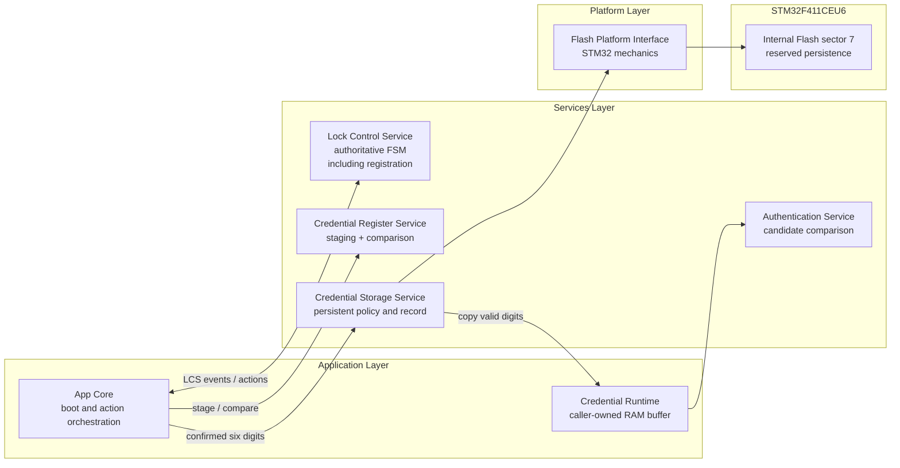
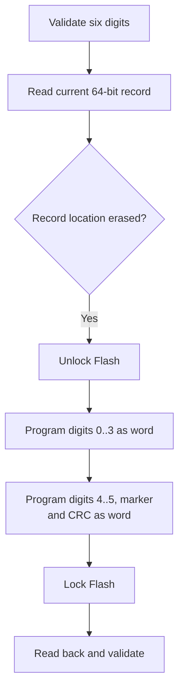
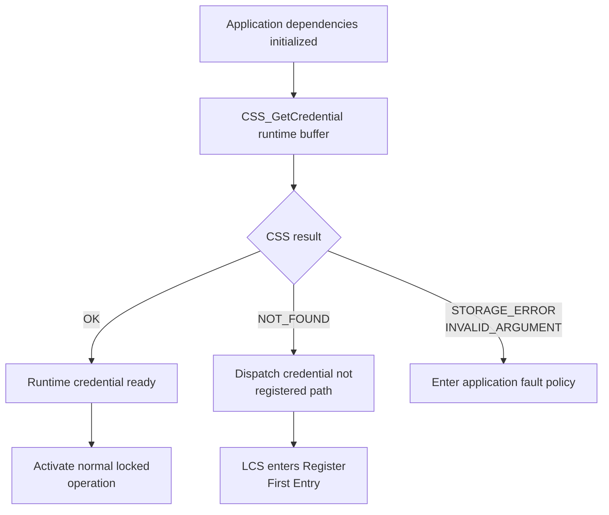
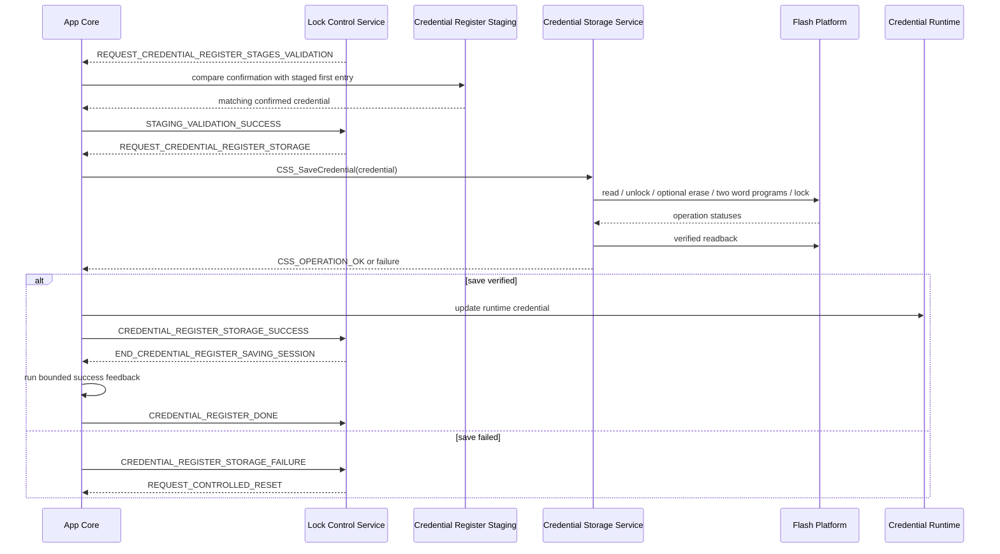

<h1 align="left">Credential Storage Service</h1>

<p align="left">
  <big>
    Synchronous persistent-storage service for validating, saving, detecting<br>
    and retrieving one fixed-length electronic-lock credential.
  </big>
</p>

> [!IMPORTANT]
> The Credential Storage Service owns the credential record format and the
> complete persistent write/validation policy. It does not collect digits,
> manage a registration session, authenticate candidates, choose Lock Control
> transitions, render UI feedback or configure Flash readout protection.

---

## Table of Contents

* [1. Overview](#1-overview)
* [2. Features](#2-features)
* [3. Architecture](#3-architecture)

  * [3.1 Layer Placement](#31-layer-placement)
  * [3.2 Application Integration](#32-application-integration)
* [4. Directory Structure](#4-directory-structure)
* [5. Service Responsibilities](#5-service-responsibilities)

  * [5.1 Responsibilities](#51-responsibilities)
  * [5.2 Explicit Non-Responsibilities](#52-explicit-non-responsibilities)
* [6. Dependencies](#6-dependencies)
* [7. Public Data Model](#7-public-data-model)

  * [7.1 Credential Length and Digit Representation](#71-credential-length-and-digit-representation)
  * [7.2 Operation Status](#72-operation-status)
* [8. Persistent Memory Model](#8-persistent-memory-model)

  * [8.1 Reserved Flash Region](#81-reserved-flash-region)
  * [8.2 Record Layout](#82-record-layout)
  * [8.3 Serialization and CRC](#83-serialization-and-crc)
  * [8.4 Valid-Record Criteria](#84-valid-record-criteria)
* [9. Save Model](#9-save-model)

  * [9.1 First Registration](#91-first-registration)
  * [9.2 Credential Replacement](#92-credential-replacement)
  * [9.3 Idempotent Save](#93-idempotent-save)
  * [9.4 Interrupted Write Recovery](#94-interrupted-write-recovery)
* [10. API Reference](#10-api-reference)

  * [10.1 CSS_SaveCredential](#101-css_savecredential)
  * [10.2 CSS_GetCredential](#102-css_getcredential)
  * [10.3 CSS_HasCredential](#103-css_hascredential)
* [11. Operation Flows](#11-operation-flows)

  * [11.1 Startup Credential Decision](#111-startup-credential-decision)
  * [11.2 Credential Registration Completion](#112-credential-registration-completion)
  * [11.3 Runtime Authentication Integration](#113-runtime-authentication-integration)
* [12. Usage Example](#12-usage-example)
* [13. Design Decisions](#13-design-decisions)

  * [13.1 Stateless Service](#131-stateless-service)
  * [13.2 Caller-Owned Runtime Credential](#132-caller-owned-runtime-credential)
  * [13.3 Eight-Byte Explicit Record](#133-eight-byte-explicit-record)
  * [13.4 Two Word Programs Instead of One Double Word](#134-two-word-programs-instead-of-one-double-word)
  * [13.5 Marker and CRC Validation](#135-marker-and-crc-validation)
  * [13.6 Exclusive Linker-Reserved Sector](#136-exclusive-linker-reserved-sector)
* [14. Error Handling](#14-error-handling)
* [15. Timing and Concurrency](#15-timing-and-concurrency)
* [16. Security Considerations](#16-security-considerations)
* [17. Usage Constraints](#17-usage-constraints)
* [18. Testing and Acceptance Criteria](#18-testing-and-acceptance-criteria)
* [19. Limitations and Future Improvements](#19-limitations-and-future-improvements)
* [20. License](#20-license)

---

## 1. Overview

The Credential Storage Service is the domain-level owner of one persistent
six-digit electronic-lock credential.

The service validates normalized credential digits, serializes them into one
fixed eight-byte record, coordinates the required internal-Flash transaction,
verifies the stored result and copies a valid record back into caller-owned
runtime storage when requested.

Hardware-dependent mechanics remain behind the
[Flash Platform Interface](../../../Platforms/README.md#10-flash-platform-interface).
CSS does not include STM32 HAL headers, use HAL sector identifiers or manipulate
Flash registers directly. Conversely, the Flash Platform does not know the
credential length, record marker, CRC format, registration state or recovery
policy.

The acronym `CSS` means **Credential Storage Service** and prefixes every public
symbol exposed by the module.

CSS is stateless. It retains no RAM credential, has no public handle and
requires no initialization call. Persistent state exists only in the
linker-reserved Flash record; runtime credentials remain owned by the
application or by a future dedicated Credential Runtime service.

---

## 2. Features

* Storage of exactly one six-digit credential.
* Normalized decimal digit validation from `0U` through `9U`.
* Explicit non-ASCII credential representation.
* Fixed eight-byte persistent record.
* Format marker for erased/malformed-record rejection.
* CRC-8/ATM integrity check.
* Detection of erased Flash.
* Detection of an incomplete two-word write.
* Detection of likely record corruption.
* Idempotent save when the requested valid record is already present.
* Sector erase only when the current record location is not erased.
* Two normal-supply 32-bit programming operations.
* Flash lock restoration after every post-unlock write attempt.
* Readback and full record verification after programming.
* Copy-out retrieval into caller-owned storage.
* Explicit destination clearing after failed retrieval.
* Boolean credential-availability query.
* Synchronous and deterministic control flow.
* No public instance or initialization lifecycle.
* No dynamic memory allocation.
* No task, queue, mutex, timer or other RTOS object.

---

## 3. Architecture

### 3.1 Layer Placement

CSS belongs to the Services layer and depends on the narrow, project-owned
Flash Platform boundary:



LCS owns the registration states and retry policy. The Credential Register
Service shown in the diagram has the narrower role of temporarily staging the
first candidate and comparing the confirmation candidate. App Core executes
LCS actions and maps CRS/CSS results back into LCS events; neither CRS nor CSS
calls LCS directly.

### 3.2 Application Integration

The application coordinates CSS in three places:

1. **Startup:** retrieve the registered credential or detect that none exists.
2. **Registration completion:** save the newly confirmed credential and update
   runtime storage only after persistent verification succeeds.
3. **Authentication setup:** provide the caller-owned runtime credential to the
   authentication path without reading Flash for every candidate attempt.

CSS does not dispatch `LCS_Event_t` values directly. The application interprets
`CSS_OpStatus_t` and decides which Lock Control event is appropriate.

The intended startup mapping is:

| CSS result | Application interpretation |
|:---|:---|
| `CSS_OPERATION_OK` | runtime credential is ready; continue normal initialization |
| `CSS_OPERATION_NOT_FOUND` | dispatch `LCS_EVENT_CREDENTIAL_NOT_REGISTERED` and begin first registration |
| `CSS_OPERATION_STORAGE_ERROR` | persistent storage is not trustworthy; enter the application fault policy |
| `CSS_OPERATION_INVALID_ARGUMENT` | integration defect; destination contract was violated |

During credential registration, `CSS_OPERATION_OK` maps to
`LCS_EVENT_CREDENTIAL_REGISTER_STORAGE_SUCCESS`; every failed save or readback
verification maps to `LCS_EVENT_CREDENTIAL_REGISTER_STORAGE_FAILURE`.

---

## 4. Directory Structure

```text
Libs/Services/Credential_Storage/
├── Inc/
│   └── Credential_Storage_Service.h
├── Src/
│   └── Credential_Storage_Service.c
└── README.md
```

The public header defines the credential-length contract, operation status and
stateless API. The source file owns all record constants, serialization,
integrity validation, address policy and Flash transaction sequencing.

The module is added to the project through the root `CMakeLists.txt` source and
include-path declarations.

---

## 5. Service Responsibilities

### 5.1 Responsibilities

The Credential Storage Service is responsible for:

* defining a six-byte normalized credential contract;
* rejecting NULL save buffers;
* rejecting credential elements greater than `9U`;
* defining the private eight-byte persistent record layout;
* encoding digits in their original entry order;
* calculating the CRC-8/ATM record byte;
* detecting completely erased record storage;
* validating the record marker;
* validating every decoded digit range;
* validating the stored CRC;
* selecting the linker-reserved credential base address;
* avoiding unnecessary Flash writes for an identical valid record;
* deciding when the dedicated sector must be erased;
* coordinating unlock, erase, two program operations and lock;
* attempting to relock Flash after every successful unlock;
* reading back and validating the complete programmed record;
* copying a valid credential into caller-owned runtime storage;
* clearing caller-owned retrieval storage after not-found or read-error results;
* reducing record availability to a Boolean convenience query when requested.

### 5.2 Explicit Non-Responsibilities

CSS does not own:

* physical keyboard scanning or key mapping;
* candidate digit-entry state;
* credential registration-session state or confirmation policy;
* second-entry confirmation of a newly chosen credential;
* candidate authentication;
* failed-attempt counters or lockout policy;
* Lock Control state transitions or event dispatch;
* display, LED, buzzer or actuator effects;
* a long-lived runtime credential copy;
* STM32 HAL calls, sector identifiers or Flash register access;
* readout-protection provisioning;
* encryption, hashing or cryptographic authentication;
* dynamic allocation or RTOS synchronization;
* Flash wear leveling, multiple records or transaction journaling.

These responsibilities belong to input services, Credential Register staging,
Authentication, App Core, Lock Control, presentation services, the
Flash Platform or a future security/storage design.

---

## 6. Dependencies

CSS has one project-owned runtime dependency:

| Dependency | Purpose |
|:---|:---|
| [`FLASH_Platform_Interface.h`](../../../Platforms/Inc/FLASH_Platform_Interface.h) | read, unlock, erase, 32-bit program and lock mechanics |

Standard headers provide fixed-width integer, Boolean and size types. CSS does
not include STM32 HAL/CMSIS headers and does not depend on Credential Entry,
Authentication, Lock Control, App Core or presentation-service headers.

The current static build-time compatibility check between CSS and collaborating
credential-length contracts belongs to App Core, where those independent
modules are composed.

---

## 7. Public Data Model

### 7.1 Credential Length and Digit Representation

```c
#define CSS_CREDENTIAL_LENGTH (6U)
```

Every public credential buffer contains exactly six bytes. Each byte represents
one normalized decimal value, not an ASCII character:

| Entered digit | Stored byte | Not stored as |
|---:|---:|:---|
| `0` | `0U` | ASCII `'0'` / `0x30` |
| `1` | `1U` | ASCII `'1'` / `0x31` |
| ... | ... | ... |
| `9` | `9U` | ASCII `'9'` / `0x39` |

The six elements retain their original entry order. A credential such as
`130603` is represented as:

```c
const uint8_t credential[CSS_CREDENTIAL_LENGTH] =
{
    1U, 3U, 0U, 6U, 0U, 3U
};
```

Array notation in a function parameter is adjusted to a pointer by C. The
caller remains responsible for providing the documented readable or writable
capacity.

### 7.2 Operation Status

```c
typedef enum
{
    CSS_OPERATION_OK,
    CSS_OPERATION_INVALID_ARGUMENT,
    CSS_OPERATION_NOT_FOUND,
    CSS_OPERATION_STORAGE_ERROR

}CSS_OpStatus_t;
```

| Value | Meaning |
|:---|:---|
| `CSS_OPERATION_OK` | save/read operation completed and the record is valid |
| `CSS_OPERATION_INVALID_ARGUMENT` | pointer is NULL or a saved digit exceeds `9U` |
| `CSS_OPERATION_NOT_FOUND` | the retrieved record is erased, malformed, incomplete or CRC-invalid |
| `CSS_OPERATION_STORAGE_ERROR` | a required Flash operation or post-write verification failed |

`CSS_OPERATION_NOT_FOUND` describes the persistent record state, not only a
never-programmed device. Corrupted or partially programmed records are also
treated as unavailable so they can never become authentication references.

---

## 8. Persistent Memory Model

### 8.1 Reserved Flash Region

CSS owns the first eight bytes of STM32F411 sector 7 beginning at:

```text
CSS_FLASH_BASE_ADDRESS = 0x08060000
```

Sector 7 spans `0x08060000` through `0x0807FFFF` and has a physical erase size
of 128 KiB. Although the credential record uses only eight bytes, the complete
sector is reserved because erase operates at sector granularity.

Both repository linker scripts separate executable and persistent Flash:

```text
FLASH             0x08000000 .. 0x0805FFFF   384 KiB
CREDENTIAL_FLASH  0x08060000 .. 0x0807FFFF   128 KiB
```

This prevents firmware sections from being linked into the sector that CSS may
erase. No other module may place persistent data in sector 7 without a new
shared layout and ownership design.

### 8.2 Record Layout

One credential record occupies exactly eight bytes:

| Byte offset | Bit range in encoded `uint64_t` | Content |
|---:|:---|:---|
| 0 | 7:0 | credential digit 0 |
| 1 | 15:8 | credential digit 1 |
| 2 | 23:16 | credential digit 2 |
| 3 | 31:24 | credential digit 3 |
| 4 | 39:32 | credential digit 4 |
| 5 | 47:40 | credential digit 5 |
| 6 | 55:48 | record marker `0xA5` |
| 7 | 63:56 | CRC-8/ATM over bytes 0 through 6 |

The first 32-bit program operation writes digits 0 through 3. The second writes
digits 4 and 5, the marker and the CRC.

The serialized representation is built with explicit shifts rather than a C
structure or union. This avoids compiler-dependent padding and makes every
on-Flash byte position explicit.

### 8.3 Serialization and CRC

CSS uses an MSB-first CRC-8/ATM calculation with:

| Property | Value |
|:---|:---|
| Width | 8 bits |
| Polynomial | `0x07` |
| Initial accumulator | `0x00` |
| Reflected input/output | no |
| Final XOR | `0x00` |
| Covered bytes | six digits followed by marker |

The CRC is an integrity check for accidental corruption and incomplete writes.
It is not a message authentication code and has no secret key.

Encoding follows this sequence:

1. Initialize the 64-bit record and CRC accumulator to zero.
2. Place each digit in its corresponding byte position.
3. Update the CRC once for each digit.
4. Place marker `0xA5` in byte six.
5. Update the CRC with the marker.
6. Place the resulting CRC in byte seven.

### 8.4 Valid-Record Criteria

A record is valid only when every condition is true:

1. The complete 64-bit value is not `UINT64_MAX`.
2. Byte six equals `0xA5`.
3. Every one of bytes zero through five is no greater than `9U`.
4. Recalculated CRC-8/ATM equals byte seven.

Validation is completed before any digit is copied to a non-NULL destination.
Passing a NULL decode destination performs validation only and is used by
`CSS_HasCredential()` and save verification.

---

## 9. Save Model

### 9.1 First Registration

After normal device erase, the record location contains `UINT64_MAX`.
`CSS_SaveCredential()` recognizes this erased state and skips the sector erase:



Skipping an unnecessary first erase reduces latency and avoids consuming an
erase cycle when the destination is already ready for programming.

### 9.2 Credential Replacement

Any non-erased current value requires sector erase before a different record is
written. This applies even when the old value is malformed or CRC-invalid,
because arbitrary zero bits cannot be changed back to one by programming.

Replacement sequence:

1. Validate and encode the requested credential.
2. Read the current record.
3. Unlock the Flash programming interface.
4. Erase the complete dedicated sector.
5. Program the low 32-bit word.
6. Program the high 32-bit word containing marker and CRC.
7. Attempt to lock Flash.
8. Read back the complete 64-bit record.
9. Require exact value equality and successful record decoding.

The sector shall never contain unrelated data because replacement erases all
128 KiB.

### 9.3 Idempotent Save

When the current record is byte-for-byte equal to the requested encoding and
passes full validation, `CSS_SaveCredential()` returns `CSS_OPERATION_OK`
without unlocking, erasing or programming Flash.

This behavior prevents unnecessary wear when an orchestration path repeats the
same confirmed credential. It does not make repeated calls from a periodic loop
an approved usage pattern.

### 9.4 Interrupted Write Recovery

The current V1 transaction is detectable but not redundant.

If power fails after only the first word is programmed, the second word remains
erased. The marker byte is therefore not `0xA5`, and the record is rejected.

If power fails during the second word, marker or CRC validation is expected to
reject the incomplete value. Exact post-write readback adds another verification
step when execution continues normally.

If power fails after an existing credential sector is erased but before the new
record is verified, the previous credential is lost. At the next boot, the
application shall treat the record as not registered and return to the first
registration path.

> [!NOTE]
> Marker and CRC prevent an incomplete value from being accepted. They do not
> preserve the previous credential across an interrupted replacement.

---

## 10. API Reference

### 10.1 CSS_SaveCredential

#### Function Signature

```c
CSS_OpStatus_t CSS_SaveCredential(
    const uint8_t Credential[CSS_CREDENTIAL_LENGTH]);
```

#### Parameters

| Parameter | Direction | Contract |
|:---|:---:|:---|
| `Credential` | input | NULL or at least six readable normalized decimal bytes |

#### Behavior

* Rejects NULL and digits above `9U`.
* Borrows the source only for the synchronous call.
* Avoids a write for an identical valid record.
* Erases the dedicated sector only when the current location is not erased.
* Programs two 32-bit words.
* Attempts to lock Flash after every successful unlock.
* Verifies exact readback and full record validity.

#### Return

| Result | Condition |
|:---|:---|
| `CSS_OPERATION_OK` | requested credential is already validly stored or was written and verified |
| `CSS_OPERATION_INVALID_ARGUMENT` | pointer is NULL or at least one digit exceeds `9U` |
| `CSS_OPERATION_STORAGE_ERROR` | read, unlock, erase, program, lock or verification failed |

### 10.2 CSS_GetCredential

#### Function Signature

```c
CSS_OpStatus_t CSS_GetCredential(
    uint8_t Credential[CSS_CREDENTIAL_LENGTH]);
```

#### Parameters

| Parameter | Direction | Contract |
|:---|:---:|:---|
| `Credential` | output | NULL or at least six writable bytes owned by the caller |

#### Behavior

* Reads one complete 64-bit record.
* Validates erased state, marker, digit ranges and CRC.
* Copies digits only after full validation succeeds.
* Clears all six destination bytes after read failure or invalid record.
* Never retains the destination address.

#### Return

| Result | Condition and destination state |
|:---|:---|
| `CSS_OPERATION_OK` | six valid digits were copied |
| `CSS_OPERATION_INVALID_ARGUMENT` | destination is NULL and cannot be cleared |
| `CSS_OPERATION_NOT_FOUND` | no valid record; non-NULL destination was cleared |
| `CSS_OPERATION_STORAGE_ERROR` | Platform read failed; non-NULL destination was cleared |

### 10.3 CSS_HasCredential

#### Function Signature

```c
bool CSS_HasCredential(void);
```

#### Behavior

Reads and validates the complete record without copying digits to a caller
buffer.

#### Return

| Result | Meaning |
|:---|:---|
| `true` | one complete marker/digit/CRC-valid record exists |
| `false` | record is erased, malformed, incomplete, corrupted or unreadable |

This convenience function intentionally cannot distinguish an absent record
from a Platform read failure. Startup code that requires that distinction shall
use `CSS_GetCredential()` directly.

---

## 11. Operation Flows

### 11.1 Startup Credential Decision

The robust startup path performs one retrieval rather than a separate Boolean
check followed by a second read:



Using one retrieval avoids reading the record twice and preserves the difference
between a normal first boot and a storage integration failure.

The `CREDENTIAL_NOT_REGISTERED` boot route is admitted by the LCS inactive
gate and activates the FSM directly in credential-register first entry. The
remaining work is in App Core: call `CSS_GetCredential()` during startup and
select this route when CSS reports `CSS_OPERATION_NOT_FOUND`.

### 11.2 Credential Registration Completion

The intended registration completion order is:



Runtime storage shall be refreshed only after `CSS_OPERATION_OK`. Updating RAM
first could make Authentication use a credential that was never safely
persisted.

### 11.3 Runtime Authentication Integration

CSS shall not be read on every authentication attempt. Startup or successful
registration loads a caller-owned runtime credential once; Authentication then
compares candidates against that runtime value.

This boundary provides:

* no blocking Flash access in the candidate-authentication hot path;
* no direct Authentication dependency on STM32 or persistent storage;
* explicit runtime credential lifetime and clearing policy;
* one place to refresh the reference after credential replacement.

The current Authentication service still contains a firmware-compiled reference
credential. Replacing that constant with a runtime credential is a separate
integration change and not a responsibility of CSS.

---

## 12. Usage Example

The following example demonstrates direct CSS contract use. Product event
selection remains application-specific:

```c
#include "Credential_Storage_Service.h"

static uint8_t App_RegisteredCredential[CSS_CREDENTIAL_LENGTH] = {0};

typedef enum
{
    APP_CREDENTIAL_READY,
    APP_CREDENTIAL_REGISTRATION_REQUIRED,
    APP_CREDENTIAL_STORAGE_FAULT

}App_CredentialBootResult_t;

App_CredentialBootResult_t App_LoadRegisteredCredential(void)
{
    CSS_OpStatus_t status =
        CSS_GetCredential(App_RegisteredCredential);

    switch(status)
    {
        case CSS_OPERATION_OK:
            return APP_CREDENTIAL_READY;

        case CSS_OPERATION_NOT_FOUND:
            return APP_CREDENTIAL_REGISTRATION_REQUIRED;

        case CSS_OPERATION_INVALID_ARGUMENT:
        case CSS_OPERATION_STORAGE_ERROR:
        default:
            return APP_CREDENTIAL_STORAGE_FAULT;
    }
}
```

Saving a newly confirmed credential:

```c
bool App_PersistRegisteredCredential(
    const uint8_t Credential[CSS_CREDENTIAL_LENGTH])
{
    if(CSS_SaveCredential(Credential) != CSS_OPERATION_OK)
    {
        return false;
    }

    if(CSS_GetCredential(App_RegisteredCredential) != CSS_OPERATION_OK)
    {
        return false;
    }

    return true;
}
```

The second retrieval is not required for Flash verification because save already
verifies readback. It is shown to refresh caller-owned runtime storage using the
same CSS copy-out boundary.

---

## 13. Design Decisions

### 13.1 Stateless Service

CSS stores no mutable RAM state. The persistent record is authoritative and
every operation depends only on arguments plus the current Flash contents.

Consequences:

* no initialization API;
* no public handle;
* no stale private runtime copy;
* simple composition and deterministic reset behavior;
* Flash transactions still require external serialization because the hardware
  programming interface is globally shared.

### 13.2 Caller-Owned Runtime Credential

`CSS_GetCredential()` copies digits out instead of returning an internal pointer
or retaining the caller destination. This makes ownership explicit and lets the
application or a future Credential Runtime service define lifetime, access and
clearing policy.

CSS never exposes its private serialized record as the authentication data
model.

### 13.3 Eight-Byte Explicit Record

Six credential bytes leave two bytes within one eight-byte record. CSS uses
those bytes for a marker and CRC rather than padding.

A `uint64_t` is an internal serialization container, not the public credential
type. Public callers continue to work with six ordered `uint8_t` digits.

### 13.4 Two Word Programs Instead of One Double Word

STM32F4 double-word programming requires the external Vpp conditions specified
by the target documentation. The product's normal 3.3 V supply supports word
programming without that dependency.

CSS therefore writes the logical eight-byte record as two 32-bit words. The
second word contains marker and CRC so the record does not become valid after
only the first operation.

### 13.5 Marker and CRC Validation

An erased-value check alone is insufficient because an interrupted or corrupted
record may be neither erased nor valid. CSS combines:

* full erased-value detection;
* fixed marker validation;
* semantic digit-range validation;
* CRC validation.

These checks provide inexpensive format/integrity detection. They are not a
cryptographic credential verifier.

### 13.6 Exclusive Linker-Reserved Sector

The physical erase unit is much larger than the record. Reserving the complete
sector prevents an update from deleting executable code or another module's
persistent data.

The linker enforces this ownership independently from the current firmware
size. Relying only on the image being smaller than `0x08060000` would be unsafe
because later code growth could silently overlap the erase target.

---

## 14. Error Handling

CSS applies conservative failure rules:

| Failure | CSS behavior |
|:---|:---|
| NULL save pointer | return `CSS_OPERATION_INVALID_ARGUMENT`; no Flash mutation |
| digit greater than `9U` | return `CSS_OPERATION_INVALID_ARGUMENT`; no Flash mutation |
| initial record read failure | return `CSS_OPERATION_STORAGE_ERROR`; no unlock |
| unlock failure | return `CSS_OPERATION_STORAGE_ERROR` |
| erase failure | skip programming, attempt lock, return storage error |
| first word failure | skip second word, attempt lock, return storage error |
| second word failure | attempt lock, return storage error; incomplete record remains invalid |
| lock failure | return `CSS_OPERATION_STORAGE_ERROR` even if data was programmed |
| readback mismatch or invalid decode | return `CSS_OPERATION_STORAGE_ERROR` |
| NULL retrieval destination | return invalid argument; no buffer exists to clear |
| retrieval read failure | clear non-NULL destination; return storage error |
| invalid/erased retrieval record | clear non-NULL destination; return not found |
| Boolean read/validation failure | return `false` |

CSS performs no automatic retry. Repeating erase or program without an explicit
application policy could increase wear or hide a persistent hardware fault.

Application code shall not convert `CSS_OPERATION_STORAGE_ERROR` into a normal
first-registration path without a deliberate product decision. A genuinely
unreadable storage boundary is different from a well-formed erased record.

---

## 15. Timing and Concurrency

All CSS operations are synchronous.

| Operation | Blocking behavior |
|:---|:---|
| `CSS_HasCredential` | bounded memory-mapped read and validation |
| `CSS_GetCredential` | bounded memory-mapped read, validation and six-byte copy/clear |
| idempotent `CSS_SaveCredential` | bounded read, validation and comparison; no mutation |
| first save | unlock plus two blocking Flash word programs, lock and readback |
| replacement save | unlock plus blocking 128 KiB sector erase, two word programs, lock and readback |

CSS shall run only from a task/application context that permits Flash erase and
program latency. It shall not be called from an ISR.

Although CSS contains no mutable service object, mutation operations are not
reentrant because they share the MCU Flash programming interface and lock state.
One application-owned registration/storage flow shall serialize saves and any
other Flash mutation or readout-protection operation.

Reads shall not be intentionally raced with an erase/program transaction. V1
uses ownership instead of a CSS-owned mutex.

---

## 16. Security Considerations

The current record stores six normalized digits directly in internal Flash.

The following properties are provided:

* malformed and erased values are rejected;
* likely accidental corruption is detected by CRC;
* incomplete two-word writes do not form valid records;
* failed retrieval clears caller-owned output storage;
* public APIs do not expose the private marker or CRC layout.

The following properties are not provided:

* encryption at rest;
* salted hashing or a cryptographic password verifier;
* authenticity against deliberate record modification;
* resistance to invasive physical extraction;
* automatic debug/readout protection;
* secure key storage;
* guaranteed erasure of every compiler temporary or register value;
* rate limiting or lockout policy.

CRC is not a security boundary. Anyone able to modify Flash deliberately can
calculate a matching CRC for another six-digit value.

STM32 RDP Level 1 can reduce external debug/programming readout, but provisioning
it is separate from CSS. Returning from Level 1 to Level 0 mass-erases internal
Flash, including the credential record. RDP Level 2 is intentionally not
exposed by the Platform interface because it is irreversible.

---

## 17. Usage Constraints

1. Supply exactly six readable or writable bytes for non-NULL public buffers.
2. Represent digits as numeric values from `0U` through `9U`, never ASCII.
3. Do not call `CSS_SaveCredential()` until the registration flow has produced
   a fully confirmed credential.
4. Do not call save from a periodic loop, debounce path or repeated update tick.
5. Serialize CSS save with every other internal-Flash mutation or protection
   operation.
6. Call CSS only from task/application context, never from an ISR.
7. Preserve exclusive ownership of STM32F411 sector 7.
8. Keep both active linker scripts consistent with the CSS base address.
9. Do not place firmware sections or unrelated persistent records in sector 7.
10. Treat `CSS_OPERATION_STORAGE_ERROR` as a storage fault unless an explicit
    product policy defines a safe alternative.
11. Update runtime credential storage only after a save returns success.
12. Clear caller-owned runtime credentials when their lifecycle ends.
13. Do not treat CRC as encryption, hashing or authentication.
14. Do not enable or downgrade readout protection as an implicit save side
    effect.
15. Expect a firmware-programmer mass erase to remove the credential unless the
    deployment procedure explicitly preserves sector 7.

---

## 18. Testing and Acceptance Criteria

### Host Contract Tests

Using a deterministic Flash Platform fake, verify:

* erased Flash produces `CSS_HasCredential() == false`;
* erased Flash produces `CSS_OPERATION_NOT_FOUND` on retrieval;
* failed retrieval clears all six destination bytes;
* NULL save and retrieval pointers are rejected;
* every digit value from `0U` through `9U` is accepted;
* a value of `10U` in each possible position is rejected;
* first save performs no erase and exactly two word programs;
* readback reproduces leading zeros and the original digit order;
* saving the same valid credential performs no erase/program operation;
* replacing a credential performs one sector erase and two word programs;
* first-word-only storage is rejected;
* incorrect marker is rejected;
* every out-of-range stored digit is rejected;
* CRC corruption is rejected;
* read, unlock, erase, first program, second program and lock failures map to
  `CSS_OPERATION_STORAGE_ERROR`;
* a lock attempt occurs after every successful unlock, including failed writes;
* exact readback mismatch is rejected after programming.

### Build and Link Acceptance

Verify in Debug and Release configurations:

* CSS source and include path are part of the target;
* no compiler warnings are introduced;
* executable `FLASH` ends before `0x08060000`;
* `CREDENTIAL_FLASH` begins at `0x08060000` and spans 128 KiB;
* linker symbols identify the reserved start and end addresses;
* the firmware image places no loadable section in the credential region.

### Target Acceptance

On STM32F411 hardware with recoverable firmware and known supply conditions:

* first save persists across reset and power cycle;
* every six-digit pattern category is preserved, including leading zeros;
* replacement persists across reset;
* same-value save avoids sector erase as observed through instrumentation;
* sector 7 erase does not alter executable sectors;
* Flash is locked after successful and injected-failure paths;
* a deliberately corrupted record triggers the not-registered path;
* normal word programming succeeds at the product's 3.3 V supply;
* readout-protection provisioning/reset/mass-erase behavior is verified only in
  a dedicated provisioning test, never as a routine CSS test.

### Power-Fault Acceptance

Where the test setup supports controlled power interruption:

* interrupt after erase and confirm the next boot detects no valid credential;
* interrupt after the first word and confirm marker validation rejects it;
* interrupt during/after the second word and confirm only a fully marker/CRC-
  valid record is accepted;
* confirm the application returns to first registration rather than authenticating
  against incomplete data.

---

## 19. Limitations and Future Improvements

Current limitations:

1. Only one credential record is supported.
2. Credential digits are stored in directly recoverable form.
3. Marker and CRC are not cryptographic protection.
4. Replacing a credential erases the previous value before the new record is
   committed; an interrupted replacement loses the old credential.
5. No redundant slot, journal, generation counter or commit record exists.
6. No wear leveling is implemented.
7. A complete 128 KiB sector is reserved for an eight-byte V1 record.
8. The base address and Flash organization are STM32F411CEU6-specific.
9. `CSS_HasCredential()` collapses not-found and read-failure into `false`.
10. No explicit delete/reset-credential API exists.
11. CSS does not own or clear a long-lived runtime credential.
12. Local encoded-record variables and CPU registers are not guaranteed to be
    scrubbed after every operation.
13. Firmware flashing with mass erase removes the credential.
14. Authentication still requires a separate migration from its compiled
    reference credential to caller-owned runtime data.

Potential future improvements shall be driven by product security and recovery
requirements:

* introduce a dedicated Credential Runtime owner with explicit initialization,
  refresh and clearing rules;
* migrate Authentication to accept or initialize from the runtime credential;
* add two-slot or journaled records with generation and commit metadata for
  interrupted-update recovery;
* define a versioned record header before multiple schema versions are needed;
* use a cryptographic verifier instead of plaintext digits when the threat model
  and available key material justify it;
* add wear-aware rotation only if real update frequency requires it;
* add an explicit credential reset API only with an authenticated product flow;
* expose non-sensitive persistent fault diagnostics without leaking credential
  bytes;
* separate target-specific storage configuration when a second MCU backend is
  introduced.

Any record-format change requires an explicit migration or invalidation policy.
Silently reinterpreting existing sector contents is not acceptable.

---

## 20. License

This module is part of the:

```text
Electronic Lock Project
```

and follows the project's license terms.
