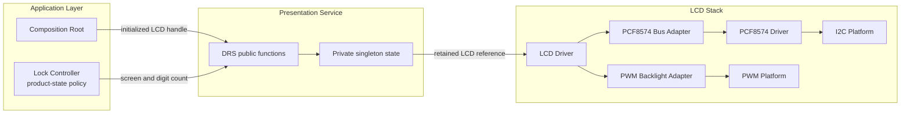
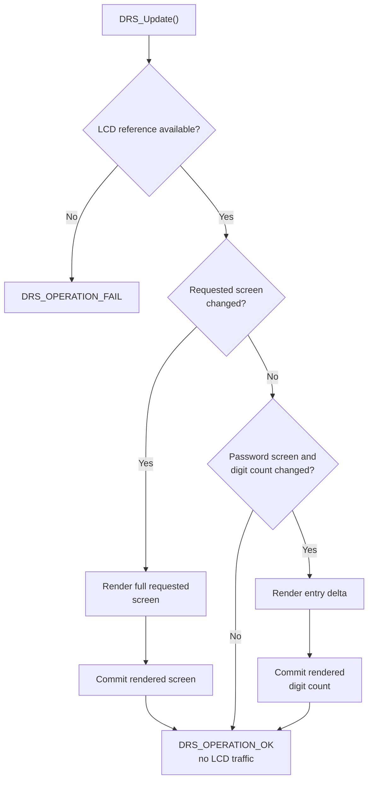
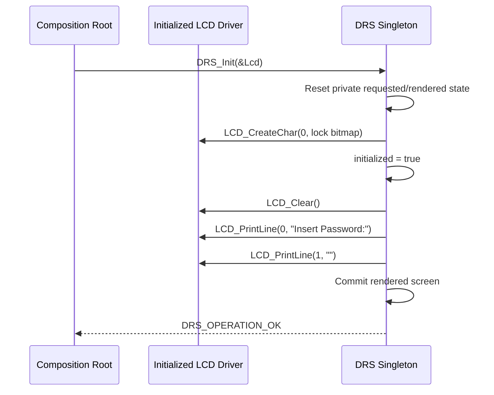
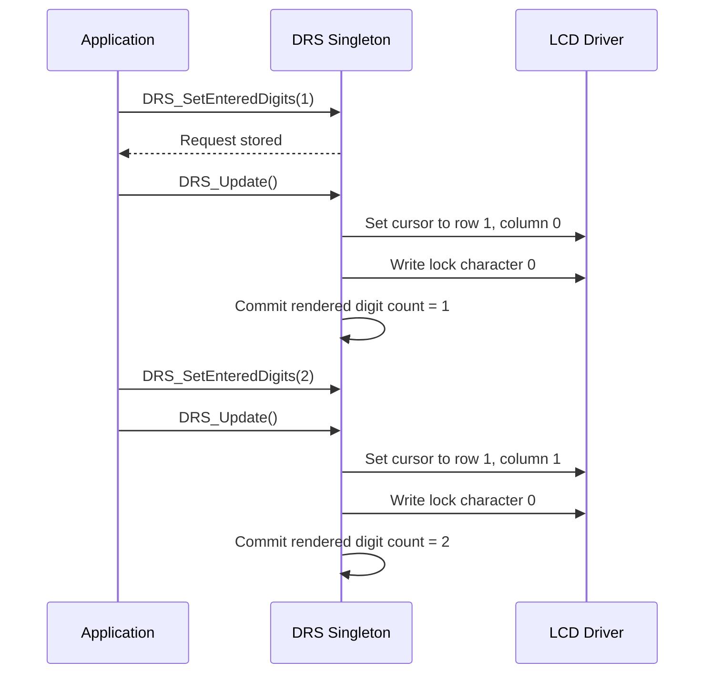

<h1 align="left">Display Render Service</h1>

<p align="left">
  <big>
    Singleton presentation service for rendering semantic electronic-lock<br>
    screens and masked credential-entry progress on a 16x2 character LCD.
  </big>
</p>

> [!IMPORTANT]
> The Display Render Service exposes a function-based API and keeps its complete runtime state private. The composition root injects one initialized `LCD_Handle_t` through `DRS_Init()`. All later operations use the retained LCD reference without requiring a public service handle.

> [!CAUTION]
> The service receives only semantic screen identifiers and an entered-digit count. It never receives, renders or retains raw credential digits.

---

## Table of Contents

- [1. Purpose](#1-purpose)
- [2. Design Intent](#2-design-intent)
- [3. Architecture](#3-architecture)
  - [3.1 Layer Placement](#31-layer-placement)
  - [3.2 Singleton Ownership](#32-singleton-ownership)
  - [3.3 Dependency Injection](#33-dependency-injection)
- [4. Directory Structure](#4-directory-structure)
- [5. Responsibilities](#5-responsibilities)
- [6. Public Contract](#6-public-contract)
  - [6.1 Operation Status](#61-operation-status)
  - [6.2 Screen Identifiers](#62-screen-identifiers)
  - [6.3 Entry Capacity](#63-entry-capacity)
  - [6.4 Function-Based API](#64-function-based-api)
- [7. Private Runtime Model](#7-private-runtime-model)
- [8. Screen Catalog](#8-screen-catalog)
- [9. Custom Lock Character](#9-custom-lock-character)
- [10. Lifecycle](#10-lifecycle)
- [11. Rendering Model](#11-rendering-model)
  - [11.1 Requested and Rendered Views](#111-requested-and-rendered-views)
  - [11.2 Full-Screen Rendering](#112-full-screen-rendering)
  - [11.3 Incremental Entry Rendering](#113-incremental-entry-rendering)
  - [11.4 Coalescing](#114-coalescing)
  - [11.5 Render Commit and Retry](#115-render-commit-and-retry)
- [12. API Reference](#12-api-reference)
- [13. Composition-Root Integration](#13-composition-root-integration)
- [14. Operation Flows](#14-operation-flows)
- [15. Error Handling](#15-error-handling)
- [16. Timing and Concurrency](#16-timing-and-concurrency)
- [17. Security Considerations](#17-security-considerations)
- [18. Validation Checklist](#18-validation-checklist)
- [19. Limitations](#19-limitations)
- [20. License](#20-license)

---

## 1. Purpose

The Display Render Service converts application-level presentation requests into fixed LCD content for the electronic-lock user interface.

The application does not send arbitrary strings to the LCD. It requests a semantic screen from a closed catalog, optionally supplies the number of accepted credential digits and invokes `DRS_Update()` to synchronize the physical display.

During credential entry, every accepted position is represented by a custom closed-padlock character. The service learns only the credential length; digit values never cross its public boundary.

The acronym `DRS` means **Display Render Service** and prefixes every public symbol provided by the module.

---

## 2. Design Intent

The service is intentionally designed as one module-owned singleton:

- The application does not allocate a `DRS_Handle_t`.
- No service handle is declared in the public header.
- Requested view, rendered view, lifecycle state and LCD reference remain private to the implementation.
- The composition root supplies the concrete LCD dependency once through `DRS_Init()`.
- Subsequent calls operate only through the public functions.
- All storage is static; no dynamic allocation is used.
- Exactly one Display Render Service runtime exists in the firmware.

This design fits the product topology: the electronic lock has one presentation display and one serialized application owner. It also prevents callers from reading or mutating render state directly.

The public contract still exposes the types and constant required to call the functions:

- `DRS_OpStatus_t` for operation results.
- `DRS_Screen_t` for semantic screen requests.
- `DRS_ENTRY_DIGIT_CAPACITY` for the supported credential-length boundary.

It does not expose the private view, content-map or runtime-handle types.

---

## 3. Architecture

### 3.1 Layer Placement

The Display Render Service belongs to the presentation-services layer. The Lock Controller or another application-layer owner selects semantic content, while the service translates that request into bounded LCD driver operations.



The service does not initialize I2C, PCF8574, LCD bus, PWM backlight or the LCD driver itself. Those dependencies are assembled and initialized before `DRS_Init()` is called.

### 3.2 Singleton Ownership

The implementation owns one private object:

```c
static DRS_Handle_t DRS_Runtime_Instance;
```

This object contains:

- The borrowed LCD pointer.
- The most recently requested logical view.
- The render state committed after successful LCD operations.
- The initialization flag.

Because the object has internal linkage and its type is defined only in the source file, application code cannot allocate a second instance or access its members.

### 3.3 Dependency Injection

The singleton pattern does not make the LCD dependency global to the application. The dependency remains explicit at the composition boundary:

```c
DRS_OpStatus_t DRS_Init(LCD_Handle_t* Lcd);
```

`DRS_Init()` borrows the pointer. It does not copy the LCD object and does not take ownership of it. The composition root remains responsible for the LCD storage and must keep that storage valid for every later DRS call.

The intended dependency direction is:

```text
Composition Root ──injects──> Display Render Service ──uses──> LCD Driver
Application      ─requests──> Display Render Service
```

The service does not depend on the Credential Entry Service, Authentication Service, Lock Controller, keyboard types, application states, STM32 HAL headers or RTOS primitives.

---

## 4. Directory Structure

```text
Display_Render/
├── Inc/
│   └── Display_Render_Service.h
├── Src/
│   └── Display_Render_Service.c
└── README.md
```

`Display_Render_Service.h` defines the public status, screen catalog, entry capacity and function prototypes.

`Display_Render_Service.c` owns all runtime state, private types, the fixed screen-content map, the lock bitmap, render-delta logic, coalescing and LCD error propagation.

---

## 5. Responsibilities

The Display Render Service is responsible for:

- Retaining the LCD reference injected by the composition root.
- Owning the single requested logical display view.
- Tracking successfully committed render state.
- Programming the custom lock character into LCD CGRAM position zero.
- Rendering the empty password-entry screen during initialization.
- Mapping semantic screen identifiers to fixed two-line text.
- Validating semantic screen identifiers.
- Validating the requested entered-digit count.
- Representing entered positions with lock characters.
- Adding only newly requested lock characters when possible.
- Clearing only mask positions that are no longer requested when possible.
- Avoiding LCD traffic when no visible change is pending.
- Performing a complete redraw when the semantic screen changes.
- Returning lower-level LCD failures to the caller.
- Leaving failed work logically pending for a later retry.

The service is explicitly not responsible for:

- Reading a keyboard.
- Receiving or storing raw credential digits.
- Determining whether a credential is complete.
- Authenticating a credential.
- Counting failed authentication attempts.
- Applying retry, timeout or lockout policy.
- Choosing how long a feedback screen remains visible.
- Automatically returning to the password-entry screen.
- Selecting a screen from application events.
- Controlling the lock actuator.
- Producing LED or sound effects.
- Initializing the LCD or its lower hardware stack.
- Managing backlight state or brightness.
- Owning a task, timer, queue, mutex or scheduler.
- Providing localization or runtime-editable strings.

---

## 6. Public Contract

### 6.1 Operation Status

```c
typedef enum
{
    DRS_OPERATION_OK,
    DRS_OPERATION_FAIL

}DRS_OpStatus_t;
```

`DRS_OPERATION_OK` indicates that the requested state operation completed, or that the physical display was already current or was updated successfully.

`DRS_OPERATION_FAIL` reports an invalid lifecycle condition, unsupported value, missing LCD binding or lower-level LCD failure, depending on the called function.

### 6.2 Screen Identifiers

```c
typedef enum
{
    DRS_SCREEN_PASSWORD_ENTRY,
    DRS_SCREEN_ENTRY_TIMEOUT,
    DRS_SCREEN_ENTRY_INCOMPLETE,
    DRS_SCREEN_ACCESS_GRANTED,
    DRS_SCREEN_ACCESS_DENIED,
    DRS_SCREEN_COUNT

}DRS_Screen_t;
```

`DRS_SCREEN_COUNT` serves two private implementation needs:

- It defines the screen-content map size.
- It represents an invalid rendered-screen marker during initialization.

It is not a renderable screen. `DRS_SetScreen(DRS_SCREEN_COUNT)` returns `DRS_OPERATION_FAIL`.

### 6.3 Entry Capacity

```c
#define DRS_ENTRY_DIGIT_CAPACITY (6U)
```

`DRS_SetEnteredDigits()` accepts values in the inclusive range from `0U` through `DRS_ENTRY_DIGIT_CAPACITY`.

The value represents the number of accepted credential digits, not their values. A count greater than six is rejected without changing the requested count.

### 6.4 Function-Based API

```c
DRS_OpStatus_t DRS_Init             (LCD_Handle_t* Lcd);
DRS_OpStatus_t DRS_SetScreen        (DRS_Screen_t Screen);
DRS_OpStatus_t DRS_SetEnteredDigits (uint8_t EnteredDigits);
DRS_OpStatus_t DRS_Update           (void);
```

There is no public `DRS_Handle_t`, getter for private render state or instance parameter on state-setting and update functions.

---

## 7. Private Runtime Model

The implementation defines three private types.

`DRS_ScreenContent_t` groups the two fixed strings associated with a semantic screen:

```c
typedef struct
{
    const char* first_line;
    const char* second_line;

}DRS_ScreenContent_t;
```

`DRS_View_t` represents requested or rendered logical state:

```c
typedef struct
{
    DRS_Screen_t screen;
    uint8_t      entered_digits;

}DRS_View_t;
```

`DRS_Handle_t` groups the singleton runtime data:

```c
typedef struct
{
    LCD_Handle_t* lcd;
    DRS_View_t    requested_view;
    DRS_View_t    rendered_view;
    bool          initialized;

}DRS_Handle_t;
```

These declarations are implementation details. They are shown here to explain behavior, not to establish an application-facing allocation contract.

Before `DRS_Init()`, static initialization leaves `lcd` null and `initialized` false. Successful initialization binds the LCD, establishes the empty password-entry request and renders that request immediately.

---

## 8. Screen Catalog

The screen-content map is fixed at compile time:

| Screen | First line | Second line | Dynamic content |
| --- | --- | --- | --- |
| `DRS_SCREEN_PASSWORD_ENTRY` | `Insert Password:` | Empty before masking | Zero through six lock characters from column zero |
| `DRS_SCREEN_ENTRY_TIMEOUT` | `Entry Timeout` | Empty | None |
| `DRS_SCREEN_ENTRY_INCOMPLETE` | `Entry Incomplete` | Empty | None |
| `DRS_SCREEN_ACCESS_GRANTED` | `Access Granted` | `Welcome!` | None |
| `DRS_SCREEN_ACCESS_DENIED` | `Access Denied!` | Empty | None |

A full-screen transition clears the display before printing both mapped lines. The clear prevents shorter or intentionally empty content from leaving characters from the preceding screen.

Only the password-entry screen renders `entered_digits`. The four feedback screens ignore digit-count differences while they remain selected.

---

## 9. Custom Lock Character

`DRS_Init()` programs one 5x8 character into CGRAM position zero:

```c
static const uint8_t DRS_LockCharacterBitmap[8] =
{
    0x0EU,
    0x11U,
    0x11U,
    0x1FU,
    0x1BU,
    0x1BU,
    0x1FU,
    0x00U
};
```

Visual representation, where `#` is an enabled pixel:

```text
.###.
#...#
#...#
#####
##.##
##.##
#####
.....
```

Password-entry progress is rendered by writing custom-character code zero. The service never converts a credential digit to ASCII and never sends the credential value to the LCD.

CGRAM position zero is reserved by the service after initialization. Another module must not overwrite that position while the service is responsible for the display.

---

## 10. Lifecycle

The expected lifecycle is:

1. The composition root allocates and initializes the complete LCD stack.
2. The composition root calls `DRS_Init(&Lcd)` once the LCD is ready.
3. `DRS_Init()` resets all singleton view state.
4. The service programs the custom lock character.
5. The service renders the empty password-entry screen immediately.
6. The application submits screen and digit-count requests through public functions.
7. The application calls `DRS_Update()` to apply pending visible changes.

There is no public deinitialization function. Calling `DRS_Init()` again rebinds the singleton to the supplied LCD, resets both views and renders the default screen again.

If initialization fails, the implementation clears its retained LCD pointer. A later `DRS_Update()` therefore fails until a subsequent `DRS_Init()` succeeds.

`DRS_SetScreen()` validates only the screen identifier and does not check the initialization flag. A valid call made before initialization can update the zero-initialized private request, but the next `DRS_Init()` resets that request to `DRS_SCREEN_PASSWORD_ENTRY`. Normal integration therefore initializes the service before submitting any screen request.

`DRS_SetEnteredDigits()` explicitly requires successful initialization.

---

## 11. Rendering Model

### 11.1 Requested and Rendered Views

State-setting functions write only the private requested view. They do not communicate with the LCD.

`DRS_Update()` compares the requested view with the private rendered view:

- A different screen identifier requires a full-screen render.
- Matching password-entry screens with different digit counts require an incremental render.
- Matching static screens require no render even if their stored digit counts differ.



### 11.2 Full-Screen Rendering

When the requested screen differs from the rendered screen, `DRS_Update()` performs this sequence:

1. Resolve the requested screen in `DRS_ScreenContentMap`.
2. Reject the map entry if either text pointer is null.
3. Clear the LCD.
4. Print the mapped first line on row zero.
5. Print the mapped second line on row one.
6. If password entry is requested, draw all requested locks from column zero.
7. Commit the rendered screen identifier after every required operation succeeds.

The implementation commits the rendered screen identifier in this path. The rendered digit count is committed by the incremental path. Consequently, if the requested digit count changed while a static screen was active, returning to password entry renders the correct full lock sequence immediately, and a later `DRS_Update()` may perform a redundant digit-delta operation before both private counters converge.

### 11.3 Incremental Entry Rendering

When password entry remains selected and only the count changes, the service avoids clearing and rewriting the complete display.

For an increase from `rendered_digits` to `requested_digits`, it:

1. Sets the cursor to row one and column `rendered_digits`.
2. Writes one lock for every position in `[rendered_digits, requested_digits)`.

For a decrease, it:

1. Sets the cursor to row one and column `requested_digits`.
2. Writes a space for every position in `[requested_digits, rendered_digits)`.

An empty range succeeds without an LCD transaction. A reversed range or a range ending above `DRS_ENTRY_DIGIT_CAPACITY` is rejected by the private range helpers.

### 11.4 Coalescing

Repeated `DRS_Update()` calls produce no LCD transaction when:

- Requested and rendered screen identifiers match; and
- The selected screen is static, or the password-entry digit counts also match.

This allows the application to call `DRS_Update()` periodically or after each presentation request without continuously retransmitting unchanged content over I2C.

### 11.5 Render Commit and Retry

The service commits corresponding rendered state only after the associated LCD sequence succeeds:

- A successful full-screen render commits `rendered_view.screen`.
- A successful incremental entry render commits `rendered_view.entered_digits`.
- A failed operation returns before that commit.

Physical LCD operations are not transactional. A failure may occur after a clear, line write or part of a lock sequence has already reached the device. Because the logical commit is withheld, a later `DRS_Update()` repeats the pending operation and drives the display back toward the requested state.

---

## 12. API Reference

### `DRS_Init`

```c
DRS_OpStatus_t DRS_Init(LCD_Handle_t* Lcd);
```

Initializes or reinitializes the singleton.

Behavior:

- Retains the caller-owned LCD pointer.
- Requests `DRS_SCREEN_PASSWORD_ENTRY` with zero entered digits.
- Marks the rendered screen with `DRS_SCREEN_COUNT` so a full render is required.
- Resets the rendered digit count to zero.
- Programs the closed-padlock character in CGRAM position zero.
- Marks the service initialized after character creation succeeds.
- Calls `DRS_Update()` and renders the default screen before returning.
- Clears the retained LCD pointer if character creation or default rendering fails.

Preconditions:

- `Lcd` points to a caller-owned LCD object that remains valid after the call.
- The LCD driver, bus and backlight interfaces have already been initialized.
- The configured display supports the required 16x2 layout and 5x8 font.

Returns:

- `DRS_OPERATION_OK` when the lock character and default screen are rendered successfully.
- `DRS_OPERATION_FAIL` when the LCD pointer is null, the LCD is not initialized or a required LCD operation fails.

### `DRS_SetScreen`

```c
DRS_OpStatus_t DRS_SetScreen(DRS_Screen_t Screen);
```

Stores a semantic screen in the requested view without accessing the LCD.

Returns:

- `DRS_OPERATION_OK` for values from `DRS_SCREEN_PASSWORD_ENTRY` through `DRS_SCREEN_ACCESS_DENIED`.
- `DRS_OPERATION_FAIL` for `DRS_SCREEN_COUNT`, negative enumeration values or values above the screen boundary.

The function does not validate the initialization flag. The expected lifecycle still requires `DRS_Init()` first because initialization resets the request and supplies the LCD used by `DRS_Update()`.

### `DRS_SetEnteredDigits`

```c
DRS_OpStatus_t DRS_SetEnteredDigits(uint8_t EnteredDigits);
```

Stores the requested masked-entry length without accessing the LCD or receiving credential values.

Returns:

- `DRS_OPERATION_OK` when the service is initialized and `EnteredDigits` is from zero through six.
- `DRS_OPERATION_FAIL` when initialization has not completed or the count exceeds `DRS_ENTRY_DIGIT_CAPACITY`.

The application calls `DRS_Update()` to make the accepted request visible. While a static feedback screen is selected, the count is retained but does not itself trigger an LCD operation.

### `DRS_Update`

```c
DRS_OpStatus_t DRS_Update(void);
```

Synchronizes the retained LCD with the requested logical view.

Possible outcomes:

- Missing retained LCD: return failure.
- Unchanged visible view: return success without LCD traffic.
- Screen change: render the complete requested screen.
- Password count increase: write only additional locks.
- Password count decrease: overwrite only removed locks with spaces.
- LCD failure: return failure without committing the corresponding rendered state.

The function is synchronous and does not accept an instance or LCD parameter.

---

## 13. Composition-Root Integration

The root composition owns the concrete LCD object and passes its address only during DRS initialization:

```c
#include "Display_Render_Service.h"

static LCD_Handle_t Lcd;

static bool DisplayComposition_Init(void)
{
    /*
     * Configure and initialize I2C, PCF8574, LCD bus, PWM backlight
     * and the LCD driver before initializing the render service.
     */

    if(LCD_Init(&Lcd) != LCD_OPERATION_OK)
    {
        return false;
    }

    return DRS_Init(&Lcd) == DRS_OPERATION_OK;
}
```

No `DRS_Handle_t` is allocated in the composition root. Once initialization succeeds, presentation requests use only service functions:

```c
static bool Display_ShowEntryLength(uint8_t EnteredDigits)
{
    if(DRS_SetEnteredDigits(EnteredDigits) != DRS_OPERATION_OK)
    {
        return false;
    }

    return DRS_Update() == DRS_OPERATION_OK;
}

static bool Display_ShowScreen(DRS_Screen_t Screen)
{
    if(DRS_SetScreen(Screen) != DRS_OPERATION_OK)
    {
        return false;
    }

    return DRS_Update() == DRS_OPERATION_OK;
}
```

Typical application calls:

```c
/* One credential digit was accepted by the entry policy. */
(void)Display_ShowEntryLength(1U);

/* Confirmation occurred before the complete credential was entered. */
(void)Display_ShowScreen(DRS_SCREEN_ENTRY_INCOMPLETE);

/* The application later starts a fresh password-entry presentation. */
(void)DRS_SetEnteredDigits(0U);
(void)Display_ShowScreen(DRS_SCREEN_PASSWORD_ENTRY);
```

Production application code should handle every returned status according to the system fault policy.

---

## 14. Operation Flows

### Initialization



After successful initialization, the physical LCD already shows the empty password-entry screen. An immediate extra `DRS_Update()` performs no LCD transaction.

### Password Entry



### Screen Transition

```c
if(DRS_SetScreen(DRS_SCREEN_ACCESS_GRANTED) == DRS_OPERATION_OK)
{
    (void)DRS_Update();
}
```

The service does not automatically return to password entry. The application owns the feedback duration and explicitly requests `DRS_SCREEN_PASSWORD_ENTRY` when its product state changes.

---

## 15. Error Handling

Initialization returns `DRS_OPERATION_FAIL` when:

- The supplied LCD pointer is null.
- The LCD component is not initialized.
- The lock character cannot be programmed.
- Clearing or printing the default screen fails.

After an initialization failure, the retained LCD pointer is null and `initialized` is false.

Screen selection returns failure only when the screen identifier is not renderable. It leaves the prior requested screen unchanged.

Digit-count selection returns failure when the service is not initialized or the count exceeds capacity. It leaves the prior requested count unchanged.

Rendering returns failure when no LCD is retained or any required LCD operation fails, including:

- Clearing the display.
- Positioning the cursor.
- Printing either line.
- Writing a lock character.
- Clearing a removed lock position.

After an update failure, the application may call `DRS_Update()` again. The service does not reset I2C, reinitialize the LCD, select a fallback screen or implement escalation policy internally.

---

## 16. Timing and Concurrency

`DRS_SetScreen()` and `DRS_SetEnteredDigits()` update private memory only and complete in bounded time.

`DRS_Init()` and `DRS_Update()` are synchronous. They return after all required LCD operations finish or the first failure is detected. Any controller-level microsecond or millisecond command timing remains an LCD driver concern.

The service does not call a human-scale delay, sleep, schedule a timer or retain a feedback screen for a product-defined duration.

The singleton is not internally thread-safe. It provides no mutex, critical section, atomic request transaction, interrupt-safe API or message queue. All calls must be serialized by one application execution context.

Concurrent access from multiple tasks, or mixed task and interrupt access, requires external serialization and is outside the V1 contract. Other modules must not write directly to the same LCD while the Display Render Service owns its presentation.

---

## 17. Security Considerations

The LCD is an externally observable interface, so credential values must not reach the presentation layer.

Integration rules:

- Pass only accepted credential length to `DRS_SetEnteredDigits()`.
- Never format raw credential digits into LCD strings.
- Do not add a display API that accepts a credential buffer merely to mask it.
- Do not log credential values while preparing a display request.
- Keep authentication results semantic and do not reveal which position failed.
- Clear or replace the entry presentation when the application ends a session.
- Treat an LCD fault as a presentation fault; never relax authentication or lock policy because rendering failed.

The lock icons intentionally reveal how many digits have been entered. If credential-length concealment becomes a requirement, the public presentation contract must change explicitly.

---

## 18. Validation Checklist

Recommended validation covers:

- A null LCD pointer is rejected by `DRS_Init()` through the LCD driver failure path.
- An uninitialized LCD is rejected.
- Successful initialization programs CGRAM position zero.
- Successful initialization renders `Insert Password:` with an empty second line.
- An immediate repeated `DRS_Update()` produces no LCD transaction.
- Every renderable screen identifier is accepted.
- `DRS_SCREEN_COUNT` and out-of-range screen values are rejected.
- A valid pre-initialization screen request is accepted but reset by `DRS_Init()`.
- `DRS_SetEnteredDigits()` fails before successful initialization.
- Counts from zero through six are accepted after initialization.
- A count above six is rejected without changing the pending count.
- Increasing from zero to one writes exactly one lock.
- Increasing from one to three writes only two additional locks.
- Decreasing from three to one clears only two positions.
- A screen change clears stale content before printing the new view.
- `Entry Timeout`, `Entry Incomplete` and `Access Denied!` render empty second lines.
- `Access Granted` renders `Welcome!` on the second line.
- Digit-count changes on a static screen do not trigger LCD traffic by themselves.
- Returning to password entry renders the latest requested count.
- A lower-level failure returns `DRS_OPERATION_FAIL`.
- A failed full render remains pending for the next update.
- A failed entry delta remains pending for the next update.
- No public service handle or raw credential buffer is exposed.
- The complete firmware builds with the service source included.

Host-side tests can use an LCD fake to count operations, inject failures and verify the exact full-render and delta sequences. Target smoke tests can verify the physical 5x8 lock glyph and every semantic screen.

---

## 19. Limitations

Current V1 limitations include:

- Exactly one Display Render Service runtime is supported.
- The layout is fixed to a 16x2 character LCD.
- The lock bitmap assumes the 5x8 font.
- CGRAM position zero is reserved.
- Entry capacity is fixed at six digits.
- Screen text is fixed in English at compile time.
- Only the five declared semantic screens are implemented.
- Remaining-attempt counts are not rendered.
- Lockout countdown and degraded/fault screens are not implemented.
- Backlight state and brightness are not managed.
- Screen duration and automatic transitions are not managed.
- Animation and scrolling are not implemented.
- Screen changes clear and redraw the complete display.
- LCD communication is synchronous.
- The singleton is not internally thread-safe.
- No public deinitialization API is provided.
- The service does not recover or reinitialize a failed LCD bus.

Future additions should preserve the semantic application boundary, private singleton state, explicit composition-root injection, fixed storage, credential-masking rules and render-coalescing behavior.

---

## 20. License

This module is part of the:

```text
Electronic Lock Project
```

and follows the project's license terms.
