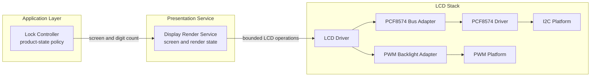
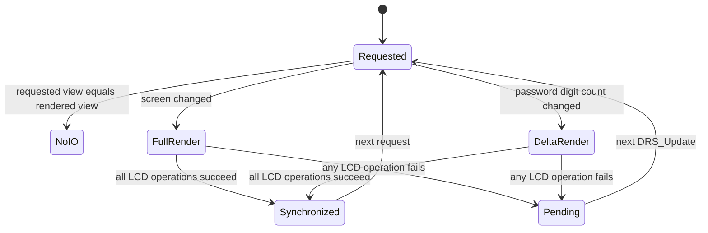
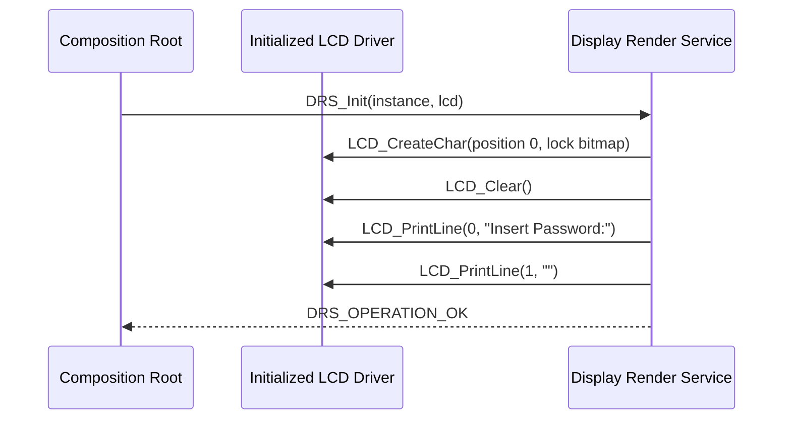
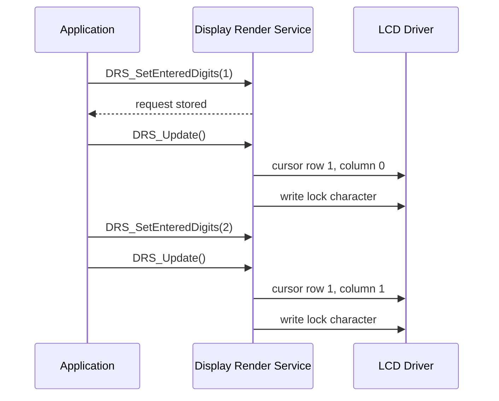

<h1 align="left">Display Render Service</h1>

<p align="left">
  <big>
    Synchronous presentation service for rendering semantic electronic-lock<br>
    screens and masked credential-entry progress on a 16x2 character LCD.
  </big>
</p>

> [!IMPORTANT]
> The Display Render Service receives screen identifiers and an entered-digit count only. It never receives, renders, or retains raw credential digits. The application remains responsible for product-state transitions and for deciding when each screen must be requested.

---

## Table of Contents

* [1. Overview](#1-overview)
* [2. Features](#2-features)
* [3. Architecture](#3-architecture)

  * [3.1 Layer Placement](#31-layer-placement)
  * [3.2 Dependency Direction](#32-dependency-direction)
* [4. Directory Structure](#4-directory-structure)
* [5. Responsibilities](#5-responsibilities)

  * [5.1 Service Responsibilities](#51-service-responsibilities)
  * [5.2 Explicit Non-Responsibilities](#52-explicit-non-responsibilities)
* [6. Dependencies](#6-dependencies)
* [7. Public Data Model](#7-public-data-model)

  * [7.1 Operation Status](#71-operation-status)
  * [7.2 Screen Identifiers](#72-screen-identifiers)
  * [7.3 Entry Capacity](#73-entry-capacity)
  * [7.4 Logical View](#74-logical-view)
  * [7.5 Service Handle](#75-service-handle)
* [8. Screen Catalog](#8-screen-catalog)
* [9. Custom Lock Character](#9-custom-lock-character)
* [10. Rendering Model](#10-rendering-model)

  * [10.1 Requested and Rendered Views](#101-requested-and-rendered-views)
  * [10.2 Full-Screen Rendering](#102-full-screen-rendering)
  * [10.3 Incremental Entry Rendering](#103-incremental-entry-rendering)
  * [10.4 Coalescing](#104-coalescing)
  * [10.5 Failed Render Retry](#105-failed-render-retry)
* [11. API Reference](#11-api-reference)

  * [11.1 DRS_Init](#111-drs_init)
  * [11.2 DRS_SetScreen](#112-drs_setscreen)
  * [11.3 DRS_SetEnteredDigits](#113-drs_setentereddigits)
  * [11.4 DRS_Update](#114-drs_update)
* [12. Operation Flows](#12-operation-flows)

  * [12.1 Initialization](#121-initialization)
  * [12.2 Password Entry](#122-password-entry)
  * [12.3 Screen Transition](#123-screen-transition)
* [13. Usage Example](#13-usage-example)
* [14. Timing and Scheduling](#14-timing-and-scheduling)
* [15. Error Handling](#15-error-handling)
* [16. Concurrency Model](#16-concurrency-model)
* [17. Security Considerations](#17-security-considerations)
* [18. Validation Checklist](#18-validation-checklist)
* [19. Limitations](#19-limitations)
* [20. License](#20-license)

---

## 1. Overview

The Display Render Service converts semantic application requests into fixed LCD content for the electronic-lock user interface.

Instead of allowing the application to write arbitrary strings directly to the display, the service exposes a small screen catalog. The application selects one of those screens and calls `DRS_Update()` to synchronize the physical LCD with the requested view.

During password entry, the application supplies only the number of accepted digits. The service represents each accepted digit with a custom closed-padlock character. No credential value crosses the service boundary.

The service keeps two logical views:

- The most recently requested view.
- The last view rendered successfully on the physical display.

This separation allows the service to avoid redundant LCD traffic and retry a failed operation without losing the pending request.

The acronym `DRS` means **Display Render Service** and prefixes every public symbol provided by this module.

---

## 2. Features

- Semantic screen selection through `DRS_Screen_t`.
- Immediate default screen during initialization.
- Fixed 16-column, two-line screen layouts.
- Masked password-entry progress with a custom 5x8 lock character.
- Support for zero through six entered digits.
- Incremental addition and removal of lock characters.
- Coalescing of unchanged views.
- Full redraw only when the semantic screen changes.
- Deferred rendering through `DRS_Update()`.
- Retryable LCD failures.
- Caller-owned service and LCD instances.
- Static storage with no dynamic allocation.
- No direct STM32 HAL or RTOS dependency in the service implementation.
- No human-scale waits or screen-duration policy.
- No raw credential storage.

---

## 3. Architecture

### 3.1 Layer Placement

The Display Render Service belongs to the presentation-services layer. It is controlled by the application and uses the LCD component through its public driver interface.



The Display Render Service does not initialize the lower hardware stack. The composition root creates and initializes the PCF8574, LCD bus adapter, PWM backlight adapter, LCD driver, and service instance in dependency order.

### 3.2 Dependency Direction

The intended dependency direction is:

```text
Application / Lock Controller
            |
            v
Display Render Service
            |
            v
        LCD Driver
```

The service does not depend on:

- The Credential Entry Service.
- The Authentication Service.
- The Lock Controller.
- Keyboard driver types.
- Application state enumerations.
- STM32 HAL headers.
- FreeRTOS types or primitives.

The application may obtain a credential length from another service and pass only that count to `DRS_SetEnteredDigits()`.

---

## 4. Directory Structure

```text
Display_Render/
├── Inc/
│   └── Display_Render_Service.h
├── Src/
│   └── Display_Render_Service.c
└── README.md
```

The public header defines the screen catalog, logical view, handle, operation status, entry capacity, and service API.

The source file owns the fixed screen strings, lock-character bitmap, render-delta logic, coalescing rules, and LCD error propagation.

---

## 5. Responsibilities

### 5.1 Service Responsibilities

The Display Render Service is responsible for:

- Owning the requested logical display view.
- Tracking the last successfully rendered view.
- Rendering the default password-entry screen during initialization.
- Programming the custom lock character into LCD CGRAM position zero.
- Mapping semantic screen identifiers to fixed two-line text.
- Validating requested screen identifiers.
- Validating the entered-digit count.
- Masking credential progress using lock characters.
- Adding only newly requested lock characters.
- Removing only lock characters no longer requested.
- Avoiding LCD transactions when the visible view has not changed.
- Performing a complete redraw when the screen identifier changes.
- Propagating LCD failures to the caller.
- Keeping a failed render pending for a future retry.

### 5.2 Explicit Non-Responsibilities

The service is not responsible for:

- Reading the keyboard.
- Receiving or storing raw credential digits.
- Determining whether a credential is complete.
- Authenticating a credential.
- Counting failed authentication attempts.
- Applying retry or lockout policy.
- Choosing how long a feedback screen remains visible.
- Automatically returning to the password screen after an error.
- Deciding which application event selects a screen.
- Controlling the lock actuator.
- Producing LED or sound effects.
- Initializing I2C, PCF8574, PWM, LCD bus, or LCD backlight hardware.
- Owning a task, timer, queue, or scheduler.
- Providing localization or runtime-editable text.

---

## 6. Dependencies

The public service header includes:

```c
#include "LCD_Driver.h"
#include "stdbool.h"
#include "stdint.h"
```

The direct runtime dependency is one initialized `LCD_Handle_t`.

The LCD handle may internally use any bus and backlight adapters compatible with the LCD driver interfaces. In the current target, the concrete stack uses:

- I2C1.
- A PCF8574 I/O expander.
- The LCD PCF8574 bus adapter.
- TIM4 channel 4 for backlight PWM.
- The LCD PWM backlight adapter.

Those concrete devices are composition-root concerns and are not accessed directly by the Display Render Service.

For complete LCD-stack initialization details, see the [LCD Driver README](../../Components/LCD/README.md).

---

## 7. Public Data Model

### 7.1 Operation Status

```c
typedef enum
{
    DRS_OPERATION_OK,
    DRS_OPERATION_FAIL

}DRS_OpStatus_t;
```

`DRS_OPERATION_OK` means that the requested API operation completed successfully. For `DRS_Update()`, it also means that the physical view is current or no render was necessary.

`DRS_OPERATION_FAIL` reports an invalid argument, invalid lifecycle state, unsupported value, or lower-level LCD failure.

### 7.2 Screen Identifiers

```c
typedef enum
{
    DRS_SCREEN_PASSWORD_ENTRY,
    DRS_SCREEN_ENTRY_TIMEOUT,
    DRS_SCREEN_ENTRY_INCOMPLETE,
    DRS_SCREEN_ACCESS_GRANTED,
    DRS_SCREEN_ACCESS_DENIED,
    DRS_SCREEN_COUNT

}DRS_Screen_t;
```

`DRS_SCREEN_COUNT` is an internal boundary and sentinel value. It does not identify a renderable screen and shall not be passed to `DRS_SetScreen()`.

### 7.3 Entry Capacity

```c
#define DRS_ENTRY_DIGIT_CAPACITY (6U)
```

The accepted digit count is in the inclusive range from `0U` through `DRS_ENTRY_DIGIT_CAPACITY`.

The value represents the number of accepted credential digits, not their values. A request greater than six fails and does not change the requested view.

### 7.4 Logical View

```c
typedef struct
{
    DRS_Screen_t Screen;
    uint8_t      EnteredDigits;

}DRS_View_t;
```

`Screen` identifies the semantic view. `EnteredDigits` affects physical output only while `Screen` is `DRS_SCREEN_PASSWORD_ENTRY`.

The field can still be updated while a static feedback screen is selected. That update produces no LCD transaction until the password-entry screen is requested again.

### 7.5 Service Handle

```c
typedef struct
{
    LCD_Handle_t* _lcd;
    DRS_View_t    _requested_view;
    DRS_View_t    _rendered_view;
    bool          _initialized;

}DRS_Handle_t;
```

The handle is caller-owned and must remain valid for the entire service lifetime.

Members prefixed with `_` are private implementation state. Callers shall not read or modify them directly. State changes must be requested through the public API.

The injected LCD remains owned by the caller and must also remain valid for the entire service lifetime.

---

## 8. Screen Catalog

The current screen map is fixed at compile time:

| Screen | First line | Second line | Dynamic content |
| --- | --- | --- | --- |
| `DRS_SCREEN_PASSWORD_ENTRY` | `Insert Password:` | Empty initially | Zero through six lock characters from column zero |
| `DRS_SCREEN_ENTRY_TIMEOUT` | `Entry Timeout` | Empty | None |
| `DRS_SCREEN_ENTRY_INCOMPLETE` | `Entry Incomplete` | `      Try Again!` | None |
| `DRS_SCREEN_ACCESS_GRANTED` | `Access Granted` | `Welcome!` | None |
| `DRS_SCREEN_ACCESS_DENIED` | `Access Denied` | `      Try Again!` | None |

The six leading spaces before `Try Again!` place the ten-character text at the right side of the 16-column second line.

Every full-screen transition clears the LCD before writing both lines. This guarantees that shorter strings and intentionally empty lines do not leave characters from the previous view behind.

---

## 9. Custom Lock Character

The service programs one 5x8 character into LCD CGRAM position zero during `DRS_Init()`.

Bitmap bytes:

```c
static const uint8_t DRS_LockCharacterBitmap[8] =
{
    0x0EU,
    0x11U,
    0x11U,
    0x1FU,
    0x1BU,
    0x1BU,
    0x1FU,
    0x00U
};
```

Visual representation, where `#` is an enabled pixel:

```text
.###.
#...#
#...#
#####
##.##
##.##
#####
.....
```

The service owns CGRAM position zero while it is active. Other modules shall not overwrite that position without coordinating with the service.

Password-entry progress is rendered by writing custom-character code zero, not an ASCII digit or masking symbol.

---

## 10. Rendering Model

### 10.1 Requested and Rendered Views

State-setting functions update `_requested_view` only. They do not communicate with the LCD.

`DRS_Update()` compares `_requested_view` with `_rendered_view` and performs only the operations required to synchronize them.



### 10.2 Full-Screen Rendering

A semantic screen change performs the following bounded sequence:

1. Clear the LCD.
2. Print the configured first line.
3. Print the configured second line.
4. If the requested screen is password entry, draw the requested number of locks.
5. Commit the requested view as the rendered view only after every operation succeeds.

Full-screen rendering is used even when two screens share some text. Semantic screen transitions are infrequent and clearing first guarantees deterministic content.

### 10.3 Incremental Entry Rendering

When the password-entry screen remains active and only the digit count changes, the service avoids a complete redraw.

If the count increases, the service:

1. Positions the cursor at the first newly requested column.
2. Writes only the additional lock characters.

For example, changing from two digits to five writes three lock characters at columns two, three, and four.

If the count decreases, the service:

1. Positions the cursor at the new end of the entered sequence.
2. Overwrites only the removed lock positions with spaces.

For example, changing from five digits to two writes three spaces at columns two, three, and four.

### 10.4 Coalescing

Repeated calls to `DRS_Update()` perform no LCD transactions when:

- The requested and rendered screen identifiers match; and
- The active screen is not password entry, or its requested and rendered digit counts match.

Digit-count changes while a static feedback screen is active are logically retained but do not produce output because those screens do not display entry progress.

### 10.5 Failed Render Retry

The rendered view is updated only after every required LCD operation succeeds.

If an I2C or LCD operation fails:

- `DRS_Update()` returns `DRS_OPERATION_FAIL`.
- The requested view remains unchanged.
- The rendered view is not committed.
- A later `DRS_Update()` retries the pending render.

A partial physical write may have occurred before the failure. The retry may therefore repeat some already completed LCD operations. Repetition is intentional and converges the display toward the requested view.

---

## 11. API Reference

### 11.1 DRS_Init

```c
DRS_OpStatus_t DRS_Init(
    DRS_Handle_t* Instance,
    LCD_Handle_t* LCD
);
```

Initializes one service instance.

Behavior:

- Stores the caller-owned LCD reference.
- Selects `DRS_SCREEN_PASSWORD_ENTRY` with zero entered digits.
- Programs the lock character into CGRAM position zero.
- Immediately renders the default view.
- Marks the service initialized only when setup and default rendering succeed.

Preconditions:

- `Instance` is non-null.
- `LCD` is non-null.
- The LCD driver and its bus and backlight interfaces have already been initialized.
- The LCD uses a 16x2 layout with the 5x8 character font.

Returns:

- `DRS_OPERATION_OK` when the lock character and default view are rendered successfully.
- `DRS_OPERATION_FAIL` for an invalid pointer or any LCD failure.

### 11.2 DRS_SetScreen

```c
DRS_OpStatus_t DRS_SetScreen(
    DRS_Handle_t* Instance,
    DRS_Screen_t Screen
);
```

Stores a semantic screen request.

The function does not access the LCD. The application must call `DRS_Update()` to render the new screen.

Returns `DRS_OPERATION_FAIL` when:

- `Instance` is null.
- The service is not initialized.
- `Screen` is not a renderable value.
- `Screen` is `DRS_SCREEN_COUNT`.

### 11.3 DRS_SetEnteredDigits

```c
DRS_OpStatus_t DRS_SetEnteredDigits(
    DRS_Handle_t* Instance,
    uint8_t EnteredDigits
);
```

Stores the requested masked-entry length.

The function accepts values from `0U` through `DRS_ENTRY_DIGIT_CAPACITY`. It does not receive a pointer to credential data and performs no LCD transaction.

The application must call `DRS_Update()` to apply the new count.

Returns `DRS_OPERATION_FAIL` when:

- `Instance` is null.
- The service is not initialized.
- `EnteredDigits` is greater than six.

### 11.4 DRS_Update

```c
DRS_OpStatus_t DRS_Update(
    DRS_Handle_t* Instance
);
```

Synchronizes the physical LCD with the most recently requested view.

Possible outcomes:

- No change: returns successfully without LCD transactions.
- Screen change: performs a full-screen render.
- Password length increase: writes only new locks.
- Password length decrease: clears only removed locks.
- LCD failure: returns failure and leaves the request pending.

Returns `DRS_OPERATION_FAIL` when the instance is null, uninitialized, missing its LCD reference, or a required LCD operation fails.

---

## 12. Operation Flows

### 12.1 Initialization



After successful initialization, the physical display already shows the empty default password-entry screen. An additional initial `DRS_Update()` is optional and produces no LCD transaction.

### 12.2 Password Entry



Only accepted-entry count changes should be forwarded. Raw key values and raw candidate digits shall never be passed to the display layer.

### 12.3 Screen Transition

The application selects the semantic screen and then updates the renderer:

```c
if(DRS_SetScreen(&Display, DRS_SCREEN_ACCESS_GRANTED) == DRS_OPERATION_OK)
{
    (void)DRS_Update(&Display);
}
```

The service does not automatically return to password entry. After the application-owned feedback duration expires, the application explicitly requests `DRS_SCREEN_PASSWORD_ENTRY`.

---

## 13. Usage Example

The lower LCD stack must already be initialized before the service is created. The following example focuses on service usage:

```c
#include "Display_Render_Service.h"

static LCD_Handle_t LCD;
static DRS_Handle_t Display;

static bool Display_Init(void)
{
    /*
     * Initialize I2C, PCF8574, LCD bus, PWM backlight, and LCD first.
     * The concrete target uses TIM4 channel 4 for backlight PWM.
     */

    return DRS_Init(&Display, &LCD) == DRS_OPERATION_OK;
}

static bool Display_ShowEntryLength(uint8_t EnteredDigits)
{
    if(DRS_SetEnteredDigits(&Display, EnteredDigits) != DRS_OPERATION_OK)
    {
        return false;
    }

    return DRS_Update(&Display) == DRS_OPERATION_OK;
}

static bool Display_ShowScreen(DRS_Screen_t Screen)
{
    if(DRS_SetScreen(&Display, Screen) != DRS_OPERATION_OK)
    {
        return false;
    }

    return DRS_Update(&Display) == DRS_OPERATION_OK;
}
```

Typical application use:

```c
/* One credential digit was accepted by the entry policy. */
(void)Display_ShowEntryLength(1U);

/* Confirmation was requested before all six digits were entered. */
(void)Display_ShowScreen(DRS_SCREEN_ENTRY_INCOMPLETE);

/* The application later starts a fresh entry view. */
(void)DRS_SetEnteredDigits(&Display, 0U);
(void)Display_ShowScreen(DRS_SCREEN_PASSWORD_ENTRY);
```

Production application code should propagate and handle every returned status according to the system fault policy rather than discarding it as the concise example does.

---

## 14. Timing and Scheduling

`DRS_SetScreen()` and `DRS_SetEnteredDigits()` update memory only and complete in bounded time.

`DRS_Update()` is synchronous. It returns only after all required LCD operations for that update have completed or one of them has failed.

The service itself does not call `HAL_Delay()`, sleep, schedule a timer, or hold a feedback screen for a product-visible duration. Any short controller-command timing required by the LCD driver remains a lower-layer concern.

The intended application pattern is:

1. Store any new semantic screen or digit-count request.
2. Call `DRS_Update()` from the serialized application execution context.
3. Continue normal application processing after the bounded LCD operation returns.

Calling `DRS_Update()` periodically is supported because unchanged views are coalesced. A new update is also appropriate immediately after a user-interface request when synchronous rendering is desired.

Human-scale durations such as keeping `Access Granted` visible for two seconds belong to the application state machine and timeout policy, not to this service.

---

## 15. Error Handling

The service rejects invalid usage without intentionally changing the requested view.

Initialization fails when:

- The service handle is null.
- The LCD handle is null.
- The lock character cannot be programmed.
- The default screen cannot be rendered.

Screen selection fails when:

- The service is uninitialized.
- The screen identifier is outside the valid catalog.

Entry-length selection fails when:

- The service is uninitialized.
- The requested count exceeds `DRS_ENTRY_DIGIT_CAPACITY`.

Rendering fails when any required LCD operation fails, including:

- Clearing the display.
- Positioning the cursor.
- Printing either line.
- Writing a custom lock character.
- Clearing a removed lock position.

After an update failure, the application may call `DRS_Update()` again. The service retains the pending requested view because it commits rendered state only after a completely successful update.

Repeated failures should be escalated to the application fault policy. The service does not reset I2C, reinitialize the LCD, or select a degraded screen automatically.

---

## 16. Concurrency Model

One `DRS_Handle_t` instance shall be accessed by only one serialized execution context at a time.

The service does not provide:

- Mutexes.
- Critical sections.
- Atomic request updates.
- Interrupt-safe APIs.
- Internal message queues.

Concurrent calls from multiple tasks, or calls from both task and interrupt context, require external serialization and are not part of the V1 contract.

The intended owner is the Application Task through the Lock Controller. Other services shall not write directly to the same LCD while the Display Render Service owns it.

---

## 17. Security Considerations

The display is an externally observable interface. Credential data must not be exposed through it.

The integration shall follow these rules:

- Pass only the accepted credential length to `DRS_SetEnteredDigits()`.
- Never format raw credential digits into LCD strings.
- Never add an API that accepts a raw credential buffer merely for masking.
- Do not log the candidate credential while preparing a display request.
- Clear or replace the entry view when the credential-entry session ends.
- Keep authentication results semantic; do not reveal which credential position was incorrect.
- Treat LCD or I2C failures as recoverable presentation faults without relaxing authentication policy.

The lock icons reveal the number of entered digits. This is intentional progress feedback in the current product model. If hiding credential length becomes a product requirement, the presentation contract must be revised explicitly.

---

## 18. Validation Checklist

Minimum service validation includes:

- Null service and LCD pointers are rejected during initialization.
- An initialized 16x2 LCD produces the default `Insert Password:` screen.
- The default second line is empty.
- CGRAM position zero receives the expected eight-byte lock bitmap.
- A repeated `DRS_Update()` after initialization produces no LCD transaction.
- Every valid screen identifier is accepted.
- `DRS_SCREEN_COUNT` and out-of-range identifiers are rejected.
- Entered-digit counts from zero through six are accepted.
- A count greater than six is rejected without changing the pending view.
- Increasing from zero to one digit writes exactly one lock.
- Increasing from one to three digits writes exactly two additional locks.
- Decreasing from three to one digit clears exactly two positions.
- Switching screens clears stale content before printing the new view.
- `Entry Timeout` renders an empty second line.
- `Entry Incomplete` renders `Try Again!` on the second line.
- `Access Granted` renders `Welcome!` on the second line.
- `Access Denied` renders `Try Again!` on the second line.
- Changing the digit count while a static screen is active performs no LCD transaction.
- Returning to password entry renders the latest requested digit count.
- An LCD failure returns `DRS_OPERATION_FAIL`.
- A failed render is retried on the next `DRS_Update()`.
- A successful retry updates the rendered-view state.
- No API accepts or exposes a raw credential digit or buffer.
- The complete firmware builds with the service source included.

These cases can be exercised with a host-side fake LCD and a target smoke test that cycles through all semantic screens.

---

## 19. Limitations

Current V1 limitations include:

- The layout is fixed to a 16x2 character LCD.
- The lock bitmap assumes the 5x8 character font.
- CGRAM position zero is reserved by the service.
- The entry capacity is fixed at six digits.
- Screen text is fixed in English at compile time.
- Only the five declared semantic screens are implemented.
- Remaining-attempt counts are not rendered.
- Lockout countdown and degraded/fault screens are not implemented.
- Backlight state and brightness are not managed by the service.
- Screen durations and automatic transitions are not managed by the service.
- Animations and scrolling are not implemented.
- A screen change clears and redraws the complete display.
- LCD communication is synchronous.
- The service is not internally thread-safe.
- The handle exposes private members because opaque allocation is not used.
- The service does not recover or reinitialize a failed LCD bus.

Future screen additions should preserve the semantic application boundary, fixed storage, credential-masking rules, and render-coalescing behavior.

---

## 20. License

This module is part of the:

```text
Electronic Lock Project
```

and follows the project's license terms.
