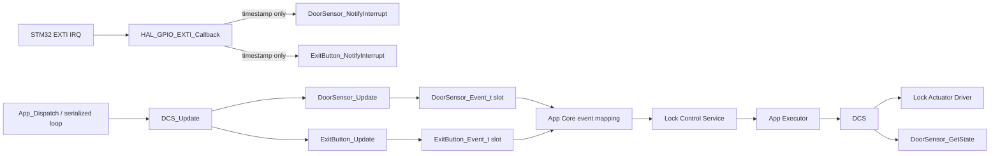
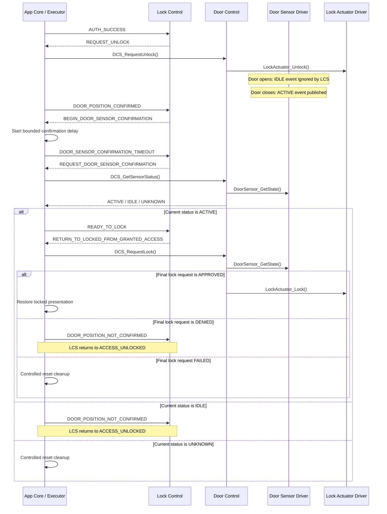
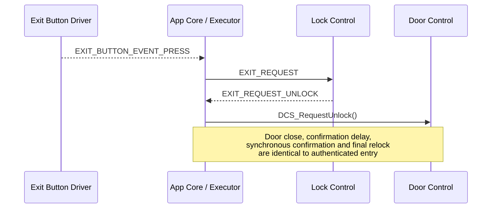

<h1 align="left">Door Control Service</h1>

<p align="left">
  <big>
    Serialized coordination of the lock actuator, door contact and request-to-exit button,<br>
    with interrupt-driven input acquisition and non-blocking debounce.
  </big>
</p>

> [!IMPORTANT]
> The Door Control Service does not own the product finite-state machine. It coordinates physical door-mechanism components and
> publishes debounced component events; App Core translates those events and the Lock Control Service decides valid product-state
> transitions.

---

## Table of Contents

* [1. Overview](#1-overview)
* [2. Responsibilities and Boundaries](#2-responsibilities-and-boundaries)
* [3. Architecture](#3-architecture)
* [4. Directory Structure](#4-directory-structure)
* [5. Dependencies](#5-dependencies)
* [6. Runtime Ownership and Initialization](#6-runtime-ownership-and-initialization)
* [7. Public Types](#7-public-types)
* [8. Public API](#8-public-api)
* [9. Interrupt and Debounce Model](#9-interrupt-and-debounce-model)
* [10. Actuator Policy](#10-actuator-policy)
* [11. Application and LCS Integration](#11-application-and-lcs-integration)
* [12. Product Flows](#12-product-flows)
* [13. Timing and Concurrency](#13-timing-and-concurrency)
* [14. Error and Safety Behavior](#14-error-and-safety-behavior)
* [15. Usage Constraints](#15-usage-constraints)
* [16. Verification](#16-verification)
* [17. Current Limitations](#17-current-limitations)
* [18. Extension Checklist](#18-extension-checklist)
* [19. License](#19-license)

---

## 1. Overview

The Door Control Service (DCS) is the application-facing boundary for three physical door-mechanism components:

| Component | Role |
|---|---|
| [Lock Actuator Driver](../../Components/LockActuator/README.md) | Applies normalized lock and unlock output commands. |
| [Door Sensor Driver](../../Components/DoorSensor/README.md) | Converts door-contact EXTI activity into debounced `ACTIVE` and `IDLE` events and provides immediate normalized reads. |
| [Exit Button Driver](../../Components/ExitButton/README.md) | Converts request-to-exit EXTI activity into debounced press and release events. |

DCS centralizes component access so App Executor does not manipulate the actuator GPIO directly and App Core does not implement
component debounce. It remains deliberately small: authorization, credential policy, lockout, door-flow states and timeout transitions
belong to the [Lock Control Service](../Lock_Control/README.md).

The service uses a singleton because the current product has one physical door mechanism. App Config owns all component handles and
event-output objects; DCS only borrows their addresses.

---

## 2. Responsibilities and Boundaries

DCS is responsible for:

* Retaining the application-owned Lock Actuator, Door Sensor and Exit Button handles.
* Retaining caller-owned output slots for debounced door-sensor and exit-button events.
* Updating both interrupt-oriented input drivers from serialized application context.
* Obtaining one millisecond timestamp per update cycle for consistent debounce evaluation.
* Requesting lock and unlock through the Lock Actuator Driver.
* Denying a normal lock request unless the current door contact is in the configured active, lock-permissive state.
* Providing an explicit force-lock operation for fail-safe paths that intentionally bypass the normal sensor interlock.
* Translating an instantaneous Door Sensor state into a DCS-level status.

DCS is not responsible for:

* Configuring GPIO pins, EXTI lines, NVIC priorities or electrical pull resistors.
* Receiving HAL callbacks directly.
* Reading or debouncing inputs inside interrupt context.
* Calling `LCS_Process()` or selecting a product-state transition.
* Authenticating credentials or deciding whether access is authorized.
* Starting application timeouts or owning the relock-delay duration.
* Rendering display content, controlling status LEDs or selecting sounds.
* Queuing component events.
* Confirming the mechanical bolt position; the Lock Actuator Driver represents a command output only.

---

## 3. Architecture



The two input paths are deliberately split:

1. Interrupt context records edge metadata and returns.
2. Application context waits for the configured quiet interval, samples the GPIO and publishes a normalized transition.

This prevents debounce delays, product logic and actuator commands from executing inside an ISR.

---

## 4. Directory Structure

```text
Libs/Services/Door_Control/
├── Inc/
│   └── Door_Control_Service.h
├── Src/
│   └── Door_Control_Service.c
└── README.md
```

| Path | Responsibility |
|---|---|
| `Inc/Door_Control_Service.h` | Public types, lifecycle contract and component-coordination API. |
| `Src/Door_Control_Service.c` | Singleton context, actuator policy, sensor translation and periodic input updates. |
| `README.md` | Architecture, interrupt model, integration contract, safety rules and maintenance guidance. |

---

## 5. Dependencies

The implementation depends on:

```text
Door_Control_Service.h
DoorSensor_Driver.h
ExitButton_Driver.h
LockActuator_Driver.h
Time_Platform_Interface.h
```

The public header uses opaque `void*` attachment parameters so component-driver types do not become transitive dependencies of every
DCS consumer. App Core remains responsible for passing objects of the documented concrete types. DCS can reject a `NULL` pointer but
cannot detect a non-NULL pointer of the wrong concrete type, so the attachment contract is type-safe only by documented composition.

DCS has no direct dependency on:

* Lock Control Service;
* App Core or App Executor headers;
* STM32 HAL;
* Credential services;
* Display, LED or sound services;
* RTOS or dynamic allocation.

---

## 6. Runtime Ownership and Initialization

App Config statically owns:

* one `LockActuator_Handle_t`;
* one `DoorSensor_Handle_t`;
* one `ExitButton_Handle_t`;
* one `DoorSensor_Event_t` output slot;
* one `ExitButton_Event_t` output slot.

After Platform and component initialization, App Core attaches them in two steps:

```c
DCS_AttachComponents(&App_LockActuator, &App_DoorSensor, &App_ExitButton);
DCS_AttachContext(&App_ExitButtonEvent, &App_DoorSensorEvent);
```

Both calls must succeed before `DCS_Update()` or any actuator/status operation. DCS exposes no separate readiness flag or initialization
query, so successful attachment is a caller-maintained runtime precondition. Pointers are borrowed and must remain valid for the complete
application lifetime. Reattachment is supported only as an initialization/composition operation; runtime replacement is not part of the
product contract.

The output slots are overwritten by every update. Callers shall consume them in the same serialized dispatch cycle.

---

## 7. Public Types

### `DCS_OpStatus_t`

| Value | Meaning |
|---|---|
| `DCS_OPERATION_OK` | Attachment, direct actuator command or sensor-status translation completed. |
| `DCS_OPERATION_FAIL` | An argument or delegated component operation failed. |

### `DCS_RequestLockStatus_t`

| Value | Meaning |
|---|---|
| `DCS_LOCK_REQUEST_APPROVED` | Sensor was lock-permissive and the actuator accepted the command. |
| `DCS_LOCK_REQUEST_DENIED` | Sensor was `IDLE` or `UNKNOWN`; no actuator command was issued. |
| `DCS_LOCK_REQUEST_FAILED` | Sensor permitted locking, but the actuator command failed. |

### `DCS_SensorStatus_t`

| Value | Meaning |
|---|---|
| `DCS_SENSOR_STATUS_ACTIVE` | The configured active contact level is present. |
| `DCS_SENSOR_STATUS_IDLE` | The inverse contact level is present. |
| `DCS_SENSOR_STATUS_UNKNOWN` | A trustworthy normalized level is unavailable. |

The current application configures the Door Sensor active-low. DCS interprets the normalized `ACTIVE` state as the condition that
permits locking. Electrical polarity and physical door meaning shall be validated on target hardware.

`DCS_SENSOR_STATUS_UNKNOWN` is a valid translated sensor result. Therefore `DCS_GetSensorStatus()` may return
`DCS_OPERATION_OK` while writing `DCS_SENSOR_STATUS_UNKNOWN`; callers must evaluate both the operation result and the returned status when
a trusted physical condition is required.

---

## 8. Public API

### `DCS_AttachComponents`

```c
DCS_OpStatus_t DCS_AttachComponents(
    void* LockActuator_Context,
    void* DoorSensor_Context,
    void* ExitButton_Context
);
```

Attaches initialized component handles. The required concrete types are `LockActuator_Handle_t*`, `DoorSensor_Handle_t*` and
`ExitButton_Handle_t*`. Any NULL input rejects the complete call and preserves the previous context. A non-NULL pointer of the wrong
concrete type cannot be detected at runtime.

### `DCS_AttachContext`

```c
DCS_OpStatus_t DCS_AttachContext(
    void* ExitButton_Event,
    void* DoorSensor_Event
);
```

Attaches caller-owned event destinations. The required concrete types are `ExitButton_Event_t*` and `DoorSensor_Event_t*`.

### `DCS_RequestLock`

```c
DCS_RequestLockStatus_t DCS_RequestLock(void);
```

Reads the sensor immediately. Only `DOOR_SENSOR_STATE_ACTIVE` delegates to `LockActuator_Lock()`. `IDLE` and `UNKNOWN` are safe
policy denials and do not command the actuator. Component attachment is a precondition.

### `DCS_ForceLock`

```c
DCS_OpStatus_t DCS_ForceLock(void);
```

Delegates directly to the actuator without the sensor guard. This is a fail-safe primitive, not the normal relock operation.
Component attachment is a precondition.

### `DCS_RequestUnlock`

```c
DCS_OpStatus_t DCS_RequestUnlock(void);
```

Delegates an already-authorized unlock command to the Lock Actuator Driver. Component attachment is a precondition.

### `DCS_GetSensorStatus`

```c
DCS_OpStatus_t DCS_GetSensorStatus(DCS_SensorStatus_t* Status);
```

Returns an immediate normalized state. It neither waits for debounce nor consumes an interrupt-driven event. `UNKNOWN` is returned
as a valid `DCS_SENSOR_STATUS_UNKNOWN` result with `DCS_OPERATION_OK`; only a NULL output pointer is a DCS-level argument failure.

### `DCS_Update`

```c
void DCS_Update(void);
```

Obtains the current Platform timestamp once and updates the Exit Button and Door Sensor drivers. Each driver resets its output slot to
`NONE`, processes a pending edge only after debounce and publishes at most one stable transition. Both attachment phases are preconditions.
The current implementation discards both delegated update statuses, so this void call does not expose component processing failures.

---

## 9. Interrupt and Debounce Model

PA0 (`EXIT_BUTTON`) and PA11 (`DOOR_SENSOR`) are configured as pull-up inputs with rising-and-falling EXTI detection.

The shared callback performs only publication:

```c
if(GPIO_Pin == EXIT_BUTTON_Pin)
{
    ExitButton_NotifyInterrupt(ExitButton, now);
}
else if(GPIO_Pin == DOOR_SENSOR_Pin)
{
    DoorSensor_NotifyInterrupt(DoorSensor, now);
}
```

Each component stores:

* the newest interrupt timestamp;
* a volatile interrupt sequence;
* the last processed sequence;
* the last stable normalized state;
* the configured debounce interval.

`DCS_Update()` later calls both component updates. A component update:

1. Clears its caller-owned event slot to `NONE`.
2. Detects whether a new interrupt sequence exists.
3. Waits non-blockingly until the quiet interval has elapsed.
4. Samples and normalizes the GPIO.
5. Rechecks the sequence to detect an edge arriving during processing.
6. Publishes a transition only when the stable normalized state changed.

No delay loop is used. A later edge restarts the quiet interval. Events are not queued, so `App_Dispatch()` must continue running.

The application currently configures 20 ms debounce for the Exit Button and 500 ms debounce for the Door Sensor.

---

## 10. Actuator Policy

| Operation | Sensor check | Intended use |
|---|---|---|
| `DCS_RequestUnlock()` | None | Already-authorized credential or exit-button flow. |
| `DCS_RequestLock()` | Requires immediate `ACTIVE` | Normal product relock after door-position confirmation and delay. |
| `DCS_ForceLock()` | Bypassed | Explicit fail-safe cleanup where the safe output must be requested independently. |

DCS controls command intent only. The Lock Actuator Driver does not report mechanical bolt travel or final bolt position.

A denied normal lock request does not retry automatically and does not enqueue pending work. App policy must decide the subsequent
state/event behavior.

---

## 11. Application and LCS Integration

App Core consumes both output slots after `DCS_Update()`:

| Component event | App Core mapping | Accepted LCS context |
|---|---|---|
| `EXIT_BUTTON_EVENT_PRESS` | `LCS_EVENT_EXIT_REQUEST` | Locked idle; requests exit unlock. |
| `EXIT_BUTTON_EVENT_RELEASE` | No LCS event | Electrical release is not a product transition. |
| `DOOR_SENSOR_EVENT_ACTIVE` | `LCS_EVENT_DOOR_POSITION_CONFIRMED` | Access-unlocked state; starts the bounded relock delay. |
| `DOOR_SENSOR_EVENT_IDLE` | No LCS event | Records the opposite contact transition only at component level. |

The Door Sensor does not emit an initial event during initialization. With a normally closed/active starting contact, opening the door
produces `IDLE` and closing it again produces `ACTIVE`. Therefore the active event accepted by LCS represents a post-unlock contact
transition rather than an immediate poll of a door that was already closed before unlock.

App Executor invokes DCS only in response to semantic LCS actions. DCS never includes the LCS public header and never chooses a state.

The post-unlock confirmation uses two different DCS mechanisms deliberately:

1. `DOOR_SENSOR_EVENT_ACTIVE` is an asynchronous, debounced transition used to tell LCS that the required door-position condition was
   observed after unlock.
2. After the bounded confirmation delay, `LCS_ACTION_REQUEST_DOOR_SENSOR_CONFIRMATION` asks App Executor for a **synchronous current
   status check** through `DCS_GetSensorStatus()`.
3. App Core dispatches `LCS_EVENT_READY_TO_LOCK` only when that immediate status is `DCS_SENSOR_STATUS_ACTIVE`.
4. `LCS_ACTION_RETURN_TO_LOCKED_FROM_GRANTED_ACCESS` then requests the actual relock through `DCS_RequestLock()`, which samples the door
   sensor again immediately before commanding the actuator.

This second sensor read is intentional. The first synchronous read authorizes the FSM's ready-to-lock decision; the final
`DCS_RequestLock()` interlock protects against the contact changing between that decision and actuator execution.

---

## 12. Product Flows

### Authenticated entry



The two current-level checks are intentional. `DCS_GetSensorStatus()` verifies that the door condition still authorizes entering the
ready-to-lock decision. `DCS_RequestLock()` then rechecks the sensor immediately before the actuator command so a late contact change
cannot silently bypass the normal interlock.

The current LCS contract commits `LOCKED` before returning `RETURN_TO_LOCKED_FROM_GRANTED_ACCESS`. App Executor reconciles the final
`DCS_RequestLock()` result synchronously: `DENIED` produces `LCS_EVENT_DOOR_POSITION_NOT_CONFIRMED`, whose dedicated `LOCKED` transition
returns the FSM to `ACCESS_UNLOCKED`; `FAILED` enters the controlled-reset path. Only `APPROVED` restores locked presentation.

### Request to exit



Request-to-exit differs only in how unlock is authorized. Once `ACCESS_UNLOCKED` is entered, both access sources use the same
door-position and relock sequence.

---

## 13. Timing and Concurrency

* HAL EXTI callbacks and the main loop share interrupt timestamp and sequence fields declared `volatile` by each input component.
* On Cortex-M3, aligned 32-bit timestamp and sequence accesses are used for the interrupt handoff.
* The sequence value is the publication marker: the ISR writes time first and increments sequence last.
* Each component update verifies the sequence before and after GPIO sampling.
* DCS itself supports one serialized application caller and no concurrent actuator requests.
* `DCS_Update()` contains no deliberate wait and has bounded work.
* Unsigned subtraction in the component drivers preserves debounce timing across millisecond counter wraparound.

---

## 14. Error and Safety Behavior

| Condition | Current result |
|---|---|
| NULL component/event attachment argument | Attachment returns `DCS_OPERATION_FAIL`. |
| Sensor is `IDLE` or `UNKNOWN` during normal lock request | Returns `DCS_LOCK_REQUEST_DENIED`; actuator is not commanded. |
| `DCS_GetSensorStatus()` obtains UNKNOWN | Returns `DCS_OPERATION_OK` with `DCS_SENSOR_STATUS_UNKNOWN`; caller must apply policy. |
| Lock Actuator command fails | Returns a failed operation status. |
| Synchronous confirmation reports `IDLE` | App Executor returns `LCS_EVENT_DOOR_POSITION_NOT_CONFIRMED`; LCS returns from `READY_TO_LOCK` to `ACCESS_UNLOCKED`. |
| Synchronous confirmation reports `UNKNOWN` | App Executor enters controlled-reset cleanup. |
| Final relock is denied after LCS returned the relock action | App Executor returns `LCS_EVENT_DOOR_POSITION_NOT_CONFIRMED`; the dedicated `LOCKED` transition reconciles the FSM to `ACCESS_UNLOCKED`. |
| Final relock actuator command fails | App Executor enters controlled-reset cleanup. |
| Component update fails | `DCS_Update()` currently discards the status; no DCS fault event exists. |
| EXTI notification arrives before component initialization | Component NotifyInterrupt function ignores it. |
| Unsupported EXTI source reaches the shared callback | Callback ignores it. |

Normal lock interlocking and fail-safe force-lock are deliberately separate APIs. Callers shall not substitute `DCS_RequestLock()` for
an explicit safety action when product policy requires commanding the safe electrical output regardless of sensor state.

Likewise, `DCS_GetSensorStatus()` and `DCS_RequestLock()` serve different stages of the relock handshake: the former supplies a current
condition for the LCS `READY_TO_LOCK` decision, while the latter is the final actuator request and repeats the sensor interlock. Neither
operation changes LCS state by itself.

---

## 15. Usage Constraints

* Initialize GPIO Platform descriptors and all three component handles before attachment.
* Configure both input GPIOs for rising-and-falling EXTI when both logical transitions are required.
* Keep attached handles and event slots alive for the complete firmware lifetime.
* Treat successful component and event attachment as a runtime precondition; DCS has no readiness query.
* Pass the exact documented concrete object types through every opaque `void*` attachment parameter.
* Call `DCS_Update()` periodically from application context, never from an ISR.
* Consume event slots in the same cycle because the next update overwrites them.
* Do not access component private members through DCS.
* Do not infer physical open/closed meaning from ACTIVE/IDLE without validating the configured circuit.
* Do not call actuator APIs concurrently.
* Keep product-state decisions and LCS event dispatch in App Core.

---

## 16. Verification

Current verification includes:

* Full STM32 Debug firmware compilation with the ARM toolchain.
* The 20-scenario native LCS suite, including authenticated unlock, request-to-exit unlock, door-position confirmation, confirmation
  timeout, ready-to-lock completion, lost-confirmation recovery and final-relock-denial reconciliation.

Target validation shall additionally verify:

* PA0 and PA11 rising/falling EXTI delivery.
* Correct active-low electrical interpretation for both inputs.
* Measured 20 ms Exit Button and 500 ms Door Sensor debounce behavior under contact bounce.
* Door open then close producing `IDLE` then `ACTIVE` exactly once.
* No actuator command from interrupt context.
* Normal lock denial while the door contact is not permissive.
* `DCS_GetSensorStatus()` reporting ACTIVE after the confirmation delay before `READY_TO_LOCK` is dispatched.
* `LCS_EVENT_DOOR_POSITION_NOT_CONFIRMED` recovery when the synchronous status is IDLE.
* Controlled-reset recovery when the synchronous status is UNKNOWN.
* Final `DCS_RequestLock()` denial and `LOCKED`-state reconciliation if the contact changes after confirmation but before actuator execution.
* Controlled-reset recovery when the final actuator lock command fails.

---

## 17. Current Limitations

* DCS exposes no dedicated initialization/readiness query.
* Component update failures are currently ignored by `DCS_Update()` rather than promoted to App Core.
* Events use caller-owned single slots; there is no queue or history.
* Door Sensor `IDLE` is not yet translated into an LCS door-open event.
* The normal lock request is synchronous and not retried.
* The actuator reports command success, not confirmed mechanical position.
* `DCS_SENSOR_STATUS_IDLE` has explicit semantic recovery, while `UNKNOWN` is intentionally escalated to controlled reset rather than
  represented by a separate LCS event.
* Final relock denial has explicit LCS reconciliation, but the retry depends on a later debounced `ACTIVE` door event; DCS itself does
  not schedule or retry the request.
* Final actuator-command failure is recoverable only through the controlled-reset path; no non-reset retry policy is modeled.
* The service has no readiness query and relies on caller-maintained attachment preconditions.
* Opaque `void*` attachment prevents compile-time concrete-type checking at the public DCS boundary.
* The service supports exactly one door mechanism.

---

## 18. Extension Checklist

When extending DCS:

1. Keep EXTI callbacks limited to timestamp/sequence publication.
2. Add component events rather than raw GPIO levels to App Core.
3. Keep DCS independent from the LCS header and state identifiers.
4. Document whether a new actuator operation applies or bypasses the sensor interlock.
5. Define ownership and lifetime for every attached pointer.
6. Update App Config, App Core, root README, component READMEs and native tests together.
7. Add explicit failure propagation before claiming update failures are fail-safe.
8. Preserve the current `ACTIVE` / `IDLE` / `UNKNOWN` mapping when extending the synchronous LCS confirmation handshake.
9. Preserve the final sensor interlock immediately before a normal actuator lock command.
10. Verify both native logic and the complete ARM firmware build.

---

## 19. License

This module is part of the:

```text
Electronic Lock Project
```

and follows the project's license terms.
