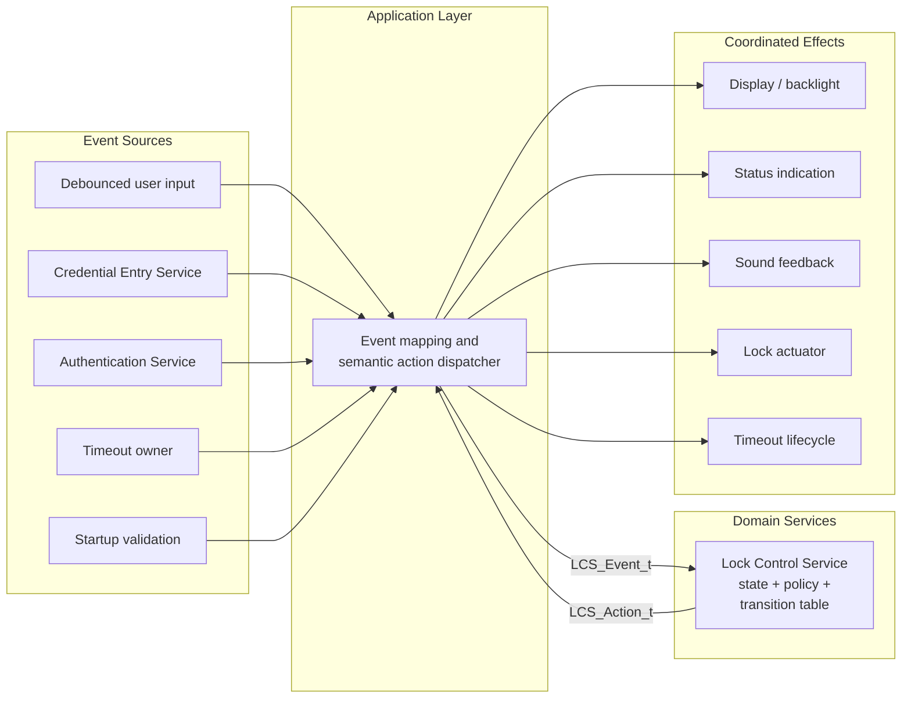
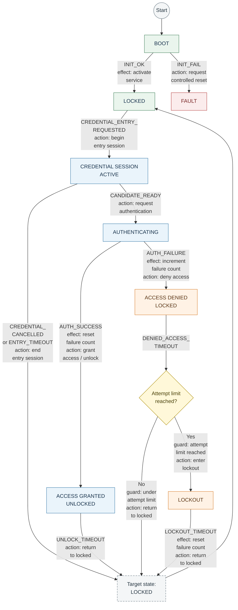
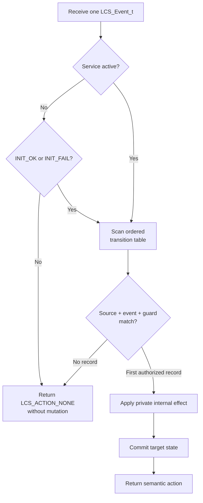
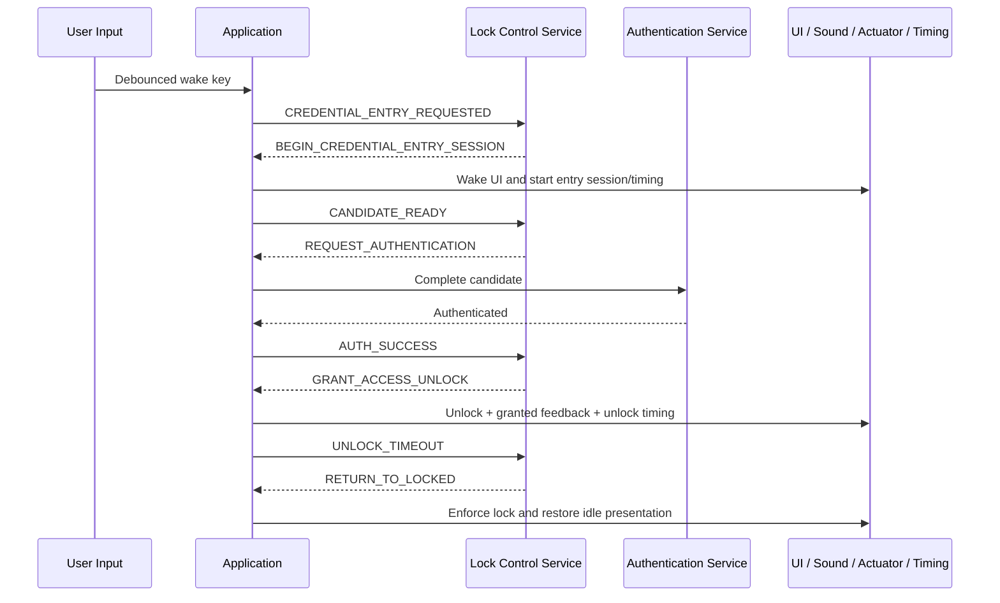

<h1 align="left">Lock Control Service</h1>

<p align="left">
  <big>
    Table-driven, hardware-independent finite-state machine for coordinating<br>
    the product-level behavior of an embedded electronic lock.
  </big>
</p>

> [!IMPORTANT]
> The Lock Control Service is a **decision component**, not an action executor. It receives semantic events, updates only its own private runtime state, and returns one semantic `LCS_Action_t` to the application. It never calls the display, LED, sound, credential-entry, authentication, timeout, or lock-actuator interfaces directly. The application is the composition boundary that knows how to coordinate all of those elements to realize the requested action.

> [!NOTE]
> The finite-state machine is represented by a linear, immutable transition table. Existing behavior can be extended primarily by adding transition records instead of spreading transition logic across nested `switch` statements. A genuinely new state, event, guard, internal effect, or public action still requires adding the corresponding identifier and, when applicable, its small interpreter case.

---

## Table of Contents

* [1. Overview](#1-overview)
* [2. Features](#2-features)
* [3. Architecture](#3-architecture)

  * [3.1 Layer Placement](#31-layer-placement)
  * [3.2 Decision and Execution Boundary](#32-decision-and-execution-boundary)
  * [3.3 Singleton Ownership](#33-singleton-ownership)
* [4. Directory Structure](#4-directory-structure)
* [5. Service Responsibilities](#5-service-responsibilities)

  * [5.1 Responsibilities](#51-responsibilities)
  * [5.2 Explicit Non-Responsibilities](#52-explicit-non-responsibilities)
* [6. Dependencies](#6-dependencies)
* [7. Public Data Model](#7-public-data-model)

  * [7.1 Semantic Events](#71-semantic-events)
  * [7.2 Semantic Actions](#72-semantic-actions)
  * [7.3 Meaning of LCS_ACTION_NONE](#73-meaning-of-lcs_action_none)
* [8. Private Runtime Model](#8-private-runtime-model)

  * [8.1 States](#81-states)
  * [8.2 Singleton Handle](#82-singleton-handle)
  * [8.3 Runtime Invariants](#83-runtime-invariants)
* [9. Transition Model](#9-transition-model)

  * [9.1 Transition Record](#91-transition-record)
  * [9.2 Guards](#92-guards)
  * [9.3 Internal Effects](#93-internal-effects)
  * [9.4 Transition Table](#94-transition-table)
  * [9.5 Selection Rules](#95-selection-rules)
* [10. Processing Algorithm](#10-processing-algorithm)
* [11. Scalability and Extension](#11-scalability-and-extension)

  * [11.1 Why the Table Is Scalable](#111-why-the-table-is-scalable)
  * [11.2 Adding Behavior](#112-adding-behavior)
  * [11.3 Ordering and Ambiguity](#113-ordering-and-ambiguity)
* [12. Application Integration](#12-application-integration)

  * [12.1 Action Dispatcher](#121-action-dispatcher)
  * [12.2 Wake-Key Semantics](#122-wake-key-semantics)
  * [12.3 Authentication Feedback](#123-authentication-feedback)
  * [12.4 Timeout Ownership](#124-timeout-ownership)
* [13. Operation Flows](#13-operation-flows)

  * [13.1 Successful Access](#131-successful-access)
  * [13.2 Rejected Access and Lockout](#132-rejected-access-and-lockout)
  * [13.3 Cancellation or Entry Timeout](#133-cancellation-or-entry-timeout)
  * [13.4 Ignored Events](#134-ignored-events)
* [14. API Reference](#14-api-reference)

  * [14.1 LCS_Process](#141-lcs_process)
* [15. Design Decisions](#15-design-decisions)
* [16. Error Handling and Fail-Safe Behavior](#16-error-handling-and-fail-safe-behavior)
* [17. Timing and Concurrency](#17-timing-and-concurrency)
* [18. Security and Safety Considerations](#18-security-and-safety-considerations)
* [19. Testing and Acceptance Criteria](#19-testing-and-acceptance-criteria)
* [20. Limitations and Future Improvements](#20-limitations-and-future-improvements)
* [21. License](#21-license)

---

## 1. Overview

The Lock Control Service is the hardware-independent domain service that owns the authoritative operating state of the electronic lock and its consecutive authentication-failure policy.

The service processes one semantic event at a time through `LCS_Process()`. For each event, it searches an immutable transition table, evaluates the transition guard, applies a private internal effect, commits the target state, and returns a semantic action to the application.

The FSM answers two questions:

1. **What is the next product state?**
2. **What application-level operation is now required?**

It deliberately does not answer how that operation is physically performed. For example, granting access may require the application to coordinate:

- Lock-actuator control.
- A bounded unlock timeout.
- Display content and backlight policy.
- Status LED indication.
- Audible feedback.
- Credential-data cleanup.

Those operations cross several service and platform boundaries, so they belong to the application composition layer. The Lock Control Service communicates only the semantic intent `LCS_ACTION_GRANT_ACCESS_UNLOCK`.

This separation keeps the FSM independent from current hardware, presentation choices, and the exact collection of cooperating modules. An LCD can be replaced, an LED pattern can change, or a new sound service can be added without embedding those dependencies in the state machine.

The acronym `LCS` means **Lock Control Service** and is used as the prefix for every public symbol exposed by this module.

---

## 2. Features

- Linear, immutable, table-driven finite-state machine.
- Explicit source state, event, guard, target state, internal effect, and action per transition.
- First-match transition selection with bounded linear lookup.
- Semantic event input independent from hardware representations.
- Semantic action output independent from action implementation.
- Private states, guards, transition records, internal effects, and runtime handle.
- Consecutive authentication-failure counting.
- Saturating failure counter.
- Temporary lockout after three consecutive failures.
- Failure-counter reset after successful authentication or completed lockout.
- Safe rejection of events that are invalid in the current state.
- Boot gating through explicit initialization-result events.
- Synchronous and deterministic processing.
- Singleton runtime instance.
- Static storage only.
- No dynamic memory allocation.
- No direct hardware access.
- No direct calls to collaborating services.
- No HAL, LL, or RTOS dependency.
- No blocking operations.

---

## 3. Architecture

### 3.1 Layer Placement

The Lock Control Service belongs to the hardware-independent domain-services layer. The application layer translates external facts into LCS events and interprets the returned LCS action.



The arrows describe orchestration and responsibility boundaries. They do not imply that the Lock Control Service includes or calls any event source, presentation service, timer, or actuator adapter.

### 3.2 Decision and Execution Boundary

The central architectural boundary is:

```text
semantic fact -> Lock Control decision -> semantic action -> application execution
```

The Lock Control Service owns decisions such as:

- Whether credential entry is currently allowed.
- Whether an authentication result can grant or deny access.
- Whether the failure limit requires lockout.
- Whether an elapsed timeout returns the product to locked mode.

The application owns execution such as:

- Beginning and ending a Credential Entry Service session.
- Copying and erasing a candidate credential.
- Invoking authentication.
- Rendering an access-granted or access-denied message.
- Selecting LED and buzzer patterns.
- Starting or stopping timeout measurement.
- Energizing or de-energizing the lock actuator.
- Requesting a controlled platform reset.

Consequently, the service can be tested on a native host without providing mocks for LCD, GPIO, timers, the actuator, or any other hardware-facing function. Those dependencies do not cross its public boundary.

### 3.3 Singleton Ownership

The source file allocates one private `LCS_Handle_t` instance. It is the single authoritative runtime context for the product lock FSM.

The singleton is appropriate while the firmware owns exactly one physical lock and invokes the service from one serialized application context. No public handle is exposed, so callers cannot mutate the current state, failure counter, or initialization flag directly.

---

## 4. Directory Structure

```text
Services/
|
└── Lock_Control/
    |
    ├── Inc/
    │   └── Lock_Control_Service.h
    |
    ├── Src/
    │   └── Lock_Control_Service.c
    |
    └── README.md
```

`Inc/Lock_Control_Service.h` contains only the semantic events, semantic actions, and `LCS_Process()` declaration.

`Src/Lock_Control_Service.c` owns all implementation details:

- Private states.
- Private guards.
- Private internal effects.
- Transition-record layout.
- Immutable transition table.
- Singleton runtime handle.
- Guard, effect, and transition-selection logic.

---

## 5. Service Responsibilities

### 5.1 Responsibilities

The Lock Control Service is responsible for:

- Owning the authoritative product-level lock state.
- Accepting semantic events from the application.
- Selecting at most one authorized transition per processed event.
- Evaluating private guards against private policy state.
- Applying private internal effects.
- Committing the target state of an accepted transition.
- Returning the semantic action associated with an accepted transition.
- Ignoring events that are not valid for the current state.
- Gating normal processing until startup validation succeeds.
- Counting consecutive authentication failures with saturation.
- Selecting lockout after the configured failure limit.
- Resetting the failure count after authentication success or completed lockout.
- Preserving its domain and hardware independence.

### 5.2 Explicit Non-Responsibilities

The Lock Control Service is **not responsible** for:

- Reading keyboard GPIOs or matrix scan codes.
- Debouncing physical keys.
- Collecting, storing, copying, comparing, or erasing credential digits.
- Calling the Credential Entry Service.
- Calling the Authentication Service.
- Reading a clock or measuring elapsed time.
- Starting a hardware or RTOS timer directly.
- Rendering text or symbols on a display.
- Controlling the display backlight.
- Driving LEDs or a buzzer.
- Driving the physical lock actuator.
- Calling HAL or LL functions.
- Creating tasks, queues, mutexes, or timer objects.
- Persisting the failed-attempt counter across resets.
- Verifying that a requested semantic action was successfully executed.
- Coordinating multi-service cleanup after an application action fails.

---

## 6. Dependencies

The public interface does not require any external or standard-library type.

The private implementation uses only:

```c
#include "Lock_Control_Service.h"
#include "stdint.h"
#include "stdbool.h"
#include "stddef.h"
```

These headers provide the service contract, the fixed-width failure counter, the initialization flag, `size_t`, and `NULL`.

The service does not depend on:

- STM32 HAL or LL headers.
- CMSIS device headers.
- Platform interfaces or peripheral handles.
- Credential Entry Service headers.
- Authentication Service headers.
- Display, status-indication, or sound-service headers.
- Timeout Validation Service headers.
- Application-layer headers.
- FreeRTOS headers or primitives.
- A heap allocator.

---

## 7. Public Data Model

### 7.1 Semantic Events

`LCS_Event_t` describes product facts already interpreted by the application or another domain component.

| Event | Meaning |
|---|---|
| `LCS_EVENT_NONE` | No semantic event is available. It never causes a transition. |
| `LCS_EVENT_INIT_OK` | Critical startup dependencies are valid and normal operation may begin. |
| `LCS_EVENT_INIT_FAIL` | Startup validation failed and the controlled fault path is required. |
| `LCS_EVENT_CREDENTIAL_ENTRY_REQUESTED` | A wake key requests entry mode. The wake key is not a credential digit. |
| `LCS_EVENT_CREDENTIAL_CANCELLED` | The active credential-entry session was cancelled while its candidate was empty. |
| `LCS_EVENT_CANDIDATE_READY` | A complete candidate credential is ready for authentication. |
| `LCS_EVENT_AUTH_SUCCESS` | Authentication accepted the candidate credential. |
| `LCS_EVENT_AUTH_FAILURE` | Authentication rejected the candidate credential. |
| `LCS_EVENT_ENTRY_TIMEOUT` | The bounded credential-entry interval elapsed. |
| `LCS_EVENT_UNLOCK_TIMEOUT` | The bounded authorized-unlock interval elapsed. |
| `LCS_EVENT_DENIED_ACCESS_TIMEOUT` | The bounded access-denied feedback interval elapsed. |
| `LCS_EVENT_LOCKOUT_TIMEOUT` | The temporary lockout interval elapsed. |
| `LCS_EVENT_COUNT` | Number of event identifiers. It is not a dispatchable event. |

Events contain no hardware codes, peripheral handles, pointers, timestamps, or credential payloads.

### 7.2 Semantic Actions

`LCS_Action_t` tells the application what product-level operation is pending.

| Action | Application intent |
|---|---|
| `LCS_ACTION_NONE` | No application coordination is requested. |
| `LCS_ACTION_BEGIN_CREDENTIAL_ENTRY_SESSION` | Wake the UI, begin credential entry, and establish its inactivity timing. |
| `LCS_ACTION_END_CREDENTIAL_ENTRY_SESSION` | End and erase the entry session, then restore the locked-idle presentation. |
| `LCS_ACTION_REQUEST_AUTHENTICATION` | Obtain, erase, and authenticate the completed candidate, then report the result. |
| `LCS_ACTION_GRANT_ACCESS_UNLOCK` | Start bounded unlock operation and access-granted feedback. |
| `LCS_ACTION_DENY_ACCESS` | Preserve the safe lock state and start bounded access-denied feedback. |
| `LCS_ACTION_ENTER_LOCKOUT` | Preserve the safe lock state, reject entry, and start the lockout interval. |
| `LCS_ACTION_RETURN_TO_LOCKED` | Restore the safe locked-idle mode and its user-interface policy. |
| `LCS_ACTION_REQUEST_CONTROLLED_RESET` | Preserve safe outputs and request the application-controlled reset path. |

Actions are intentionally semantic. `LCS_ACTION_GRANT_ACCESS_UNLOCK`, for example, is not a GPIO command. Its application handler may coordinate an actuator interface, a display view, LEDs, a sound pattern, and a timeout as one product operation.

### 7.3 Meaning of LCS_ACTION_NONE

`LCS_ACTION_NONE` means that no external application work was requested by the selected transition. It does **not** always mean that the FSM rejected the event.

For example:

```text
BOOT + LCS_EVENT_INIT_OK -> LOCKED + service activation + LCS_ACTION_NONE
```

The transition occurs and private runtime state changes even though the application receives no semantic action. Therefore, application code shall interpret `LCS_ACTION_NONE` as "nothing to execute," not as a universal success/failure status.

---

## 8. Private Runtime Model

### 8.1 States

`LCS_State_t` remains private so the application cannot couple itself to the FSM representation.

| Private state | Meaning |
|---|---|
| `LCS_STATE_BOOT` | Awaiting the application startup-validation result. |
| `LCS_STATE_LOCKED` | Secure idle state awaiting a credential-entry request. |
| `LCS_STATE_CREDENTIAL_SESSION_ACTIVE` | Credential entry is active and may produce session events. |
| `LCS_STATE_AUTHENTICATING` | A complete candidate is awaiting its authentication result. |
| `LCS_STATE_ACCESS_GRANTED_UNLOCKED` | Access was granted and the bounded unlock interval is active. |
| `LCS_STATE_ACCESS_DENIED_LOCKED` | Access was denied and bounded denial feedback is active. |
| `LCS_STATE_LOCKOUT` | Entry requests are rejected until the lockout interval expires. |
| `LCS_STATE_FAULT` | Startup failed and normal operation remains unavailable. |
| `LCS_STATE_COUNT` | Number of private states. It is not a runtime state. |

The current state topology is:



Every complete path between state boxes summarizes behavior represented by `LCS_Transitions`. `START` is only the static-initialization marker, `LIMIT` is only a visual decision node, and `TO_LOCKED` only separates the converging return routes; none of them is an `LCS_State_t` value. The two paths through `LIMIT` represent the mutually exclusive guards attached to the two `DENIED_ACCESS_TIMEOUT` records.

Event names in the diagram omit the common `LCS_EVENT_` prefix, and action labels omit `LCS_ACTION_`, to keep the graph readable. The transition table in [Section 9.4](#94-transition-table) remains the normative record-by-record representation of the implementation.

### 8.2 Singleton Handle

The private runtime handle contains:

```c
typedef struct
{
    LCS_State_t current_state;
    uint8_t     failed_attempt_count;
    bool        initialized;

}LCS_Handle_t;
```

| Field | Ownership and purpose |
|---|---|
| `current_state` | Authoritative source state used during transition lookup. |
| `failed_attempt_count` | Saturating number of consecutive rejected authentications. |
| `initialized` | Enables normal event processing only after successful startup. |

The transition table is not part of the mutable handle because it is immutable module policy stored in read-only static data.

### 8.3 Runtime Invariants

The implementation preserves these invariants:

- The initial state is `LCS_STATE_BOOT`.
- The initial failure count is zero.
- Normal processing is initially inactive.
- Only `LCS_EVENT_INIT_OK` can set `initialized` to `true`.
- Before activation, non-initialization events cannot mutate runtime state.
- The failure counter never exceeds `LCS_FAILURE_ATTEMPTS_LIMIT`.
- Authentication success resets the consecutive-failure counter.
- Lockout completion resets the consecutive-failure counter.
- Invalid current-state/event combinations do not mutate runtime state.
- At most one transition is committed by one `LCS_Process()` call.

---

## 9. Transition Model

### 9.1 Transition Record

Each `LCS_Transition_t` record completely describes one transition:

```c
typedef struct
{
    LCS_State_t          source_state;
    LCS_Event_t          event;
    LCS_Guard_t          guard;
    LCS_State_t          target_state;
    LCS_InternalEffect_t internal_effect;
    LCS_Action_t         action;

}LCS_Transition_t;
```

The fields have distinct responsibilities:

| Field | Purpose |
|---|---|
| `source_state` | State in which the record may be selected. |
| `event` | Semantic fact required by the record. |
| `guard` | Runtime condition that authorizes the record. |
| `target_state` | State committed after the transition is accepted. |
| `internal_effect` | Private mutation performed inside LCS. |
| `action` | Semantic work returned to the application. |

The distinction between `internal_effect` and `action` is essential:

- An **internal effect** changes data owned exclusively by the service, such as its failure counter.
- An **action** requests work outside the service boundary, such as starting a session or actuating the lock through the application.

### 9.2 Guards

The current private guards are:

| Guard | Condition |
|---|---|
| `LCS_GUARD_ALWAYS` | Always authorizes the matching source/event record. |
| `LCS_GUARD_UNDER_ATTEMPT_LIMIT` | Authorizes while the failure count is below three. |
| `LCS_GUARD_ATTEMPT_COUNT_LIMIT` | Authorizes once the failure count reaches three. |

The last two guards are complementary and select what happens after access-denied feedback ends: either return to normal locked mode or enter lockout.

An unknown guard evaluates to `false`. This fail-closed default prevents malformed transition data from authorizing a state change.

### 9.3 Internal Effects

The current private internal effects are:

| Internal effect | Mutation |
|---|---|
| `LCS_INTERNAL_EFFECT_NONE` | Preserves all runtime fields except the mandatory target-state commit. |
| `LCS_INTERNAL_EFFECT_SET_SERVICE_ACTIVE` | Marks successful startup activation. |
| `LCS_INTERNAL_EFFECT_INCREMENT_ATTEMPT_COUNT` | Saturating increment of consecutive authentication failures. |
| `LCS_INTERNAL_EFFECT_RESET_ATTEMPT_COUNT` | Clears the failure counter. |

An internal effect is not a user-visible product action and must not call external modules. It exists so transition-local changes to LCS-owned data remain declarative in the table instead of being hidden in event-specific branches.

Target-state assignment is mandatory for every accepted transition and is therefore performed separately rather than represented as another internal effect.

### 9.4 Transition Table

The current table contains only valid transitions:

| # | Source state | Event | Guard | Target state | Internal effect | Returned action |
|---:|---|---|---|---|---|---|
| 1 | `BOOT` | `INIT_OK` | Always | `LOCKED` | Set service active | `NONE` |
| 2 | `BOOT` | `INIT_FAIL` | Always | `FAULT` | None | `REQUEST_CONTROLLED_RESET` |
| 3 | `LOCKED` | `CREDENTIAL_ENTRY_REQUESTED` | Always | `CREDENTIAL_SESSION_ACTIVE` | None | `BEGIN_CREDENTIAL_ENTRY_SESSION` |
| 4 | `CREDENTIAL_SESSION_ACTIVE` | `CREDENTIAL_CANCELLED` | Always | `LOCKED` | None | `END_CREDENTIAL_ENTRY_SESSION` |
| 5 | `CREDENTIAL_SESSION_ACTIVE` | `ENTRY_TIMEOUT` | Always | `LOCKED` | None | `END_CREDENTIAL_ENTRY_SESSION` |
| 6 | `CREDENTIAL_SESSION_ACTIVE` | `CANDIDATE_READY` | Always | `AUTHENTICATING` | None | `REQUEST_AUTHENTICATION` |
| 7 | `AUTHENTICATING` | `AUTH_SUCCESS` | Always | `ACCESS_GRANTED_UNLOCKED` | Reset failure count | `GRANT_ACCESS_UNLOCK` |
| 8 | `ACCESS_GRANTED_UNLOCKED` | `UNLOCK_TIMEOUT` | Always | `LOCKED` | None | `RETURN_TO_LOCKED` |
| 9 | `AUTHENTICATING` | `AUTH_FAILURE` | Always | `ACCESS_DENIED_LOCKED` | Increment failure count | `DENY_ACCESS` |
| 10 | `ACCESS_DENIED_LOCKED` | `DENIED_ACCESS_TIMEOUT` | Under attempt limit | `LOCKED` | None | `RETURN_TO_LOCKED` |
| 11 | `ACCESS_DENIED_LOCKED` | `DENIED_ACCESS_TIMEOUT` | Attempt count at limit | `LOCKOUT` | None | `ENTER_LOCKOUT` |
| 12 | `LOCKOUT` | `LOCKOUT_TIMEOUT` | Always | `LOCKED` | Reset failure count | `RETURN_TO_LOCKED` |

### 9.5 Selection Rules

`LCS_FindTransition()` scans the table from the first record to the last. A record is selected only when all three conditions are true:

1. `source_state` equals the current runtime state.
2. `event` equals the event supplied to `LCS_Process()`.
3. The private guard evaluates to `true`.

The first authorized record wins. If none is found, the event is ignored, no runtime field changes, and `LCS_ACTION_NONE` is returned.

The linear representation stores only valid transitions. It avoids a dense state-by-event matrix containing mostly empty cells and naturally supports multiple guarded outcomes for one source/event pair.

---

## 10. Processing Algorithm

`LCS_Process()` performs a short, synchronous pipeline:



The internal effect and target-state commit occur before the action is returned. Therefore, if the application executes an action synchronously and then dispatches a result event, that new event observes the already-committed authoritative state.

The service never recursively dispatches an event and never executes the returned action itself.

---

## 11. Scalability and Extension

### 11.1 Why the Table Is Scalable

Transition behavior is data-driven rather than distributed across nested conditionals. Each rule can be read as one row:

```text
source + event + guard -> target + internal effect + semantic action
```

This provides several extension advantages:

- Valid behavior is visible in one ordered list.
- A new route between existing states generally requires one new record.
- Multiple outcomes for one event can be expressed with guards.
- Internal policy mutations remain explicit beside the transition that triggers them.
- Application effects remain semantic and do not introduce hardware dependencies.
- State/event combinations absent from the table are rejected by default.
- Tests can be derived directly from transition records and product flows.

The design scales in behavior without turning `LCS_Process()` into a growing state-specific dispatcher.

### 11.2 Adding Behavior

The exact work depends on what is new.

#### Add a route using existing concepts

When the source state, event, target state, internal effect, and action already exist, add one `LCS_Transition_t` record and add a corresponding test.

No processing algorithm or application dependency changes are required.

#### Add a new state

1. Add a private `LCS_State_t` identifier before `LCS_STATE_COUNT`.
2. Add incoming and outgoing transition records.
3. Reuse existing guards, effects, and actions when their semantics fit.
4. Add tests for entry, exit, and invalid-event behavior.

The state remains private. The application does not need to know its numeric value.

#### Add a new event

1. Add the semantic value to public `LCS_Event_t`.
2. Add the required transition records.
3. Map the external application fact to the event.
4. Add acceptance and rejection tests for relevant states.

#### Add a new private guard

1. Add a private `LCS_Guard_t` value.
2. Implement its predicate in `LCS_EvaluateGuard()`.
3. Reference it from transition records.
4. Verify overlap and boundary conditions.

Unknown guards remain fail-closed.

#### Add a new internal effect

1. Confirm the mutated data is owned exclusively by LCS.
2. Add a private `LCS_InternalEffect_t` value.
3. Implement its mutation in `LCS_ApplyInternalEffect()`.
4. Select it from the relevant transition records.
5. Test the mutation through observable subsequent behavior.

If the operation touches another service or hardware, it is not an internal effect; it belongs in a semantic application action.

#### Add a new semantic action

1. Add the value to public `LCS_Action_t`.
2. Return it from the appropriate transition records.
3. Add its application-layer executor case.
4. Coordinate all required services and platform interfaces there.
5. Define how execution failure is reported back to the FSM, if required.

Only a genuinely new application intent requires changing the action dispatcher. Reusing an existing action keeps the application integration unchanged.

### 11.3 Ordering and Ambiguity

Because selection uses first-match semantics, table order is behavior when two records can both match the same source, event, and runtime context.

Records sharing a source/event pair should normally use guards that are demonstrably mutually exclusive. The current denied-timeout pair follows this rule:

```text
failed_attempt_count < 3  -> return to LOCKED
failed_attempt_count >= 3 -> enter LOCKOUT
```

If deliberate priority is introduced later, it shall be documented beside those records and validated by tests. Accidental overlapping guards should be treated as a transition-table defect.

---

## 12. Application Integration

### 12.1 Action Dispatcher

The application calls `LCS_Process()` and dispatches the returned semantic action. A simplified composition pattern is:

```c
static void APP_DispatchLockEvent(LCS_Event_t Event)
{
    const LCS_Action_t action = LCS_Process(Event);

    switch(action)
    {
        case LCS_ACTION_BEGIN_CREDENTIAL_ENTRY_SESSION:
            /* Begin CES, wake/render the display, set indication, and start entry timing. */
            break;

        case LCS_ACTION_REQUEST_AUTHENTICATION:
            /* Copy and erase the candidate, authenticate it, then dispatch AUTH_SUCCESS or AUTH_FAILURE. */
            break;

        case LCS_ACTION_GRANT_ACCESS_UNLOCK:
            /* Command the actuator, render feedback, signal success, and start unlock timing. */
            break;

        case LCS_ACTION_DENY_ACCESS:
            /* Keep the actuator safely locked, render denial, signal failure, and start feedback timing. */
            break;

        case LCS_ACTION_ENTER_LOCKOUT:
            /* Keep the actuator locked, reject entry, render lockout, and start lockout timing. */
            break;

        case LCS_ACTION_END_CREDENTIAL_ENTRY_SESSION:
        case LCS_ACTION_RETURN_TO_LOCKED:
            /* End sensitive sessions, enforce locked output, stop obsolete timing, and restore idle UI. */
            break;

        case LCS_ACTION_REQUEST_CONTROLLED_RESET:
            /* Preserve safe outputs and execute the platform's controlled reset policy. */
            break;

        case LCS_ACTION_NONE:
        default:
            break;
    }
}
```

This is an integration example, not an implementation inside LCS. The final application may split handlers or use an action table while preserving the same boundary.

The application should complete one returned action coherently. If an action involves several modules, it should define safe ordering and rollback or fallback policy. For example, the actuator should be placed in its safe state even if display rendering fails.

### 12.2 Wake-Key Semantics

While the product is locked, the display may remain off until user activity occurs. Any accepted debounced key may be mapped to:

```c
LCS_EVENT_CREDENTIAL_ENTRY_REQUESTED
```

That event requests entry mode and returns `LCS_ACTION_BEGIN_CREDENTIAL_ENTRY_SESSION`.

The initiating key is a **wake/session-request key only**. It shall not be forwarded as the first credential digit. Credential commands are processed only after the application has executed the begin-session action. This prevents the same physical press from both waking the interface and silently entering data.

### 12.3 Authentication Feedback

When LCS returns `LCS_ACTION_REQUEST_AUTHENTICATION`, the authoritative state is already `LCS_STATE_AUTHENTICATING`.

The application may then:

1. Obtain a complete candidate copy from the Credential Entry Service.
2. End the credential-entry session so its internal candidate is erased.
3. Call the Authentication Service.
4. Erase the application-owned candidate copy.
5. Dispatch `LCS_EVENT_AUTH_SUCCESS` or `LCS_EVENT_AUTH_FAILURE` only after the original `LCS_Process()` call has returned.

The FSM does not receive the credential bytes and does not know how authentication is implemented.

### 12.4 Timeout Ownership

The service does not read timestamps. The application or a timeout service owns interval measurement and converts elapsed intervals into semantic events:

| Application interval | Event dispatched to LCS |
|---|---|
| Credential-entry inactivity | `LCS_EVENT_ENTRY_TIMEOUT` |
| Authorized unlock duration | `LCS_EVENT_UNLOCK_TIMEOUT` |
| Access-denied feedback duration | `LCS_EVENT_DENIED_ACCESS_TIMEOUT` |
| Temporary lockout duration | `LCS_EVENT_LOCKOUT_TIMEOUT` |

A stale timeout event is harmless when no transition accepts it in the current state; it is ignored and returns `LCS_ACTION_NONE`. The application should still cancel obsolete timing sources to keep its own lifecycle clear.

---

## 13. Operation Flows

### 13.1 Successful Access



Authentication success resets the consecutive-failure counter before the unlock action is returned.

### 13.2 Rejected Access and Lockout

For each rejected candidate:

1. `LCS_EVENT_AUTH_FAILURE` increments the private failure counter with saturation.
2. The FSM enters `ACCESS_DENIED_LOCKED`.
3. The application receives `LCS_ACTION_DENY_ACCESS` and performs bounded denial feedback while preserving the physical lock.
4. When that feedback interval ends, the application dispatches `LCS_EVENT_DENIED_ACCESS_TIMEOUT`.
5. Below three failures, the FSM returns to `LOCKED`.
6. At three failures, the FSM enters `LOCKOUT` and returns `LCS_ACTION_ENTER_LOCKOUT`.

Entry requests have no valid transition during lockout and are ignored. When `LCS_EVENT_LOCKOUT_TIMEOUT` is processed, the counter resets and the FSM returns to `LOCKED`.

Lockout is deliberately selected after the third denial-feedback interval ends, not immediately inside the `AUTH_FAILURE` transition. This allows the application to complete the access-denied presentation before beginning the lockout presentation and timer.

### 13.3 Cancellation or Entry Timeout

Both of these active-session events return the FSM to `LOCKED`:

- `LCS_EVENT_CREDENTIAL_CANCELLED`
- `LCS_EVENT_ENTRY_TIMEOUT`

Both return `LCS_ACTION_END_CREDENTIAL_ENTRY_SESSION`, asking the application to erase entry data, stop entry timing, and restore the locked-idle presentation.

### 13.4 Ignored Events

An event is ignored when:

- Normal operation is inactive and it is not an initialization-result event.
- No table record matches the current state and event.
- Matching source/event records exist but no guard authorizes them.
- A sentinel such as `LCS_EVENT_NONE` or `LCS_EVENT_COUNT` is supplied.
- An out-of-range enum value reaches the API.

Ignored events preserve the complete runtime context and return `LCS_ACTION_NONE`.

---

## 14. API Reference

### 14.1 LCS_Process

```c
LCS_Action_t LCS_Process(LCS_Event_t Event);
```

Processes one semantic event through the authoritative state machine.

#### Parameter

`Event` is one `LCS_Event_t` fact supplied by the application.

#### Return Value

Returns the semantic application action associated with the accepted transition, or `LCS_ACTION_NONE` when no external work is requested.

#### Processing Order

For an accepted transition, the function:

1. Selects the first authorized table record.
2. Applies its private internal effect.
3. Commits its target state.
4. Returns its semantic action.

#### Preconditions

- The service shall be activated with `LCS_EVENT_INIT_OK` before normal events are expected to work.
- Events shall be dispatched from one serialized execution context.
- Result events produced by executing an action shall be dispatched after the current call returns.

#### Side Effects

The function may modify only the private singleton runtime. It does not call hardware, allocate memory, block, or invoke another service.

---

## 15. Design Decisions

### Table-Driven FSM

The transition table separates the stable processing mechanism from evolving product policy. `LCS_Process()` does not need one branch for every state and event combination.

### Sparse Linear Representation

Only valid transitions consume storage. The current table has twelve records, while a dense matrix for eight runtime states and twelve dispatchable event identifiers would reserve many unused cells.

### Private State Representation

Application code reacts to semantic actions rather than inspecting LCS state. The FSM can therefore be reorganized internally without turning private states into a cross-layer API.

### Semantic Events

Events represent already-interpreted facts rather than GPIO levels, raw key codes, timestamps, or service-specific internal states.

### Semantic Actions

Actions represent product intent rather than calls or electrical commands. This prevents the state machine from depending on which LCD, sound device, indicator, timer implementation, or actuator is used.

### Separate Internal Effects

Private policy mutations are declared in transition records and handled by a small internal interpreter. They remain distinct from target-state commit and application-visible action execution.

### One Event and One Action per Call

Each invocation consumes one event and returns at most one action. This keeps call ordering explicit and makes state evolution straightforward to test.

### Saturating Counter

The failure counter stops at the configured policy limit. Repeated or malformed flows cannot wrap the counter and accidentally satisfy the below-limit guard again.

### Explicit Boot Gate

The singleton begins in a safe inactive state. Normal events are ignored until startup validation dispatches `LCS_EVENT_INIT_OK`.

---

## 16. Error Handling and Fail-Safe Behavior

The service uses safe default behavior at its input and policy boundaries:

- Unknown or context-invalid events do not change state.
- Unknown guards evaluate to `false`.
- Unknown internal effects perform no private mutation.
- The failed-attempt counter saturates instead of wrapping.
- Access denial and lockout preserve the semantic safe-lock requirement.
- Startup failure enters `FAULT` and requests a controlled reset.

`LCS_EVENT_INIT_FAIL` is currently the only transition into `LCS_STATE_FAULT`. Once fault is entered, the current table defines no outgoing transition. The application is expected to preserve safe outputs and perform the controlled-reset policy requested by `LCS_ACTION_REQUEST_CONTROLLED_RESET`.

The current implementation does not yet define a global critical runtime-fault event with precedence over all operational states. If that requirement is added, its priority and recovery policy shall be explicitly represented and tested rather than inferred from the existing boot-failure path.

Failure to execute a returned action is outside the current LCS contract. A future integration that can detect actuator, display, timer, or service-execution failures should map them to explicit semantic events and transitions, with safe actuator behavior taking precedence over presentation effects.

---

## 17. Timing and Concurrency

`LCS_Process()` is synchronous, non-blocking, and deterministic for the current runtime context and event.

Its transition lookup is `O(N)`, where `N` is the number of transition records. With the current small product FSM, the bounded linear scan favors readability and extensibility over a larger indexed structure.

The service does not:

- Read the system tick.
- Measure durations.
- Busy-wait or sleep.
- Schedule callbacks.
- Create or consume RTOS objects.
- Protect the singleton with a mutex or critical section.

All calls shall originate from one serialized execution context. If events can arrive from interrupts, callbacks, or multiple tasks, the application shall serialize them before calling `LCS_Process()`.

An ISR should normally publish a semantic fact to the application event mechanism instead of calling LCS concurrently with the main loop.

---

## 18. Security and Safety Considerations

- The service never receives or stores credential digits.
- Failed-attempt state is private and cannot be modified through the public API.
- Successful authentication resets prior consecutive failures.
- Three consecutive failures lead to temporary lockout after denial feedback completes.
- Entry requests are rejected by omission while lockout is active.
- Invalid events cannot directly force an unlock transition.
- The wake key does not become an implicit credential digit.
- The service requests unlock semantically; only the application can operate the actuator.
- A returned unlock action is not proof that the physical lock successfully moved.
- The application shall enforce safe locked output during denial, lockout, startup failure, and action-execution failure.
- Sensitive candidate cleanup remains an application and Credential Entry Service responsibility.

The in-memory failure counter is not persistent. Resetting or power-cycling the device clears it through static initialization. If persistent anti-brute-force policy is required, it must be designed with storage endurance, atomicity, corruption handling, and tamper behavior in mind.

---

## 19. Testing and Acceptance Criteria

The native host smoke test is located at:

```text
Tests/Host/Lock_Control_Service_Test.c
```

Run it from the project root with:

```sh
make -C Tests/Host test
```

The host Makefile compiles the production `Lock_Control_Service.c` with GCC using C11 and strict warnings:

```text
-Wall -Wextra -Wpedantic -Werror
```

The current 24-step scenario validates:

- Rejection of a credential-entry request before initialization.
- Successful startup activation.
- First and second failed attempts returning to locked mode.
- Third failed attempt entering lockout.
- Rejection of entry requests during lockout.
- Lockout completion and return to locked mode.
- Successful authentication and bounded unlock completion.
- Credential-entry timeout.
- Credential-entry cancellation.

Expected successful output:

```text
PASS Lock Control Service steps=24
```

Additional focused tests should be added as the service evolves, especially for:

- Every transition record.
- Invalid events in every state.
- Guard boundary conditions.
- Counter-reset behavior after success and lockout.
- Startup-failure behavior in an isolated process.
- Any future critical runtime-fault precedence.
- Any future action-execution failure feedback.

Because the service has a private singleton and no public reset API, independent startup-path scenarios should currently run in separate test processes or be built as separate executables.

---

## 20. Limitations and Future Improvements

Current limitations include:

- One private singleton instance; multiple physical locks are not supported by one process.
- No public reset, snapshot, state-query, or diagnostic API.
- No event payload; all event values are identifier-only.
- One semantic action returned per processed event.
- First-match behavior makes overlapping guard order significant.
- Linear lookup cost grows with the number of transition records.
- The failure limit is a private compile-time policy constant.
- The failure counter is not persistent across resets.
- Startup failure is currently the only modeled fault transition.
- No global critical runtime-fault precedence is currently modeled.
- No transition exists out of `LCS_STATE_FAULT`.
- No explicit feedback event reports that an application action failed to execute.
- No automatic static validation currently checks table reachability, duplicate unconditional records, or guard overlap.

Possible future improvements include:

- Generate transition-coverage cases directly from the table.
- Add compile-time or host-side table validation.
- Add explicit critical-fault and action-failure events after defining product precedence.
- Add optional diagnostic snapshots without exposing mutable state.
- Parameterize policy constants through immutable configuration.
- Add persistent lockout policy if the threat model requires it.
- Add a public handle-based variant if multiple independent locks are required.
- Introduce indexing only if measured table growth makes linear lookup unsuitable.

These improvements should preserve the defining boundary: LCS decides and signals; the application composes and executes.

---

## 21. License

This module is part of the:

```text
Electronic Lock Project
```

and follows the project's license terms.
