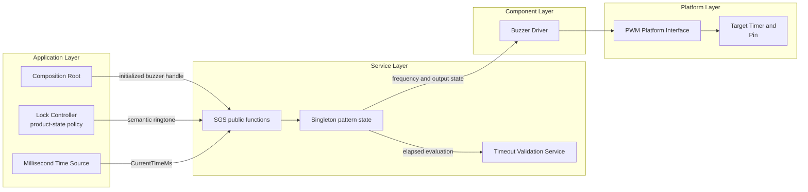
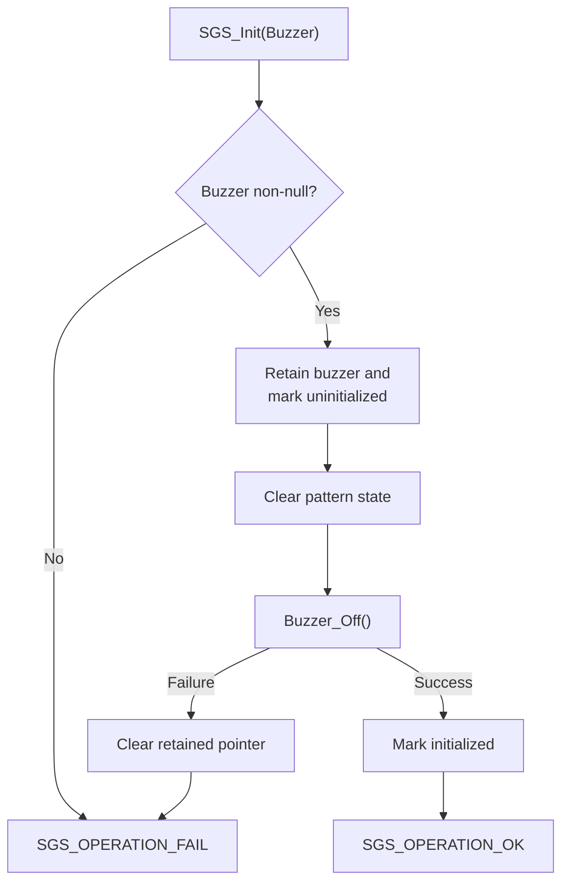
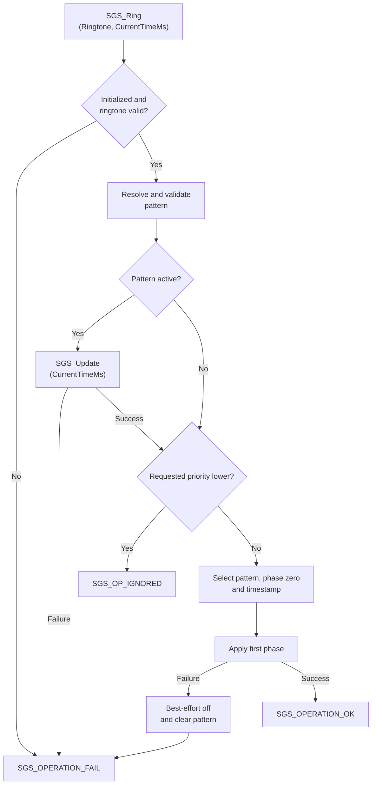
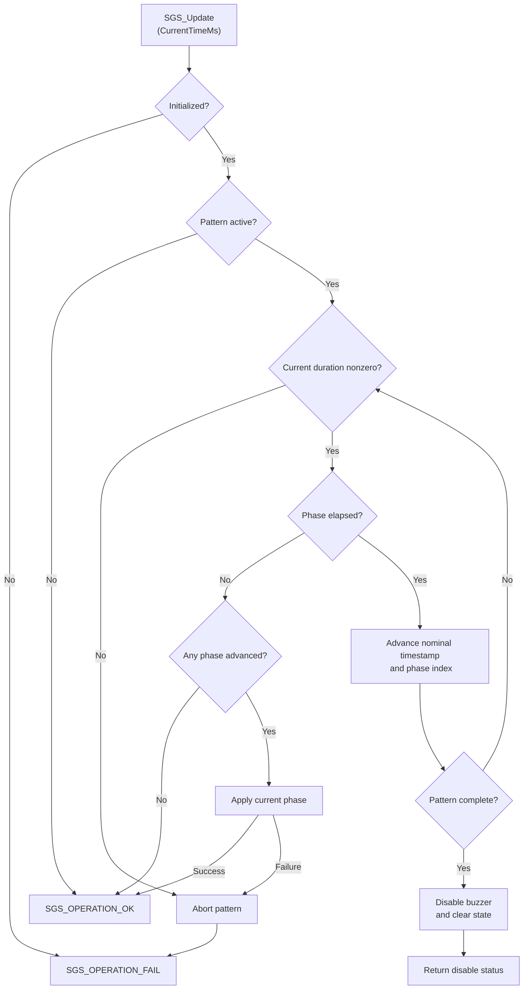

<h1 align="left">Sound Generator Service</h1>

<p align="left">
  <big>
    Singleton service for translating semantic sound requests into<br>
    non-blocking, priority-controlled and timestamp-driven buzzer patterns.
  </big>
</p>

> [!IMPORTANT]
> The Sound Generator Service exposes a function-based API and keeps its runtime model outside the public header. The composition root injects one initialized `Buzzer_Handle_t` through `SGS_Init()`. All later sound operations use the retained dependency without a public service handle.

> [!NOTE]
> Pattern execution is non-blocking. The application supplies the current millisecond timestamp to `SGS_Ring()` and `SGS_Update()` and remains responsible for calling `SGS_Update()` periodically.

---

## Table of Contents

- [1. Purpose](#1-purpose)
- [2. Design Intent](#2-design-intent)
- [3. Architecture](#3-architecture)
  - [3.1 Layer Placement](#31-layer-placement)
  - [3.2 Singleton Ownership](#32-singleton-ownership)
  - [3.3 Dependency Direction](#33-dependency-direction)
- [4. Directory Structure](#4-directory-structure)
- [5. Responsibilities](#5-responsibilities)
- [6. Dependencies](#6-dependencies)
- [7. Public Contract](#7-public-contract)
  - [7.1 Operation Status](#71-operation-status)
  - [7.2 Semantic Ringtones](#72-semantic-ringtones)
  - [7.3 Function-Based API](#73-function-based-api)
- [8. Private Runtime Model](#8-private-runtime-model)
- [9. Built-In Pattern Catalog](#9-built-in-pattern-catalog)
- [10. Replacement Priority](#10-replacement-priority)
- [11. Lifecycle](#11-lifecycle)
- [12. Pattern Execution Model](#12-pattern-execution-model)
  - [12.1 Phase Application](#121-phase-application)
  - [12.2 Nominal Timeline](#122-nominal-timeline)
  - [12.3 Delayed Update Catch-Up](#123-delayed-update-catch-up)
  - [12.4 Completion and Cancellation](#124-completion-and-cancellation)
  - [12.5 Timestamp Rollover](#125-timestamp-rollover)
- [13. API Reference](#13-api-reference)
- [14. Composition-Root Integration](#14-composition-root-integration)
- [15. Operation Flows](#15-operation-flows)
- [16. Error Handling](#16-error-handling)
- [17. Timing and Concurrency](#17-timing-and-concurrency)
- [18. Validation Checklist](#18-validation-checklist)
- [19. Limitations](#19-limitations)
- [20. License](#20-license)

---

## 1. Purpose

The Sound Generator Service converts application-level sound meanings into fixed buzzer patterns.

The application requests semantic feedback such as `SGS_RINGTONE_KEYPRESS`, `SGS_RINGTONE_ENTRY_INCOMPLETE`, `SGS_RINGTONE_ENTRY_TIMEOUT`, `SGS_RINGTONE_ACCESS_GRANTED`, `SGS_RINGTONE_LOCKING`, `SGS_RINGTONE_UNLOCKING`, `SGS_RINGTONE_ERROR` or `SGS_RINGTONE_LOCKOUT`. It does not provide frequencies, phase arrays, output states or durations. Those acoustic details remain centralized in the service-owned pattern map.

Each pattern is a sequence of timed phases. A phase specifies:

- Buzzer frequency in hertz.
- Nominal duration in milliseconds.
- Whether buzzer output is enabled or disabled.

`SGS_Ring()` applies the first phase of an accepted pattern immediately. `SGS_Update()` advances later phases according to caller-supplied timestamps. No delay loop blocks keyboard processing, authentication, actuator timing or other application work.

The acronym `SGS` means **Sound Generator Service** and prefixes every public symbol provided by this module.

---

## 2. Design Intent

The service is intentionally implemented as one module-owned singleton:

- The application does not allocate an `SGS_Handle_t`.
- No service handle is declared in the public header.
- Pattern descriptors, phase descriptors and priority types are private.
- Active pattern, phase index, phase timestamp and lifecycle state remain implementation-owned.
- The composition root supplies the concrete Buzzer Driver dependency through `SGS_Init()`.
- Later calls operate only through public functions.
- Exactly one Sound Generator runtime is supported.
- All service storage is static-duration storage; no dynamic allocation is used.

This topology matches the product: one electronic lock owns one passive buzzer and one serialized application flow decides which semantic feedback is appropriate.

The public contract exposes only the types required to request behavior and interpret results:

- `SGS_OpStatus_t` for operation outcomes.
- `SGS_Ringtone_t` for semantic ringtone requests.
- `Buzzer_Handle_t` only as the dependency accepted by `SGS_Init()`.

There is no public active-state query in the refactored API. `SGS_IsActive()` is now a private implementation helper used to enforce update and replacement behavior.

---

## 3. Architecture

### 3.1 Layer Placement

The Sound Generator Service belongs to the application-services layer. The application selects semantic sound feedback while the service translates it into Buzzer Driver operations.



The service does not create PWM hardware, initialize a timer, select a PWM channel or read the platform time source.

### 3.2 Singleton Ownership

The implementation owns one runtime object:

```c
SGS_Handle_t SGS_Runtime_Instance;
```

The object is not declared by the public header. It contains:

- The borrowed Buzzer Driver pointer.
- The currently active immutable pattern, or `NULL` while idle.
- The nominal start timestamp of the current phase.
- The current phase index.
- The successful-initialization flag.

The singleton object and its type are implementation details. Application code shall not declare the object manually, reference it through an external declaration or modify its members.

### 3.3 Dependency Direction

The Buzzer Driver remains explicit at the composition boundary:

```c
SGS_OpStatus_t SGS_Init(Buzzer_Handle_t* Buzzer);
```

`SGS_Init()` borrows the pointer. It does not copy the Buzzer Driver object and does not take ownership of it. The composition root must retain valid Buzzer and PWM storage for the complete service lifetime.

The intended dependency direction is:

```text
Composition Root ── injects ──> Sound Generator Service ── uses ──> Buzzer Driver
Application ────── requests ──> Sound Generator Service ── uses ──> Timeout Validation Service
```

The service does not depend directly on STM32 HAL, CMSIS, timer headers, the PWM Platform Interface, the Time Platform Interface, FreeRTOS, keyboard types, authentication types or Lock Controller state enumerations.

---

## 4. Directory Structure

```text
Sound_Generator/
├── Inc/
│   └── Sound_Generator_Service.h
├── Src/
│   └── Sound_Generator_Service.c
└── README.md
```

`Sound_Generator_Service.h` defines operation statuses, semantic ringtone identifiers and the function-based public API.

`Sound_Generator_Service.c` owns the singleton runtime state, private pattern model, immutable phase arrays, priority policy, phase progression and dependency-error propagation.

---

## 5. Responsibilities

The Sound Generator Service is responsible for:

- Retaining the Buzzer Driver reference injected by the composition root.
- Establishing an idle, buzzer-off state during initialization.
- Mapping semantic application and mechanical-feedback ringtones to immutable phase sequences.
- Associating every pattern with a replacement priority.
- Applying the first phase immediately when a request is accepted.
- Tracking the active pattern.
- Tracking the current phase index.
- Tracking the nominal phase-start timestamp.
- Turning the buzzer on for enabled tone phases.
- Turning the buzzer off for silent phases.
- Configuring frequency before enabling a tone phase.
- Advancing phase state from caller-supplied timestamps.
- Skipping phases that already expired before a delayed update.
- Preventing update jitter from extending the nominal pattern timeline.
- Ignoring lower-priority requests while feedback remains active.
- Replacing active patterns for equal- or higher-priority requests.
- Disabling the buzzer after completion or explicit cancellation.
- Clearing pattern state after completion, cancellation or phase failure.
- Returning policy and hardware outcomes explicitly.

The service is explicitly not responsible for:

- Creating or configuring a hardware timer.
- Selecting a timer peripheral, PWM channel or GPIO alternate function.
- Allocating or initializing `PWM_Handle_t` storage.
- Allocating or initializing `Buzzer_Handle_t` storage.
- Reading `HAL_GetTick()` or `Platform_GetMillis()`.
- Creating a task, queue, timer, semaphore or notification.
- Blocking the caller with a delay.
- Reading or interpreting keyboard input.
- Deciding whether a credential is complete or valid.
- Counting attempts or applying lockout policy.
- Selecting display, LED or actuator behavior.
- Queueing pending sound requests.
- Recovering or reinitializing failed PWM hardware.
- Controlling volume independently from Buzzer Driver configuration.

---

## 6. Dependencies

The public header includes:

```c
#include "Buzzer_Driver.h"
#include "stdbool.h"
#include "stdint.h"
```

`Buzzer_Driver.h` provides the injected `Buzzer_Handle_t`. Fixed-width integers represent timestamps and ringtone configuration values.

The implementation additionally includes:

```c
#include "Timeout_Validation_Service.h"
#include "stddef.h"
```

The Timeout Validation Service provides rollover-safe `TVS_HasElapsed()` calculations. `stddef.h` provides `NULL`.

At runtime, the direct injected dependency is one initialized Buzzer Driver. That Buzzer Driver owns its relationship with a previously created PWM Platform handle.

For lower-layer behavior, see the [Buzzer Driver README](../../Components/Buzzer/README.md) and [Platform README](../../../Platforms/README.md).

---

## 7. Public Contract

### 7.1 Operation Status

```c
typedef enum
{
    SGS_OPERATION_OK,
    SGS_OPERATION_IGNORED,
    SGS_OPERATION_FAIL

}SGS_OpStatus_t;
```

| Status | Meaning |
| --- | --- |
| `SGS_OPERATION_OK` | The requested operation completed successfully. |
| `SGS_OPERATION_IGNORED` | A ringtone request was valid, but a higher-priority active pattern remained authoritative. |
| `SGS_OPERATION_FAIL` | Validation, lifecycle, pattern data or a required Buzzer Driver operation failed. |

`SGS_OPERATION_IGNORED` is a normal priority-policy result. It does not indicate a hardware failure and shall not be escalated as one.

### 7.2 Semantic Ringtones

```c
typedef enum
{
    SGS_RINGTONE_KEYPRESS,
    SGS_RINGTONE_ENTRY_INCOMPLETE,
    SGS_RINGTONE_ENTRY_TIMEOUT,
    SGS_RINGTONE_ACCESS_GRANTED,
    SGS_RINGTONE_LOCKING,
    SGS_RINGTONE_UNLOCKING,
    SGS_RINGTONE_ERROR,
    SGS_RINGTONE_LOCKOUT,
    SGS_RINGTONE_COUNT

}SGS_Ringtone_t;
```

| Ringtone | Application meaning |
| --- | --- |
| `SGS_RINGTONE_KEYPRESS` | A valid keypress was accepted. |
| `SGS_RINGTONE_ENTRY_INCOMPLETE` | Credential confirmation was requested before the required entry was complete. |
| `SGS_RINGTONE_ENTRY_TIMEOUT` | The active credential-entry window expired. |
| `SGS_RINGTONE_ACCESS_GRANTED` | Access authorization succeeded and positive application feedback is required. |
| `SGS_RINGTONE_LOCKING` | The door lock mechanism is performing or completing the locking operation. |
| `SGS_RINGTONE_UNLOCKING` | The door lock mechanism is performing the unlocking operation. |
| `SGS_RINGTONE_ERROR` | A generic application error requires negative feedback. |
| `SGS_RINGTONE_LOCKOUT` | The application entered the authentication lockout condition. |
| `SGS_RINGTONE_COUNT` | Pattern-map size and invalid ringtone boundary; not playable. |

`SGS_RINGTONE_ACCESS_GRANTED` and the mechanical `LOCKING` / `UNLOCKING` ringtones intentionally represent different semantics. Authorization feedback reports the access decision; the mechanical ringtones report lock-actuator behavior. The application decides when each meaning applies. The service does not consume keyboard, credential, authentication, door-control or actuator objects.

### 7.3 Function-Based API

```c
SGS_OpStatus_t SGS_Init   (Buzzer_Handle_t* Buzzer);
SGS_OpStatus_t SGS_Ring   (SGS_Ringtone_t Ringtone, uint32_t CurrentTimeMs);
SGS_OpStatus_t SGS_Update (uint32_t CurrentTimeMs);
SGS_OpStatus_t SGS_Stop   (void);
```

There is no public `SGS_Handle_t`, instance parameter, pattern descriptor, priority selector or `SGS_IsActive()` query.

---

## 8. Private Runtime Model

The source file defines four private model types.

Priority orders replacement policy:

```c
typedef enum
{
    SGS_PRIORITY_KEYPRESS,
    SGS_PRIORITY_FEEDBACK

}SGS_priority_t;
```

Higher numeric values have higher priority:

```text
SGS_PRIORITY_KEYPRESS < SGS_PRIORITY_FEEDBACK
```

A phase describes one timed output interval:

```c
typedef struct
{
    uint32_t frequency_hz;
    uint32_t duration_ms;
    bool     output_enabled;

}SGS_Phase_t;
```

An enabled phase requires a nonzero `frequency_hz`. A disabled phase calls `Buzzer_Off()` and ignores the frequency. `SGS_Update()` treats a zero duration as invalid pattern data.

A pattern combines its phase array and policy priority:

```c
typedef struct
{
    const SGS_Phase_t* phases;
    uint8_t            phase_count;
    SGS_priority_t     priority;

}SGS_Pattern_t;
```

The singleton runtime state is:

```c
typedef struct
{
    Buzzer_Handle_t*     buzzer;
    const SGS_Pattern_t* active_pattern;
    uint32_t             phase_started_ms;
    uint8_t              current_phase_index;
    bool                 initialized;

}SGS_Handle_t;
```

These declarations document the internal engine. They do not create an application-facing allocation contract.

Before `SGS_Init()`, static-duration initialization leaves the pointer and active pattern null, timestamps and indexes zero and the lifecycle flag false.

---

## 9. Built-In Pattern Catalog

The current pattern map exposes eight playable semantic ringtones. `SGS_RINGTONE_KEYPRESS` uses `SGS_PRIORITY_KEYPRESS`; every other built-in pattern uses `SGS_PRIORITY_FEEDBACK`.

| Ringtone | Character | Priority |
| --- | --- | --- |
| `SGS_RINGTONE_KEYPRESS` | Short acknowledgement tone. | `SGS_PRIORITY_KEYPRESS` |
| `SGS_RINGTONE_ENTRY_INCOMPLETE` | Short high-frequency incomplete-entry indication. | `SGS_PRIORITY_FEEDBACK` |
| `SGS_RINGTONE_ENTRY_TIMEOUT` | Multi-phase timeout feedback. | `SGS_PRIORITY_FEEDBACK` |
| `SGS_RINGTONE_ACCESS_GRANTED` | Rising positive-access chime. | `SGS_PRIORITY_FEEDBACK` |
| `SGS_RINGTONE_LOCKING` | Descending mechanical-locking chime. | `SGS_PRIORITY_FEEDBACK` |
| `SGS_RINGTONE_UNLOCKING` | Rising mechanical-unlocking chime. | `SGS_PRIORITY_FEEDBACK` |
| `SGS_RINGTONE_ERROR` | Descending generic-error feedback. | `SGS_PRIORITY_FEEDBACK` |
| `SGS_RINGTONE_LOCKOUT` | Dedicated lockout-entry feedback. | `SGS_PRIORITY_FEEDBACK` |

### Keypress

| Phase | Frequency | Duration | Output |
| ---: | ---: | ---: | --- |
| 0 | 2600 Hz | 40 ms | Enabled |

Total nominal duration: **40 ms**. Priority: `SGS_PRIORITY_KEYPRESS`.

### Entry Incomplete

| Phase | Frequency | Duration | Output |
| ---: | ---: | ---: | --- |
| 0 | 4600 Hz | 40 ms | Enabled |

Total nominal duration: **40 ms**. Priority: `SGS_PRIORITY_FEEDBACK`.

### Entry Timeout

`SGS_RINGTONE_ENTRY_TIMEOUT` uses a dedicated multi-phase feedback pattern beginning with an 80 ms 5000 Hz tone followed by a 60 ms silent interval. The complete phase sequence remains private configuration in `Sound_Generator_Service.c`.

Priority: `SGS_PRIORITY_FEEDBACK`.

### Access Granted

| Phase | Frequency | Duration | Output |
| ---: | ---: | ---: | --- |
| 0 | 2000 Hz | 80 ms | Enabled |
| 1 | Ignored | 40 ms | Disabled |
| 2 | 3000 Hz | 140 ms | Enabled |

Total nominal duration: **260 ms**. Priority: `SGS_PRIORITY_FEEDBACK`.

This ringtone represents the positive access decision. It is separate from the actuator-specific unlocking feedback.

### Locking

| Phase | Frequency | Duration | Output |
| ---: | ---: | ---: | --- |
| 0 | 2200 Hz | 80 ms | Enabled |
| 1 | Ignored | 40 ms | Disabled |
| 2 | 1100 Hz | 180 ms | Enabled |

Total nominal duration: **300 ms**. Priority: `SGS_PRIORITY_FEEDBACK`.

The descending sequence provides a distinct closing acknowledgement for the mechanical locking operation.

### Unlocking

| Phase | Frequency | Duration | Output |
| ---: | ---: | ---: | --- |
| 0 | 1400 Hz | 90 ms | Enabled |
| 1 | Ignored | 40 ms | Disabled |
| 2 | 2200 Hz | 180 ms | Enabled |

Total nominal duration: **310 ms**. Priority: `SGS_PRIORITY_FEEDBACK`.

The rising sequence represents mechanical unlocking rather than authentication success.

### Error

| Phase | Frequency | Duration | Output |
| ---: | ---: | ---: | --- |
| 0 | 2600 Hz | 120 ms | Enabled |
| 1 | Ignored | 50 ms | Disabled |
| 2 | 1800 Hz | 220 ms | Enabled |

Total nominal duration: **390 ms**. Priority: `SGS_PRIORITY_FEEDBACK`.

### Lockout

`SGS_RINGTONE_LOCKOUT` uses a dedicated multi-phase lockout pattern beginning with a 120 ms 1200 Hz tone followed by a 70 ms silent interval. The complete phase sequence remains private configuration in `Sound_Generator_Service.c`.

Priority: `SGS_PRIORITY_FEEDBACK`.

The exact acoustic result of every pattern depends on the passive buzzer, supply voltage, PWM duty cycle, timer resolution, board mechanics and enclosure. Frequency and duration changes belong in the private pattern configuration, not in application calls.

---

## 10. Replacement Priority

The service maintains at most one active pattern. A request either replaces that pattern or is ignored; no queue is maintained.

Before comparing priority, `SGS_Ring()` calls `SGS_Update(CurrentTimeMs)` when a pattern is active. This prevents a feedback pattern whose nominal duration already ended from incorrectly blocking a new keypress.

After synchronization:

- Lower requested priority returns `SGS_OPERATION_IGNORED` and preserves the active pattern.
- Equal requested priority replaces the active pattern.
- Higher requested priority replaces the active pattern.

| Active pattern class | Requested keypress | Requested feedback ringtone |
| --- | --- | --- |
| None | Start | Start |
| Keypress | Replace | Replace |
| Any `SGS_PRIORITY_FEEDBACK` pattern | Ignore | Replace |

`ENTRY_INCOMPLETE`, `ENTRY_TIMEOUT`, `ACCESS_GRANTED`, `LOCKING`, `UNLOCKING`, `ERROR` and `LOCKOUT` all belong to the same feedback-priority class. They therefore replace one another when requested, while a keypress cannot interrupt any of them.

Priority belongs to the private `SGS_Pattern_t`. Public callers cannot elevate a keypress or override product feedback policy.

---

## 11. Lifecycle

The expected lifecycle is:

1. The composition root creates and initializes the PWM Platform handle.
2. The composition root initializes the Buzzer Driver with that PWM handle.
3. The composition root calls `SGS_Init(&Buzzer)`.
4. The service retains the Buzzer Driver reference.
5. The service clears pattern progress and forces the buzzer off.
6. The singleton becomes initialized only after `Buzzer_Off()` succeeds.
7. The application requests semantic ringtones and periodically calls `SGS_Update()`.
8. The application calls `SGS_Stop()` when explicit cancellation or a power transition requires silence.

There is no public deinitialization function.

Calling `SGS_Init()` again replaces the retained Buzzer Driver pointer, clears logical pattern state and disables the newly supplied buzzer. It does not first disable a previously retained different buzzer. Normal composition should therefore initialize the singleton once; if rebinding is required, stop the active sound path before supplying another dependency.

If initialization fails because `Buzzer_Off()` fails, the retained pointer is cleared and `initialized` remains false.

---

## 12. Pattern Execution Model

### 12.1 Phase Application

For an enabled phase, the service performs:

```text
Buzzer_SetFrequency(frequency_hz)
                 |
                 v
            Buzzer_On()
```

The frequency must be nonzero. It is configured before the output is enabled.

For a disabled phase, the service performs only:

```text
Buzzer_Off()
```

The stored frequency is not inspected or applied during a silent phase.

### 12.2 Nominal Timeline

`SGS_Ring()` records the supplied timestamp as the nominal start of phase zero:

```c
phase_started_ms = CurrentTimeMs;
```

When a phase expires, `SGS_Update()` advances the timeline by the configured duration:

```c
phase_started_ms += current_phase->duration_ms;
```

It does not assign a late update timestamp as the next phase start. This prevents scheduling jitter from stretching every remaining phase.

### 12.3 Delayed Update Catch-Up

The update loop advances through every phase already expired at `CurrentTimeMs`. Intermediate expired phases are not rapidly replayed; only the phase that should currently be active is applied.

For an access-granted pattern starting at `1000 ms`:

| Nominal interval | Expected output |
| --- | --- |
| 1000–1079 ms | 2000 Hz tone |
| 1080–1119 ms | Silence |
| 1120–1259 ms | 3000 Hz tone |
| 1260 ms onward | Pattern complete and buzzer off |

If the next update occurs at `1150 ms`, the service advances past both the first tone and silence, sets the nominal phase start to `1120 ms` and applies only the 3000 Hz tone. The original completion deadline remains `1260 ms`.

### 12.4 Completion and Cancellation

Completion and `SGS_Stop()` use the same abort helper:

1. Call `Buzzer_Off()`.
2. Set `active_pattern` to `NULL`.
3. Reset `phase_started_ms` to `0U`.
4. Reset `current_phase_index` to `0U`.

Logical pattern state is cleared even when `Buzzer_Off()` reports failure. The returned operation status still exposes the hardware failure.

The retained Buzzer Driver pointer and initialization flag remain available for later requests.

### 12.5 Timestamp Rollover

Phase expiration is delegated to `TVS_HasElapsed()`, which uses unsigned subtraction. A phase may begin before `UINT32_MAX` and complete after the millisecond counter wraps to zero.

All timestamps supplied to `SGS_Ring()` and `SGS_Update()` must originate from the same monotonically increasing unsigned 32-bit time base. Evaluation must occur before a complete counter period elapses.

---

## 13. API Reference

### `SGS_Init`

```c
SGS_OpStatus_t SGS_Init(Buzzer_Handle_t* Buzzer);
```

Initializes or reinitializes the singleton.

Behavior:

- Rejects a null buzzer pointer.
- Stores the supplied Buzzer Driver pointer.
- Marks the singleton uninitialized during setup.
- Clears active pattern, phase timestamp and phase index.
- Calls `Buzzer_Off()` to establish the safe idle output state.
- Clears the retained pointer when the disable operation fails.
- Marks the singleton initialized only after successful disable.

Returns:

- `SGS_OPERATION_OK` when the dependency is retained and the buzzer is disabled.
- `SGS_OPERATION_FAIL` when the pointer is null or `Buzzer_Off()` fails.

The Buzzer Driver remains owned by the composition root and must stay valid.

### `SGS_Ring`

```c
SGS_OpStatus_t SGS_Ring(
    SGS_Ringtone_t Ringtone,
    uint32_t CurrentTimeMs
);
```

Requests one built-in semantic pattern.

Behavior:

- Requires successful singleton initialization.
- Rejects `SGS_RINGTONE_COUNT`, negative enumeration values and values above the map boundary.
- Resolves the immutable pattern and validates its phase pointer and count.
- Synchronizes an active pattern to `CurrentTimeMs`.
- Applies the replacement-priority policy after synchronization.
- Selects phase zero and records `CurrentTimeMs` for an accepted request.
- Applies the first phase immediately.
- Aborts and clears pattern state if the first phase cannot be applied.

Returns:

- `SGS_OPERATION_OK` when the requested pattern starts.
- `SGS_OPERATION_IGNORED` when a higher-priority pattern remains active.
- `SGS_OPERATION_FAIL` for lifecycle, ringtone, pattern, synchronization or Buzzer Driver failures.

### `SGS_Update`

```c
SGS_OpStatus_t SGS_Update(uint32_t CurrentTimeMs);
```

Advances the active pattern without blocking.

Behavior:

- Fails when the singleton is not initialized.
- Returns success without hardware access while idle.
- Rejects an active phase with zero duration and aborts the pattern.
- Uses `TVS_HasElapsed()` for the current phase.
- Advances through all phases expired at the supplied timestamp.
- Applies only the phase that should currently be active.
- Disables the buzzer and clears state after the last phase.
- Aborts after a phase-application failure.

Returns:

- `SGS_OPERATION_OK` while idle or after a successful update.
- `SGS_OPERATION_FAIL` when lifecycle, pattern data or a required buzzer operation fails.

### `SGS_Stop`

```c
SGS_OpStatus_t SGS_Stop(void);
```

Cancels the active pattern and forces the buzzer off.

Behavior:

- Requires successful initialization.
- Calls `Buzzer_Off()` even when no pattern is active.
- Clears active pattern, phase timestamp and phase index.
- Preserves the retained dependency and initialization state.

Returns:

- `SGS_OPERATION_OK` when the buzzer is disabled.
- `SGS_OPERATION_FAIL` when the service is uninitialized or the disable operation fails.

---

## 14. Composition-Root Integration

The composition root owns the PWM and Buzzer Driver objects. It passes only the initialized buzzer address to the singleton:

```c
#include "Buzzer_Driver.h"
#include "Sound_Generator_Service.h"
#include "tim.h"

static PWM_Handle_t BuzzerPwm;
static Buzzer_Handle_t Buzzer;

static bool SoundComposition_Init(void)
{
    if(PPWM_Create(&BuzzerPwm, &htim3, PWM_CHANNEL_1) != PWM_OPERATION_OK)
    {
        return false;
    }

    if(Buzzer_Init(&Buzzer, &BuzzerPwm) != BUZZER_OPERATION_OK)
    {
        return false;
    }

    return SGS_Init(&Buzzer) == SGS_OPERATION_OK;
}
```

No `SGS_Handle_t` is allocated in the composition root.

The current STM32 target maps the passive buzzer to TIM3 channel 1 on PB4. That mapping is a target-composition choice, not part of the SGS public contract.

Runtime updates supply a shared millisecond timestamp:

```c
void Application_Update(void)
{
    uint32_t now_ms = Platform_GetMillis();

    if(SGS_Update(now_ms) != SGS_OPERATION_OK)
    {
        /* Apply the application policy for degradable sound-path failure. */
    }
}
```

Semantic requests also use the function-only API:

```c
uint32_t now_ms = Platform_GetMillis();

/* Valid key accepted. */
(void)SGS_Ring(SGS_RINGTONE_KEYPRESS, now_ms);

/* Credential confirmation requested too early. */
(void)SGS_Ring(SGS_RINGTONE_ENTRY_INCOMPLETE, now_ms);

/* Credential-entry session expired. */
(void)SGS_Ring(SGS_RINGTONE_ENTRY_TIMEOUT, now_ms);

/* Access decision succeeded. */
(void)SGS_Ring(SGS_RINGTONE_ACCESS_GRANTED, now_ms);

/* Mechanical actuator feedback. */
(void)SGS_Ring(SGS_RINGTONE_UNLOCKING, now_ms);
(void)SGS_Ring(SGS_RINGTONE_LOCKING, now_ms);

/* Generic negative feedback or lockout entry. */
(void)SGS_Ring(SGS_RINGTONE_ERROR, now_ms);
(void)SGS_Ring(SGS_RINGTONE_LOCKOUT, now_ms);
```

Priority rejection can be handled explicitly:

```c
SGS_OpStatus_t status = SGS_Ring(SGS_RINGTONE_KEYPRESS, now_ms);

if(status == SGS_OPERATION_IGNORED)
{
    /* Expected policy: higher-priority feedback remains active. */
}
```

---

## 15. Operation Flows

### Initialization



### Ring Request



### Periodic Update



---

## 16. Error Handling

Initialization fails when:

- The supplied buzzer pointer is null.
- The Buzzer Driver is not initialized and therefore rejects `Buzzer_Off()`.
- The underlying PWM disable operation fails.

Ringtone requests fail when:

- The singleton is not initialized.
- The ringtone does not index a playable pattern.
- The mapped pattern pointer is null or its phase count is zero.
- Synchronizing an active pattern fails.
- An enabled first phase has zero frequency.
- Frequency configuration or output enable fails.

Updates fail when:

- The singleton is not initialized.
- An active phase has zero duration.
- A phase cannot be applied.
- Pattern completion cannot disable the buzzer.

`SGS_Stop()` fails when the singleton is not initialized or the buzzer cannot be disabled.

After phase application, completion or cancellation failure, the service makes a best-effort disable request and clears logical pattern state. A failed hardware disable may mean the physical output state is unknown even though the singleton is logically idle.

Sound-path failure is degradable feedback failure. It must not delay lock safety, actuator deadlines, authentication decisions or application fault handling.

---

## 17. Timing and Concurrency

`SGS_Ring()` and `SGS_Update()` receive `CurrentTimeMs` explicitly. The service does not read the platform clock.

The configured V1 patterns recommend a maximum interval of **10 ms** between application updates. The shortest phase is 40 ms, giving multiple observation opportunities per phase.

The service does not enforce this cadence. Delayed updates preserve the nominal completion time but can delay the physical transition until the next call.

The singleton is not internally thread-safe. It provides no mutex, critical section, atomic request transaction, queue or interrupt-safe API. `SGS_Init()`, `SGS_Ring()`, `SGS_Update()` and `SGS_Stop()` must be serialized by one application execution context.

Requests originating in another task or interrupt must be transported to the owning context through the application's approved event mechanism. Sound functions must not be called from an ISR when the Buzzer Driver or PWM Platform is not ISR-safe.

Safety-critical state transitions shall never wait for a sound pattern to complete.

---

## 18. Validation Checklist

Recommended host-side validation covers:

- Null buzzer initialization fails.
- An unusable or uninitialized buzzer fails during the initial `Buzzer_Off()`.
- Successful initialization leaves the singleton idle and the output disabled.
- Reinitialization resets pattern progress.
- `SGS_Ring()` fails before initialization.
- Every playable ringtone is accepted while idle.
- `SGS_RINGTONE_COUNT`, negative values and out-of-range values are rejected.
- Keypress starts at 2600 Hz and enables output immediately.
- Keypress remains active before 40 ms.
- Keypress completes and disables output at exactly 40 ms.
- Entry-incomplete feedback starts at 4600 Hz and completes at 40 ms.
- Entry-timeout feedback progresses through its configured multi-phase sequence.
- Access granted transitions at cumulative boundaries of 80, 120 and 260 ms.
- Locking feedback transitions at cumulative boundaries of 80, 120 and 300 ms.
- Unlocking feedback transitions at cumulative boundaries of 90, 130 and 310 ms.
- Error transitions at cumulative boundaries of 120, 170 and 390 ms.
- Lockout feedback progresses through its complete configured phase sequence.
- Keypress replaces keypress.
- Any feedback ringtone replaces an active keypress.
- Keypress is ignored while any feedback-priority ringtone remains active.
- Feedback-priority ringtones replace one another at equal priority.
- An expired feedback pattern is updated before priority comparison.
- A delayed update skips one expired phase.
- A delayed update skips multiple expired phases.
- A late update does not move the nominal completion deadline.
- A phase spanning unsigned timestamp rollover completes correctly.
- Zero-duration active phase data aborts safely.
- Zero-frequency enabled phase data is rejected.
- Frequency failure returns failure and clears pattern state.
- Output-enable failure returns failure and clears pattern state.
- Output-disable failure returns failure and clears logical pattern state.
- `SGS_Stop()` calls `Buzzer_Off()` even while idle.
- No public service handle or active-state query is exposed.
- The complete firmware builds with the service source included.

Target integration should additionally verify:

- PWM output appears on the configured passive-buzzer pin.
- Every built-in frequency is accepted by the PWM Platform.
- Silent phases disable PWM output.
- Access-granted feedback is perceptibly rising and distinguishable from mechanical unlocking.
- Locking feedback is perceptibly descending.
- Unlocking feedback is perceptibly rising and distinct from access-granted feedback.
- Entry-incomplete, entry-timeout, generic-error and lockout feedback are distinguishable enough for the intended product UX.
- A keypress cannot interrupt any feedback-priority ringtone.
- Sound execution does not block keyboard or lock-control deadlines.
- The buzzer remains off while idle and after `SGS_Stop()`.
- Acoustic output is acceptable across expected supply voltage and enclosure conditions.

---

## 19. Limitations

Current V1 limitations include:

- Exactly one Sound Generator runtime is supported.
- Eight semantic ringtones are implemented.
- Patterns are fixed at compile time.
- Callers cannot register custom phase arrays.
- Only two priority levels are available.
- Equal-priority requests always replace the active pattern.
- No pending-pattern queue is provided.
- No repeat, loop, pause or resume mode is provided.
- No public active-pattern, phase or activity query is provided.
- No public deinitialization API is provided.
- Reinitialization does not disable a previously retained different buzzer before rebinding.
- No volume parameter is provided.
- PWM duty cycle remains a Buzzer Driver concern.
- Timing resolution is limited to caller-supplied milliseconds and update cadence.
- No internal metrics are maintained for accepted, ignored, completed or failed requests.
- No low-battery or critical-fault ringtone is built in.
- Thread and ISR safety are not provided internally.
- The service does not recover or reinitialize failed PWM hardware.
- Acoustic characteristics vary across buzzers and enclosures.

Future extensions should preserve semantic application requests, singleton-owned runtime state, explicit composition-root injection, non-blocking execution, bounded runtime work, explicit priority policy and buzzer-off behavior after completion or failure.

---

## 20. License

This module is part of the:

```text
Electronic Lock Project
```

and follows the project's license terms.
