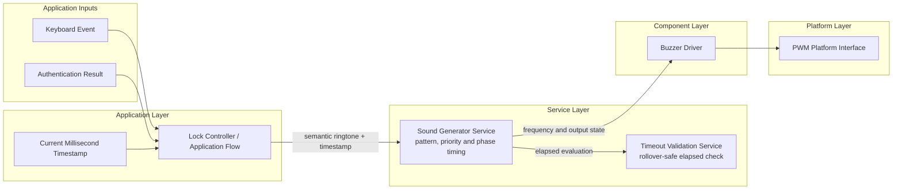
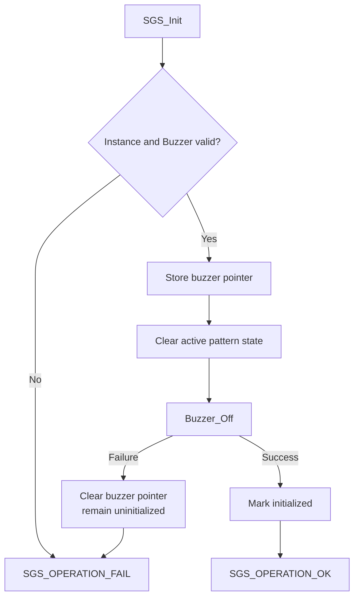
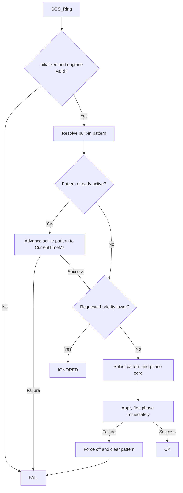

<h1 align="left">Sound Generator Service</h1>

<p align="left">
  <big>
    Non-blocking application service for translating semantic sound requests<br>
    into priority-controlled, timestamp-driven buzzer patterns.
  </big>
</p>

> [!IMPORTANT]
> The Sound Generator Service owns sound-pattern selection, phase progression, replacement priority and timing state. It does not create PWM hardware, initialize timers, read the system clock, create a task, block the caller, decide access policy, or interpret keyboard input. A caller-owned and initialized `Buzzer_Handle_t` is injected through `SGS_Init()`.

---

## Table of Contents

* [1. Overview](#1-overview)
* [2. Features](#2-features)
* [3. Architecture Context](#3-architecture-context)

  * [3.1 Layer Placement](#31-layer-placement)
  * [3.2 Dependency Direction](#32-dependency-direction)
  * [3.3 Application Integration](#33-application-integration)
* [4. Directory Structure](#4-directory-structure)
* [5. Service Responsibilities](#5-service-responsibilities)
* [6. Service Non-Responsibilities](#6-service-non-responsibilities)
* [7. Dependencies](#7-dependencies)

  * [7.1 Public Dependencies](#71-public-dependencies)
  * [7.2 Private Dependencies](#72-private-dependencies)
  * [7.3 Injected Dependency](#73-injected-dependency)
* [8. Configuration and Data Structures](#8-configuration-and-data-structures)

  * [8.1 Operation Status](#81-operation-status)
  * [8.2 Semantic Ringtones](#82-semantic-ringtones)
  * [8.3 Pattern Priority](#83-pattern-priority)
  * [8.4 Sound Phase](#84-sound-phase)
  * [8.5 Sound Pattern](#85-sound-pattern)
  * [8.6 Service Handle](#86-service-handle)
  * [8.7 Built-In Pattern Map](#87-built-in-pattern-map)
* [9. API Reference](#9-api-reference)

  * [9.1 SGS_Init](#91-sgs_init)
  * [9.2 SGS_Ring](#92-sgs_ring)
  * [9.3 SGS_Update](#93-sgs_update)
  * [9.4 SGS_Stop](#94-sgs_stop)
  * [9.5 SGS_IsActive](#95-sgs_isactive)
* [10. Commands and Results](#10-commands-and-results)

  * [10.1 Command Summary](#101-command-summary)
  * [10.2 Result Semantics](#102-result-semantics)
  * [10.3 Priority Replacement Matrix](#103-priority-replacement-matrix)
* [11. Behavioral Rules and Operation Flow](#11-behavioral-rules-and-operation-flow)

  * [11.1 Initialization Flow](#111-initialization-flow)
  * [11.2 Ring Request Flow](#112-ring-request-flow)
  * [11.3 Phase Application](#113-phase-application)
  * [11.4 Pattern Update Flow](#114-pattern-update-flow)
  * [11.5 Completion and Cancellation](#115-completion-and-cancellation)
  * [11.6 Delayed Update Behavior](#116-delayed-update-behavior)
* [12. Timing and Concurrency](#12-timing-and-concurrency)

  * [12.1 Caller-Supplied Time](#121-caller-supplied-time)
  * [12.2 Update Interval](#122-update-interval)
  * [12.3 Timing Resolution and Jitter](#123-timing-resolution-and-jitter)
  * [12.4 Rollover Behavior](#124-rollover-behavior)
  * [12.5 Concurrency Model](#125-concurrency-model)
* [13. Usage Example](#13-usage-example)

  * [13.1 Dependency Initialization](#131-dependency-initialization)
  * [13.2 Runtime Update](#132-runtime-update)
  * [13.3 Semantic Requests](#133-semantic-requests)
  * [13.4 TIM3 Channel 1 Integration](#134-tim3-channel-1-integration)
* [14. Design Decisions](#14-design-decisions)

  * [14.1 Semantic API](#141-semantic-api)
  * [14.2 Injected Buzzer Dependency](#142-injected-buzzer-dependency)
  * [14.3 Non-Blocking Phase Engine](#143-non-blocking-phase-engine)
  * [14.4 No Sound Queue](#144-no-sound-queue)
  * [14.5 Explicit Priority Policy](#145-explicit-priority-policy)
  * [14.6 Nominal Phase Timeline](#146-nominal-phase-timeline)
  * [14.7 Explicit Output State](#147-explicit-output-state)
* [15. Error Handling](#15-error-handling)

  * [15.1 Argument and State Errors](#151-argument-and-state-errors)
  * [15.2 Buzzer Operation Errors](#152-buzzer-operation-errors)
  * [15.3 Invalid Pattern Data](#153-invalid-pattern-data)
  * [15.4 Safe Failure State](#154-safe-failure-state)
* [16. Usage Constraints](#16-usage-constraints)
* [17. Testing and Acceptance Criteria](#17-testing-and-acceptance-criteria)

  * [17.1 Host-Side Tests](#171-host-side-tests)
  * [17.2 Target Integration Tests](#172-target-integration-tests)
  * [17.3 Current Validation](#173-current-validation)
* [18. Applications](#18-applications)
* [19. Limitations and Future Improvements](#19-limitations-and-future-improvements)
* [20. License](#20-license)

---

## 1. Overview

The Sound Generator Service is a stateful application service responsible for producing short, non-blocking sound patterns through the Buzzer Driver.

The application requests a sound by semantic meaning rather than by directly controlling a PWM frequency. For example, the caller requests `SGS_RINGTONE_ACCESS_GRANTED`; the service translates that request into a rising two-tone pattern with an intermediate silent phase.

Each pattern is an immutable sequence of `SGS_Phase_t` objects. A phase describes:

- the buzzer frequency in hertz;
- the phase duration in milliseconds;
- whether the buzzer output is enabled or disabled.

`SGS_Ring()` selects a pattern and applies its first phase immediately. `SGS_Update()` advances the remaining phases from caller-supplied timestamps. No delay loop is used, and pattern duration does not block keyboard processing, access decisions, lock timing, or other application services.

The service supports a priority-based replacement policy. Access feedback has a higher priority than the short keypress acknowledgement. A keypress request therefore cannot interrupt an active access-granted or error pattern.

The acronym `SGS` means **Sound Generator Service** and is used as the prefix for every public symbol exposed by this module.

---

## 2. Features

- Semantic keypress, access-granted, and error ringtones.
- Non-blocking sound-pattern execution.
- Explicit tone and silence phases.
- Caller-supplied millisecond timestamps.
- Rollover-safe elapsed-time evaluation.
- Immediate application of the first pattern phase.
- Explicit priority-based pattern replacement.
- Distinct result when a lower-priority request is ignored.
- Equal-priority replacement for new application feedback.
- Delayed-update catch-up without stretching pattern duration.
- Automatic buzzer shutdown when a pattern completes.
- Explicit cancellation through `SGS_Stop()`.
- Active-state query through `SGS_IsActive()`.
- Caller-owned service handle.
- Injected Buzzer Driver dependency.
- No direct STM32, timer, GPIO, or PWM register access.
- No direct time-source read.
- No dynamic memory allocation.
- No RTOS dependency.
- No internal task, timer, queue, or blocking delay.

---

## 3. Architecture Context

### 3.1 Layer Placement

The Sound Generator Service belongs to the application-services layer. It translates product-level sound meanings into device-level buzzer operations.



The diagram describes stable responsibility and dependency boundaries. It does not require the service to know which timer, channel, GPIO pin, HAL object, or RTOS task is used by the target.

### 3.2 Dependency Direction

The dependency direction is:

```text
Application
    |
    v
Sound Generator Service
    |                    |
    v                    v
Buzzer Driver    Timeout Validation Service
    |
    v
PWM Platform Interface
    |
    v
Target timer and output pin
```

The Sound Generator Service does not include `tim.h`, receive `TIM_HandleTypeDef`, or call the PWM Platform Interface directly.

### 3.3 Application Integration

The application is responsible for:

1. Configuring the target timer and PWM channel through the platform startup code.
2. Creating a caller-owned `PWM_Handle_t`.
3. Initializing a caller-owned `Buzzer_Handle_t` with that PWM instance.
4. Initializing a caller-owned `SGS_Handle_t` with the buzzer instance.
5. Translating application events into `SGS_Ringtone_t` requests.
6. Supplying one current millisecond timestamp to `SGS_Ring()` and `SGS_Update()`.
7. Calling `SGS_Update()` at intervals no greater than the application timing contract.
8. Handling `SGS_OPERATION_FAIL` without delaying safety-critical application behavior.
9. Calling `SGS_Stop()` before a power state that requires nonessential PWM outputs to be disabled.

The service does not call the Lock Controller or consume keyboard and authentication types directly.

---

## 4. Directory Structure

```text
Services/
|
└── Sound_Generator/
    |
    ├── Inc/
    │   └── Sound_Generator_Service.h
    |
    ├── Src/
    │   └── Sound_Generator_Service.c
    |
    └── README.md
```

### Public Interface

`Inc/Sound_Generator_Service.h` contains:

- operation statuses;
- semantic ringtone identifiers;
- priority identifiers;
- phase and pattern descriptors;
- caller-owned runtime handle;
- public API declarations.

### Private Implementation

`Src/Sound_Generator_Service.c` contains:

- immutable phase arrays;
- the semantic ringtone-to-pattern map;
- phase application logic;
- priority evaluation;
- pattern progression;
- failure cleanup.

---

## 5. Service Responsibilities

The Sound Generator Service is responsible for:

- Receiving semantic sound requests.
- Mapping every supported ringtone to an immutable phase sequence.
- Associating each pattern with its replacement priority.
- Applying the first phase immediately when a request is accepted.
- Tracking the active pattern.
- Tracking the current phase index.
- Tracking the nominal start timestamp of the current phase.
- Advancing phases from elapsed millisecond time.
- Turning the buzzer on for tone phases.
- Turning the buzzer off for silence phases.
- Updating the buzzer frequency before enabling a tone phase.
- Ignoring lower-priority requests while higher-priority feedback is active.
- Replacing an active pattern when the new request has equal or higher priority.
- Skipping phases that have already expired after a delayed update.
- Preventing periodic update jitter from accumulating across phases.
- Disabling the buzzer after completion or explicit cancellation.
- Clearing active pattern state after completion, cancellation, or failure.
- Reporting API, policy, and dependency outcomes explicitly.

---

## 6. Service Non-Responsibilities

The Sound Generator Service is **not responsible** for:

- Creating or configuring a hardware timer.
- Selecting a timer peripheral or PWM channel.
- Configuring a GPIO alternate function.
- Creating a `PWM_Handle_t`.
- Initializing the PWM Platform Interface directly.
- Creating or initializing a `Buzzer_Handle_t`.
- Reading `HAL_GetTick()` or `Platform_GetMillis()`.
- Owning the application heartbeat.
- Creating an RTOS task, queue, semaphore, timer, or notification.
- Blocking the caller with a millisecond or microsecond delay.
- Reading or interpreting the physical keyboard.
- Deciding whether a credential is complete.
- Authenticating a credential.
- Counting failed authentication attempts.
- Applying retry, denial, or lockout policy.
- Unlocking or locking the actuator.
- Selecting display or LED feedback.
- Persisting a history of sound requests.
- Queueing an unbounded number of patterns.
- Controlling buzzer volume independently from the Buzzer Driver configuration.
- Recovering or reinitializing failed PWM hardware.
- Performing global Lock Controller state transitions.

---

## 7. Dependencies

### 7.1 Public Dependencies

The public interface includes:

```c
#include "Buzzer_Driver.h"
#include "stdbool.h"
#include "stdint.h"
```

`Buzzer_Driver.h` provides the injected `Buzzer_Handle_t` type. The standard headers provide fixed-width time and frequency values together with Boolean state.

### 7.2 Private Dependencies

The implementation includes:

```c
#include "Timeout_Validation_Service.h"
#include "stddef.h"
```

The Timeout Validation Service provides rollover-safe elapsed-time evaluation. `stddef.h` provides `NULL`.

The module has no direct dependency on:

- STM32 HAL or LL headers;
- CMSIS;
- `tim.h`;
- the PWM Platform Interface;
- the Time Platform Interface;
- FreeRTOS;
- the Lock Controller;
- the Matrix Keyboard Driver;
- the Credential Entry or Authentication services.

### 7.3 Injected Dependency

`SGS_Init()` receives an already initialized `Buzzer_Handle_t`:

```c
SGS_OpStatus_t SGS_Init(
    SGS_Handle_t*    Instance,
    Buzzer_Handle_t* Buzzer
);
```

The service stores the pointer but does not take ownership of the buzzer storage. The caller shall keep the buzzer object valid for the entire initialized lifetime of the Sound Generator instance.

---

## 8. Configuration and Data Structures

### 8.1 Operation Status

```c
typedef enum
{
    SGS_OPERATION_OK,
    SGS_OPERATION_IGNORED,
    SGS_OPERATION_FAIL

}SGS_OpStatus_t;
```

| Status | Meaning |
|---|---|
| `SGS_OPERATION_OK` | The requested operation completed successfully. |
| `SGS_OPERATION_IGNORED` | A valid lower-priority request was processed but did not replace the active pattern. |
| `SGS_OPERATION_FAIL` | An argument, state, pattern, timing, or underlying buzzer operation was invalid or failed. |

`SGS_OPERATION_IGNORED` is not a hardware failure. It is the explicit outcome of the replacement policy.

### 8.2 Semantic Ringtones

```c
typedef enum
{
    SGS_RINGTONE_KEYPRESS,
    SGS_RINGTONE_ACCESS_GRANTED,
    SGS_RINGTONE_ERROR,
    SGS_RINGTONE_COUNT

}SGS_Ringtone_t;
```

| Ringtone | Intended application meaning |
|---|---|
| `SGS_RINGTONE_KEYPRESS` | A valid user keypress was accepted. |
| `SGS_RINGTONE_ACCESS_GRANTED` | Credential authentication succeeded and access feedback is required. |
| `SGS_RINGTONE_ERROR` | The entered credential was incorrect, incomplete, or otherwise rejected by application policy. |
| `SGS_RINGTONE_COUNT` | Sentinel used to validate ringtone indexes; it is not a playable ringtone. |

The service does not decide when any of these meanings applies. The application supplies the semantic request.

### 8.3 Pattern Priority

```c
typedef enum
{
    SGS_PRIORITY_KEYPRESS,
    SGS_PRIORITY_FEEDBACK

}SGS_Priority_t;
```

Priority increases with the enumeration value:

```text
SGS_PRIORITY_KEYPRESS < SGS_PRIORITY_FEEDBACK
```

The application does not pass a priority to `SGS_Ring()`. Priority belongs to the service-owned pattern configuration, preventing callers from accidentally changing the replacement policy for a semantic ringtone.

### 8.4 Sound Phase

```c
typedef struct
{
    uint32_t FrequencyHz;
    uint32_t DurationMs;
    bool     OutputEnabled;

}SGS_Phase_t;
```

| Member | Unit | Description |
|---|---:|---|
| `FrequencyHz` | Hz | Frequency applied to the Buzzer Driver for an enabled phase. It shall be nonzero when `OutputEnabled` is `true`. |
| `DurationMs` | ms | Nominal phase duration. The current implementation treats zero duration as invalid. |
| `OutputEnabled` | Boolean | Selects a tone phase (`true`) or a silent phase (`false`). |

For a silent phase, `FrequencyHz` is ignored and is configured as `0U` in the built-in patterns for clarity.

### 8.5 Sound Pattern

```c
typedef struct
{
    const SGS_Phase_t* Phases;
    uint8_t            PhaseCount;
    SGS_Priority_t     Priority;

}SGS_Pattern_t;
```

| Member | Description |
|---|---|
| `Phases` | Pointer to the first immutable phase in the pattern. |
| `PhaseCount` | Number of valid phases in the array. It shall be greater than zero. |
| `Priority` | Replacement priority used by `SGS_Ring()`. |

The current public API does not accept caller-defined patterns. `SGS_Pattern_t` describes the built-in service configuration and the active-pattern reference stored by the service handle.

### 8.6 Service Handle

```c
typedef struct
{
    Buzzer_Handle_t*     _buzzer;
    const SGS_Pattern_t* _active_pattern;
    uint32_t             _phase_started_ms;
    uint8_t              _current_phase_index;
    bool                 _initialized;

}SGS_Handle_t;
```

| Member | Description |
|---|---|
| `_buzzer` | Injected Buzzer Driver dependency. |
| `_active_pattern` | Currently active pattern or `NULL` while idle. |
| `_phase_started_ms` | Nominal start timestamp of the current phase. |
| `_current_phase_index` | Index of the current phase. |
| `_initialized` | Successful service-initialization state. |

All leading-underscore members are private service state. Callers shall allocate the handle but shall not read or modify its members directly.

### 8.7 Built-In Pattern Map

The current implementation defines the following immutable phases:

#### Keypress

| Phase | Frequency | Duration | Output |
|---:|---:|---:|---|
| 0 | 2600 Hz | 40 ms | Enabled |

Total nominal duration: **40 ms**.

#### Access Granted

| Phase | Frequency | Duration | Output |
|---:|---:|---:|---|
| 0 | 2000 Hz | 80 ms | Enabled |
| 1 | Ignored | 40 ms | Disabled |
| 2 | 3000 Hz | 140 ms | Enabled |

Total nominal duration: **260 ms**.

#### Error

| Phase | Frequency | Duration | Output |
|---:|---:|---:|---|
| 0 | 2600 Hz | 120 ms | Enabled |
| 1 | Ignored | 50 ms | Disabled |
| 2 | 1800 Hz | 220 ms | Enabled |

Total nominal duration: **390 ms**.

The exact acoustic result depends on the passive buzzer, board mechanics, supply voltage, PWM duty cycle, timer resolution, and enclosure. The values are application configuration and may be tuned after target evaluation while preserving the service contract.

---

## 9. API Reference

### 9.1 SGS_Init

Initializes one caller-owned Sound Generator instance with an already initialized buzzer.

```c
SGS_OpStatus_t SGS_Init(
    SGS_Handle_t*    Instance,
    Buzzer_Handle_t* Buzzer
);
```

#### Parameters

| Parameter | Description |
|---|---|
| `Instance` | Caller-owned Sound Generator storage. It shall not be `NULL`. |
| `Buzzer` | Caller-owned and initialized Buzzer Driver instance. It shall not be `NULL`. |

#### Behavior

- Stores the injected buzzer pointer.
- Clears active-pattern state.
- Calls `Buzzer_Off()` to establish the disabled output state.
- Marks the service initialized only after the buzzer is successfully disabled.

#### Return

| Return value | Condition |
|---|---|
| `SGS_OPERATION_OK` | The buzzer was accepted and forced off successfully. |
| `SGS_OPERATION_FAIL` | A pointer is null or `Buzzer_Off()` fails. |

### 9.2 SGS_Ring

Requests a semantic ringtone at a supplied millisecond timestamp.

```c
SGS_OpStatus_t SGS_Ring(
    SGS_Handle_t*  Instance,
    SGS_Ringtone_t Ringtone,
    uint32_t       CurrentTimeMs
);
```

#### Parameters

| Parameter | Description |
|---|---|
| `Instance` | Initialized Sound Generator instance. |
| `Ringtone` | Supported semantic ringtone identifier. |
| `CurrentTimeMs` | Current timestamp from the same monotonic millisecond time base used by `SGS_Update()`. |

#### Behavior

- Validates the instance and ringtone.
- Synchronizes an active pattern to `CurrentTimeMs` before applying priority policy.
- Ignores the request if its priority is lower than the still-active pattern.
- Replaces the active pattern when priority is equal or higher.
- Sets phase index zero.
- Records `CurrentTimeMs` as the first phase start.
- Applies the first phase immediately.

#### Return

| Return value | Condition |
|---|---|
| `SGS_OPERATION_OK` | The requested pattern started. |
| `SGS_OPERATION_IGNORED` | A higher-priority pattern remained active. |
| `SGS_OPERATION_FAIL` | Validation, synchronization, frequency configuration, or output control failed. |

### 9.3 SGS_Update

Advances the active pattern according to the supplied timestamp.

```c
SGS_OpStatus_t SGS_Update(
    SGS_Handle_t* Instance,
    uint32_t      CurrentTimeMs
);
```

#### Parameters

| Parameter | Description |
|---|---|
| `Instance` | Initialized Sound Generator instance. |
| `CurrentTimeMs` | Current monotonic timestamp in milliseconds. |

#### Behavior

- Returns successfully without hardware access when no pattern is active.
- Uses `TVS_HasElapsed()` to evaluate the current phase duration.
- Advances through every phase that has already expired.
- Advances the nominal start timestamp by each phase duration.
- Applies only the phase that should currently be active.
- Disables the buzzer and clears pattern state after the final phase.

#### Return

| Return value | Condition |
|---|---|
| `SGS_OPERATION_OK` | The idle or active update completed successfully. |
| `SGS_OPERATION_FAIL` | The instance is invalid, a phase has zero duration, or a buzzer operation fails. |

### 9.4 SGS_Stop

Cancels any active pattern and disables the buzzer.

```c
SGS_OpStatus_t SGS_Stop(SGS_Handle_t* Instance);
```

#### Behavior

- Calls `Buzzer_Off()` even when the service is already idle.
- Clears the active pattern, phase timestamp, and phase index.
- Preserves the injected buzzer pointer and initialized state.

#### Return

| Return value | Condition |
|---|---|
| `SGS_OPERATION_OK` | The buzzer was disabled and runtime pattern state was cleared. |
| `SGS_OPERATION_FAIL` | The instance is not initialized or the buzzer cannot be disabled. |

### 9.5 SGS_IsActive

Reports whether an initialized service instance currently owns an active pattern.

```c
bool SGS_IsActive(const SGS_Handle_t* Instance);
```

#### Return

| Return value | Meaning |
|---|---|
| `true` | The instance is initialized and `_active_pattern` is not `NULL`. |
| `false` | The pointer is null, the instance is not initialized, or the service is idle. |

This operation does not read the current time and does not advance the pattern.

---

## 10. Commands and Results

### 10.1 Command Summary

| Command | Purpose | Hardware effect |
|---|---|---|
| `SGS_Init()` | Establish the injected dependency and idle state. | Forces buzzer off. |
| `SGS_Ring()` | Start, replace, or policy-ignore a semantic ringtone. | May set frequency and enable output immediately. |
| `SGS_Update()` | Advance active phases. | May change frequency, enable output, disable output, or do nothing. |
| `SGS_Stop()` | Cancel current sound behavior. | Forces buzzer off. |
| `SGS_IsActive()` | Query logical activity. | None. |

The service produces no application event object. The direct result is `SGS_OpStatus_t`, while `SGS_IsActive()` provides an observational Boolean state.

### 10.2 Result Semantics

The caller should interpret results as follows:

- `SGS_OPERATION_OK`: continue normal application processing.
- `SGS_OPERATION_IGNORED`: continue normal application processing; the active higher-priority sound remains authoritative.
- `SGS_OPERATION_FAIL`: record or report the degradable sound-path failure according to application policy, but do not delay lock or safety deadlines.

### 10.3 Priority Replacement Matrix

| Active pattern | Requested keypress | Requested access granted | Requested error |
|---|---|---|---|
| None | Start | Start | Start |
| Keypress | Replace | Replace | Replace |
| Access granted | Ignore | Replace | Replace |
| Error | Ignore | Replace | Replace |

The matrix follows two rules:

1. Lower priority is ignored.
2. Equal or higher priority replaces immediately.

Before applying the matrix, `SGS_Ring()` updates the active pattern to the request timestamp. A feedback pattern whose nominal duration has already completed therefore does not incorrectly block a new keypress.

---

## 11. Behavioral Rules and Operation Flow

### 11.1 Initialization Flow



Initialization establishes the safe output state before the instance becomes usable.

### 11.2 Ring Request Flow



### 11.3 Phase Application

For an enabled phase, the service performs:

```text
Buzzer_SetFrequency(FrequencyHz)
             |
             v
        Buzzer_On()
```

Frequency is configured before output is enabled. If the buzzer is already enabled, the Buzzer Driver and PWM Platform update the active frequency.

For a disabled phase, the service performs:

```text
Buzzer_Off()
```

The frequency field is not applied during a silent phase.

### 11.4 Pattern Update Flow

`SGS_Update()` evaluates the current phase from the stored nominal start timestamp:

```text
elapsed = CurrentTimeMs - PhaseStartedMs
```

The actual elapsed comparison is delegated to `TVS_HasElapsed()`.

When the current phase has expired:

1. Add its duration to `_phase_started_ms`.
2. Increment `_current_phase_index`.
3. Repeat the elapsed check if the next phase is also expired.
4. Stop if the pattern has completed.
5. Otherwise apply only the phase that should currently be active.

### 11.5 Completion and Cancellation

Pattern completion and `SGS_Stop()` share the same cleanup behavior:

- request `Buzzer_Off()`;
- set `_active_pattern` to `NULL`;
- reset `_phase_started_ms` to `0U`;
- reset `_current_phase_index` to `0U`.

The initialized service and injected dependency remain available for the next request.

### 11.6 Delayed Update Behavior

Consider the access-granted pattern starting at `1000 ms`:

| Nominal interval | Expected phase |
|---|---|
| 1000–1079 ms | 2000 Hz tone |
| 1080–1119 ms | Silence |
| 1120–1259 ms | 3000 Hz tone |
| 1260 ms onward | Complete and off |

If the application does not call `SGS_Update()` until `1150 ms`, the service:

1. recognizes that the first 80 ms tone expired;
2. recognizes that the following 40 ms silence also expired;
3. advances the nominal phase start to `1120 ms`;
4. applies only the 3000 Hz phase.

It does not rapidly replay the expired silence and does not restart the 3000 Hz phase at `1150 ms`. The original pattern deadline remains `1260 ms`.

---

## 12. Timing and Concurrency

### 12.1 Caller-Supplied Time

`SGS_Ring()` and `SGS_Update()` receive `CurrentTimeMs` explicitly. The service does not read a hardware or operating-system clock.

All timestamps supplied to one `SGS_Handle_t` shall come from the same monotonically increasing unsigned 32-bit millisecond time base.

The recommended application flow samples time once and shares that value across all timestamp-driven updates:

```c
uint32_t now_ms = Platform_GetMillis();

SGS_Update(&SoundGenerator, now_ms);
```

### 12.2 Update Interval

The V1 application architecture requires a maximum interval of **10 ms** between Sound Generator updates.

The shortest configured phase is the 40 ms keypress tone. A 10 ms update interval therefore provides multiple observation opportunities during every phase.

The service does not enforce the update interval. The caller owns scheduling and shall ensure that unrelated work does not starve the update path.

### 12.3 Timing Resolution and Jitter

The first phase starts during `SGS_Ring()` and does not wait for the next update.

Subsequent transitions occur on the first `SGS_Update()` call that observes the phase duration as elapsed. With a maximum 10 ms update interval, a hardware transition may occur up to approximately one update interval after its nominal timestamp, plus task-scheduling and bounded execution jitter.

The service prevents this observation delay from accumulating because it advances `_phase_started_ms` by the configured phase duration rather than assigning the late `CurrentTimeMs` value.

### 12.4 Rollover Behavior

The Timeout Validation Service uses unsigned subtraction. A phase can therefore begin before `UINT32_MAX` and complete after the timestamp wraps to zero.

The contract remains valid when the phase is evaluated before one complete 32-bit millisecond-counter period has elapsed. The current patterns are much shorter than that limit.

### 12.5 Concurrency Model

One `SGS_Handle_t` shall be owned by one execution context at a time.

The supported model is:

- application task or main loop calls `SGS_Ring()`;
- the same context calls `SGS_Update()`;
- the same context calls `SGS_Stop()` when required.

The public API does not contain locks and is not designed for simultaneous calls from multiple tasks or interrupt handlers. When requests originate elsewhere, the application shall transport them to the owning context through its approved event mechanism.

No Sound Generator function shall be called from an ISR when the underlying Buzzer Driver or PWM Platform operation is not ISR-safe.

---

## 13. Usage Example

### 13.1 Dependency Initialization

The following example uses the current STM32 target configuration. Hardware-specific creation remains outside the service:

```c
#include "Buzzer_Driver.h"
#include "PWM_Platform_Interface.h"
#include "Sound_Generator_Service.h"
#include "Time_Platform_Interface.h"
#include "tim.h"

static PWM_Handle_t    BuzzerPwm;
static Buzzer_Handle_t Buzzer;
static SGS_Handle_t    SoundGenerator;

bool SoundPath_Init(void)
{
    if(PPWM_Create(&BuzzerPwm, &htim3, PWM_CHANNEL_1) != PWM_OPERATION_OK)
    {
        return false;
    }

    if(Buzzer_Init(&Buzzer, &BuzzerPwm) != BUZZER_OPERATION_OK)
    {
        return false;
    }

    if(SGS_Init(&SoundGenerator, &Buzzer) != SGS_OPERATION_OK)
    {
        return false;
    }

    return true;
}
```

The target shall call `MX_TIM3_Init()` before `SoundPath_Init()`.

### 13.2 Runtime Update

```c
void Application_Update(void)
{
    uint32_t now_ms = Platform_GetMillis();

    if(SGS_Update(&SoundGenerator, now_ms) != SGS_OPERATION_OK)
    {
        /* Report or degrade the optional sound path. */
    }
}
```

`Application_Update()` shall be called at intervals no greater than 10 ms in the V1 architecture.

### 13.3 Semantic Requests

```c
uint32_t now_ms = Platform_GetMillis();

/* Valid key accepted. */
SGS_Ring(&SoundGenerator, SGS_RINGTONE_KEYPRESS, now_ms);

/* Authentication succeeded. */
SGS_Ring(&SoundGenerator, SGS_RINGTONE_ACCESS_GRANTED, now_ms);

/* Authentication failed or confirmation was incomplete. */
SGS_Ring(&SoundGenerator, SGS_RINGTONE_ERROR, now_ms);
```

An application that needs to distinguish priority rejection can inspect the result:

```c
SGS_OpStatus_t status = SGS_Ring(
    &SoundGenerator,
    SGS_RINGTONE_KEYPRESS,
    now_ms
);

if(status == SGS_OPERATION_IGNORED)
{
    /* Higher-priority feedback remains active; this is expected policy. */
}
```

### 13.4 TIM3 Channel 1 Integration

The current board test connects the passive buzzer to **TIM3 channel 1**. The direct test sequence in `main.c` uses:

```c
PPWM_Create(&BuzzerPwm, &htim3, PWM_CHANNEL_1);
```

That temporary integration repeats:

| Cycle timestamp | Request | Expected result |
|---:|---|---|
| 0 ms | Keypress | Short 2600 Hz acknowledgement. |
| 500 ms | Access granted | Rising two-tone feedback starts. |
| 550 ms | Keypress | `SGS_OPERATION_IGNORED`; access feedback continues. |
| 1500 ms | Error | Descending error feedback starts. |
| 3000 ms | Restart cycle | New keypress acknowledgement. |

TIM3 and channel 1 are target-composition choices. They are not part of the Sound Generator public contract.

---

## 14. Design Decisions

### 14.1 Semantic API

Callers request application meanings such as `SGS_RINGTONE_ERROR` instead of supplying a frequency sequence. This keeps acoustic policy centralized and prevents Lock Controller logic from depending on tone-level details.

### 14.2 Injected Buzzer Dependency

The service receives a Buzzer Driver pointer during initialization. It does not include target timer headers or discover hidden global hardware objects.

This preserves:

- explicit ownership;
- portable service logic;
- controlled initialization order;
- testability with a fake Buzzer Driver implementation;
- separation between product behavior and hardware composition.

### 14.3 Non-Blocking Phase Engine

Patterns are progressed by timestamp comparisons rather than delays. This allows the application to continue processing keyboard input, access deadlines, display updates, and actuator safety behavior while sound feedback is active.

### 14.4 No Sound Queue

V1 maintains at most one active pattern. A request is either accepted as the new active pattern or ignored by priority policy.

An unbounded queue is unnecessary for short user-interface feedback and could cause stale sounds to play after their application meaning is no longer relevant.

### 14.5 Explicit Priority Policy

Priority belongs to `SGS_Pattern_t`. A caller cannot arbitrarily elevate a keypress request.

The two current priority levels express the product requirement directly:

```text
keypress acknowledgement < access result feedback
```

### 14.6 Nominal Phase Timeline

The service increments the stored phase start by each configured duration:

```c
phase_started_ms += current_phase->DurationMs;
```

It does not reset the phase start to a late update timestamp. This prevents scheduler jitter from extending every subsequent phase.

### 14.7 Explicit Output State

A silent phase is represented by `OutputEnabled = false`, rather than treating frequency zero as an implicit stop command.

This keeps duration, output state, and frequency as separate concepts. Frequency zero remains invalid for an enabled tone phase.

---

## 15. Error Handling

### 15.1 Argument and State Errors

`SGS_OPERATION_FAIL` is returned when:

- `Instance` is `NULL` where a valid instance is required;
- `Buzzer` is `NULL` during initialization;
- the service is used before successful initialization;
- `Ringtone` is outside the playable enumeration range.

`SGS_IsActive()` returns `false` instead of an operation status when the supplied pointer is null or uninitialized.

### 15.2 Buzzer Operation Errors

The service propagates failure when any required dependency operation fails:

- `Buzzer_SetFrequency()`;
- `Buzzer_On()`;
- `Buzzer_Off()`.

If phase application fails, the service makes a best-effort call to `Buzzer_Off()` and clears the active pattern state.

### 15.3 Invalid Pattern Data

The current implementation rejects or aborts when:

- the selected pattern has a null phase pointer;
- the selected pattern has zero phases;
- an active phase has zero duration;
- an enabled phase has zero frequency.

Built-in patterns are compile-time constants and currently satisfy these invariants.

### 15.4 Safe Failure State

After completion, cancellation, or phase-engine failure, logical pattern state is cleared even if the underlying output-disable request reports failure.

The application shall treat sound-path failure as degradable feedback failure. It shall preserve lock safety and application deadlines independently from the buzzer result.

A target-level fault strategy may additionally disable nonessential PWM outputs during fault handling or system reset.

---

## 16. Usage Constraints

- `SGS_Init()` shall complete before any other operation except `SGS_IsActive()`.
- The injected buzzer shall already be initialized.
- The buzzer storage lifetime shall be at least as long as the initialized Sound Generator lifetime.
- The PWM instance used by the buzzer shall remain valid.
- Every enabled built-in frequency shall be representable by the configured timer and prescaler.
- `SGS_Ring()` and `SGS_Update()` for one instance shall use the same millisecond time source.
- Supplied timestamps shall progress monotonically modulo unsigned 32-bit rollover.
- `SGS_Update()` shall be called periodically while normal sound behavior is enabled.
- The V1 application update interval shall not exceed 10 ms.
- Callers shall not implement pattern timing by counting update calls.
- Callers shall not modify `SGS_Handle_t` private members.
- Callers shall not modify the service-owned pattern map at runtime.
- One instance shall not be accessed concurrently without external serialization.
- Sound operations shall not execute from an unsupported ISR context.
- `SGS_OPERATION_IGNORED` shall not be treated as a hardware failure.
- Safety-critical state transitions shall not wait for a sound pattern to finish.
- `SGS_Stop()` shall be called before entering a power state that requires the buzzer PWM output to be disabled.
- The acoustic result shall be validated on the actual passive buzzer and assembled product.

For the current STM32 configuration, the lowest built-in tone is 1800 Hz. The TIM3 configuration and PWM Platform range shall be reviewed if the built-in frequencies are changed.

---

## 17. Testing and Acceptance Criteria

### 17.1 Host-Side Tests

The service should be tested with fake Buzzer Driver operations covering at least the following cases.

#### Initialization

- Null instance fails.
- Null buzzer fails.
- Unusable buzzer dependency fails when the initial `Buzzer_Off()` call fails.
- Successful initialization leaves the service idle and output disabled.

#### Keypress Pattern

- Ring starts at 2600 Hz and enables the buzzer immediately.
- Update before 40 ms preserves the phase.
- Update at exactly 40 ms disables the buzzer and clears the active pattern.

#### Access-Granted Pattern

- Phase zero starts at 2000 Hz.
- Exact 80 ms boundary disables the output.
- Exact 120 ms cumulative boundary applies 3000 Hz and enables output.
- Exact 260 ms cumulative boundary disables output and completes the pattern.

#### Error Pattern

- Phase zero starts at 2600 Hz.
- Exact 120 ms boundary disables the output.
- Exact 170 ms cumulative boundary applies 1800 Hz.
- Exact 390 ms cumulative boundary disables output and completes the pattern.

#### Priority

- Keypress replaces an active keypress.
- Access granted replaces an active keypress.
- Error replaces an active keypress.
- Keypress is ignored during access granted.
- Keypress is ignored during error.
- Access granted replaces active error feedback.
- Error replaces active access-granted feedback.
- An expired feedback pattern is synchronized before priority evaluation, allowing a new keypress.

#### Delayed Update

- An update delayed across one phase applies the correct next phase.
- An update delayed across multiple phases skips expired phases.
- An update after the complete pattern deadline disables output without replaying expired phases.
- A delayed update does not move the nominal completion deadline.

#### Rollover

- A phase that begins near `UINT32_MAX` completes at the correct timestamp after rollover.
- A pre-expiration timestamp after rollover does not complete the phase early.

#### Failure Injection

- Frequency failure returns `SGS_OPERATION_FAIL` and clears active state.
- Output-enable failure returns `SGS_OPERATION_FAIL` and clears active state.
- Output-disable failure returns `SGS_OPERATION_FAIL` and clears logical pattern state.
- Zero-duration phase data aborts safely.
- Zero-frequency enabled phase data is rejected.

### 17.2 Target Integration Tests

Target acceptance should verify:

- PWM output is present on the configured buzzer pin.
- The selected timer channel matches the physical pin configuration.
- Every built-in frequency is accepted by the PWM Platform Interface.
- The effective PWM duty cycle remains appropriate after frequency changes.
- Keypress produces a short audible acknowledgement.
- Access-granted feedback is perceptibly rising.
- Error feedback is perceptibly descending.
- Silent phases disable PWM output.
- A keypress cannot interrupt access feedback.
- Pattern execution does not block keyboard processing.
- Pattern execution does not delay lock-control deadlines.
- The buzzer remains off when no pattern is active.
- The buzzer is disabled after explicit `SGS_Stop()`.
- Acoustic output is acceptable at expected supply voltages and inside the enclosure.

### 17.3 Current Validation

The current implementation has been validated by:

- compiling and linking the complete STM32 firmware with GNU Arm GCC 14.3;
- running host-side assertions for pattern transitions;
- testing lower-priority request rejection;
- testing equal-priority replacement;
- testing delayed phase catch-up;
- testing unsigned timestamp rollover;
- running the direct target test through TIM3 channel 1;
- audibly confirming the configured patterns on the current hardware.

Future pattern or priority changes shall repeat both host-side temporal tests and target acoustic validation.

---

## 18. Applications

The current service can provide sound feedback for:

- accepted keypad input;
- successful access authorization;
- incorrect credentials;
- incomplete credential confirmation;
- other short application errors mapped to the generic error ringtone.

Potential future product uses include lockout notification, fault diagnostics, low-battery warnings, and power-state feedback. These meanings shall be introduced as explicit semantic patterns rather than direct frequency control from application logic.

---

## 19. Limitations and Future Improvements

### Current Limitations

- Only three semantic ringtones are implemented.
- Patterns are fixed at compile time.
- Callers cannot register custom phase arrays.
- Only two priority levels are available.
- Equal-priority requests always replace the active pattern.
- No pending-pattern queue is provided.
- No repeat count or looping-pattern mode is provided.
- No pause or resume operation is provided.
- No service deinitialization API is provided.
- No volume parameter is provided.
- PWM duty cycle remains a Buzzer Driver concern.
- Timing resolution is limited to caller-supplied milliseconds and update cadence.
- The service does not expose the current ringtone or phase through a diagnostic API.
- No internal metrics are maintained for ignored, replaced, completed, or failed requests.
- No built-in lockout, low-battery, or fault ringtone is implemented.
- Thread safety and ISR safety are not provided internally.
- Acoustic characteristics are not portable across all passive buzzers and enclosures.

### Possible Future Improvements

Concrete future extensions may include:

- semantic lockout and fault-diagnostic patterns;
- an additional critical-fault priority level;
- immutable pattern configuration supplied during initialization;
- optional compile-time board-specific pattern tables;
- diagnostic counters for accepted, ignored, replaced, completed, and failed requests;
- a current-ringtone query for diagnostics;
- target-specific acoustic calibration;
- explicit low-power suspension and resume contracts;
- automated host tests committed to the repository test suite.

A queue should be introduced only if a measured product requirement needs ordered playback of stale-safe requests. The current replacement model is preferred for V1 user-interface feedback.

Future extensions shall preserve:

- semantic requests at the application boundary;
- injected hardware dependencies;
- non-blocking execution;
- bounded runtime work;
- explicit priority policy;
- buzzer-off behavior after completion and failure;
- independence from STM32 and RTOS types.

---

## 20. License

This module is part of the:

```text
Electronic Lock Project
```

and follows the project's license terms.
