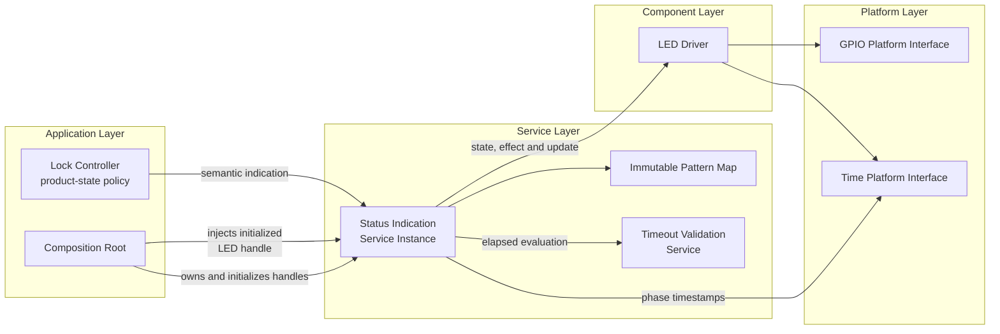
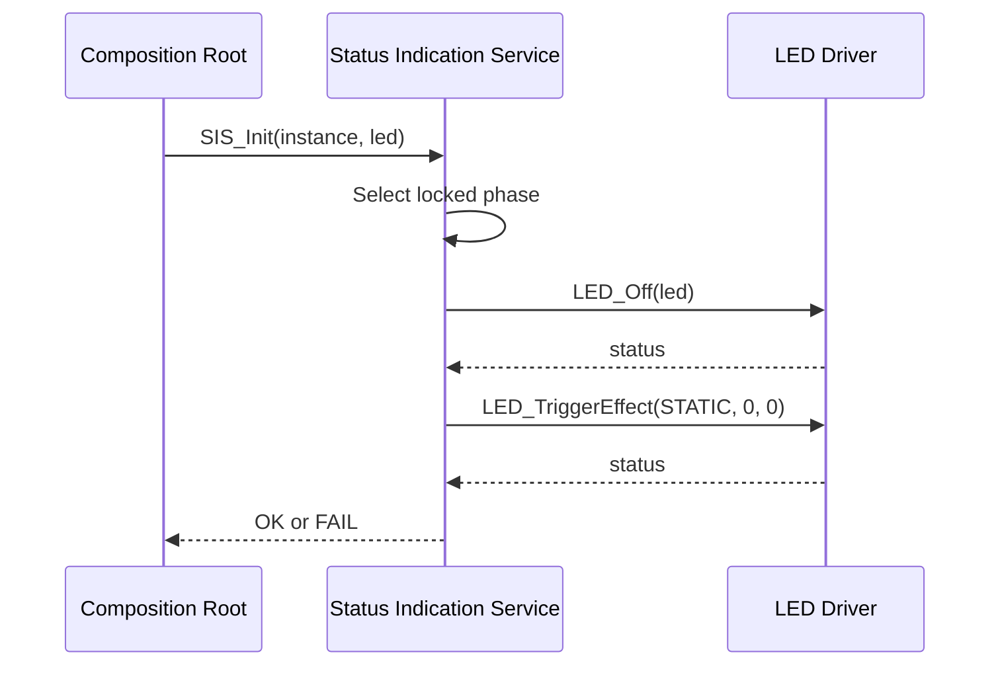
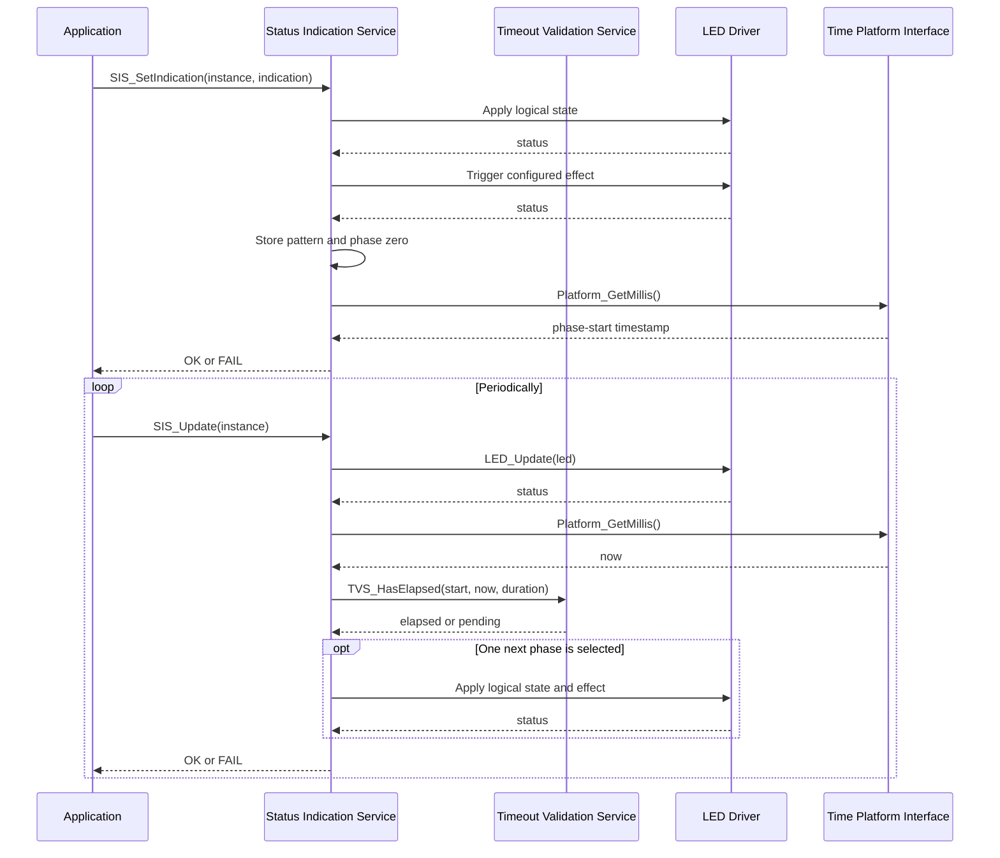

<h1 align="left">Status Indication Service</h1>

<p align="left">
  <big>
    Instance-based service for translating semantic electronic-lock states into<br>
    non-blocking, timestamp-driven LED indication patterns.
  </big>
</p>

> [!IMPORTANT]
> The Status Indication Service uses caller-owned `SIS_Handle_t` instances. The composition root initializes an `LED_Handle_t`, keeps both objects alive and injects the LED reference through `SIS_Init()`.

> [!NOTE]
> Pattern execution is non-blocking. `SIS_SetIndication()` and `SIS_Update()` obtain timestamps internally through `Platform_GetMillis()`, the same time base used by the LED Driver. The application remains responsible for calling `SIS_Update()` periodically.

---

## Table of Contents

- [1. Purpose](#1-purpose)
- [2. Design Intent](#2-design-intent)
- [3. Architecture](#3-architecture)
  - [3.1 Layer Placement](#31-layer-placement)
  - [3.2 Instance Ownership](#32-instance-ownership)
  - [3.3 Dependency Injection](#33-dependency-injection)
- [4. Directory Structure](#4-directory-structure)
- [5. Responsibilities](#5-responsibilities)
- [6. Dependencies](#6-dependencies)
- [7. Public Contract](#7-public-contract)
  - [7.1 Operation Status](#71-operation-status)
  - [7.2 Semantic Indications](#72-semantic-indications)
  - [7.3 Phase Descriptor](#73-phase-descriptor)
  - [7.4 Pattern Descriptor](#74-pattern-descriptor)
  - [7.5 Service Handle](#75-service-handle)
- [8. Built-In Pattern Catalog](#8-built-in-pattern-catalog)
- [9. Lifecycle](#9-lifecycle)
- [10. Pattern Execution Model](#10-pattern-execution-model)
  - [10.1 Phase Application](#101-phase-application)
  - [10.2 Pattern Selection](#102-pattern-selection)
  - [10.3 Periodic Update](#103-periodic-update)
  - [10.4 Nominal Timeline](#104-nominal-timeline)
  - [10.5 Pattern Completion](#105-pattern-completion)
  - [10.6 Timestamp Rollover](#106-timestamp-rollover)
- [11. LED Driver Interaction](#11-led-driver-interaction)
- [12. API Reference](#12-api-reference)
- [13. Composition-Root Integration](#13-composition-root-integration)
- [14. Operation Flows](#14-operation-flows)
- [15. Error Handling](#15-error-handling)
- [16. Timing and Concurrency](#16-timing-and-concurrency)
- [17. Current Implementation Notes](#17-current-implementation-notes)
- [18. Validation Checklist](#18-validation-checklist)
- [19. Limitations](#19-limitations)
- [20. License](#20-license)

---

## 1. Purpose

The Status Indication Service converts application-level lock meanings into fixed LED behavior.

The application requests `SIS_INDICATION_LOCKED`, `SIS_INDICATION_ACCESS_GRANTED`, `SIS_INDICATION_ACCESS_DENIED` or `SIS_INDICATION_LOCKOUT_ENTRY`. It does not assemble phase arrays or repeatedly issue individual LED transitions. Those visual details remain centralized in the service-owned pattern catalog.

Each pattern contains one or more phases. A phase defines:

- The logical LED state applied when the phase starts.
- The LED Driver effect triggered after that state is applied.
- The effect transition interval in milliseconds.
- The repetition request forwarded to the LED Driver.
- The nominal duration used by the service to select the next phase.

`SIS_SetIndication()` applies the first phase immediately. `SIS_Update()` progresses both the LED Driver effect and the service-level phase sequence without delay loops.

The acronym `SIS` means **Status Indication Service** and prefixes every public symbol provided by the module.

---

## 2. Design Intent

The current service is intentionally instance-based:

- The application or composition root allocates each `SIS_Handle_t`.
- Every service instance retains one borrowed `LED_Handle_t` reference.
- Each instance tracks its own selected pattern, phase timestamp, phase index and initialization state.
- Pattern and phase descriptors are immutable compile-time data shared by all instances.
- No dynamic allocation is used.
- The public functions always receive the service instance explicitly.
- More than one independent service instance may be created when the product needs independently controlled LEDs.

This differs from a module-owned singleton. Runtime state is visible in the public handle type because callers provide its storage, but its members remain private implementation state and shall not be accessed directly.

The public contract exposes:

- `SIS_OpStatus_t` for operation outcomes.
- `SIS_Indication_t` for semantic indication requests.
- `SIS_Phase_t` and `SIS_Pattern_t` as the current public pattern model.
- `SIS_Handle_t` as caller-owned runtime storage.
- The initialization, selection and update operations.

---

## 3. Architecture

### 3.1 Layer Placement

The Status Indication Service belongs to the application-services layer. A Lock Controller or another application owner selects semantic feedback, while the service translates it into LED Driver operations.



The service does not configure a GPIO, select an active electrical level or initialize the LED Driver. Those operations occur before `SIS_Init()`.

### 3.2 Instance Ownership

The composition root owns the storage for both the service and its LED dependency:

```c
static LED_Handle_t StatusLed;
static SIS_Handle_t StatusIndication;
```

`SIS_Init()` stores the LED pointer inside `StatusIndication`. It does not copy the LED object and does not take ownership of it.

The required lifetime relationship is:

```text
LED storage lifetime >= Status Indication Service usage lifetime
SIS storage lifetime >= every call made with that SIS handle
```

Neither object may be moved, released or replaced while the service still uses it.

### 3.3 Dependency Injection

The concrete dependency is supplied explicitly:

```c
SIS_OpStatus_t SIS_Init(SIS_Handle_t* Instance, LED_Handle_t* Led);
```

The intended dependency direction is:

```text
Composition Root ───────────── owns ────> SIS handle
Composition Root ─────────── injects ───> initialized LED handle
Application ───────────────── requests ──> semantic indication
Status Indication Service ───── uses ────> LED Driver and Timeout Validation Service
```

The service does not depend directly on STM32 HAL, target GPIO ports, target pins, an RTOS, keyboard types, authentication types or Lock Controller state enumerations.

---

## 4. Directory Structure

```text
Status_Indication/
├── Inc/
│   └── Status_Indication_Service.h
├── Src/
│   └── Status_Indication_Service.c
└── README.md
```

`Status_Indication_Service.h` defines the complete public type model and function prototypes.

`Status_Indication_Service.c` owns the built-in phase arrays, semantic pattern map, lifecycle checks, phase application and non-blocking progression logic.

---

## 5. Responsibilities

The Status Indication Service is responsible for:

- Retaining the LED Driver reference injected into each instance.
- Establishing the locked indication during initialization.
- Mapping semantic indication identifiers to immutable phase sequences.
- Applying the logical LED state configured for a phase.
- Triggering the configured LED effect for a phase.
- Recording the nominal phase-start timestamp.
- Tracking the current phase index.
- Updating the injected LED Driver periodically.
- Sampling the shared platform millisecond time base internally.
- Evaluating nonzero phase durations through the Timeout Validation Service.
- Advancing at most one service phase per `SIS_Update()` call.
- Preserving the nominal service timeline when an update arrives late.
- Returning invalid-lifecycle and dependency failures to the caller.

The service is explicitly not responsible for:

- Configuring or initializing GPIO hardware.
- Selecting LED electrical polarity.
- Initializing the LED Driver.
- Configuring or owning the platform millisecond time source.
- Deciding which application event deserves an indication.
- Authenticating credentials.
- Counting failed attempts or enforcing lockout policy.
- Controlling the lock actuator.
- Rendering LCD content or generating sound.
- Creating tasks, queues, timers, mutexes or scheduler callbacks.
- Serializing concurrent callers.
- Allocating or releasing dynamic memory.

---

## 6. Dependencies

The public header includes:

```c
#include "Led_Driver.h"
#include "stdbool.h"
```

`Led_Driver.h` provides the LED state, effect and handle types used by the public SIS model. It also currently provides the fixed-width integer definitions used by SIS declarations.

The implementation additionally includes:

```c
#include "Timeout_Validation_Service.h"
#include "Time_Platform_Interface.h"
```

The direct service dependencies are:

| Dependency | Purpose | Ownership |
|---|---|---|
| LED Driver | Logical LED state, effect triggering and effect progression | Borrowed from the composition root |
| Timeout Validation Service | Rollover-safe service-phase elapsed checks | Stateless utility |
| Time Platform Interface | Shared monotonic millisecond timestamps for phase selection and progression | Platform-owned service |

The LED Driver also uses the Time Platform Interface internally. Both layers therefore derive their progress from the same platform clock instead of accepting independent caller-supplied timestamps.

---

## 7. Public Contract

### 7.1 Operation Status

```c
typedef enum
{
    SIS_OPERATION_OK,
    SIS_OPERATION_FAIL

}SIS_OpStatus_t;
```

`SIS_OPERATION_OK` indicates successful validation and completion of all LED Driver work required by the call.

`SIS_OPERATION_FAIL` indicates an invalid argument, invalid lifecycle state, invalid pattern description or failed LED Driver operation, depending on the function.

### 7.2 Semantic Indications

```c
typedef enum
{
    SIS_INDICATION_LOCKED = 0U,
    SIS_INDICATION_ACCESS_GRANTED,
    SIS_INDICATION_ACCESS_DENIED,
    SIS_INDICATION_LOCKOUT_ENTRY,
    SIS_INDICATION_COUNT

}SIS_Indication_t;
```

| Identifier | Meaning | Initial LED state | Pattern shape |
|---|---|---:|---|
| `SIS_INDICATION_LOCKED` | Normal locked state | Off | One static phase |
| `SIS_INDICATION_ACCESS_GRANTED` | Positive authentication feedback | Off | One flash phase |
| `SIS_INDICATION_ACCESS_DENIED` | Negative authentication feedback | Off | Two pulse phases |
| `SIS_INDICATION_LOCKOUT_ENTRY` | Transition into lockout | Off | Seven pulse phases followed by steady on |
| `SIS_INDICATION_COUNT` | Pattern count and array boundary | N/A | Not a playable indication |

Only the four semantic values preceding `SIS_INDICATION_COUNT` identify entries in the pattern map.

### 7.3 Phase Descriptor

```c
typedef struct
{
    LED_State_t  _led_state;
    LED_Effect_t _effect;
    uint32_t     _effect_interval_ms;
    uint16_t     _effect_repeats;
    uint32_t     _duration_ms;

}SIS_Phase_t;
```

| Member | Meaning |
|---|---|
| `_led_state` | Logical state applied through `LED_On()` or `LED_Off()` before effect triggering |
| `_effect` | Effect forwarded to `LED_TriggerEffect()` |
| `_effect_interval_ms` | Interval between LED Driver effect transitions |
| `_effect_repeats` | Repetition request forwarded to the LED Driver |
| `_duration_ms` | Service-level duration before progression to the next phase |

The service-level duration is independent from the LED Driver's internal effect-transition counter. A duration of `0U` is advanced without an elapsed-time comparison on the next update.

### 7.4 Pattern Descriptor

```c
typedef struct
{
    const SIS_Phase_t* _phases;
    uint16_t           _phase_count;

}SIS_Pattern_t;
```

`_phases` references the first immutable phase in the sequence. `_phase_count` defines the valid range for service progression.

The built-in descriptors reference static arrays whose storage remains valid for the full firmware lifetime.

### 7.5 Service Handle

```c
typedef struct
{
    LED_Handle_t*        _led;
    const SIS_Pattern_t* _active_pattern;
    uint32_t             _phase_started_ms;
    uint16_t             _current_phase_index;
    bool                 _initialized;

}SIS_Handle_t;
```

| Member | Current role |
|---|---|
| `_led` | Borrowed initialized LED Driver handle |
| `_active_pattern` | Currently selected immutable pattern |
| `_phase_started_ms` | Nominal phase-start timestamp sampled from the platform time base |
| `_current_phase_index` | Current phase, or the phase count after completion |
| `_initialized` | Successful initialization flag |

Although the structure must be publicly complete so callers can allocate it, its members are service-private state. Application code shall use the SIS functions instead of reading or changing those members.

---

## 8. Built-In Pattern Catalog

### Locked

`SIS_INDICATION_LOCKED` contains one phase:

| Phase | Initial state | Effect | Interval | Repeats | Service duration |
|---:|---|---|---:|---:|---:|
| 0 | Off | Static | 0 ms | 0 | 0 ms |

The phase is applied during `SIS_Init()` and whenever the locked indication is selected. Its zero duration causes the phase index to reach completion on the next `SIS_Update()` call. The LED remains statically off.

### Access Granted

`SIS_INDICATION_ACCESS_GRANTED` contains one phase:

| Phase | Initial state | Effect | Interval | Repeats | Service duration |
|---:|---|---|---:|---:|---:|
| 0 | Off | Flash | 55 ms | 7 | 770 ms |

The LED Driver expands every flash repetition into two transitions. Seven repetitions therefore configure fourteen internal transitions. At 55 ms per transition, the driver-level effect and the SIS phase now share the same nominal 770 ms timeline.

### Access Denied

`SIS_INDICATION_ACCESS_DENIED` contains two equivalent phases:

| Phase | Initial state | Effect | Interval | Repeats | Service duration |
|---:|---|---|---:|---:|---:|
| 0 | Off | Pulse | 100 ms | 1 | 220 ms |
| 1 | Off | Pulse | 100 ms | 1 | 220 ms |

The complete service-level timeline is 440 ms. The LED Driver forces every pulse request to one repetition, which consists of two transitions.

### Lockout Entry

`SIS_INDICATION_LOCKOUT_ENTRY` contains eight phases:

| Phase | Initial state | Effect | Interval | Repeats | Service duration |
|---:|---|---|---:|---:|---:|
| 0 | Off | Pulse | 100 ms | 1 | 220 ms |
| 1 | Off | Pulse | 100 ms | 1 | 210 ms |
| 2 | Off | Pulse | 100 ms | 1 | 200 ms |
| 3 | Off | Pulse | 100 ms | 1 | 190 ms |
| 4 | Off | Pulse | 100 ms | 1 | 190 ms |
| 5 | Off | Pulse | 100 ms | 1 | 170 ms |
| 6 | Off | Pulse | 100 ms | 1 | 160 ms |
| 7 | On | Static | 100 ms | 1 | 0 ms |

The seven timed phases total 1340 ms. Their decreasing service durations cause later pulse requests to be issued more quickly. The last phase forwards the same 100 ms interval and one repetition as the pulse phases, but its static effect performs no timed transitions. It leaves the LED statically on and reaches service completion on the following update.

---

## 9. Lifecycle

The lifecycle is represented by four logical states. They describe the service
runtime; no public lifecycle-state enumeration is exposed.

| State | Meaning |
| :--- | :--- |
| `Uninitialized` | `SIS_Init()` has not completed successfully. Selection and update operations are rejected. |
| `LockedSelected` | The locked static-off pattern is selected and its zero-duration phase has not yet advanced. |
| `PatternActive` | A non-locked pattern has at least one pending service phase. |
| `PatternComplete` | The selected pattern has no pending SIS phase. Its pattern reference and terminal LED behavior remain retained. |

The following table defines every successful state transition:

| Current state | Operation or condition | Next state |
| :--- | :--- | :--- |
| Any state | `SIS_Init()` succeeds and applies the locked phase | `LockedSelected` |
| Any initialized state | `SIS_SetIndication(non-LOCKED)` selects or replaces a pattern | `PatternActive` |
| Any initialized state | `SIS_SetIndication(LOCKED)` selects or restores the locked pattern | `LockedSelected` |
| `LockedSelected` | `SIS_Update()` advances the zero-duration locked phase | `PatternComplete` |
| `PatternActive` | `SIS_Update()` leaves the current phase pending or advances an intermediate phase | `PatternActive` |
| `PatternActive` | `SIS_Update()` completes the final phase | `PatternComplete` |
| `PatternComplete` | `SIS_Update()` continues updating only the LED Driver | `PatternComplete` |

Before successful initialization:

- `SIS_SetIndication()` fails.
- `SIS_Update()` fails.

During initialization, the service:

1. Validates the service and LED pointers.
2. Stores the LED reference.
3. Selects the locked pattern.
4. Resets the phase timestamp to zero.
5. Resets the phase index to zero.
6. Clears the initialization flag.
7. Applies the first locked phase.
8. Sets the initialization flag only after phase application succeeds.

The helper currently named `SIS_IsActive()` checks only whether the instance is non-null and initialized. It does not indicate whether a pattern still has an unfinished phase.

---

## 10. Pattern Execution Model

### 10.1 Phase Application

Every phase application follows this order:

1. Validate the instance and phase pointers.
2. Call `LED_On()` when `_led_state` is `LED_STATE_ON`; otherwise call `LED_Off()`.
3. Stop and report failure if the state operation fails.
4. Call `LED_TriggerEffect()` with the phase effect, interval and repetition count.
5. Report the LED Driver result through the SIS status type.

The logical state is therefore applied before the effect is configured. If effect triggering fails, the state operation may already have changed the physical LED.

### 10.2 Pattern Selection

`SIS_SetIndication()` currently performs this sequence:

1. Validate the instance pointer, indication boundary and initialization flag.
2. Resolve the indication through `SIS_PatternMap`.
3. Validate that the resolved pattern has a non-null phase pointer and nonzero phase count.
4. Apply phase zero immediately.
5. Store the requested pattern after phase application succeeds.
6. Sample `Platform_GetMillis()` as the phase-start timestamp.
7. Reset the current phase index to zero.

A successful request replaces the previously selected pattern regardless of whether that pattern reached completion. Selecting `SIS_INDICATION_LOCKED` is the explicit way to replace transient feedback with the locked static-off pattern. When phase-zero application fails, the previously stored SIS pattern state is retained.

### 10.3 Periodic Update

`SIS_Update()` performs two distinct forms of progression:

1. It always calls `LED_Update()` first so the LED Driver can process its internal effect.
2. When a SIS phase remains pending, it samples `Platform_GetMillis()` and evaluates that phase through the Timeout Validation Service.

When a nonzero-duration phase has not elapsed, the function returns success without changing the phase index. When the duration has elapsed, or when the duration is zero, the service advances the index.

At most one SIS phase advances per call. A late call does not loop through every expired phase; repeated calls are required to catch up.

### 10.4 Nominal Timeline

When a phase advances, the service updates the stored start timestamp by adding the configured duration:

```c
Instance->_phase_started_ms += current_phase->_duration_ms;
```

It does not replace the stored value with the most recent `Platform_GetMillis()` sample. This preserves the original nominal timeline and prevents update latency from extending every later phase.

For example, if a phase starts at 1000 ms with a duration of 220 ms and the update arrives at 1250 ms, the next nominal start becomes 1220 ms rather than 1250 ms.

### 10.5 Pattern Completion

When the phase index reaches `_phase_count`:

- The selected pattern pointer is retained.
- The index remains equal to the phase count.
- The initialization flag remains true.
- No explicit idle pattern is selected.
- The terminal LED Driver state or still-running effect is retained.
- Later `SIS_Update()` calls continue calling `LED_Update()` and return success.
- A later `SIS_SetIndication()` can immediately select a new pattern.

### 10.6 Timestamp Rollover

Nonzero phase durations are checked through:

```c
uint32_t now = Platform_GetMillis();

TVS_HasElapsed(Instance->_phase_started_ms, now, DurationMs);
```

The Timeout Validation Service uses unsigned subtraction, so one 32-bit millisecond rollover is handled correctly when the normal timing assumptions of that service are respected.

---

## 11. LED Driver Interaction

The SIS and LED Driver maintain separate timing state while reading one shared platform clock:

| Layer | Timing source | Controls |
|---|---|---|
| Status Indication Service | `Platform_GetMillis()` read internally | Transition between SIS phases |
| LED Driver | `Platform_GetMillis()` read internally | State transitions inside pulse, flash or blink effects |

The application no longer supplies timestamps to the SIS API. Phase selection, phase progression and LED effect progression all derive from the Time Platform Interface, removing the possibility of independent caller and driver clock domains.

Effect duration is not calculated by SIS. It is a consequence of the LED Driver's interval and transition counter. The service forwards the values and separately uses `_duration_ms` to decide when to advance its own phase sequence.

Calling `SIS_Update()` periodically is therefore required even after the SIS phase index has reached the pattern count whenever a finite LED effect may still be running.

---

## 12. API Reference

### `SIS_Init()`

```c
SIS_OpStatus_t SIS_Init(SIS_Handle_t* Instance, LED_Handle_t* Led);
```

Initializes caller-owned service storage, borrows an initialized LED Driver and immediately applies the locked pattern's first phase.

Returns `SIS_OPERATION_FAIL` when either pointer is null or when the locked phase cannot be applied. The instance is marked initialized only after successful phase application.

### `SIS_SetIndication()`

```c
SIS_OpStatus_t SIS_SetIndication(
    SIS_Handle_t* Instance,
    SIS_Indication_t Indication);
```

Selects a built-in semantic pattern and applies its first phase immediately. After successful application, it stores the new pattern, samples `Platform_GetMillis()` and resets progression to phase zero.

Only `SIS_INDICATION_LOCKED` through `SIS_INDICATION_LOCKOUT_ENTRY` are valid application requests. `SIS_INDICATION_COUNT` is a sentinel.

Selecting `SIS_INDICATION_LOCKED` immediately replaces an in-progress transient indication with the locked static-off pattern. The service intentionally exposes no separate stop operation.

### `SIS_Update()`

```c
SIS_OpStatus_t SIS_Update(SIS_Handle_t* Instance);
```

Updates the injected LED Driver, samples `Platform_GetMillis()` when a phase is pending and advances at most one service phase when its duration has elapsed.

The function shall be called periodically from a serialized application context. Its update rate limits the temporal resolution of both phase selection and, indirectly, driver effect progression.

---

## 13. Composition-Root Integration

The composition root creates and initializes lower-level dependencies before the service:

```c
static GPIO_Handle_t StatusLedGpio;
static LED_Handle_t  StatusLed;
static SIS_Handle_t  StatusIndication;

static bool InitializeStatusIndication(void)
{
    /* Configure StatusLedGpio first through the target GPIO platform. */

    if(LED_Init(&StatusLed, &StatusLedGpio, LED_ACTIVE_HIGH) != LED_OPERATION_OK)
    {
        return false;
    }

    if(SIS_Init(&StatusIndication, &StatusLed) != SIS_OPERATION_OK)
    {
        return false;
    }

    return true;
}
```

`LED_ACTIVE_HIGH` is illustrative. The actual active level must match the board wiring.

Application code selects semantic feedback without providing a timestamp:

```c
if(SIS_SetIndication(
       &StatusIndication,
       SIS_INDICATION_ACCESS_GRANTED) != SIS_OPERATION_OK)
{
    /* Apply the product error policy. */
}
```

The periodic path progresses the service:

```c
void Application_Update(void)
{
    if(SIS_Update(&StatusIndication) != SIS_OPERATION_OK)
    {
        /* Apply the product error policy. */
    }
}
```

Transient feedback can be replaced explicitly by selecting the locked indication:

```c
if(SIS_SetIndication(
       &StatusIndication,
       SIS_INDICATION_LOCKED) != SIS_OPERATION_OK)
{
    /* Apply the product error policy. */
}
```

No independent cancellation function is required because every successful indication request replaces the current pattern immediately.

---

## 14. Operation Flows

### Initialization



### Indication Selection and Progression



---

## 15. Error Handling

The service uses explicit return statuses and does not log, assert, reset the target or choose an application recovery policy.

| Condition | Current result |
|---|---|
| Null instance passed to any defined public operation | `SIS_OPERATION_FAIL` |
| Null LED passed to `SIS_Init()` | `SIS_OPERATION_FAIL` |
| Selection or update before successful initialization | `SIS_OPERATION_FAIL` |
| Resolved pattern has no phases | `SIS_OPERATION_FAIL` |
| LED state operation fails | `SIS_OPERATION_FAIL` |
| LED effect trigger fails | `SIS_OPERATION_FAIL` |
| LED update fails | `SIS_OPERATION_FAIL` |
| Current phase has not elapsed | `SIS_OPERATION_OK` |
| Pattern has already completed | `SIS_OPERATION_OK` after `LED_Update()` succeeds |

The caller remains responsible for deciding whether a failure is retried, reported, converted into a safe state or escalated to a higher-level fault policy.

Some lower-level failures can occur after partial work. In particular:

- A logical LED state may change before effect triggering fails.
- A phase index advances before application of the next phase can fail.

The current implementation does not roll back those changes.

---

## 16. Timing and Concurrency

All SIS durations and internally sampled timestamps are expressed in milliseconds.

The caller shall:

- Keep the Time Platform Interface available as one monotonically increasing unsigned 32-bit millisecond source.
- Call `SIS_Update()` frequently enough for the required visual resolution.
- Keep the service instance, its LED Driver and its GPIO dependency valid.
- Serialize all access to a given SIS and LED handle pair.

The service does not provide atomic operations, critical sections or a mutex. Concurrent calls can race on the active pattern, phase index, phase timestamp and LED Driver effect context.

Multiple SIS instances can execute independently only when their storage and LED dependencies are independent. Sharing one `LED_Handle_t` between service instances introduces competing state and effect ownership and is not supported by the current design.

---

## 17. Current Implementation Notes

The following points describe the source exactly as it currently exists:

- Lockout-entry phase durations of 190, 170 and 160 ms are shorter than the nominal 200 ms required for two 100 ms pulse transitions.
- The terminal lockout-entry phase forwards the lockout-entry interval and repetition values even though it selects a static effect.
- `SIS_ARRAY_LENGTH()` converts the array element count to `uint8_t`, while `_phase_count` is `uint16_t`.
- A phase index is advanced before the next phase is applied, so a phase-application failure does not roll progression back.
- SIS phase timing and LED Driver effects both use `Platform_GetMillis()` internally.

These notes are documentation of the present implementation, not changes to its behavior.

---

## 18. Validation Checklist

Before integrating the service, verify that:

- [ ] The GPIO platform handle is configured for output operation.
- [ ] The LED Driver active level matches the board wiring.
- [ ] `LED_Init()` succeeds before `SIS_Init()`.
- [ ] Both handles retain static or otherwise sufficient lifetime.
- [ ] Each SIS instance has exclusive ownership of its LED Driver during use.
- [ ] `SIS_Init()` succeeds before selection or update calls.
- [ ] Application requests never pass `SIS_INDICATION_COUNT` or out-of-range values.
- [ ] The Time Platform Interface provides the monotonic millisecond base expected by both SIS and the LED Driver.
- [ ] The update cadence is shorter than the smallest required visible transition interval.
- [ ] Calls for one instance are serialized.
- [ ] Every returned failure is handled according to product policy.
- [ ] Application code selects `SIS_INDICATION_LOCKED` when transient feedback shall return to the locked static-off state.
- [ ] Hardware tests confirm that every pattern matches the desired visual behavior.
- [ ] Tests cover timestamp rollover and delayed update calls.

---

## 19. Limitations

The current service intentionally or structurally has the following limits:

- Patterns are compile-time constants and cannot be configured at runtime.
- Each service instance controls one LED Driver.
- There is no public query for the selected indication or completion state.
- The helper named `SIS_IsActive()` represents initialization, not phase activity.
- A single update advances at most one service phase.
- There is no separate stop or cancellation operation; callers replace the current pattern through `SIS_SetIndication()`.
- There is no priority or arbitration policy between indications.
- A new valid request immediately replaces the current pattern.
- There is no automatic transition back to the locked pattern.
- There is no callback or event when a pattern completes.
- Service phase completion and LED Driver effect completion are separate concepts.
- The service does not provide concurrency protection.
- Public runtime structures expose their layout because callers own their storage.

---

## 20. License

This module is part of the:

```text
Electronic Lock Project
```

and follows the project's license terms.
