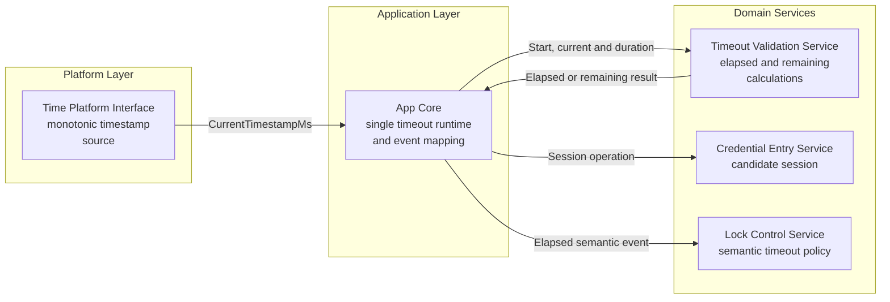
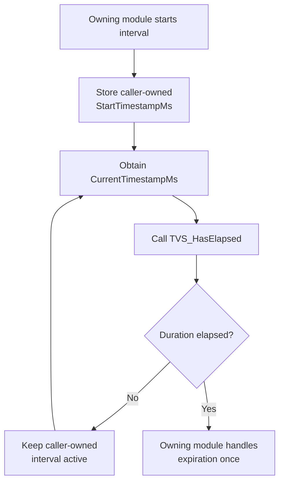
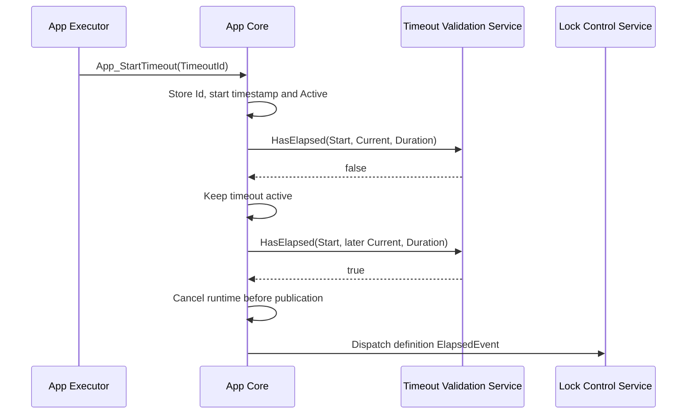

<h1 align="left">Timeout Validation Service</h1>

<p align="left">
  <big>
    Stateless and hardware-independent temporal utility for evaluating<br>
    caller-owned millisecond timeout intervals with rollover-safe arithmetic.
  </big>
</p>

> [!IMPORTANT]
> The Timeout Validation Service performs only elapsed and remaining-time calculations from explicit timestamps and durations. It does not read a time source, own timeout state, start or cancel timers, create RTOS objects, produce application events, or perform application state-machine transitions.

---

## Table of Contents

* [1. Overview](#1-overview)
* [2. Features](#2-features)
* [3. Architecture](#3-architecture)

  * [3.1 Layer Placement](#31-layer-placement)
  * [3.2 Application Integration](#32-application-integration)
* [4. Directory Structure](#4-directory-structure)
* [5. Service Responsibilities](#5-service-responsibilities)

  * [5.1 Responsibilities](#51-responsibilities)
  * [5.2 Explicit Non-Responsibilities](#52-explicit-non-responsibilities)
* [6. Dependencies](#6-dependencies)
* [7. Public Data Model](#7-public-data-model)

  * [7.1 Timestamp Type](#71-timestamp-type)
  * [7.2 Duration Type](#72-duration-type)
* [8. Temporal Model](#8-temporal-model)

  * [8.1 Caller-Owned Intervals](#81-caller-owned-intervals)
  * [8.2 Elapsed-Time Calculation](#82-elapsed-time-calculation)
  * [8.3 Expiration Boundary](#83-expiration-boundary)
  * [8.4 Remaining-Time Saturation](#84-remaining-time-saturation)
  * [8.5 Zero-Duration Semantics](#85-zero-duration-semantics)
* [9. Rollover Contract](#9-rollover-contract)

  * [9.1 Unsigned Modular Arithmetic](#91-unsigned-modular-arithmetic)
  * [9.2 Observation Limit](#92-observation-limit)
  * [9.3 Invalid Temporal Assumptions](#93-invalid-temporal-assumptions)
* [10. API Reference](#10-api-reference)

  * [10.1 TVS_HasElapsed](#101-tvs_haselapsed)
  * [10.2 TVS_GetRemainingMs](#102-tvs_getremainingms)
* [11. Operation Flow](#11-operation-flow)

  * [11.1 Generic Timeout Evaluation](#111-generic-timeout-evaluation)
  * [11.2 App Core Integration](#112-app-core-integration)
  * [11.3 Credential-Entry Integration](#113-credential-entry-integration)
* [12. Usage Example](#12-usage-example)
* [13. Design Decisions](#13-design-decisions)

  * [13.1 Stateless Service](#131-stateless-service)
  * [13.2 No Public Handle](#132-no-public-handle)
  * [13.3 Explicit Time Inputs](#133-explicit-time-inputs)
  * [13.4 Start Timestamp Instead of Absolute Deadline](#134-start-timestamp-instead-of-absolute-deadline)
  * [13.5 Millisecond-Only Public Contract](#135-millisecond-only-public-contract)
  * [13.6 Private Elapsed-Time Helper](#136-private-elapsed-time-helper)
* [14. Error Handling](#14-error-handling)
* [15. Timing and Concurrency](#15-timing-and-concurrency)
* [16. Usage Constraints](#16-usage-constraints)
* [17. Testing and Acceptance Criteria](#17-testing-and-acceptance-criteria)
* [18. Applications](#18-applications)
* [19. Limitations and Future Improvements](#19-limitations-and-future-improvements)
* [20. License](#20-license)

---

## 1. Overview

The Timeout Validation Service is a small temporal utility responsible for evaluating caller-owned timeout intervals expressed in milliseconds.

The service receives an interval start timestamp, the current timestamp, and a configured duration. From those values it can determine whether the duration has elapsed or how much time remains before expiration.

The service owns no mutable state. It does not represent an active timer and does not require initialization, configuration, a public handle, or a dedicated runtime instance. Multiple independent timeouts are evaluated by passing different caller-owned values to the same public functions.

The service is independent from the STM32 time source and the FreeRTOS execution model. The application or owning service obtains the current timestamp and passes it explicitly to TVS.

The acronym `TVS` means **Timeout Validation Service** and is used as the prefix for every public symbol exposed by this module.

---

## 2. Features

- Rollover-safe elapsed-time comparison.
- Remaining-time calculation saturated at zero.
- Explicit unsigned 32-bit millisecond timestamps.
- Explicit unsigned 32-bit millisecond durations.
- Exact expiration-boundary semantics.
- Defined zero-duration behavior.
- Support for multiple independent caller-owned timeouts.
- Stateless and deterministic execution.
- Reentrant operations with no shared mutable data.
- No public handle or service instance.
- No initialization or lifecycle API.
- No dynamic memory allocation.
- No direct hardware access.
- No time-source read.
- No RTOS dependency.
- No blocking operations.

---

## 3. Architecture

### 3.1 Layer Placement

The Timeout Validation Service belongs to the hardware-independent services layer.

It receives time values from an owning application or domain module and remains independent from the Platform implementation that produced those values:



The dependency direction preserves the following boundaries:

- The Time Platform Interface provides a timestamp without knowing product policy.
- App Core stores the active start timestamp and selects its configured duration.
- TVS evaluates the supplied interval without storing it.
- App Core converts expiration into the semantic event associated with the active timeout; LCS decides the state transition.
- Other services are not modified directly by TVS.

### 3.2 Application Integration

The application is responsible for orchestrating timeout behavior in the following order:

1. Obtain the current millisecond timestamp through the approved time boundary.
2. Store that value when an interval begins or restarts.
3. Retain the configured duration in the appropriate application or service configuration.
4. Call `TVS_HasElapsed()` during the owning module's normal update flow.
5. Interpret the returned Boolean according to the current product state.
6. Perform any event production, cleanup or state transition outside TVS.
7. Call `TVS_GetRemainingMs()` only when the remaining value is needed for feedback or diagnostics.

The Timeout Validation Service never calls the Time Platform Interface, App Core, Credential Entry Service, Lock Control Service, display, status-indication, or sound services directly.

---

## 4. Directory Structure

```text
Services/
|
└── Timeout_Validation/
    |
    ├── Inc/
    │   └── Timeout_Validation_Service.h
    |
    ├── Src/
    │   └── Timeout_Validation_Service.c
    |
    └── README.md
```

The public header contains the timestamp and duration types together with the stateless API declarations.

The source file contains the private elapsed-time helper, the public implementation, and the detailed function contracts.

---

## 5. Service Responsibilities

### 5.1 Responsibilities

The Timeout Validation Service is responsible for:

- Receiving explicit unsigned millisecond timestamps.
- Receiving an explicit unsigned millisecond duration.
- Calculating elapsed time with unsigned modular subtraction.
- Reporting whether the configured duration has elapsed.
- Treating the exact duration boundary as elapsed.
- Calculating the remaining duration before expiration.
- Saturating the remaining duration at `0U` after expiration.
- Applying a consistent zero-duration semantic.
- Preserving correct calculation across one 32-bit timestamp rollover.
- Providing deterministic, bounded and side-effect-free operations.

### 5.2 Explicit Non-Responsibilities

The Timeout Validation Service is **not responsible** for:

- Reading `HAL_GetTick()`.
- Reading `Platform_GetMillis()`.
- Reading a FreeRTOS tick count.
- Selecting or configuring the system time source.
- Converting hardware counter ticks to milliseconds.
- Starting, restarting, pausing, resuming or cancelling a timeout.
- Storing start timestamps, current timestamps, durations or deadlines.
- Maintaining active or inactive timeout state.
- Owning a singleton instance or public handle.
- Defining credential-entry, door-confirmation, denial, lockout or registration-feedback durations.
- Deciding whether a domain permits a duration of `0U`.
- Producing `LCS_EVENT_ENTRY_TIMEOUT`, `LCS_EVENT_DOOR_SENSOR_CONFIRMATION_TIMEOUT` or any other application event.
- Performing App Core event dispatch or Lock Control state transitions.
- Ending a Credential Entry Service session.
- Erasing candidate credentials.
- Counting failed authentication attempts.
- Applying lockout policy.
- Controlling the lock actuator.
- Rendering remaining time on the display.
- Controlling LEDs, the buzzer or LCD backlight.
- Creating tasks, queues, software timers or other RTOS objects.
- Delaying or blocking the caller.

---

## 6. Dependencies

The public interface depends only on standard fixed-width integer and Boolean types:

```c
#include "stdbool.h"
#include "stdint.h"
```

The implementation has no additional dependency.

The service has no dependency on:

- STM32 HAL or LL.
- CMSIS.
- FreeRTOS.
- Platform GPIO, I2C, PWM, or time interfaces.
- Application configuration values.
- App Core or Lock Control types and events.
- Credential Entry, Authentication, Display Render, Status Indication, Sound Generator, or Lock Control services.
- Any component driver or hardware adapter.

---

## 7. Public Data Model

### 7.1 Timestamp Type

`TVS_TimestampMs_t` represents one sample from a monotonically increasing unsigned 32-bit millisecond time source:

```c
typedef uint32_t TVS_TimestampMs_t;
```

The type may represent:

- The timestamp captured when an interval begins.
- The timestamp captured when meaningful activity restarts an interval.
- The current timestamp at which an interval is evaluated.

TVS does not distinguish these roles through separate types because they share the same unit and arithmetic representation. Parameter names preserve their semantic meaning at each API call.

A timestamp is not a duration and shall not be interpreted as an absolute calendar time.

### 7.2 Duration Type

`TVS_DurationMs_t` represents an unsigned 32-bit duration in milliseconds:

```c
typedef uint32_t TVS_DurationMs_t;
```

The type is used for:

- Configured interval durations.
- Privately calculated elapsed durations.
- Public remaining-duration results.

Duration values are supplied by callers or application configuration. TVS does not define the current product values of 5 seconds for credential entry, 800 milliseconds for door confirmation, 1.5 seconds for access-denied feedback, 10 seconds for lockout, or 1.5 seconds for registration-success feedback.

---

## 8. Temporal Model

### 8.1 Caller-Owned Intervals

One logical timeout interval consists of three values:

| Value | Owner | Meaning |
|---|---|---|
| Start timestamp | Calling module | Millisecond timestamp captured when the interval began or restarted. |
| Current timestamp | Calling module | Millisecond timestamp captured for the current evaluation cycle. |
| Duration | Calling module or its configuration | Required interval length in milliseconds. |

TVS owns none of these values after a function returns.

Several independent intervals can be evaluated through TVS because each caller supplies its own values. The current application deliberately owns only one active runtime because its timed LCS states are mutually exclusive:

```text
App_ActiveTimeout
├── Id
├── StartedAtMs
└── Active

App_TimeoutDefinitions[Id]
├── DurationMs
└── ElapsedEvent
```

Starting another timed phase replaces that runtime with a new identifier and start timestamp. Every definition uses the same TVS functions without creating a service instance.

### 8.2 Elapsed-Time Calculation

The private elapsed-time calculation is equivalent to:

```c
elapsed_ms = (TVS_DurationMs_t)
             (CurrentTimestampMs - StartTimestampMs);
```

Because both timestamps are unsigned 32-bit values, subtraction follows modulo-`2^32` arithmetic defined by the C language.

The elapsed value is an implementation detail and is not exposed through the public API. Callers request only the domain-neutral results required by the current architecture: expiration or remaining duration.

### 8.3 Expiration Boundary

An interval is active while:

```text
elapsed_ms < DurationMs
```

An interval is elapsed when:

```text
elapsed_ms >= DurationMs
```

The exact duration boundary is therefore considered elapsed.

For a start timestamp of `1000U` and a duration of `500U`:

| Current Timestamp | Elapsed | `TVS_HasElapsed()` |
|---:|---:|---|
| `1000U` | `0U` | `false` |
| `1499U` | `499U` | `false` |
| `1500U` | `500U` | `true` |
| `1501U` | `501U` | `true` |

### 8.4 Remaining-Time Saturation

Before expiration, the remaining duration is:

```c
remaining_ms = DurationMs - elapsed_ms;
```

At and after expiration, the result is saturated:

```c
remaining_ms = 0U;
```

Saturation prevents unsigned underflow and provides a stable result for display or diagnostic consumers.

For a duration of `500U`:

| Elapsed | `TVS_GetRemainingMs()` |
|---:|---:|
| `0U` | `500U` |
| `499U` | `1U` |
| `500U` | `0U` |
| `501U` | `0U` |

### 8.5 Zero-Duration Semantics

A duration of `0U` is considered elapsed immediately:

```c
TVS_HasElapsed(StartTimestampMs, CurrentTimestampMs, 0U) == true
```

Its remaining duration is always zero:

```c
TVS_GetRemainingMs(StartTimestampMs, CurrentTimestampMs, 0U) == 0U
```

TVS does not reject zero because zero is mathematically well-defined and may be useful to represent an immediately elapsed interval.

A consuming domain remains responsible for rejecting zero when required. In the current application, `App_StartTimeout()` rejects a timeout definition whose configured duration is `0U` rather than changing TVS semantics.

---

## 9. Rollover Contract

### 9.1 Unsigned Modular Arithmetic

Consider an interval that starts close to the maximum 32-bit timestamp value:

```text
StartTimestampMs   = 0xFFFFFFF0U
CurrentTimestampMs = 0x00000010U
```

Unsigned subtraction produces:

```text
0x00000010U - 0xFFFFFFF0U = 0x00000020U
```

The calculated elapsed duration is therefore `32U` milliseconds even though the timestamp source rolled over between both samples.

TVS deliberately avoids comparisons such as:

```c
CurrentTimestampMs >= AbsoluteDeadlineMs
```

An absolute comparison of this form is not generally safe when the counter rolls over.

### 9.2 Observation Limit

A 32-bit millisecond counter completes one full period after `2^32` milliseconds, approximately 49.7 days.

After a complete period, the current timestamp can equal an earlier timestamp and the original elapsed duration cannot be reconstructed from the two 32-bit values alone.

The caller shall therefore evaluate and act on an interval before one complete timestamp-counter period has elapsed since its start timestamp.

All current V1 product durations are far below this limit:

| Product Interval | Current Duration |
|---|---:|
| Credential-entry inactivity | 5 seconds |
| Door-position confirmation | 800 milliseconds |
| Access-denied feedback | 1.5 seconds |
| Lockout | 10 seconds |
| Credential-register success feedback | 1.5 seconds |

### 9.3 Invalid Temporal Assumptions

TVS cannot diagnose whether a timestamp was captured from the wrong source, from a reset timebase, or from a logically future interval.

The caller shall ensure that:

- Start and current timestamps use the same time source and unit.
- The time source is monotonic apart from unsigned rollover.
- The time source is not silently reset while an interval remains active.
- Sleep or low-power transitions reconcile the timebase before evaluation.
- A start timestamp belongs to the interval currently being evaluated.
- The interval is observed before a complete counter period elapses.

Violating these preconditions can produce a mathematically valid modular result that does not represent the intended product interval.

---

## 10. API Reference

### 10.1 TVS_HasElapsed

Reports whether a caller-owned timeout interval reached or exceeded its configured duration.

#### Function Signature

```c
bool TVS_HasElapsed(
    TVS_TimestampMs_t StartTimestampMs,
    TVS_TimestampMs_t CurrentTimestampMs,
    TVS_DurationMs_t  DurationMs
);
```

#### Parameters

| Parameter | Description |
|---|---|
| `StartTimestampMs` | Timestamp at which the interval started or was last restarted. |
| `CurrentTimestampMs` | Current timestamp supplied by the caller. |
| `DurationMs` | Duration of the interval to validate. |

#### Return

| Return Value | Description |
|---|---|
| `false` | The calculated elapsed duration is less than `DurationMs`. |
| `true` | The calculated elapsed duration is equal to or greater than `DurationMs`. |

When `DurationMs` is `0U`, the function returns `true`.

The function does not modify caller-owned values and does not latch the expiration result. If a consumer requires one-shot event production, that consumer must combine this Boolean result with its own state transition or active-interval flag.

### 10.2 TVS_GetRemainingMs

Returns the remaining duration of a caller-owned timeout interval.

#### Function Signature

```c
TVS_DurationMs_t TVS_GetRemainingMs(
    TVS_TimestampMs_t StartTimestampMs,
    TVS_TimestampMs_t CurrentTimestampMs,
    TVS_DurationMs_t  DurationMs
);
```

#### Parameters

| Parameter | Description |
|---|---|
| `StartTimestampMs` | Timestamp at which the interval started or was last restarted. |
| `CurrentTimestampMs` | Current timestamp supplied by the caller. |
| `DurationMs` | Duration of the interval to evaluate. |

#### Return

| Return Value | Description |
|---|---|
| `1U` through `DurationMs` | Remaining duration before expiration. |
| `0U` | The interval reached or exceeded its duration, or `DurationMs` is zero. |

The result saturates at `0U` and never wraps because of subtraction after expiration.

---

## 11. Operation Flow

### 11.1 Generic Timeout Evaluation



TVS participates only in the calculation represented by `TVS_HasElapsed()`. Every other step belongs to the calling module or application execution boundary.

### 11.2 App Core Integration

App Core owns one active timeout runtime and an immutable definition table that maps each timed LCS phase to a duration and elapsed event:



TVS does not know which timeout identifier or LCS state is active and cannot determine which semantic event or transition should follow expiration.

### 11.3 Credential-Entry Integration

For credential-entry inactivity:

1. App Executor calls `App_StartTimeout(APP_TIMEOUT_CREDENTIAL_ENTRY)` when an LCS action begins or refreshes entry.
2. App Core restarts that same application-owned timeout after each accepted digit.
3. `App_Dispatch()` calls `App_PollTimeout()` once per main-loop execution cycle.
4. App Core supplies the stored start timestamp, current Platform timestamp and configured 5-second duration to `TVS_HasElapsed()`.
5. When expiration is reported, App Core cancels the runtime and dispatches `LCS_EVENT_ENTRY_TIMEOUT` exactly once.
6. LCS returns the state-specific cleanup action.
7. App Executor calls `CES_EndSession()` and restores the appropriate locked or registration flow.

TVS never calls `CES_EndSession()` and never erases credential data itself.

---

## 12. Usage Example

The following example illustrates a caller-owned credential-entry timeout:

```c
static TVS_TimestampMs_t App_EntryStartedAtMs;
static const TVS_DurationMs_t APP_ENTRY_TIMEOUT_MS = 5000U;

void App_StartCredentialEntryTimeout(void)
{
    App_EntryStartedAtMs = Platform_GetMillis();
}

bool App_EntryHasExpired(void)
{
    TVS_TimestampMs_t current_time_ms = Platform_GetMillis();

    return TVS_HasElapsed(
        App_EntryStartedAtMs,
        current_time_ms,
        APP_ENTRY_TIMEOUT_MS
    );
}
```

Restarting the inactivity interval after meaningful activity requires only a caller-owned timestamp update:

```c
App_EntryStartedAtMs = Platform_GetMillis();
```

No TVS start or restart operation is required.

The remaining time may be requested independently:

```c
TVS_DurationMs_t remaining_ms = TVS_GetRemainingMs(
    App_EntryStartedAtMs,
    Platform_GetMillis(),
    APP_ENTRY_TIMEOUT_MS
);
```

The application may use `remaining_ms` for a logical display model. TVS does not format, round or render the value.

---

## 13. Design Decisions

### 13.1 Stateless Service

TVS stores no mutable runtime state.

This design provides:

- Deterministic behavior based only on explicit arguments.
- No initialization or deinitialization sequence.
- No hidden timeout lifecycle.
- No application-owned heap use.
- Straightforward host-side testing.
- Reentrant operations.
- Reuse by several independent timeout owners.

### 13.2 No Public Handle

The module exposes no `TVS_Handle_t` because there is no service state to identify or preserve.

A handle would be justified only if TVS owned concepts such as:

- A stored start timestamp.
- A configured duration.
- An active or inactive state.
- Pause and resume state.
- A callback or event destination.

Those concepts belong to domain owners in the current architecture. Introducing them into TVS would turn a temporal calculation utility into a timer manager and would duplicate state already owned by App Core or another caller.

### 13.3 Explicit Time Inputs

Every function receives both start and current timestamps explicitly.

TVS does not call `Platform_GetMillis()` because explicit time inputs:

- Keep the service independent from STM32 and Platform implementations.
- Allow one current timestamp to be shared across an application update cycle.
- Make test cases deterministic.
- Avoid hidden time reads between related decisions.
- Allow simulated boundary and rollover values on the host.

### 13.4 Start Timestamp Instead of Absolute Deadline

The public API receives a start timestamp and duration rather than an absolute deadline.

The service can therefore apply the required rollover-safe form directly:

```c
(uint32_t)(CurrentTimestampMs - StartTimestampMs) >= DurationMs
```

This prevents consumers from relying on a naïve absolute comparison that fails around counter rollover.

### 13.5 Millisecond-Only Public Contract

All public TVS values use milliseconds and include `Ms` in their type and parameter names.

The product timeouts are human-scale intervals polled by `App_Dispatch()` in the serialized main loop. Adding generic units or microsecond variants would increase API ambiguity without serving a current requirement.

### 13.6 Private Elapsed-Time Helper

Elapsed time is calculated by a private `static inline` helper in the implementation file.

The public API exposes only the two results required by consumers:

- Whether an interval has elapsed.
- How much time remains.

Keeping raw elapsed time private limits the public surface and centralizes unsigned modular subtraction in one implementation location.

---

## 14. Error Handling

Every bit pattern of `TVS_TimestampMs_t` and `TVS_DurationMs_t` is a valid unsigned value. The API receives values rather than pointers and therefore has no null-pointer failure mode.

For this reason, TVS does not define an operation-status enum.

The service handles temporal boundary conditions through defined return semantics:

- A zero duration is immediately elapsed.
- The exact duration boundary is elapsed.
- Remaining time saturates at zero.
- One counter rollover is handled through unsigned subtraction.

TVS cannot report invalid caller assumptions such as mixed time sources, mixed units, a reset timebase, an unrelated start timestamp, or observation after a complete counter period. These are usage-contract violations rather than runtime service errors.

App Core or another consuming module remains responsible for classifying a missing or unreliable time source as a product fault when required by application safety policy.

---

## 15. Timing and Concurrency

Both public operations execute synchronously in bounded constant time.

The service does not:

- Wait for time to pass.
- Poll a hardware counter.
- Call a delay function.
- Block on an RTOS primitive.
- Start background processing.
- Disable interrupts.
- Access shared mutable state.

Because the implementation is stateless and uses only automatic local values, its calculations are reentrant and may be evaluated for independent intervals without internal serialization.

The current application architecture nevertheless assigns product-timeout ownership to serialized App Core and App Executor paths. Reentrancy does not authorize an ISR or another execution context to modify `App_ActiveTimeout` or dispatch Lock Control transitions concurrently.

`App_Dispatch()` shall run continuously at a cadence compatible with timeout-response and presentation-progression requirements. The current firmware defines no separate 10-millisecond application heartbeat.

---

## 16. Usage Constraints

Callers shall comply with the following constraints:

- Use one monotonic unsigned 32-bit millisecond time source for both timestamps.
- Capture the start timestamp when the represented interval begins or restarts.
- Pass the current timestamp explicitly at each evaluation.
- Keep product duration constants in their owning application or service configuration.
- Evaluate the interval before one complete timestamp-counter period elapses.
- Reconcile timestamps across reset, sleep or timebase reconfiguration.
- Validate domain-specific duration rules outside TVS.
- Perform events, cleanup and state transitions outside TVS.
- Prevent concurrent unsynchronized modification of caller-owned timestamp state.
- Treat a returned `true` as a level result, not a one-shot event.

Callers shall not:

- Compare an absolute deadline naïvely after using TVS for the same interval.
- Mix milliseconds with microseconds or RTOS ticks.
- Assume TVS latches or remembers a previous result.
- Assume TVS can detect a reset or discontinuity in the supplied time source.
- Use remaining time as proof that a physical actuator reached a mechanical state.
- Allow optional UI rendering to delay safety-relevant timeout handling.

---

## 17. Testing and Acceptance Criteria

The minimum host-side validation for the service includes:

- `TVS_HasElapsed()` returns `false` at zero elapsed time for a nonzero duration.
- `TVS_HasElapsed()` returns `false` one millisecond before expiration.
- `TVS_HasElapsed()` returns `true` at the exact expiration boundary.
- `TVS_HasElapsed()` returns `true` after expiration.
- A zero duration is immediately elapsed.
- `TVS_GetRemainingMs()` returns the full duration at zero elapsed time.
- `TVS_GetRemainingMs()` returns `1U` one millisecond before expiration.
- `TVS_GetRemainingMs()` returns `0U` at the exact expiration boundary.
- `TVS_GetRemainingMs()` remains saturated at `0U` after expiration.
- A zero duration has `0U` remaining.
- An interval that crosses from `UINT32_MAX` to `0U` produces the correct elapsed comparison.
- Remaining time is correct across rollover.
- Start and current timestamps with the same value represent zero modular elapsed time.
- Minimum nonzero duration behavior is correct.
- Large duration values do not cause signed conversion or subtraction behavior.
- Repeated calls with identical arguments return identical results.
- Evaluating one interval does not affect another interval.
- The module compiles without STM32 HAL, CMSIS, FreeRTOS or Platform headers.

Target and integration acceptance additionally require:

- `App_Dispatch()` polls the active deadline continuously from the serialized main loop.
- Credential-entry timeout dispatches `LCS_EVENT_ENTRY_TIMEOUT` and causes candidate erasure through the LCS-selected App Executor action.
- Door-confirmation, denial, lockout and registration-feedback expirations are not delayed by display, LED or buzzer behavior.
- Lockout expiration occurs at the configured interval.
- Reset and low-power transitions preserve or explicitly invalidate caller-owned timing state according to product policy.
- Time-source rollover tests cover entry, door confirmation, lockout and feedback intervals.

---

## 18. Applications

The current V1 architecture may use TVS for:

- Credential-entry inactivity expiration.
- Access-denied feedback duration.
- Door-position confirmation delay.
- Lockout expiration.
- Display message lifetime.
- Status-indication pattern phases.
- Sound-pattern phases.
- UI inactivity policy in the staged power-management increment.

TVS use does not transfer ownership of those behaviors. Each consuming module retains its state, policy and side effects.

---

## 19. Limitations and Future Improvements

Current limitations include:

- Only unsigned 32-bit millisecond timestamps are supported.
- Intervals cannot be reconstructed after one complete counter period.
- Time-source reset or discontinuity cannot be detected from supplied values.
- Mixed time sources or units cannot be diagnosed.
- The service does not provide start, restart, cancel, pause or resume operations.
- The service does not latch one-shot expiration events.
- The service does not store or validate product configuration.
- The service does not provide microsecond calculations.
- The service does not reconcile time across deep sleep.
- Domain-specific nonzero-duration requirements remain external.

No stateful timer manager is planned for V1. A future extension should be introduced only when a measured requirement cannot be satisfied by explicit caller-owned timestamps and the current stateless API.

Potential future work may include a separate, architecture-approved time-reconciliation boundary for deep sleep. Such a boundary should not silently add hardware or RTOS dependencies to TVS.

---

## 20. License

This module is part of the:

```text
Electronic Lock Project
```

and follows the project's license terms.
