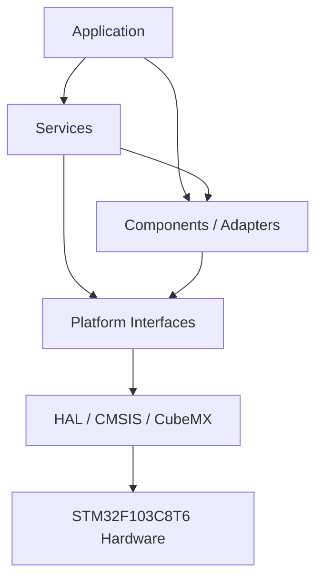
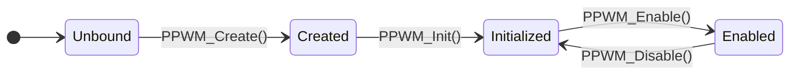
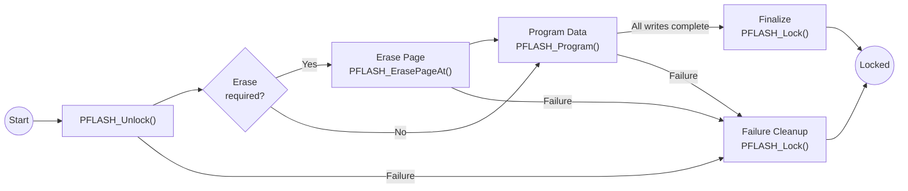

# Platform Interfaces

`Platforms/` defines the project-owned boundary between reusable firmware modules and the STM32F103C8T6 HAL, CMSIS definitions, generated peripheral handles and target-specific hardware registers.

The layer exposes only the low-level hardware capabilities currently required by the product:

- GPIO;
- I2C;
- PWM;
- millisecond/microsecond time access;
- internal Flash mechanics.

> [!IMPORTANT]
> Platform interfaces isolate **vendor mechanics**, not product policy. Lock behavior, credential rules, device protocols, retries, presentation behavior and application state remain above this layer.

> [!IMPORTANT]
> Public headers under `Platforms/Inc/` define the exact callable API. This README documents architecture, semantics and constraints without replacing the header contracts.

---

## Contents

1. [Purpose and Architectural Role](#1-purpose-and-architectural-role)
2. [Directory Structure](#2-directory-structure)
3. [Design Rules](#3-design-rules)
4. [Interface Summary](#4-interface-summary)
5. [GPIO Interface](#5-gpio-interface)
6. [I2C Interface](#6-i2c-interface)
7. [PWM Interface](#7-pwm-interface)
8. [Time Interface](#8-time-interface)
9. [Flash Interface](#9-flash-interface)
10. [Composition and Ownership](#10-composition-and-ownership)
11. [Blocking, Error and Concurrency Policy](#11-blocking-error-and-concurrency-policy)
12. [Current Constraints](#12-current-constraints)
13. [Documentation Authority](#13-documentation-authority)

---

## 1. Purpose and Architectural Role

### 1.1 Purpose

The Platform layer keeps STM32-specific types and operations out of reusable component and service contracts.

It translates project-owned operations into the current STM32F103 backend while preserving a narrow dependency direction:



A hardware-backed service may depend directly on a Platform interface when there is no meaningful reusable component boundary. Credential Storage is the current example:

```text
Credential Storage Service
        ↓
Flash Platform
        ↓
STM32 Flash HAL
```

Credential Storage owns record format and persistence policy; Flash Platform owns only target-specific Flash mechanics.

### 1.2 Current backend

The only implemented backend is:

**STM32F103C8T6 + STM32CubeF1 HAL/CMSIS**

The Platform boundary reduces coupling to that target, but the repository does not currently implement interchangeable backends.

SPI, UART, ADC, RTC and other hardware capabilities shall be added only when an actual product feature requires a Platform contract for them.

---

## 2. Directory Structure

```text
Platforms/
├── Inc/
│   ├── FLASH_Platform_Interface.h
│   ├── GPIO_Platform_Interface.h
│   ├── I2C_Platform_Interface.h
│   ├── PWM_Platform_Interface.h
│   └── Time_Platform_Interface.h
├── Src/
│   ├── FLASH_Platform_Interface.c
│   ├── GPIO_Platform_Interface.c
│   ├── I2C_Platform_Interface.c
│   ├── PWM_Platform_Interface.c
│   └── Time_Platform_Interface.c
└── README.md
```

The split is deliberate:

| Location | Responsibility |
| --- | --- |
| `Inc/` | project-owned public types, statuses and function declarations |
| `Src/` | STM32 HAL calls, native-context casts, register access and target-specific translation |

Reusable component public headers shall not require STM32 HAL types merely because their current implementation eventually reaches STM32 hardware.

---

## 3. Design Rules

The Platform layer owns:

- translation between project operations and STM32 HAL/CMSIS mechanics;
- project-owned status/result types at the hardware boundary;
- minimum native context required by stateful Platform handles;
- target-specific GPIO, I2C, PWM, Time and Flash behavior;
- argument/lifecycle validation implemented by each current interface;
- documentation of hardware constraints that affect correct callers.

The Platform layer does **not** own:

- product state;
- authentication or credential policy;
- lock/unlock authorization;
- door-interlock decisions;
- keyboard scan policy;
- LCD commands or PCF8574 mapping;
- LED effects or buzzer melodies;
- persistent record format;
- retry or recovery policy for higher-level modules;
- CubeMX pin mode, alternate-function or clock-tree configuration;
- RTOS tasks, queues, mutexes or scheduling;
- dynamic memory allocation.

### Dependency rule

```text
Higher-level module
       ↓
project-owned Platform API
       ↓
STM32-specific implementation
       ↓
HAL / CMSIS / registers
```

Reverse dependency is forbidden:

```text
Platform ─X→ Application policy
Platform ─X→ Lock Control
Platform ─X→ Credential semantics
HAL      ─X→ reusable component logic
```

Opaque native contexts are used where practical so generated STM32 handle types do not become part of reusable public contracts.

---

## 4. Interface Summary

| Interface | Public header | Current backend role | Principal consumers |
| --- | --- | --- | --- |
| GPIO | [`Inc/GPIO_Platform_Interface.h`](Inc/GPIO_Platform_Interface.h) | digital read/write through STM32 GPIO HAL | LEDs, keyboard GPIO adapter, Lock Actuator, Door Sensor, Exit Button |
| I2C | [`Inc/I2C_Platform_Interface.h`](Inc/I2C_Platform_Interface.h) | blocking master transfers through STM32 I2C HAL | PCF8574 |
| PWM | [`Inc/PWM_Platform_Interface.h`](Inc/PWM_Platform_Interface.h) | timer-channel output control and runtime frequency/duty configuration | Buzzer, LCD backlight adapter |
| Time | [`Inc/Time_Platform_Interface.h`](Inc/Time_Platform_Interface.h) | HAL millisecond tick and TIM2 microsecond counter | time-aware components and bounded protocol timing |
| Flash | [`Inc/FLASH_Platform_Interface.h`](Inc/FLASH_Platform_Interface.h) | STM32F1 internal Flash lock/erase/program/read/protection mechanics | Credential Storage Service |

The interfaces are synchronous. They create no worker task, completion queue or hidden synchronization object.

---

## 5. GPIO Interface

### 5.1 Contract

The GPIO interface represents one CubeMX-configured MCU pin through a project-owned `GPIO_Handle_t`.

The current API supports:

```c
GPIO_OpStatus_t PGPIO_Init     (GPIO_Handle_t* Instance, void* GPIO_Port, uint16_t GPIO_Pin);
GPIO_OpStatus_t PGPIO_Set      (GPIO_Handle_t* Instance);
GPIO_OpStatus_t PGPIO_Reset    (GPIO_Handle_t* Instance);
GPIO_OpStatus_t PGPIO_Toggle   (GPIO_Handle_t* Instance);
GPIO_Level_t    PGPIO_GetLevel (const GPIO_Handle_t* Instance);
```

| Operation | Meaning |
| --- | --- |
| `PGPIO_Init()` | bind a software handle to one already-configured physical pin |
| `PGPIO_Set()` | drive logical HIGH |
| `PGPIO_Reset()` | drive logical LOW |
| `PGPIO_Toggle()` | toggle the output latch |
| `PGPIO_GetLevel()` | sample the current electrical pin level |

GPIO mode, pull configuration, speed, output type, alternate function and startup level remain CubeMX responsibilities.

### 5.2 Pin representation

`PGPIO_Init()` currently expects:

```text
GPIO_Port → opaque pointer to the STM32 GPIO port
GPIO_Pin  → zero-based numeric pin index
```

For example:

```text
PA8 → GPIOA, 8U
```

The numeric index is converted internally to the STM32 bit mask:

```text
1U << GPIO_Pin
```

> [!WARNING]
> Do not pass `GPIO_PIN_x` as `GPIO_Pin`. The current interface expects the numeric index, not the HAL mask.

### 5.3 Result model

```text
GPIO_OPERATION_OK
GPIO_OPERATION_FAIL
```

GPIO reads additionally expose:

```text
GPIO_LEVEL_LOW
GPIO_LEVEL_HIGH
GPIO_LEVEL_UNKNOWN
```

Logical active-high/active-low interpretation belongs to the component using the GPIO, not to the Platform interface.

### 5.4 Current caller requirements

Callers shall:

- provide a valid native GPIO port;
- use a pin already configured by CubeMX;
- initialize the Platform handle before normal runtime operations;
- treat the handle's private members as implementation state.

The current implementation does not own or change the static hardware pin configuration.

---

## 6. I2C Interface

### 6.1 Contract

The I2C Platform API provides synchronous master transfers through an opaque native context.

```c
I2C_OpStatus_t PI2C_Write(
    void*    Context,
    uint8_t  Address,
    uint8_t* Data,
    uint16_t Size,
    uint32_t Timeout);

I2C_OpStatus_t PI2C_Read(
    void*    Context,
    uint8_t  Address,
    uint8_t* Data,
    uint16_t Size,
    uint32_t Timeout);
```

The public address is an **unshifted 7-bit slave address**.

The STM32 backend shifts that value for the HAL call.

```text
Platform caller
    ↓
7-bit address
    ↓
PI2C_*
    ↓
address << 1
    ↓
HAL_I2C_Master_*
```

### 6.2 Status translation

The Platform preserves the meaningful STM32 transport outcomes without exposing `HAL_StatusTypeDef`:

| HAL result | Platform result |
| --- | --- |
| `HAL_OK` | `I2C_OPERATION_OK` |
| `HAL_ERROR` | `I2C_OPERATION_ERROR` |
| `HAL_BUSY` | `I2C_OPERATION_BUSY` |
| `HAL_TIMEOUT` | `I2C_OPERATION_TIMEOUT` |
| unexpected value | `I2C_OPERATION_ERROR` |

The Platform reports the transport result only.

A component such as PCF8574 may translate or propagate that result. Product-level fault behavior remains an Application/Service concern.

### 6.3 Blocking behavior

Both transfers are blocking polling operations.

`Timeout` follows STM32 HAL millisecond semantics and shall be finite for normal product calls.

The Platform currently provides:

- no retry loop;
- no bus-recovery state machine;
- no DMA;
- no asynchronous completion;
- no Platform-owned mutex.

Those features should be introduced only if a concrete product requirement changes the existing synchronous ownership model.

---

## 7. PWM Interface

### 7.1 Contract

The PWM interface represents one timer channel through a project-owned `PWM_Handle_t`.

It supports:

- binding a handle to a timer/channel;
- initialization of the Platform runtime state;
- enable/disable;
- raw and percentage duty-cycle control;
- frequency updates;
- output polarity configuration;
- cached runtime queries.

The exact function signatures are maintained in [`PWM_Platform_Interface.h`](Inc/PWM_Platform_Interface.h).

### 7.2 Lifecycle



Expected sequence:

1. CubeMX configures and initializes the hardware timer.
2. `PPWM_Create()` binds the project handle to the generated native timer and selected channel.
3. `PPWM_Init()` completes Platform lifecycle initialization.
4. frequency, duty and polarity may be adjusted through the public API.
5. `PPWM_Enable()` and `PPWM_Disable()` control output generation.

### 7.3 Frequency model

For the current implementation:

```text
PWM frequency =
    timer clock / ((PSC + 1) * (ARR + 1))
```

Frequency changes preserve the current prescaler and modify the timer period.

> [!IMPORTANT]
> PWM frequency is a **timer-wide resource**. Channels belonging to the same hardware timer share the same period/frequency even though compare values are channel-specific.

The current product avoids a buzzer/backlight conflict by using separate timers:

```text
TIM3 → passive buzzer
TIM4 → LCD backlight
```

### 7.4 Duty behavior

Percentage duty requests are bounded to the valid percentage range and translated to the timer compare domain.

When frequency changes modify the available timer period, the implementation attempts to preserve the existing duty ratio within integer/timer resolution.

### 7.5 Target coupling

The public PWM channel enumerators currently follow the STM32 HAL channel representation.

Callers shall use the named `PWM_CHANNEL_*` values and shall not build logic around their numeric encodings.

This is a known portability limitation of the otherwise project-owned Platform boundary.

---

## 8. Time Interface

### 8.1 Contract

The Time Platform centralizes project access to:

- millisecond timestamps;
- microsecond timestamps;
- bounded millisecond delay;
- bounded microsecond delay.

```c
void     Platform_DelayMs   (uint32_t Delay);
void     Platform_DelayUs   (uint32_t Delay);
uint32_t Platform_GetMillis (void);
uint32_t Platform_GetMicros (void);
```

### 8.2 Current sources

| Operation | Current source | Blocking |
| --- | --- | ---: |
| `Platform_GetMillis()` | `HAL_GetTick()` | no |
| `Platform_DelayMs()` | HAL millisecond tick | yes |
| `Platform_GetMicros()` | TIM2 `CNT` | no |
| `Platform_DelayUs()` | TIM2 `CNT` elapsed-time busy wait | yes |

The current hardware baseline configures TIM2 as the raw microsecond counter used by this interface.

### 8.3 Usage rule

Timestamp reads are intended for elapsed-time state machines.

Blocking delays are allowed only for bounded low-level mechanics where the protocol itself requires them, such as peripheral initialization or controller command timing.

They shall **not** be used to implement:

- credential-entry timeout;
- lockout duration;
- door confirmation delay;
- LED effect timing;
- buzzer pattern timing;
- other human-scale application state dwell times.

Those behaviors belong to timestamp-driven cooperative state.

### 8.4 Microsecond counter constraint

`Platform_GetMicros()` exposes the raw TIM2 counter value.

Therefore callers of the microsecond API must respect the actual TIM2 counter width, period and wrap behavior configured for the target.

`Platform_DelayUs()` currently performs unsigned subtraction over those raw readings, so correctness across the hardware counter wrap depends on the configured counter domain.

This behavior should be explicitly validated before long or wrap-crossing microsecond intervals are relied upon.

---

## 9. Flash Interface

### 9.1 Contract

The Flash Platform exposes the target-specific internal-Flash mechanics required by Credential Storage.

It supports:

- Flash interface lock;
- Flash interface unlock;
- erase of the physical page containing an address;
- halfword, word and double-word programming requests;
- aligned 64-bit memory-mapped read;
- supported readout-protection configuration.

It deliberately does **not** own:

- the credential address;
- persistent record layout;
- marker/CRC format;
- credential validation;
- erase decision;
- transaction ordering;
- post-write record validation;
- wear policy;
- power-loss recovery policy.

Those responsibilities belong to Credential Storage Service.

### 9.2 Public API

```c
FLASH_OpStatus_t PFLASH_Lock           (void);
FLASH_OpStatus_t PFLASH_Unlock         (void);

FLASH_OpStatus_t PFLASH_SetProtection  (
    FLASH_ProtectionLevel_t ProtectionLevel);

FLASH_OpStatus_t PFLASH_ErasePageAt    (
    uint32_t Address);

FLASH_OpStatus_t PFLASH_Program        (
    FLASH_ProgramType_t ProgramType,
    uint32_t            Address,
    uint64_t            Data);

FLASH_OpStatus_t PFLASH_ReadDoubleWord (
    uint32_t  Address,
    uint64_t* Data);
```

The Platform returns only:

```text
FLASH_OPERATION_OK
FLASH_OPERATION_FAIL
```

Detailed storage meaning remains above this layer.

### 9.3 STM32F103C8T6 Flash geometry

The backend deliberately models the official STM32F103C8T6 64 KiB internal-Flash interval:

```text
0x08000000 .. 0x0800FFFF
```

Medium-density STM32F103 Flash uses 1 KiB physical erase pages.

The final page is:

```text
page 63
0x0800FC00 .. 0x0800FFFF
```

The active product linker script reserves that page for Credential Storage.

```text
Executable Flash     0x08000000 .. 0x0800FBFF
Credential Flash     0x0800FC00 .. 0x0800FFFF
```

This reservation is **not** Platform policy.

Flash Platform knows physical geometry; the linker and Credential Storage own the product allocation.

### 9.4 Erase behavior

`PFLASH_ErasePageAt(Address)` accepts an address inside the official Flash range and resolves the physical 1 KiB page containing it.

```text
arbitrary valid address
        ↓
containing page start
        ↓
erase one complete 1 KiB page
```

Higher layers shall never assume that a record-sized erase exists.

### 9.5 Programming rules

Supported Platform programming selectors are:

| Program type | Logical width | Required alignment |
| --- | ---: | ---: |
| `FLASH_PROGRAM_HALFWORD` | 2 bytes | 2 bytes |
| `FLASH_PROGRAM_WORD` | 4 bytes | 4 bytes |
| `FLASH_PROGRAM_DOUBLEWORD` | 8 bytes | 8 bytes |

Programming requires:

- an address within the supported Flash range;
- natural alignment for the selected operation;
- the Flash programming interface already unlocked;
- destination contents compatible with Flash one-to-zero programming rules.

Programming cannot restore a stored zero bit to one. An erase is required whenever the new value needs such a transition.

### 9.6 Transaction ownership

Flash Platform does not automatically perform the complete transaction.

A higher-level storage owner controls:



Once a storage transaction successfully unlocks Flash, it shall attempt to restore the locked state on every exit path.

Credential Storage currently owns that discipline.

### 9.7 Memory-mapped read

`PFLASH_ReadDoubleWord()` performs a volatile aligned 64-bit read from internal Flash.

Read access does not require the programming interface to be unlocked.

### 9.8 Readout protection

The Platform exposes the STM32F103 readout-protection levels required by the current backend.

Readout protection is a **provisioning/security operation**, not credential-storage policy.

Changing protection can have reset and destructive mass-erase consequences. Credential Storage therefore never enables or changes readout protection automatically.

---

## 10. Composition and Ownership

### 10.1 CubeMX owns static hardware configuration

[`../Electronic-Lock.ioc`](../Electronic-Lock.ioc) and generated `Core/` code own:

- GPIO mode, pull, speed and initial electrical state;
- peripheral clocks;
- alternate functions;
- I2C initialization;
- PWM timer base/channel initialization;
- TIM2 time-base configuration;
- generated native peripheral handles;
- NVIC configuration.

Platform code shall not silently duplicate static CubeMX configuration.

### 10.2 App Config owns native binding

The Application composition boundary is allowed to know both:

```text
CubeMX native object
        +
project-owned Platform contract
```

Examples:

```text
GPIOx + numeric pin index
        ↓
GPIO_Handle_t

&hi2c1
        ↓
I2C Context

&htim3 + PWM_CHANNEL_1
        ↓
buzzer PWM handle

&htim4 + PWM_CHANNEL_1
        ↓
backlight PWM handle
```

Reusable component drivers shall not search for global HAL handles themselves.

### 10.3 Ownership is the concurrency model

The current firmware is cooperative and serialized.

Each mutable peripheral path has one logical owner; Platform interfaces do not add hidden mutexes.

Examples:

| Resource | Current product ownership |
| --- | --- |
| I2C1 / PCF8574 / LCD | serialized application presentation path |
| TIM3 PWM | buzzer / Sound Generator path |
| TIM4 PWM | LCD backlight path |
| Door/LED/keyboard GPIO descriptors | owning component/service path |
| internal Flash erase/program | Credential Storage transaction |
| TIM2 time base | shared read-only time source; no runtime reconfiguration |

If a future design introduces concurrent writers, synchronization shall be designed at the ownership boundary that introduced that concurrency.

---

## 11. Blocking, Error and Concurrency Policy

### 11.1 Blocking behavior

| Operation | Blocking characteristic |
| --- | --- |
| GPIO read/write/toggle | no intentional wait |
| I2C read/write | synchronous / blocking until completion or timeout |
| PWM configuration/control | synchronous; no intentional wait |
| millisecond/microsecond timestamp read | no intentional wait |
| millisecond/microsecond delay | blocking busy wait |
| Flash read | synchronous memory-mapped read |
| Flash erase/program | synchronous / blocking hardware operation |
| Flash protection change | provisioning operation; may reset target |

The Platform boundary does not make a blocking peripheral operation non-blocking merely by hiding HAL.

Callers remain responsible for using each operation in a context compatible with the cooperative execution model.

### 11.2 Error ownership

The layered rule is:

```text
HAL result
   ↓
Platform status
   ↓
Component / Service result
   ↓
Application product policy
```

Platform code should translate hardware/vendor failure, not decide the product response.

Examples:

- I2C distinguishes transport error/busy/timeout;
- GPIO exposes operation failure or unknown input state;
- PWM reports operation failure;
- Flash reports operation success/failure.

Higher layers decide whether those outcomes mean retry, degraded behavior, safe recovery or critical fault.

### 11.3 ISR policy

The current mutable Platform APIs are not designed as ISR execution paths.

In particular:

- do not perform blocking I2C from ISR;
- do not perform Flash erase/program/protection from ISR;
- do not run application timing delays from ISR;
- do not use ISR callbacks to execute product policy.

Interrupt-backed product inputs capture minimal metadata at the component/application callback boundary and defer normal work to serialized runtime context.

### 11.4 No hidden synchronization

Platform interfaces do not create:

- mutexes;
- semaphores;
- queues;
- tasks;
- critical-section ownership protocols.

This is deliberate.

The current product obtains safe access through explicit application/service ownership rather than through defensive locking inside every low-level wrapper.

---

## 12. Current Constraints

The following limitations affect the current Platform implementation and are worth keeping visible.

### GPIO

- `PGPIO_Init()` expects a zero-based pin index rather than an STM32 `GPIO_PIN_x` mask.
- The implementation currently does not explicitly reject indexes greater than 15 before constructing the internal mask.
- `PGPIO_GetLevel()` rejects a null handle but currently relies on the caller lifecycle contract rather than validating `_initialized` before accessing the stored native context.

### I2C

- transfers are blocking;
- the Platform provides no DMA, asynchronous completion, retry or bus recovery;
- current argument validation is intentionally thin and callers must provide valid native context, buffer, size and 7-bit address;
- concurrent access is not serialized by the Platform.

### PWM

- public channel values currently mirror STM32 HAL channel encodings;
- frequency changes are timer-wide because ARR belongs to the timer, not an individual channel;
- the frequency-update model preserves PSC and changes ARR, so not every arbitrary frequency is representable;
- current timer-clock handling is tied to the STM32 backend and is not a portable clock-tree abstraction;
- cached per-handle state assumes disciplined ownership of the underlying timer.

The current product minimizes shared-timer concerns by placing buzzer and LCD backlight on different timers.

### Time

- the microsecond interface exposes raw TIM2 counter semantics;
- correctness across microsecond-counter wrap depends on the configured TIM2 domain and requires explicit target validation;
- `Platform_DelayMs()` and `Platform_DelayUs()` are busy waits and must remain restricted to bounded low-level use.

### Flash

- the backend is intentionally fixed to the official STM32F103C8T6 64 KiB Flash map and 1 KiB page geometry;
- erase granularity is one physical page;
- Platform failure status does not preserve detailed HAL error flags or failing-page diagnostics;
- the interface provides no wear leveling, journaling or transactional record policy;
- readout-protection configuration is target/provisioning-specific and not a normal runtime operation.

### Portability

The Platform boundary reduces direct STM32 coupling but has not yet been validated by a second MCU backend.

That is acceptable for the current project: the layer exists to establish clean dependency boundaries, not to claim unproven target independence.

---

## 13. Documentation Authority

This README documents the **architectural role and semantic constraints** of `Platforms/`.

It intentionally does not reproduce full Doxygen contracts for every function.

Use the following source-of-truth hierarchy:

| Information | Authoritative artifact |
| --- | --- |
| Exact public Platform signatures/types | headers under [`Inc/`](Inc) |
| STM32 backend behavior | implementations under [`Src/`](Src) |
| Physical pin/peripheral/clock configuration | [`../Electronic-Lock.ioc`](../Electronic-Lock.ioc) and generated CubeMX code |
| Product-side Platform bindings | [`../App/Config/Inc/App_Config.h`](../App/Config/Inc/App_Config.h) |
| Persistent Flash allocation | active linker script |
| Credential record and transaction policy | [`../Libs/Services/Credential_Storage/README.md`](../Libs/Services/Credential_Storage/README.md) |
| Component-specific Platform use | corresponding component README/header |
| Product architecture and execution model | root [`../README.md`](../README.md) and [`../App/README.md`](../App/README.md) |

The intended documentation split is:

```text
Platform README
    → why the boundary exists
    → major semantics
    → target-specific constraints

Platform public header
    → exact API contract

Platform source
    → STM32 implementation mechanics
```

When code and this README disagree, correct the documentation and implementation together rather than treating duplicated prose as an independent source of truth.

---

This module follows the project's [license terms](../LICENSE).
