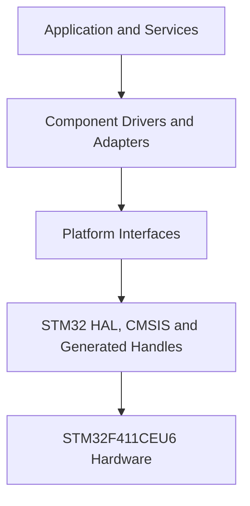
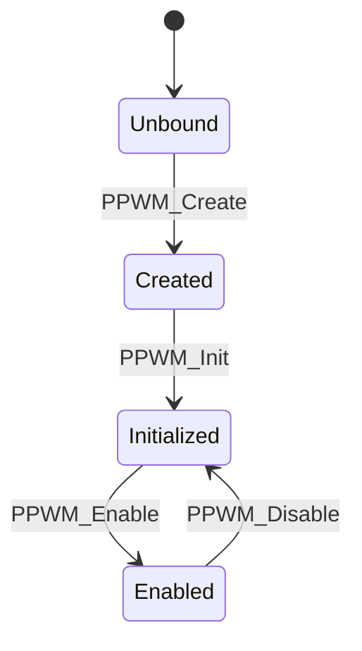
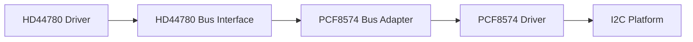

<h1 align="left">Platform Interfaces</h1>

<p align="left">
  <big>
    Project-owned boundary between portable firmware modules and the<br>
    STM32F411CEU6 HAL, generated peripheral handles and hardware registers.
  </big>
</p>

> [!IMPORTANT]
> The root [project README](../README.md) is the normative source for product
> scope and system architecture. This document defines the module-level
> contract of `Platforms/`. Public headers define the exact callable API; when
> documentation and code disagree, the public headers take precedence until
> both are corrected in the same change.

---

## Table of Contents

* [1. Overview](#1-overview)
  * [1.1 Purpose](#11-purpose)
  * [1.2 Current Scope](#12-current-scope)
* [2. Architectural Role](#2-architectural-role)
  * [2.1 Layer Placement](#21-layer-placement)
  * [2.2 Abstraction Boundary](#22-abstraction-boundary)
  * [2.3 Dependency Direction](#23-dependency-direction)
* [3. Directory Structure](#3-directory-structure)
* [4. Responsibilities](#4-responsibilities)
  * [4.1 Owned Responsibilities](#41-owned-responsibilities)
  * [4.2 Explicit Non-Responsibilities](#42-explicit-non-responsibilities)
* [5. Interface Summary](#5-interface-summary)
* [6. GPIO Platform Interface](#6-gpio-platform-interface)
  * [6.1 Contract](#61-contract)
  * [6.2 Data Model](#62-data-model)
  * [6.3 API](#63-api)
  * [6.4 Preconditions and Behavior](#64-preconditions-and-behavior)
* [7. I2C Platform Interface](#7-i2c-platform-interface)
  * [7.1 Contract](#71-contract)
  * [7.2 Status Translation](#72-status-translation)
  * [7.3 API](#73-api)
  * [7.4 Preconditions and Behavior](#74-preconditions-and-behavior)
* [8. PWM Platform Interface](#8-pwm-platform-interface)
  * [8.1 Contract](#81-contract)
  * [8.2 Data Model](#82-data-model)
  * [8.3 Lifecycle](#83-lifecycle)
  * [8.4 API](#84-api)
  * [8.5 Frequency and Duty-Cycle Rules](#85-frequency-and-duty-cycle-rules)
* [9. Time Platform Interface](#9-time-platform-interface)
  * [9.1 Contract](#91-contract)
  * [9.2 API](#92-api)
  * [9.3 Time-Base Requirements](#93-time-base-requirements)
* [10. Initialization and Ownership](#10-initialization-and-ownership)
  * [10.1 CubeMX Responsibilities](#101-cubemx-responsibilities)
  * [10.2 Application Composition](#102-application-composition)
  * [10.3 Runtime Ownership](#103-runtime-ownership)
* [11. Integration with Component Drivers](#11-integration-with-component-drivers)
  * [11.1 Current Consumers](#111-current-consumers)
  * [11.2 Adapter Boundary](#112-adapter-boundary)
* [12. Timing and Blocking Contracts](#12-timing-and-blocking-contracts)
* [13. Error Handling](#13-error-handling)
* [14. Concurrency and ISR Policy](#14-concurrency-and-isr-policy)
* [15. Composition Example](#15-composition-example)
* [16. Naming and Documentation Conventions](#16-naming-and-documentation-conventions)
  * [16.1 File and Symbol Names](#161-file-and-symbol-names)
  * [16.2 Public Header Documentation](#162-public-header-documentation)
  * [16.3 README Style](#163-readme-style)
* [17. Design Decisions](#17-design-decisions)
  * [17.1 Project-Owned Status Types](#171-project-owned-status-types)
  * [17.2 Opaque Native Contexts](#172-opaque-native-contexts)
  * [17.3 Synchronous I2C](#173-synchronous-i2c)
  * [17.4 Explicit PWM Handles](#174-explicit-pwm-handles)
  * [17.5 Centralized Time Access](#175-centralized-time-access)
  * [17.6 No Platform-Owned RTOS Objects](#176-no-platform-owned-rtos-objects)
* [18. Usage Constraints](#18-usage-constraints)
* [19. Testing and Validation](#19-testing-and-validation)
  * [19.1 GPIO](#191-gpio)
  * [19.2 I2C](#192-i2c)
  * [19.3 PWM](#193-pwm)
  * [19.4 Time](#194-time)
* [20. Known Limitations and Baseline Corrections](#20-known-limitations-and-baseline-corrections)
* [21. Future Improvements](#21-future-improvements)
* [22. License](#22-license)

---

## 1. Overview

### 1.1 Purpose

`Platforms/` isolates microcontroller-specific access from the component
drivers and all higher software layers. It exposes small project-owned
interfaces for the hardware capabilities required by the electronic lock and
translates those calls to the current STM32F411 backend.

The layer exists to keep vendor headers, HAL status codes, generated handle
types and direct peripheral-register access out of reusable component APIs.
It is a boundary, not a generic hardware framework.

### 1.2 Current Scope

The current platform layer provides four interfaces:

* GPIO digital write, toggle and level read;
* blocking I2C master transmit and receive;
* PWM channel creation, control and runtime configuration;
* millisecond and microsecond time services.

The only implemented backend is STM32F411CEU6 with STM32CubeF4 HAL/CMSIS and
CubeMX-generated peripheral handles. SPI, UART, ADC, flash, RTC and a second
MCU backend are not part of the current platform contract.

---

## 2. Architectural Role

### 2.1 Layer Placement



Component drivers depend on project-owned platform headers or on narrow
component interfaces implemented by adapters. They shall not include STM32
HAL headers directly.

### 2.2 Abstraction Boundary

Each platform module separates a public contract from a target-specific
implementation:

| Side | Location | Content |
|:---|:---|:---|
| Public contract | `Platforms/Inc/` | project-owned types, status values and function declarations |
| STM32 implementation | `Platforms/Src/` | HAL calls, native handle casts, register access and target-specific translation |

Opaque `void *` contexts allow the composition root to provide generated
native handles without making those native types part of most public APIs.
GPIO follows the same intent by accepting an opaque port pointer during
initialization and storing it inside its project-owned handle.

The public surface is intended to minimize target coupling. It does not yet
guarantee drop-in portability: the current PWM channel values mirror STM32 HAL
channel encodings and are tracked as portability debt.

### 2.3 Dependency Direction

The allowed dependency direction is:

```text
Application -> Services -> Components/Adapters -> Platform -> HAL/CMSIS
```

The following reverse dependencies are forbidden:

* platform modules depending on application or service logic;
* platform modules depending on product state or credentials;
* HAL/CMSIS code calling component or application modules;
* component public headers exposing `GPIO_TypeDef`, `I2C_HandleTypeDef`,
  `TIM_HandleTypeDef` or other vendor-owned types.

Only the application composition boundary may know both the generated native
handles and the portable modules that receive them.

---

## 3. Directory Structure

```text
Platforms/
├── Inc/
│   ├── GPIO_Platform_Interface.h
│   ├── I2C_Platform_Interface.h
│   ├── PWM_Platform_Interface.h
│   └── Time_Platform_Interface.h
├── Src/
│   ├── GPIO_Platform_Interface.c
│   ├── I2C_Platform_Interface.c
│   ├── PWM_Platform_Interface.c
│   └── Time_Platform_Interface.c
└── README.md
```

Public users include headers from `Inc/`. Target-specific includes and native
peripheral access belong in `Src/`.

---

## 4. Responsibilities

### 4.1 Owned Responsibilities

The platform layer owns:

* translation from project-owned operations to STM32 HAL/CMSIS operations;
* translation from HAL return values to project-owned status types;
* storage of the minimum native context required by a platform handle;
* validation of parameters and handle lifecycle where the current contract
  defines it;
* low-level GPIO, I2C, PWM and time mechanics;
* documentation of target-specific constraints that affect callers;
* preservation of the dependency boundary between components and vendor code.

### 4.2 Explicit Non-Responsibilities

The platform layer does not own:

* PIN validation, lock states, retry limits or security policy;
* keyboard scanning policy, key debouncing or key mapping;
* LCD commands, PCF8574 bit mapping or display rendering;
* LED patterns, buzzer melodies or backlight effects;
* task creation, queues, mutexes or scheduling policy;
* peripheral pin mode, alternate function, clock tree or NVIC configuration;
* retries and recovery decisions for higher-level device protocols;
* dynamic memory allocation;
* speculative support for peripherals or targets that the product does not
  currently use.

Those responsibilities remain with CubeMX, the application composition root,
component drivers, adapters, services or the lock controller as defined by the
root architecture.

---

## 5. Interface Summary

| Interface | Public header | Current STM32 backend | Primary consumers |
|:---|:---|:---|:---|
| GPIO | [`GPIO_Platform_Interface.h`](Inc/GPIO_Platform_Interface.h) | `HAL_GPIO_WritePin`, `HAL_GPIO_TogglePin`, `HAL_GPIO_ReadPin` | LED driver and matrix-keyboard GPIO adapter |
| I2C | [`I2C_Platform_Interface.h`](Inc/I2C_Platform_Interface.h) | blocking `HAL_I2C_Master_Transmit` and `HAL_I2C_Master_Receive` | PCF8574 driver |
| PWM | [`PWM_Platform_Interface.h`](Inc/PWM_Platform_Interface.h) | STM32 TIM HAL plus timer-register access | buzzer driver and HD44780 PWM backlight adapter |
| Time | [`Time_Platform_Interface.h`](Inc/Time_Platform_Interface.h) | HAL tick for milliseconds and TIM2 for microseconds | protocol initialization and time-aware component logic |

All four interfaces are synchronous. None creates a task, starts a scheduler,
allocates memory or serializes concurrent access.

---

## 6. GPIO Platform Interface

### 6.1 Contract

The GPIO interface represents one configured MCU pin with a project-owned
`GPIO_Handle_t`. The current operations are intentionally limited to basic
digital access:

* bind a handle to a native port and pin;
* drive the output HIGH;
* drive the output LOW;
* toggle the output;
* read the electrical level reported by the peripheral.

Pin mode, pull resistor, speed, output type and alternate-function setup are
outside this API and remain CubeMX responsibilities.

### 6.2 Data Model

| Type | Meaning |
|:---|:---|
| `GPIO_OpStatus_t` | `GPIO_OPERATION_OK` or `GPIO_OPERATION_FAIL` |
| `GPIO_Level_t` | `GPIO_LEVEL_LOW`, `GPIO_LEVEL_HIGH` or `GPIO_LEVEL_UNKNOWN` |
| `GPIO_Config_t` | opaque native port plus the stored STM32 pin mask |
| `GPIO_Handle_t` | GPIO configuration plus initialization state |

Members prefixed with `_` are private implementation state. Callers shall not
read or modify them directly.

### 6.3 API

```c
GPIO_OpStatus_t PGPIO_Init(
    GPIO_Handle_t *Instance,
    void *GPIO_Port,
    uint16_t GPIO_Pin);

GPIO_OpStatus_t PGPIO_Set(GPIO_Handle_t *Instance);
GPIO_OpStatus_t PGPIO_Reset(GPIO_Handle_t *Instance);
GPIO_OpStatus_t PGPIO_Toggle(GPIO_Handle_t *Instance);
GPIO_Level_t PGPIO_GetLevel(const GPIO_Handle_t *Instance);
```

| Function | Result |
|:---|:---|
| `PGPIO_Init` | binds a software handle to one already-configured hardware pin |
| `PGPIO_Set` | writes logical HIGH |
| `PGPIO_Reset` | writes logical LOW |
| `PGPIO_Toggle` | inverts the current output latch |
| `PGPIO_GetLevel` | reads the actual pin level and may differ from the last value written |

### 6.4 Preconditions and Behavior

For the current STM32 backend:

* `GPIO_Port` shall point to a valid STM32 `GPIO_TypeDef` instance;
* `GPIO_Pin` is a zero-based pin index from `0` through `15`, not a
  `GPIO_PIN_x` bit mask;
* `PGPIO_Init` converts that index to the STM32 mask `1U << GPIO_Pin`;
* CubeMX shall configure the pin before `PGPIO_Init` is called;
* write and toggle operations reject a null or uninitialized handle;
* all operations require a valid initialized handle, including
  `PGPIO_GetLevel`.

> [!WARNING]
> Passing `GPIO_PIN_x` as the `GPIO_Pin` argument is invalid for the current
> implementation because the function expects the numeric pin index. For
> example, use `12U` for PA12, not `GPIO_PIN_12`.

---

## 7. I2C Platform Interface

### 7.1 Contract

The I2C interface provides blocking master transfers through an opaque native
context. It does not expose an I2C handle type because the current PCF8574 path
only needs two stateless operations.

The current STM32 implementation:

* uses 7-bit slave addresses at the public boundary;
* shifts the address left once before calling STM32 HAL;
* performs synchronous polling transfers;
* interprets `Timeout` in milliseconds, following STM32 HAL semantics;
* returns a project-owned status rather than `HAL_StatusTypeDef`.

### 7.2 Status Translation

| STM32 HAL result | Platform result |
|:---|:---|
| `HAL_OK` | `I2C_OPERATION_OK` |
| `HAL_ERROR` | `I2C_OPERATION_ERROR` |
| `HAL_BUSY` | `I2C_OPERATION_BUSY` |
| `HAL_TIMEOUT` | `I2C_OPERATION_TIMEOUT` |
| any unexpected value | `I2C_OPERATION_ERROR` |

The platform reports the transport result. A component driver decides whether
to propagate, translate or recover from that result; the application decides
the product-level fault response.

### 7.3 API

```c
I2C_OpStatus_t PI2C_Write(
    void *Context,
    uint8_t Address,
    uint8_t *Data,
    uint16_t Size,
    uint32_t Timeout);

I2C_OpStatus_t PI2C_Read(
    void *Context,
    uint8_t Address,
    uint8_t *Data,
    uint16_t Size,
    uint32_t Timeout);
```

| Parameter | Contract |
|:---|:---|
| `Context` | valid initialized `I2C_HandleTypeDef *` supplied as `void *` |
| `Address` | unshifted 7-bit slave address |
| `Data` | valid transmit or receive buffer for the requested size |
| `Size` | number of bytes to transfer; shall be nonzero for product calls |
| `Timeout` | finite per-call timeout in milliseconds |

### 7.4 Preconditions and Behavior

The current implementation forwards arguments directly to STM32 HAL after the
address conversion. It does not validate `Context`, `Data` or `Size` before
the HAL call. Valid arguments are therefore mandatory caller preconditions.

Product runtime calls shall use a bounded timeout. The architecture baseline
sets `20 ms` as the maximum normal I2C transaction timeout; the platform API
does not clamp a larger value automatically.

No platform-level retries, bus recovery, mutexes, DMA transfers or interrupt
callbacks are implemented. Adding any of those behaviors requires an explicit
architecture decision because they change timing and ownership contracts.

---

## 8. PWM Platform Interface

### 8.1 Contract

The PWM interface represents one logical PWM output channel backed by an STM32
timer. It supports:

* binding a project-owned handle to a native timer and channel;
* synchronizing the handle with the current timer configuration;
* idempotent enable and disable operations;
* raw compare-value and percentage duty-cycle control;
* frequency updates that preserve the current prescaler;
* active-polarity control;
* cached state queries.

CubeMX remains responsible for GPIO alternate functions, timer clock enable,
base timer mode and initial PWM channel configuration.

### 8.2 Data Model

| Type | Values or purpose |
|:---|:---|
| `PWM_OpStatus_t` | `PWM_OPERATION_OK`, `PWM_OPERATION_FAIL` |
| `PWM_Channel_t` | `PWM_CHANNEL_1` through `PWM_CHANNEL_4` |
| `PWM_Polarity_t` | `PWM_POLARITY_HIGH`, `PWM_POLARITY_LOW` |
| `PWM_State_t` | `PWM_STATE_ENABLED`, `PWM_STATE_DISABLED` |
| `PWM_Handle_t` | native context plus channel, polarity, duty, maximum duty, frequency and lifecycle state |

`PWM_Handle_t::Ctx` contains the native timer handle as an opaque pointer.
Members prefixed with `_` are private and shall be accessed only through the
public API.

The numeric values of `PWM_Channel_t` currently match STM32 HAL `TIM_CHANNEL_x`
encodings. Callers shall use the named enumerators and shall not depend on their
numeric representation.

### 8.3 Lifecycle



The required sequence is:

1. CubeMX-generated initialization configures and initializes the timer.
2. `PPWM_Create` binds the project handle and reads current timer configuration
   values.
3. `PPWM_Init` marks the handle ready for runtime operations.
4. Duty, frequency and polarity may be configured through the public API.
5. `PPWM_Enable` starts output generation when the product needs it.
6. `PPWM_Disable` stops output generation and is safe to call repeatedly.

Runtime calls before a successful `PPWM_Init` fail, except for the creation
step itself.

### 8.4 API

```c
PWM_OpStatus_t PPWM_Create(
    PWM_Handle_t *Instance,
    void *Context,
    PWM_Channel_t Channel);

PWM_OpStatus_t PPWM_Init(PWM_Handle_t *Instance);
PWM_OpStatus_t PPWM_Enable(PWM_Handle_t *Instance);
PWM_OpStatus_t PPWM_Disable(PWM_Handle_t *Instance);

PWM_OpStatus_t PPWM_SetDutyVal(
    PWM_Handle_t *Instance,
    uint16_t Duty);

PWM_OpStatus_t PPWM_SetDutyPercent(
    PWM_Handle_t *Instance,
    uint16_t Duty_Percent);

uint16_t PPWM_GetDutyVal(const PWM_Handle_t *Instance);
uint16_t PPWM_GetDutyPercent(const PWM_Handle_t *Instance);
uint16_t PPWM_GetMaxDuty(const PWM_Handle_t *Instance);

PWM_OpStatus_t PPWM_SetFrequency(
    PWM_Handle_t *Instance,
    uint32_t Frequency);

uint32_t PPWM_GetFrequency(const PWM_Handle_t *Instance);

PWM_OpStatus_t PPWM_SetPolarity(
    PWM_Handle_t *Instance,
    PWM_Polarity_t Polarity);

PWM_Polarity_t PPWM_GetPolarity(const PWM_Handle_t *Instance);
PWM_State_t PPWM_GetState(const PWM_Handle_t *Instance);
```

| Operation group | Behavior |
|:---|:---|
| Create and initialize | bind context/channel, inspect hardware and enable platform operations |
| Enable and disable | call STM32 HAL only when a state transition is required |
| Duty setters | clamp out-of-range input and update the channel compare register |
| Duty getters | return the cached value or percentage represented by the current handle |
| Frequency setter | update timer ARR, issue an update event and preserve duty ratio |
| Polarity setter | update the channel polarity bit and cached state |
| State getters | report the handle's cached configuration and running state |

### 8.5 Frequency and Duty-Cycle Rules

The current frequency calculation is:

```text
PWM frequency = timer clock / ((PSC + 1) * (ARR + 1))
```

`PPWM_SetFrequency` preserves `PSC` and modifies only `ARR`. The requested
frequency is rejected when it is zero, greater than the assumed timer clock,
or not representable with the current prescaler and a 16-bit period. After an
ARR update, the compare value is recalculated with integer arithmetic to
preserve the previous duty ratio as closely as timer resolution permits.

The following timer-wide rule is mandatory:

> [!WARNING]
> Channels on the same hardware timer share one frequency. Changing the
> frequency through one `PWM_Handle_t` affects every channel on that timer,
> even though each channel has an independent compare value and polarity.

The V1 allocation avoids a buzzer/backlight conflict by using TIM3 for the
passive buzzer and TIM4 for the LCD backlight PWM path.

Duty percentages above `100` are clamped to `100`. Raw values above the
current ARR-derived maximum are clamped to that maximum. Getter value `0` may
mean either a valid zero configuration or an invalid/uninitialized handle;
callers shall use lifecycle discipline and operation results rather than treat
all zero getter values as faults.

---

## 9. Time Platform Interface

### 9.1 Contract

The time interface centralizes timestamp and short delay access so component
modules do not call HAL tick functions or timer registers directly.

It exposes two distinct operation classes:

* non-blocking timestamp reads used for elapsed-time comparisons;
* blocking delays allowed only for bounded low-level initialization or
  protocol timing.

Application behavior, state dwell times, LED patterns, buzzer sequences and
lock timing shall use timestamp-driven state machines or RTOS scheduling, not
the blocking delay functions.

### 9.2 API

```c
void Platform_DelayMs(uint32_t Delay);
uint32_t Platform_GetMillis(void);

void Platform_DelayUs(uint32_t Delay);
uint32_t Platform_GetMicros(void);
```

| Function | Current source | Behavior |
|:---|:---|:---|
| `Platform_DelayMs` | HAL system tick | busy-waits for the requested milliseconds |
| `Platform_GetMillis` | `HAL_GetTick()` | returns the current 32-bit millisecond tick |
| `Platform_DelayUs` | TIM2 counter | busy-waits for the requested counter interval |
| `Platform_GetMicros` | `htim2.Instance->CNT` | returns the current TIM2 counter value |

### 9.3 Time-Base Requirements

Correct millisecond operation requires a running HAL tick with a 1 ms base.
Correct microsecond operation requires TIM2 to:

* be initialized before the first time call;
* run continuously;
* increment exactly once per microsecond;
* provide a wrap model compatible with unsigned elapsed-time subtraction;
* remain reserved for the platform time base.

The microsecond requirements are not fully satisfied by the current baseline;
see [Section 20](#20-known-limitations-and-baseline-corrections) before relying
on `Platform_DelayUs` across a counter wrap.

---

## 10. Initialization and Ownership

### 10.1 CubeMX Responsibilities

[`Electronic-Lock.ioc`](../Electronic-Lock.ioc) and generated `Core/` code own:

* GPIO mode, pull, speed, output type and initial electrical level;
* I2C timing, addressing mode, peripheral clock and pin alternate functions;
* PWM timer prescalers, periods, output channels and alternate functions;
* TIM2 time-base configuration;
* peripheral clock enable and generated native handles;
* NVIC configuration where interrupts are actually used.

Platform code shall not silently duplicate or override static CubeMX
configuration unless a public runtime operation explicitly requires it.

### 10.2 Application Composition

The application composition root owns construction and dependency injection.
It may include both generated peripheral declarations and platform headers,
then bind:

* generated `GPIOx` ports and numeric pin indexes to `GPIO_Handle_t` objects;
* `hi2c1` to the PCF8574 transport path;
* `htim3` and its configured channel to the buzzer PWM handle;
* `htim4` and its configured channel to the LCD backlight PWM handle;
* project-owned handles and adapter operations to component instances.

No component driver shall discover global HAL handles by itself.

### 10.3 Runtime Ownership

| Resource | V1 runtime owner | Rule |
|:---|:---|:---|
| keyboard row/column GPIO handles | Matrix Keyboard Task | no concurrent use by Application Task |
| I2C1 and PCF8574/LCD path | Application Task | one owner; no platform mutex required |
| status LED GPIO handles | Application Task | effects advance from application events/time |
| TIM3 buzzer PWM | Application Task | no direct access from other tasks or ISR |
| TIM4 backlight PWM | Application Task | no direct access from other tasks or ISR |
| TIM2 and HAL time reads | read-only multi-context access where safe | no module may reconfigure the time base |

Ownership is the primary concurrency mechanism. If a future design introduces
multiple writers to one peripheral, its synchronization and failure behavior
shall be designed above the platform layer before the ownership rule changes.

---

## 11. Integration with Component Drivers

### 11.1 Current Consumers

| Component or adapter | Platform dependency | Integration purpose |
|:---|:---|:---|
| [LED driver](../Libs/Components/Led/README.md) | GPIO and time | active-level output and time-aware blinking |
| [Matrix Keyboard GPIO Scan Adapter](../Libs/Components/MatrixKeyboard/README.md) | GPIO | column drive and row sampling |
| Matrix Keyboard driver | time | scan and debounce timing |
| [PCF8574 driver](../Libs/Components/PCF8574/README.md) | I2C | expander byte transfers |
| [HD44780 driver](../Libs/Components/HD44780/README.md) | time | bounded controller protocol delays |
| HD44780 PCF8574 Bus Adapter | PCF8574 component | converts LCD bus operations to expander writes |
| [Buzzer driver](../Libs/Components/Buzzer/README.md) | PWM | tone frequency, duty and output state |
| HD44780 PWM Backlight Adapter | PWM | converts normalized backlight level to PWM duty |

The table describes the intended dependency path. Component-specific details
belong in each component README and public header.

### 11.2 Adapter Boundary

An adapter is used when a component contract is narrower or semantically
different from the raw platform capability. For example:



This prevents the HD44780 core driver from depending on an I2C expander and
prevents the keyboard core driver from depending directly on STM32 GPIO.

Adapters shall translate mechanics only. They shall not own product state,
tasks, queues or user-visible policy.

---

## 12. Timing and Blocking Contracts

| Operation | Blocking | Normal runtime rule |
|:---|:---:|:---|
| GPIO set/reset/toggle/read | no intentional wait | permitted in the owning task |
| I2C read/write | yes | Application Task only; finite timeout, normally no more than `20 ms` per transaction |
| PWM control/configuration | no intentional wait | Application Task only; keep updates bounded |
| millisecond timestamp read | no | permitted for elapsed-time checks |
| microsecond timestamp read | no | permitted only after the TIM2 baseline is corrected and validated |
| millisecond/microsecond delay | yes, busy wait | bounded component protocol/init timing only |

The platform layer does not make blocking calls non-blocking merely by hiding
HAL. Callers shall preserve the execution-model contract defined by the root
README.

Elapsed-time checks shall use unsigned subtraction:

```c
if ((uint32_t)(now - started_at) >= interval)
{
    /* Interval elapsed. */
}
```

This pattern is wrap-safe only when the timestamp source and subtraction width
represent the same natural counter domain. The current TIM2 configuration does
not yet meet that requirement for microsecond timing.

---

## 13. Error Handling

Platform functions follow three error-reporting forms:

| Interface | Error form | Caller behavior |
|:---|:---|:---|
| GPIO | `GPIO_OPERATION_FAIL` or `GPIO_LEVEL_UNKNOWN` | reject invalid setup; component translates only when needed |
| I2C | explicit `OK`, `ERROR`, `BUSY`, `TIMEOUT` | preserve meaningful transport failure for component/application policy |
| PWM | `PWM_OPERATION_FAIL`; default getter values | trust lifecycle and setter results; do not infer validity from a getter alone |
| Time | no status return | startup validation and configuration correctness are mandatory |

Rules:

* the platform translates vendor status, not product policy;
* platform code shall not retry indefinitely;
* blocking operations shall always have a finite bound;
* component drivers may map platform failures to component-owned statuses;
* the application decides retry, degraded behavior, fault state or safe output;
* errors shall never be silently converted into successful product behavior.

Initialization failures shall leave actuators and user outputs in their
CubeMX-defined safe startup state and shall prevent dependent runtime behavior
from starting.

---

## 14. Concurrency and ISR Policy

Platform interfaces provide no internal locking and are not generally
reentrant. Safe use relies on the ownership table in Section 10.

The following rules apply:

* one task owns each mutable peripheral and its platform handle;
* a platform handle shall not be mutated concurrently;
* I2C and PWM calls shall not run from ISRs in V1;
* platform callbacks shall not call application logic;
* an ISR, if later introduced for wake-up, shall capture minimal information
  and defer all device work to a task;
* timestamp reads may be shared only when the underlying counter read is safe
  and no caller can reconfigure the source;
* adding DMA or interrupt-driven transfers requires an explicit completion,
  buffer-lifetime and ownership contract.

Platform-level mutexes shall not be added merely as defensive wrappers. If
ownership changes, synchronization belongs in the architecture that introduced
the shared resource.

---

## 15. Composition Example

The following example belongs at the STM32 application composition boundary.
It demonstrates native-handle injection without exposing those types through a
component public API.

```c
#include <stdbool.h>

#include "gpio.h"
#include "i2c.h"
#include "tim.h"

#include "GPIO_Platform_Interface.h"
#include "I2C_Platform_Interface.h"
#include "PWM_Platform_Interface.h"
#include "Time_Platform_Interface.h"

static GPIO_Handle_t red_led_gpio = {0};
static PWM_Handle_t buzzer_pwm = {0};

bool AppPlatform_Init(void)
{
    if (PGPIO_Init(&red_led_gpio, GPIOA, 12U) != GPIO_OPERATION_OK)
    {
        return false;
    }

    if (PPWM_Create(&buzzer_pwm, &htim3, PWM_CHANNEL_1) !=
        PWM_OPERATION_OK)
    {
        return false;
    }

    if (PPWM_Init(&buzzer_pwm) != PWM_OPERATION_OK)
    {
        return false;
    }

    if (PPWM_SetDutyPercent(&buzzer_pwm, 50U) != PWM_OPERATION_OK)
    {
        return false;
    }

    return true;
}
```

The exact GPIO port, pin index, timer and channel shall match
[`Electronic-Lock.ioc`](../Electronic-Lock.ioc) and the generated headers. The
example does not replace board-specific mapping constants in the composition
module.

For I2C, the injected context remains the generated handle and the public
address remains unshifted:

```c
uint8_t output_state = 0U;

I2C_OpStatus_t status = PI2C_Write(
    &hi2c1,
    0x27U,
    &output_state,
    1U,
    20U);
```

In normal product code, the PCF8574 driver owns this transport call; the
application shall not bypass the component driver to write the expander.

---

## 16. Naming and Documentation Conventions

### 16.1 File and Symbol Names

New platform modules shall follow the established pattern unless a repository-
wide refactor changes it consistently:

| Element | Pattern | Example |
|:---|:---|:---|
| Public header | `<Peripheral>_Platform_Interface.h` | `GPIO_Platform_Interface.h` |
| Implementation | `<Peripheral>_Platform_Interface.c` | `GPIO_Platform_Interface.c` |
| Operation prefix | `P<PERIPHERAL>_` | `PGPIO_Set`, `PI2C_Read`, `PPWM_Enable` |
| Public type | descriptive PascalCase plus `_t` | `GPIO_Handle_t`, `PWM_OpStatus_t` |
| Enumeration value | uppercase domain and meaning | `I2C_OPERATION_TIMEOUT` |
| Opaque native pointer | `Context` or `Ctx` as already established by that API | `void *Context` |
| Private handle member | leading underscore | `_initialized`, `_frequency` |

Do not introduce abbreviations that are not already standard for the
peripheral or project. Existing public names are compatibility contracts;
renaming them requires updating every caller and the relevant documentation in
the same change.

### 16.2 Public Header Documentation

Public headers shall use technical English and Doxygen-compatible comments.
For every public function, document:

* one concise `@brief` statement;
* behavior and side effects in `@details` when they are not obvious;
* every parameter and its units or representation;
* lifecycle and configuration preconditions;
* every meaningful return value;
* blocking behavior and timeout units;
* shared-resource or timer-wide effects;
* target-specific limitations that change correct caller behavior.

Documentation shall describe implemented behavior, not hypothetical DMA,
interrupt or multi-target variants. Private helpers may be documented when
their arithmetic or register behavior is non-obvious.

### 16.3 README Style

Platform documentation follows the repository standard:

* technical English;
* numeric major and subsection headings;
* a navigable table of contents;
* `---` separators primarily between major numbered topics;
* tables for exact mappings and ownership rules;
* code blocks for public signatures and short integration examples;
* explicit sections for responsibilities, constraints, testing and known
  limitations;
* relative links to source files, component READMEs and the root architecture;
* concise statements that distinguish current behavior from future work.

Clarity and verifiability take precedence over abstraction vocabulary.

---

## 17. Design Decisions

### 17.1 Project-Owned Status Types

Vendor return codes stop at the platform boundary. This keeps components from
depending on STM32 HAL and gives each interface only the result states its
callers need.

### 17.2 Opaque Native Contexts

Generated handle types are injected as `void *` at the composition boundary
and interpreted only by the target implementation. This is sufficient for the
current single-target project without introducing function tables or a runtime
backend registry.

### 17.3 Synchronous I2C

The LCD path is owned by one Application Task, transfers are short and a finite
timeout is mandatory. A synchronous API is therefore simpler and adequate for
V1. DMA or asynchronous completion would add lifecycle and concurrency costs
without a demonstrated current need.

### 17.4 Explicit PWM Handles

PWM retains channel configuration and cached runtime state, so it uses a
project-owned handle and a creation/initialization lifecycle. Separate TIM3 and
TIM4 allocation prevents buzzer frequency changes from altering backlight PWM.

### 17.5 Centralized Time Access

Time access is project-owned so reusable components do not depend on HAL tick
or a specific timer symbol. Blocking delay functions remain narrowly scoped to
protocol mechanics; they are not an application scheduling mechanism.

### 17.6 No Platform-Owned RTOS Objects

V1 achieves concurrency safety through explicit peripheral ownership. Keeping
tasks, queues and mutexes out of the platform layer preserves deterministic
module boundaries and avoids hidden blocking.

---

## 18. Usage Constraints

1. Initialize CubeMX-generated peripherals before constructing platform
   handles.
2. Pass only valid native contexts that match the concrete STM32 backend.
3. Use a numeric zero-based index with `PGPIO_Init`; do not pass a pin mask.
4. Use unshifted 7-bit addresses with `PI2C_Read` and `PI2C_Write`.
5. Keep every runtime I2C timeout finite and within the architecture bound.
6. Call `PPWM_Create` and `PPWM_Init` before any other PWM operation.
7. Treat PWM frequency as a timer-wide property.
8. Do not access private handle members directly.
9. Do not call mutable I2C or PWM operations concurrently or from an ISR.
10. Do not use blocking platform delays to implement product behavior.
11. Do not reconfigure TIM2 after the microsecond time base starts.
12. Do not include STM32 HAL headers in component public interfaces.
13. Do not add an abstraction until a real component or second backend needs
    the corresponding capability.

---

## 19. Testing and Validation

Platform verification shall combine contract tests with target measurements.

### 19.1 GPIO

* reject null setup and uninitialized write handles;
* verify index-to-mask mapping for pins `0` through `15`;
* verify set, reset and toggle electrical output;
* verify input reads report LOW/HIGH and invalid use is handled safely.

### 19.2 I2C

* verify a public 7-bit address is shifted exactly once;
* verify all HAL statuses map to the correct platform status;
* verify timeout units and the `20 ms` product bound at call sites;
* exercise PCF8574 success, NACK/error, busy and timeout paths on target.

### 19.3 PWM

* verify create/init lifecycle and invalid-handle rejection;
* verify enable/disable idempotence;
* verify duty clamping at `0`, `100%`, ARR and above-range inputs;
* verify requested versus measured frequency on TIM3 and TIM4;
* verify duty-ratio preservation after frequency changes;
* verify polarity and shared-timer effects;
* verify safe output state after disable and failed initialization.

### 19.4 Time

* verify millisecond elapsed-time behavior across HAL tick wrap;
* verify TIM2 counter frequency with a logic analyzer or reference timer;
* verify microsecond delays below, at and across the configured counter wrap;
* verify initialization order and continuous time-base operation;
* verify blocking delays are absent from product-level state/effect code.

Host fakes are appropriate only where they test a project-owned contract
without reproducing STM32 HAL internals. Register timing, alternate functions,
clock-tree behavior and electrical output require target tests.

---

## 20. Known Limitations and Baseline Corrections

The following items describe the repository baseline and shall be resolved or
consciously accepted before the affected capability is treated as production-
ready:

1. **TIM2 configuration mismatch:** `Electronic-Lock.ioc` currently records a
   TIM2 prescaler of `999`, while generated `Core/Src/tim.c` configures `99`.
   At the current 100 MHz timer-clock assumption, only `99` produces a 1 MHz
   counter. Regenerate or reconcile the project so `.ioc` and generated code
   have one authoritative value.
2. **TIM2 wrap contract:** TIM2 currently uses period `0xFFFF`. The
   microsecond delay implementation subtracts 32-bit readings as if the source
   wrapped naturally at `2^32`; it is therefore not correct when the 16-bit
   configured period wraps. Correct the time-base period or implement
   wrap-aware elapsed-time accumulation before relying on this API.
3. **PWM clock assumption:** the PWM backend uses
   `HAL_RCC_GetSysClockFreq()` as the timer input clock. It does not derive the
   real APB clock and timer multiplier for the selected instance.
4. **PWM range:** frequency updates preserve PSC, change ARR only and limit ARR
   to 16 bits. Some otherwise valid frequencies are not representable.
5. **PWM shared state:** one handle updates a timer-wide ARR without
   synchronizing cached frequency/maximum-duty fields in other handles bound
   to the same timer. V1 avoids this for buzzer and backlight by assigning
   separate timers.
6. **PWM channel portability:** public channel enumerator values currently
   mirror STM32 HAL encodings. A second backend would require an explicit
   translation layer or a compatible contract revision.
7. **GPIO read validation:** `PGPIO_GetLevel` currently rejects a null handle
   but does not check `_initialized` before dereferencing the stored native
   port. Callers must pass an initialized handle; the implementation should be
   strengthened to return `GPIO_LEVEL_UNKNOWN` safely.
8. **GPIO pin representation:** the API name `GPIO_Pin` can be confused with
   STM32 pin masks, while the implementation expects a zero-based index. This
   README states the current contract; the header and validation should make
   it unambiguous and reject indexes above `15`.
9. **I2C argument validation:** the current I2C functions do not reject null
   contexts, null buffers, zero sizes or addresses outside the 7-bit range
   before calling HAL.
10. **Getter ambiguity:** several PWM getters return `0` or a default enum when
    a handle is invalid, and those values may also represent valid state. A
    future API revision may use status plus output parameters.
11. **PWM lifecycle validation:** `PPWM_Create` does not safely reject every
    invalid channel before dereferencing resolved timer registers, and
    `PPWM_Init` does not verify that creation succeeded. Polarity input is also
    not range-checked. The required lifecycle remains a caller precondition
    until these checks are strengthened.
12. **PWM creation-state decoding:** `PPWM_Create` casts the raw STM32 CCER
    polarity mask directly to `PWM_Polarity_t` instead of normalizing it to
    `PWM_POLARITY_LOW`, and initializes the cached running state to disabled
    without reading the hardware channel-enable state.
13. **PWM frequency/duty accuracy:** frequency is cached as the requested value
    even when integer ARR quantization produces a different actual frequency.
    The duty-refresh arithmetic also requires correction and boundary tests,
    including protection against a zero previous period.
14. **Time prototype strictness:** the public time header currently declares
    `Platform_GetMillis()` and `Platform_GetMicros()` with old-style empty
    parameter lists, while the definitions take `void`. The header declarations
    should use `(void)` to restore full C prototype checking.
15. **Single target:** there is no interchangeable backend or host platform
    implementation. The public boundary reduces coupling but has not yet been
    proven by a second target.
16. **Build-configuration parity:** Debug currently includes project `App`,
    `Libs` and `Platforms` sources, while Release configuration requires
    reconciliation before it can serve as an equivalent product build.

These are concrete engineering constraints, not reasons to add a broad
framework. Corrections should remain local and testable.

---

## 21. Future Improvements

Improvements shall be driven by validated product or test needs. The current
priority order is:

1. reconcile TIM2 `.ioc` and generated configuration;
2. make microsecond elapsed-time behavior correct across wrap;
3. strengthen GPIO and I2C validation without changing successful-call
   semantics;
4. strengthen PWM lifecycle validation and correct state decoding/duty refresh;
5. derive PWM timer clocks from the actual instance and RCC configuration;
6. normalize time getter declarations to strict `(void)` prototypes;
7. make PWM getters return explicit validity where compatibility permits;
8. reconcile Debug and Release source inclusion;
9. add focused host fakes only for component tests that need deterministic
   GPIO, I2C, PWM or time behavior;
10. separate target-specific source directories only when a second backend is
   actually introduced.

SPI, UART, ADC, asynchronous I2C and DMA support shall be added only when an
approved product capability requires them. A future backend shall preserve the
documented public semantics or introduce an explicit versioned contract change.

---

## 22. License

This module is distributed under the repository [MIT License](../LICENSE).
