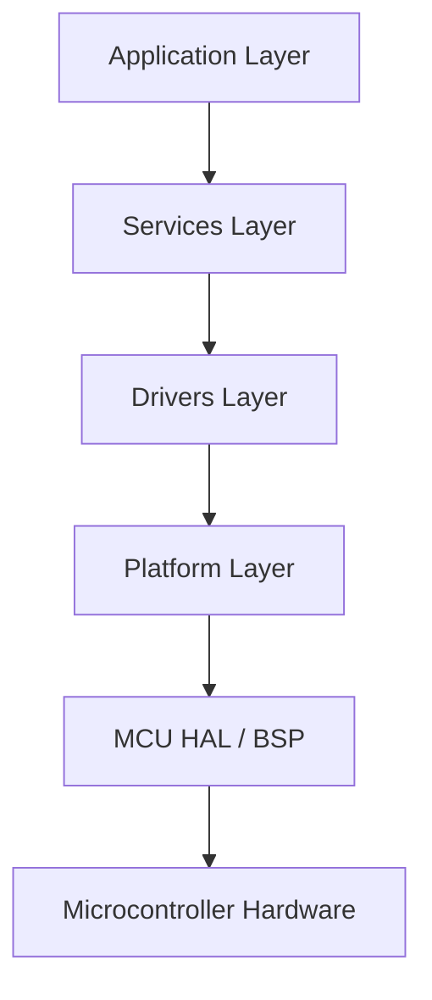
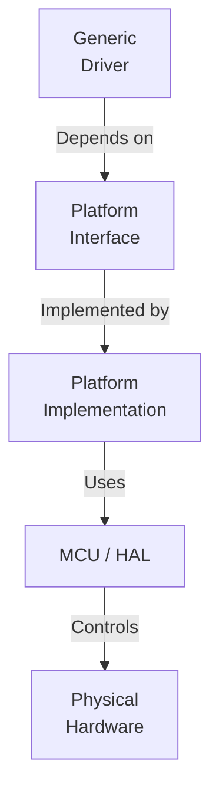
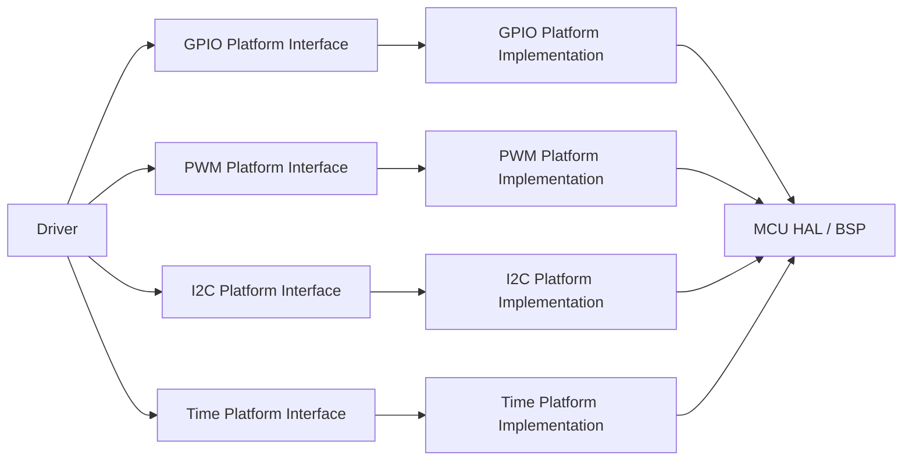
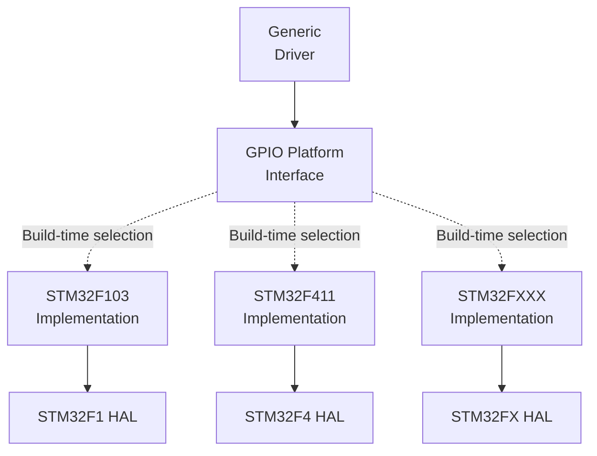
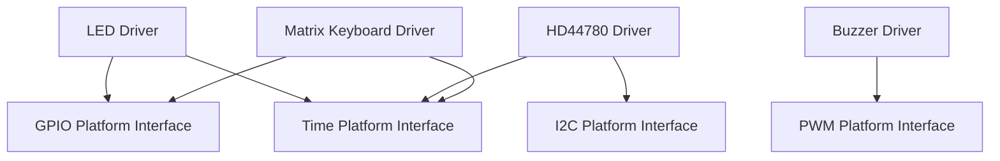
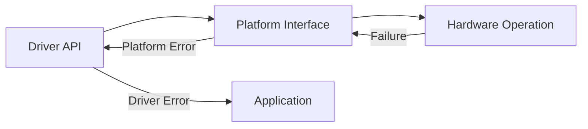
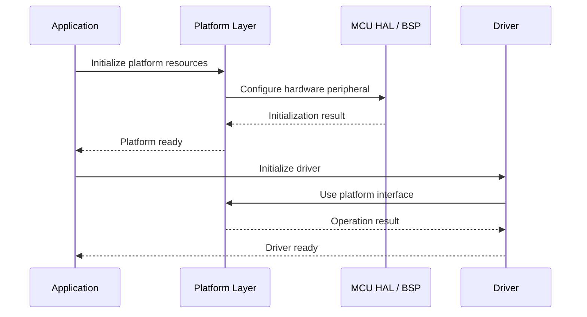
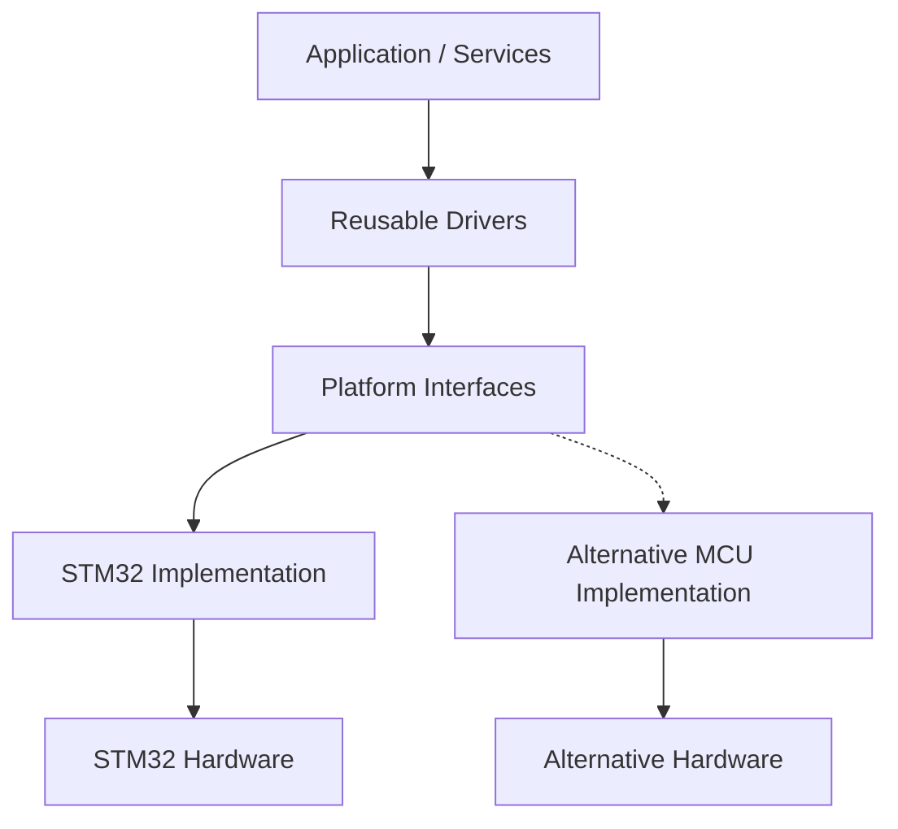
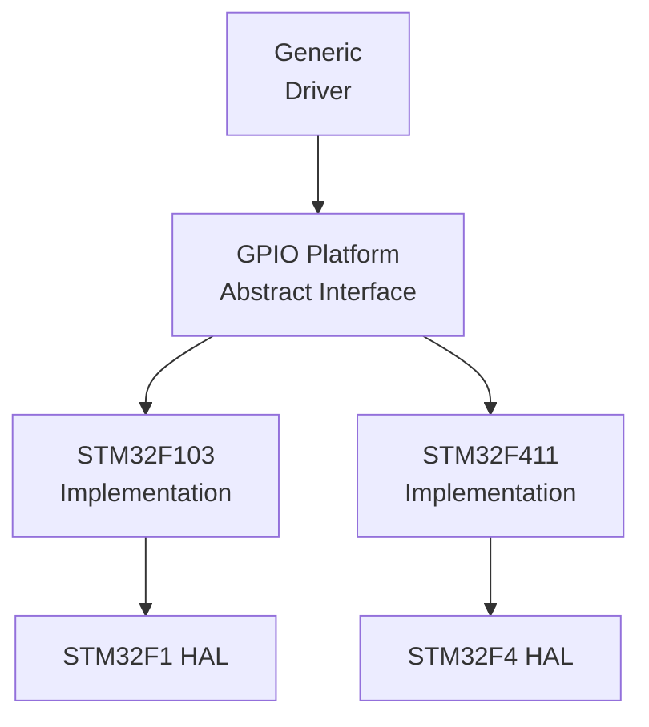

# Platform Layer

## Overview

- The Platform Layer provides the hardware and system abstraction required by the Drivers Layer and higher software layers.
- Its primary purpose is to isolate hardware-specific implementation details from reusable driver logic.
- Platform interfaces define hardware-independent contracts for operations such as GPIO control, PWM generation, timing and communication peripherals.
- The concrete platform implementation is responsible for connecting these abstractions to the underlying microcontroller, HAL, BSP or hardware-specific mechanism.
- The Platform Layer therefore establishes the architectural boundary between reusable software components and hardware-dependent implementation.

---

## Purpose

The Platform Layer establishes the boundary between reusable software and hardware-specific implementation.

Its main responsibilities are:

* Abstract hardware-specific operations.
* Provide stable interfaces for reusable drivers.
* Encapsulate MCU and HAL dependencies.
* Prevent drivers from directly accessing hardware-specific APIs.
* Provide consistent interfaces for common hardware resources.
* Centralize hardware-dependent adaptations.
* Enable future portability across different MCU families and hardware platforms.

The Platform Layer is the lowest software abstraction layer above the hardware and MCU-specific implementation.

---

## Architecture

The overall project architecture follows the dependency direction shown below:



The dependency direction is intentionally one-way.

Higher-level software components depend on lower-level abstractions, while hardware-specific implementation details remain isolated at the bottom of the architecture.

---

## Platform Abstraction Model

The Platform Layer is intended to provide hardware-independent interfaces consumed by reusable drivers.

The interface defines **what operation is available**, while the platform implementation defines **how that operation is performed on the target hardware**.



This separation prevents the Driver Layer from depending directly on MCU-specific APIs.

The Platform Interface therefore acts as the hardware abstraction contract between the reusable driver and the concrete hardware implementation.

---

## Responsibilities

### Platform Layer Responsibilities

The Platform Layer is responsible for:

* Defining hardware abstraction interfaces.
* Providing platform-specific implementations.
* Translating generic operations into MCU-specific operations.
* Managing dependencies on HAL, BSP and MCU-specific APIs.
* Providing access to hardware resources.
* Translating lower-level hardware failures into platform-level operation statuses.
* Maintaining the abstraction boundary between drivers and hardware.

### Platform Layer Non-Responsibilities

The Platform Layer shall not implement application behavior or product-level logic.

It should not be responsible for:

* User interface behavior.
* Application state machines.
* Business rules.
* Access-control logic.
* Product-specific workflows.
* Coordination between multiple drivers.
* Application-level decisions.

These responsibilities belong to higher layers, primarily Services and Application.

---

## Interfaces

Platform interfaces define the contracts consumed by the Drivers Layer.

Typical platform interfaces include:

| Interface                | Responsibility                                 |
| ------------------------ | ---------------------------------------------- |
| GPIO Platform Interface  | Abstract GPIO input and output operations.     |
| PWM Platform Interface   | Abstract PWM generation and configuration.     |
| I2C Platform Interface   | Abstract I2C communication.                    |
| SPI Platform Interface   | Abstract SPI communication.                    |
| UART Platform Interface  | Abstract UART communication.                   |
| Time Platform Interface  | Provide system time and timing operations.     |

The exact set of interfaces depends on the hardware capabilities and requirements of the project.

---

## Dependency Direction

Platform dependencies shall always point toward the hardware-specific implementation.



The Driver Layer therefore remains independent from the concrete MCU implementation.

---

## Hardware Independence

One of the primary objectives of the Platform Layer is to prevent hardware-specific dependencies from propagating upward through the architecture.

Without a platform abstraction, a driver could directly depend on MCU-specific APIs:

```text
Driver
   |
   +--> STM32 HAL
   |
   +--> MCU-specific registers
```

With the Platform Layer:

```text
Driver
   |
   +--> Platform Interface
             |
             +--> Platform Implementation
                        |
                        +--> STM32 HAL
```

The Platform Layer provides the boundary required to isolate these implementation details.

---

## Interface and Implementation Separation

The current Platform Layer establishes the architectural boundary required to isolate drivers from hardware-specific implementation details.

However, the current version does **not yet implement a fully abstract Platform Interface with interchangeable implementations**.

The current architecture can be evolved toward a model in which a single hardware-independent interface is implemented by different target-specific source files and selected during the build process.

For example, the intended future structure for a GPIO platform could be:

```text id="p7j2kq"
GPIO_Platform_Interface.h
        |
        +-- GPIO_STM32F103.c
        +-- GPIO_STM32F411.c
        +-- GPIO_ESP32.c
```

In this model, `GPIO_Platform_Interface.h` would define the hardware-independent contract consumed by the Drivers Layer, while each `.c` file would provide a concrete implementation for a specific target platform.

The build configuration would select the implementation corresponding to the target hardware.



The important architectural objective is that the Driver Layer should depend only on the hardware-independent contract and should not require knowledge of the selected target implementation.

For a given firmware target, only the corresponding platform implementation would be compiled and linked.

For example:

```text id="9xw0cq"
STM32F103 build
    GPIO_Platform_Interface.h
            +
    GPIO_STM32F103.c
```

or:

```text id="fhf7s4"
STM32F411 build
    GPIO_Platform_Interface.h
            +
    GPIO_STM32F411.c
```

This approach would allow the same Driver Layer to be reused across different hardware platforms without modifying the driver source code, provided that each implementation satisfies the same interface contract.

The current Platform Layer should therefore be understood as **the foundation for this abstraction**, rather than as a fully implemented interchangeable platform architecture.

The introduction of a truly abstract interface and multiple target-specific implementations is identified as a future architectural improvement.

---

## Platform Interfaces and Drivers

Drivers consume Platform Interfaces rather than concrete hardware implementations.

For example:



This allows multiple drivers to reuse the same platform abstraction.

The Platform Interface therefore becomes shared infrastructure rather than a driver-specific implementation.

---

## Adapter Pattern

When a hardware peripheral does not directly match the abstraction expected by a driver, an adapter can translate between the generic platform interface and the concrete hardware implementation.


The adapter is responsible for translating the generic operation into the specific sequence required by the underlying hardware.

This approach is particularly useful when the same logical peripheral can be implemented through different hardware resources.

---

## Error Handling

Platform interfaces provide operation status information to their consumers.

A platform operation should communicate whether the requested hardware operation was successfully executed.



Hardware-specific error details should remain encapsulated within the Platform Layer unless higher-level handling requires them.

Drivers may translate platform-level failures into their own public status model.

---

## Initialization Responsibility

Platform resources must be initialized and configured before the corresponding driver is used.

A typical initialization sequence is:



The Platform Layer is responsible for making the required hardware resources available.

The Driver Layer is responsible for configuring and managing the logical peripheral behavior built on top of those resources.

---

## Usage Constraints

### Hardware Configuration

The hardware resources required by a Platform Interface must be configured before they are consumed by a driver.

For example, a GPIO platform handle must reference a valid and correctly configured GPIO resource before being passed to a driver.

### HAL Dependency

Concrete platform implementations may depend on the MCU HAL, BSP or low-level peripheral implementation.

These dependencies shall remain inside the Platform Layer.

Drivers should not bypass the Platform Layer to access these dependencies directly.

### Interface Stability

Platform Interfaces should remain stable whenever possible.

Changes to a platform implementation should not require changes to drivers unless the hardware-independent contract itself changes.

### Hardware Ownership

The Platform Layer owns the hardware-specific implementation details.

Drivers consume platform resources but should not assume knowledge of:

* MCU register layout.
* HAL implementation details.
* Peripheral clock configuration.
* GPIO register operations.
* Hardware-specific interrupt mechanisms.
* MCU-specific peripheral initialization sequences.

---

## Applications

The Platform Layer is used whenever reusable software components require access to hardware or system resources without becoming coupled to a specific hardware implementation.

Typical use cases include:

* GPIO-controlled devices.
* PWM-controlled actuators.
* I2C peripherals.
* SPI peripherals.
* UART communication.
* System timing.
* Delay operations.
* Hardware migration.
* Support for multiple MCU families.
* Hardware abstraction for reusable drivers.

The intended architecture allows the same driver implementation to be reused with different platform implementations as long as the required platform contract remains compatible.



---

## Design Decisions

### Hardware Abstraction Boundary

The Platform Layer is intentionally positioned between reusable drivers and hardware-specific implementation.

This prevents MCU-specific dependencies from propagating into the Drivers, Services and Application layers.

### Interface-Based Architecture

Platform resources are conceptually exposed through hardware-independent interfaces.

The interface represents the contract required by the driver, while the implementation is responsible for adapting that contract to the target hardware.

### Hardware-Specific Code Isolation

MCU-specific code, HAL dependencies and hardware adaptation logic are kept inside the Platform Layer.

This provides a clear location for hardware-dependent changes.

### Reusable Drivers

Drivers are designed to consume Platform Interfaces instead of directly consuming MCU peripherals.

This allows the same driver implementation to remain independent from the underlying hardware implementation.

### Separation of Concerns

The Platform Layer is responsible for **hardware access**, while Drivers are responsible for **peripheral behavior**.

For example:

```text
Platform:
    "Set this GPIO output."

Driver:
    "Turn this LED on."

Service:
    "Indicate that authentication failed."

Application:
    "Handle the authentication workflow."
```

Each layer therefore operates at a different level of abstraction.

### Explicit Abstraction Boundaries

The Platform Layer establishes an explicit architectural boundary between reusable software and hardware-specific implementation.

This boundary is intended to reduce coupling, improve testability and simplify future hardware changes.

---

## Limitations

The current Platform Layer does not automatically make the complete system portable.

Portability still depends on:

* The completeness of the platform interfaces.
* The assumptions made by drivers.
* Hardware-specific timing requirements.
* Peripheral capabilities of the target MCU.
* Differences between hardware implementations.
* Availability of equivalent resources on the target platform.
* The consistency of platform implementations.

The current implementation may still contain platform-specific assumptions inside individual platform modules.

The abstraction should therefore be considered an architectural boundary that can be progressively strengthened as the project evolves.

---

## Future Improvements

### Fully Abstract Platform Interfaces

Introduce a fully abstract platform interface model in which the public Platform Interface header defines only the hardware-independent contract, while target-specific implementations are provided through separate source files.

For example:

```text
GPIO_Platform_Interface.h
        |
        +-- GPIO_STM32F103.c
        +-- GPIO_STM32F411.c
        +-- GPIO_ESP32.c
```

This would allow the Driver Layer to depend exclusively on the platform contract while the concrete implementation is selected according to the target hardware.



The implementation could be selected at build time, allowing the same Driver Layer to be compiled against different target platforms without changing the driver source code.

### Function Table / Polymorphic Interface

For cases where runtime implementation selection or stronger dependency inversion is required, a function-pointer based interface can be introduced.

A conceptual model would be:

```text
Platform Interface
        |
        +-- Handle / Context
        |
        +-- Operation Table
                |
                +-- Read()
                +-- Write()
                +-- Configure()
                +-- ...
```

This would provide a C-compatible mechanism for dependency injection and alternative platform implementations.

However, this mechanism should only be introduced where its additional complexity provides a concrete architectural benefit.

### Platform Mocks

Introduce mock implementations of Platform Interfaces to enable driver unit testing without physical hardware.

```text
Driver
   |
   +--> Platform Interface
            |
            +--> Real Hardware Implementation
            |
            +--> Mock Implementation
```

This would allow hardware-independent verification of driver behavior.

### Multiple MCU Families

Extend the Platform Layer to support multiple MCU families while maintaining the same hardware-independent contracts.

Potential targets include:

* STM32F1.
* STM32F4.
* Other ARM Cortex-M devices.
* ESP32-based platforms.

The goal is not to hide every hardware difference, but to provide stable abstractions for capabilities that can meaningfully be shared.

### Standardized Platform Status Model

Establish a consistent status model across platform interfaces to simplify error propagation and handling between Platform and Driver layers.

### Resource Ownership Model

Define explicit ownership rules for platform resources such as GPIOs, timers, communication peripherals and interrupts.

This becomes increasingly important as multiple drivers and Services share the same hardware resources.

---

## Design Principle

The fundamental principle of the Platform Layer is:

> **Higher-level software should depend on hardware capabilities, not hardware implementations.**

The intended dependency chain is:

```text
Application
     ↓
Services
     ↓
Drivers
     ↓
Platform Interfaces
     ↓
Platform Implementations
     ↓
MCU HAL / BSP
     ↓
Hardware
```

This separation provides the foundation required for reusable drivers, testable Services and maintainable embedded-system architectures.

---
## License

This module is part of the 
```text
Electronic Lock Project 
```
and follows the project's license terms.
