# STM32F411-Based Electronic Lock

Hardware-independent, event-driven electronic lock firmware built for the
STM32F411CEU6 using STM32CubeIDE, the STM32 HAL and FreeRTOS.

> [!IMPORTANT]
> This document is the normative architecture baseline for the project. It
> defines the V1 product scope, dependency rules, execution model, module
> boundaries, state machines and safety invariants that shall govern the
> implementation. Code changes shall conform to this baseline. Architecture
> changes shall update this document before or together with the affected code.

---

## Document Control

| Field | Value |
| --- | --- |
| Project | STM32F411-Based Electronic Lock |
| Product baseline | V1 - functional and reliable engineering prototype |
| Architecture baseline | 1.0 |
| Architecture status | Frozen for V1 implementation |
| Target MCU | STM32F411CEU6, Arm Cortex-M4F |
| Development environment | STM32CubeIDE and STM32CubeMX |
| MCU support package | STM32CubeF4 HAL/CMSIS |
| Execution model | FreeRTOS, event-driven application with deterministic periodic input acquisition |
| Memory policy | Static allocation; no application-owned dynamic allocation |
| Primary UI | 4x4 matrix keyboard, 16x2 LCD, status LEDs and passive PWM buzzer |
| Credential model | Fixed six-digit development PIN compiled into firmware |
| Last architecture update | 2026-08-12 |

### Authority and Conflict Resolution

The project contains code, module documentation, STM32CubeMX configuration and
historical architecture references. When two sources disagree, use the
following authority order:

1. This root `README.md` defines product scope and software architecture.
2. Public module headers define the exact API contract implemented by a module.
3. `Electronic-Lock.ioc` defines the intended MCU peripheral and pin
   configuration.
4. Component and Platform READMEs describe module-specific behavior.
5. Source files define the current implementation state.
6. Documents under `References/` provide historical context and requirements
   traceability, but do not override this baseline.

The original [Architecture V1 reference](References/Architecture/Architecture-V1.pdf)
remains the source of the V1 functional scope and safety intent. Its former
STM32F103 and superloop assumptions are superseded by the STM32F411 and FreeRTOS
decisions recorded here.

This baseline also consolidates the later *Electronic Lock - High-Level /
Low-Level Architecture Reference* supplied during the architecture review. Its
FreeRTOS guidance - periodic keyboard acquisition, event-driven application
behavior, semantic inter-task messages and non-blocking effects - is resolved
here into concrete V1 decisions. This README is self-contained and does not
require that external review artifact to implement the project.

---

## Table of Contents

1. [Project Objective](#project-objective)
2. [Engineering Principles](#engineering-principles)
3. [V1 Product Scope](#v1-product-scope)
4. [System Context](#system-context)
5. [Hardware Baseline](#hardware-baseline)
6. [Software Architecture](#software-architecture)
7. [Low-Level Architecture](#low-level-architecture)
8. [High-Level Architecture](#high-level-architecture)
9. [FreeRTOS Execution Model](#freertos-execution-model)
10. [Application Event Model](#application-event-model)
11. [Electronic Lock State Machine](#electronic-lock-state-machine)
12. [End-to-End Behavior](#end-to-end-behavior)
13. [Timing and Blocking Contracts](#timing-and-blocking-contracts)
14. [Initialization and Safe Startup](#initialization-and-safe-startup)
15. [Error, Fault and Security Policy](#error-fault-and-security-policy)
16. [Power Management Architecture](#power-management-architecture)
17. [Configuration and Ownership](#configuration-and-ownership)
18. [Repository Organization](#repository-organization)
19. [Documentation Standard](#documentation-standard)
20. [Verification Strategy](#verification-strategy)
21. [MVP Development Sequence](#mvp-development-sequence)
22. [Architecture Governance](#architecture-governance)
23. [Current Project Status](#current-project-status)

---

## Project Objective

The V1 firmware shall implement a deterministic and testable electronic lock
that:

- starts and remains in a safe locked condition after power-on or reset;
- accepts a six-digit PIN using a 4x4 matrix keyboard;
- masks the entered credential on a 16x2 character LCD;
- authenticates the candidate credential against a fixed development PIN;
- energizes the lock actuator only after successful authentication;
- automatically returns the actuator to its safe state after a bounded time;
- provides non-blocking visual and audible feedback;
- temporarily blocks authentication after repeated failures;
- contains peripheral failures without compromising the actuator safe state;
- keeps application policy independent from STM32 HAL and hardware details.

This is an engineering prototype, not a certified physical-security product.
The fixed firmware credential, absence of tamper protection and absence of a
mechanical door-position sensor are explicit V1 limitations.

---

## Engineering Principles

### Separation of Time, Behavior and Hardware

The architecture separates three concerns:

- **FreeRTOS determines when code executes.**
- **The application and services determine what the product does.**
- **Drivers and Platform interfaces determine how hardware is controlled.**

FreeRTOS is an execution mechanism, not a business-logic layer. A software
module does not receive a dedicated task merely because it exists.

### Dependency Direction

Dependencies shall point from higher-level policy toward lower-level
capabilities. Lower layers shall never depend on product workflow.

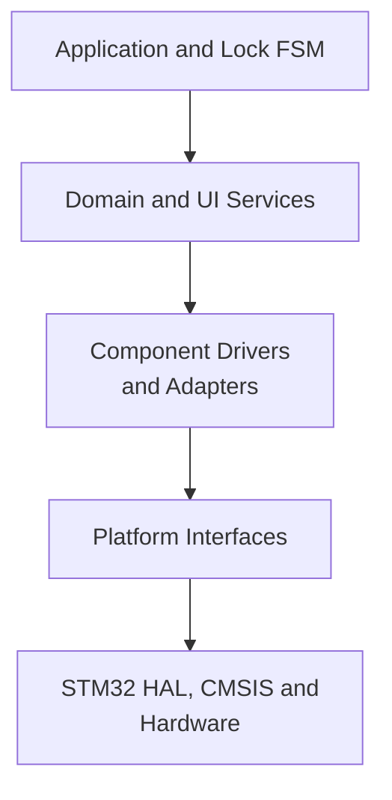

### Non-Blocking Product Behavior

Human-scale durations shall be represented by state and timestamps. Credential
timeouts, LED effects, sound patterns, lockout duration and unlock duration
shall never be implemented as blocking delays.

Short hardware protocol delays are permitted only when required by the
electrical protocol and when their worst-case duration is bounded. The HD44780
enable pulse and instruction execution waits are examples of bounded low-level
delays.

### Controlled Complexity

An abstraction, task, queue or interface shall exist only when it:

- protects a required variation;
- defines ownership or a stable contract;
- isolates hardware or vendor dependencies;
- improves host-side testability;
- or satisfies a demonstrated timing/concurrency requirement.

The V1 architecture deliberately avoids one task per service, speculative
plugin systems, dynamic polymorphism and generalized resource managers.

### Explicit Ownership

Every mutable state and hardware resource shall have one owner. Data may cross
execution contexts only through documented RTOS communication mechanisms.
Shared mutable globals are not an accepted synchronization strategy.

### Static Memory

Application objects, driver handles, task stacks, queues and RTOS control
blocks shall use static allocation. The V1 application shall not use `malloc`,
`free` or application-owned heap allocation.

---

## V1 Product Scope

### Included

- STM32F411CEU6 as the main controller.
- 4x4 matrix keyboard directly connected to MCU GPIOs.
- HD44780-compatible 16x2 LCD in 4-bit mode.
- PCF8574 I/O expander dedicated to the LCD data/control bus.
- PWM-controlled LCD backlight.
- Fixed six-digit PIN compiled into firmware configuration.
- Numeric input through keys `0` to `9`.
- Credential confirmation through `#`.
- Credential clear/cancel through `*`.
- Masked credential rendering; raw PIN digits shall never be displayed.
- Input timeout and automatic credential erasure.
- Three consecutive invalid attempts followed by a temporary lockout.
- Red/blue status indication through non-blocking LED patterns.
- Audible key, success, denial and lockout feedback.
- Timed lock-actuator command with a redundant local safety deadline.
- FreeRTOS execution with deterministic keyboard acquisition.
- Host-side unit tests for pure services and state machines.
- Target integration tests for peripherals, timing and fail-safe behavior.

### Explicitly Excluded

- User-configurable PIN.
- Flash, EEPROM or external credential persistence.
- Multiple users, permissions or access history.
- Bluetooth, Wi-Fi, cloud, mobile application or remote control.
- RFID, NFC, biometrics or external identity providers.
- Cryptographic credential storage or physical extraction resistance.
- Mechanical door/trinco position sensing.
- OTA, custom bootloader or remote firmware update.
- Product certification or functional-safety certification.
- A universal framework for arbitrary locks or user-interface devices.

### Initial V1 Parameters

These values are the initial architecture contracts. They may be tuned only
after measurement and shall remain centralized in application configuration.

| Parameter | Initial value | Contract |
| --- | ---: | --- |
| PIN length | 6 digits | Fixed for V1 |
| Credential-entry timeout | 15 s | Restarted after each accepted digit |
| Unlock duration | 3 s | Must remain below the actuator thermal limit |
| Maximum failed attempts | 3 | Consecutive; successful authentication resets the counter |
| Lockout duration | 30 s | Credential input is ignored while active |
| Keyboard task period | 1 ms | Stable periodic acquisition using `vTaskDelayUntil()` |
| Keyboard debounce interval | 40 ms | Timestamp-based; adjustable after hardware measurement |
| Application heartbeat | 10 ms | Maximum nominal interval between service/deadline updates |
| I2C transaction timeout | 20 ms maximum | No unbounded polling or retry loop |
| Application event queue | 8 entries initially | Occupancy shall be measured during integration |

The actual credential value shall not be documented, logged or committed to a
public repository. A demonstration credential shall never be reused as a real
security credential.

---

## System Context

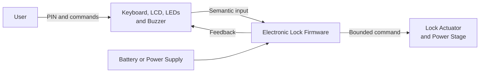

### Actors and Boundaries

| Actor or subsystem | Interaction | V1 boundary |
| --- | --- | --- |
| User | Enters PIN, confirms, cancels and observes feedback | Cannot configure credentials |
| Firmware | Applies access policy and commands the actuator | Knows commanded state, not mechanical state |
| Lock mechanism | Converts the electrical command into mechanical action | No feedback sensor in V1 |
| Power source | Supplies MCU, UI and actuator | Brownout/reset shall lead to a safe output |
| Developer | Programs, diagnoses and validates the target | Debug interface is not a user interface |

---

## Hardware Baseline

### MCU and Clock

- MCU: STM32F411CEU6.
- Core: Arm Cortex-M4F.
- System clock: 100 MHz.
- STM32 HAL and CMSIS are generated/managed through STM32CubeIDE.
- The hardware configuration source is `Electronic-Lock.ioc`.

### Peripheral Allocation

| Resource | Assignment | Owner |
| --- | --- | --- |
| GPIO PA0-PA3 | Matrix keyboard rows 3-0 | Keyboard Task through Matrix Keyboard stack |
| GPIO PA4-PA7 | Matrix keyboard columns 3-0 | Keyboard Task through Matrix Keyboard stack |
| GPIO PA12 | Red status LED | Status Indication Service through LED Driver |
| GPIO PA15 | Blue status LED | Status Indication Service through LED Driver |
| GPIO PB8 | Lock actuator command | Lock Control Service through Lock Actuator Driver |
| I2C1 PB6/PB7 | PCF8574 LCD bus at Fast Mode | Display Render Service through LCD stack |
| TIM2 | Microsecond time base | Time Platform Interface |
| TIM3 CH1 PB4 | Passive buzzer PWM | Sound Generator Service through Buzzer Driver |
| TIM4 CH4 PB9 | LCD backlight PWM | Display Render Service through Backlight Adapter |
| GPIO PC13 | On-board diagnostic LED | Platform/diagnostic use only |

### Electrical Safety Assumptions

- The lock output shall have a hardware-defined safe level.
- PB8 shall be driven to the safe level before application initialization.
- The power stage shall include the protection required by the selected load,
  including flyback protection for an inductive actuator.
- The actuator supply shall not inject reset-inducing noise into the MCU.
- Firmware deadlines supplement hardware protection; they do not replace it.
- Without a position sensor, `LOCKED` and `UNLOCKED` describe commanded states,
  never confirmed mechanical states.

### Hardware Decisions Still Required

| Decision | Required before |
| --- | --- |
| Exact actuator and electrical safe polarity | Lock Actuator Driver implementation |
| Actuator current and maximum continuous energization | Final unlock-duration validation |
| Power-stage schematic and flyback strategy | Hardware integration |
| PCF8574 I2C address and backpack pin mapping verification | LCD integration release |
| Battery chemistry, voltage range and sensing circuit | Power Management implementation |

---

## Software Architecture

### Layer Model

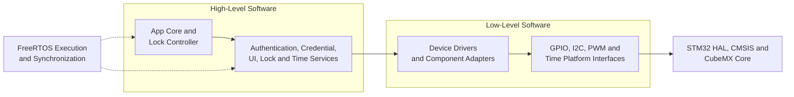

FreeRTOS is orthogonal to the dependency layers. Drivers and services shall not
include FreeRTOS headers. RTOS calls are restricted to the application
composition/execution boundary unless an approved architecture change states
otherwise.

### Layer Responsibilities

| Layer | Shall know | Shall not know |
| --- | --- | --- |
| Application | Product states, events, policy and service contracts | HAL types, pins, I2C addresses, registers |
| Services | Domain concepts and abstract driver contracts | Complete application FSM, RTOS primitives, STM32 HAL |
| Component Drivers | Device behavior and Platform contracts | Credentials, access policy, lockout rules, RTOS |
| Adapters | Translation between two explicit contracts | Product workflow |
| Platform | STM32 HAL/LL, native peripherals and board execution details | Product semantics |
| CubeMX/Vendor | Startup, clocks, peripheral setup and vendor implementation | Application policy |

### Allowed Dependency Rules

1. `App` may include public service headers and application-owned event types.
2. Services may include only the component interfaces they directly require.
3. Component drivers may include Platform interfaces and component-level
   adapters, but no STM32 HAL header.
4. Platform headers shall expose portable types whenever possible. Native HAL
   types shall remain inside Platform source files or opaque contexts.
5. No service or driver shall include `FreeRTOS.h`, `task.h`, `queue.h` or
   CMSIS-RTOS headers.
6. `Core/Src/main.c` shall contain only generated initialization, minimal
   application bootstrap and scheduler start integration.
7. Business logic shall never be implemented inside CubeMX `USER CODE`
   regions.
8. Dependency inversion shall be introduced only for a concrete variation or
   test seam; wrappers that merely rename HAL calls are insufficient.

### Architectural Invariants

- The actuator is safe outside `ACCESS_GRANTED`.
- Authentication has no hardware side effects.
- Drivers never decide whether access is granted.
- The candidate credential never exceeds its fixed storage.
- Candidate credential data is erased on completion, cancellation, timeout,
  denial, success, lockout and fault.
- LCD or buzzer failure cannot extend actuator energization.
- Keyboard sampling continues while the Application Task performs bounded
  synchronous peripheral operations.
- All human-scale timing uses rollover-safe timestamp arithmetic.
- Application and service code remain testable without STM32 headers.

---

## Low-Level Architecture

The low-level architecture comprises Platform interfaces, hardware-independent
component drivers and the adapters that bind component contracts together.
The existing low-level direction is retained as the V1 foundation.

### Platform Layer

The Platform Layer is the only project-owned layer allowed to translate STM32
HAL types and statuses into portable project contracts.

| Interface | Responsibility | Execution behavior | Current backend |
| --- | --- | --- | --- |
| GPIO Platform | Create a logical pin handle, set/reset/toggle and read level | Immediate and bounded | STM32 HAL GPIO |
| I2C Platform | Transfer bounded byte sequences and translate HAL status | Synchronous with finite timeout in V1 | STM32 HAL I2C1 |
| PWM Platform | Create/control a PWM channel, duty, frequency and polarity | Immediate register/HAL operations | STM32 TIM3/TIM4 |
| Time Platform | Provide monotonic milliseconds/microseconds and protocol delays | Timestamp reads are non-blocking; delays are low-level only | HAL tick and TIM2 |

Detailed Platform documentation is available in
[Platforms/README.md](Platforms/README.md).

#### GPIO Platform Contract

- `PGPIO_Init()` associates a logical handle with a platform port and pin.
- GPIO peripheral mode, pull, speed and alternate function remain CubeMX
  responsibilities.
- `PGPIO_Set()`, `PGPIO_Reset()` and `PGPIO_Toggle()` operate only on initialized
  handles.
- `PGPIO_GetLevel()` returns the actual sampled level, not a cached logical
  device state.
- Electrical polarity belongs to the consuming driver, not the generic GPIO
  interface.

#### I2C Platform Contract

- Addresses are represented in 7-bit form above the Platform implementation.
- The Platform implementation performs any HAL-specific address shifting.
- Every transfer has a finite timeout.
- HAL statuses are translated into `OK`, `ERROR`, `BUSY` or `TIMEOUT`.
- The V1 implementation may be synchronous because LCD transactions are short
  and the higher-priority Keyboard Task can preempt the Application Task.
- Repeated retries, bus recovery and DMA are outside the initial implementation
  unless measurement or fault testing requires them.

#### PWM Platform Contract

- A PWM handle represents one logical channel.
- The native timer handle remains opaque to component drivers.
- Frequency is a timer-wide property; channels sharing a timer share frequency.
- Duty ratio shall be preserved when frequency changes, within integer/timer
  resolution.
- The implementation shall validate channel, representable frequency and
  peripheral context before register access.
- TIM3 is reserved for the buzzer and TIM4 for LCD backlight, preventing
  unintended frequency coupling in V1.

#### Time Platform Contract

- `Platform_GetMillis()` returns a wrapping unsigned millisecond counter.
- `Platform_GetMicros()` returns the TIM2-based microsecond counter.
- Application durations shall use unsigned subtraction:

```c
bool TimeoutValidation_HasElapsed(
    uint32_t NowMs,
    uint32_t StartMs,
    uint32_t DurationMs
)
{
    return (uint32_t)(NowMs - StartMs) >= DurationMs;
}
```

- Services shall receive or read timestamps; they shall not block waiting for a
  future timestamp.
- `Platform_DelayMs()` and `Platform_DelayUs()` are restricted to bounded
  low-level protocol/initialization behavior.
- Long application delays using these APIs are prohibited.

### Component Drivers

| Component | Responsibility | Explicit non-responsibility | Documentation |
| --- | --- | --- | --- |
| PCF8574 | Port/bit I/O, address/context and port shadow | LCD protocol and UI policy | [README](Libs/Components/PCF8574/README.md) |
| HD44780 | LCD commands, DDRAM/CGRAM, geometry and display control | I2C transactions and product messages | [README](Libs/Components/HD44780/README.md) |
| Matrix Keyboard | Scan pipeline, debounce, per-key FSM and logical actions | Credential semantics and RTOS event transport | [README](Libs/Components/MatrixKeyboard/README.md) |
| LED | Logical state and non-blocking blink/pulse/flash effects | Product indication patterns | [README](Libs/Components/Led/README.md) |
| Buzzer | Frequency and output control through PWM | Sound sequences and duration policy | [README](Libs/Components/Buzzer/README.md) |
| Lock Actuator | Electrical polarity, safe output and redundant maximum-on deadline | Authentication, attempts and UI policy | Planned V1 component |

#### Driver Rules

- Drivers expose device-level concepts, not application policy.
- Drivers are handle based and support statically allocated instances.
- Drivers do not create tasks, queues, timers or interrupts.
- Drivers never allocate memory dynamically.
- Runtime state is private and modified only through the public API.
- External buffers/configuration are caller-owned and have documented lifetime.
- Public operations validate pointers, initialization and value ranges.
- A failed lower-level operation is propagated without silently corrupting the
  driver's software state.
- Hardware-independent driver headers shall not expose STM32 types.

### Adapter Pattern

Adapters translate one stable component contract into another. They shall not
contain product policy.

Current adapters:

- `HD44780_PCF8574_BusAdapter` implements the HD44780 nibble-transfer contract
  using PCF8574 port writes.
- `HD44780_PWM_BacklightAdapter` implements the LCD backlight contract using a
  Platform PWM instance.
- `MatrixKeyboard_GPIO_ScanAdapter` implements matrix column/row acquisition
  using Platform GPIO handles.

### LCD Data Path

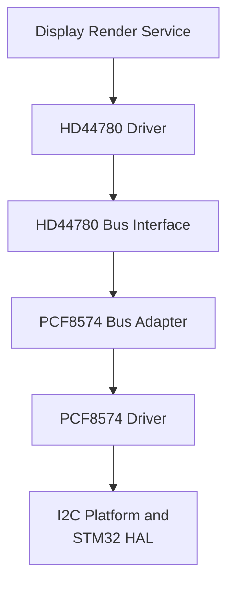

The PCF8574 is an I/O expander. It does not translate LCD commands. The bus
adapter owns the mapping between HD44780 signals and PCF8574 bits.

The current V1 mapping is:

| HD44780 signal | PCF8574 bit |
| --- | ---: |
| RS | 0 |
| RW | 1 |
| E | 2 |
| D4 | 3 |
| D5 | 4 |
| D6 | 5 |
| D7 | 6 |

The backlight does not use the remaining PCF8574 bit in this hardware baseline;
it is controlled independently through TIM4 CH4 PWM.

### Keyboard Data Path

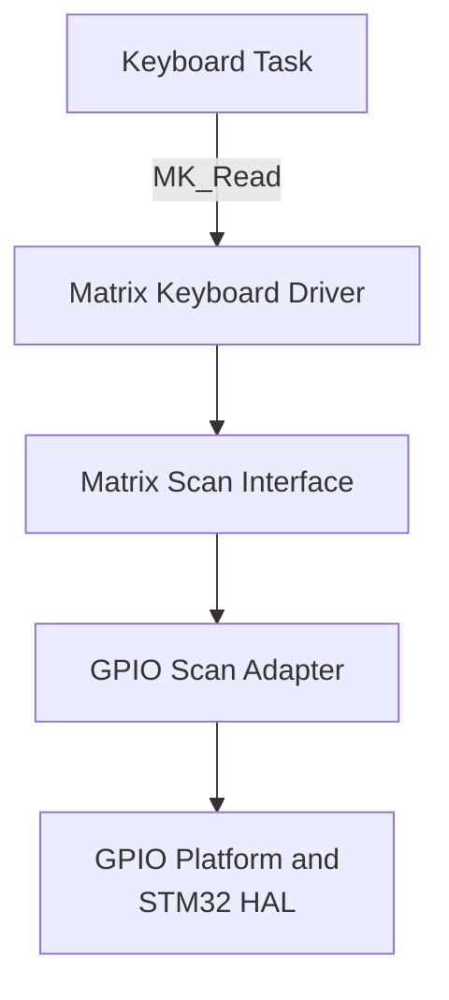

The scan adapter normalizes electrical levels:

```text
bit = 1  -> physical key is pressed
bit = 0  -> physical key is released
```

The driver returns device-level output containing a logical key code and key
action. It does not know whether a key is a PIN digit, confirmation or
cancellation.

### Output Paths

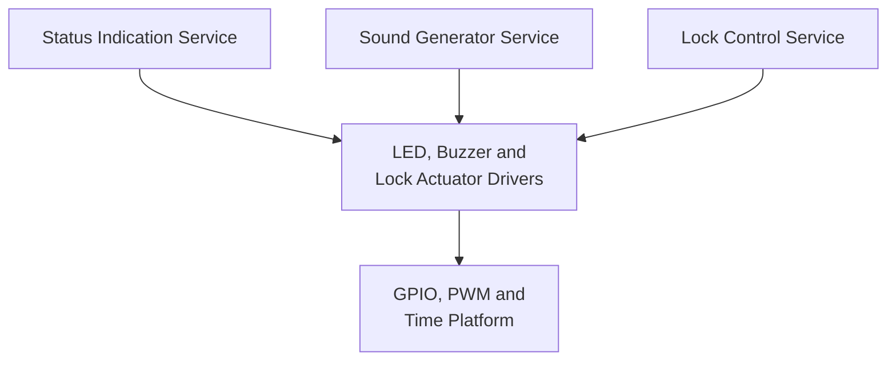

The Status and Sound services translate domain concepts such as `SUCCESS`,
`DENIED` and `LOCKOUT` into device-level effects. Component drivers remain
unaware of those domain meanings.

---

## High-Level Architecture

The high-level architecture contains the application composition root, the
central lock state machine and services that express product/domain behavior.
It shall remain independent from STM32 and FreeRTOS types.

### Application Layer

#### App Core

`App_Core` is the composition and execution boundary of the product.

Responsibilities:

- statically allocate application, service, driver and RTOS objects;
- connect handles, configuration and adapters;
- initialize modules in the defined safe order;
- record initialization results;
- create the application queue and static tasks;
- expose only the minimal bootstrap called by `main.c`;
- own the FreeRTOS-specific task entry functions.

Non-responsibilities:

- authentication policy;
- credential parsing;
- application state transitions;
- direct manipulation of HAL peripherals during normal operation.

#### Lock Controller

`Lock_Controller` owns the authoritative electronic-lock state machine and V1
access policy.

Responsibilities:

- own the current application state;
- dispatch semantic events according to that state;
- own the consecutive failed-attempt counter;
- coordinate Credential Entry and Authentication;
- request display, status and sound behavior;
- request bounded lock/unlock operations;
- own application-level entry, denial, unlock and lockout deadlines;
- prioritize critical faults over user input;
- define state entry and exit actions.

Non-responsibilities:

- scan the keyboard matrix;
- compare raw GPIO levels;
- render HD44780 commands;
- generate PWM frequencies;
- store the valid credential;
- call FreeRTOS primitives;
- access HAL types, GPIO pins or peripheral addresses.

### Service Layer

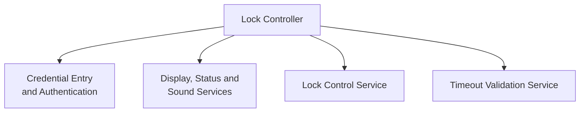

Services are synchronous modules called from the Application Task. A service
may maintain internal non-blocking state, but it shall not own an RTOS task.

| Service | Owns | Uses | Must not own |
| --- | --- | --- | --- |
| Credential Entry | Candidate buffer, length, session state and entry timestamp | Semantic key codes and timeout validation | Valid PIN, attempt count, lockout policy |
| Authentication | Fixed V1 credential comparison contract | Read-only configured credential | UI, attempt count, hardware side effects |
| Display Render | Current logical screen/model and render coalescing | HD44780 Driver | Application transitions or raw credential storage |
| Status Indication | Logical LED mode and non-blocking indication selection | LED Driver | Authentication policy |
| Sound Generator | Current sound pattern, phase and timing | Buzzer Driver | Product state transitions |
| Timeout Validation | Rollover-safe elapsed/deadline calculations | Unsigned time values | Threads, hardware timers or mutable global deadlines |
| Lock Control | Requested commanded state and actuator-operation result | Lock Actuator Driver | Authentication and failed-attempt policy |
| Power Management | Power-mode policy and sleep eligibility | Application state and Platform power hooks | Access decisions or unlock commands |

#### Credential Entry Service

The service converts logical key codes into a bounded candidate credential and
semantic outcomes.

Required behavior:

- accept only digits `0` through `9` as credential content;
- limit the candidate to exactly four stored digits;
- expose the number of entered digits for masked display rendering;
- treat `#` as confirmation only when four digits are present;
- report incomplete confirmation without authenticating;
- clear a non-empty candidate when `*` is pressed;
- cancel the entry session when `*` is pressed with an empty candidate;
- detect the 15-second inactivity timeout using rollover-safe arithmetic;
- erase storage whenever the session ends for any reason;
- never expose the candidate through logs or display strings.

The service does not read the keyboard driver directly. It receives keys from
the Lock Controller inside the Application Task.

#### Authentication Service

Authentication is a pure domain operation for V1:

- receive a candidate pointer and explicit length;
- require exactly four digits;
- compare against the configured development credential;
- return `AUTH_SUCCESS`, `AUTH_FAILURE` or an operation error;
- produce no hardware, UI, timing or attempt-counter side effect.

The valid credential shall be located in a controlled configuration source and
shall never appear in this README, diagnostic output or test reports intended
for publication.

#### Display Render Service

The service translates product state into short LCD views:

- locked prompt;
- masked credential entry;
- incomplete credential;
- access granted;
- access denied with remaining attempts;
- lockout and optional remaining time;
- degraded/fault indication.

It shall coalesce unchanged views so that the same content is not repeatedly
transmitted over I2C. The service may perform a bounded synchronous LCD update,
but shall not wait for human-scale display durations.

LCD failure is recoverable by default: the lock remains operational only if
the keyboard, time base and actuator safety path are valid. The Lock Controller
shall receive a display error status so the degraded-mode policy remains
explicit.

#### Status Indication Service

The service maps product modes to logical LED behavior. Initial logical modes
shall include:

- `STATUS_MODE_BOOT`;
- `STATUS_MODE_LOCKED`;
- `STATUS_MODE_ENTRY`;
- `STATUS_MODE_GRANTED`;
- `STATUS_MODE_DENIED`;
- `STATUS_MODE_LOCKOUT`;
- `STATUS_MODE_FAULT`;
- `STATUS_MODE_LOW_BATTERY` for the later power-management increment.

Exact colors and temporal patterns belong to service configuration. Patterns
shall be progressed by `StatusIndication_Update()` and the non-blocking LED
Driver; the service shall not call a task delay.

Fault indication has higher priority than normal UI patterns. Low-battery
indication shall never obscure a critical fault.

#### Sound Generator Service

The service maps logical sound requests to non-blocking PWM phases. Initial
patterns shall include:

- valid key click;
- access granted;
- access denied;
- lockout;
- optional fault diagnostic pattern.

Each phase contains frequency, duration and output state. `Sound_Update()`
advances the active phase from timestamps. A new request follows an explicit
replacement/priority policy; no unbounded sound queue is required for V1.

The buzzer shall be disabled when no pattern is active and before entering a
low-power stop state.

#### Timeout Validation Service

This service is a small stateless temporal utility, not a scheduler. It
centralizes rollover-safe operations so application and service modules do not
reimplement absolute-deadline comparisons incorrectly.

It shall:

- operate on explicit unsigned timestamps and durations;
- define all public units in function/field names;
- contain no blocking delay;
- create no task or software timer;
- remain host-testable without HAL or FreeRTOS.

#### Lock Control Service and Lock Actuator Driver

Two safety boundaries are used deliberately:

- The **Lock Control Service** represents domain commands and reports logical
  completion/failure to the Lock Controller.
- The **Lock Actuator Driver** represents electrical control, polarity and a
  redundant maximum energization deadline.

The Lock Actuator Driver shall provide a `ForceSafe` operation that does not
depend on the application state machine. Any initialization failure, critical
fault or inconsistent state shall invoke the safe path.

An unlock request shall always include a finite duration. A public unlimited
`Unlock()` operation is prohibited.

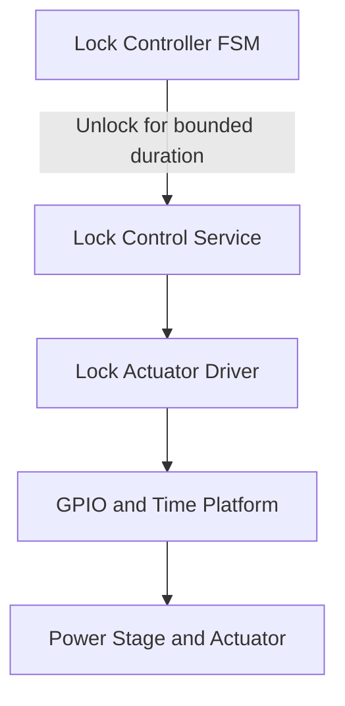

---

## FreeRTOS Execution Model

### V1 Task Set

The MVP has exactly two project-owned runtime tasks.

| Task | Activation | Responsibility | Relative priority |
| --- | --- | --- | ---: |
| Keyboard Task | Periodic every 1 ms | Scan/process keyboard and publish logical key actions | Higher |
| Application Task | Event-driven with 10 ms maximum wait | Run lock FSM and update all services/deadlines | Lower |

The FreeRTOS Idle Task remains kernel-owned. No dedicated task shall be created
for LCD, LED, buzzer, authentication, credential entry, lock control or power
management in V1.

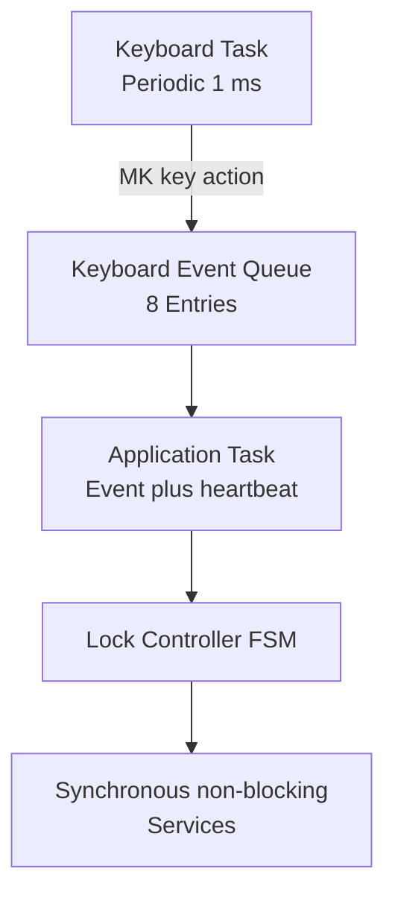

### Scheduler Configuration Contracts

- FreeRTOS tick frequency shall initially be 1000 Hz.
- The Keyboard Task shall use a periodic-delay-until mechanism, not cumulative
  relative delays.
- The Keyboard Task priority shall be higher than the Application Task so
  bounded synchronous LCD/I2C work cannot disrupt keyboard sampling.
- Task control blocks and stacks shall be statically allocated.
- The keyboard queue shall use static storage.
- Domain timing shall use timestamps, not FreeRTOS software timers.
- Native FreeRTOS primitives shall be used consistently inside the App
  execution boundary; native and CMSIS-RTOS APIs shall not be mixed in one
  communication path.
- Tickless idle is deferred to the Power Management increment.
- Stack sizes shall be established from call-depth analysis and verified using
  high-water marks; arbitrary oversized stacks are not an architectural
  substitute for measurement.

### Keyboard Task Contract

Conceptual task loop:

```c
void App_KeyboardTask(void* Argument)
{
    TickType_t last_wake_time = xTaskGetTickCount();

    for(;;)
    {
        MK_Output_t output;

        if(MK_Read(&Keyboard, &output) == MK_OPERATION_OK)
        {
            if(output.Action != MK_KEY_ACTION_NONE)
            {
                App_PublishKeyboardEvent(&output);
            }
        }
        else
        {
            App_ReportKeyboardFault();
        }

        vTaskDelayUntil(&last_wake_time, pdMS_TO_TICKS(1U));
    }
}
```

The pseudocode expresses execution intent, not a frozen symbol-level API.

Keyboard Task rules:

- one call to `MK_Read()` per period;
- bounded work with no blocking wait other than the periodic delay;
- no display, sound, authentication or actuator calls;
- publish only `MK_KeyCode_t` plus `MK_KeyAction_t` semantics;
- do not modify the credential candidate;
- do not block when the queue is full;
- report scan/queue failures through a bounded application fault path.

V1 supports single-key interaction. Electrically ambiguous simultaneous keys
or ghosting patterns shall not be interpreted as valid credential digits.

### Application Task Contract

The Application Task owns all high-level mutable state.

Conceptual loop:

```c
void App_ApplicationTask(void* Argument)
{
    for(;;)
    {
        MK_Output_t keyboard_event;
        const bool received = App_WaitKeyboardEvent(
            &keyboard_event,
            APP_UPDATE_PERIOD_MS
        );

        const uint32_t now_ms = Platform_GetMillis();

        if(received)
        {
            LockController_HandleKeyboardEvent(
                &LockController,
                &keyboard_event,
                now_ms
            );
        }

        LockController_Update(&LockController, now_ms);
        StatusIndication_Update(&StatusIndicator, now_ms);
        Sound_Update(&SoundGenerator, now_ms);
        LockControl_Update(&LockControl, now_ms);
        PowerManagement_Update(&PowerManagement, now_ms);
    }
}
```

The 10 ms queue wait provides a periodic heartbeat even when no key arrives.
Therefore LED/sound phases and safety deadlines progress without requiring a
third periodic task.

### Queue and Overflow Policy

The keyboard queue initially stores eight complete logical key-action objects.

- Producer: Keyboard Task only.
- Consumer: Application Task only.
- Send operation: non-blocking.
- Receive operation: blocks for at most the application heartbeat period.
- Ordering: FIFO.
- Payloads contain values, never pointers to task-local storage.

Queue overflow is not a reason to block or delay keyboard acquisition. An
overflow shall be latched as an input-path error. The Application Task shall
erase any candidate credential, return the product to a safe input state and
request the user to retry. Queue occupancy and overflow count shall be measured
during integration.

### Concurrency and Resource Ownership

| Resource/state | Owner | Other access |
| --- | --- | --- |
| Matrix Keyboard Driver and row/column GPIO handles | Keyboard Task | Initialization by App Core before scheduler |
| Keyboard event queue write side | Keyboard Task | None |
| Keyboard event queue read side | Application Task | None |
| Lock Controller state and failed-attempt counter | Application Task | Tests through public API |
| Credential candidate | Credential Entry Service, called by Application Task | Masked length only to Display Service |
| LCD, PCF8574 and I2C1 | Application Task | Initialization by App Core |
| LED drivers and GPIOs | Application Task | Initialization by App Core |
| Buzzer and TIM3 PWM | Application Task | Initialization by App Core |
| Backlight and TIM4 PWM | Application Task | Initialization by App Core |
| Lock actuator and PB8 | Application Task after safe startup | Emergency `ForceSafe` path only |
| Millisecond/microsecond time reads | Read-only, multi-context | Platform implementation owns counters |

The single Application Task ownership model intentionally eliminates service
mutexes in the MVP.

### ISR Policy

- ISRs perform only minimal hardware acknowledgement and event capture.
- No ISR writes to the LCD, authenticates, scans the full keyboard or changes
  the application FSM.
- Keyboard row EXTI is not used for normal acquisition in the V1 runtime; it is
  reserved as a possible future low-power wake source.
- Any ISR that calls a FreeRTOS `FromISR` API shall obey the configured interrupt
  priority ceiling.
- Interrupt priority zero shall not be used for an interrupt that needs to call
  FreeRTOS APIs.

---

## Application Event Model

Events express semantic facts. Electrical row/column levels never cross into
the Application Layer.

### Keyboard-to-Application Message

The inter-task message contains the existing Matrix Keyboard output semantics:

```c
typedef struct
{
    MK_KeyCode_t   Key;
    MK_KeyAction_t Action;

}App_KeyboardEvent_t;
```

The exact public type may reuse or adapt `MK_Output_t`, but the queue
payload shall remain a value object with no hardware information.

### Application Events

| Event | Origin | Payload | Meaning |
| --- | --- | --- | --- |
| `EV_INIT_OK` | App Core | Initialization summary | Critical startup dependencies are valid |
| `EV_INIT_FAIL` | App Core | Module/fault code | Startup cannot enter normal operation |
| `EV_KEY_DIGIT` | Credential input mapping | Digit 0-9 | Append candidate digit if capacity permits |
| `EV_KEY_CONFIRM` | Credential input mapping | None | Request completion/authentication |
| `EV_KEY_CANCEL` | Credential input mapping | None | Clear or cancel candidate entry |
| `EV_ENTRY_TIMEOUT` | Credential Entry/Lock Controller | None | Input inactivity limit elapsed |
| `EV_AUTH_SUCCESS` | Authentication Service | None | Candidate matches configured credential |
| `EV_AUTH_FAILURE` | Authentication Service | None | Candidate does not match |
| `EV_DENIED_TIMEOUT` | Lock Controller | None | Denial feedback interval elapsed |
| `EV_UNLOCK_TIMEOUT` | Lock Controller/Lock Control | None | Authorized unlock interval elapsed |
| `EV_LOCKOUT_TIMEOUT` | Lock Controller | None | Temporary lockout elapsed |
| `EV_INPUT_OVERFLOW` | Keyboard event transport | Count/status | Input ordering cannot be trusted |
| `EV_CRITICAL_FAULT` | Any subsystem through App boundary | Fault code | Immediate transition to safe fault handling |
| `EV_PM_SLEEP_REQUEST` | Power Management | None | Later power increment requests sleep evaluation |
| `EV_PM_WAKE` | Platform wake integration | Wake reason | Later power increment resumes active execution |

Events produced synchronously inside the Application Task do not need to be
placed in the RTOS queue. The queue is the ownership boundary between Keyboard
Task and Application Task, not a mandatory transport for every internal state
transition.

---

## Electronic Lock State Machine

The Lock Controller shall implement one explicit state machine. Distributed
service conditionals shall not become an implicit second product FSM.

### Operational Flow
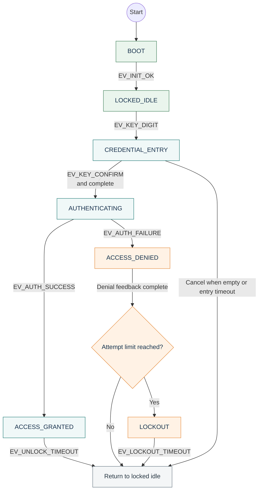
---

### Critical Fault Precedence
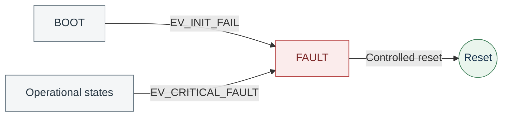

A critical fault from any operational state has precedence over all normal
events and transitions to `FAULT`, even when an individual arrow is omitted
from the diagram for readability.

### State Responsibilities

| State | Purpose | Actuator command | Accepted input |
| --- | --- | --- | --- |
| `BOOT` | Establish safe output, inspect initialization results and prepare UI | Safe/off | None |
| `LOCKED_IDLE` | Normal secure idle state and prompt for a new credential | Safe/off | Digit starts entry; other keys do not authenticate |
| `CREDENTIAL_ENTRY` | Collect, mask, clear and time the candidate PIN | Safe/off | Digits, `*`, `#` |
| `AUTHENTICATING` | Perform side-effect-free credential validation | Safe/off | None |
| `ACCESS_GRANTED` | Maintain authorized bounded unlock and success indication | Energized only within deadline | Ignored/limited |
| `ACCESS_DENIED` | Report failure and select retry or lockout path | Safe/off | Ignored during denial interval |
| `LOCKOUT` | Reject authentication until lockout deadline expires | Safe/off | System events only |
| `FAULT` | Latch critical failure and preserve safe output | Safe/off | Controlled reset/recovery only |

### State Entry and Exit Actions

| State | Entry actions | Exit actions/conditions |
| --- | --- | --- |
| `BOOT` | Force actuator safe; clear credential; evaluate init bitmap | `EV_INIT_OK` only when all critical dependencies are valid |
| `LOCKED_IDLE` | Force safe; clear credential; show locked prompt; set locked indication | First digit is forwarded as the first candidate digit |
| `CREDENTIAL_ENTRY` | Start/restart 15 s inactivity timing; show masked count | Always erase candidate when leaving the state |
| `AUTHENTICATING` | Validate exactly four digits; immediately erase candidate after comparison | Emit success/failure inside Application Task |
| `ACCESS_GRANTED` | Reset failed attempts; request 3 s unlock; start success UI | Force safe when deadline expires or on any fault |
| `ACCESS_DENIED` | Saturating increment of failed attempts; start denial UI and bounded denial interval | Go to lockout at three attempts; otherwise return idle |
| `LOCKOUT` | Force safe; clear credential; show lockout; start 30 s deadline | Reset failed-attempt counter when lockout completes |
| `FAULT` | Force safe; clear credential; stop normal sound/UI; latch fault; show limited fault indication | Hardware reset or explicitly approved recovery only |

### Credential Entry Rules

| Current condition | Input | Behavior |
| --- | --- | --- |
| `LOCKED_IDLE` | Digit | Enter `CREDENTIAL_ENTRY` and store it as digit 1 |
| `LOCKED_IDLE` | `#` | Do not authenticate; optional incomplete feedback |
| `LOCKED_IDLE` | `*` | Remain idle |
| Entry length below 4 | Digit | Append digit and restart entry timeout |
| Entry length equal to 4 | Digit | Ignore/reject without buffer overflow |
| Entry length equal to 4 | `#` | Enter `AUTHENTICATING` |
| Entry length below 4 | `#` | Report incomplete; remain in entry |
| Non-empty entry | `*` | Erase candidate; remain in entry with length zero |
| Empty entry | `*` | Cancel session and return to `LOCKED_IDLE` |
| Active entry | 15 s inactivity | Erase candidate and return to `LOCKED_IDLE` |

### Mandatory FSM Invariants

1. The actuator is electrically safe in every state except bounded
   `ACCESS_GRANTED` operation.
2. `FAULT` preempts user-interface events.
3. `LOCKOUT` never accepts or authenticates a credential.
4. The failed-attempt counter saturates and never wraps.
5. Authentication success resets the failed-attempt counter.
6. A candidate buffer never contains more than four digits.
7. Candidate data is erased on every terminal path.
8. Unlock timeout is independent from LCD, LED and buzzer completion.
9. Reset during unlock immediately returns the output to its hardware safe
   state.
10. The firmware reports commanded actuator state only; it does not claim
    mechanical confirmation.

---

## End-to-End Behavior

### Successful Access

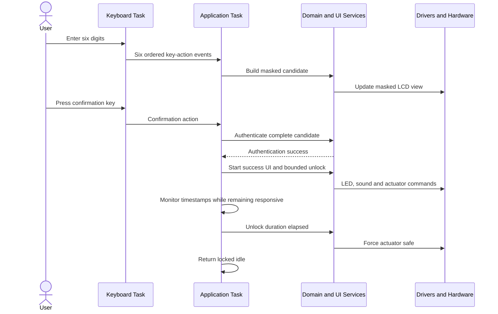

### Failed Authentication and Lockout

1. The user submits a complete but invalid credential.
2. Authentication returns failure without hardware side effects.
3. The candidate is erased immediately.
4. The Lock Controller increments the consecutive-failure counter using a
   saturating operation.
5. Display, LED and buzzer services start non-blocking denial feedback.
6. If the counter is below three, the application returns to `LOCKED_IDLE`
   after the bounded denial interval.
7. On the third failure, the application enters `LOCKOUT` for 30 seconds.
8. Keyboard scanning continues, but credential events are ignored while
   locked out.
9. After the lockout deadline, the failed-attempt counter is reset and the
   application returns to `LOCKED_IDLE`.

### Peripheral Failure During Access

If LCD, LED or buzzer operation fails while access is granted:

- the failure is reported to the Lock Controller;
- the actuator deadline remains active and independent;
- unlock is not extended;
- the actuator is forced safe at the original deadline;
- the failure is classified as recoverable or critical according to the fault
  table below.

---

## Timing and Blocking Contracts

Time is part of the product behavior. Every duration in the application shall
be represented by a start timestamp or deadline and evaluated from the
monotonic Platform Time source. Delays may be used only inside a task to define
its scheduling period or inside a low-level driver for a short, documented
hardware pulse. They shall never represent an application state.

### V1 Timing Budget

| Contract | Initial value | Owner | Enforcement |
| --- | ---: | --- | --- |
| FreeRTOS tick | 1 ms | RTOS configuration | Build-time configuration |
| Keyboard scan period | 1 ms | Keyboard Task | `vTaskDelayUntil()` |
| Key debounce interval | 40 ms | Matrix Keyboard component | Monotonic timestamps |
| Application heartbeat | 10 ms maximum | Application Task | Bounded queue wait |
| Credential-entry timeout | 15 s | Timeout Validation service | Application timestamp |
| Actuator unlock interval | 3 s | Lock Control service | Independent deadline |
| Lockout interval | 30 s | Lock Controller | Application timestamp |
| Single I2C transaction | 20 ms maximum | I2C Platform | HAL timeout plus status |
| LED pattern update | 10 ms maximum cadence | Status Indication service | Application heartbeat |
| Sound pattern update | 10 ms maximum cadence | Sound Generator service | Application heartbeat |

The values above are architecture defaults, not scattered literals. They shall
be defined once in application or board configuration and passed explicitly to
the modules that own them.

### Timeout Evaluation

All elapsed-time comparisons shall remain correct across unsigned counter
rollover. The required form is equivalent to:

```c
if ((uint32_t)(now_ms - start_ms) >= duration_ms)
{
    /* Deadline reached. */
}
```

Code shall not compare absolute timestamps with `now_ms >= deadline_ms` unless
the implementation proves rollover safety. Application modules shall not read
`HAL_GetTick()` or a FreeRTOS tick directly; they receive the Platform Time
contract or a timestamp supplied by their owner.

### Blocking Policy

| Operation | Policy | Rationale |
| --- | --- | --- |
| Wait for an application event | Allowed, bounded to the next heartbeat | Preserves 10 ms service updates |
| Keyboard Task period | Allowed through `vTaskDelayUntil()` | Produces deterministic scanning |
| HAL I2C transfer | Allowed only in Application Task and with finite timeout | One owner, bounded failure |
| HD44780 enable pulse | Short bounded low-level wait allowed | Required by the device protocol |
| LED, buzzer or backlight effect | Never implemented as a blocking loop | Effects are timestamp-driven |
| Credential-entry, unlock or lockout duration | Never implemented with `HAL_Delay()` or task delay | State must remain responsive |
| Queue send from Keyboard Task | Never block | Input must not stall scanning |
| Mutex wait | Not required in V1 | Every peripheral has a single task owner |

The 20 ms I2C timeout is a failure ceiling, not an expected execution time.
Normal LCD transactions shall be much shorter. Repeated I2C failures shall be
detected by policy rather than repeatedly consuming the entire timeout.

### Measurements Required Before V1 Release

The following shall be measured on the target, using the release-equivalent
build and worst supported peripheral conditions:

- worst-case execution time and jitter of the Keyboard Task;
- maximum Application Task event latency;
- I2C transaction duration and timeout behavior with the expander disconnected;
- actuator lock latency after its deadline;
- queue high-water mark during aggressive key input;
- stack high-water mark for both project-owned tasks;
- CPU idle percentage in idle and active product states;
- debounce behavior over at least 100 deliberate key presses;
- deadline behavior across the 32-bit time-source rollover boundary.

Any measured violation must be fixed or recorded as an approved architecture
change. Increasing a timeout without identifying its cause is not a fix.

---

## Initialization and Safe Startup

Startup is a controlled transition from unknown silicon state to a known,
locked product state. The actuator safety path takes precedence over the user
interface.

### Initialization Sequence

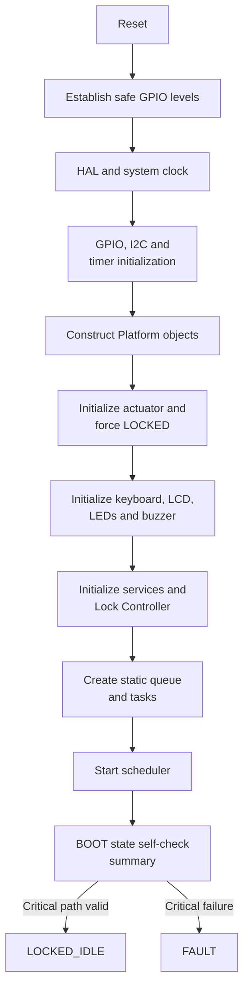

The detailed order is:

1. Reset-visible GPIO configuration shall make the actuator electrically safe.
2. `HAL_Init()` and system clock configuration establish the MCU baseline.
3. Cube-generated GPIO initialization applies safe output levels before
   enabling dependent timers or buses.
4. I2C and timer peripherals are initialized.
5. Platform objects are constructed from generated HAL handles and board
   constants.
6. The Lock Actuator is initialized first among component drivers and is
   explicitly commanded to its safe, locked state.
7. The monotonic time source is initialized and validated.
8. Keyboard, PCF8574, LCD, backlight, LED and buzzer components are initialized.
9. Services and the Lock Controller are initialized with validated dependency
   pointers and configuration.
10. The event queue and both tasks are created from static memory.
11. The scheduler starts; the Application Task evaluates the collected startup
    results while in `BOOT`.

No startup animation or sound may delay the actuator-safe operation.

### Initialization Classification

| Dependency | Classification | Required behavior on failure |
| --- | --- | --- |
| Lock actuator safe command | Critical | Remain or enter `FAULT`; never authorize access |
| Monotonic time source | Critical | Enter `FAULT`; bounded unlock cannot be guaranteed |
| Keyboard scan path | Critical for normal operation | Enter `FAULT`; no credential can be trusted |
| Queue or task creation | Critical | Do not start normal product operation |
| LCD/PCF8574 | Degradable | Continue locked with LED/sound feedback if available |
| Status LED | Degradable | Continue locked using remaining feedback channels |
| Buzzer | Degradable | Continue locked using visual feedback |
| Backlight PWM | Degradable | Continue without dimming/backlight control |

Degraded operation never relaxes authentication, lockout or actuator safety.
If the remaining feedback is insufficient to communicate normal use safely,
the Lock Controller may escalate the condition to `FAULT`.

### Scheduler Failure Hooks

Stack overflow, allocation failure and unrecoverable RTOS assertion hooks shall:

1. force the actuator to its safe state through the shortest valid path;
2. stop issuing normal application commands;
3. record a diagnosable fault indication when safe to do so; and
4. remain in a controlled failure loop or perform an explicitly approved reset.

Because V1 statically allocates all application RTOS objects, allocation failure
after startup is not part of normal behavior.

---

## Error, Fault and Security Policy

### Failure Classes

| Class | Examples | Product response |
| --- | --- | --- |
| User input rejection | Incomplete credential, extra digit, invalid action | Keep locked, provide bounded feedback, preserve valid state |
| Authentication failure | Complete credential does not match | Erase candidate, increment failure counter, deny or lock out |
| Recoverable peripheral failure | LCD NACK, buzzer unavailable | Report, degrade feedback, preserve deadlines and locked safety |
| Critical functional failure | Time source invalid, keyboard contract broken | Force locked and enter `FAULT` |
| Actuator safety failure | Unlock deadline missed, safe command reports failure | Reassert safe command, enter `FAULT`, require service/reset policy |
| RTOS integrity failure | Stack overflow, assertion, impossible queue state | Use failure hook and force safe state |
| Configuration failure | Invalid pin, duplicate binding, zero critical duration | Reject initialization and remain safe |

### Status Propagation

- Platform functions return transport or hardware-operation status.
- Component drivers translate Platform status into component-level status
  without hiding the original failure class.
- Services return domain-level results such as success, denied, busy, invalid
  argument or device failure.
- Only the Lock Controller decides whether a reported failure is ignored,
  retried, degraded or promoted to `FAULT`.
- A function that cannot complete its contract shall not return success.
- Failed output updates must not silently extend a product deadline.

Retries, when justified by a device protocol, shall be finite and documented.
There is no unbounded retry loop in V1.

### Safe Fault Behavior

On entry to `FAULT`, the application shall:

1. erase any credential candidate;
2. cancel pending authentication and normal UI sequences;
3. command the actuator to the locked state;
4. stop all nonessential PWM outputs;
5. expose a distinct, non-blocking fault indication when a feedback path is
   still operational; and
6. reject all unlock requests.

Leaving `FAULT` requires an explicitly defined recovery condition. For V1, the
default recovery is a controlled reset after the underlying cause has been
removed; an automatic recovery path must be approved separately.

### Credential Handling

- The application stores only the current candidate and configured reference
  needed for V1 authentication.
- The candidate is fixed-length, bounds-checked and erased after success,
  failure, cancellation, timeout, lockout, fault and reset.
- The display shows masking characters only; raw digits are never rendered.
- Raw credentials shall not be printed, traced or included in fault telemetry.
- Authentication shall use an exact-length comparison and shall not partially
  authorize a prefix.
- The consecutive-failure counter shall saturate instead of wrapping.
- V1 hardcoded credential storage is accepted only as an MVP limitation. It is
  not a production credential-storage design.

Physical tamper resistance, cryptographic storage and side-channel hardening
remain outside V1 scope, but the architecture must not prevent later replacement
of the Authentication service.

---

## Power Management Architecture

Power management is an explicit architectural extension point, but deep-sleep
operation is not required to complete the first functional MVP. V1 shall avoid
design choices that prevent later low-power operation and shall provide a
testable service skeleton before STOP mode is enabled.

The Power Management service does not own a task in V1. It is updated by the
Application Task at the same bounded heartbeat used by the other services. It
observes product activity and requests power transitions; it never authenticates
a credential and can never command the lock to unlock.

### Responsibilities

The Power Management service shall eventually:

- collect activity from keyboard events, display changes, feedback patterns and
  state transitions;
- maintain inactivity timing without blocking the application;
- request backlight dimming or shutdown through the Display Render service;
- coordinate tickless idle and, later, MCU STOP entry;
- validate all sleep guards before changing power state;
- restore clocks, time accounting and peripherals after wakeup;
- expose current power state and diagnostic transition reason;
- classify battery state when battery-measurement hardware becomes available.

It shall not:

- drive GPIO, I2C or PWM directly;
- bypass the Lock Controller;
- enter deep sleep while the actuator may be unlocked;
- silently discard a pending application event;
- use low battery as a reason to relax authentication or safety behavior.

### Power State Machine

### Operation Flow
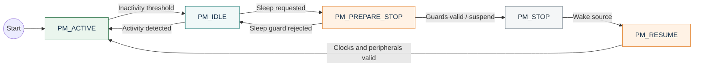
---

### Critical Fault Precedence
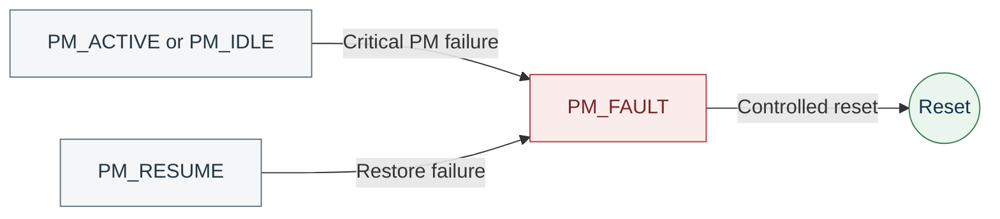

| Power state | Meaning | Required behavior |
| --- | --- | --- |
| `PM_ACTIVE` | Product is active or recent activity exists | Full required UI and normal scheduling |
| `PM_IDLE` | Product is locked and inactive | Dim or disable nonessential outputs; remain immediately responsive |
| `PM_PREPARE_STOP` | Candidate transition to deep sleep | Recheck guards, drain/retain state and prepare wake sources |
| `PM_STOP` | MCU deep low-power mode | Only approved wake sources remain active |
| `PM_RESUME` | Hardware and timebase restoration | Restore clocks, peripherals and debounce input before use |
| `PM_FAULT` | Safe power transition cannot be guaranteed | Keep or force lock safe and report critical failure |

Power state is orthogonal to the Electronic Lock FSM. For example,
`LOCKED_IDLE` may be either `PM_ACTIVE` or `PM_IDLE`; `ACCESS_GRANTED` is always
`PM_ACTIVE`. The two state machines exchange explicit requests and conditions
rather than sharing internal state.

### Mandatory Sleep Guards

Deep sleep may be entered only when all of the following are true:

1. the product FSM is in an approved locked state, initially `LOCKED_IDLE` or
   `LOCKOUT`;
2. the lock actuator is commanded safe and no unlock deadline is active;
3. the application event queue is empty at the final guard check;
4. no I2C transfer or PWM transition is in progress;
5. no critical fault response is pending;
6. every active deadline can be preserved by a valid low-power wake source or
   reconciled after wakeup;
7. keyboard wake configuration is armed and validated; and
8. the application has committed a consistent state for resume.

If any guard fails, the transition returns to `PM_IDLE`. Guard failure is not by
itself a product fault; it becomes a fault only if the failed condition violates
a safety contract.

### Wake and Resume Contract

The intended wake design is:

- one or more keyboard row signals configured as EXTI wake sources;
- an RTC or other low-power timer for lockout and long application deadlines;
- reset, watchdog or power-monitor events as safety wake sources;
- a post-wake debounce window before a key is accepted as a credential action.

On wakeup, the service shall restore the system clock first, then the required
Platform peripherals, reconcile monotonic time, restore display/output policy,
and only then emit `EV_PM_RESUMED`. The key transition that caused wakeup is a
wake indication, not automatically an authenticated digit; it must pass normal
matrix scanning and debounce after resume.

The exact wake pins, RTC source, STOP submode and current targets remain hardware
decisions. They must be measured on the real board before STOP mode is promoted
from planned to implemented.

### Battery State Model

Battery condition is deliberately kept separate from the operational power FSM:

| Battery state | Intended policy |
| --- | --- |
| `BATTERY_NORMAL` | Normal product behavior |
| `BATTERY_LOW` | Reduce nonessential UI energy and indicate maintenance need |
| `BATTERY_CRITICAL` | Preserve safe locking, reject unsafe actuation and request service |
| `BATTERY_UNKNOWN` | Use conservative policy until measurement is valid |

Thresholds, filtering, hysteresis and whether an unlock is safe at critical
voltage depend on the actuator, power stage, cell chemistry and measurement
circuit. They shall not be guessed in firmware.

### Incremental Power Roadmap

| Stage | Deliverable | V1 status |
| --- | --- | --- |
| PM0 | No busy waits; tasks block or delay deterministically | Required for MVP |
| PM1 | Backlight and feedback inactivity policy | Planned in service skeleton |
| PM2 | FreeRTOS tickless idle with measured wake latency | After functional integration |
| PM3 | STM32 STOP mode, keyboard wake and time reconciliation | After board validation |
| PM4 | Battery measurement, hysteresis and critical-voltage policy | Requires hardware definition |

This staged approach keeps the MVP focused while preserving a clean path to
battery optimization.

---

## Configuration and Ownership

Configuration is split by meaning, not by convenience.

### Planned Configuration Boundaries

| Configuration owner | Examples | Must not contain |
| --- | --- | --- |
| `Board_Config.h` | Pins, ports, I2C address, timer channels, electrical polarity | PIN value, lockout policy, UI text |
| `App_Config.h` | PIN length, timeouts, retry limit, queue length, task cadence | HAL handles, GPIO ports, timer instances |
| Component `*_Config` types | Dependencies and physical options for one driver instance | Product state or cross-service policy |
| Service `*_Config` types | Domain policy and injected driver/service references | STM32 HAL types |
| FreeRTOS configuration | Tick rate, assertion hooks, static-allocation settings | Product PIN or hardware pin map |

The exact filenames may be introduced with their modules, but these ownership
boundaries are normative.

### Compile-Time and Initialization Validation

Compile-time assertions shall be used where a condition is knowable at build
time, including array capacities, credential length, queue item size and valid
enumeration ranges. Initialization shall reject:

- null mandatory dependencies;
- zero or out-of-range critical durations;
- unsupported timer channels;
- duplicate keyboard row/column bindings;
- invalid LCD geometry or expander mapping;
- an unlock polarity that has not been explicitly configured;
- a task stack or queue length below the architecture minimum.

### Object Ownership Rules

- Configuration data is immutable after successful initialization unless the
  module contract explicitly provides a reconfiguration operation.
- Runtime state belongs to exactly one module instance.
- The module that creates an object owns its storage lifetime.
- Public handles may be passed by pointer, but ownership is not transferred.
- Hardware dependencies are injected during initialization; they are not found
  through hidden globals.
- Private implementation fields use the existing leading-underscore naming
  convention and shall not be manipulated outside the owning module.
- Application state is not stored inside Platform or component drivers.

---

## Repository Organization

The current structure is retained. New modules shall complete the intended
layers instead of triggering a broad repository reorganization during the MVP.

| Path | Responsibility |
| --- | --- |
| `App/Core/` | Composition root and FreeRTOS task entry points |
| `App/Lock_Controller/` | Product FSM and application policy |
| `Core/` | STM32Cube-generated startup, HAL glue and IRQ code |
| `Drivers/` | STM32Cube HAL and CMSIS packages |
| `Libs/Components/Buzzer/` | Passive-buzzer component driver |
| `Libs/Components/HD44780/` | LCD driver and bus/backlight adapters |
| `Libs/Components/Led/` | Status LED component driver |
| `Libs/Components/MatrixKeyboard/` | Matrix keyboard driver and scan adapter |
| `Libs/Components/PCF8574/` | I2C I/O-expander driver |
| `Libs/Services/` | Hardware-independent product capabilities |
| `Platforms/` | STM32 HAL-backed GPIO, I2C, PWM and Time contracts |
| `References/` | Scope, architecture and component references |
| `Electronic-Lock.ioc` | STM32CubeMX hardware configuration |
| `README.md` | Normative project architecture |

The following additions are expected, without changing the layer model:

- a Lock Actuator component under `Libs/Components/`;
- Lock Control and Power Management services under `Libs/Services/`;
- static RTOS objects and task entry points under `App/Core/`;
- host and target verification assets under a clearly named test directory;
- board and application configuration headers at their respective composition
  boundary.

### Generated-Code Boundary

`Core/`, `Drivers/`, the `.ioc` file and STM32Cube-generated build metadata are
tool-owned integration surfaces. Product behavior shall live in `App/`,
`Libs/` and `Platforms/`. Manual changes inside generated files shall be limited
to Cube-preserved user sections and thin calls into the application composition
root.

Regenerating the `.ioc` project must not erase architecture code. After every
CubeMX regeneration, the build, pin map, timer allocation and generated diff
shall be reviewed before merging.

### Include and Dependency Rules

- Public include directories shall expose module APIs without exposing their
  source directories indiscriminately.
- Application code may include service and public component headers, but not
  component private headers.
- Services shall not include files from `App/` or `Core/`.
- Components shall not include service or application headers.
- Platform implementation files may include STM32 HAL headers; Platform public
  contracts and all upper-layer public headers shall remain HAL-independent.
- A module shall not reach into a sibling module's private data structure.
- Circular includes or link dependencies are architecture violations.

---

## Documentation Standard

All source documentation and repository README files are written in English.
This keeps public identifiers, tool output and documentation vocabulary
consistent. Every new module must follow the established Doxygen style and the
README structures below before it is considered complete.

### File Header Template

Each public header and source file shall provide:

```c
/**
 * @file    Module_Name.h
 * @brief   One-sentence purpose of the file.
 * @details Architectural role, dependencies, ownership and relevant behavior.
 *
 * @author  Project author or maintainer
 * @version 1.0.0
 * @date    2026-08-12
 */
```

The filename, capitalization and include guard shall match. Dates use an
unambiguous English month or ISO `YYYY-MM-DD`; mixed-language abbreviations are
not used.

### Source Layout and Naming

Public headers retain the established section order:

1. file Doxygen block;
2. include guard and `extern "C"` boundary;
3. `Includes`;
4. `Macros`;
5. `Types`;
6. `Data`, only when the public contract genuinely exposes data;
7. `Function Prototypes`;
8. closing C++ boundary and include guard.

Source files use the corresponding order of includes, private macros/types,
private data, private prototypes and function definitions. The existing long
asterisk separators may continue to label these sections, but consistency
inside a file is more important than an exact separator width.

Naming follows the current module-oriented vocabulary:

| Element | Pattern | Example |
| --- | --- | --- |
| Public type | `<Module>_<Role>_t` | `MK_Output_t` |
| Runtime instance | `<Module>_Handle_t` | `LED_Handle_t` |
| Immutable initialization | `<Module>_Config_t` | `MK_Config_t` |
| Operation status | `<Module>_OpStatus_t` | `HD44780_OpStatus_t` |
| Enumeration value | Uppercase module prefix plus semantic value | `MK_KEY_ACTION_CLICK` |
| Public function | Module prefix plus action | `MK_Read()` |
| Unit-bearing value | Meaning followed by unit suffix | `debounce_time_ms` |
| Private runtime field | Leading underscore plus descriptive name | `_is_initialized` |
| Compile-time macro | Uppercase module prefix plus name | `APP_EVENT_QUEUE_LENGTH` |

New names shall use complete domain meaning and the existing prefix of their
module. Renaming an established public API only for cosmetic uniformity is not
part of the MVP; inconsistent names may be corrected when a contract is already
changing and all call sites, examples and documentation change together.

### Type Documentation

Every public enumeration, alias, callback, configuration type and runtime
structure shall document its semantic role. Structure fields require more than
a restatement of the field name. Each field description shall identify, where
applicable:

- what the value represents;
- unit and valid range;
- ownership and storage lifetime;
- whether the value is configuration or mutable runtime state;
- nullability for pointers;
- electrical polarity or active level;
- buffer capacity versus current length;
- callback execution context and blocking restriction.

Example:

```c
/** @brief Immutable initialization data for one service instance. */
typedef struct
{
    uint32_t entry_timeout_ms; /**< Credential inactivity timeout in milliseconds; must be nonzero. */
    const Time_Platform *time; /**< Non-owning monotonic time dependency; must remain valid for the instance lifetime. */
} Example_Service_Config;
```

Public configuration fields remain readable and are copied or referenced
according to the module contract. Mutable fields are private implementation
state and follow the existing leading-underscore convention.

### Function Documentation

Every public function shall document:

```c
/**
 * @brief   Concise action and result.
 * @details Behavior, side effects and state transition, when needed.
 *
 * @param[in]     object  Valid initialized instance; must not be NULL.
 * @param[in,out] value   Meaning, unit, range, ownership and capacity.
 *
 * @pre     Preconditions not enforceable by the type system.
 * @note    Timing, task-context or reentrancy information.
 * @warning Safety restriction or irreversible side effect, when applicable.
 *
 * @return MODULE_STATUS_OK on success.
 * @return MODULE_STATUS_INVALID_ARGUMENT when a mandatory argument is invalid.
 * @return MODULE_STATUS_DEVICE_ERROR when the dependency cannot complete.
 */
```

Only applicable tags are included; empty boilerplate is not. The public header
is the single source of truth for public API contracts. Source files document
private helpers, algorithms, non-obvious decisions and hardware protocol
details without duplicating the entire public contract.

### Component Driver README Topics

Component READMEs shall use this order, adapting a topic only when it is truly
not applicable:

1. Title and Concise Purpose;
2. Overview;
3. Features;
4. Architecture, including interfaces/adapters when present;
5. Directory Structure;
6. Device Overview, when the module represents an external device;
7. Driver Responsibilities;
8. Dependencies;
9. Data Structures;
10. API Reference;
11. Driver-specific runtime model, when needed, such as port shadow or effect state;
12. Operation Flow, with Initialization Flow as a subsection;
13. Usage Example;
14. Design Decisions;
15. Error Handling;
16. Usage Constraints;
17. Testing and Validation;
18. Applications;
19. Limitations;
20. Future Improvements, when concrete extensions are known;
21. License.

Driver READMEs shall describe the abstract Platform dependency, adapter
selection, electrical assumptions, active polarity, units, timeouts and error
propagation. This order preserves the common skeleton already used by Buzzer,
HD44780, LED, Matrix Keyboard and PCF8574 documentation; `Testing and
Validation` becomes mandatory as those READMEs are next revised. Driver READMEs
shall not prescribe the electronic-lock product policy.

### Service README Topics

Service READMEs preserve the same visual and explanatory style but emphasize
domain behavior:

1. Title and Concise Purpose;
2. Overview;
3. Features;
4. Architecture Context;
5. Directory Structure;
6. Service Responsibilities;
7. Service Non-Responsibilities;
8. Dependencies;
9. Configuration and Data Structures;
10. API Reference;
11. Events, Commands and Results;
12. Behavioral Rules and Operation Flow;
13. Timing and Concurrency;
14. Usage Example;
15. Design Decisions;
16. Error Handling;
17. Usage Constraints;
18. Testing and Acceptance Criteria;
19. Applications;
20. Limitations and Future Improvements;
21. License.

If a service participates in a state machine, its README links to this document
and explains only the states or transitions it owns. It shall not redefine the
global Lock Controller FSM.

### Documentation Quality Rules

- Names in diagrams, examples and text shall match the real public API.
- Units shall appear in field names or documentation and remain consistent.
- Examples shall compile against the documented API or be clearly marked as
  pseudocode.
- Mermaid diagrams shall describe stable architecture, not line-by-line code.
- Limitations and failure behavior shall be explicit.
- A README is updated in the same change that modifies its public contract.
- TODO text is not used to conceal an unresolved safety or architecture choice.

---

## Verification Strategy

Verification follows the same dependency direction as the architecture. Pure
logic is tested without the MCU; hardware contracts are then validated on the
target; finally the product behavior is exercised end to end.

### Verification Levels

| Level | Primary subjects | Method |
| --- | --- | --- |
| Host unit | Authentication, credential entry, timeout validation, Lock Controller FSM | Native C tests with fake time and fake services |
| Host component | Driver logic that depends only on abstract interfaces | Fake GPIO, I2C, PWM and Time implementations |
| Target component | GPIO polarity, PWM frequencies, I2C protocol, LCD timing, keyboard scan | Instrumented tests on STM32F411 board |
| RTOS integration | Task cadence, queue behavior, ownership, stack margin | Trace points, counters and target stress tests |
| Product integration | Full credential, lockout, fault and unlock flows | Real peripherals or controlled hardware fixture |
| Release acceptance | Scope, reliability and safe recovery | Repeatable acceptance checklist on release build |

### Required Unit Coverage

At minimum, host tests shall cover:

- correct, incorrect, incomplete and overlength credentials;
- credential clear, cancel, confirmation and entry timeout;
- three consecutive failures and lockout expiry;
- failure counter reset after successful authentication and lockout completion;
- every valid FSM transition and rejection of invalid events;
- candidate erasure on every terminal or safety transition;
- timestamp rollover for all deadline-based services;
- status/sound/display pattern completion without blocking;
- queue-overflow recovery policy at the controller boundary;
- power-management sleep guards and rejected transitions.

Generated test doubles shall implement the same public contracts as the real
dependencies. A test must not reach into private runtime fields merely to make
an assertion; observable outputs and explicit diagnostic accessors are used.

### Target Acceptance Scenarios

The V1 release shall pass, at minimum:

1. twenty cold boots and twenty resets with the actuator observed safe throughout;
2. successful entry of the correct PIN from each physical key position used;
3. denial of wrong, incomplete and extra-digit candidates;
4. cancellation and inactivity timeout from every credential-entry length;
5. three failures followed by a full 30-second lockout;
6. correct input handling after aggressive press/release sequences without
   duplicate accepted digits;
7. automatic relock at the configured deadline with no dependence on LCD, LED
   or buzzer success;
8. reset during the unlocked interval with immediate return to electrical safe
   state;
9. LCD/PCF8574 disconnection during boot and normal operation;
10. queue saturation or synthetic overflow with candidate invalidation and no
    accidental authentication;
11. time-source rollover tests for entry, unlock, lockout and feedback patterns;
12. at least 24 hours of repeated operation without deadlock, stack overflow,
    queue corruption or unintended unlock.

All safety-relevant observations shall be recorded with the firmware revision,
board revision, build profile and test conditions.

### Definition of Done for a Module

A module is complete only when:

- its responsibility and non-responsibility match this architecture;
- its public header is fully documented;
- arguments and configuration are validated;
- all operations return meaningful status;
- blocking and task-context behavior are explicit;
- unit or target tests cover normal, boundary and failure paths;
- the module README follows its required topic structure;
- no prohibited dependency has been introduced;
- the Debug and release-equivalent builds compile without warnings attributable
  to the module.

### Traceability

Architecture invariants and product acceptance criteria should receive stable
identifiers when the test suite is introduced, for example `ARCH-LOCK-001` or
`ACC-LOCKOUT-003`. Tests, fault reports and architecture decisions shall refer
to those identifiers rather than copying slightly different requirements.

---

## MVP Development Sequence

The MVP is organized around vertical, verifiable capability. Each phase must
leave the actuator safe and the project buildable.

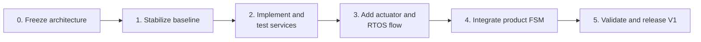

### Phase 0 - Architecture Baseline

- approve this document;
- record remaining hardware decisions;
- create the dedicated architecture commit.

Exit criterion: the team agrees on layer boundaries, task model, events, state
machines, safety invariants and V1 scope.

### Phase 1 - Stable Low-Level Baseline

- make Debug and release-equivalent build inputs consistent;
- reconcile `.ioc` peripheral configuration with generated source;
- correct critical component and Platform contract violations;
- validate keyboard, LCD, LED, buzzer, time and PWM paths on target;
- establish the actuator-safe electrical level.

Exit criterion: every existing component has a repeatable target smoke test and
no unresolved issue can cause or prolong an unsafe actuator state.

### Phase 2 - Services and Host Tests

- finalize service public contracts and configuration types;
- implement Credential Entry, Authentication and Timeout Validation first;
- implement non-blocking Display Render, Status Indication and Sound Generator;
- add Lock Control and the Power Management PM0/PM1 skeleton;
- implement host fakes and service-level tests.

Exit criterion: all pure business behavior passes host tests without STM32 HAL
or FreeRTOS dependencies.

### Phase 3 - Actuator and FreeRTOS Execution

- implement and target-test the Lock Actuator component;
- configure FreeRTOS for static allocation and required hooks;
- create the static event queue and the two project tasks;
- measure scan period, event latency, stack use and queue occupancy;
- validate queue-overflow and critical-hook safety behavior.

Exit criterion: key actions reach the Application Task deterministically and a
bounded test command can never leave the actuator unlocked past its deadline.

### Phase 4 - Product FSM Integration

- implement the full Lock Controller FSM;
- connect services, UI feedback and lock control;
- validate boot, normal access, denial, timeout, lockout and fault paths;
- exercise degraded UI behavior and reset-during-unlock safety.

Exit criterion: every state and transition in this document is observable,
tested and has a defined recovery path.

### Phase 5 - V1 Qualification

- execute the target acceptance scenarios;
- run long-duration and fault-injection tests;
- close timing, stack and queue measurements;
- update module READMEs and release notes;
- tag the reproducible V1 build only after all critical criteria pass.

Exit criterion: functional V1 scope is complete with no open safety-critical
defect. PM2 and PM3 may continue after this point if they would jeopardize the
one-month functional MVP target.

### Four-Week Planning Guardrail

| Week | Primary objective |
| --- | --- |
| 1 | Architecture approval, build parity, critical low-level corrections |
| 2 | Services, host tests and actuator component |
| 3 | FreeRTOS tasks, event flow and full product FSM integration |
| 4 | Fault injection, measurements, documentation and V1 qualification |

This is a scope guardrail, not a substitute for measured progress. Features
outside the defined V1 scope do not displace a safety, integration or validation
item.

---

## Architecture Governance

This baseline is frozen for V1 implementation. Frozen means that implementation
must follow it and changes require evidence and review; it does not mean that a
known mistake can never be corrected.

### Frozen Decisions

| ID | Decision | Rationale |
| --- | --- | --- |
| `ARCH-001` | STM32F411CEU6 and the committed `.ioc` file define the target | Matches the real project and board integration |
| `ARCH-002` | Dependency direction is Application -> Services -> Components -> Platform -> HAL | Preserves portability and testability |
| `ARCH-003` | V1 has exactly two project-owned tasks | Deterministic input plus simple serialized behavior |
| `ARCH-004` | The Application Task is the only owner of services and output drivers | Avoids mutexes and split state ownership |
| `ARCH-005` | Keyboard events cross one bounded static queue | Makes the concurrency boundary explicit |
| `ARCH-006` | Application behavior is event-driven with a 10 ms maximum heartbeat | Combines responsiveness and non-blocking effects |
| `ARCH-007` | The full eight-state Lock Controller FSM is implemented | Makes boot, denial, lockout and fault behavior explicit |
| `ARCH-008` | Every unlock is finite and independently deadline-protected | Core safety invariant |
| `ARCH-009` | Services and drivers do not depend on FreeRTOS | Keeps business and hardware modules host-testable |
| `ARCH-010` | Application RTOS objects use static allocation | Predictable memory and startup behavior |
| `ARCH-011` | V1 uses bounded synchronous I2C owned by the Application Task | Sufficient for the current LCD path without bus-task complexity |
| `ARCH-012` | There is no task per service and no effects task in V1 | Avoids unjustified scheduling and synchronization |
| `ARCH-013` | Power Management shares the Application Task and is introduced in stages | Preserves the MVP while enabling battery work |
| `ARCH-014` | No application-owned dynamic allocation | Eliminates fragmentation and runtime allocation failure |

### What Requires an Architecture Change

The root README and, when useful, an Architecture Decision Record shall be
updated before or with a change that:

- adds, removes or changes the responsibility of a task;
- changes resource ownership or introduces a mutex;
- changes the layer dependency direction;
- adds an asynchronous bus, DMA completion path or new inter-task channel;
- changes an FSM state, transition, safety invariant or product deadline;
- permits deep sleep in a new product state;
- changes the critical/degradable classification of a dependency;
- moves a feature into or out of V1 scope;
- introduces dynamic allocation after startup;
- changes actuator safe polarity or the unlock fail-safe mechanism.

Changing an internal helper, improving an algorithm without changing its public
contract, fixing a documented defect or adding a conforming unit test does not
require an architecture revision.

### Change Procedure

1. State the observed problem or new requirement.
2. Provide target measurements, test evidence or a concrete product need.
3. Compare the smallest viable alternatives and their safety impact.
4. Record the decision and update this baseline first.
5. Update affected public APIs, module READMEs and tests in the same change.
6. Review the implementation against the revised invariant or contract.

Architecture is not expanded for hypothetical reuse. A third task, additional
queue, bus manager, event group or deep-sleep mechanism requires evidence that
the two-task baseline cannot meet a measured requirement.

---

## Current Project Status

This section separates committed implementation from the target architecture.
The architecture sections above are normative even when a listed module is not
implemented yet.

### Implementation Inventory

| Area | Current state | V1 architectural destination |
| --- | --- | --- |
| STM32Cube project | Present for STM32F411CEU6 | Reconcile and keep generated configuration reproducible |
| GPIO, I2C, PWM and Time Platforms | Implemented baseline | Harden contracts and keep HAL out of public upper layers |
| Buzzer driver | Implemented baseline with README | Used only by Sound Generator service |
| HD44780 plus PCF8574/PWM adapters | Implemented baseline with README | Used only through Display Render service |
| LED driver | Implemented baseline with README | Used only through Status Indication service |
| Matrix Keyboard plus GPIO adapter | Implemented baseline with README | Owned by Keyboard Task |
| PCF8574 driver | Implemented baseline with README | Owned through the LCD bus adapter |
| Application Core | Skeleton | Composition root, static RTOS objects and task entry points |
| Lock Controller | Skeleton | Full Electronic Lock FSM |
| Six initial services | API/source skeletons | Implement and test contracts defined here |
| Lock Actuator component | Not present | Required before product integration |
| Lock Control service | Not present | Required before product integration |
| Power Management service | Not present | PM0/PM1 skeleton during MVP; deep sleep later |
| FreeRTOS integration | Not present | Two static tasks and one static event queue |
| Automated tests | Not present | Host unit suite plus target and product acceptance tests |

### Known Baseline Corrections Before Integration

The architecture review identified issues that should be handled in Phase 1,
not silently folded into service development:

- verify that Debug and release-equivalent configurations compile the same
  application, Platform and library sources;
- reconcile TIM2/time configuration in the `.ioc` file with committed generated
  code and the chosen FreeRTOS timebase;
- decide and document whether keyboard EXTI is wake-only or part of acquisition;
  normal V1 acquisition remains periodic scanning;
- remove STM32 HAL types from hardware-independent public contracts where they
  leak through the abstraction boundary;
- review HD44780 command, cursor, initialization and adapter status propagation;
- review PCF8574 shadow-state behavior after failed writes;
- verify LED active-level handling and safe initialization;
- strengthen matrix keyboard configuration and pointer validation;
- verify PWM timer channel, polarity, start/stop and duty-cycle contracts;
- validate that every existing driver timeout and error status is finite and
  observable by its owner.

These are bounded corrective items, not permission to redesign the architecture.
Each correction shall preserve public intent where possible and update the
relevant driver README if its contract changes.

### Import and Build

1. Clone the repository.
2. In STM32CubeIDE, use **File -> Import -> Existing Projects into Workspace**.
3. Select the repository directory.
4. Open [`Electronic-Lock.ioc`](Electronic-Lock.ioc) to inspect or regenerate
   STM32Cube configuration.
5. Build the Debug configuration for the current baseline.
6. Before V1 release, create or validate a release-equivalent configuration with
   identical project-owned source coverage.

The project uses the STM32CubeIDE-managed GNU Arm toolchain and committed linker
scripts. A successful build alone is not proof of hardware safety; target smoke
tests remain mandatory.

### Reference Documentation

- [Original V1 scope and architecture reference](References/Architecture/Architecture-V1.pdf)
- [Platform layer documentation](Platforms/README.md)
- [Buzzer driver](Libs/Components/Buzzer/README.md)
- [HD44780 driver and adapters](Libs/Components/HD44780/README.md)
- [LED driver](Libs/Components/Led/README.md)
- [Matrix Keyboard driver and adapter](Libs/Components/MatrixKeyboard/README.md)
- [PCF8574 driver](Libs/Components/PCF8574/README.md)

---

## License

This project is distributed under the terms in the repository
[`LICENSE`](LICENSE) file.
