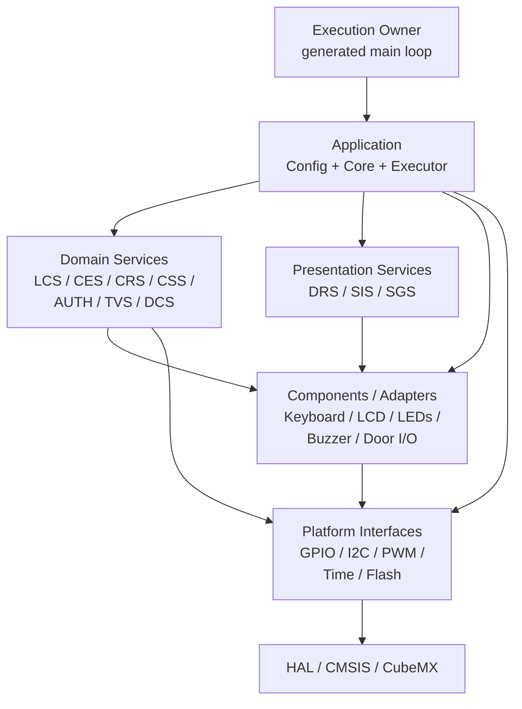
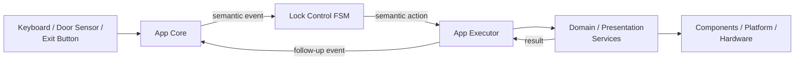
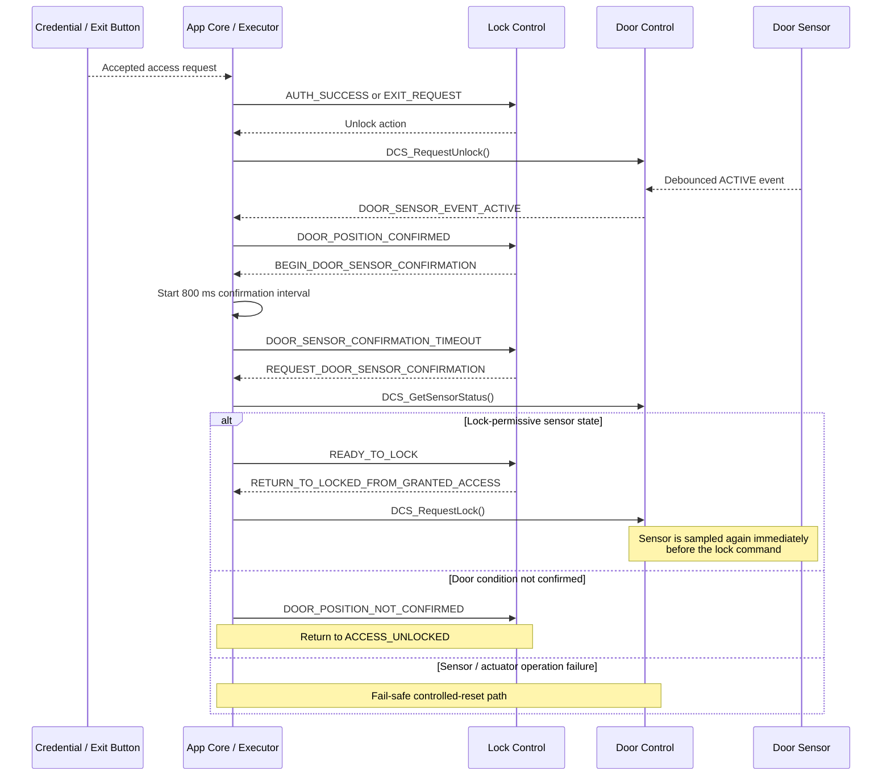

# STM32F103C8T6 Electronic Lock

Layered embedded firmware for an STM32F103C8T6 electronic access-control prototype with a 4x4 matrix keyboard, 16x2 character LCD, status LEDs, passive buzzer, door sensor, request-to-exit button and GPIO-controlled lock actuator.

**Target:** STM32F103C8T6 / Arm Cortex-M3  
**Language:** C11  
**Build:** CMake + Ninja + GNU Arm Embedded Toolchain  
**Execution model:** serialized, synchronous and cooperative  
**Architecture:** Application / Services / Components / Platform / STM32 HAL

> [!NOTE]
> This repository is an **engineering prototype**. Its purpose is not only to operate an electronic lock, but to exercise production-oriented embedded-software practices such as explicit dependency boundaries, event-driven state machines, fail-safe actuator policy, persistent-data integrity, hardware abstraction and native-host verification.

## Contents

1. [Project Overview](#project-overview)
2. [Architecture](#architecture)
3. [Product Behavior](#product-behavior)
4. [Hardware Baseline](#hardware-baseline)
5. [Safety and Security](#safety-and-security)
6. [Build](#build)
7. [Verification](#verification)
8. [Known Constraints](#known-constraints)
9. [Documentation Map and Authority](#documentation-map-and-authority)

---

## Project Overview

The project implements a complete local electronic-lock workflow while keeping product policy separate from STM32 hardware access.

The current firmware supports:

- mandatory first-boot credential enrollment when no valid credential exists in Flash;
- one persistent six-digit numeric credential;
- authenticated credential replacement;
- masked credential entry through a 4x4 matrix keyboard;
- local authentication with consecutive-failure tracking;
- temporary lockout after repeated authentication failures;
- authenticated entry and request-to-exit unlock paths;
- door-position-aware relock through the Door Control Service;
- interrupt handoff with deferred debounce for the door sensor and exit button;
- semantic LCD, LED and buzzer presentation services;
- persistent credential validation through marker, CRC and post-write verification;
- fail-safe actuator recovery and controlled reset for critical application faults;
- native-host behavioral verification of the Lock Control FSM.

### Engineering highlights

The firmware is intentionally structured to expose engineering decisions that remain relevant beyond the electronic-lock use case:

- **Table-driven product FSM** — Lock Control owns product states, events, guards, counters, pending intent, internal effects and semantic action selection without directly accessing peripherals.
- **Decision/execution separation** — Lock Control returns semantic actions; App Executor performs the corresponding service, actuator and presentation operations.
- **Explicit dependency direction** — reusable services and components do not depend on the application layer, and STM32-specific access is isolated behind application configuration and Platform boundaries.
- **Static composition** — application runtime objects have static storage duration and the product uses no dynamic allocation.
- **Door-mechanism service boundary** — the lock actuator, door sensor and exit button are coordinated through Door Control rather than manipulated independently by product policy.
- **Deferred interrupt processing** — EXTI callbacks only hand off edge timestamps; debounce and semantic event dispatch run later in serialized application context.
- **Cooperative timing model** — product-level timeouts and presentation patterns are timestamp-driven rather than implemented with human-scale blocking delays.
- **Persistent-memory ownership** — the linker reserves a complete STM32F103 Flash page for the credential record so executable sections cannot silently overlap its erase unit.
- **Fail-safe recovery paths** — normal relock remains door-interlocked, while explicit fault recovery can request a forced safe lock before controlled reset.
- **Native production-code testing** — host tests compile the real Lock Control implementation and verify its public event/action behavior in isolated processes.
- **Reproducible cross-build** — Debug and Release firmware configurations are described by CMake presets and an `arm-none-eabi` toolchain file.

> [!IMPORTANT]
> The current runtime is synchronous and cooperative. App Core creates no FreeRTOS tasks, queues, mutexes or software timers.

> [!IMPORTANT]
> Generated [`main.c`](Core/Src/main.c) initializes the application once and continuously calls `App_ReadInput()` and `App_Dispatch()`. The public application API is non-reentrant and is expected to remain serialized by the execution owner.

### Current status

| Area | Current state |
| --- | --- |
| Target and CubeMX project | STM32F103C8T6 configuration present and generated for the current hardware baseline |
| Firmware build | CMake + Ninja + GNU Arm Embedded Toolchain with Debug and Release presets |
| Platform layer | GPIO, I2C, PWM, Time and internal Flash implemented |
| Components | Keyboard, LCD, PCF8574, LED, buzzer, lock actuator, door sensor and exit button implemented |
| Domain services | Lock Control, Credential Entry, Credential Register, Credential Storage, Authentication, Timeout Validation and Door Control implemented |
| Presentation services | Display Render, Status Indication and Sound Generator implemented |
| Door mechanism | Lock actuator, door sensor and exit button integrated through Door Control |
| Persistent credential | Linker-reserved Flash page, marker, CRC, idempotent save and post-write verification implemented |
| Native host verification | 20 independently executable Lock Control scenarios registered with CTest |
| Hardware-in-the-loop verification | Manual target validation exists; broader automated HIL coverage remains future work |
| Continuous integration | Reproducible local build/test commands exist; repository CI is not yet implemented |
| Power management | Low-battery indication infrastructure exists; battery measurement and low-power product policy are not yet implemented |

The prototype is intentionally single-device and single-credential. It does not currently provide multi-user management, access logging, connectivity, tamper response, secure-element-backed credentials or certified access-control guarantees.

---

## Architecture

### Layered organization



The architecture is defined primarily by **dependency direction**, not by the number of directories.

- `main.c` sees only the public App Core interface.
- `App/` owns product composition, startup, event routing, timeout ownership and semantic action execution.
- **LCS** owns authoritative product behavior and policy but performs no hardware or UI side effects.
- **DCS** owns door-mechanism coordination and the normal relock interlock.
- **CES** owns the active credential candidate.
- **CRS** owns temporary registration staging and confirmation comparison.
- **CSS** owns the persistent credential record format and Flash transaction policy.
- **AUTH** performs synchronous credential comparison.
- **TVS** provides rollover-safe elapsed-time validation for caller-owned intervals.
- presentation services convert semantic product feedback into LCD, LED and sound behavior.
- components implement reusable device behavior.
- Platform interfaces isolate reusable code from STM32 HAL and CubeMX details.

### Application execution model

The public application interface is intentionally small:

```c
App_InitStatus_t App_Init      (void);
void             App_ReadInput (void);
void             App_Dispatch  (void);
```

The generated execution owner follows the cooperative model:

```c
if(App_Init() != APP_INIT_SUCCESSFULLY)
{
    Error_Handler();
}

while(1)
{
    App_ReadInput();
    App_Dispatch();
}
```

`App_ReadInput()` performs one non-blocking keyboard acquisition step and routes a completed key action when available.

`App_Dispatch()` advances the serialized runtime by:

- checking the active product timeout;
- updating Door Control and processing debounced physical-input events;
- updating display, indication and sound services;
- dispatching semantic events to Lock Control;
- executing the semantic action returned by Lock Control.

A synchronous action result may immediately produce another LCS event. App Core bounds this follow-up chain with `APP_MAX_LCS_DISPATCH_DEPTH` so an accidental event/action cycle cannot monopolize the cooperative execution owner indefinitely.

### Semantic control flow



The central design rule is:

> **Lock Control decides what the product shall do; App Executor and the lower layers decide how the requested operation is performed.**

---

## Product Behavior

### Core access flow

Authenticated entry and request-to-exit use different authorization paths but converge on the same post-unlock door-aware relock behavior.



The repeated sensor read is deliberate. `DCS_GetSensorStatus()` authorizes the FSM's readiness decision; `DCS_RequestLock()` performs the final physical interlock immediately before commanding the actuator.

### Credential lifecycle

The product supports two credential-registration routes:

- **first boot** — if no valid credential exists, enrollment is mandatory and does not require prior authentication;
- **runtime replacement** — changing an installed credential requires successful authentication of the current credential first.

A registration operation collects a first new candidate and a confirmation candidate. CRS compares the staged values, while Lock Control owns the retry/mismatch policy.

After successful validation:

1. the credential is persisted through Credential Storage;
2. the application updates its runtime credential copy only after storage succeeds;
3. temporary application/registration copies are explicitly cleared;
4. normal replacement returns to locked idle;
5. first-boot enrollment completes through controlled reset so the next startup validates and reloads the persisted credential through the normal boot path.

### Current product parameters

The values below summarize the current product configuration. The compile-time definitions in [`App_Config.h`](App/Config/Inc/App_Config.h), the participating service headers and the Lock Control policy remain authoritative.

| Parameter | Current value |
| --- | ---: |
| Credential length | 6 digits |
| Consecutive authentication failure limit | 3 |
| Credential-confirmation mismatch limit | 3 |
| Keyboard debounce | 40 ms |
| Door-sensor debounce | 500 ms |
| Exit-button debounce | 20 ms |
| Credential-entry inactivity | 5,000 ms |
| Door-position confirmation interval | 800 ms |
| Access-denied feedback | 1,500 ms |
| Lockout | 10,000 ms |
| Credential-saved feedback | 1,500 ms |
| Synchronous LCS follow-up limit | 4 actions/events |
| Persistent credential record | 8 bytes |
| Reserved credential Flash region | 1 KiB / final Flash page |

> [!NOTE]
> The previous standalone authorized-unlock timeout is no longer part of the product FSM. Once access is granted, the firmware remains in the unlocked-access path until the required door-position sequence is observed and safely confirmed.

---

## Hardware Baseline

The current target is an **STM32F103C8T6** running at **72 MHz** from an 8 MHz HSE through PLL x9.

The generated hardware configuration is maintained in [`Electronic-Lock.ioc`](Electronic-Lock.ioc). Product-side bindings are centralized through [`App_Config.h`](App/Config/Inc/App_Config.h).

| Resource | Current assignment |
| --- | --- |
| PB15..PB12 | Keyboard rows 0..3, pull-up, rising/falling EXTI |
| PA6..PA3 | Keyboard columns 0..3, push-pull outputs |
| PB10 | Lock-status LED |
| PB11 | Low-battery status LED |
| PA8 | Lock actuator, active-low locked command |
| PA11 | Door sensor, pull-up, active-low, rising/falling EXTI |
| PA0 | Exit button, pull-up, active-low, rising/falling EXTI |
| PB8 / PB9 | I2C1 SCL / SDA |
| PB4 | TIM3 channel 1 buzzer PWM |
| PB6 | TIM4 channel 1 LCD-backlight PWM |
| TIM2 | Raw microsecond counter used by `Platform_GetMicros()` |
| PA9 / PA10 | USART1 TX / RX |
| PA13 / PA14 | SWDIO / SWCLK |

### Startup safe-state baseline

CubeMX initializes PA8 low, which corresponds to the configured locked electrical request.

During `App_Init()`, the application then:

1. initializes the lock-actuator Platform GPIO descriptor;
2. initializes the Lock Actuator component with active-low lock polarity;
3. explicitly calls `LockActuator_Lock()`;
4. aborts initialization if any of those operations fail.

This provides an application-level locked request in addition to the generated GPIO startup state.

Firmware state represents the **commanded electrical actuator state**, not verified mechanical bolt engagement. The Door Sensor represents the configured door-contact condition and is not direct actuator-position feedback.

### Interrupt boundary

The application-owned EXTI callback performs handoff only.

For the door sensor and exit button it:

- captures the application millisecond timestamp;
- publishes the edge to the corresponding component driver;
- performs no debounce calculation;
- dispatches no Lock Control event;
- commands no actuator.

Deferred processing belongs to Door Control in serialized application context.

---

## Safety and Security

### Safety policy

The current design treats the configured locked actuator command as the safe electrical request.

Key invariants are:

- PA8 low corresponds to the configured locked command.
- Startup explicitly requests the locked actuator state after driver initialization.
- Normal relock is allowed only through the Door Control interlock.
- `DCS_RequestLock()` samples the Door Sensor immediately before commanding the actuator.
- `DCS_ForceLock()` is intentionally separate from normal relock and is reserved for fail-safe recovery.
- unlock requests originate only after product policy has authorized access.
- an unlock-command failure first attempts to restore the safe lock command; failure of that recovery escalates to a critical fault.
- controlled-reset cleanup cancels active timing, clears transient credential state, requests a forced lock, stops sound and disables the LCD backlight before reset.
- product-state transitions and actuator commands are never executed from GPIO interrupt context.
- the cooperative owner must continue calling `App_Dispatch()` so timeout, input, presentation and relock processing can advance.

The detailed failure mapping is maintained in [`App/README.md`](App/README.md).

### Credential ownership

Credential lifetime is deliberately split across modules:

- **CES** owns the active user-entry candidate;
- **CRS** owns temporary registration staging;
- **CSS** owns the on-Flash representation and persistence transaction, but no long-lived RAM credential;
- **App Config** owns the runtime credential buffer used by authentication;
- **App Executor** creates bounded temporary copies for synchronous operations and explicitly overwrites them after use;
- presentation services receive only semantic state and masked entry progress, never raw credential digits.

### Persistent-data integrity

Credential Storage uses one V1 record in the final 1 KiB Flash page:

```text
FLASH             0x08000000 .. 0x0800FBFF   63 KiB executable region
CREDENTIAL_FLASH  0x0800FC00 .. 0x0800FFFF    1 KiB reserved page
```

Record layout:

```text
byte 0..5  six normalized decimal digits
byte 6     marker 0xA5
byte 7     CRC-8/ATM over digits + marker
```

The storage service validates the complete record, avoids unnecessary rewrites when the requested valid record is already present, relocks Flash after programming attempts and performs post-write readback plus record validation.

These mechanisms provide **format and accidental-corruption detection**, not cryptographic security.

### Security boundary

The prototype does not currently provide:

- encryption at rest;
- salted hashing or a cryptographic password verifier;
- authenticity against deliberate Flash modification;
- secure-element-backed storage;
- automatic debug/readout-protection provisioning;
- tamper detection or response;
- invasive physical-extraction resistance;
- audit/access logging;
- certified access-control security guarantees.

A party with sufficient access to internal Flash can recover or replace the stored credential representation and calculate a matching CRC. Production deployment would therefore require a separate threat model, provisioning strategy and security review.

---

## Build

### Firmware prerequisites

The current firmware build expects:

- CMake 3.22 or newer;
- Ninja;
- GNU Arm Embedded tools available through the `arm-none-eabi-` prefix;
- STM32Cube-generated sources already present in the repository.

The root [`CMakePresets.json`](CMakePresets.json) defines separate `Debug` and `Release` configurations and uses [`cmake/gcc-arm-none-eabi.cmake`](cmake/gcc-arm-none-eabi.cmake).

### Build the STM32 firmware

Debug:

```sh
cmake --preset Debug
cmake --build --preset Debug
```

Release:

```sh
cmake --preset Release
cmake --build --preset Release
```

The build produces the firmware ELF and map output and reports linker memory usage. `compile_commands.json` is exported for tooling such as `clangd`.

The active linker script is [`STM32F103xx_FLASH.ld`](STM32F103xx_FLASH.ld), which separates executable Flash from the credential page.

### Run native host tests

The `Tests/` project is intentionally independent from the ARM cross-build and must be configured with a native development-host compiler:

```sh
cmake -S Tests -B build/host-tests -DCMAKE_BUILD_TYPE=Debug
cmake --build build/host-tests --parallel
ctest --test-dir build/host-tests --output-on-failure
```

On GCC/Clang-style host compilers, the production LCS implementation and host harness compile with:

```text
-Wall -Wextra -Wpedantic -Werror
```

Do not configure the native tests through the root ARM firmware presets.

---

## Verification

### Native host verification

The current automated suite is a black-box behavioral verification of the production **Lock Control Service**.

It intentionally:

- compiles the production `Lock_Control_Service.c`;
- includes only the public LCS interface;
- does not expose private FSM state;
- does not duplicate the production transition table;
- runs each scenario in a fresh process so the private singleton starts from its natural static boot state;
- compares public input events with the exact semantic actions returned by `LCS_Process()`;
- treats compiler warnings as errors;
- applies a bounded per-scenario timeout.

The current baseline contains **20 independently executable CTest scenarios**. Coverage includes:

- boot gating and initialization failure;
- normal authenticated access;
- cancellation and inactivity paths;
- authentication failure counting and lockout;
- authentication-success counter reset;
- first-boot mandatory enrollment;
- first-boot cancellation containment and timeout preservation;
- authenticated credential replacement;
- registration mismatch retries and third-mismatch restart;
- persistent-storage failure;
- invalid and out-of-context event preservation;
- request-to-exit access;
- request-to-exit preservation of authentication-failure history;
- door-confirmation/relock recovery;
- unlock-command failure recovery;
- critical escalation when safe-lock recovery also fails.

See [`Tests/README.md`](Tests/README.md) for the authoritative scenario catalog, exact expectations and debugging workflow.

### Target verification boundary

Host tests validate the hardware-independent Lock Control event/action contract. They do **not** replace target verification of:

- electrical actuator polarity and safe startup;
- GPIO/EXTI delivery;
- real debounce behavior;
- I2C/PWM/timer behavior;
- LCD command timing;
- physical door-sensor interpretation;
- Flash behavior under real power interruption;
- mechanical lock engagement;
- end-to-end hardware timing.

Broader service integration and hardware-in-the-loop automation remain future verification work.

---

## Known Constraints

The following limitations describe the current implementation and are intentionally kept visible.

- **Main-loop timing is not yet characterized.** Worst-case dispatch latency, input-response latency and timeout-observation error still need measured values.
- **LCD operations are synchronous.** The HD44780 driver uses fixed execution delays rather than reading the busy flag, so display operations can block for their bounded communication/timing duration.
- **Presentation failures are generally degraded-feedback faults.** Not every LCD, LED or sound failure is promoted to a global operational fault.
- **Low-battery sensing is not implemented.** The indication path exists, but no ADC measurement source or product threshold policy currently drives it.
- **Keyboard EXTI is configured while normal acquisition is polling.** Its final wake-only or unused interrupt policy remains open.
- **TIM2 microsecond wrap semantics require explicit validation.** `Platform_GetMicros()` exposes the raw hardware counter and callers must respect its actual width and wrap interval.
- **Automated coverage is concentrated on LCS.** CES, CRS, CSS, DCS, App integration and hardware-in-the-loop paths still need broader automated verification.
- **No repository CI quality gate exists yet.** Build and test commands are reproducible locally, but push/PR automation has not yet been added.
- **Only one product timeout can be active at a time.** App Core relies on mutually exclusive timed FSM phases; it is not a general overlapping-timer facility.
- **The application is non-reentrant.** A future RTOS or multithreaded owner would require explicit ownership and synchronization.
- **Power management is not integrated.** No STOP/sleep product policy is active.
- **Credential storage is single-slot.** The V1 record has no redundant A/B slot, journal, generation counter, commit record or wear leveling.
- **Interrupted credential replacement can lose the previous credential.** Marker and CRC reject an incomplete new record but cannot preserve the erased previous record.
- **The credential is recoverable from Flash.** CRC is not encryption, hashing or authentication.
- **`CSS_HasCredential()` collapses unavailable conditions.** Erased, malformed, corrupted and unreadable records appear as the same Boolean result to its caller.
- **First-boot inactivity timeout remains intentionally unspecialized.** `LCS_EVENT_ENTRY_TIMEOUT` has no dedicated first-boot registration transition; it is ignored while mandatory enrollment remains active.
- **No direct lock-bolt position feedback exists.** Firmware knows the commanded actuator state and door-contact state, not confirmed mechanical lock engagement.
- **Security provisioning remains external.** Debug/readout protection, secure provisioning and tamper policy require a separate product-security design.

---

## Documentation Map and Authority

The root README is intentionally a **project-level overview**, not the canonical specification for every module.

### Documentation map

| Topic | Canonical project document |
| --- | --- |
| Application composition and orchestration | [`App/README.md`](App/README.md) |
| Product hardware bindings and compile-time configuration | [`App/Config/README.md`](App/Config/README.md) and [`App_Config.h`](App/Config/Inc/App_Config.h) |
| Lock Control FSM | [`Libs/Services/Lock_Control/README.md`](Libs/Services/Lock_Control/README.md) |
| Door mechanism and relock policy | [`Libs/Services/Door_Control/README.md`](Libs/Services/Door_Control/README.md) |
| Credential entry | [`Libs/Services/Credential_Entry/README.md`](Libs/Services/Credential_Entry/README.md) |
| Credential registration | [`Libs/Services/Credential_Register/README.md`](Libs/Services/Credential_Register/README.md) |
| Persistent credential storage | [`Libs/Services/Credential_Storage/README.md`](Libs/Services/Credential_Storage/README.md) |
| Authentication | [`Libs/Services/Authentication/README.md`](Libs/Services/Authentication/README.md) |
| Timeout utility | [`Libs/Services/Timeout_Validation/README.md`](Libs/Services/Timeout_Validation/README.md) |
| Platform abstraction | [`Platforms/README.md`](Platforms/README.md) |
| Native host verification | [`Tests/README.md`](Tests/README.md) |
| Generated hardware configuration | [`Electronic-Lock.ioc`](Electronic-Lock.ioc) |
| Flash partitioning | [`STM32F103xx_FLASH.ld`](STM32F103xx_FLASH.ld) |

Component and presentation-service READMEs provide module-specific design notes and usage constraints under [`Libs/Components`](Libs/Components) and [`Libs/Services`](Libs/Services).

### Source-of-truth policy

Different artifacts own different kinds of information:

- **CubeMX hardware configuration:** `Electronic-Lock.ioc`
- **memory partitioning:** the active linker script
- **product-specific compile-time bindings and timing values:** `App_Config.h`
- **public callable contracts and public types:** module headers
- **implemented runtime behavior:** production source files
- **complete Lock Control behavioral model:** production LCS source plus the Lock Control README
- **verification scenario catalog:** `Tests/README.md`
- **design rationale and module-level constraints:** the corresponding module README
- **project-level summary:** this root README

When a summary in this file disagrees with the artifact that owns the corresponding contract, the owning artifact shall be treated as authoritative and this README shall be corrected.

---

The project is distributed under the terms of [LICENSE](LICENSE).
