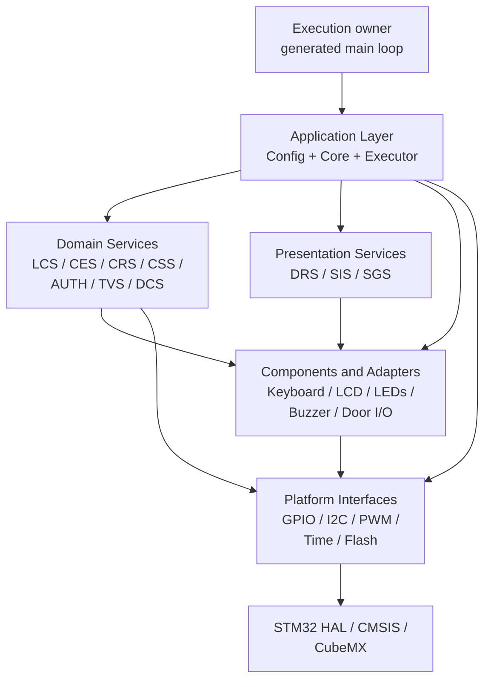
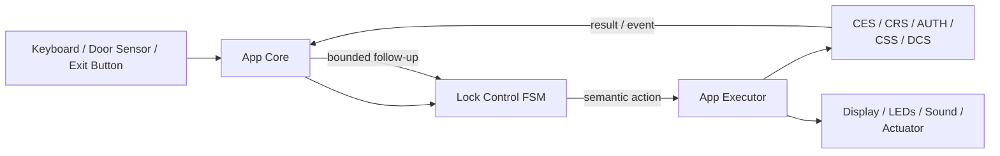
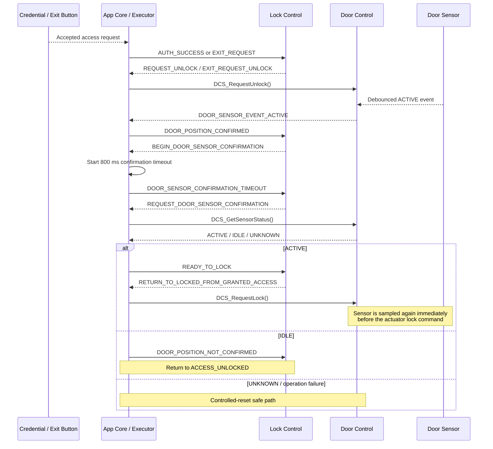

# STM32F103C8T6 Electronic Lock

Layered embedded firmware for an STM32F103C8T6 electronic access-control prototype with a 4x4 matrix keyboard, 16x2 LCD, status LEDs, passive buzzer, door sensor, request-to-exit button and GPIO-controlled lock actuator.

**Target:** STM32F103C8T6 / Arm Cortex-M3  
**Language:** C11  
**Build:** CMake + Ninja + GNU Arm Embedded Toolchain  
**Execution model:** serialized, synchronous and cooperative  
**Architecture:** Application / Services / Components / Platform / STM32 HAL

> [!NOTE]
> This repository is an **engineering prototype**. Its goal is not only to operate an electronic lock, but to exercise production-oriented embedded-software practices such as explicit architectural boundaries, event-driven state machines, non-blocking runtime behavior, persistent-data integrity checks, fail-safe actuator policy and native-host verification.

## Contents

1. [Project Overview](#project-overview)
2. [Product Contract](#product-contract)
3. [Hardware Baseline](#hardware-baseline)
4. [Architecture and Documentation](#architecture-and-documentation)
5. [Safety and Security](#safety-and-security)
6. [Build and Integration](#build-and-integration)
7. [Verification](#verification)
8. [Known Constraints](#known-constraints)
9. [Documentation Authority](#documentation-authority)

---

## Project Overview

The project implements a complete local electronic-lock workflow while keeping product policy separate from STM32 hardware access.

The current firmware supports:

- first-boot credential registration when no valid credential exists in Flash;
- one persistent six-digit numeric credential;
- authenticated credential replacement;
- masked credential entry through a 4x4 matrix keyboard;
- local authentication with consecutive-failure tracking;
- temporary lockout after repeated authentication failures;
- authenticated entry and request-to-exit unlock paths;
- door-position-aware relock through the Door Control Service;
- interrupt handoff plus deferred debounce for the door sensor and exit button;
- non-blocking LCD, LED and sound feedback;
- persistent credential integrity checking with marker, CRC and post-write verification;
- controlled-reset cleanup for critical application faults;
- native-host behavioral verification of the Lock Control Service FSM.

### Engineering highlights

The firmware intentionally emphasizes architectural and verification concerns that are commonly relevant in larger embedded systems:

- **Table-driven product FSM** — Lock Control owns product state, guards, counters, pending intent and semantic action selection without depending on peripherals or STM32 HAL.
- **Explicit dependency direction** — reusable modules do not include the application layer and hardware-dependent STM32 types are kept behind application/configuration and Platform boundaries.
- **Static composition** — runtime objects have static storage duration; the application uses no dynamic allocation.
- **Semantic action boundary** — Lock Control returns actions instead of directly performing hardware or UI side effects.
- **Door-mechanism service boundary** — lock actuator, door sensor and exit button are coordinated through Door Control rather than being independently manipulated by product logic.
- **Deferred interrupt processing** — GPIO EXTI callbacks publish timestamps only; debounce, event interpretation and state-machine dispatch occur later in serialized application context.
- **Non-blocking runtime policy** — product timing is timestamp-based; human-scale delays are not used to implement application timeouts.
- **Persistent-memory ownership** — a complete STM32F103 Flash page is reserved by the linker for the credential record so executable code cannot silently overlap the erase unit.
- **Native production-code testing** — host tests compile the real Lock Control implementation and execute each scenario in a fresh process, preserving the production singleton boundary.
- **Reproducible cross-build** — Debug and Release firmware configurations are described by CMake presets and an `arm-none-eabi` toolchain file.

> [!IMPORTANT]
> The current execution model is synchronous and cooperative. App Core creates no FreeRTOS tasks, queues, mutexes or software timers.

> [!IMPORTANT]
> Generated [`main.c`](Core/Src/main.c) initializes the application once and continuously calls `App_ReadInput()` and `App_Dispatch()` from the main loop. Application APIs are serialized and non-reentrant.

### Current status

| Area | Current state |
| --- | --- |
| Target and CubeMX project | STM32F103C8T6 configuration present and configured for CMake generation |
| Firmware build | CMake + Ninja + GNU Arm Embedded Toolchain; Debug and Release presets present |
| Platform layer | GPIO, I2C, PWM, Time and internal Flash implemented |
| Component layer | Keyboard, LCD, PCF8574, LED, buzzer, lock actuator, door sensor and exit button implemented |
| Domain services | Lock Control, Credential Entry, Credential Register, Credential Storage, Authentication, Timeout Validation and Door Control implemented |
| Presentation services | Display Render, Status Indication and Sound Generator implemented |
| Application layer | Static composition, initialization, event routing, timeout ownership and semantic action execution implemented |
| Door mechanism | Lock actuator, door sensor and exit button integrated through Door Control Service |
| Request to exit | Debounced exit-button press mapped into the Lock Control request-to-exit path |
| Door-aware relock | Debounced close indication, 800 ms confirmation delay, synchronous sensor confirmation and final lock interlock implemented |
| Persistent credential | Linker-reserved Flash page, marker, CRC, idempotent save and post-write verification implemented |
| Automated host verification | 17 independently executable Lock Control FSM scenarios through CTest |
| Low-battery path | LED/indication path exists; battery sensing and product policy remain pending |
| Hardware-in-the-loop verification | Still requires expansion |
| Continuous integration | Reproducible commands are documented; repository CI workflow is not yet implemented |

The prototype remains intentionally single-device and single-credential. It does not provide multi-user management, access logs, connectivity, secure-element-backed credentials, tamper response or certified access-control guarantees.

---

## Product Contract

### Authoritative parameters

| Parameter | Value | Owner |
| --- | ---: | --- |
| Credential length | 6 digits | Credential Entry / Register / Authentication / Storage |
| Consecutive authentication failure limit | 3 | Lock Control |
| Credential-confirmation mismatch limit | 3 | Lock Control |
| Keyboard debounce | 40 ms | Matrix Keyboard configuration |
| Door-sensor debounce | 500 ms | Door Sensor configuration |
| Exit-button debounce | 20 ms | Exit Button configuration |
| Credential-entry inactivity | 5,000 ms | App Core timeout table |
| Door-position confirmation delay | 800 ms | App Core timeout table |
| Access-denied feedback | 1,500 ms | App Core timeout table |
| Lockout | 10,000 ms | App Core timeout table |
| Credential-saved feedback | 1,500 ms | App Core timeout table |
| Synchronous LCS follow-up limit | 4 actions/events | App Core |
| LCD | 16 columns x 2 rows | LCD / App configuration |
| PCF8574 address | `0x20`, 7-bit | App configuration |
| LCD backlight request | 1,500 Hz at 50% initial brightness | App configuration / PWM adapter |
| Persistent credential record | 8 bytes | Credential Storage |
| Reserved credential Flash region | 1 KiB, page 63 | Linker / Credential Storage |

The five product timeout definitions in [`App_Config.h`](App/Config/Inc/App_Config.h) and their semantic LCS events are the current authoritative timing contract.

> [!NOTE]
> The previous standalone authorized-unlock timeout is no longer part of the product FSM. After an accepted credential or request-to-exit event, the firmware remains in the unlocked-access path until the required door-position sequence is observed and safely confirmed.

### Essential business rules

1. **PA8 low is the configured safe locked command.** High requests unlock.
2. On normal startup, the application checks Credential Storage before activating locked idle behavior.
3. If no valid credential record exists, LCS enters the first-registration path directly from boot.
4. The first complete keyboard click while `LOCKED` opens a credential-entry session and is consumed as the wake action.
5. Digits `0` through `9` enter the candidate; `#` confirms and `*` clears or cancels according to CES state.
6. Key `C` during an active credential-entry route changes the pending operation from unlock to credential registration; the currently installed credential must then authenticate before replacement begins.
7. Successful authentication for normal entry moves LCS to `ACCESS_UNLOCKED` and requests `DCS_RequestUnlock()`.
8. A validated request-to-exit press bypasses authentication but converges on the same `ACCESS_UNLOCKED` and door-aware relock sequence.
9. Request-to-exit does not reset or increment the authentication-failure counter.
10. A debounced Door Sensor `ACTIVE` event while access is unlocked starts an 800 ms confirmation interval.
11. After that delay, App Executor requests a synchronous current door-sensor status through DCS.
12. Only a lock-permissive current sensor status generates `READY_TO_LOCK`.
13. Normal relock calls `DCS_RequestLock()`, which samples the Door Sensor again immediately before commanding the actuator.
14. A final lock denial caused by a late door-position change returns the logical flow to `ACCESS_UNLOCKED`; actuator-operation failure enters controlled-reset handling.
15. Authentication failure starts 1.5 seconds of denial feedback. The third consecutive failed authentication enters a 10-second lockout after denial feedback completes.
16. Authentication success and lockout expiry reset the authentication-failure count; request-to-exit does not.
17. Credential replacement requires a first new entry and a confirmation entry. Repeated staging mismatch is bounded by the Lock Control registration policy.
18. A successfully validated replacement is persisted through Credential Storage before the application updates its runtime credential copy.
19. App Core owns one mutually exclusive product timeout at a time and emits each expiration once.
20. Raw credentials are never rendered. Short-lived application-owned copies are explicitly erased after use.

Detailed behavior is maintained in:

- [complete application-layer reference](App/README.md);
- [authoritative Lock Control FSM](Libs/Services/Lock_Control/README.md);
- [Door Control and relock policy](Libs/Services/Door_Control/README.md);
- [Credential Storage and persistent-memory contract](Libs/Services/Credential_Storage/README.md);
- [native host tests for the LCS FSM](Tests/README.md);
- [timeout lifecycle](App/README.md#9-timeout-model);
- [door-control and relock flow](App/README.md#10-door-control-and-relock-flow);
- [public API and execution model](App/README.md#5-public-api-and-execution-model);
- [credential ownership and security](App/README.md#13-credential-ownership-and-security);
- [action execution](App/README.md#12-action-execution).

---

## Hardware Baseline

- MCU: **STM32F103C8T6**, Arm Cortex-M3, LQFP48;
- supply baseline in CubeMX: 3.3 V;
- system clock: **72 MHz from 8 MHz HSE through PLL x9**;
- AHB: 72 MHz;
- APB1: 36 MHz, with 72 MHz timer clock;
- APB2: 72 MHz;
- HAL millisecond tick: `HAL_GetTick()`, configured through the TIM1 update time base;
- raw microsecond source: TIM2 with prescaler 71;
- generated configuration source: [`Electronic-Lock.ioc`](Electronic-Lock.ioc).

| Resource | Assignment |
| --- | --- |
| PB15, PB14, PB13, PB12 | Keyboard rows 0 through 3; pull-up, rising/falling EXTI configuration |
| PA6, PA5, PA4, PA3 | Keyboard columns 0 through 3; push-pull outputs |
| PB10 | Lock-status LED; application config treats it as active-high |
| PB11 | Low-battery status LED; application config treats it as active-high |
| PA8 | Lock actuator; low = configured safe/locked request, high = unlock request |
| PA11 | Door sensor; pull-up, active-low, rising/falling EXTI |
| PA0 | Exit button; pull-up, active-low, rising/falling EXTI |
| PB8 / PB9 | I2C1 SCL / SDA |
| PB4 | TIM3 channel 1 passive-buzzer PWM |
| PB6 | TIM4 channel 1 LCD-backlight PWM |
| TIM2 | Raw hardware counter used by `Platform_GetMicros()` |
| PA9 / PA10 | USART1 TX / RX configured by CubeMX |
| PA13 / PA14 | SWDIO / SWCLK debug interface |

CubeMX currently initializes PA8 low before `App_Init()`. App Core then binds the Platform descriptor and initializes the Lock Actuator Driver, but `App_InitLockActuator()` does not yet issue a redundant explicit lock command after driver initialization. This remains tracked as startup safety debt.

Firmware state describes the **requested electrical lock command**, not verified lock-bolt engagement. Door Sensor feedback describes the configured door-contact state; it is not direct actuator-position feedback.

### Interrupt boundary

`App_ConfigHalCallbacks.c` implements the strong HAL GPIO EXTI callback for the application-owned physical inputs.

For both PA0 and PA11 the callback:

1. captures the common application millisecond timestamp;
2. publishes the edge to the corresponding interrupt-oriented component driver;
3. performs no GPIO sampling;
4. performs no debounce calculation;
5. dispatches no LCS event;
6. commands no actuator.

Deferred processing belongs to `DCS_Update()` in serialized application context.

Hardware and Platform details:

- [CubeMX configuration](Electronic-Lock.ioc);
- [Platform interfaces](Platforms/README.md);
- [App configuration and hardware bindings](App/Config/README.md).

---

## Architecture and Documentation

### Layered architecture



The important boundary is not the number of directories; it is the allowed dependency direction.

- `main.c` sees only the public App Core interface.
- `App/` is the firmware composition and orchestration layer.
- LCS owns authoritative product state and policy but performs no hardware/UI side effects.
- DCS owns door-mechanism coordination and lock interlock but does not include or manipulate LCS state.
- CES owns the active credential candidate.
- CRS owns temporary credential-registration staging and confirmation comparison.
- CSS owns the persistent record format and storage transaction policy.
- presentation services own non-blocking semantic feedback patterns.
- components own reusable device behavior.
- Platform interfaces isolate STM32 HAL/CubeMX mechanics from reusable components and services.

### Application execution model

The only public application API is intentionally small:

```c
App_InitStatus_t App_Init      (void);
void             App_ReadInput (void);
void             App_Dispatch  (void);
```

The current execution owner uses:

```c
if(App_Init() != APP_INIT_SUCCESSFULLY)
{
    Error_Handler();
}

while(1)
{
    App_ReadInput();
    App_Dispatch();
}
```

`App_ReadInput()` performs one non-blocking keyboard acquisition and immediately routes a completed key action.

`App_Dispatch()` advances the serialized runtime by polling the active product timeout, updating Door Control, updating display/indications/sound and mapping validated physical events into semantic LCS events.

### Runtime control flow



A synchronous result may immediately produce another semantic LCS event. App Core bounds this follow-up chain with `APP_MAX_LCS_DISPATCH_DEPTH` so an accidental logic cycle cannot monopolize the cooperative execution owner indefinitely.

### Door-aware relock flow

Authenticated entry and request-to-exit deliberately converge on the same post-unlock mechanism:



The repeated sensor read is deliberate. `DCS_GetSensorStatus()` authorizes the FSM's readiness decision; `DCS_RequestLock()` performs the final physical interlock immediately before commanding the actuator.

### Persistent credential memory model

Credential Storage owns one eight-byte V1 record in the final 1 KiB Flash page:

```text
FLASH             0x08000000 .. 0x0800FBFF   63 KiB executable region
CREDENTIAL_FLASH  0x0800FC00 .. 0x0800FFFF    1 KiB reserved page
```

The C implementation obtains the base through linker symbol `__credential_flash_start__` instead of duplicating the address in service policy code.

Record layout:

```text
byte 0..5  six normalized decimal digits
byte 6     marker 0xA5
byte 7     CRC-8/ATM over digits + marker
```

CSS validates the complete record before exposing digits, avoids unnecessary writes when the requested valid record is already stored, locks Flash after programming attempts and performs exact post-write readback plus record validation.

### Application and infrastructure

| Module | Responsibility | Detailed documentation |
| --- | --- | --- |
| Application Layer | Product composition, initialization, input/event orchestration, timeouts, action execution and UI coordination | [README](App/README.md) |
| App Config | Board/product policy and statically allocated runtime-object registry | [README](App/Config/README.md) |
| Platform | Project-owned GPIO, I2C, PWM, Time and Flash boundary over STM32 | [README](Platforms/README.md) |
| CubeMX Core | Generated startup, clocks, GPIO, I2C, timers, UART and interrupt plumbing | [main.c](Core/Src/main.c), [IOC](Electronic-Lock.ioc) |
| STM32 Drivers | Vendor HAL and CMSIS implementation | [Drivers](Drivers) |

### Domain services

| Service | Responsibility | Detailed documentation |
| --- | --- | --- |
| Lock Control | Authoritative table-driven FSM, guards, counters, pending-operation routing and semantic actions | [README](Libs/Services/Lock_Control/README.md) |
| Door Control | Lock actuator / door sensor / exit button coordination, deferred physical-input processing and normal lock interlock | [README](Libs/Services/Door_Control/README.md) |
| Credential Entry | Active entry session, normalized candidate and clear/cancel semantics | [README](Libs/Services/Credential_Entry/README.md) |
| Credential Register | Temporary first-entry staging and confirmation validation for credential replacement | [README](Libs/Services/Credential_Register/README.md) |
| Credential Storage | Persistent record format, integrity validation and internal-Flash transaction policy | [README](Libs/Services/Credential_Storage/README.md) |
| Authentication | Synchronous comparison of one complete candidate against the installed credential | [README](Libs/Services/Authentication/README.md) |
| Timeout Validation | Rollover-safe evaluation of caller-owned millisecond intervals | [README](Libs/Services/Timeout_Validation/README.md) |

### Presentation services

| Service | Responsibility | Detailed documentation |
| --- | --- | --- |
| Display Render | Semantic screens and masked credential progress | [README](Libs/Services/Display_Render/README.md) |
| Status Indication | Non-blocking semantic LED patterns | [README](Libs/Services/Status_Indication/README.md) |
| Sound Generator | Non-blocking semantic buzzer patterns and priority | [README](Libs/Services/Sound_Generator/README.md) |

### Components and adapters

| Component | Responsibility | Detailed documentation |
| --- | --- | --- |
| Matrix Keyboard | Matrix scan, per-key debounce and complete key actions | [README](Libs/Components/MatrixKeyboard/README.md) |
| LCD | HD44780 behavior, PCF8574 bus adapter and PWM backlight adapter | [README](Libs/Components/LCD/README.md) |
| PCF8574 | I2C I/O-expander access and output-port shadow | [README](Libs/Components/PCF8574/README.md) |
| LED | Active-level-independent digital LED control | [README](Libs/Components/Led/README.md) |
| Buzzer | Passive-buzzer PWM control | [README](Libs/Components/Buzzer/README.md) |
| Lock Actuator | Polarity-independent digital lock/unlock commands | [README](Libs/Components/LockActuator/README.md) |
| Door Sensor | Interrupt-oriented, polarity-independent debounced door-contact state | [README](Libs/Components/DoorSensor/README.md) |
| Exit Button | Interrupt-oriented, non-blocking debounced request-to-exit events | [README](Libs/Components/ExitButton/README.md) |

---

## Safety and Security

### Safety invariants

The current design treats the actuator's configured locked command as the safe electrical request.

- PA8 shall be low during startup and controlled-reset cleanup.
- Normal relock is allowed only after Door Control observes the configured lock-permissive sensor condition.
- `DCS_RequestLock()` performs an immediate sensor check before the actuator command.
- `DCS_ForceLock()` is intentionally separate from normal relock and bypasses the door-sensor interlock only for explicit fail-safe cleanup paths.
- `DCS_RequestUnlock()` is used only after product policy has already authorized an unlock through LCS.
- Door-contact confirmation is not trusted indefinitely; the condition is sampled again immediately before normal relock.
- Presentation failure must never be relied upon to establish the safe actuator command.
- Product timing uses timestamps rather than human-scale blocking delays.
- HAL EXTI callbacks perform handoff only; product-state transitions and actuator commands are forbidden from interrupt context.
- App Core calls shall not overlap; the cooperative execution owner is responsible for serialization.
- `App_Dispatch()` must continue running while access is unlocked so physical-input and relock processing can advance.
- Controlled-reset cleanup cancels timing, ends transient credential sessions, clears staging/runtime copies, requests a force lock, stops sound and disables the LCD backlight before reset.

The detailed failure mapping is maintained in the [application safety and failure policy](App/README.md#14-safety-and-failure-policy).

### Credential ownership

Credential lifetime is deliberately split across modules:

- **CES** owns the active user-entry candidate.
- **CRS** owns only temporary registration staging.
- **CSS** owns the on-Flash representation and transaction policy but keeps no RAM credential.
- **App Config** owns the long-lived runtime credential buffer used by authentication.
- **App Executor** creates only bounded temporary copies for synchronous operations and explicitly overwrites them after use.
- **UI services** receive masked length/progress, never raw digits.

### Persistent-data integrity

The V1 credential record provides detection of erased, malformed, incomplete or likely accidentally corrupted data through:

- explicit erased-value detection;
- normalized digit-range checks;
- fixed format marker `0xA5`;
- CRC-8/ATM;
- post-write exact readback and full decode validation.

These are **integrity and format checks**, not cryptographic security.

### Security boundary

The current prototype does **not** provide:

- encryption at rest;
- salted hashing or a cryptographic password verifier;
- secure-element-backed storage;
- authenticity against deliberate Flash modification;
- guaranteed credential scrubbing from every compiler temporary or CPU register;
- automatic debug/readout-protection provisioning;
- invasive physical-extraction resistance;
- tamper detection or response;
- audit/access logging;
- certified access-control security guarantees.

Anyone with sufficient access to internal Flash can recover or replace the V1 credential representation and calculate a matching CRC. Production deployment therefore requires a separate threat model, provisioning strategy and security review.

---

## Build and Integration

### Firmware prerequisites

The repository's current firmware build expects:

- CMake 3.22 or newer;
- Ninja;
- GNU Arm Embedded tools available through the `arm-none-eabi-` prefix;
- STM32Cube-generated sources already present in the repository.

The root [`CMakePresets.json`](CMakePresets.json) defines separate `Debug` and `Release` configurations and uses [`cmake/gcc-arm-none-eabi.cmake`](cmake/gcc-arm-none-eabi.cmake).

### Build the STM32 firmware

Debug:

```sh
cmake --preset Debug
cmake --build --preset Debug
```

Release:

```sh
cmake --preset Release
cmake --build --preset Release
```

The toolchain emits an ELF target, map file and linker memory-usage report. `compile_commands.json` is exported to support tooling such as `clangd`.

The active linker script is [`STM32F103xx_FLASH.ld`](STM32F103xx_FLASH.ld), which separates executable Flash from the credential page.

### Run native host tests

The `Tests/` project is intentionally independent from the ARM cross-build. Configure it with the development host compiler:

```sh
cmake -S Tests -B build/host-tests -DCMAKE_BUILD_TYPE=Debug
cmake --build build/host-tests --parallel
ctest --test-dir build/host-tests --output-on-failure
```

On GCC/Clang-style host compilers, production LCS code and the host harness compile with:

```text
-Wall -Wextra -Wpedantic -Werror
```

Do not configure host tests through the root ARM firmware presets.

### CubeMX integration

`Electronic-Lock.ioc` is configured with CMake as the target toolchain. Generated code remains the hardware initialization owner, while application integration stays inside CubeMX user-code regions.

After regenerating code, always review the diff and verify at minimum:

- PA8 remains `LOCK_ACTUATOR` and starts low;
- PA11 remains the pull-up rising/falling-EXTI `DOOR_SENSOR` input;
- PA0 remains the pull-up rising/falling-EXTI `EXIT_BUTTON` input;
- PB15..PB12 remain keyboard rows with pull-up/EXTI configuration;
- PA6..PA3 remain keyboard column outputs;
- PB10 and PB11 remain status LED outputs;
- PB4 remains TIM3 channel 1 for the buzzer;
- PB6 remains TIM4 channel 1 for LCD backlight PWM;
- PB8/PB9 remain I2C1 SCL/SDA;
- TIM2 keeps the intended raw-counter configuration;
- the HAL time base remains consistent with `Platform_GetMillis()` expectations;
- every project-owned App, Platform, Component and Service source remains in the firmware target;
- the linker script still reserves page 63 as `CREDENTIAL_FLASH`.

STM32CubeIDE may still be used for target debugging and CubeMX-related workflows; the repository's reproducible build description is CMake-based.

---

## Verification

### Current automated verification

The repository currently contains a native Lock Control FSM suite with **17 independently executable scenarios**.

The test architecture intentionally:

- compiles the production `Lock_Control_Service.c` implementation directly;
- uses only the public LCS interface;
- does not expose test-only state access;
- does not duplicate the production FSM;
- starts one fresh process per scenario so the singleton begins from its natural static boot state;
- uses CTest names/labels for selective execution;
- treats compiler warnings as errors on the native test target;
- applies a short per-scenario timeout to detect accidental hangs.

Current scenarios cover boot gating/failure, normal access, cancellation/timeouts, authentication lockout, failure-count reset, registration authorization, first-boot registration, authorized replacement, mismatch limits, storage failure, invalid-event state preservation, request-to-exit behavior, failure-counter preservation and relock recovery when the door condition is not confirmed.

See [Tests/README.md](Tests/README.md) for the authoritative scenario catalog and debugging workflow.

### Firmware and hardware acceptance

Before treating the prototype as a reliable physical lock, verify at minimum:

- PA8 safe startup and safe output during controlled-reset/fault handling;
- lock-actuator electrical polarity on the actual driver stage;
- complete keyboard map, wake-key consumption and 40 ms debounce;
- PA11 active-low door-contact mapping, EXTI delivery and 500 ms debounce;
- PA0 request-to-exit press/release EXTI delivery and 20 ms debounce;
- authenticated entry and request-to-exit convergence on the same door-aware relock sequence;
- no normal relock while the door sensor is not in the configured active/lock-permissive state;
- 800 ms door confirmation delay and final immediate sensor recheck before lock;
- recovery when the door contact changes between confirmation and final relock;
- six masked digits, incomplete-entry behavior and clear/cancel semantics;
- first-boot registration and authenticated credential replacement;
- exact 5 s, 800 ms, 1.5 s, 10 s and credential-saved 1.5 s intervals plus measured dispatch latency;
- failure-count reset and lockout entry after the third rejected authentication;
- persistent credential survival across reset/power cycle;
- leading-zero credential preservation;
- marker/CRC rejection of intentionally corrupted or incomplete records;
- Flash locked state after successful and injected-failure storage paths;
- reserved page 63 not overlapping executable sections;
- LCD, backlight, both indication paths and every ringtone on target;
- I2C, PWM and timer behavior at the configured 72 MHz clock tree;
- reset or induced critical fault while the actuator is unlocked;
- UI failures cannot produce or prolong an unsafe actuator command.

### Power-fault storage acceptance

The V1 persistent record is detectable but not redundant. Where controlled power interruption is available, validate at least:

- interruption after erase;
- interruption after the first programmed word;
- interruption during/after the second programmed word;
- rejection of every incomplete marker/CRC-invalid record;
- correct first-registration behavior when no valid credential remains.

The current design detects incomplete/corrupted writes; it does not preserve the previous credential across an interrupted replacement.

---

## Known Constraints

The following limitations describe the current implementation and are intentionally kept visible rather than hidden behind the prototype label.

- **Main-loop timing is not yet characterized.** Maximum loop latency, input-response latency and timeout-observation error still need measured worst-case values.
- **Unlock execution has no dedicated semantic failure event.** If `DCS_RequestUnlock()` fails, App Executor requests a force lock, but LCS does not yet receive an actuator-failure result that can reconcile its already-committed `ACCESS_UNLOCKED` state through a dedicated transition.
- **Some DCS update failures are not promoted.** The current periodic application path ignores `DCS_Update()` return status rather than mapping every component-update failure to an explicit App/LCS fault.
- **Presentation failures are mainly degraded-feedback faults.** Not every LCD/LED/sound failure is promoted to global operational failure.
- **Low-battery sensing is not implemented.** The low-battery LED and indication runtime exist, but no measurement source or product threshold policy drives them.
- **Keyboard EXTI is configured but normal key acquisition is polling.** Its final wake-only or unused interrupt policy remains open.
- **TIM2 microsecond wrap semantics require explicit validation.** `Platform_GetMicros()` exposes the raw hardware counter and callers must respect the timer's real width/wrap interval.
- **Automated coverage is concentrated on LCS.** CES, CRS, CSS, DCS, application integration and hardware-in-the-loop paths still need broader automated verification.
- **No repository CI quality gate exists yet.** The build/test commands are reproducible, but push/PR automation has not yet been added.
- **Only one product timeout can be active.** The current App Core timeout model relies on mutually exclusive timed FSM phases and is not a general overlapping-timer facility.
- **The application is non-reentrant.** A future RTOS/multithreaded owner would require explicit task ownership and synchronization instead of calling current App APIs concurrently.
- **Power management is not integrated.** No STOP/sleep product policy is active in the current runtime.
- **Credential storage is V1 and single-slot.** One eight-byte record occupies a dedicated 1 KiB page; there is no redundant A/B slot, journal, generation counter, commit record or wear leveling.
- **Interrupted credential replacement can lose the old credential.** Marker and CRC prevent acceptance of an incomplete replacement but cannot preserve the previous record after the page has been erased.
- **The credential is recoverable from Flash.** Digits are stored directly and CRC is not encryption, hashing or authentication.
- **`CSS_HasCredential()` collapses unavailable conditions.** Erased, malformed, corrupted and unreadable records all appear as `false` to its Boolean caller.
- **Initial-enrollment cancellation policy is not fully specialized.** A first-boot registration cancellation/timeout can return the FSM to `LOCKED` while no usable credential exists; a production policy should explicitly define recovery/provisioning behavior.
- **No direct lock-bolt position feedback exists.** The firmware knows the commanded actuator state and door-contact state, not confirmed mechanical lock engagement.
- **Security provisioning remains external.** Debug/readout protection, secure provisioning, tamper policy and physical-attack resistance require a dedicated product-security design.

Implementation-specific constraints are tracked in the [App known-constraints section](App/README.md#18-known-constraints) and the corresponding module READMEs.

---

## Documentation Authority

When repository artifacts disagree, use the following order to determine the implemented baseline:

1. [`Electronic-Lock.ioc`](Electronic-Lock.ioc) defines the intended CubeMX hardware configuration.
2. The active linker script defines executable and persistent-memory partitioning.
3. Public headers define callable APIs, public types and compile-time contracts.
4. Source files define implemented runtime behavior.
5. Module READMEs explain module behavior, rationale, integration and known constraints.
6. This root README summarizes the project-level baseline.

For product behavior, treat the Lock Control transition table and production source as the authoritative state-machine definition. For door-mechanism policy, use the Door Control source/README. For persistent-record semantics, use Credential Storage plus the linker script.

The project is distributed under the terms of [LICENSE](LICENSE).
