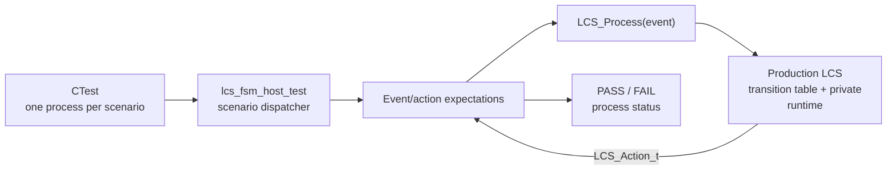

<h1 align="left">Native Host Tests</h1>

<p align="left">
  <big>
    Reproducible, hardware-independent behavioral validation for project<br>
    services that can execute with a native C compiler.
  </big>
</p>

> [!IMPORTANT]
> The current suite is a **black-box validation of the production Lock Control Service**. It compiles the real `Lock_Control_Service.c`, includes only its public header and observes only the `LCS_Action_t` returned by `LCS_Process()`. It does not copy the transition table, expose private state, mock the FSM or add test-only behavior to production code.

> [!NOTE]
> The test CMake project is intentionally separate from the STM32 firmware build. Configure it with a native host compiler, not with the repository's ARM firmware presets. Each scenario runs in a separate process so the private LCS singleton always starts from its statically initialized boot state.

---

## Table of Contents

* [1. Overview](#1-overview)
* [2. Test Objectives](#2-test-objectives)
* [3. Test Architecture](#3-test-architecture)

  * [3.1 Production Code Under Test](#31-production-code-under-test)
  * [3.2 Process Isolation](#32-process-isolation)
  * [3.3 Behavioral Oracle](#33-behavioral-oracle)
* [4. Directory Structure](#4-directory-structure)
* [5. Requirements](#5-requirements)
* [6. Build Configuration](#6-build-configuration)
* [7. LCS Scenario Catalog](#7-lcs-scenario-catalog)
* [8. Coverage Model](#8-coverage-model)

  * [8.1 FSM Behavior](#81-fsm-behavior)
  * [8.2 Runtime Policy](#82-runtime-policy)
  * [8.3 Invalid Input](#83-invalid-input)
* [9. Reproducible Execution](#9-reproducible-execution)

  * [9.1 Configure](#91-configure)
  * [9.2 Build](#92-build)
  * [9.3 Run All Scenarios](#93-run-all-scenarios)
  * [9.4 Expected Result](#94-expected-result)
* [10. Selecting and Debugging Scenarios](#10-selecting-and-debugging-scenarios)
* [11. Failure Diagnostics](#11-failure-diagnostics)
* [12. Extending the Suite When LCS Changes](#12-extending-the-suite-when-lcs-changes)

  * [12.1 Required Coverage by Change Type](#121-required-coverage-by-change-type)
  * [12.2 Adding a Scenario](#122-adding-a-scenario)
  * [12.3 Scenario Implementation Template](#123-scenario-implementation-template)
  * [12.4 Definition of Done](#124-definition-of-done)
* [13. Continuous Integration](#13-continuous-integration)
* [14. Limitations](#14-limitations)
* [15. Acceptance Criteria](#15-acceptance-criteria)
* [16. License](#16-license)

---

## 1. Overview

The `Tests` directory contains native executables for validating hardware-independent project logic on a development machine or CI runner. It is an independent CMake project and does not require the STM32 target, CubeMX-generated sources, HAL, an RTOS, a debugger probe or the `arm-none-eabi` toolchain.

The first suite validates the table-driven finite-state machine owned by the [Lock Control Service](../Libs/Services/Lock_Control/README.md). Its executable receives one scenario name, dispatches an ordered sequence of public LCS events and verifies the exact semantic action returned after each relevant event.

The suite is intended to serve two purposes:

1. Detect regressions in the current LCS transition and runtime-policy contract.
2. Provide a repeatable maintenance pattern when the FSM gains or changes states, events, guards, effects, actions or transitions.

---

## 2. Test Objectives

The LCS suite shall verify that:

* Boot prevents operational transitions until App Core reports a valid startup result.
* Critical initialization or persistence failures enter the fail-safe fault path.
* Normal credential entry routes successful authentication through unlock, door-position confirmation, explicit ready-to-lock authorization and restoration of locked idle.
* Credential-register requests reuse authentication while selecting the registration destination deterministically.
* First-boot registration bypasses authentication only when no credential is installed.
* Request-to-exit grants unlock from locked idle without credential authentication and then reuses the shared post-unlock relock path.
* Registration first entry, confirmation, comparison, persistence and success feedback occur in the required order.
* Cancellation, incomplete-candidate and timeout events select the action appropriate to the active entry phase.
* Authentication failures and registration mismatches use independent bounded counters.
* Request-to-exit access does not reset authentication-failure history.
* Both authenticated access and request-to-exit require the documented post-unlock door-confirmation and ready-to-lock sequence before locked idle is restored.
* Loss of door-position confirmation from `READY_TO_LOCK` returns to unlocked access and permits a fresh confirmation cycle.
* Final relock denial reported immediately after the logical locked transition also recovers to unlocked access through `LCS_EVENT_DOOR_POSITION_NOT_CONFIRMED`.
* Guard boundaries select the correct retry, lockout or abortion transition.
* Terminal transitions clear private pending purposes and counters where required.
* Invalid, sentinel, out-of-range and out-of-context events preserve the runtime context.
* Every accepted event returns the public semantic action declared by the LCS contract.

---

## 3. Test Architecture



### 3.1 Production Code Under Test

`Tests/CMakeLists.txt` builds the production source directly:

```text
Libs/Services/Lock_Control/Src/Lock_Control_Service.c
```

The test includes the production public interface:

```text
Libs/Services/Lock_Control/Inc/Lock_Control_Service.h
```

There is no alternate implementation selected by a test macro. A successful test therefore validates the same state-machine logic compiled into the firmware, subject only to the host compiler and platform-independent C semantics.

### 3.2 Process Isolation

LCS owns a private singleton and exposes no reset function. Running several scenarios sequentially in one process would make later scenarios depend on the final state of earlier scenarios.

CTest solves this without weakening encapsulation:

1. It launches `lcs_fsm_host_test <scenario>`.
2. Static initialization places the singleton in `LCS_STATE_BOOT`.
3. The executable runs exactly one scenario.
4. The process exits and its private state is discarded.
5. CTest launches a fresh process for the next scenario.

Do not add a production `LCS_ResetForTest()` API. If a future LCS architecture intentionally changes singleton ownership, revise this isolation strategy and document the new lifecycle here.

### 3.3 Behavioral Oracle

Every step uses the public relation:

```text
input LCS_Event_t -> LCS_Process() -> expected LCS_Action_t
```

Private state, pending purpose and counters are not inspected. When an internal effect is silent, the test proves it through a later observable decision. Examples:

* After `LCS_EVENT_INIT_OK` returns `LCS_ACTION_NONE`, acceptance of a credential-entry request proves locked idle was reached.
* After authentication success, later failures prove the consecutive-failure counter was reset.
* After lockout timeout, a new first failure proves the counter returned to zero.
* After registration abortion, a fresh first mismatch proves the mismatch counter was reset.
* After rejected registration authorization, a new authentication success selecting unlock proves the pending registration purpose was cleared.
* After two authentication failures, a complete request-to-exit unlock/relock cycle followed by a third failure entering lockout proves request-to-exit did not reset authentication-failure history.
* After `LCS_EVENT_READY_TO_LOCK` returns the granted-access relock action, acceptance of a new credential-entry request proves locked idle was restored.
* After `LCS_EVENT_DOOR_POSITION_NOT_CONFIRMED` silently recovers from `READY_TO_LOCK`, acceptance of a new door-position confirmation proves `ACCESS_UNLOCKED` was restored.
* After `LCS_EVENT_DOOR_POSITION_NOT_CONFIRMED` is reported immediately after the granted-access relock action, a complete new door-confirmation cycle proves the `LOCKED` recovery transition also restored `ACCESS_UNLOCKED`.

This keeps tests coupled to public behavior rather than private representation.

---

## 4. Directory Structure

```text
Tests/
├── CMakeLists.txt
├── README.md
└── Lock_Control/
    └── Lock_Control_Service_Test.c
```

| Path | Responsibility |
|---|---|
| `Tests/CMakeLists.txt` | Creates the native test target, applies strict compiler warnings, registers each scenario with CTest and supplies suite labels/timeouts. |
| `Tests/Lock_Control/Lock_Control_Service_Test.c` | Implements expectation support, reusable FSM paths, all isolated LCS scenarios and the command-line scenario dispatcher. |
| `Tests/README.md` | Defines objectives, reproducible execution, scenario coverage and the maintenance procedure for future changes. |

Generated files belong under a separate build directory such as `build/host-tests`; they shall not be added to `Tests`.

---

## 5. Requirements

The suite requires:

* CMake **3.22 or newer**.
* CTest from the same CMake installation.
* A native compiler with C11 support, such as GCC, Clang, AppleClang or MSVC.
* A shell or IDE terminal positioned anywhere from which the repository path is accessible.

It does not require:

* STM32CubeIDE.
* `arm-none-eabi-gcc`.
* STM32 HAL or CubeMX-generated target sources.
* Physical hardware or a debug probe.
* Third-party unit-test frameworks.

The configuration intentionally fails when CMake reports cross-compilation. This prevents an ARM executable from being registered as though it could run on the host.

---

## 6. Build Configuration

The standalone CMake project creates two targets:

| Target | Type | Purpose |
|---|---|---|
| `lcs_under_test` | Static library | Compiles the production LCS implementation with its public include directory. |
| `lcs_fsm_host_test` | Executable | Links the production service and provides the isolated scenario runner. |

Both targets require C11. Native warnings are treated as errors:

* GCC/Clang family: `-Wall -Wextra -Wpedantic -Werror`
* MSVC: `/W4 /WX`

Every CTest entry receives these properties:

| Property | Value | Purpose |
|---|---|---|
| Name prefix | `lcs.` | Groups the service's scenarios and gives filters a stable namespace. |
| Labels | `host;lcs;fsm` | Supports execution by environment, service or test class. |
| Timeout | `5` seconds | Detects an unexpected hang in logic that shall be synchronous and bounded. |

The firmware's root `Debug` and `Release` presets are not used because they intentionally select the STM32 ARM toolchain.

---

## 7. LCS Scenario Catalog

The following 17 scenarios are independently executable. Every scenario starts with a fresh process and therefore a fresh boot-state singleton.

| CTest name | Objective | Principal observable acceptance |
|---|---|---|
| `lcs.inactive_gate` | Verify that operational events cannot bypass boot and that successful initialization activates normal locked operation. | Representative operational events return `LCS_ACTION_NONE` before initialization; after `INIT_OK`, credential entry returns `BEGIN_CREDENTIAL_ENTRY_SESSION`. |
| `lcs.boot_failure` | Verify fail-safe initialization failure and the absorbing behavior of the fault state. | `INIT_FAIL` returns `REQUEST_CONTROLLED_RESET`; subsequent initialization and operational events return `LCS_ACTION_NONE`. |
| `lcs.normal_access` | Verify successful normal access from credential entry through authentication, unlock, door confirmation and relock. | Incomplete entry returns `REFRESH_CREDENTIAL_ENTRY_SESSION`; a complete candidate returns `REQUEST_AUTHENTICATION`; successful authentication returns `REQUEST_UNLOCK`; door confirmation progresses through `BEGIN_DOOR_SENSOR_CONFIRMATION` and `REQUEST_DOOR_SENSOR_CONFIRMATION`; `READY_TO_LOCK` finally returns `RETURN_TO_LOCKED_FROM_GRANTED_ACCESS`. |
| `lcs.normal_exit_paths` | Verify cancellation and inactivity-timeout handling during normal credential entry. | Cancellation returns `END_CREDENTIAL_ENTRY_SESSION`; a subsequent session timeout returns `RETURN_TO_LOCKED_FROM_ENTRY_TIMEOUT`. |
| `lcs.authentication_lockout` | Verify the three-failure authentication limit, lockout gate and counter reset after lockout timeout. | The first two rejected authentications return to locked idle; the third returns `ENTER_LOCKOUT`; credential entry is ignored during lockout; after `LOCKOUT_TIMEOUT`, one new failure remains below the limit. |
| `lcs.authentication_success_resets_counter` | Verify that successful authentication clears previously accumulated authentication failures. | Two rejected attempts followed by successful authentication and complete relock reset the failure history; two subsequent failures still return normally instead of entering lockout. |
| `lcs.registration_authorization_failure` | Verify rejected credential-registration authorization and cleanup of the pending registration purpose. | Registration authorization failure produces `DENY_ACCESS` and returns locked after denial feedback; the next normal authentication success returns `REQUEST_UNLOCK` rather than entering registration. |
| `lcs.first_boot_registration_success` | Verify successful initial credential registration when no credential is installed. | `CREDENTIAL_NOT_REGISTERED` directly starts first entry; matching stages request storage; storage success returns `END_CREDENTIAL_REGISTER_SAVING_SESSION`; registration completion returns `RETURN_TO_LOCKED_FROM_CREDENTIAL_REGISTER_SESSION`; normal credential entry is then accepted. |
| `lcs.authorized_registration_success` | Verify credential replacement after authenticating the currently installed credential. | Successful authorization starts first registration entry; matching stages request storage; storage success ends the saving session; completion returns to locked operation. |
| `lcs.registration_mismatch_limit` | Verify confirmation retries, abortion on the third mismatch and mismatch-counter reset between sessions. | The first two staging-validation failures return `REFRESH_CREDENTIAL_REGISTER_CONFIRM_ENTRY_SESSION`; the third returns `END_CREDENTIAL_REGISTER_CONFIRM_ENTRY_SESSION`; a new registration session receives a fresh first-mismatch retry. |
| `lcs.registration_first_entry_exit_paths` | Verify incomplete-entry refresh, cancellation and inactivity timeout while collecting the first new credential. | Incomplete input returns `REFRESH_CREDENTIAL_REGISTER_FIRST_ENTRY_SESSION`; both cancellation and timeout return `END_CREDENTIAL_REGISTER_FIRST_ENTRY_SESSION`. |
| `lcs.registration_confirm_entry_exit_paths` | Verify cancellation, incomplete-entry refresh and inactivity timeout during registration confirmation. | Cancellation returns `END_CREDENTIAL_REGISTER_CONFIRM_ENTRY_SESSION`; incomplete input returns `REFRESH_CREDENTIAL_REGISTER_CONFIRM_ENTRY_SESSION`; timeout also terminates confirmation with `END_CREDENTIAL_REGISTER_CONFIRM_ENTRY_SESSION`. |
| `lcs.registration_storage_failure` | Verify fail-safe behavior when persistent credential storage fails. | Storage failure returns `REQUEST_CONTROLLED_RESET`; subsequent registration-feedback and credential-entry events return `LCS_ACTION_NONE`, proving the fault path is absorbing. |
| `lcs.invalid_events_preserve_state` | Verify that sentinel, out-of-range and valid-but-out-of-context events are rejected without corrupting FSM progress. | Invalid and wrong-state events return `LCS_ACTION_NONE`; valid follow-up events still progress through authentication, unlock, door confirmation and `READY_TO_LOCK`, finally restoring locked idle. |
| `lcs.relock_not_confirmed_recovery` | Verify both recoverable `LCS_EVENT_DOOR_POSITION_NOT_CONFIRMED` transitions in the post-unlock relock handshake. | From `READY_TO_LOCK`, a not-confirmed event returns `LCS_ACTION_NONE` and a new door confirmation proves recovery to `ACCESS_UNLOCKED`; after `READY_TO_LOCK` has moved LCS to `LOCKED`, an immediate not-confirmed event again returns `NONE`, a fresh successful relock completes, and normal credential entry proves final locked-idle restoration. |
| `lcs.exit_request_access` | Verify request-to-exit access from locked idle without credential authentication and through the complete bounded relock path. | `EXIT_REQUEST` returns `EXIT_REQUEST_UNLOCK`; the shared door-confirmation sequence completes through `READY_TO_LOCK`; a subsequent credential-entry request proves locked idle was restored. |
| `lcs.exit_request_preserves_failure_counter` | Verify that request-to-exit access does not reset accumulated authentication-failure history. | Two authentication failures are followed by a successful request-to-exit unlock/relock cycle; the next authentication failure is still treated as the third consecutive failure and enters lockout. |
| `lcs.unlock_request_failure_recovery` | Verify semantic recovery when physical unlock execution fails but the safe lock fallback succeeds. | After successful authentication commits LCS to `ACCESS_UNLOCKED` and returns `REQUEST_UNLOCK`, `UNLOCK_REQUEST_FAILED` returns `RETURN_TO_LOCKED`; a subsequent credential-entry request proves normal locked idle was restored. |
| `lcs.unlock_recovery_critical_fault` | Verify fail-safe escalation when unlock execution fails and the safe lock fallback also fails. | After successful authentication commits LCS to `ACCESS_UNLOCKED`, `CRITICAL_FAULT` returns `REQUEST_CONTROLLED_RESET`; subsequent operational events return `LCS_ACTION_NONE`, proving the fault state is absorbing. |

The catalog is a behavioral specification. If an intentional LCS change modifies an expected action or terminal path, update the production documentation and this catalog in the same change as the test.

---

## 8. Coverage Model

### 8.1 FSM Behavior

The current 17-scenario catalog exercises the accepted event paths needed to validate:

* Normal boot, first-registration boot and initialization failure.
* Normal credential entry, incomplete-entry refresh, cancellation and inactivity timeout.
* Authentication request, successful unlock routing, access denial, failure counting and lockout.
* The shared post-unlock path through door-position confirmation, bounded confirmation timeout, explicit ready-to-lock authorization and restoration of locked idle.
* Recovery from lost door-position confirmation before final relock authorization, returning `READY_TO_LOCK` to `ACCESS_UNLOCKED`.
* Recovery from a final relock denial immediately after the logical `LOCKED` transition, returning to `ACCESS_UNLOCKED` without exposing private state.
* Request-to-exit unlock without credential authentication, followed by the same shared post-unlock relock path.
* Preservation of authentication-failure history across request-to-exit access.
* Credential-register authorization, first entry, confirmation entry, comparison, persistence and success feedback.
* Registration cancellation, incomplete-candidate refresh, timeout handling and mismatch retry limits.
* Successful and failed persistent-storage outcomes.
* Invalid, sentinel, out-of-range and valid-but-out-of-context event rejection with later proof of state preservation.
* Fault-state preservation after critical initialization or persistence failures.

This is behavioral coverage of the public event/action contract. The suite does not currently collect compiler instrumentation such as line, branch or MC/DC coverage, and this README intentionally does not infer an exact structural-transition count from the black-box scenarios alone.

### 8.2 Runtime Policy

The following private policy is validated indirectly:

| Policy | Boundary or invariant exercised |
|---|---|
| Pending unlock purpose | A normal authentication success selects `LCS_ACTION_REQUEST_UNLOCK` and enters the shared post-unlock path. |
| Pending registration purpose | A reclassified entry success selects registration first entry instead of unlock. |
| Pending-purpose cleanup | Cancellation, denial and terminal registration paths do not leak routing into the next operation. |
| Authentication failure count | Counts one, two and three select the two retry returns followed by lockout. |
| Failure-count saturation/reset | Lockout blocks entry and timeout restores a fresh failure budget. |
| Authentication-success reset | Successful credential authentication clears earlier consecutive failures. |
| Request-to-exit independence | Request-to-exit bypasses credential authentication and does not clear accumulated authentication failures. |
| Shared relock sequencing | Both authenticated access and request-to-exit require door confirmation and `LCS_EVENT_READY_TO_LOCK` before returning to locked idle. |
| Relock confirmation recovery | `LCS_EVENT_DOOR_POSITION_NOT_CONFIRMED` from `READY_TO_LOCK` silently restores `ACCESS_UNLOCKED`; a later accepted door confirmation proves the target state. |
| Final relock reconciliation | After `LCS_EVENT_READY_TO_LOCK` has selected the granted-access relock action and moved LCS to `LOCKED`, an immediate `LCS_EVENT_DOOR_POSITION_NOT_CONFIRMED` silently restores `ACCESS_UNLOCKED`. |
| Registration mismatch count | Mismatches one and two retry; mismatch three aborts. |
| Mismatch reset | A new registration session receives the full retry budget. |
| Service activation | Only the accepted startup transition enables operational behavior. |
| Fault absorption | Initialization or persistent-storage failure selects controlled reset and later ordinary events cannot restore operation. |

`LCS_ACTION_BEGIN_CREDENTIAL_REGISTER_SAVING_SESSION` is not expected by any current host scenario. If production begins returning that action, add an explicit observable path and update this catalog in the same change.

### 8.3 Invalid Input

The suite checks three input classes:

1. `LCS_EVENT_NONE` and `LCS_EVENT_COUNT`, which are non-dispatchable sentinels.
2. A value greater than `LCS_EVENT_COUNT`, which validates range rejection.
3. Valid event identifiers sent in the wrong state, which validate sparse-table behavior.

`LCS_EVENT_DOOR_POSITION_NOT_CONFIRMED` is additionally dispatched while authentication is active, where it shall be ignored. A subsequent `LCS_EVENT_AUTH_SUCCESS` proves that the new public event did not corrupt the authentication state.

An action of `LCS_ACTION_NONE` alone cannot always prove state preservation because some accepted transitions may also be intentionally silent. Each important invalid-input sequence is therefore followed by a valid state-specific event whose returned action proves the expected state remains active.

---

## 9. Reproducible Execution

The commands below assume the current directory is the repository root. The chosen binary directory is disposable and independent from the STM32 firmware build.

### 9.1 Configure

```sh
cmake -S Tests -B build/host-tests -DCMAKE_BUILD_TYPE=Debug
```

Configuration shall identify a native C compiler and finish with `Build files have been written to .../build/host-tests`.

For a completely separate reproduction without reusing an existing CMake cache, select a new directory:

```sh
cmake -S Tests -B build/host-tests-repro -DCMAKE_BUILD_TYPE=Debug
```

### 9.2 Build

```sh
cmake --build build/host-tests --parallel
```

For a multi-configuration generator such as Visual Studio, select the configuration explicitly:

```sh
cmake --build build/host-tests --config Debug
```

### 9.3 Run All Scenarios

```sh
ctest --test-dir build/host-tests --output-on-failure
```

For a multi-configuration generator:

```sh
ctest --test-dir build/host-tests -C Debug --output-on-failure
```

### 9.4 Expected Result

With the current scenario registry, a successful run ends with:

```text
100% tests passed, 0 tests failed out of 17
```

The exact duration, generator messages, compiler identification and test numbering may vary by host. The required reproducibility criteria are:

* Configuration succeeds with a native compiler.
* Both targets compile with warnings treated as errors.
* CTest discovers 17 scenarios.
* Every scenario returns a successful process status.

---

## 10. Selecting and Debugging Scenarios

List all registered tests without running them:

```sh
ctest --test-dir build/host-tests --show-only
```

Run all LCS tests by label:

```sh
ctest --test-dir build/host-tests --label-regex lcs --output-on-failure
```

Run one scenario with verbose CTest output:

```sh
ctest --test-dir build/host-tests --tests-regex '^lcs.registration_mismatch_limit$' --verbose
```

Invoke the executable directly on Linux or macOS:

```sh
./build/host-tests/lcs_fsm_host_test registration_mismatch_limit
```

For multi-configuration Windows builds, the executable is normally inside the selected configuration directory and has an `.exe` suffix:

```text
build/host-tests/Debug/lcs_fsm_host_test.exe registration_mismatch_limit
```

Running the executable without a scenario prints every accepted scenario name and exits with failure. This is intentional because an empty invocation validates nothing.

---

## 11. Failure Diagnostics

A failed action expectation reports:

```text
line <source-line>: <EVENT> returned action <actual-value>; expected <EXPECTED_ACTION> (<expected-value>)
[FAIL] <scenario-name>
```

Use the information in this order:

1. Open the reported line in `Lock_Control_Service_Test.c`.
2. Read the scenario's Doxygen objective and the nearby phase comment.
3. Compare the event/action pair with the transition table in the LCS README and production source.
4. Determine whether production behavior regressed or the public contract changed intentionally.
5. If intentional, update the LCS code, LCS documentation, scenario expectation and this catalog together.
6. Rebuild before rerunning because CTest does not compile changed sources automatically.

A fixture failure reports the exact expectation inside the fixture. The outer `LCS_TEST_REQUIRE()` does not print a second message, which keeps the first causal failure visible.

---

## 12. Extending the Suite When LCS Changes

### 12.1 Required Coverage by Change Type

| LCS change | Minimum test maintenance required |
|---|---|
| New transition using existing state/event/action | Add or extend a scenario to reach the source state, dispatch the event, verify the action and prove the target state with a follow-up event when necessary. |
| New private state | Test at least one entrance, every supported terminal exit, and representative invalid-event preservation in that state. |
| New public event | Test every state in which it is accepted and at least one relevant state in which it must be ignored. |
| New public action | Verify the exact transition that returns it. Application-side execution of the action belongs in App Core integration tests, not this black-box LCS suite. |
| New guard or changed limit | Exercise the value below the boundary, the boundary itself, and the reset/cleanup route. Test both transitions when guards share one source/event pair. |
| New internal effect | Prove the effect through a later public decision; do not expose private fields solely for the test. |
| Changed pending-operation routing | Exercise every pending purpose and prove cleanup by starting a different operation afterwards. |
| New recoverable terminal path | Verify its action, return to locked idle and acceptance of a new normal entry. |
| New critical failure path | Verify controlled-reset action and that ordinary events cannot resume operation. |
| Removed behavior | Remove obsolete expectations and confirm the old event is either ignored or routed according to the new documented contract. |

When multiple guards share the same source state and event, tests shall cover every mutually exclusive guard result. First-match table ordering is part of deterministic behavior and shall not leave an overlapping case untested.

### 12.2 Adding a Scenario

Use this sequence so a new scenario is independently runnable and documented:

1. Identify the contract change in `Lock_Control_Service.h`, `Lock_Control_Service.c` and the LCS README transition table.
2. Decide whether an existing scenario remains focused after adding the new path. Create a new scenario when the behavior has a distinct objective, boundary or terminal result.
3. Add a `static bool LCS_test_<scenario>(void)` function under **Test Scenarios**, following the naming convention used by the current suite.
4. Give the function a Doxygen `@brief`, a behavioral `@details`, and a documented Boolean return.
5. Start from boot and use the shortest public event path that establishes the required precondition.
6. Reuse a fixture only when its documented `@pre` and `@post` conditions exactly match the new scenario.
7. Verify every externally significant returned action with `LCS_TEST_EXPECT_ACTION()`.
8. Prove silent internal effects with a later observable transition.
9. Add the stable snake-case name to `LCS_TestCases` in the C file.
10. Add the same name to `LCS_FSM_TEST_SCENARIOS` in `Tests/CMakeLists.txt`.
11. Add the `lcs.<name>` entry and its objective to the [scenario catalog](#7-lcs-scenario-catalog).
12. Update the coverage and expected test count in this README when applicable.
13. Reconfigure CMake, rebuild and run the complete suite, not only the new scenario.

The scenario name exists in both C and CMake intentionally: the executable owns dispatch, while CMake must register each isolated process at configuration time. A name present in only one registry is a maintenance error.

### 12.3 Scenario Implementation Template

```c
/**
 * @brief   Validates <one externally meaningful behavior>.
 *
 * @details Describes the initial route, boundary or terminal condition and how later actions prove any private effect that cannot
 *          be observed directly.
 *
 * @return  true  - Every expected action matched the contract;
 * @return  false - At least one expectation or required fixture failed.
 */
static bool LCS_test_new_behavior(void)
{
    /* Arrange: establish the required state through public events. */
    LCS_TEST_REQUIRE(LCS_test_activate_locked());

    /* Act and assert: dispatch the changed event and require its public action. */
    LCS_TEST_EXPECT_ACTION(LCS_EVENT_EXAMPLE,
                           LCS_ACTION_EXAMPLE);

    /* Prove the target state or private cleanup through later behavior. */
    LCS_TEST_EXPECT_ACTION(LCS_EVENT_FOLLOW_UP,
                           LCS_ACTION_EXPECTED_FOLLOW_UP);

    return true;
}
```

Then register the same stable name in the C table:

```c
{"new_behavior", LCS_test_new_behavior}
```

and in the CMake list:

```cmake
set(LCS_FSM_TEST_SCENARIOS
    # Existing scenarios...
    new_behavior
)
```

The example event and action identifiers are placeholders; they shall not be copied into production unless they are part of the actual LCS contract.

### 12.4 Definition of Done

An LCS test change is complete only when:

* The scenario has one clear behavioral objective.
* Its function and any new fixture are fully documented.
* It starts from the deterministic boot condition and does not depend on scenario ordering.
* Every affected guard branch and boundary is exercised.
* Silent internal effects are proven through public follow-up behavior.
* Invalid or out-of-context handling is covered where the change introduces risk.
* The C registry, CMake registry and README catalog use the same scenario name.
* The documented scenario count matches CTest discovery.
* The host build passes with warnings treated as errors.
* The entire CTest suite passes with `--output-on-failure`.
* Production and LCS README documentation describe the same intentional behavior.

---

## 13. Continuous Integration

A CI job needs only the three reproducible commands:

```sh
cmake -S Tests -B build/host-tests-ci -DCMAKE_BUILD_TYPE=Debug
cmake --build build/host-tests-ci --parallel
ctest --test-dir build/host-tests-ci --output-on-failure
```

The process exit status from the build and CTest commands is sufficient to fail the job. No hardware runner is required.

For larger future test collections, labels can split execution without changing scenario names:

```sh
ctest --test-dir build/host-tests-ci --label-regex fsm --output-on-failure
```

Do not reuse a firmware cross-compilation build directory for host tests. A dedicated CI binary directory also prevents cached toolchain settings from making results environment-dependent.

---

## 14. Limitations

The current suite:

* Validates only hardware-independent LCS behavior, not App Core action execution.
* Does not invoke Credential Entry, Authentication, Credential Register, Credential Storage, Timeout Validation or hardware-facing services.
* Does not validate real-time durations; it dispatches already interpreted timeout events.
* Does not inspect display, sound, LED or lock-actuator side effects.
* Does not validate the physical request-to-exit button, door sensor or their GPIO/interrupt/debounce behavior; it dispatches already interpreted LCS events.
* Does not prove that App Executor emits `LCS_EVENT_DOOR_POSITION_NOT_CONFIRMED` only from synchronous relock validation; this suite validates only the LCS response once that semantic event is supplied.
* Does not perform concurrency or reentrancy testing because the LCS contract requires serialized calls.
* Does not collect structural code-coverage metrics.
* Does not fuzz the complete numeric event domain.
* Relies on a separate process for singleton reset.

These boundaries are intentional. Integration tests shall validate App Core mappings and action execution, while target tests shall validate timing and hardware interaction.

---

## 15. Acceptance Criteria

The native LCS suite is accepted when:

* A fresh native configuration succeeds without STM32 dependencies.
* The production LCS source and host runner compile as C11 with no warnings.
* CTest discovers all names present in the documented scenario catalog.
* Each scenario starts in an independent process.
* All current transition paths, guard boundaries and terminal cleanup policies remain covered.
* Invalid events demonstrably preserve state.
* All 17 current scenarios pass.
* Any future LCS contract change updates code, tests, scenario registry and documentation together.

---

## 16. License

This test suite is part of the:

```text
Electronic Lock Project
```

and follows the project's license terms.
